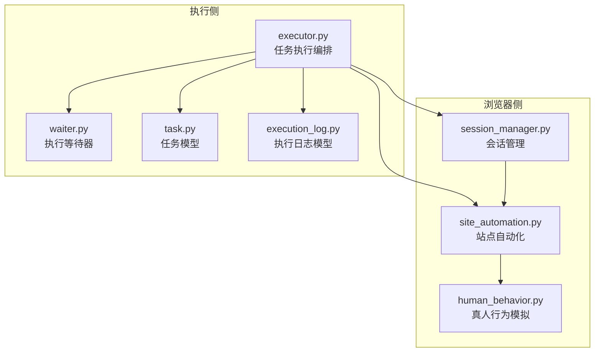
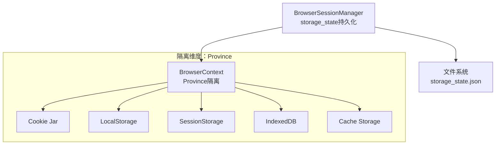
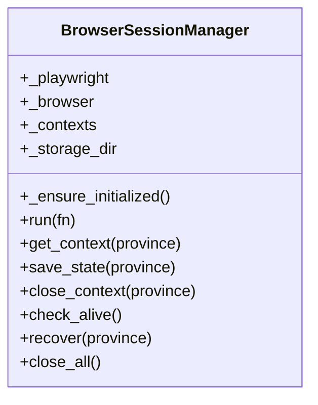
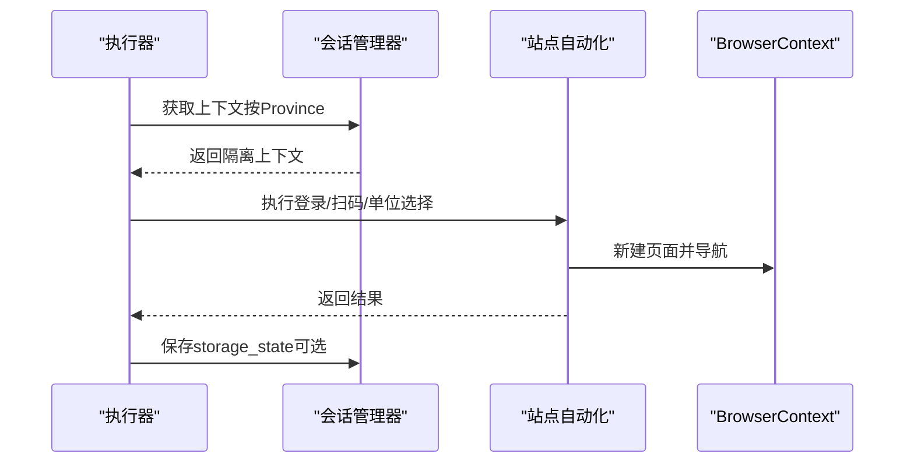
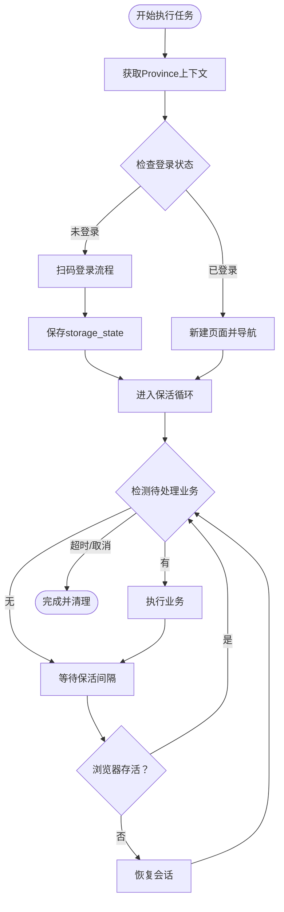
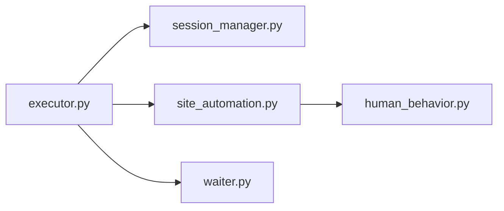

# 浏览器存储隔离层

<cite>
**本文引用的文件**
- [session_manager.py](file://CCC_RPA_API/app/browser/session_manager.py)
- [site_automation.py](file://CCC_RPA_API/app/browser/site_automation.py)
- [human_behavior.py](file://CCC_RPA_API/app/browser/human_behavior.py)
- [executor.py](file://CCC_RPA_API/app/services/executor.py)
- [waiter.py](file://CCC_RPA_API/app/browser/waiter.py)
- [task.py](file://CCC_RPA_API/app/models/task.py)
- [execution_log.py](file://CCC_RPA_API/app/models/execution_log.py)
</cite>

## 目录
1. [简介](#简介)
2. [项目结构](#项目结构)
3. [核心组件](#核心组件)
4. [架构总览](#架构总览)
5. [组件详解](#组件详解)
6. [依赖关系分析](#依赖关系分析)
7. [性能考量](#性能考量)
8. [故障排查指南](#故障排查指南)
9. [结论](#结论)
10. [附录](#附录)

## 简介
本文件面向“浏览器存储隔离层”的设计与实现，聚焦于以下目标：
- Cookie隔离：每个会话拥有独立的Cookie存储，跨会话Cookie完全不可访问。
- LocalStorage、SessionStorage、IndexedDB、Cache Storage等Web存储API的隔离实现。
- 存储命名空间隔离、数据库文件隔离、存储访问权限控制的技术细节。
- 存储隔离的实现原理、数据持久化策略、存储销毁时的数据清理机制。
- 存储隔离效果验证方法、常见问题诊断与解决方案。

本项目通过Playwright的BrowserContext进行会话级隔离，并以“省份”作为隔离维度，结合storage_state持久化与上下文生命周期管理，实现端到端的存储隔离能力。

## 项目结构
围绕浏览器存储隔离的关键代码位于“浏览器侧”与“执行侧”两大模块：
- 浏览器侧：会话管理、站点自动化、真人行为模拟、执行等待器
- 执行侧：任务执行编排、线程池调度、WebSocket广播、日志与状态持久化

图表来源
- [executor.py:1-319](file://CCC_RPA_API/app/services/executor.py#L1-L319)
- [session_manager.py:1-186](file://CCC_RPA_API/app/browser/session_manager.py#L1-L186)
- [site_automation.py:1-743](file://CCC_RPA_API/app/browser/site_automation.py#L1-L743)
- [human_behavior.py:1-86](file://CCC_RPA_API/app/browser/human_behavior.py#L1-L86)
- [waiter.py:1-84](file://CCC_RPA_API/app/browser/waiter.py#L1-L84)
- [task.py:1-25](file://CCC_RPA_API/app/models/task.py#L1-L25)
- [execution_log.py:1-17](file://CCC_RPA_API/app/models/execution_log.py#L1-L17)

章节来源
- [executor.py:1-319](file://CCC_RPA_API/app/services/executor.py#L1-L319)
- [session_manager.py:1-186](file://CCC_RPA_API/app/browser/session_manager.py#L1-L186)

## 核心组件
- 会话管理器（BrowserSessionManager）
  - 作用：按“省份”维度创建与复用BrowserContext；持久化storage_state；统一在专用工作线程中执行Playwright操作；提供恢复与关闭能力。
  - 关键点：storage_state持久化目录、上下文生命周期、线程安全与幂等初始化。
- 站点自动化（SiteAutomation）
  - 作用：封装具体站点的登录、扫码、单位选择、业务保活等流程；在PW线程中执行页面操作。
- 真人行为模拟（HumanBehavior）
  - 作用：模拟人类点击、输入、滚动、等待等行为，降低被风控概率。
- 执行器（Executor）
  - 作用：编排任务执行流程，协调会话管理、等待器、WebSocket广播与数据库日志。
- 等待器（ExecutionWaiter）
  - 作用：基于Event实现的阻塞/取消/检查机制，支撑扫码登录与业务保活等待。
- 数据模型（Task、TaskExecutionLog）
  - 作用：任务状态与执行日志的持久化。

章节来源
- [session_manager.py:10-186](file://CCC_RPA_API/app/browser/session_manager.py#L10-L186)
- [site_automation.py:16-743](file://CCC_RPA_API/app/browser/site_automation.py#L16-L743)
- [human_behavior.py:12-86](file://CCC_RPA_API/app/browser/human_behavior.py#L12-L86)
- [executor.py:78-315](file://CCC_RPA_API/app/services/executor.py#L78-L315)
- [waiter.py:7-84](file://CCC_RPA_API/app/browser/waiter.py#L7-L84)
- [task.py:8-25](file://CCC_RPA_API/app/models/task.py#L8-L25)
- [execution_log.py:7-17](file://CCC_RPA_API/app/models/execution_log.py#L7-L17)

## 架构总览
下图展示存储隔离在系统中的落地方式：以Province为隔离维度，每个Province对应一个独立的BrowserContext，其内部的Cookie、LocalStorage、SessionStorage、IndexedDB、Cache Storage均相互隔离；storage_state用于持久化与恢复。

图表来源
- [session_manager.py:19-23](file://CCC_RPA_API/app/browser/session_manager.py#L19-L23)
- [session_manager.py:112-125](file://CCC_RPA_API/app/browser/session_manager.py#L112-L125)
- [session_manager.py:133-134](file://CCC_RPA_API/app/browser/session_manager.py#L133-L134)

## 组件详解

### 会话管理器（BrowserSessionManager）
- 存储隔离实现要点
  - 上下文隔离：按Province创建独立BrowserContext，不同Province之间默认无共享状态。
  - storage_state持久化：首次创建上下文时根据Province拼接storage_state文件路径；若存在历史文件则自动加载，实现会话恢复。
  - 生命周期管理：提供保存状态、关闭上下文、恢复会话、关闭全部等方法，确保销毁时清理资源。
- 数据持久化策略
  - 文件命名：Province + “_state.json”，存放storage_state。
  - 目录位置：项目根/data/browser_states。
- 访问权限控制
  - 仅通过会话管理器提供的接口访问上下文，避免外部直接共享同一上下文实例。
- 销毁与清理
  - 关闭上下文时释放其内部存储；恢复会话时清空旧上下文并重建，确保无残留。

图表来源
- [session_manager.py:10-186](file://CCC_RPA_API/app/browser/session_manager.py#L10-L186)

章节来源
- [session_manager.py:10-186](file://CCC_RPA_API/app/browser/session_manager.py#L10-L186)

### 站点自动化（SiteAutomation）
- 存储隔离影响
  - 在各自Province的上下文中执行页面操作，不会与其他Province的Cookie、Storage产生交叉污染。
- 关键流程
  - 登录状态检查、扫码登录、单位列表抓取、单位选择、业务保活、页面保活等。
- 与会话管理协作
  - 通过BrowserSessionManager获取/创建上下文，保证每个步骤都在正确的隔离环境中执行。

图表来源
- [executor.py:104-150](file://CCC_RPA_API/app/services/executor.py#L104-L150)
- [session_manager.py:99-126](file://CCC_RPA_API/app/browser/session_manager.py#L99-L126)
- [site_automation.py:38-58](file://CCC_RPA_API/app/browser/site_automation.py#L38-L58)

章节来源
- [site_automation.py:16-743](file://CCC_RPA_API/app/browser/site_automation.py#L16-L743)
- [executor.py:78-315](file://CCC_RPA_API/app/services/executor.py#L78-L315)

### 真人行为模拟（HumanBehavior）
- 作用
  - 在页面操作中模拟人类行为，减少被风控概率，间接保障会话稳定性。
- 对存储隔离的影响
  - 仅在当前上下文内生效，不影响其他Province的存储。

章节来源
- [human_behavior.py:12-86](file://CCC_RPA_API/app/browser/human_behavior.py#L12-L86)

### 执行器（Executor）
- 作用
  - 编排任务执行全流程：初始化浏览器、检查登录、扫码登录、保存状态、进入保活循环、完成任务。
- 存储隔离体现
  - 通过会话管理器获取Province上下文，确保各阶段操作在正确隔离环境中执行。
  - 在保活循环中定期检查浏览器存活，必要时恢复会话，保证存储状态一致性。

图表来源
- [executor.py:78-315](file://CCC_RPA_API/app/services/executor.py#L78-L315)
- [session_manager.py:147-170](file://CCC_RPA_API/app/browser/session_manager.py#L147-L170)

章节来源
- [executor.py:78-315](file://CCC_RPA_API/app/services/executor.py#L78-L315)

### 等待器（ExecutionWaiter）
- 作用
  - 提供阻塞等待、取消、检查信号的能力，支撑扫码登录与保活等待。
- 与存储隔离的关系
  - 仅管理执行阶段的同步与异步信号，不涉及存储层面的隔离。

章节来源
- [waiter.py:7-84](file://CCC_RPA_API/app/browser/waiter.py#L7-L84)

### 数据模型（Task、TaskExecutionLog）
- 作用
  - 记录任务状态与执行日志，便于追踪与审计。
- 与存储隔离的关系
  - 仅持久化任务元数据，不涉及浏览器存储隔离逻辑。

章节来源
- [task.py:8-25](file://CCC_RPA_API/app/models/task.py#L8-L25)
- [execution_log.py:7-17](file://CCC_RPA_API/app/models/execution_log.py#L7-L17)

## 依赖关系分析
- 低耦合高内聚
  - 执行器依赖会话管理器获取上下文，依赖站点自动化执行页面操作，依赖等待器进行交互等待。
  - 站点自动化依赖真人行为模拟提升稳定性。
- 关键依赖链
  - 任务执行 → 会话管理（上下文隔离） → 页面操作（Cookie/Storage隔离） → 保存状态（storage_state持久化）

图表来源
- [executor.py:13-15](file://CCC_RPA_API/app/services/executor.py#L13-L15)
- [session_manager.py:5](file://CCC_RPA_API/app/browser/session_manager.py#L5)
- [site_automation.py:5](file://CCC_RPA_API/app/browser/site_automation.py#L5)
- [human_behavior.py:5](file://CCC_RPA_API/app/browser/human_behavior.py#L5)
- [waiter.py:1-84](file://CCC_RPA_API/app/browser/waiter.py#L1-L84)

章节来源
- [executor.py:1-319](file://CCC_RPA_API/app/services/executor.py#L1-L319)
- [session_manager.py:1-186](file://CCC_RPA_API/app/browser/session_manager.py#L1-L186)

## 性能考量
- 线程模型
  - 专用Playwright工作线程避免UI线程阻塞，提高并发与稳定性。
- I/O与持久化
  - storage_state文件读写集中在专用线程，避免频繁磁盘I/O阻塞主线程。
- 会话复用
  - 按Province缓存上下文，减少重复创建成本；必要时通过恢复机制重建，保证长期运行稳定性。
- 保活策略
  - 随机滚动、随机点击、随机等待等行为降低风控概率，减少重试与失败带来的额外开销。

## 故障排查指南
- 症状：跨会话Cookie泄露或数据串扰
  - 排查：确认是否使用了同一Province上下文；检查storage_state文件是否存在跨Province混用。
  - 解决：确保按Province区分上下文；删除历史storage_state文件后重新登录。
- 症状：扫码登录后仍提示未登录
  - 排查：检查storage_state保存是否成功；确认会话恢复流程是否正常。
  - 解决：在扫码完成后显式调用保存storage_state；必要时触发恢复会话。
- 症状：保活循环中断或浏览器异常
  - 排查：检查浏览器存活检查与恢复逻辑；确认线程池与事件循环状态。
  - 解决：在保活循环中定期调用存活检查；异常时触发恢复并重新打开页面。
- 症状：页面元素定位失败
  - 排查：确认页面已加载完成；检查真人行为模拟是否导致元素状态变化。
  - 解决：增加等待条件与重试策略；优化选择器与回退方案。

章节来源
- [session_manager.py:129-135](file://CCC_RPA_API/app/browser/session_manager.py#L129-L135)
- [executor.py:191-194](file://CCC_RPA_API/app/services/executor.py#L191-L194)
- [executor.py:208-266](file://CCC_RPA_API/app/services/executor.py#L208-L266)

## 结论
本项目通过“Province维度的BrowserContext隔离”与“storage_state持久化”，实现了Cookie与Web存储API（LocalStorage、SessionStorage、IndexedDB、Cache Storage）的强隔离。配合专用工作线程、会话恢复与保活机制，确保了长时间运行下的稳定性与安全性。建议在生产环境进一步完善：
- 明确storage_state文件的加密策略与访问控制
- 增加存储隔离的自动化验证与回归测试
- 对复杂站点场景补充更丰富的选择器与回退策略

## 附录

### 存储隔离验证方法
- Cookie隔离验证
  - 在两个不同Province上下文中分别登录不同账号，检查彼此Cookie是否不可见。
- LocalStorage/SessionStorage隔离验证
  - 在两个Province上下文中分别设置同名键值，重启后验证是否相互独立。
- IndexedDB隔离验证
  - 在两个Province上下文中分别创建同名数据库/对象仓库，重启后验证是否相互独立。
- Cache Storage隔离验证
  - 在两个Province上下文中分别缓存同名资源，重启后验证缓存是否相互独立。

### 常见问题与最佳实践
- 问题：storage_state文件过大
  - 建议：定期清理无用缓存与历史状态；控制会话保留时间。
- 问题：跨线程访问导致竞态
  - 建议：严格通过会话管理器接口访问上下文；避免直接共享实例。
- 问题：页面加载不稳定
  - 建议：增加等待条件与重试；使用真人行为模拟降低风控概率。