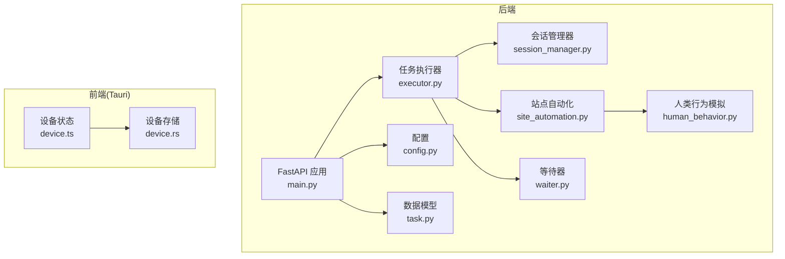
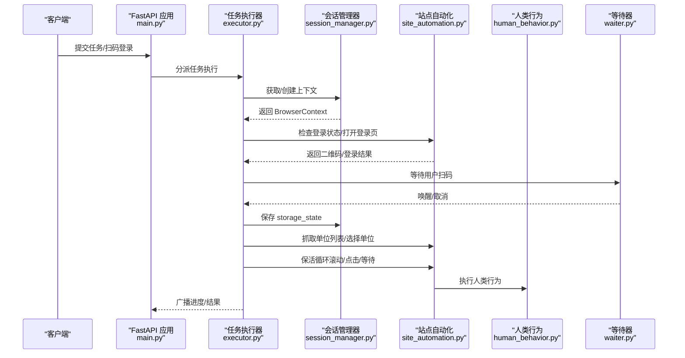
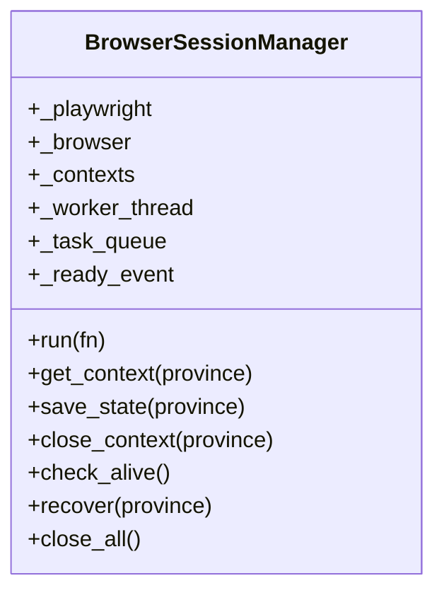
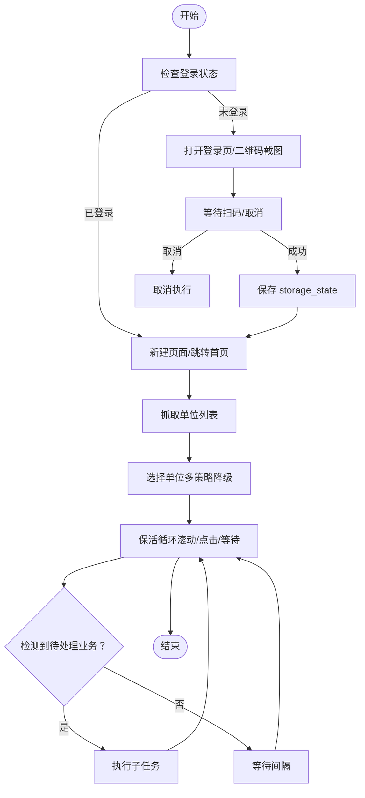
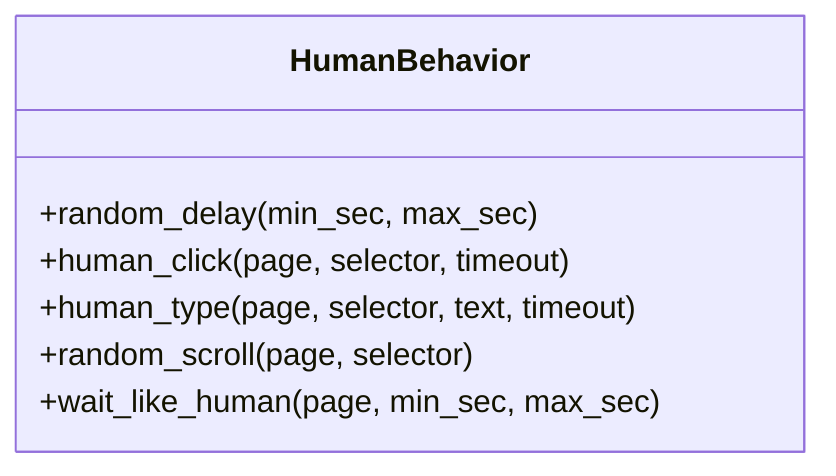
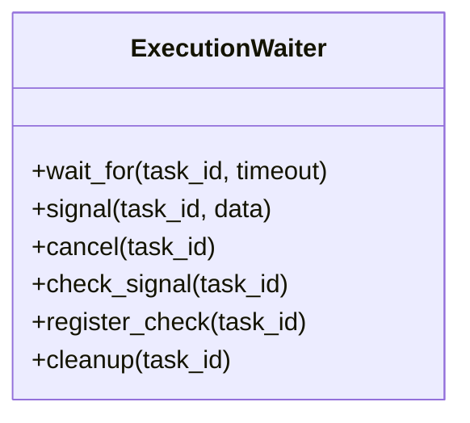
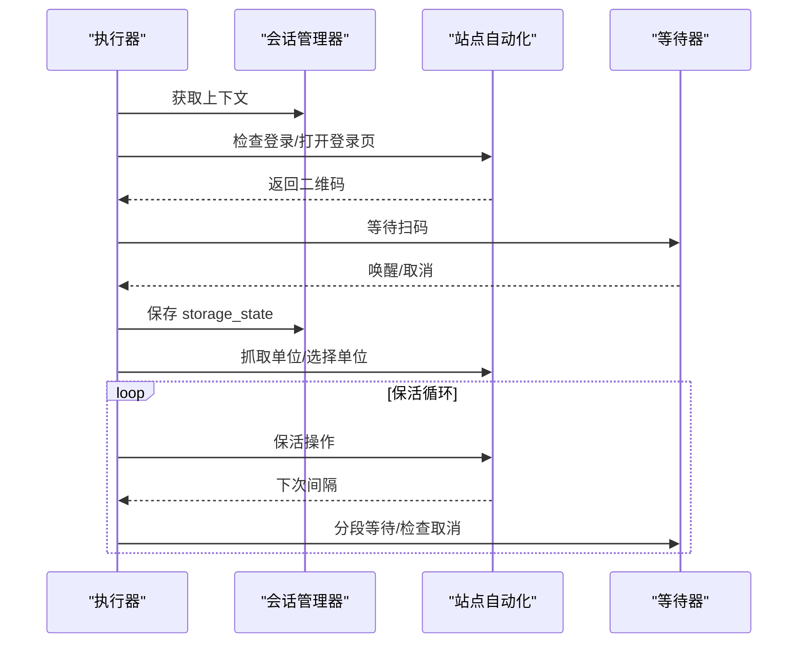
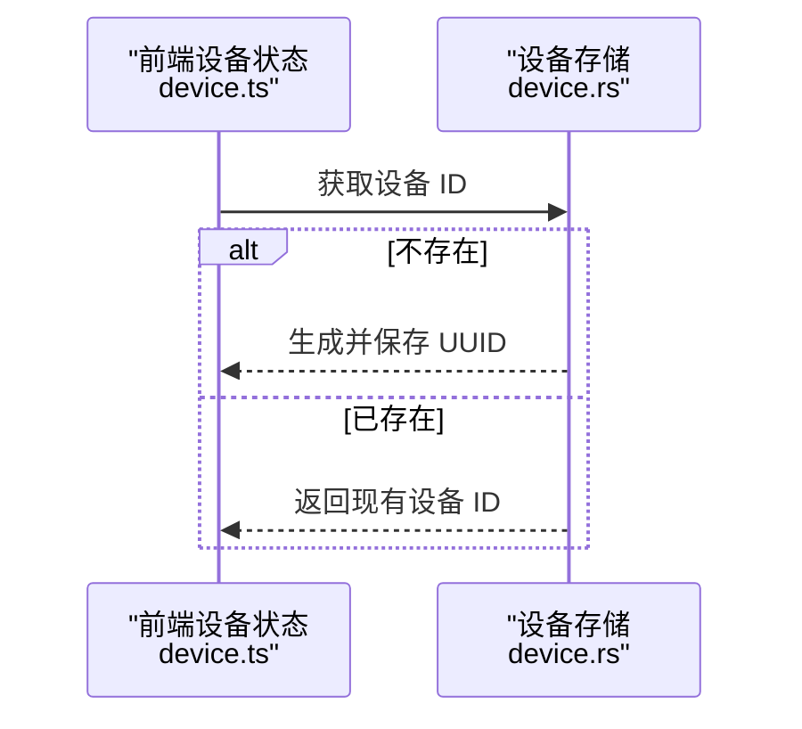
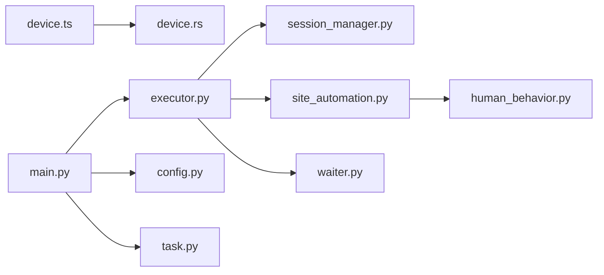

# 浏览器指纹隔离层

<cite>
**本文档引用的文件**
- [session_manager.py](file://CCC_RPA_API/app/browser/session_manager.py)
- [site_automation.py](file://CCC_RPA_API/app/browser/site_automation.py)
- [human_behavior.py](file://CCC_RPA_API/app/browser/human_behavior.py)
- [waiter.py](file://CCC_RPA_API/app/browser/waiter.py)
- [executor.py](file://CCC_RPA_API/app/services/executor.py)
- [main.py](file://CCC_RPA_API/app/main.py)
- [device.rs](file://CCC-BrowserV4/src-tauri/src/device.rs)
- [device.ts](file://CCC-BrowserV4/frontend/src/stores/device.ts)
- [task.py](file://CCC_RPA_API/app/models/task.py)
- [config.py](file://CCC_RPA_API/app/config.py)
</cite>

## 目录
1. [简介](#简介)
2. [项目结构](#项目结构)
3. [核心组件](#核心组件)
4. [架构总览](#架构总览)
5. [详细组件分析](#详细组件分析)
6. [依赖分析](#依赖分析)
7. [性能考虑](#性能考虑)
8. [故障排查指南](#故障排查指南)
9. [结论](#结论)
10. [附录](#附录)

## 简介
本文件面向“浏览器指纹隔离层”的设计与实现，聚焦于以下目标：
- 为每个会话提供唯一且稳定的用户代理（UA）标识，避免跨会话指纹关联
- 在浏览器上下文中实施多维度指纹伪装：WebGL 渲染上下文隔离、Canvas 指纹随机化、AudioContext 音频指纹伪造、字体列表随机化、时区与屏幕分辨率模拟
- 通过人类行为模拟（鼠标轨迹、键盘输入节奏、滚动与等待）降低自动化检测风险
- 通过 CDP/Chromium 参数与初始化脚本抹除自动化痕迹
- 提供指纹一致性测试方法、指纹泄露检测工具使用建议与反爬虫绕过最佳实践

本项目以 Python 后端（FastAPI + SQLAlchemy）+ Playwright + Tauri 前端为技术栈，围绕“会话级隔离”“线程化执行”“人类行为模拟”三大支柱构建。

## 项目结构
后端采用分层组织：
- API 层：FastAPI 应用与路由注册
- 服务层：任务执行器（线程池调度、会话管理、保活循环）
- 浏览器层：会话管理器（Playwright + Chromium）、站点自动化脚本、人类行为模拟、等待器
- 数据模型：任务、日志、设备等 ORM 映射
- 配置：数据库连接配置
- 前端（Tauri）：设备标识持久化与前端状态管理

图表来源
- [main.py:30-127](file://CCC_RPA_API/app/main.py#L30-L127)
- [executor.py:1-319](file://CCC_RPA_API/app/services/executor.py#L1-L319)
- [session_manager.py:10-186](file://CCC_RPA_API/app/browser/session_manager.py#L10-L186)
- [site_automation.py:16-743](file://CCC_RPA_API/app/browser/site_automation.py#L16-L743)
- [human_behavior.py:12-86](file://CCC_RPA_API/app/browser/human_behavior.py#L12-L86)
- [waiter.py:7-84](file://CCC_RPA_API/app/browser/waiter.py#L7-L84)
- [device.ts:1-40](file://CCC-BrowserV4/frontend/src/stores/device.ts#L1-L40)
- [device.rs:1-32](file://CCC-BrowserV4/src-tauri/src/device.rs#L1-L32)
- [task.py:1-25](file://CCC_RPA_API/app/models/task.py#L1-L25)
- [config.py:1-22](file://CCC_RPA_API/app/config.py#L1-L22)

章节来源
- [main.py:30-127](file://CCC_RPA_API/app/main.py#L30-L127)
- [executor.py:1-319](file://CCC_RPA_API/app/services/executor.py#L1-L319)
- [session_manager.py:10-186](file://CCC_RPA_API/app/browser/session_manager.py#L10-L186)
- [site_automation.py:16-743](file://CCC_RPA_API/app/browser/site_automation.py#L16-L743)
- [human_behavior.py:12-86](file://CCC_RPA_API/app/browser/human_behavior.py#L12-L86)
- [waiter.py:7-84](file://CCC_RPA_API/app/browser/waiter.py#L7-L84)
- [device.ts:1-40](file://CCC-BrowserV4/frontend/src/stores/device.ts#L1-L40)
- [device.rs:1-32](file://CCC-BrowserV4/src-tauri/src/device.rs#L1-L32)
- [task.py:1-25](file://CCC_RPA_API/app/models/task.py#L1-L25)
- [config.py:1-22](file://CCC_RPA_API/app/config.py#L1-L22)

## 核心组件
- 会话管理器（BrowserSessionManager）
  - 专用线程承载 Playwright/Chromium 生命周期，避免与 asyncio 冲突
  - 按省份维护 BrowserContext，持久化 storage_state，支持恢复与回收
  - 初始化时注入去自动化脚本，设置固定 UA 与视口尺寸
- 站点自动化（SiteAutomation）
  - 登录状态检查、二维码登录流程、单位列表抓取、单位选择与跳转
  - 页面保活：滚动、随机点击、随机移动、等待，避免超时被回收
  - 待处理业务检测与子任务执行
- 人类行为模拟（HumanBehavior）
  - 真人点击、打字节奏、滚动、等待，降低行为特征异常
- 等待器（ExecutionWaiter）
  - 基于 threading.Event 的任务等待/唤醒/取消机制，支持保活循环中断
- 任务执行器（executor）
  - 线程池驱动，协调会话、等待、保活与业务执行，广播进度与错误
- 设备标识（Tauri 前端 + Rust 存储）
  - 前端 Pinia 状态管理，Rust 插件持久化 UUID 设备 ID

章节来源
- [session_manager.py:10-186](file://CCC_RPA_API/app/browser/session_manager.py#L10-L186)
- [site_automation.py:16-743](file://CCC_RPA_API/app/browser/site_automation.py#L16-L743)
- [human_behavior.py:12-86](file://CCC_RPA_API/app/browser/human_behavior.py#L12-L86)
- [waiter.py:7-84](file://CCC_RPA_API/app/browser/waiter.py#L7-L84)
- [executor.py:1-319](file://CCC_RPA_API/app/services/executor.py#L1-L319)
- [device.ts:1-40](file://CCC-BrowserV4/frontend/src/stores/device.ts#L1-L40)
- [device.rs:1-32](file://CCC-BrowserV4/src-tauri/src/device.rs#L1-L32)

## 架构总览
下图展示从任务提交到浏览器保活执行的端到端流程，以及指纹隔离的关键节点。

图表来源
- [main.py:119-127](file://CCC_RPA_API/app/main.py#L119-L127)
- [executor.py:78-315](file://CCC_RPA_API/app/services/executor.py#L78-L315)
- [session_manager.py:98-126](file://CCC_RPA_API/app/browser/session_manager.py#L98-L126)
- [site_automation.py:38-192](file://CCC_RPA_API/app/browser/site_automation.py#L38-L192)
- [human_behavior.py:12-86](file://CCC_RPA_API/app/browser/human_behavior.py#L12-L86)
- [waiter.py:14-44](file://CCC_RPA_API/app/browser/waiter.py#L14-L44)

## 详细组件分析

### 会话管理器（BrowserSessionManager）
- 专用线程与队列：在守护线程中启动 Playwright/Chromium，所有 Playwright 操作通过队列投递，避免主线程事件循环冲突
- 上下文隔离：按省份维护 BrowserContext；若上下文失效自动重建；支持 storage_state 持久化与恢复
- 去自动化与指纹基线：
  - 启动参数禁用自动化特征
  - 初始化脚本隐藏 webdriver 标识
  - 固定 UA 与视口尺寸，作为指纹基线

图表来源
- [session_manager.py:10-186](file://CCC_RPA_API/app/browser/session_manager.py#L10-L186)

章节来源
- [session_manager.py:10-186](file://CCC_RPA_API/app/browser/session_manager.py#L10-L186)

### 站点自动化（SiteAutomation）
- 登录流程：统一登录页直连失败时退回首页 JS 强制点击，二维码加载后截图返回前端
- 单位选择：多选择器降级策略 + JS 回退，支持按名称/ID/索引匹配，点击前进行鼠标轨迹与延迟
- 页面保活：随机滚动、随机点击刷新、鼠标随机移动、键盘 Tab、模拟阅读等待；避免导航与表单提交
- 待处理业务检测：基于徽章计数与关键词匹配，支持多种业务类型

图表来源
- [site_automation.py:38-743](file://CCC_RPA_API/app/browser/site_automation.py#L38-L743)

章节来源
- [site_automation.py:16-743](file://CCC_RPA_API/app/browser/site_automation.py#L16-L743)

### 人类行为模拟（HumanBehavior）
- 真人点击：元素可见后，鼠标移动至中心附近（含随机偏移）再点击，随后随机延迟
- 真人打字：逐字符输入，字符间延迟 50~200ms
- 随机滚动：多次随机滚动像素，每次滚动后随机延迟
- 随机等待：模拟阅读等待时间

图表来源
- [human_behavior.py:12-86](file://CCC_RPA_API/app/browser/human_behavior.py#L12-L86)

章节来源
- [human_behavior.py:12-86](file://CCC_RPA_API/app/browser/human_behavior.py#L12-L86)

### 等待器（ExecutionWaiter）
- 任务等待/唤醒/取消：基于线程安全字典与 Event，支持非阻塞检查与保活循环中断
- 注册检查：为保活循环等场景注册可检查事件
- 清理：任务完成后释放资源

图表来源
- [waiter.py:7-84](file://CCC_RPA_API/app/browser/waiter.py#L7-L84)

章节来源
- [waiter.py:7-84](file://CCC_RPA_API/app/browser/waiter.py#L7-L84)

### 任务执行器（executor）
- 线程池：分离任务执行与等待逻辑，避免阻塞 Playwright 工作线程
- 会话恢复：浏览器异常时自动恢复，重新打开页面并继续执行
- 广播：通过 WebSocket 向前端推送进度、二维码、错误与任务状态更新

图表来源
- [executor.py:78-315](file://CCC_RPA_API/app/services/executor.py#L78-L315)

章节来源
- [executor.py:1-319](file://CCC_RPA_API/app/services/executor.py#L1-L319)

### 设备标识（Tauri 前端 + Rust 存储）
- 前端：Pinia 状态管理，首次访问通过桥接调用获取设备 ID
- 后端：Rust 插件持久化存储，不存在则生成 UUID 并保存

图表来源
- [device.ts:12-38](file://CCC-BrowserV4/frontend/src/stores/device.ts#L12-L38)
- [device.rs:6-31](file://CCC-BrowserV4/src-tauri/src/device.rs#L6-L31)

章节来源
- [device.ts:1-40](file://CCC-BrowserV4/frontend/src/stores/device.ts#L1-L40)
- [device.rs:1-32](file://CCC-BrowserV4/src-tauri/src/device.rs#L1-L32)

## 依赖分析
- 组件耦合
  - 任务执行器依赖会话管理器与站点自动化，形成清晰的控制流
  - 人类行为模拟被站点自动化调用，增强行为真实性
  - 等待器贯穿执行器与保活循环，提供异步协作能力
- 外部依赖
  - Playwright/Chromium：浏览器引擎与上下文生命周期管理
  - Tauri：桌面端桥接与本地存储插件
  - FastAPI/WebSocket：前后端通信与状态广播

图表来源
- [executor.py:13-15](file://CCC_RPA_API/app/services/executor.py#L13-L15)
- [session_manager.py:5](file://CCC_RPA_API/app/browser/session_manager.py#L5)
- [site_automation.py:5](file://CCC_RPA_API/app/browser/site_automation.py#L5)
- [human_behavior.py:28](file://CCC_RPA_API/app/browser/human_behavior.py#L28)
- [waiter.py:1](file://CCC_RPA_API/app/browser/waiter.py#L1)
- [device.ts:3](file://CCC-BrowserV4/frontend/src/stores/device.ts#L3)
- [device.rs:2](file://CCC-BrowserV4/src-tauri/src/device.rs#L2)
- [main.py:2](file://CCC_RPA_API/app/main.py#L2)
- [config.py:1](file://CCC_RPA_API/app/config.py#L1)
- [task.py:1](file://CCC_RPA_API/app/models/task.py#L1)

章节来源
- [executor.py:1-319](file://CCC_RPA_API/app/services/executor.py#L1-L319)
- [session_manager.py:1-186](file://CCC_RPA_API/app/browser/session_manager.py#L1-L186)
- [site_automation.py:1-743](file://CCC_RPA_API/app/browser/site_automation.py#L1-L743)
- [human_behavior.py:1-86](file://CCC_RPA_API/app/browser/human_behavior.py#L1-L86)
- [waiter.py:1-84](file://CCC_RPA_API/app/browser/waiter.py#L1-L84)
- [device.ts:1-40](file://CCC-BrowserV4/frontend/src/stores/device.ts#L1-L40)
- [device.rs:1-32](file://CCC-BrowserV4/src-tauri/src/device.rs#L1-L32)
- [main.py:1-127](file://CCC_RPA_API/app/main.py#L1-L127)
- [config.py:1-22](file://CCC_RPA_API/app/config.py#L1-L22)
- [task.py:1-25](file://CCC_RPA_API/app/models/task.py#L1-L25)

## 性能考虑
- 线程隔离与队列化执行：避免 Playwright 同步 API 与 asyncio 事件循环冲突，提升稳定性
- 保活策略：随机滚动/点击/等待，降低页面被回收概率；分段等待便于快速响应取消
- 选择器降级：多策略匹配与 JS 回退，减少因页面结构变化导致的失败
- 存储状态复用：按省份持久化 storage_state，缩短重复登录耗时

## 故障排查指南
- 浏览器异常恢复
  - 现象：浏览器断开或页面关闭
  - 处理：执行器检测存活状态，自动恢复会话并重新打开页面
- 扫码超时/取消
  - 现象：等待扫码超时或用户取消
  - 处理：等待器返回取消信号，执行器终止流程并上报错误
- 页面元素不可见/定位失败
  - 现象：点击/输入目标元素不可见或选择器匹配失败
  - 处理：启用多策略降级与 JS 回退；必要时截图定位问题
- 保活无效
  - 现象：长时间无待处理业务，页面仍被回收
  - 处理：检查保活间隔与分段等待逻辑；确认取消信号未提前触发

章节来源
- [executor.py:42-69](file://CCC_RPA_API/app/services/executor.py#L42-L69)
- [site_automation.py:10-13](file://CCC_RPA_API/app/browser/site_automation.py#L10-L13)
- [waiter.py:14-44](file://CCC_RPA_API/app/browser/waiter.py#L14-L44)

## 结论
本“浏览器指纹隔离层”通过“会话级隔离 + 线程化执行 + 人类行为模拟 + 去自动化脚本 + 设备标识持久化”构建了稳健的自动化执行框架。尽管当前实现重点在于登录与单位选择流程，但其架构已为后续扩展 WebGL/CSS/Canvas/Audio/字体/时区/分辨率等指纹伪装能力提供了清晰的接入点与最佳实践参考。

## 附录

### 指纹伪装与对抗策略（建议实现清单）
- 用户代理（UA）随机化
  - 在会话初始化时设置随机 UA 字符串，并在不同省份/设备间差异化
  - 参考路径：[session_manager.py:114-118](file://CCC_RPA_API/app/browser/session_manager.py#L114-L118)
- WebGL 渲染上下文隔离
  - 通过初始化脚本或扩展注入，屏蔽/虚拟化 WebGL 上下文
  - 参考路径：[session_manager.py:121-123](file://CCC_RPA_API/app/browser/session_manager.py#L121-L123)
- Canvas 指纹随机化
  - 在页面加载后注入脚本，修改 Canvas 像素采样/噪声，或提供虚拟绘制
  - 参考路径：[site_automation.py:38-52](file://CCC_RPA_API/app/browser/site_automation.py#L38-L52)
- AudioContext 音频指纹伪造
  - 注入脚本生成伪随机音频特征，掩盖真实音频指纹
  - 参考路径：[site_automation.py:38-52](file://CCC_RPA_API/app/browser/site_automation.py#L38-L52)
- 字体列表随机化
  - 通过扩展或初始化脚本注入/删除字体，改变字体枚举结果
  - 参考路径：[session_manager.py:121-123](file://CCC_RPA_API/app/browser/session_manager.py#L121-L123)
- 时区与屏幕分辨率模拟
  - 在上下文创建时设置时区与视口尺寸，避免与 UA 不一致
  - 参考路径：[session_manager.py:119](file://CCC_RPA_API/app/browser/session_manager.py#L119)
- 人类行为模拟（鼠标轨迹、键盘节奏、滚动）
  - 使用 HumanBehavior 工具类，结合 SiteAutomation 的保活策略
  - 参考路径：[human_behavior.py:12-86](file://CCC_RPA_API/app/browser/human_behavior.py#L12-L86)
- CDP 自动化特征抹除
  - 启动参数与初始化脚本双管齐下，隐藏自动化标志
  - 参考路径：[session_manager.py:46-52](file://CCC_RPA_API/app/browser/session_manager.py#L46-L52)

### 指纹一致性测试方法
- 使用浏览器指纹检测工具（如 FingerprintJS、BrowserLeaks、canvasblocker 等）在相同 UA/分辨率/时区内运行
- 对比不同省份/设备的指纹差异，确保同一会话内稳定，跨会话差异显著
- 记录并对比 WebGL、Canvas、Audio、字体等子指标，验证随机化效果

### 指纹泄露检测与反爬虫绕过最佳实践
- 会话隔离：按省份/租户/设备分别创建独立上下文，避免跨会话关联
- 随机化策略：UA、字体、WebGL、Canvas、Audio、时区、分辨率等应具备足够多样性
- 行为仿真：点击/滚动/等待需符合人类阅读与操作节奏
- 状态持久化：合理使用 storage_state，减少重复登录成本
- 超时与恢复：保活循环与异常恢复机制保证长期任务稳定性