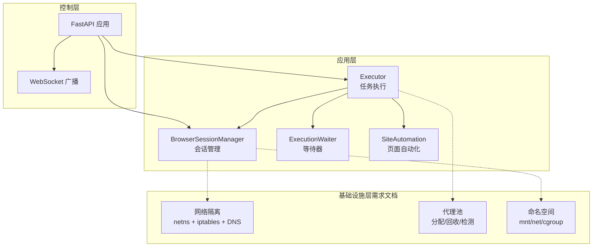
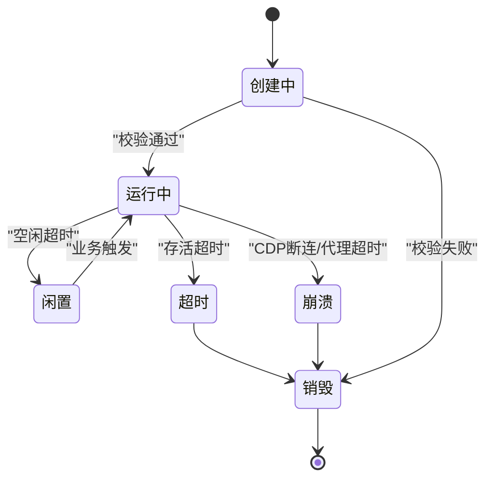
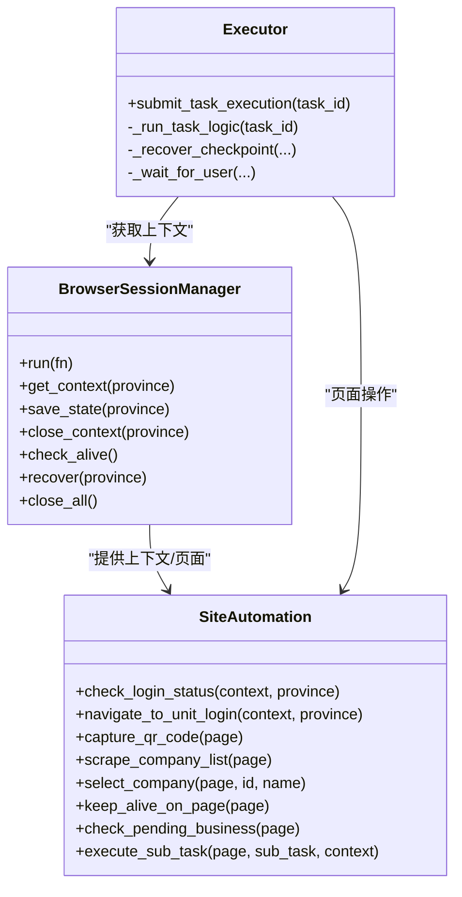
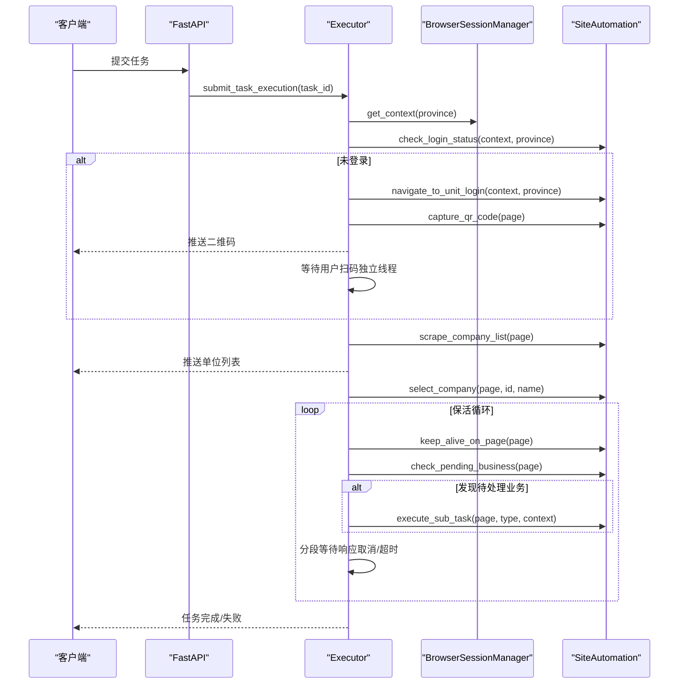
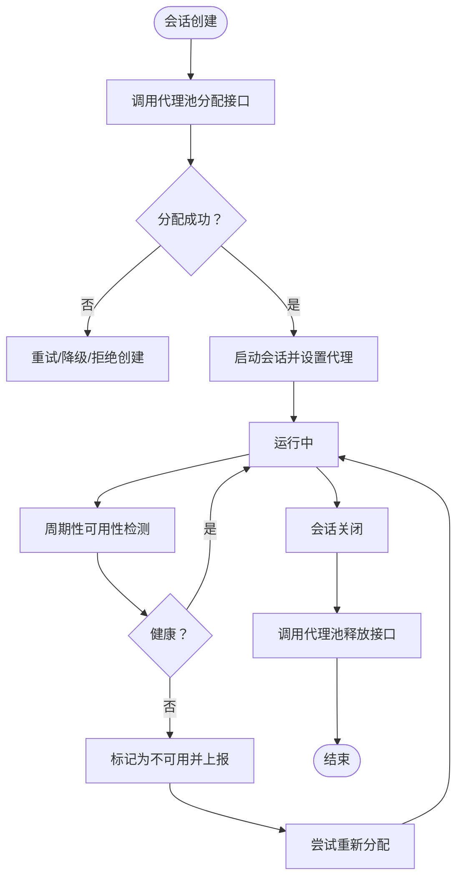
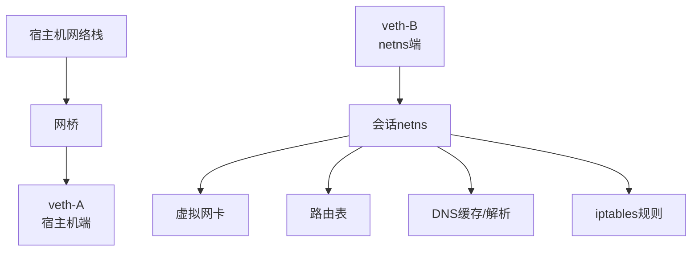
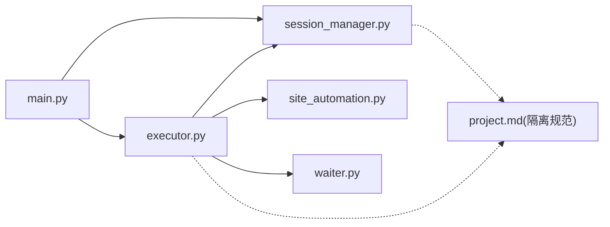

# 网络隔离层

<cite>
**本文引用的文件**
- [session_manager.py](file://CCC_RPA_API/app/browser/session_manager.py)
- [site_automation.py](file://CCC_RPA_API/app/browser/site_automation.py)
- [executor.py](file://CCC_RPA_API/app/services/executor.py)
- [waiter.py](file://CCC_RPA_API/app/browser/waiter.py)
- [main.py](file://CCC_RPA_API/app/main.py)
- [config.py](file://CCC_RPA_API/app/config.py)
- [project.md](file://project.md)
- [device.rs](file://CCC-BrowserV4/src-tauri/src/device.rs)
- [main.rs](file://CCC-BrowserV4/src-tauri/src/main.rs)
</cite>

## 目录
1. [简介](#简介)
2. [项目结构](#项目结构)
3. [核心组件](#核心组件)
4. [架构总览](#架构总览)
5. [组件详解](#组件详解)
6. [依赖关系分析](#依赖关系分析)
7. [性能考量](#性能考量)
8. [故障排查指南](#故障排查指南)
9. [结论](#结论)
10. [附录](#附录)

## 简介
本文件面向“网络隔离层”的技术文档，聚焦以下目标：
- 独立代理 IP 分配机制：每个会话绑定唯一出站 IP 地址，支持代理池动态分配与回收。
- 网络命名空间隔离原理：独立网络接口、路由表、DNS 缓存、防火墙规则。
- Linux netns 网络命名空间、iptables 隔离、DNS 解析隔离、网络设备虚拟化等实现思路。
- 代理 IP 可用性检测、网络超时处理策略、跨会话网络通信阻断验证方法。
- 网络隔离配置示例与故障排查指南。

说明：当前仓库代码以 Python/FastAPI 为基础，提供浏览器会话管理、任务执行与 WebSocket 广播等能力；关于“网络隔离层”的具体实现（如 netns、iptables、代理池对接）在现有代码中未直接体现，但需求文档与整体架构对这些能力有明确要求。本文将基于需求文档与现有代码，给出可落地的实现建议与验证方法。

## 项目结构
本项目包含三层：
- 应用层（FastAPI + Playwright）：负责任务编排、浏览器会话管理、页面自动化。
- 控制层（WebSocket 广播、等待器）：负责与前端交互、用户信号传递。
- 基础设施层（需求文档）：定义隔离边界（文件、网络、进程、浏览器存储、指纹、插件）与代理 IP 管理。

**图表来源**
- [main.py:1-127](file://CCC_RPA_API/app/main.py#L1-L127)
- [session_manager.py:1-186](file://CCC_RPA_API/app/browser/session_manager.py#L1-L186)
- [executor.py:1-319](file://CCC_RPA_API/app/services/executor.py#L1-L319)
- [site_automation.py:1-743](file://CCC_RPA_API/app/browser/site_automation.py#L1-L743)
- [waiter.py:1-84](file://CCC_RPA_API/app/browser/waiter.py#L1-L84)
- [project.md:277-291](file://project.md#L277-L291)

**章节来源**
- [main.py:1-127](file://CCC_RPA_API/app/main.py#L1-L127)
- [project.md:277-291](file://project.md#L277-L291)

## 核心组件
- 会话管理器：负责 Playwright 浏览器实例与上下文的创建、复用、持久化与回收。
- 任务执行器：负责任务生命周期、扫码登录、单位选择、保活循环、业务触发与结果上报。
- 等待器：提供用户交互阻塞/唤醒机制，避免阻塞浏览器工作线程。
- 页面自动化：封装站点登录、二维码抓取、单位列表抓取、保活与业务检测。
- 配置与主程序：数据库初始化、WebSocket 广播、健康检查与应用生命周期管理。

**章节来源**
- [session_manager.py:1-186](file://CCC_RPA_API/app/browser/session_manager.py#L1-L186)
- [executor.py:1-319](file://CCC_RPA_API/app/services/executor.py#L1-L319)
- [waiter.py:1-84](file://CCC_RPA_API/app/browser/waiter.py#L1-L84)
- [site_automation.py:1-743](file://CCC_RPA_API/app/browser/site_automation.py#L1-L743)
- [main.py:1-127](file://CCC_RPA_API/app/main.py#L1-L127)

## 架构总览
网络隔离层在“会话调度与生命周期”层面提出如下要求：
- 每个沙箱会话绑定唯一独立代理出站 IP，禁止多会话共享网络出口。
- 会话销毁时需归还代理 IP 至代理池，并释放 CDP 端口、全量删除 UserData 目录。
- 会话创建前置校验：租户剩余并发配额、代理 IP 可用性、集群剩余资源。
- 会话状态机：pending → running → idle → timeout/crash → destroy。
- 自愈重试：CDP 断开、代理网络超时自动重试 2 次，失败销毁并上报。

**图表来源**
- [project.md:263-276](file://project.md#L263-L276)

**章节来源**
- [project.md:263-276](file://project.md#L263-L276)

## 组件详解

### 会话管理与网络隔离边界
- 会话上下文隔离：每个省份（租户维度）维护独立上下文，存储状态持久化到独立文件，避免跨会话 Cookie/LocalStorage 泄露。
- 网络隔离边界：需求文档明确“网络层：独立代理 IP、独立网络命名空间、独立 DNS 缓存”。当前代码未直接体现 netns/iptables/DNS 隔离实现，但会话生命周期与代理 IP 归还流程已在需求中定义。

**图表来源**
- [session_manager.py:1-186](file://CCC_RPA_API/app/browser/session_manager.py#L1-L186)
- [site_automation.py:1-743](file://CCC_RPA_API/app/browser/site_automation.py#L1-L743)
- [executor.py:1-319](file://CCC_RPA_API/app/services/executor.py#L1-L319)

**章节来源**
- [session_manager.py:1-186](file://CCC_RPA_API/app/browser/session_manager.py#L1-L186)
- [site_automation.py:1-743](file://CCC_RPA_API/app/browser/site_automation.py#L1-L743)
- [executor.py:1-319](file://CCC_RPA_API/app/services/executor.py#L1-L319)

### 任务执行与保活循环（含网络超时处理）
- 任务执行器在 PW 工作线程中执行页面操作，若检测到浏览器异常则恢复会话并重新打开页面。
- 保活循环在当前业务页面执行轻量操作，不跳转，周期性检测待处理业务并触发子任务。
- 等待器提供阻塞/唤醒机制，避免阻塞 PW 工作线程；支持取消信号与超时处理。

**图表来源**
- [executor.py:78-267](file://CCC_RPA_API/app/services/executor.py#L78-L267)
- [session_manager.py:98-126](file://CCC_RPA_API/app/browser/session_manager.py#L98-L126)
- [site_automation.py:37-192](file://CCC_RPA_API/app/browser/site_automation.py#L37-L192)

**章节来源**
- [executor.py:78-267](file://CCC_RPA_API/app/services/executor.py#L78-L267)
- [session_manager.py:98-126](file://CCC_RPA_API/app/browser/session_manager.py#L98-L126)
- [site_automation.py:37-192](file://CCC_RPA_API/app/browser/site_automation.py#L37-L192)

### 代理池对接与可用性检测（实现建议）
根据需求文档，网络隔离层需实现：
- 代理池对接接口：分配 IP、释放 IP、IP 可用性检测。
- 单会话独立出站 IP 分配、释放、可用性检测。
- 会话销毁时归还代理 IP 至代理池。

实现建议（概念性流程，非现有代码）：
- 在会话创建前调用代理池分配接口，获取 proxyUrl。
- 在会话销毁时调用代理池释放接口，确保 IP 回收。
- 定期对代理 IP 进行连通性检测（HTTP/HTTPS/TLS 握手），失败则标记为不可用并上报。

**图表来源**
- [project.md:269-276](file://project.md#L269-L276)

**章节来源**
- [project.md:269-276](file://project.md#L269-L276)

### 网络命名空间隔离（实现建议）
需求文档要求“网络层：独立代理 IP、独立网络命名空间、独立 DNS 缓存”。实现建议（概念性流程）：
- 使用 Linux unshare 创建独立 mnt/net 命名空间，隔离网络设备、路由表、DNS。
- 为每个会话创建 veth pair，一端放入 netns，另一端桥接到宿主机网桥，实现隔离与出站路由。
- 通过 iptables/nftables 为 netns 设置 SNAT/DNAT、出站/入站策略，实现防火墙隔离。
- 为 netns 配置独立 resolv.conf 或 dnsmasq，实现 DNS 缓存隔离。
- 会话销毁时删除 netns、释放 veth、回收 iptables 规则。

**图表来源**
- [project.md:283-283](file://project.md#L283-L283)

**章节来源**
- [project.md:283-283](file://project.md#L283-L283)

### 跨会话网络通信阻断验证（方法建议）
- 使用抓包工具（如 tcpdump/tshark）在宿主机与 netns 边界抓包，验证仅目标会话流量可达。
- 在不同会话中分别发起 HTTP 请求，确认出站 IP 与 DNS 解析来自各自 netns。
- 通过 iptables/nftables 规则限制会话间访问，验证跨会话通信被阻断。
- 会话销毁后再次抓包，确认 netns 与 veth 已清理，无残留网络通道。

**章节来源**
- [project.md:664-664](file://project.md#L664-L664)

## 依赖关系分析
- 应用层依赖：
  - FastAPI 主程序负责启动、数据库初始化、WebSocket 广播。
  - 会话管理器依赖 Playwright 启动 Chromium，提供上下文与持久化。
  - 任务执行器依赖会话管理器与页面自动化，协调用户交互与保活。
- 基础设施层依赖：
  - 需求文档定义了网络隔离边界与代理池对接规范，指导实现。

**图表来源**
- [main.py:1-127](file://CCC_RPA_API/app/main.py#L1-L127)
- [session_manager.py:1-186](file://CCC_RPA_API/app/browser/session_manager.py#L1-L186)
- [executor.py:1-319](file://CCC_RPA_API/app/services/executor.py#L1-L319)
- [site_automation.py:1-743](file://CCC_RPA_API/app/browser/site_automation.py#L1-L743)
- [waiter.py:1-84](file://CCC_RPA_API/app/browser/waiter.py#L1-L84)
- [project.md:277-291](file://project.md#L277-L291)

**章节来源**
- [main.py:1-127](file://CCC_RPA_API/app/main.py#L1-L127)
- [session_manager.py:1-186](file://CCC_RPA_API/app/browser/session_manager.py#L1-L186)
- [executor.py:1-319](file://CCC_RPA_API/app/services/executor.py#L1-L319)
- [site_automation.py:1-743](file://CCC_RPA_API/app/browser/site_automation.py#L1-L743)
- [waiter.py:1-84](file://CCC_RPA_API/app/browser/waiter.py#L1-L84)
- [project.md:277-291](file://project.md#L277-L291)

## 性能考量
- 会话创建与销毁：尽量减少 Chromium 启动与关闭开销，利用上下文复用与持久化存储。
- 任务执行：将阻塞操作（扫码等待）放在独立线程，避免阻塞 PW 工作线程。
- 保活循环：分段等待，及时响应取消信号，降低资源占用。
- 代理池：对代理 IP 进行健康检查与重试，避免因单点故障导致任务失败。

[本节为通用建议，不直接分析具体文件]

## 故障排查指南
- 浏览器异常恢复
  - 现象：浏览器断连或崩溃。
  - 处理：执行器在关键步骤检查浏览器存活，若异常则恢复会话并重新打开页面。
- 任务超时
  - 现象：扫码等待、选择单位等待超时。
  - 处理：等待器与执行器均设置超时，超时后抛出异常并上报。
- 代理网络超时
  - 建议：在会话创建与运行期间定期检测代理 IP 可用性，失败则重试或销毁会话并上报。
- 会话销毁后残留
  - 建议：确保销毁流程归还代理 IP、释放 CDP 端口、删除 UserData 目录。

**章节来源**
- [executor.py:42-69](file://CCC_RPA_API/app/services/executor.py#L42-L69)
- [executor.py:133-140](file://CCC_RPA_API/app/services/executor.py#L133-L140)
- [executor.py:254-266](file://CCC_RPA_API/app/services/executor.py#L254-L266)
- [project.md:269-276](file://project.md#L269-L276)

## 结论
- 当前仓库提供了完善的会话管理、任务执行与交互控制能力，满足浏览器自动化与会话生命周期管理需求。
- 网络隔离层（netns、iptables、DNS 隔离、代理池对接）在现有代码中未直接实现，但需求文档已明确规范。
- 建议在会话调度与生命周期管理中集成代理池对接与网络隔离实现，确保每个会话绑定唯一出站 IP，并在销毁时正确回收资源。

[本节为总结性内容，不直接分析具体文件]

## 附录

### 网络隔离配置示例（概念性）
- 代理池对接
  - 分配接口：POST /api/proxy/allocate
  - 释放接口：POST /api/proxy/release
  - 检测接口：GET /api/proxy/health
- 会话创建参数
  - 注入环境变量：PROXY_URL、SESSION_ID、TENANT_ID
- netns 隔离
  - 创建 netns：ip netns add sess-${sessionId}
  - 创建 veth：ip link add veth${sessionId}-a type veth peer name veth${sessionId}-b
  - 挂载到 netns：ip link set veth${sessionId}-b netns sess-${sessionId}
  - 配置路由与 iptables，实现 SNAT/DNAT 与访问控制
  - 清理：销毁 netns、删除 veth、回收 iptables

**章节来源**
- [project.md:496-502](file://project.md#L496-L502)
- [project.md:255-261](file://project.md#L255-L261)
- [project.md:283-283](file://project.md#L283-L283)