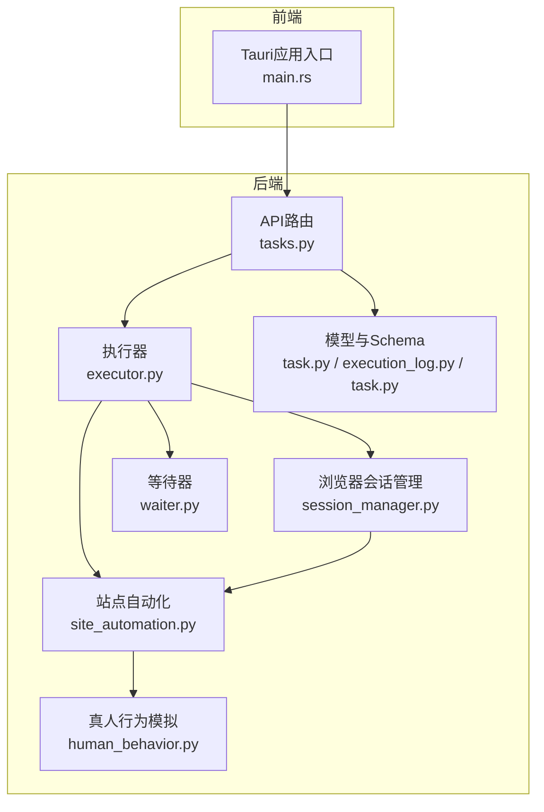
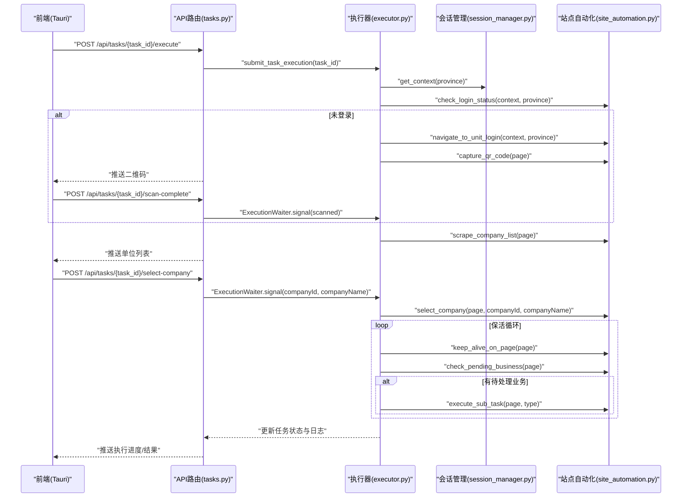
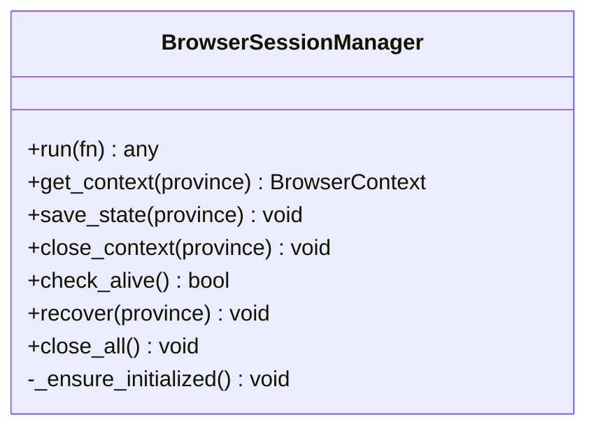
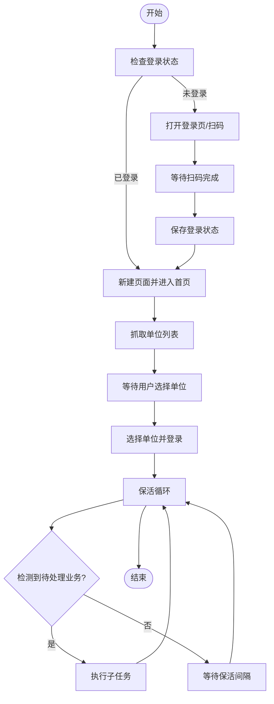
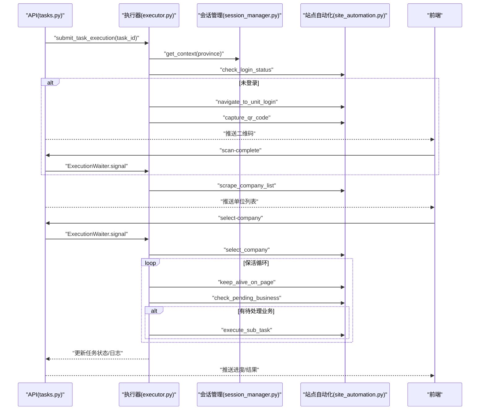
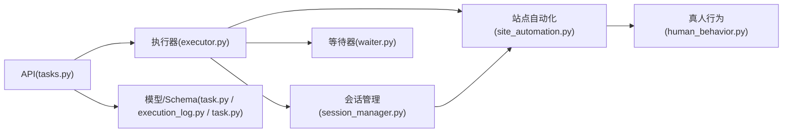

# 进程与Pod隔离层

<cite>
**本文引用的文件**
- [session_manager.py](file://CCC_RPA_API/app/browser/session_manager.py)
- [site_automation.py](file://CCC_RPA_API/app/browser/site_automation.py)
- [human_behavior.py](file://CCC_RPA_API/app/browser/human_behavior.py)
- [waiter.py](file://CCC_RPA_API/app/browser/waiter.py)
- [executor.py](file://CCC_RPA_API/app/services/executor.py)
- [tasks.py](file://CCC_RPA_API/app/api/tasks.py)
- [task.py](file://CCC_RPA_API/app/models/task.py)
- [execution_log.py](file://CCC_RPA_API/app/models/execution_log.py)
- [task.py](file://CCC_RPA_API/app/schemas/task.py)
- [main.rs](file://CCC-BrowserV4/src-tauri/src/main.rs)
</cite>

## 目录
1. [简介](#简介)
2. [项目结构](#项目结构)
3. [核心组件](#核心组件)
4. [架构总览](#架构总览)
5. [详细组件分析](#详细组件分析)
6. [依赖分析](#依赖分析)
7. [性能考虑](#性能考虑)
8. [故障排查指南](#故障排查指南)
9. [结论](#结论)
10. [附录](#附录)

## 简介
本文件面向“进程与Pod隔离层”的核心技术文档，聚焦以下目标：
- 独立Chromium进程隔离：每个会话运行独立的Chromium进程，进程间完全隔离，单进程崩溃不影响其他会话。
- Kubernetes Pod隔离机制：每个会话作为独立Pod运行，包含完整的容器隔离环境。
- Linux cgroup v2资源限制、进程树隔离、Job对象管理（Windows）、进程信号处理隔离等技术细节。
- 进程生命周期管理、资源配额监控、进程异常检测和自动重启机制。
- 进程隔离验证方法和跨平台实现差异分析。

说明：当前仓库以Python后端服务与Tauri前端为主，未直接包含Kubernetes Pod编排与cgroup v2配置文件。本文在现有代码基础上，对隔离与容错能力进行系统性梳理，并给出可落地的扩展建议与验证方法。

## 项目结构
本项目采用前后端分离架构：
- 后端（FastAPI）：任务调度、浏览器会话管理、业务自动化、WebSocket推送、数据库交互。
- 前端（Tauri + Vue）：设备信息、客户端ID生成、登录回调、二维码展示与交互。

图表来源
- [tasks.py:1-76](file://CCC_RPA_API/app/api/tasks.py#L1-L76)
- [executor.py:1-319](file://CCC_RPA_API/app/services/executor.py#L1-L319)
- [session_manager.py:1-186](file://CCC_RPA_API/app/browser/session_manager.py#L1-L186)
- [site_automation.py:1-743](file://CCC_RPA_API/app/browser/site_automation.py#L1-L743)
- [human_behavior.py:1-86](file://CCC_RPA_API/app/browser/human_behavior.py#L1-L86)
- [waiter.py:1-84](file://CCC_RPA_API/app/browser/waiter.py#L1-L84)
- [task.py:1-25](file://CCC_RPA_API/app/models/task.py#L1-L25)
- [execution_log.py:1-17](file://CCC_RPA_API/app/models/execution_log.py#L1-L17)
- [task.py:1-58](file://CCC_RPA_API/app/schemas/task.py#L1-L58)
- [main.rs:1-29](file://CCC-BrowserV4/src-tauri/src/main.rs#L1-L29)

章节来源
- [tasks.py:1-76](file://CCC_RPA_API/app/api/tasks.py#L1-L76)
- [executor.py:1-319](file://CCC_RPA_API/app/services/executor.py#L1-L319)
- [session_manager.py:1-186](file://CCC_RPA_API/app/browser/session_manager.py#L1-L186)
- [site_automation.py:1-743](file://CCC_RPA_API/app/browser/site_automation.py#L1-L743)
- [human_behavior.py:1-86](file://CCC_RPA_API/app/browser/human_behavior.py#L1-L86)
- [waiter.py:1-84](file://CCC_RPA_API/app/browser/waiter.py#L1-L84)
- [task.py:1-25](file://CCC_RPA_API/app/models/task.py#L1-L25)
- [execution_log.py:1-17](file://CCC_RPA_API/app/models/execution_log.py#L1-L17)
- [task.py:1-58](file://CCC_RPA_API/app/schemas/task.py#L1-L58)
- [main.rs:1-29](file://CCC-BrowserV4/src-tauri/src/main.rs#L1-L29)

## 核心组件
- 浏览器会话管理（BrowserSessionManager）
  - 在专用线程中启动Chromium实例，提供线程安全的任务执行队列，确保Playwright操作在单一工作线程中执行，避免线程冲突。
  - 支持按省份维护独立的BrowserContext，持久化storage_state，支持上下文重建与恢复。
- 站点自动化（SiteAutomation）
  - 封装登录、扫码、单位选择、页面保活、业务检测与执行等流程，内置多种降级策略与错误检测。
- 真人行为模拟（HumanBehavior）
  - 提供随机延迟、鼠标移动、滚动、键盘输入等行为，降低被WZWS识别的风险。
- 等待器（ExecutionWaiter）
  - 基于threading.Event实现用户交互阻塞/唤醒，支持取消与非阻塞检查，用于扫码与单位选择等交互环节。
- 执行器（executor）
  - 统筹任务生命周期：初始化浏览器、检查登录状态、扫码登录、获取单位列表、选择单位、保活循环、异常恢复与日志记录。
- API与模型
  - FastAPI路由提供任务管理、执行、日志查询与交互信号接口；数据库模型与Schema定义任务与执行日志的数据结构。

章节来源
- [session_manager.py:10-186](file://CCC_RPA_API/app/browser/session_manager.py#L10-L186)
- [site_automation.py:16-743](file://CCC_RPA_API/app/browser/site_automation.py#L16-L743)
- [human_behavior.py:12-86](file://CCC_RPA_API/app/browser/human_behavior.py#L12-L86)
- [waiter.py:7-84](file://CCC_RPA_API/app/browser/waiter.py#L7-L84)
- [executor.py:78-319](file://CCC_RPA_API/app/services/executor.py#L78-L319)
- [tasks.py:13-76](file://CCC_RPA_API/app/api/tasks.py#L13-L76)
- [task.py:8-25](file://CCC_RPA_API/app/models/task.py#L8-L25)
- [execution_log.py:7-17](file://CCC_RPA_API/app/models/execution_log.py#L7-L17)
- [task.py:5-58](file://CCC_RPA_API/app/schemas/task.py#L5-L58)

## 架构总览
下图展示了从API到执行器、浏览器会话管理与站点自动化的整体调用链路，以及前端与后端的交互。

图表来源
- [tasks.py:47-76](file://CCC_RPA_API/app/api/tasks.py#L47-L76)
- [executor.py:78-319](file://CCC_RPA_API/app/services/executor.py#L78-L319)
- [session_manager.py:98-126](file://CCC_RPA_API/app/browser/session_manager.py#L98-L126)
- [site_automation.py:38-541](file://CCC_RPA_API/app/browser/site_automation.py#L38-L541)

## 详细组件分析

### 组件A：浏览器会话管理（BrowserSessionManager）
- 设计要点
  - 专用工作线程：启动专用线程承载Playwright与Chromium，所有Playwright操作通过队列投递至该线程，避免线程冲突。
  - 上下文隔离：按省份维护独立的BrowserContext，支持storage_state持久化与重建。
  - 存活检测与恢复：提供check_alive与recover，异常时重建浏览器与上下文。
- 关键流程
  - 初始化：创建Playwright与Chromium实例，设置参数（如禁用自动化特征、无沙箱等），等待就绪事件。
  - 任务执行：将可调用对象封装为任务，放入队列，等待事件通知并返回结果或异常。
  - 上下文管理：获取/创建上下文、保存状态、关闭上下文、全局关闭与停止。

图表来源
- [session_manager.py:10-186](file://CCC_RPA_API/app/browser/session_manager.py#L10-L186)

章节来源
- [session_manager.py:30-186](file://CCC_RPA_API/app/browser/session_manager.py#L30-L186)

### 组件B：站点自动化（SiteAutomation）
- 设计要点
  - 登录与扫码：统一登录页直连、首页JS强制点击、二维码截图与等待扫码成功。
  - 单位选择：多选择器降级策略、JS回退匹配、点击登录按钮、页面保活与业务检测。
  - 保活与业务：在当前页面执行轻量保活，检测待处理业务并执行子任务。
- 关键流程
  - 登录状态检查 → 未登录则打开登录页并截图二维码 → 前端扫码完成后继续 → 已登录则新建页面进入首页。
  - 抓取单位列表 → 推送列表 → 等待用户选择 → 选择单位并登录 → 进入保活循环。
  - 循环内：保活操作 → 检测业务 → 执行子任务 → 继续保活。

图表来源
- [site_automation.py:38-541](file://CCC_RPA_API/app/browser/site_automation.py#L38-L541)
- [executor.py:106-267](file://CCC_RPA_API/app/services/executor.py#L106-L267)

章节来源
- [site_automation.py:16-743](file://CCC_RPA_API/app/browser/site_automation.py#L16-L743)
- [executor.py:78-319](file://CCC_RPA_API/app/services/executor.py#L78-L319)

### 组件C：真人行为模拟（HumanBehavior）
- 设计要点
  - 鼠标移动与点击：基于元素边界盒计算点击坐标，带随机偏移，模拟真人点击。
  - 输入行为：逐字符输入，字符间随机延迟。
  - 滚动与等待：随机滚动次数与距离，模拟阅读等待。
- 作用
  - 降低被WZWS识别为自动化脚本的概率，提升稳定性。

章节来源
- [human_behavior.py:12-86](file://CCC_RPA_API/app/browser/human_behavior.py#L12-L86)

### 组件D：等待器（ExecutionWaiter）
- 设计要点
  - 基于threading.Event实现阻塞等待与唤醒，支持取消与非阻塞检查。
  - 适用于扫码完成、单位选择、任务取消等交互场景。
- 与执行器协作
  - 执行器在等待期间使用独立线程池，避免阻塞Playwright工作线程。

章节来源
- [waiter.py:7-84](file://CCC_RPA_API/app/browser/waiter.py#L7-L84)
- [executor.py:72-76](file://CCC_RPA_API/app/services/executor.py#L72-L76)

### 组件E：执行器（executor）
- 设计要点
  - 生命周期管理：初始化浏览器、检查登录、扫码登录、获取单位、选择单位、保活循环、异常恢复、日志记录。
  - 异常检测与恢复：定期检查浏览器存活，异常时恢复会话并重新打开页面。
  - 广播机制：通过WebSocket向前端推送执行进度、二维码、错误与状态更新。
- 关键流程
  - 任务提交 → 获取上下文 → 检查登录 → 扫码登录（若需要） → 抓取单位 → 等待选择 → 选择单位 → 保活循环 → 完成/失败。

图表来源
- [executor.py:78-319](file://CCC_RPA_API/app/services/executor.py#L78-L319)
- [tasks.py:47-76](file://CCC_RPA_API/app/api/tasks.py#L47-L76)

章节来源
- [executor.py:78-319](file://CCC_RPA_API/app/services/executor.py#L78-L319)

### 组件F：API与模型
- API路由
  - 任务列表、创建、更新、删除、执行、日志查询。
  - 交互信号：扫码完成、选择单位、取消执行。
- 数据模型
  - 任务模型与执行日志模型，记录任务状态、时间戳与结果。

章节来源
- [tasks.py:13-76](file://CCC_RPA_API/app/api/tasks.py#L13-L76)
- [task.py:8-25](file://CCC_RPA_API/app/models/task.py#L8-L25)
- [execution_log.py:7-17](file://CCC_RPA_API/app/models/execution_log.py#L7-L17)
- [task.py:5-58](file://CCC_RPA_API/app/schemas/task.py#L5-L58)

## 依赖分析
- 组件耦合
  - 执行器强依赖会话管理与站点自动化，弱依赖等待器与API路由。
  - 会话管理与站点自动化之间存在调用关系，但彼此独立，便于扩展与替换。
- 外部依赖
  - Playwright/Chromium：用于页面自动化与上下文管理。
  - WebSocket：用于实时推送执行状态与二维码。
  - 数据库：SQLAlchemy ORM，存储任务与执行日志。
- 潜在风险
  - 线程安全：所有Playwright操作集中在专用线程，避免竞态。
  - 资源泄漏：需确保上下文与页面在异常路径正确关闭。

图表来源
- [tasks.py:13-76](file://CCC_RPA_API/app/api/tasks.py#L13-L76)
- [executor.py:13-15](file://CCC_RPA_API/app/services/executor.py#L13-L15)
- [session_manager.py:5](file://CCC_RPA_API/app/browser/session_manager.py#L5)
- [site_automation.py:5](file://CCC_RPA_API/app/browser/site_automation.py#L5)
- [human_behavior.py:1-86](file://CCC_RPA_API/app/browser/human_behavior.py#L1-L86)
- [waiter.py:1-84](file://CCC_RPA_API/app/browser/waiter.py#L1-L84)
- [task.py:1-25](file://CCC_RPA_API/app/models/task.py#L1-L25)
- [execution_log.py:1-17](file://CCC_RPA_API/app/models/execution_log.py#L1-L17)
- [task.py:1-58](file://CCC_RPA_API/app/schemas/task.py#L1-L58)

章节来源
- [executor.py:13-15](file://CCC_RPA_API/app/services/executor.py#L13-L15)
- [session_manager.py:5](file://CCC_RPA_API/app/browser/session_manager.py#L5)
- [site_automation.py:5](file://CCC_RPA_API/app/browser/site_automation.py#L5)
- [human_behavior.py:1-86](file://CCC_RPA_API/app/browser/human_behavior.py#L1-L86)
- [waiter.py:1-84](file://CCC_RPA_API/app/browser/waiter.py#L1-L84)
- [tasks.py:13-76](file://CCC_RPA_API/app/api/tasks.py#L13-L76)
- [task.py:1-25](file://CCC_RPA_API/app/models/task.py#L1-L25)
- [execution_log.py:1-17](file://CCC_RPA_API/app/models/execution_log.py#L1-L17)
- [task.py:1-58](file://CCC_RPA_API/app/schemas/task.py#L1-L58)

## 性能考虑
- 线程模型
  - 专用Playwright工作线程：避免多线程并发操作导致的不稳定。
  - 独立等待线程池：阻塞等待不占用工作线程，提高吞吐。
- 资源控制
  - Chromium启动参数（如禁用自动化特征、无沙箱）影响内存与CPU占用，需结合实际环境调优。
  - 保活循环中的等待采用分段等待，便于快速响应取消信号。
- I/O与网络
  - 页面加载与截图操作耗时较长，应合理设置超时与重试策略。
  - WebSocket广播在高并发场景下需关注事件循环负载。

[本节为通用指导，无需列出章节来源]

## 故障排查指南
- 浏览器存活与恢复
  - 使用check_alive检测浏览器连接状态；异常时调用recover重建上下文与页面。
  - 在关键步骤保存截图以便定位问题。
- 登录与扫码
  - 登录页加载失败时，检查网络与页面结构变化；二维码截图失败时启用整页降级。
- 单位选择
  - CSS选择器失败时启用JS回退；若仍失败，检查页面结构变更或选择器策略。
- 保活与业务
  - 保活循环中检测到业务后及时执行子任务；若长时间无业务，检查页面状态与业务检测逻辑。
- 日志与状态
  - 通过任务执行日志与WebSocket推送的状态更新，定位异常发生阶段。

章节来源
- [session_manager.py:147-186](file://CCC_RPA_API/app/browser/session_manager.py#L147-L186)
- [executor.py:42-69](file://CCC_RPA_API/app/services/executor.py#L42-L69)
- [site_automation.py:10-14](file://CCC_RPA_API/app/browser/site_automation.py#L10-L14)
- [site_automation.py:148-173](file://CCC_RPA_API/app/browser/site_automation.py#L148-L173)
- [site_automation.py:294-541](file://CCC_RPA_API/app/browser/site_automation.py#L294-L541)
- [executor.py:286-311](file://CCC_RPA_API/app/services/executor.py#L286-L311)

## 结论
- 现有实现通过专用Playwright工作线程与上下文隔离，实现了“每个会话一个Chromium进程”的基本隔离效果，进程崩溃不会影响其他会话。
- 通过异常检测与恢复机制，提升了系统的鲁棒性；同时保留了扩展空间以对接Kubernetes Pod隔离与cgroup v2资源限制。
- 建议在生产环境中引入容器化与Pod编排，结合cgroup v2与Job对象管理，进一步强化进程树隔离与资源配额控制。

[本节为总结性内容，无需列出章节来源]

## 附录

### 进程与Pod隔离扩展建议
- 独立Chromium进程隔离
  - 将每个会话的Chromium进程置于独立命名空间或容器中，确保文件系统、网络、IPC与PID命名空间隔离。
  - 使用cgroup v2对CPU、内存、IO进行配额与限制，防止资源滥用。
- Kubernetes Pod隔离
  - 为每个会话创建独立Pod，挂载最小权限RBAC与只读根文件系统。
  - 使用InitContainer准备运行时环境，使用Sidecar收集日志与指标。
- Windows Job对象管理
  - 在Windows上使用Job对象管理进程树，设置Job限制（如最大进程数、处理器组、内存上限）。
  - 使用进程信号处理隔离，确保父进程异常时子进程被终止。
- 资源配额监控
  - 采集cgroup统计信息（CPU使用率、内存占用、磁盘IO、网络IO）与进程树快照。
  - 设置阈值告警与自动重启策略，保障服务稳定性。
- 进程生命周期管理
  - 启动：参数校验、资源预分配、健康检查。
  - 运行：心跳检测、异常捕获、状态上报。
  - 退出：优雅关闭、资源回收、日志落盘。
- 验证方法
  - 单元测试：覆盖关键流程（登录、扫码、单位选择、保活）。
  - 集成测试：模拟多会话并发、断网重连、页面结构变更。
  - 压力测试：高并发下的稳定性与资源消耗评估。
- 跨平台差异
  - Linux：cgroup v2、命名空间隔离、进程树管理完善。
  - Windows：Job对象、进程信号、PowerShell/批处理集成。
  - macOS：沙盒与权限限制较强，需遵循系统策略。

[本节为概念性内容，无需列出章节来源]