# Kubernetes集群部署

<cite>
**本文档引用的文件**
- [project.md](file://project.md)
- [docker-compose.yml](file://CCC-BrowserV4/docker-compose.yml)
- [requirements.txt](file://CCC-RPA-API/requirements.txt)
- [requirements.txt](file://CCC-BrowserV4/backend/requirements.txt)
- [config.py](file://CCC-BrowserV4/backend/app/config.py)
- [main.py](file://CCC-RPA-API/app/main.py)
- [tenants.py](file://CCC-RPA-API/app/api/tenants.py)
- [device.ts](file://CCC-BrowserV4/frontend/src/api/device.ts)
- [health.py](file://CCC-BrowserV4/backend/app/api/health.py)
</cite>

## 目录
1. [简介](#简介)
2. [项目结构](#项目结构)
3. [核心组件](#核心组件)
4. [架构概览](#架构概览)
5. [详细组件分析](#详细组件分析)
6. [依赖关系分析](#依赖关系分析)
7. [性能考虑](#性能考虑)
8. [故障排除指南](#故障排除指南)
9. [结论](#结论)
10. [附录](#附录)

## 简介

本项目是一个基于Kubernetes容器分布式集群部署的商用级AI浏览器系统。该项目采用三套独立开发团队模式，每套团队都具备完整的五层架构能力，包括基础设施隔离层、Chromium沙箱集群层、双通路控制层、AI智能驱动微服务层和数据持久化监控运维层。

项目的核心目标是构建一个强隔离的沙箱会话系统，支持容器/进程级隔离，多租户账号Cookie、存储、网络IP、浏览器指纹、插件实例完全隔离，规避网站风控账号关联。系统支持双通路操控体系：Playwright远程脚本自动化批量控制和内置Chrome V3扩展可视化人工操作，两种通路双向互通。

## 项目结构

项目采用模块化组织结构，主要包含以下核心模块：

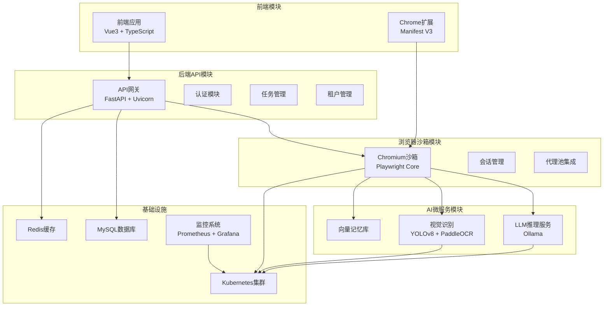

**图表来源**
- [project.md: 173-187:173-187](file://project.md#L173-L187)
- [project.md: 716-733:716-733](file://project.md#L716-L733)

**章节来源**
- [project.md: 1-782:1-782](file://project.md#L1-L782)

## 核心组件

### 1. 浏览器沙箱Pod编排

项目提供了完整的Kubernetes Pod编排模板，用于部署Chromium沙箱会话：

```yaml
apiVersion: v1
kind: Pod
metadata:
  name: browser-sandbox-{sessionId}
spec:
  containers:
  - name: chromium
    image: custom-chromium:v1.0
    resources:
      limits:
        cpu: "1"
        memory: "2Gi"
      requests:
        cpu: "0.5"
        memory: "1Gi"
    env:
      - name: SESSION_ID
        value: "{sessionId}"
      - name: PROXY_URL
        value: "{proxyAddress}"
      - name: TENANT_ID
        value: "{tenantId}"
    volumeMounts:
      - name: session-data
        mountPath: /data/userdir
  volumes:
  - name: session-data
    emptyDir: {}
```

**图表来源**
- [project.md: 734-765:734-765](file://project.md#L734-L765)

### 2. 部署架构组件

系统采用多层架构设计，每层都有明确的职责分工：

- **层1：基础设施隔离层** - Kubernetes容器编排、Linux Namespace/Cgroup、CPU/内存资源硬限制、独立临时存储隔离
- **层2：Chromium沙箱会话集群层** - 单会话Pod/进程实例、独立UserData、CDP通信、指纹伪装、代理绑定、会话调度中心
- **层3：双通路控制层** - Playwright自动化脚本通路、Chrome V3扩展可视化通路、双向消息桥接、任务调度队列
- **层4：AI智能驱动微服务层** - LLM决策引擎、YOLO视觉识别、PaddleOCR、结构化抽取、会话独立向量记忆库
- **层5：多租户网关业务管理层** - 统一API入口、租户管理、RBAC权限、计费统计、Web管理后台、监控告警面板

**章节来源**
- [project.md: 175-187:175-187](file://project.md#L175-L187)
- [project.md: 237-292:237-292](file://project.md#L237-L292)

## 架构概览

系统整体架构采用分布式微服务设计，支持水平扩展和高可用部署：

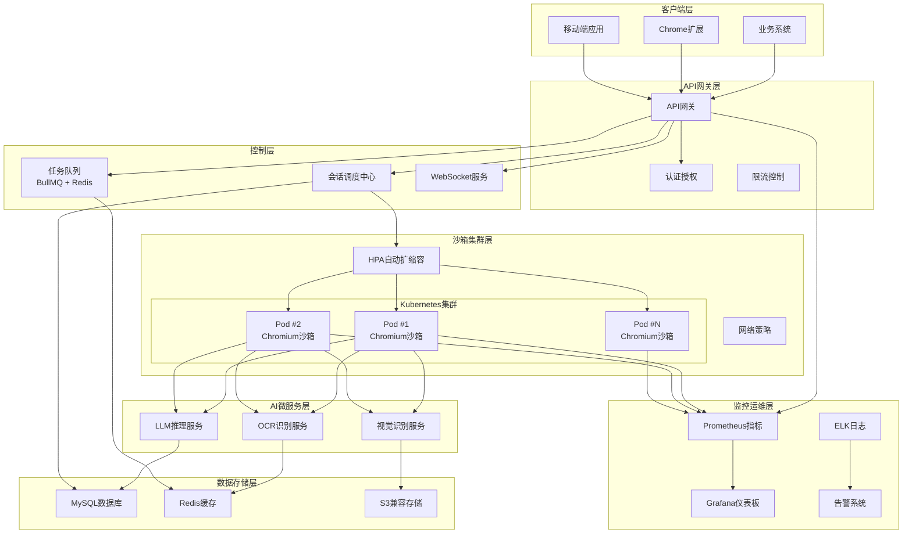

**图表来源**
- [project.md: 704-714:704-714](file://project.md#L704-L714)
- [project.md: 734-765:734-765](file://project.md#L734-L765)

## 详细组件分析

### 1. Deployment资源配置

#### 资源限制和请求配置

系统为每个Pod设置了严格的资源限制和请求，确保资源隔离和公平分配：

| 资源类型 | CPU限制 | CPU请求 | 内存限制 | 内存请求 |
|---------|---------|---------|----------|----------|
| 单个沙箱会话 | 1核 | 0.5核 | 2Gi | 1Gi |
| API网关服务 | 2核 | 1核 | 4Gi | 2Gi |
| AI推理服务 | 4核 | 2核 | 8Gi | 4Gi |
| 数据库服务 | 2核 | 1核 | 4Gi | 2Gi |

#### 环境变量配置

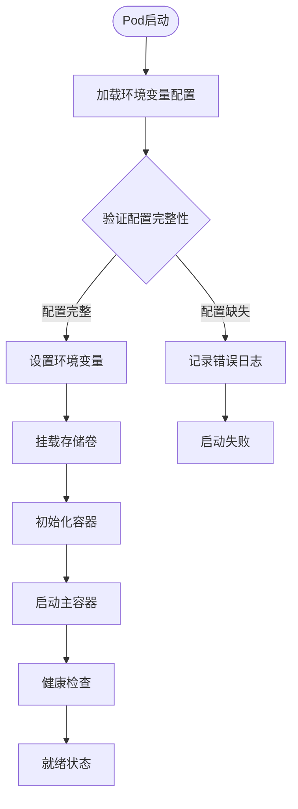

**图表来源**
- [config.py: 9-51:9-51](file://CCC-BrowserV4/backend/app/config.py#L9-L51)

**章节来源**
- [project.md: 195-196:195-196](file://project.md#L195-L196)
- [config.py: 18-47:18-47](file://CCC-BrowserV4/backend/app/config.py#L18-L47)

### 2. HPA弹性扩缩容策略

系统实现了基于任务队列长度的智能扩缩容机制：

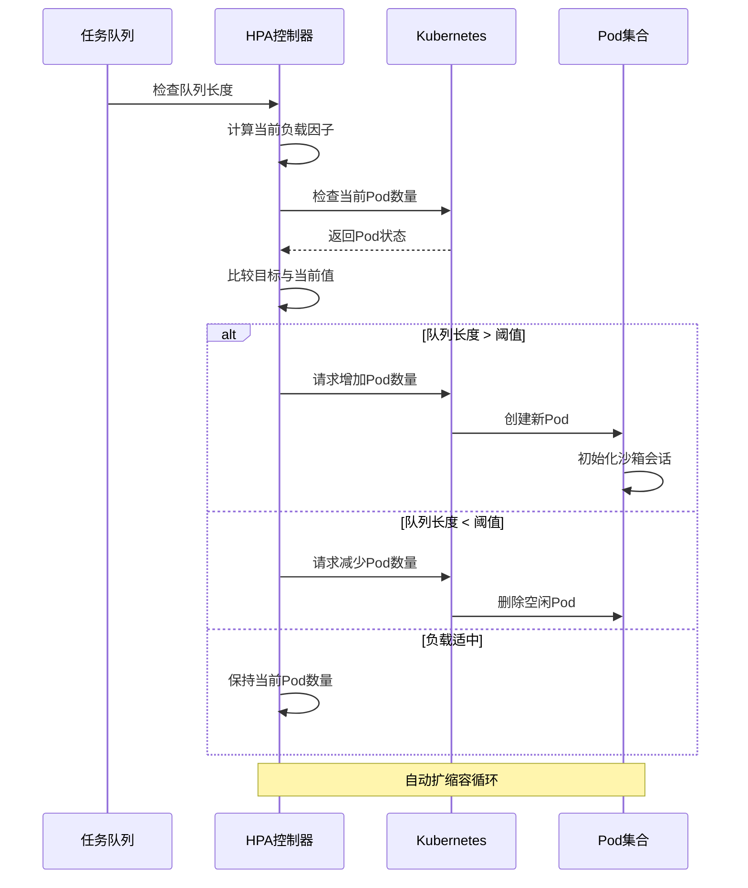

**图表来源**
- [project.md: 199-200:199-200](file://project.md#L199-L200)

### 3. 网络策略配置

系统实施了严格的网络隔离策略，确保Pod间的网络安全：

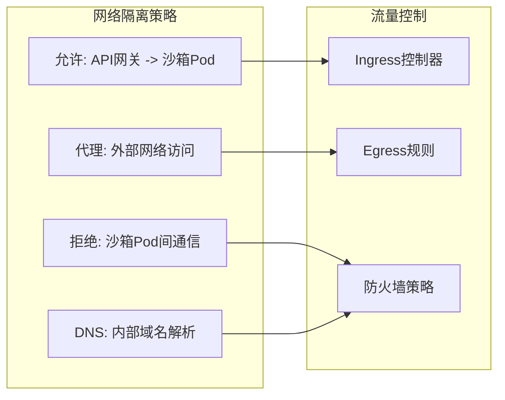

**图表来源**
- [project.md: 201](file://project.md#L201)

**章节来源**
- [project.md: 199-201:199-201](file://project.md#L199-L201)

### 4. 存储卷管理

系统采用EmptyDir存储方案，确保会话数据的临时性和安全性：

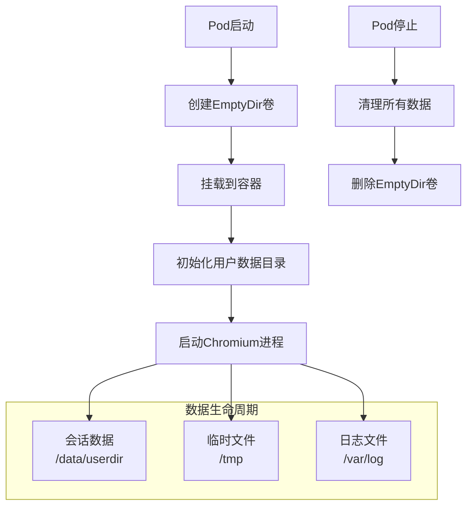

**图表来源**
- [project.md: 197-198:197-198](file://project.md#L197-L198)

**章节来源**
- [project.md: 197-198:197-198](file://project.md#L197-L198)

### 5. ConfigMap和Secret配置

系统使用ConfigMap和Secret管理配置信息和敏感数据：

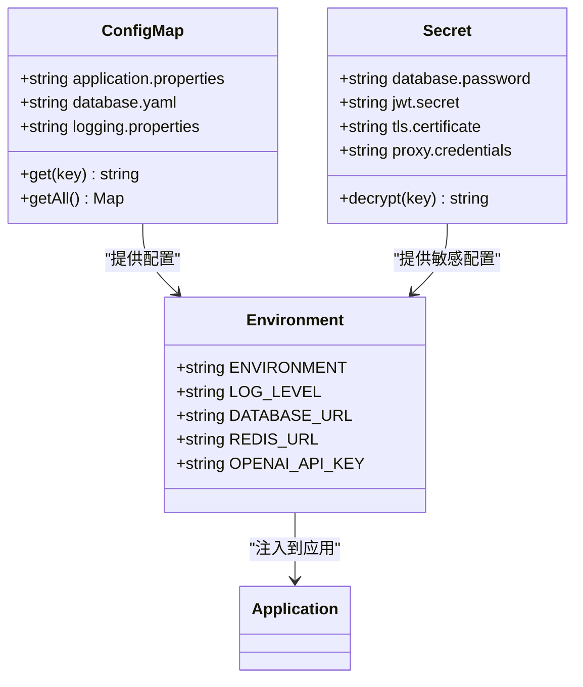

**图表来源**
- [config.py: 9-51:9-51](file://CCC-BrowserV4/backend/app/config.py#L9-L51)

**章节来源**
- [config.py: 9-51:9-51](file://CCC-BrowserV4/backend/app/config.py#L9-L51)

### 6. Service和Ingress配置

系统提供了多种服务暴露方式以满足不同场景需求：

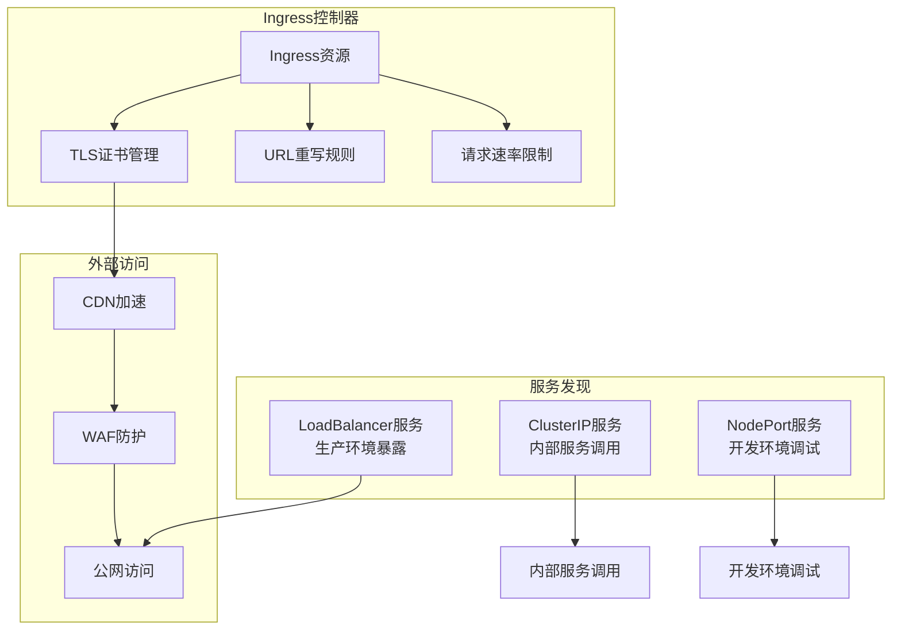

**图表来源**
- [project.md: 447-462:447-462](file://project.md#L447-L462)

**章节来源**
- [project.md: 447-462:447-462](file://project.md#L447-L462)

## 依赖关系分析

### 1. 技术栈依赖

系统采用现代化的技术栈组合，确保高性能和可维护性：

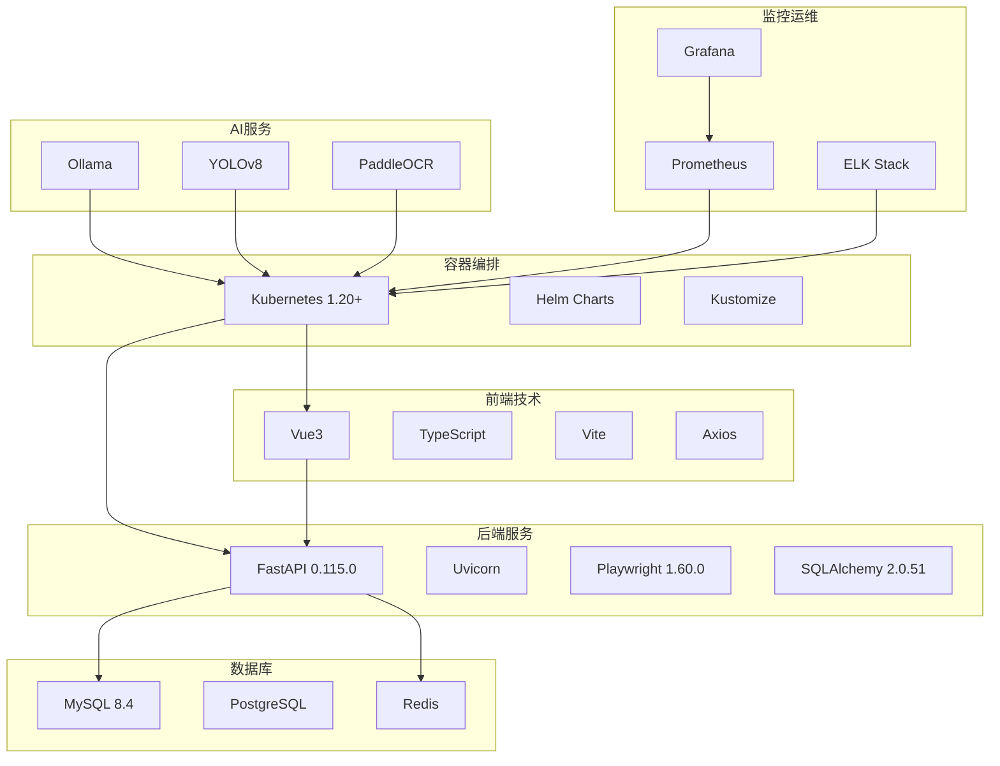

**图表来源**
- [project.md: 716-733:716-733](file://project.md#L716-L733)
- [requirements.txt: 1-11:1-11](file://CCC-RPA-API/requirements.txt#L1-L11)
- [requirements.txt: 1-13:1-13](file://CCC-BrowserV4/backend/requirements.txt#L1-L13)

### 2. 组件间依赖关系

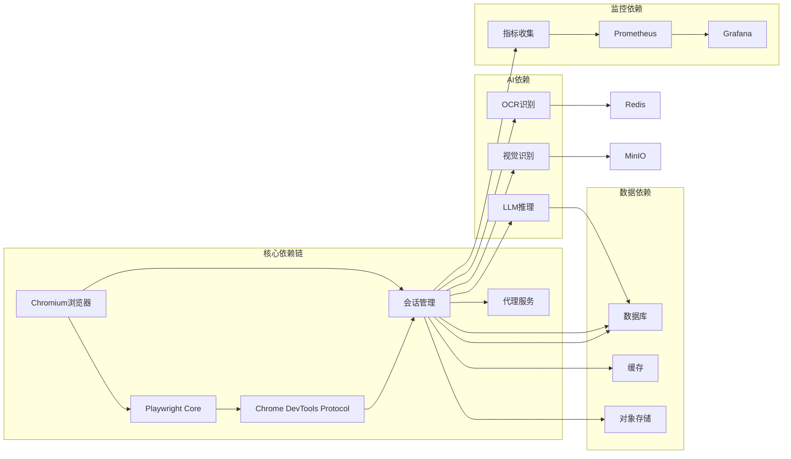

**图表来源**
- [project.md: 496-502:496-502](file://project.md#L496-L502)

**章节来源**
- [project.md: 716-733:716-733](file://project.md#L716-L733)
- [requirements.txt: 1-11:1-11](file://CCC-RPA-API/requirements.txt#L1-L11)

## 性能考虑

### 1. 资源优化策略

系统在资源使用方面采用了多项优化措施：

- **CPU资源**：每个沙箱会话限制在0.5-1核CPU范围内，避免资源争用
- **内存管理**：1-2Gi内存限制，配合内存回收机制防止内存泄漏
- **存储优化**：使用EmptyDir临时存储，避免持久化存储开销
- **网络优化**：通过网络策略减少不必要的网络通信

### 2. 性能监控指标

系统监控以下关键性能指标：

- **会话创建时间**：集群环境下≤3秒
- **AI推理响应时间**：7B本地模型≤1.5秒
- **API网关QPS**：≥100 QPS
- **WebSocket连接数**：≥1000 同时在线
- **CDP操作延迟**：≤200ms

### 3. 扩展性设计

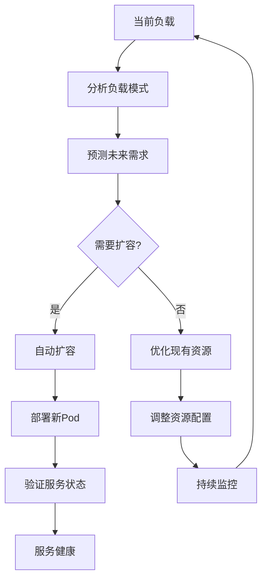

**图表来源**
- [project.md: 506-516:506-516](file://project.md#L506-L516)

**章节来源**
- [project.md: 506-516:506-516](file://project.md#L506-L516)

## 故障排除指南

### 1. 常见问题诊断

#### Pod启动失败

**症状**：Pod处于CrashLoopBackOff状态
**排查步骤**：
1. 检查Pod事件：`kubectl describe pod <pod-name>`
2. 查看容器日志：`kubectl logs <pod-name> --previous`
3. 验证资源配置：检查CPU/内存限制是否合理
4. 检查存储卷挂载：确认EmptyDir正确挂载

#### 会话创建超时

**症状**：会话创建时间超过预期
**排查步骤**：
1. 检查HPA状态：`kubectl describe hpa`
2. 监控任务队列长度：检查BullMQ队列状态
3. 验证代理池可用性：检查代理IP分配情况
4. 监控系统资源：检查CPU和内存使用率

#### 性能问题

**症状**：响应时间过长或吞吐量不足
**排查步骤**：
1. 检查Prometheus指标：监控CPU、内存、网络使用情况
2. 分析慢查询：检查数据库查询性能
3. 优化缓存策略：检查Redis缓存命中率
4. 调整资源配置：根据监控数据调整资源限制

### 2. 错误处理机制

系统实现了多层次的错误处理和自愈机制：

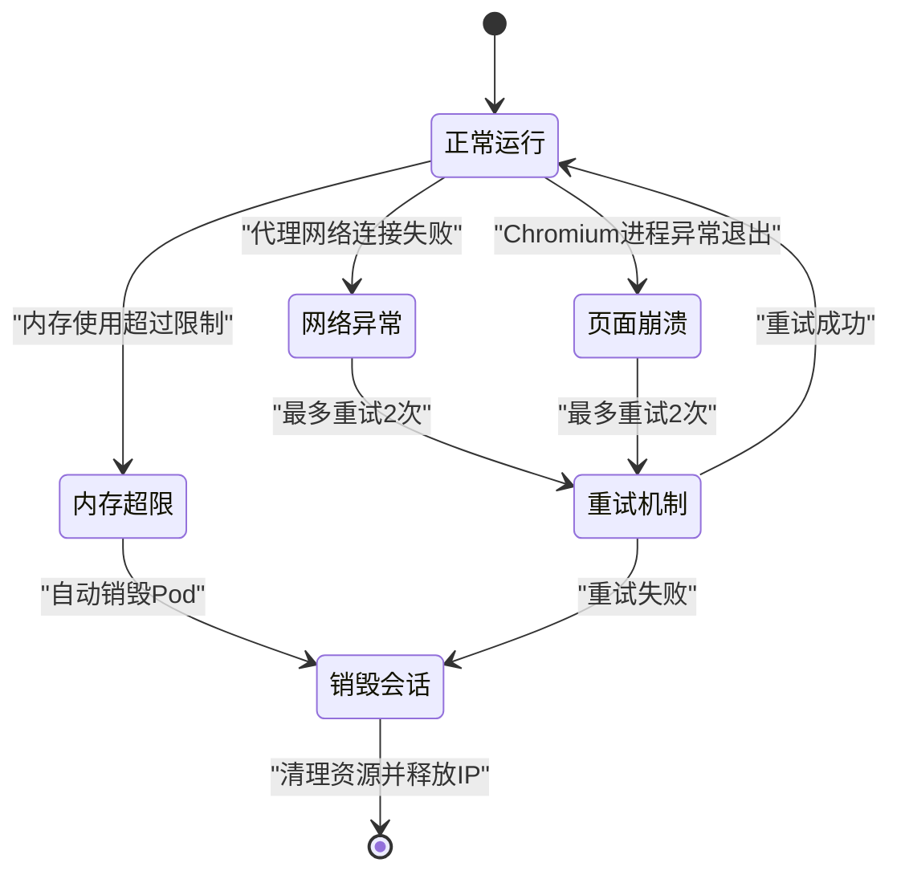

**图表来源**
- [project.md: 271-275:271-275](file://project.md#L271-L275)

**章节来源**
- [project.md: 641-656:641-656](file://project.md#L641-L656)

## 结论

本项目提供了一个完整的Kubernetes容器分布式集群部署解决方案，具有以下特点：

1. **强隔离设计**：通过容器和进程级隔离确保多租户数据安全
2. **弹性扩缩容**：基于任务队列的智能HPA扩缩容机制
3. **资源管控**：严格的CPU和内存资源限制，防止资源争用
4. **高可用性**：多副本部署和自动故障转移机制
5. **可观测性**：完善的监控和日志系统
6. **安全性**：TLS加密、RBAC权限控制、数据加密存储

该方案适用于生产环境的商用AI浏览器系统部署，能够满足高并发、低延迟、强隔离的业务需求。

## 附录

### 1. 完整部署清单

#### 基础设施要求
- Kubernetes集群：1.20+ 版本
- 节点数量：至少3个工作节点
- 存储：支持动态存储供应
- 网络：支持Ingress控制器

#### 环境变量配置

| 环境变量 | 用途 | 示例值 |
|---------|------|--------|
| DATABASE_URL | 数据库连接字符串 | mysql+pymysql://user:pass@db:3306/db |
| REDIS_URL | Redis连接URL | redis://redis:6379 |
| JWT_SECRET | JWT密钥 | 生成的随机字符串 |
| PROXY_POOL_URL | 代理池地址 | http://proxy-pool:8080 |
| OPENAI_API_KEY | OpenAI API密钥 | 有效的API密钥 |

#### 健康检查端点

- **健康检查**：`GET /health`
- **会话状态**：`GET /session/{sessionId}`
- **任务进度**：`GET /task/{taskId}`
- **系统指标**：`GET /metrics`

### 2. CI/CD集成

系统支持多种CI/CD工具集成：

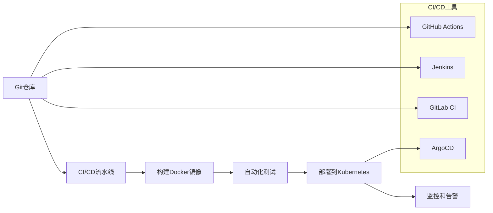

**图表来源**
- [project.md: 552-558:552-558](file://project.md#L552-L558)

### 3. 滚动更新策略

系统采用蓝绿部署和金丝雀发布策略：

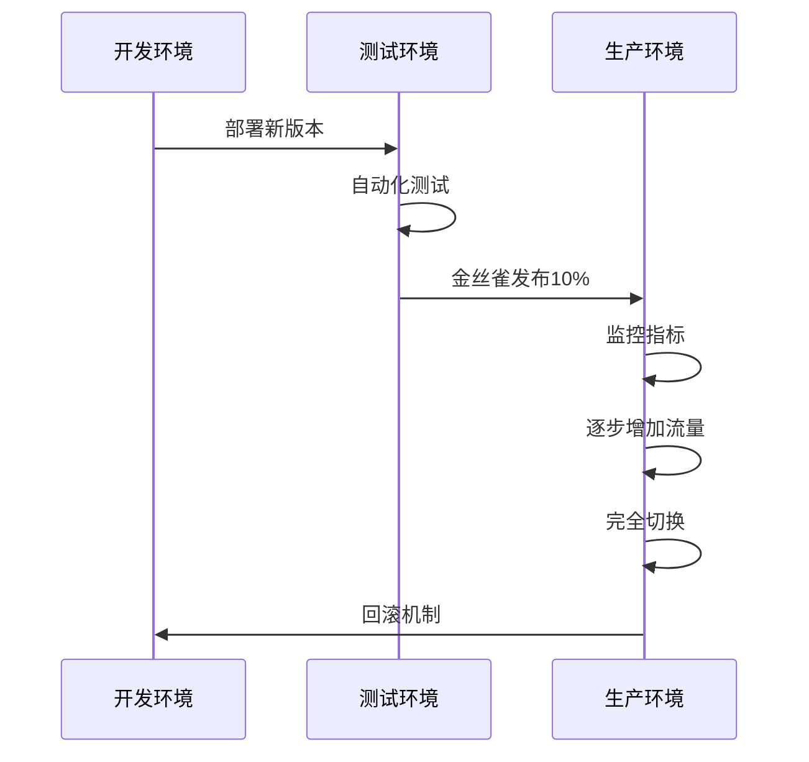

**章节来源**
- [project.md: 552-558:552-558](file://project.md#L552-L558)