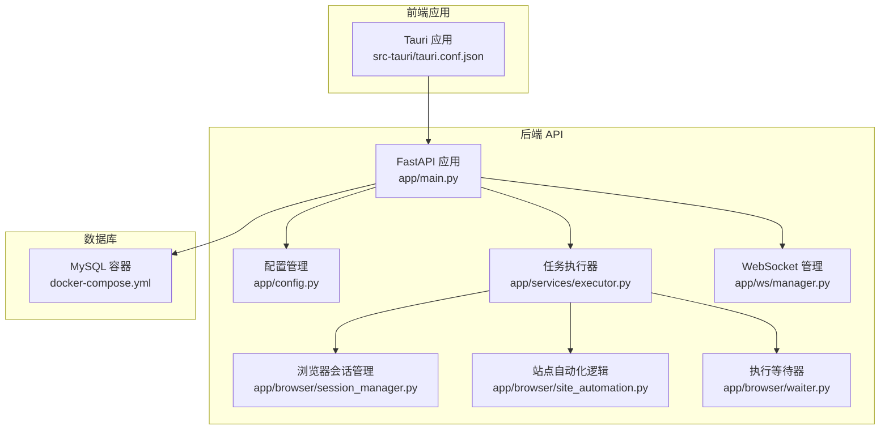
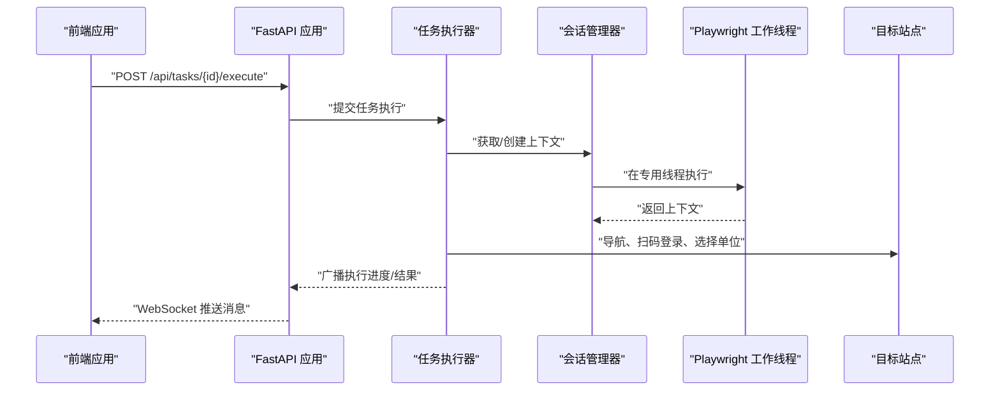
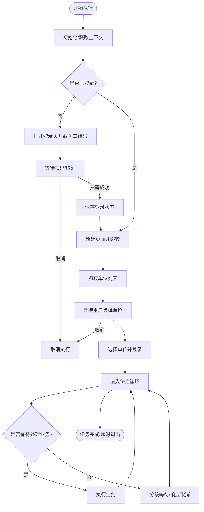
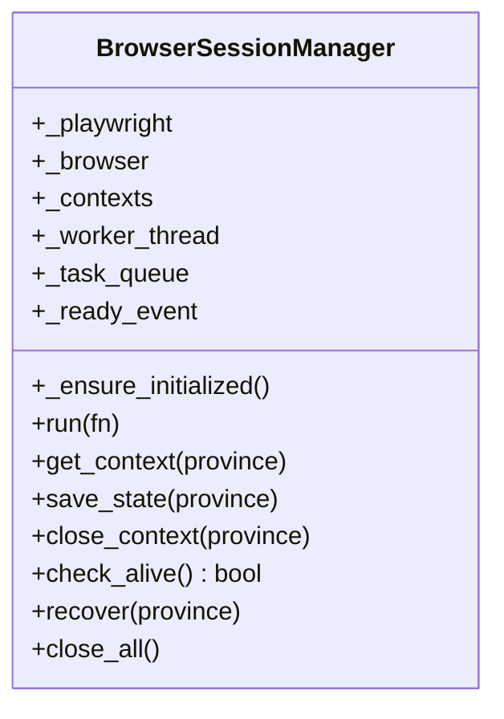
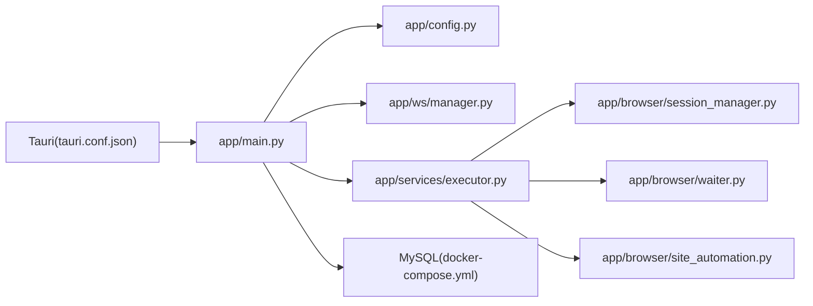

# 单机进程部署

<cite>
**本文引用的文件**
- [main.py](file://CCC_RPA_API/app/main.py)
- [config.py](file://CCC_RPA_API/app/config.py)
- [executor.py](file://CCC_RPA_API/app/services/executor.py)
- [session_manager.py](file://CCC_RPA_API/app/browser/session_manager.py)
- [site_automation.py](file://CCC_RPA_API/app/browser/site_automation.py)
- [waiter.py](file://CCC_RPA_API/app/browser/waiter.py)
- [manager.py](file://CCC_RPA_API/app/ws/manager.py)
- [docker-compose.yml](file://CCC-BrowserV4/docker-compose.yml)
- [tauri.conf.json](file://CCC-BrowserV4/src-tauri/tauri.conf.json)
- [requirements.txt](file://CCC_RPA_API/requirements.txt)
</cite>

## 目录
1. [简介](#简介)
2. [项目结构](#项目结构)
3. [核心组件](#核心组件)
4. [架构总览](#架构总览)
5. [组件详解](#组件详解)
6. [依赖关系分析](#依赖关系分析)
7. [性能与资源管理](#性能与资源管理)
8. [部署与配置](#部署与配置)
9. [故障排除指南](#故障排除指南)
10. [结论](#结论)

## 简介
本文件面向“单机进程沙箱部署”的落地实践，聚焦于内部测试兼容的本地运行方案。文档围绕以下目标展开：
- Linux 环境下的进程隔离与资源限制建议（基于命名空间与 cgroups 的思路说明）
- Windows 环境下的资源管控建议（基于 Job 对象的思路说明）
- 进程间隔离、资源限制配置、端口管理与文件系统隔离的工程化建议
- 提供启动脚本、配置文件示例与环境变量设置指引
- 给出跨平台部署差异对比与常见问题排查方法

说明：当前仓库代码以 Python 后端服务与 Tauri 前端为主，未包含直接的 Linux unshare 或 Windows Job 对象调用实现。因此，本文在“单机进程沙箱部署”层面给出可落地的工程化建议与最佳实践，帮助在现有代码基础上实现更稳健的本地运行与资源隔离。

## 项目结构
本项目由三部分组成：
- 后端 API 服务（FastAPI + MySQL）
- 前端应用（Tauri + Vue）
- 数据库（MySQL）

图表来源
- [main.py:1-127](file://CCC_RPA_API/app/main.py#L1-L127)
- [config.py:1-22](file://CCC_RPA_API/app/config.py#L1-L22)
- [executor.py:1-319](file://CCC_RPA_API/app/services/executor.py#L1-L319)
- [session_manager.py:1-186](file://CCC_RPA_API/app/browser/session_manager.py#L1-L186)
- [site_automation.py:1-743](file://CCC_RPA_API/app/browser/site_automation.py#L1-L743)
- [waiter.py:1-84](file://CCC_RPA_API/app/browser/waiter.py#L1-L84)
- [manager.py:1-29](file://CCC_RPA_API/app/ws/manager.py#L1-L29)
- [docker-compose.yml:1-21](file://CCC-BrowserV4/docker-compose.yml#L1-L21)
- [tauri.conf.json:1-29](file://CCC-BrowserV4/src-tauri/tauri.conf.json#L1-L29)

章节来源
- [main.py:1-127](file://CCC_RPA_API/app/main.py#L1-L127)
- [docker-compose.yml:1-21](file://CCC-BrowserV4/docker-compose.yml#L1-L21)
- [tauri.conf.json:1-29](file://CCC-BrowserV4/src-tauri/tauri.conf.json#L1-L29)

## 核心组件
- FastAPI 应用与路由：提供健康检查、任务管理、WebSocket 通信等接口
- 任务执行器：调度浏览器自动化流程，包含扫码登录、单位选择、业务保活等步骤
- 浏览器会话管理：以省份维度维护 Playwright 上下文，确保状态持久化与恢复
- 等待器：基于线程事件实现的用户交互与取消信号机制
- WebSocket 管理：向前端推送执行进度、二维码、错误等消息
- 数据库：通过 Docker Compose 提供 MySQL 服务

章节来源
- [main.py:1-127](file://CCC_RPA_API/app/main.py#L1-L127)
- [executor.py:1-319](file://CCC_RPA_API/app/services/executor.py#L1-L319)
- [session_manager.py:1-186](file://CCC_RPA_API/app/browser/session_manager.py#L1-L186)
- [waiter.py:1-84](file://CCC_RPA_API/app/browser/waiter.py#L1-L84)
- [manager.py:1-29](file://CCC_RPA_API/app/ws/manager.py#L1-L29)
- [config.py:1-22](file://CCC_RPA_API/app/config.py#L1-L22)

## 架构总览
后端服务通过 FastAPI 提供 REST 与 WebSocket 接口；任务执行器在专用线程池中协调浏览器自动化；浏览器会话管理器在独立工作线程中运行 Playwright，保证与主线程事件循环解耦；前端通过 Tauri 与后端通信。

图表来源
- [main.py:114-127](file://CCC_RPA_API/app/main.py#L114-L127)
- [executor.py:317-319](file://CCC_RPA_API/app/services/executor.py#L317-L319)
- [session_manager.py:79-96](file://CCC_RPA_API/app/browser/session_manager.py#L79-L96)
- [site_automation.py:38-58](file://CCC_RPA_API/app/browser/site_automation.py#L38-L58)

## 组件详解

### 任务执行器（executor）
- 负责任务生命周期管理：初始化、登录检查、扫码登录、单位选择、业务保活、完成收尾
- 使用线程池与等待器分离阻塞等待，避免阻塞 Playwright 工作线程
- 通过 WebSocket 广播执行状态与错误信息

图表来源
- [executor.py:78-315](file://CCC_RPA_API/app/services/executor.py#L78-L315)

章节来源
- [executor.py:1-319](file://CCC_RPA_API/app/services/executor.py#L1-L319)

### 浏览器会话管理（session_manager）
- 在独立线程中启动 Playwright 与 Chromium，避免与 FastAPI 事件循环冲突
- 按省份维护 BrowserContext，并持久化 storage_state
- 提供恢复机制：在浏览器异常时重建上下文

图表来源
- [session_manager.py:10-186](file://CCC_RPA_API/app/browser/session_manager.py#L10-L186)

章节来源
- [session_manager.py:1-186](file://CCC_RPA_API/app/browser/session_manager.py#L1-L186)

### 站点自动化（site_automation）
- 封装登录、扫码、单位选择、保活、业务检测等动作
- 提供多种降级策略与截图调试能力，增强稳定性

章节来源
- [site_automation.py:1-743](file://CCC_RPA_API/app/browser/site_automation.py#L1-L743)

### 执行等待器（waiter）
- 基于线程事件实现阻塞等待、信号唤醒与取消
- 支持保活循环等场景的非阻塞检查

章节来源
- [waiter.py:1-84](file://CCC_RPA_API/app/browser/waiter.py#L1-L84)

### WebSocket 管理（manager）
- 维护连接集合，支持广播消息
- 自动清理断开连接

章节来源
- [manager.py:1-29](file://CCC_RPA_API/app/ws/manager.py#L1-L29)

## 依赖关系分析
- 后端服务依赖数据库（MySQL）、浏览器自动化引擎（Playwright/Chromium）
- 前端通过 Tauri 与后端通信，CSP 限制了连接范围
- 任务执行器依赖会话管理器与站点自动化模块

图表来源
- [main.py:1-127](file://CCC_RPA_API/app/main.py#L1-L127)
- [config.py:1-22](file://CCC_RPA_API/app/config.py#L1-L22)
- [executor.py:1-319](file://CCC_RPA_API/app/services/executor.py#L1-L319)
- [session_manager.py:1-186](file://CCC_RPA_API/app/browser/session_manager.py#L1-L186)
- [waiter.py:1-84](file://CCC_RPA_API/app/browser/waiter.py#L1-L84)
- [site_automation.py:1-743](file://CCC_RPA_API/app/browser/site_automation.py#L1-L743)
- [manager.py:1-29](file://CCC_RPA_API/app/ws/manager.py#L1-L29)
- [docker-compose.yml:1-21](file://CCC-BrowserV4/docker-compose.yml#L1-L21)
- [tauri.conf.json:1-29](file://CCC-BrowserV4/src-tauri/tauri.conf.json#L1-L29)

## 性能与资源管理
- 线程与并发
  - 任务执行器与等待器分别使用线程池，避免阻塞 Playwright 工作线程
  - Playwright 在专用线程中启动，减少与主线程事件循环的耦合
- 资源占用控制建议
  - 限制同时执行的任务数量，避免浏览器实例过多导致内存与 CPU 压力
  - 为浏览器进程设置合理的窗口大小与无头模式参数
  - 在长时间保活期间，采用分段等待与随机保活动作，降低页面压力
- 端口与网络
  - 后端监听本地端口，WebSocket 仅允许本地地址
  - 前端 CSP 限制了连接范围，避免跨域风险
- 文件系统
  - 浏览器状态存储在独立目录，便于清理与隔离

章节来源
- [executor.py:17-33](file://CCC_RPA_API/app/services/executor.py#L17-L33)
- [session_manager.py:42-77](file://CCC_RPA_API/app/browser/session_manager.py#L42-L77)
- [tauri.conf.json:24-26](file://CCC-BrowserV4/src-tauri/tauri.conf.json#L24-L26)

## 部署与配置

### 环境准备
- Python 运行时与依赖安装
  - 使用后端 requirements.txt 安装依赖
- 数据库
  - 使用 Docker Compose 启动 MySQL，确保端口映射与数据卷配置正确
- 前端
  - Tauri 应用通过 tauri.conf.json 配置窗口与安全策略

章节来源
- [requirements.txt](file://CCC_RPA_API/requirements.txt)
- [docker-compose.yml:1-21](file://CCC-BrowserV4/docker-compose.yml#L1-L21)
- [tauri.conf.json:1-29](file://CCC-BrowserV4/src-tauri/tauri.conf.json#L1-L29)

### 启动顺序与脚本建议
- 启动数据库
  - 使用 docker-compose 启动 MySQL
- 启动后端服务
  - 设置数据库连接环境变量（参考配置文件中的 DATABASE_URL）
  - 启动 FastAPI 应用，监听本地端口
- 启动前端
  - 使用 Tauri 运行前端应用，确保与后端通信正常

章节来源
- [docker-compose.yml:1-21](file://CCC-BrowserV4/docker-compose.yml#L1-L21)
- [config.py:13-15](file://CCC_RPA_API/app/config.py#L13-L15)
- [main.py:114-127](file://CCC_RPA_API/app/main.py#L114-L127)
- [tauri.conf.json:6-11](file://CCC-BrowserV4/src-tauri/tauri.conf.json#L6-L11)

### 环境变量与配置文件
- 数据库连接
  - 通过配置类生成 DATABASE_URL，可在运行时注入环境变量
- 前端安全策略
  - CSP 限制了连接来源，确保只允许本地地址与必要域名

章节来源
- [config.py:1-22](file://CCC_RPA_API/app/config.py#L1-L22)
- [tauri.conf.json:24-26](file://CCC-BrowserV4/src-tauri/tauri.conf.json#L24-L26)

### 跨平台部署差异与沙箱建议

- Linux 环境（命名空间隔离与资源限制）
  - 进程隔离：使用 unshare 创建独立的 PID/IPC/UTS/NET 命名空间，结合 systemd-run 或 nsjail 等工具实现更强的隔离
  - 资源限制：使用 cgroups v1/v2 控制 CPU、内存、IO 限额；结合 systemd 的 Slice/Scope 限定资源
  - 端口管理：在独立网络命名空间中分配端口，避免与宿主冲突
  - 文件系统隔离：使用 bind mount 将最小化根文件系统挂载到受控目录，仅暴露必要路径
  - 注意：以上为工程化建议，当前仓库未包含直接的 Linux 命名空间调用实现

- Windows 环境（Job 对象资源管控）
  - 进程隔离：通过创建 Job 对象，将浏览器进程加入该 Job，实现统一的资源与生命周期管理
  - 资源限制：在 Job 上设置最大内存、处理器份额、作业时间上限等
  - 端口管理：在独立会话或容器中运行，避免与系统服务端口冲突
  - 文件系统隔离：使用受限用户权限与只读挂载，限制写入范围
  - 注意：以上为工程化建议，当前仓库未包含直接的 Windows Job 对象调用实现

- 当前代码基现状
  - 后端服务与前端应用均为单机本地运行，未内置命名空间或 Job 对象隔离
  - 通过线程与事件机制实现任务与浏览器的解耦，具备一定隔离效果
  - 建议在生产环境中叠加上述系统级隔离与资源限制措施

## 故障排除指南
- 浏览器初始化失败
  - 检查 Playwright 工作线程是否就绪，确认无超时或异常
  - 查看会话管理器的恢复日志，必要时重启浏览器实例
- 扫码登录超时或取消
  - 确认前端已推送二维码并等待用户操作
  - 检查等待器是否正确注册与唤醒
- 单位选择失败
  - 查看站点自动化截图与日志，确认页面结构变化
  - 检查选择器匹配策略与回退逻辑
- 保活循环异常
  - 确认保活间隔与取消信号响应
  - 检查页面是否存在意外弹窗或跳转
- WebSocket 断连
  - 检查连接管理器的广播与清理逻辑
  - 确认前端连接状态与 CSP 限制

章节来源
- [session_manager.py:42-77](file://CCC_RPA_API/app/browser/session_manager.py#L42-L77)
- [executor.py:132-140](file://CCC_RPA_API/app/services/executor.py#L132-L140)
- [site_automation.py:147-192](file://CCC_RPA_API/app/browser/site_automation.py#L147-L192)
- [waiter.py:14-32](file://CCC_RPA_API/app/browser/waiter.py#L14-L32)
- [manager.py:17-26](file://CCC_RPA_API/app/ws/manager.py#L17-L26)

## 结论
本项目提供了可直接运行的单机本地部署方案：后端通过 FastAPI 提供接口与 WebSocket，前端通过 Tauri 与后端通信，数据库使用 Docker Compose 管理。当前代码未包含系统级命名空间或 Job 对象隔离，但通过线程与事件机制实现了任务与浏览器的解耦。若需进一步提升隔离性与资源可控性，建议在 Linux 环境引入 unshare/cgroups，在 Windows 环境引入 Job 对象，并结合最小化文件系统与端口管理策略，形成完整的单机进程沙箱部署方案。