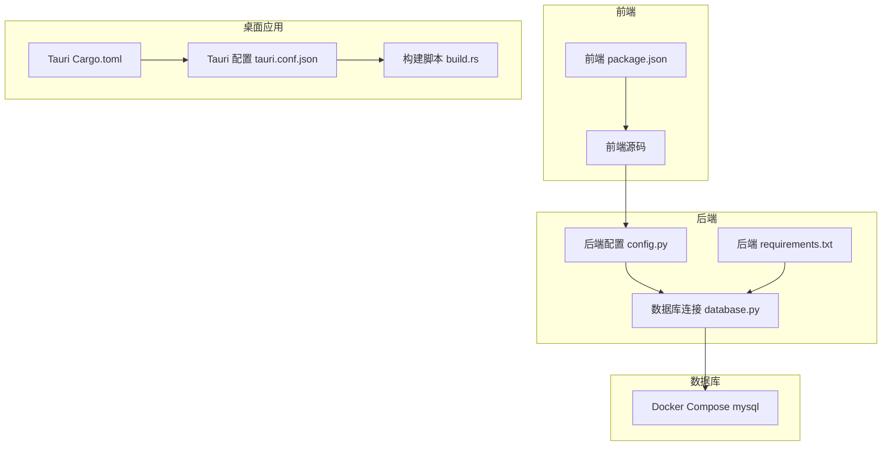
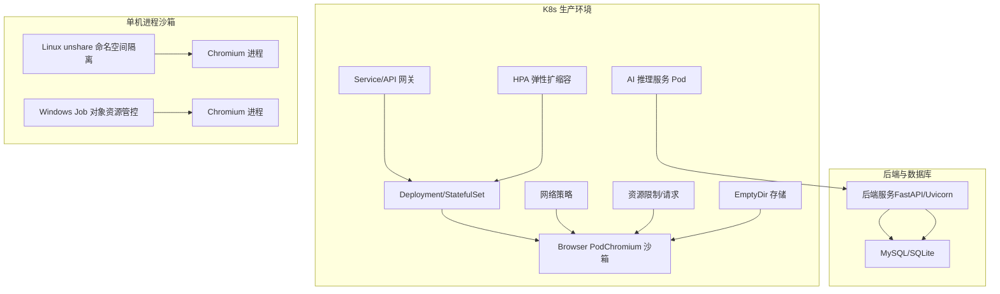
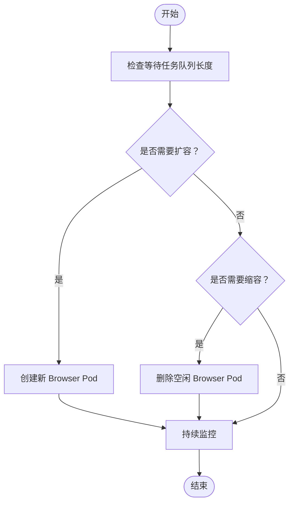
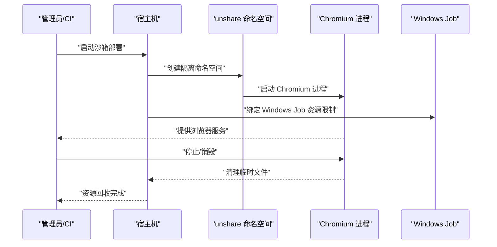
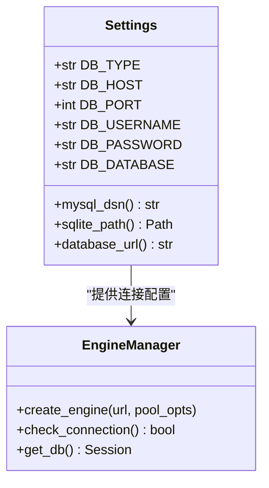
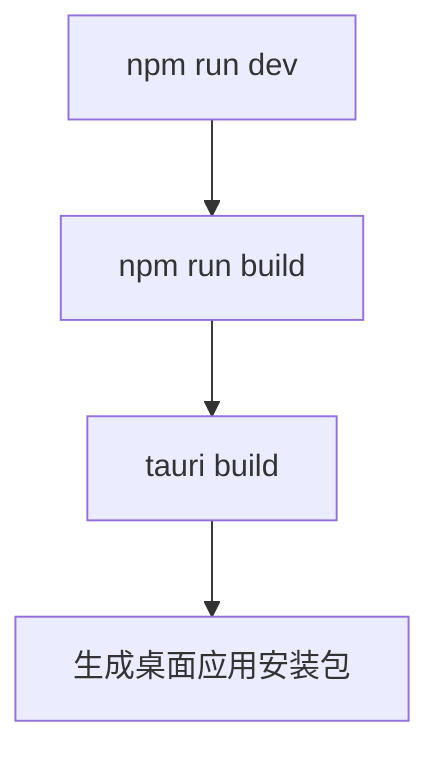
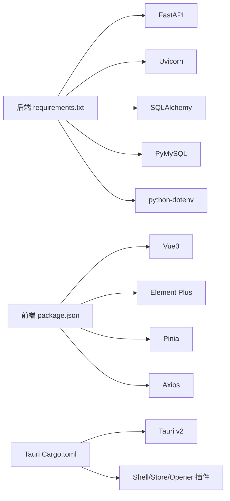

# 标准化部署形态

<cite>
**本文引用的文件**
- [docker-compose.yml](file://CCC-BrowserV4/docker-compose.yml)
- [requirements.txt](file://CCC-BrowserV4/backend/requirements.txt)
- [Cargo.toml](file://CCC-BrowserV4/src-tauri/Cargo.toml)
- [tauri.conf.json](file://CCC-BrowserV4/src-tauri/tauri.conf.json)
- [config.py](file://CCC-BrowserV4/backend/app/config.py)
- [database.py](file://CCC-BrowserV4/backend/app/database.py)
- [package.json](file://CCC-BrowserV4/frontend/package.json)
- [build.rs](file://CCC-BrowserV4/src-tauri/build.rs)
- [project.md](file://project.md)
</cite>

## 目录
1. [引言](#引言)
2. [项目结构](#项目结构)
3. [核心组件](#核心组件)
4. [架构总览](#架构总览)
5. [详细组件分析](#详细组件分析)
6. [依赖关系分析](#依赖关系分析)
7. [性能考量](#性能考量)
8. [故障排查指南](#故障排查指南)
9. [结论](#结论)
10. [附录](#附录)

## 引言
本文件面向商用级 AI 浏览器系统的标准化部署，聚焦两类强制部署形态：
- 商用生产环境：基于 K8s 的容器分布式集群部署，强调 Pod 编排、HPA 弹性扩缩容、资源限制、网络策略与存储管理。
- 内部测试兼容：单机进程沙箱部署，覆盖 Linux unshare 命名空间隔离与 Windows Job 对象资源管控。

同时，结合仓库现有配置与项目文档中的统一规范，给出环境准备、部署配置示例与最佳实践建议，帮助在不同环境中稳定落地。

## 项目结构
该仓库包含前端、后端、桌面应用与数据库服务等模块，其中与部署直接相关的关键文件如下：
- 后端服务（FastAPI + Uvicorn）：提供 API 与数据库访问能力，配置来源于环境变量与 .env 文件。
- 前端（Vue3 + Vite）：通过 Tauri 打包为桌面应用，或作为 Web 前端运行。
- 桌面应用（Tauri v2）：跨平台窗口、安全策略与构建配置。
- 数据库：MySQL（compose 中提供），后端按配置选择 MySQL 或 SQLite。
- 依赖清单：后端 Python 依赖、前端依赖、Tauri 依赖。

图表来源
- [docker-compose.yml:1-21](file://CCC-BrowserV4/docker-compose.yml#L1-L21)
- [requirements.txt:1-13](file://CCC-BrowserV4/backend/requirements.txt#L1-L13)
- [Cargo.toml:1-22](file://CCC-BrowserV4/src-tauri/Cargo.toml#L1-L22)
- [tauri.conf.json:1-29](file://CCC-BrowserV4/src-tauri/tauri.conf.json#L1-L29)
- [config.py:1-52](file://CCC-BrowserV4/backend/app/config.py#L1-L52)
- [database.py:1-45](file://CCC-BrowserV4/backend/app/database.py#L1-L45)
- [package.json:1-29](file://CCC-BrowserV4/frontend/package.json#L1-L29)
- [build.rs:1-4](file://CCC-BrowserV4/src-tauri/build.rs#L1-L4)

章节来源
- [docker-compose.yml:1-21](file://CCC-BrowserV4/docker-compose.yml#L1-L21)
- [requirements.txt:1-13](file://CCC-BrowserV4/backend/requirements.txt#L1-L13)
- [Cargo.toml:1-22](file://CCC-BrowserV4/src-tauri/Cargo.toml#L1-L22)
- [tauri.conf.json:1-29](file://CCC-BrowserV4/src-tauri/tauri.conf.json#L1-L29)
- [config.py:1-52](file://CCC-BrowserV4/backend/app/config.py#L1-L52)
- [database.py:1-45](file://CCC-BrowserV4/backend/app/database.py#L1-L45)
- [package.json:1-29](file://CCC-BrowserV4/frontend/package.json#L1-L29)
- [build.rs:1-4](file://CCC-BrowserV4/src-tauri/build.rs#L1-L4)

## 核心组件
- 配置管理：后端通过 Pydantic Settings 从 .env 与环境变量读取配置，支持 MySQL 与 SQLite 切换，并生成数据库连接串。
- 数据库连接：SQLAlchemy 引擎与会话工厂，提供连接池参数与健康检查。
- 前端与打包：Vite + Vue3 构建，Tauri 打包为桌面应用；开发/构建命令在 package.json 中定义。
- 桌面应用：Tauri v2 配置包含窗口尺寸、最小尺寸、CSP 等安全策略，以及构建前后钩子。
- 数据库服务：Docker Compose 提供 MySQL 服务，暴露端口并挂载卷。

章节来源
- [config.py:9-52](file://CCC-BrowserV4/backend/app/config.py#L9-L52)
- [database.py:8-45](file://CCC-BrowserV4/backend/app/database.py#L8-L45)
- [package.json:6-27](file://CCC-BrowserV4/frontend/package.json#L6-L27)
- [tauri.conf.json:6-27](file://CCC-BrowserV4/src-tauri/tauri.conf.json#L6-L27)
- [docker-compose.yml:4-21](file://CCC-BrowserV4/docker-compose.yml#L4-L21)

## 架构总览
下图展示两类部署形态的总体架构与关键组件交互：

图表来源
- [project.md:251-261](file://project.md#L251-L261)
- [project.md:734-765](file://project.md#L734-L765)
- [config.py:18-47](file://CCC-BrowserV4/backend/app/config.py#L18-L47)
- [database.py:8-22](file://CCC-BrowserV4/backend/app/database.py#L8-L22)
- [docker-compose.yml:4-21](file://CCC-BrowserV4/docker-compose.yml#L4-L21)

## 详细组件分析

### K8s 容器分布式集群部署
- Pod 编排与沙箱模板
  - 参考项目文档中的“K8s 浏览器沙箱 Pod 基础模板”，包含资源限制、环境变量注入（会话 ID、代理地址、租户 ID）、EmptyDir 挂载会话数据目录等。
  - 关键字段映射到实际部署时需注入的动态值，确保每个会话的资源边界与数据隔离。
- HPA 弹性扩缩容
  - 依据等待任务队列长度触发扩缩容，避免资源瓶颈与成本浪费。
  - 需配套指标采集（如 Prometheus）与 HPA 规则定义。
- 资源限制与请求
  - CPU 与内存设置应结合业务峰值与并发度评估，避免过度分配导致节点资源争用。
- 网络策略
  - 限制 Pod 出入站流量，仅放行必要的 API 网关与 AI 服务地址，降低攻击面。
- 存储管理
  - 使用 EmptyDir 作为会话临时存储，Pod 删除即清理，避免数据残留。
  - 如需持久化，建议使用 PVC 并配合快照与备份策略。

图表来源
- [project.md:259](file://project.md#L259)

章节来源
- [project.md:251-261](file://project.md#L251-L261)
- [project.md:734-765](file://project.md#L734-L765)

### 单机进程沙箱部署
- Linux unshare 命名空间隔离
  - 通过 unshare 创建独立的 PID/IPC/NET/UTS 命名空间，限制 Chromium 进程与其宿主系统的可见性与交互范围。
  - 结合 cgroups 对 CPU、内存、IO 进行配额与限制，防止资源滥用。
- Windows Job 对象资源管控
  - 使用 Job 对象对 Chromium 进程组进行资源上限与作业期限控制，支持优先级与代收费用统计。
  - 结合 Windows 资源控制器（如 Pico 容器或轻量级隔离）进一步增强隔离强度。
- 进程生命周期
  - 启动前初始化隔离目录与沙箱环境，退出前清理临时文件与残留进程，确保资源全量回收。

图表来源
- [project.md:145](file://project.md#L145)

章节来源
- [project.md:145](file://project.md#L145)

### 后端服务与数据库连接
- 配置加载
  - 通过 Settings 从 .env 与环境变量读取数据库类型与连接信息，支持 MySQL 与 SQLite。
- 连接池与健康检查
  - SQLAlchemy 引擎配置连接池大小、溢出、回收与预热；提供连接检查函数用于健康探针。
- FastAPI/Uvicorn
  - 后端以 FastAPI 提供 API，Uvicorn 作为 ASGI 服务器运行，配合数据库依赖注入。

图表来源
- [config.py:9-52](file://CCC-BrowserV4/backend/app/config.py#L9-L52)
- [database.py:8-45](file://CCC-BrowserV4/backend/app/database.py#L8-L45)

章节来源
- [config.py:9-52](file://CCC-BrowserV4/backend/app/config.py#L9-L52)
- [database.py:8-45](file://CCC-BrowserV4/backend/app/database.py#L8-L45)

### 前端与桌面应用
- 前端构建与开发
  - package.json 定义开发、构建与预览脚本，依赖 Vue3、Element Plus、Pinia、Axios 等。
- Tauri 打包
  - tauri.conf.json 定义窗口属性、CSP 安全策略、构建前后钩子；Cargo.toml 管理 Rust 依赖与插件。
  - build.rs 作为 Tauri 构建入口。

图表来源
- [package.json:6-11](file://CCC-BrowserV4/frontend/package.json#L6-L11)
- [tauri.conf.json:6-11](file://CCC-BrowserV4/src-tauri/tauri.conf.json#L6-L11)
- [Cargo.toml:9-22](file://CCC-BrowserV4/src-tauri/Cargo.toml#L9-L22)
- [build.rs:1-4](file://CCC-BrowserV4/src-tauri/build.rs#L1-L4)

章节来源
- [package.json:6-27](file://CCC-BrowserV4/frontend/package.json#L6-L27)
- [tauri.conf.json:6-27](file://CCC-BrowserV4/src-tauri/tauri.conf.json#L6-L27)
- [Cargo.toml:9-22](file://CCC-BrowserV4/src-tauri/Cargo.toml#L9-L22)
- [build.rs:1-4](file://CCC-BrowserV4/src-tauri/build.rs#L1-L4)

## 依赖关系分析
- 后端依赖
  - FastAPI、Uvicorn、SQLAlchemy、PyMySQL、Pydantic Settings、python-dotenv。
- 前端依赖
  - Vue3、Element Plus、Pinia、Axios、Vite、TypeScript。
- 桌面应用依赖
  - Tauri v2、shell/store/opener 插件、Serde、Tokio、tiny_http。

图表来源
- [requirements.txt:2-12](file://CCC-BrowserV4/backend/requirements.txt#L2-L12)
- [package.json:12-27](file://CCC-BrowserV4/frontend/package.json#L12-L27)
- [Cargo.toml:9-22](file://CCC-BrowserV4/src-tauri/Cargo.toml#L9-L22)

章节来源
- [requirements.txt:1-13](file://CCC-BrowserV4/backend/requirements.txt#L1-L13)
- [package.json:12-27](file://CCC-BrowserV4/frontend/package.json#L12-L27)
- [Cargo.toml:9-22](file://CCC-BrowserV4/src-tauri/Cargo.toml#L9-L22)

## 性能考量
- 连接池优化
  - 合理设置 pool_size 与 max_overflow，避免高并发下的连接饥饿与抖动。
  - 启用 pool_pre_ping 与 recycle，提升连接稳定性与回收效率。
- 资源规划
  - K8s 中为 Browser Pod 设置合理的 requests/limits，结合 HPA 动态调整副本数。
  - 单机沙箱中为 Chromium 进程设置 CPU/内存限额，避免宿主资源争用。
- I/O 与缓存
  - 将临时数据置于 EmptyDir，减少磁盘 I/O；必要时使用内存型卷加速。
- 网络延迟
  - 将 API 与 AI 服务就近部署，缩短跨服务调用链路。

## 故障排查指南
- 数据库连接失败
  - 检查 .env 与环境变量中的 DB_TYPE、DB_HOST、DB_PORT、DB_USERNAME、DB_PASSWORD、DB_DATABASE 是否正确。
  - 使用连接检查函数验证连通性。
- K8s Pod 无法启动
  - 查看资源限制是否过高导致驱逐；确认 EmptyDir 挂载与权限；检查网络策略放行情况。
- 单机沙箱进程卡死
  - 检查 unshare 命名空间隔离是否生效；Windows Job 是否正确绑定；必要时重启宿主服务。
- 前端构建失败
  - 确认 Node.js 与 npm 版本满足 package.json 要求；清理 node_modules 重新安装依赖。

章节来源
- [config.py:18-47](file://CCC-BrowserV4/backend/app/config.py#L18-L47)
- [database.py:37-45](file://CCC-BrowserV4/backend/app/database.py#L37-L45)
- [docker-compose.yml:4-21](file://CCC-BrowserV4/docker-compose.yml#L4-L21)

## 结论
本文件基于仓库现有配置与项目文档，系统梳理了两类标准化部署形态的关键要素：K8s 的 Pod 编排、HPA、资源与网络策略、存储管理，以及单机进程的 Linux unshare 与 Windows Job 资源管控。结合后端配置、数据库连接与前端/桌面应用的构建链路，给出了可操作的部署建议与最佳实践，便于在不同环境下实现一致性的隔离、性能与可靠性目标。

## 附录
- 环境准备清单
  - 后端：Python 3.10+、pip、虚拟环境；MySQL 或 SQLite。
  - 前端：Node.js 18+、npm；Vite、Vue3 工具链。
  - 桌面应用：Rust 工具链、Tauri CLI；对应平台 SDK。
  - K8s：kubectl、Helm（可选）；Prometheus/Grafana（可选）。
- 部署配置示例参考
  - K8s Pod 模板与 HPA 规则可参考项目文档附录 C。
  - 单机进程沙箱的命名空间与 Job 配置可参考项目文档第 145 条。
- 最佳实践
  - 明确资源边界与配额，启用健康检查与自动恢复。
  - 严格控制网络访问，最小化暴露面。
  - 使用 EmptyDir 实现会话级数据隔离，避免跨会话污染。
  - 在生产环境引入指标与告警，持续优化资源利用率。

章节来源
- [project.md:734-765](file://project.md#L734-L765)
- [project.md:145](file://project.md#L145)