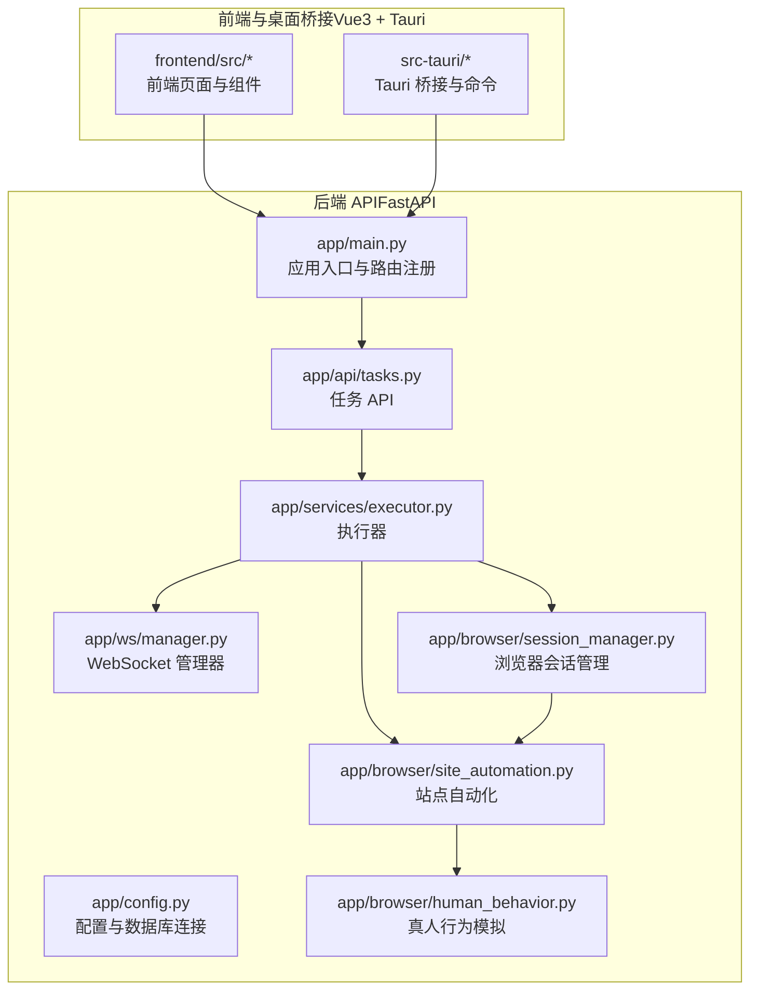
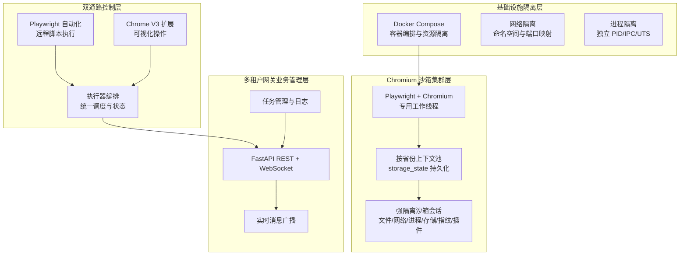
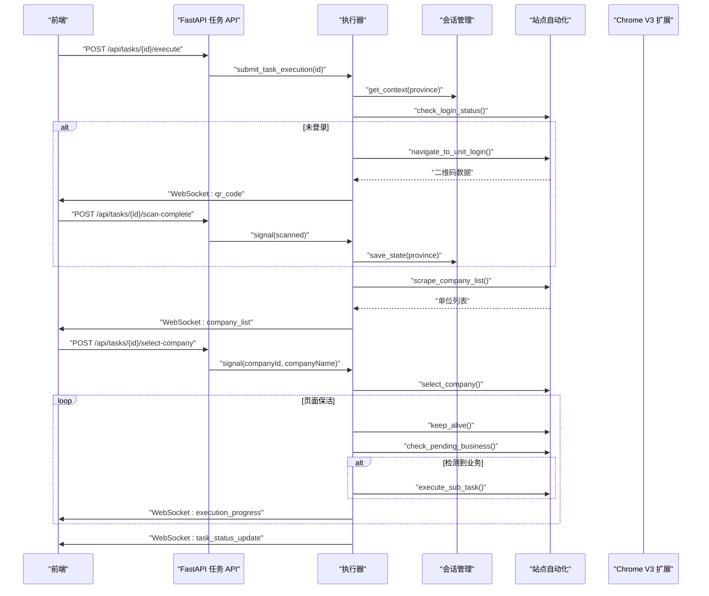
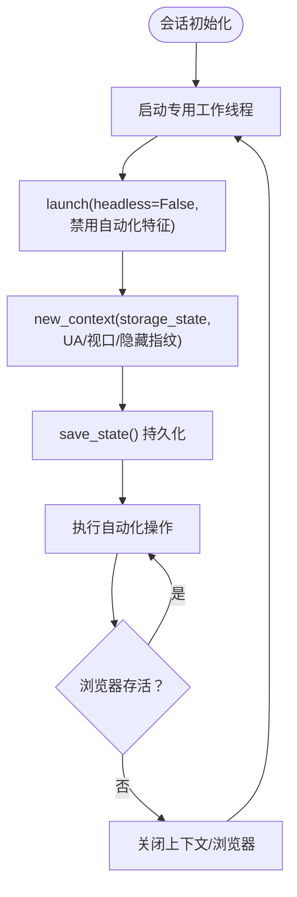
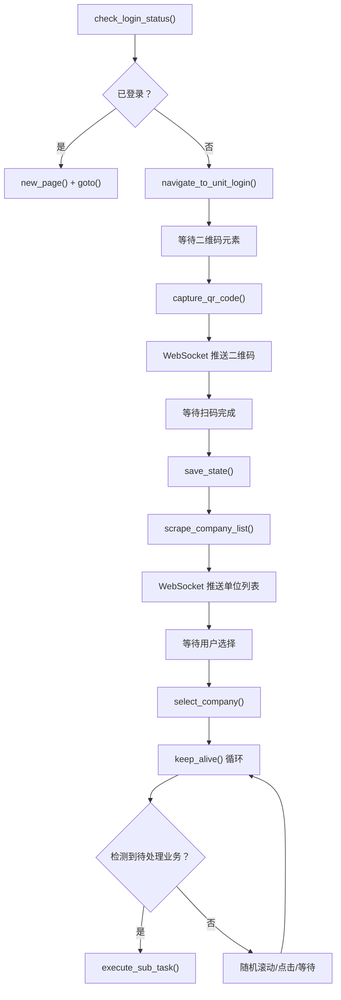
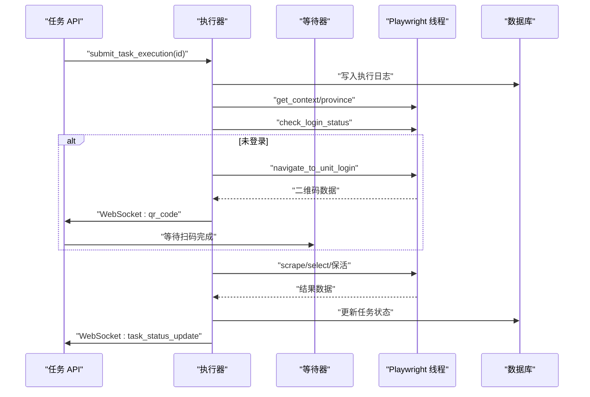
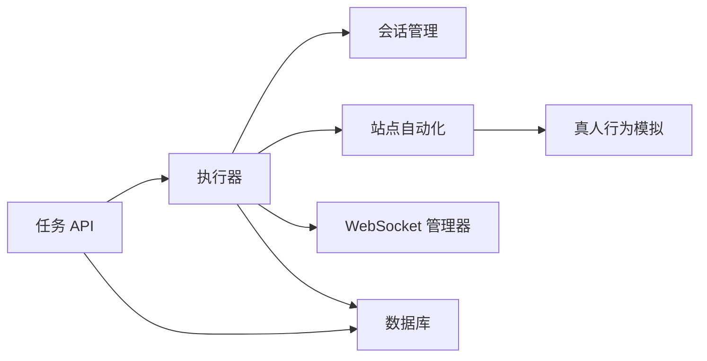

# 系统架构设计

<cite>
**本文档引用的文件**
- [app/main.py](file://CCC_RPA_API/app/main.py)
- [app/config.py](file://CCC_RPA_API/app/config.py)
- [app/browser/session_manager.py](file://CCC_RPA_API/app/browser/session_manager.py)
- [app/browser/site_automation.py](file://CCC_RPA_API/app/browser/site_automation.py)
- [app/browser/human_behavior.py](file://CCC_RPA_API/app/browser/human_behavior.py)
- [app/services/executor.py](file://CCC_RPA_API/app/services/executor.py)
- [app/api/tasks.py](file://CCC_RPA_API/app/api/tasks.py)
- [app/ws/manager.py](file://CCC_RPA_API/app/ws/manager.py)
- [backend/app/api/health.py](file://CCC-BrowserV4/backend/app/api/health.py)
</cite>

## 目录
1. [简介](#简介)
2. [项目结构](#项目结构)
3. [核心组件](#核心组件)
4. [架构总览](#架构总览)
5. [详细组件分析](#详细组件分析)
6. [依赖关系分析](#依赖关系分析)
7. [性能考虑](#性能考虑)
8. [故障排查指南](#故障排查指南)
9. [结论](#结论)
10. [附录](#附录)

## 简介
本系统是一个面向商用场景的“AI 浏览器”自动化平台，围绕“五层标准分层架构”进行设计与实现，覆盖从基础设施隔离到智能驱动微服务的完整链路。系统以“双通路操控体系”为核心能力：一通路为 Playwright 远程脚本自动化，另一通路为 Chrome V3 扩展可视化操作；同时通过强隔离沙箱会话实现多维度隔离（文件层、网络层、进程层、浏览器存储层、指纹层、插件层），确保高并发、高稳定性的多租户运行。

## 项目结构
系统主要由两部分组成：
- 后端 API 与业务逻辑：基于 Python FastAPI，提供任务编排、浏览器会话管理、站点自动化、WebSocket 实时通信等功能。
- 前端与桌面桥接：Vue3 + Tauri，负责用户界面、任务调度、与后端的实时通信以及本地命令桥接。

图表来源
- [app/main.py:1-115](file://CCC_RPA_API/app/main.py#L1-L115)
- [app/config.py:1-22](file://CCC_RPA_API/app/config.py#L1-L22)
- [app/ws/manager.py:1-29](file://CCC_RPA_API/app/ws/manager.py#L1-L29)
- [app/api/tasks.py:1-76](file://CCC_RPA_API/app/api/tasks.py#L1-L76)
- [app/services/executor.py:1-308](file://CCC_RPA_API/app/services/executor.py#L1-L308)
- [app/browser/session_manager.py:1-183](file://CCC_RPA_API/app/browser/session_manager.py#L1-L183)
- [app/browser/site_automation.py:1-562](file://CCC_RPA_API/app/browser/site_automation.py#L1-L562)
- [app/browser/human_behavior.py:1-86](file://CCC_RPA_API/app/browser/human_behavior.py#L1-L86)

章节来源
- [app/main.py:1-115](file://CCC_RPA_API/app/main.py#L1-L115)
- [app/config.py:1-22](file://CCC_RPA_API/app/config.py#L1-L22)

## 核心组件
- 应用入口与路由：注册 CORS、数据库初始化、健康检查、WebSocket 端点，统一暴露任务 API。
- 任务 API：提供任务的增删改查、执行、日志查询、扫码完成与单位选择等信号接口。
- 执行器：协调浏览器会话、站点自动化、用户交互等待、保活与业务触发、日志记录与状态更新。
- 浏览器会话管理：按省份隔离的 Playwright 上下文池化管理，持久化 storage_state，专用工作线程执行，避免与 asyncio 冲突。
- 站点自动化：针对特定站点的登录、扫码、单位选择、列表抓取、保活与业务检测等流程。
- 真人行为模拟：随机延迟、鼠标移动轨迹、滚动与键盘输入模拟，降低被风控识别概率。
- WebSocket 管理：集中维护连接、广播执行进度与结果，支持主事件循环安全广播。

章节来源
- [app/main.py:102-115](file://CCC_RPA_API/app/main.py#L102-L115)
- [app/api/tasks.py:47-76](file://CCC_RPA_API/app/api/tasks.py#L47-L76)
- [app/services/executor.py:68-304](file://CCC_RPA_API/app/services/executor.py#L68-L304)
- [app/browser/session_manager.py:7-183](file://CCC_RPA_API/app/browser/session_manager.py#L7-L183)
- [app/browser/site_automation.py:16-562](file://CCC_RPA_API/app/browser/site_automation.py#L16-L562)
- [app/browser/human_behavior.py:12-86](file://CCC_RPA_API/app/browser/human_behavior.py#L12-L86)
- [app/ws/manager.py:5-29](file://CCC_RPA_API/app/ws/manager.py#L5-L29)

## 架构总览
系统采用“五层标准分层架构”，自下而上为：
- 基础设施隔离层：Docker Compose 编排（容器化部署）、网络与卷隔离、进程隔离。
- Chromium 沙箱集群层：Playwright + Chromium，专用工作线程、上下文池化、storage_state 持久化。
- 双通路控制层：Playwright 自动化与 Chrome V3 扩展可视化并存，统一由执行器编排。
- 多租户网关业务管理层：FastAPI 提供 REST API 与 WebSocket，任务编排与状态管理。
- AI 智能驱动微服务层：可扩展的业务微服务（如 OCR、NLP、图像识别）与前端协作。

图表来源
- [app/browser/session_manager.py:27-94](file://CCC_RPA_API/app/browser/session_manager.py#L27-L94)
- [app/services/executor.py:68-304](file://CCC_RPA_API/app/services/executor.py#L68-L304)
- [app/main.py:12-26](file://CCC_RPA_API/app/main.py#L12-L26)
- [app/ws/manager.py:17-26](file://CCC_RPA_API/app/ws/manager.py#L17-L26)

## 详细组件分析

### 组件 A：双通路操控体系（Playwright 远程脚本自动化与 Chrome V3 扩展可视化）
- Playwright 通路：通过专用工作线程启动 Chromium，按省份创建独立上下文，持久化 storage_state，执行站点自动化流程（登录、扫码、单位选择、保活、业务检测）。
- Chrome V3 扩展通路：作为可视化操作补充，与后端通过 WebSocket 交互，接收用户指令与状态反馈。
- 统一编排：执行器根据任务状态与用户交互信号，动态选择通路并协调两者。

图表来源
- [app/api/tasks.py:47-76](file://CCC_RPA_API/app/api/tasks.py#L47-L76)
- [app/services/executor.py:68-304](file://CCC_RPA_API/app/services/executor.py#L68-L304)
- [app/browser/session_manager.py:96-132](file://CCC_RPA_API/app/browser/session_manager.py#L96-L132)
- [app/browser/site_automation.py:38-192](file://CCC_RPA_API/app/browser/site_automation.py#L38-L192)

章节来源
- [app/services/executor.py:68-304](file://CCC_RPA_API/app/services/executor.py#L68-L304)
- [app/browser/session_manager.py:7-183](file://CCC_RPA_API/app/browser/session_manager.py#L7-L183)
- [app/browser/site_automation.py:16-562](file://CCC_RPA_API/app/browser/site_automation.py#L16-L562)
- [app/api/tasks.py:47-76](file://CCC_RPA_API/app/api/tasks.py#L47-L76)

### 组件 B：强隔离沙箱会话的多维度隔离机制
- 文件层：storage_state 持久化至独立目录，按省份隔离，避免跨租户污染。
- 网络层：Chromium 启动参数禁用自动化特征，隐藏 webdriver 标识，减少指纹暴露。
- 进程层：专用工作线程承载 Playwright，避免与 asyncio 事件循环冲突。
- 浏览器存储层：上下文级别存储隔离，支持登录态与 Cookie 独立管理。
- 指纹层：设置固定 UA 与视口，注入脚本隐藏自动化属性。
- 插件层：通过启动参数与上下文配置，最小化插件影响。

图表来源
- [app/browser/session_manager.py:27-183](file://CCC_RPA_API/app/browser/session_manager.py#L27-L183)

章节来源
- [app/browser/session_manager.py:7-183](file://CCC_RPA_API/app/browser/session_manager.py#L7-L183)

### 组件 C：站点自动化流程（以特定站点为例）
- 登录状态检查：进入省平台首页，检测“退出”或用户信息元素。
- 单位登录页导航：优先直连统一登录页，否则回退到首页 JS 强制点击。
- 二维码截取与推送：等待二维码元素加载，单独截图并返回前端展示。
- 扫码等待与状态更新：通过 WebSocket 推送进度，等待用户扫码完成。
- 单位列表抓取：多级降级选择器策略，最终回退到页面文本提取。
- 单位选择与保活：根据传入 ID/名称定位并点击，随后进入保活循环，周期性滚动/点击/等待，检测待处理业务并触发子任务。

图表来源
- [app/browser/site_automation.py:38-562](file://CCC_RPA_API/app/browser/site_automation.py#L38-L562)

章节来源
- [app/browser/site_automation.py:16-562](file://CCC_RPA_API/app/browser/site_automation.py#L16-L562)

### 组件 D：执行器与任务生命周期
- 任务提交：通过线程池异步执行任务逻辑，避免阻塞主线程。
- 执行进度广播：通过 WebSocket 在主事件循环中安全广播，保证 UI 实时更新。
- 用户交互等待：使用独立线程执行阻塞等待，避免占用 Playwright 工作线程。
- 保活与业务触发：在限定时间内持续保活，检测业务并执行子任务。
- 状态更新与清理：任务完成后更新数据库状态，清理等待信号与会话资源。

图表来源
- [app/services/executor.py:68-304](file://CCC_RPA_API/app/services/executor.py#L68-L304)
- [app/api/tasks.py:47-76](file://CCC_RPA_API/app/api/tasks.py#L47-L76)

章节来源
- [app/services/executor.py:1-308](file://CCC_RPA_API/app/services/executor.py#L1-L308)
- [app/api/tasks.py:1-76](file://CCC_RPA_API/app/api/tasks.py#L1-L76)

## 依赖关系分析
- 组件耦合与内聚：执行器对会话管理与站点自动化的依赖清晰，通过专用工作线程解耦；API 层仅负责请求转发与信号投递。
- 外部依赖：MySQL 数据库、Playwright/Chromium、WebSocket 服务器。
- 关键依赖链：
  - FastAPI 路由 → 任务服务 → 执行器 → 会话管理 → 站点自动化 → 真人行为模拟
  - WebSocket 管理器 → 执行器广播 → 前端

图表来源
- [app/api/tasks.py:1-76](file://CCC_RPA_API/app/api/tasks.py#L1-L76)
- [app/services/executor.py:1-308](file://CCC_RPA_API/app/services/executor.py#L1-L308)
- [app/browser/session_manager.py:1-183](file://CCC_RPA_API/app/browser/session_manager.py#L1-L183)
- [app/browser/site_automation.py:1-562](file://CCC_RPA_API/app/browser/site_automation.py#L1-L562)
- [app/browser/human_behavior.py:1-86](file://CCC_RPA_API/app/browser/human_behavior.py#L1-L86)
- [app/ws/manager.py:1-29](file://CCC_RPA_API/app/ws/manager.py#L1-L29)

章节来源
- [app/api/tasks.py:1-76](file://CCC_RPA_API/app/api/tasks.py#L1-L76)
- [app/services/executor.py:1-308](file://CCC_RPA_API/app/services/executor.py#L1-L308)

## 性能考虑
- 线程模型：专用工作线程承载 Playwright，避免与 asyncio 事件循环冲突；线程池限制并发度，防止资源争抢。
- 上下文池化：按省份缓存上下文，复用 storage_state，减少重复登录成本。
- 保活策略：随机滚动/点击/等待，降低被风控概率，同时缩短等待时间以提升吞吐。
- WebSocket 广播：在主事件循环中安全广播，避免阻塞 I/O。

## 故障排查指南
- 浏览器初始化失败：检查专用工作线程是否就绪，确认 Chromium 启动参数与沙箱配置。
- 会话恢复：当浏览器异常关闭时，执行器会自动恢复并重建上下文，需关注日志中的恢复提示。
- 扫码超时：前端应在规定时间内完成扫码，后端等待器超时将终止流程。
- 登录状态异常：若 storage_state 失效，需重新扫码登录并保存状态。
- WebSocket 断连：管理器会自动清理无效连接，前端应具备重连机制。

章节来源
- [app/browser/session_manager.py:144-183](file://CCC_RPA_API/app/browser/session_manager.py#L144-L183)
- [app/services/executor.py:42-59](file://CCC_RPA_API/app/services/executor.py#L42-L59)
- [app/ws/manager.py:17-26](file://CCC_RPA_API/app/ws/manager.py#L17-L26)

## 结论
本系统通过“五层标准分层架构”实现了商用级 AI 浏览器的高隔离、高并发与高可用。双通路操控体系兼顾自动化效率与可视化可控性；强隔离沙箱会话确保多租户环境下的安全与稳定；执行器与 WebSocket 的组合提供了可靠的流程编排与实时反馈能力。未来可在 AI 智能驱动微服务层引入 OCR/NLP 能力，进一步增强业务智能化水平。

## 附录
- 健康检查接口：后端提供健康检查端点，用于监控数据库连接与服务状态。
  
章节来源
- [backend/app/api/health.py:10-18](file://CCC-BrowserV4/backend/app/api/health.py#L10-L18)