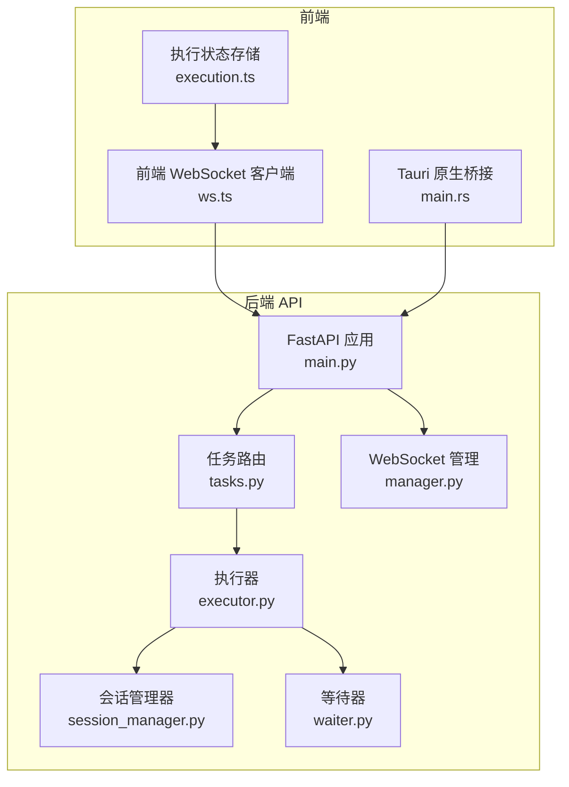
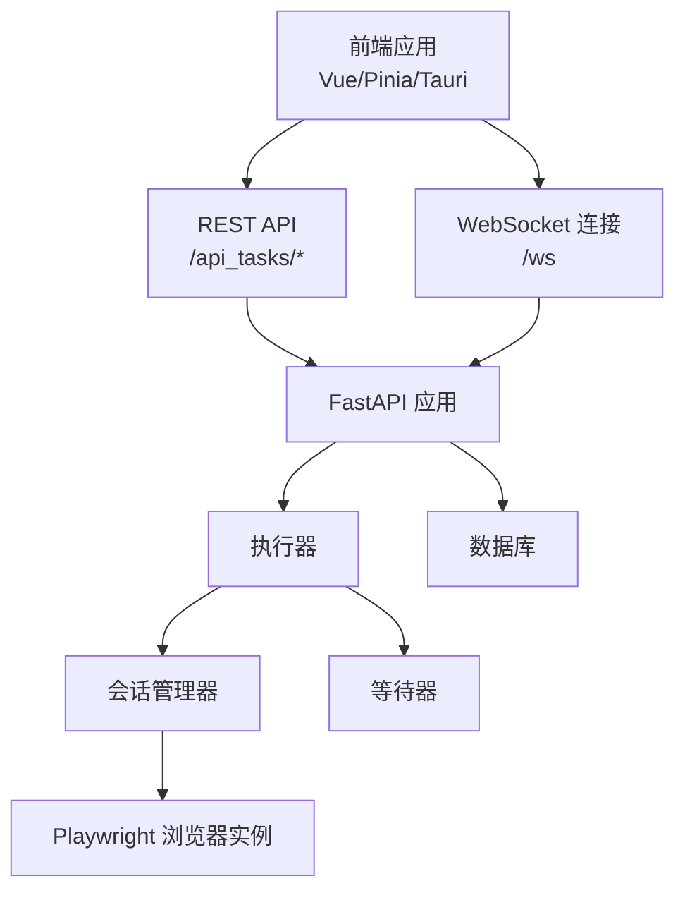
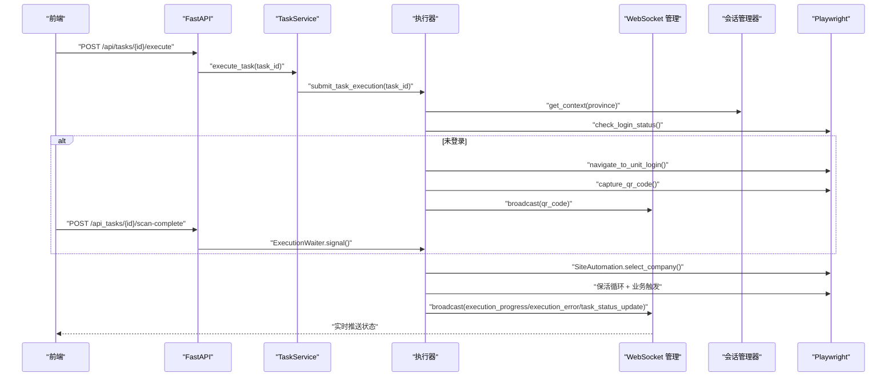
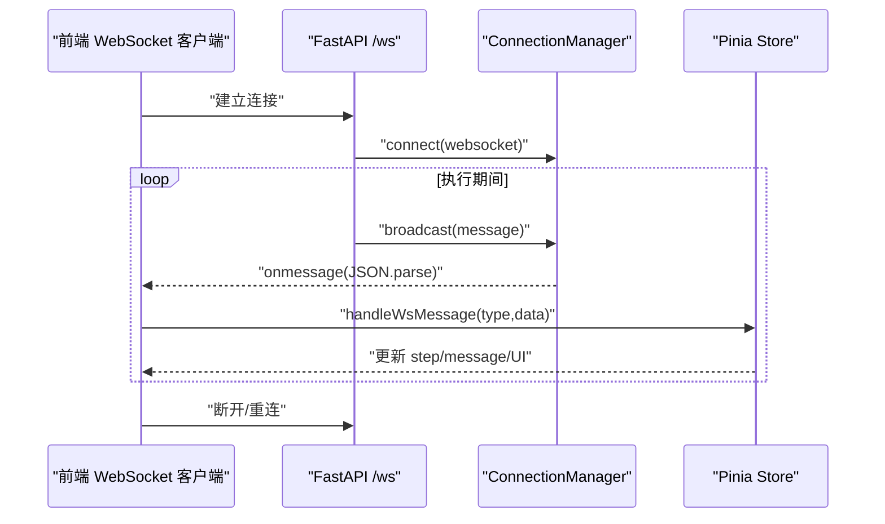
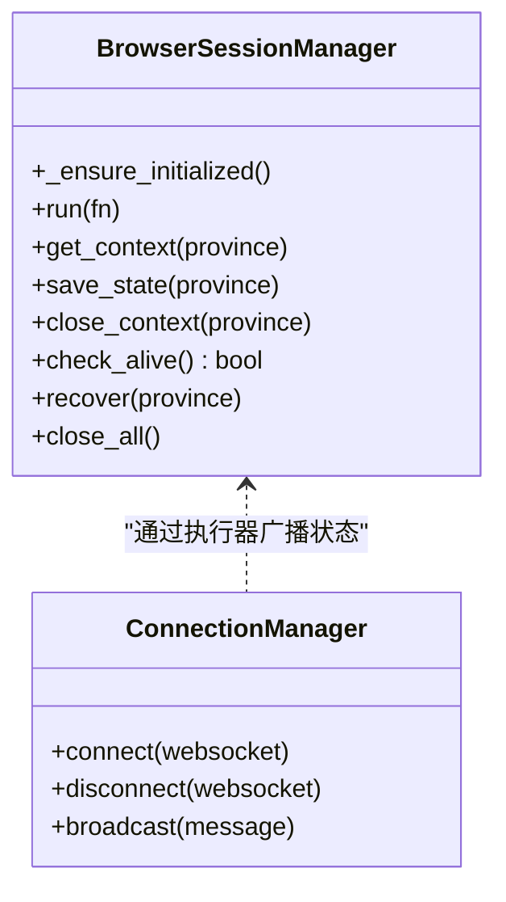
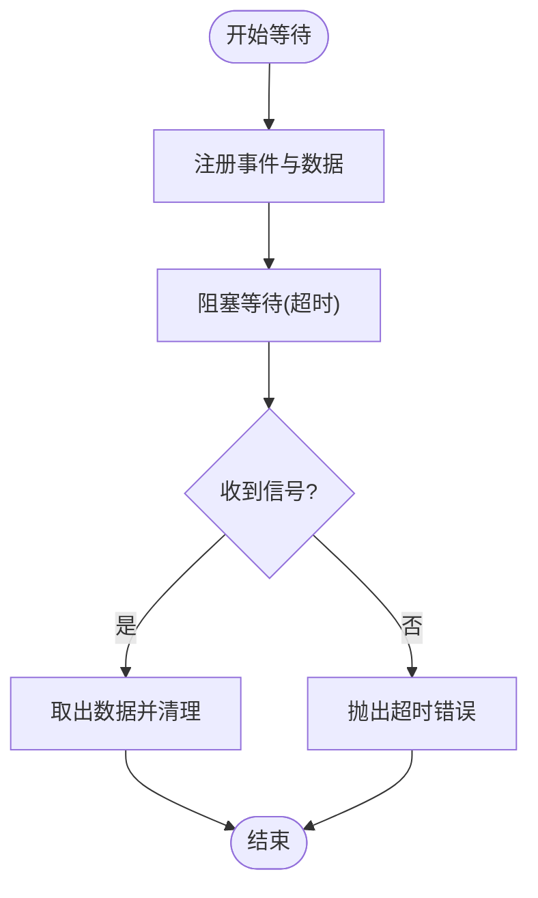
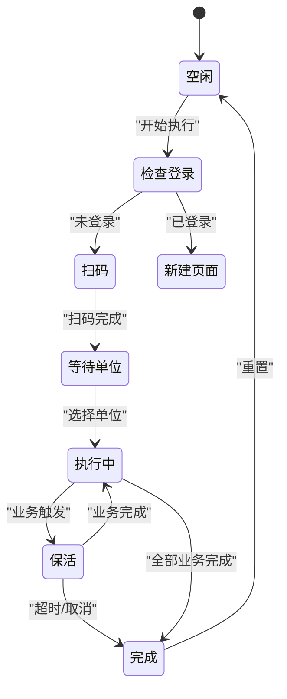
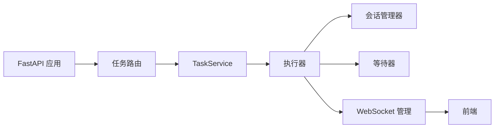

# 组件交互与数据流

<cite>
**本文档引用的文件**
- [main.py](file://CCC_RPA_API/app/main.py)
- [tasks.py](file://CCC_RPA_API/app/api/tasks.py)
- [task.py](file://CCC_RPA_API/app/services/task.py)
- [executor.py](file://CCC_RPA_API/app/services/executor.py)
- [session_manager.py](file://CCC_RPA_API/app/browser/session_manager.py)
- [waiter.py](file://CCC_RPA_API/app/browser/waiter.py)
- [manager.py](file://CCC_RPA_API/app/ws/manager.py)
- [health.py](file://CCC-BrowserV4/backend/app/api/health.py)
- [main.rs](file://CCC-BrowserV4/src-tauri/src/main.rs)
- [ws.ts](file://CCC-BrowserV4/frontend/src/api/ws.ts)
- [execution.ts](file://CCC-BrowserV4/frontend/src/stores/execution.ts)
</cite>

## 目录
1. [引言](#引言)
2. [项目结构](#项目结构)
3. [核心组件](#核心组件)
4. [架构总览](#架构总览)
5. [详细组件分析](#详细组件分析)
6. [依赖分析](#依赖分析)
7. [性能考虑](#性能考虑)
8. [故障排查指南](#故障排查指南)
9. [结论](#结论)
10. [附录](#附录)

## 引言
本文件面向商用级 AI 浏览器系统，聚焦于组件间的交互模式、数据流向与通信协议，涵盖 API 网关、会话调度中心、AI 微服务（以浏览器自动化替代）、浏览器沙箱、前端管理界面之间的调用关系与数据传递机制。文档同时阐述 WebSocket 实时通信、Playwright 同步 API 与线程池并发执行等实现方式，提供数据流图、时序图与组件关系图，帮助开发者快速理解系统运行机制与性能瓶颈定位方法。

## 项目结构
系统由三层组成：
- 后端 API 层（FastAPI）：负责任务编排、数据库交互、WebSocket 广播与 Playwright 会话管理。
- 前端控制层（Vue + Pinia + Tauri）：负责用户交互、实时消息订阅、任务状态展示与演示模式。
- 浏览器沙箱层（Playwright）：在专用工作线程中执行页面自动化，隔离主线程与异步事件循环。

图表来源
- [main.py:1-127](file://CCC_RPA_API/app/main.py#L1-L127)
- [tasks.py:1-76](file://CCC_RPA_API/app/api/tasks.py#L1-L76)
- [executor.py:1-318](file://CCC_RPA_API/app/services/executor.py#L1-L318)
- [session_manager.py:1-183](file://CCC_RPA_API/app/browser/session_manager.py#L1-L183)
- [waiter.py:1-84](file://CCC_RPA_API/app/browser/waiter.py#L1-L84)
- [manager.py:1-29](file://CCC_RPA_API/app/ws/manager.py#L1-L29)
- [ws.ts:1-88](file://CCC-BrowserV4/frontend/src/api/ws.ts#L1-L88)
- [execution.ts:1-229](file://CCC-BrowserV4/frontend/src/stores/execution.ts#L1-L229)
- [main.rs:1-29](file://CCC-BrowserV4/src-tauri/src/main.rs#L1-L29)

章节来源
- [main.py:1-127](file://CCC_RPA_API/app/main.py#L1-L127)
- [ws.ts:1-88](file://CCC-BrowserV4/frontend/src/api/ws.ts#L1-L88)
- [execution.ts:1-229](file://CCC-BrowserV4/frontend/src/stores/execution.ts#L1-L229)
- [main.rs:1-29](file://CCC-BrowserV4/src-tauri/src/main.rs#L1-L29)

## 核心组件
- API 网关（FastAPI）
  - 提供任务 CRUD、执行触发、日志查询与健康检查接口；注册 WebSocket 广播通道。
- 会话调度中心（BrowserSessionManager）
  - 按“省份”维度管理 Playwright 上下文，持久化 storage_state，统一在专用线程执行页面操作。
- 执行器（executor）
  - 通过线程池提交任务执行逻辑，协调登录检查、扫码、单位选择、保活循环与业务执行。
- 等待器（ExecutionWaiter）
  - 使用 Event/数据字典实现用户交互阻塞与唤醒，支持取消与超时。
- 前端管理界面（Vue + Pinia + Tauri）
  - 订阅 WebSocket 实时进度，驱动执行状态机，支持演示模式与手动取消。

章节来源
- [main.py:1-127](file://CCC_RPA_API/app/main.py#L1-L127)
- [session_manager.py:1-183](file://CCC_RPA_API/app/browser/session_manager.py#L1-L183)
- [executor.py:1-318](file://CCC_RPA_API/app/services/executor.py#L1-L318)
- [waiter.py:1-84](file://CCC_RPA_API/app/browser/waiter.py#L1-L84)
- [ws.ts:1-88](file://CCC-BrowserV4/frontend/src/api/ws.ts#L1-L88)
- [execution.ts:1-229](file://CCC-BrowserV4/frontend/src/stores/execution.ts#L1-L229)
- [main.rs:1-29](file://CCC-BrowserV4/src-tauri/src/main.rs#L1-L29)

## 架构总览
系统采用“后端 API + 前端控制 + 浏览器沙箱”的分层设计。后端通过 FastAPI 提供 REST 与 WebSocket，前端通过 WebSocket 实时接收执行状态，通过 REST 触发任务执行与用户交互确认。浏览器自动化在 Playwright 专用线程中执行，避免与 FastAPI 的 asyncio 事件循环冲突。

图表来源
- [main.py:114-127](file://CCC_RPA_API/app/main.py#L114-L127)
- [executor.py:316-318](file://CCC_RPA_API/app/services/executor.py#L316-L318)
- [session_manager.py:27-94](file://CCC_RPA_API/app/browser/session_manager.py#L27-L94)
- [waiter.py:7-84](file://CCC_RPA_API/app/browser/waiter.py#L7-L84)

## 详细组件分析

### 组件 A：任务执行流水线（REST + WebSocket + Playwright）
该流程贯穿前端触发、后端编排、浏览器自动化与实时反馈。

图表来源
- [tasks.py:47-52](file://CCC_RPA_API/app/api/tasks.py#L47-L52)
- [task.py:120-133](file://CCC_RPA_API/app/services/task.py#L120-L133)
- [executor.py:78-314](file://CCC_RPA_API/app/services/executor.py#L78-L314)
- [session_manager.py:96-123](file://CCC_RPA_API/app/browser/session_manager.py#L96-L123)
- [manager.py:17-27](file://CCC_RPA_API/app/ws/manager.py#L17-L27)
- [ws.ts:20-56](file://CCC-BrowserV4/frontend/src/api/ws.ts#L20-L56)

章节来源
- [tasks.py:1-76](file://CCC_RPA_API/app/api/tasks.py#L1-L76)
- [task.py:1-157](file://CCC_RPA_API/app/services/task.py#L1-L157)
- [executor.py:1-318](file://CCC_RPA_API/app/services/executor.py#L1-L318)
- [session_manager.py:1-183](file://CCC_RPA_API/app/browser/session_manager.py#L1-L183)
- [manager.py:1-29](file://CCC_RPA_API/app/ws/manager.py#L1-L29)
- [ws.ts:1-88](file://CCC-BrowserV4/frontend/src/api/ws.ts#L1-L88)
- [execution.ts:1-229](file://CCC-BrowserV4/frontend/src/stores/execution.ts#L1-L229)

### 组件 B：WebSocket 实时通信
前端通过 ws.ts 建立与后端的 WebSocket 连接，订阅执行状态；后端通过 manager.py 维护连接并广播消息；前端 store 在 execution.ts 中根据消息类型更新 UI 状态。

图表来源
- [main.py:119-127](file://CCC_RPA_API/app/main.py#L119-L127)
- [manager.py:10-27](file://CCC_RPA_API/app/ws/manager.py#L10-L27)
- [ws.ts:20-84](file://CCC-BrowserV4/frontend/src/api/ws.ts#L20-L84)
- [execution.ts:22-67](file://CCC-BrowserV4/frontend/src/stores/execution.ts#L22-L67)

章节来源
- [main.py:1-127](file://CCC_RPA_API/app/main.py#L1-L127)
- [manager.py:1-29](file://CCC_RPA_API/app/ws/manager.py#L1-L29)
- [ws.ts:1-88](file://CCC-BrowserV4/frontend/src/api/ws.ts#L1-L88)
- [execution.ts:1-229](file://CCC-BrowserV4/frontend/src/stores/execution.ts#L1-L229)

### 组件 C：Playwright 会话与线程隔离
会话管理器在专用线程中启动 Playwright，所有页面操作通过队列投递执行，避免与 asyncio 冲突；同时支持按“省份”维度持久化 storage_state，提升复用效率。

图表来源
- [session_manager.py:7-183](file://CCC_RPA_API/app/browser/session_manager.py#L7-L183)
- [manager.py:5-29](file://CCC_RPA_API/app/ws/manager.py#L5-L29)

章节来源
- [session_manager.py:1-183](file://CCC_RPA_API/app/browser/session_manager.py#L1-L183)
- [manager.py:1-29](file://CCC_RPA_API/app/ws/manager.py#L1-L29)

### 组件 D：等待器与取消机制
等待器通过线程安全的数据结构维护每个任务的 Event 与数据，支持阻塞等待、非阻塞检查、取消与清理，配合执行器的保活循环与用户交互。

图表来源
- [waiter.py:14-32](file://CCC_RPA_API/app/browser/waiter.py#L14-L32)

章节来源
- [waiter.py:1-84](file://CCC_RPA_API/app/browser/waiter.py#L1-L84)

### 组件 E：前端状态机与演示模式
前端 store 将后端推送的状态映射为 UI 步骤（如“扫码”、“等待单位”、“执行中”、“完成/失败”），并在演示模式下模拟流程，降低对后端的耦合度。

图表来源
- [execution.ts:18-67](file://CCC-BrowserV4/frontend/src/stores/execution.ts#L18-L67)

章节来源
- [execution.ts:1-229](file://CCC-BrowserV4/frontend/src/stores/execution.ts#L1-L229)

## 依赖分析
- 组件内聚与耦合
  - 执行器聚合了会话管理、等待器与 WebSocket 广播，职责集中但需注意线程安全与超时控制。
  - 会话管理器与 Playwright 强耦合，但通过专用线程隔离避免事件循环冲突。
- 外部依赖
  - 数据库：SQLAlchemy ORM，迁移脚本在启动时自动补全字段。
  - 浏览器自动化：Playwright，使用同步 API 并在专用线程执行。
  - 实时通信：FastAPI WebSocket + 自定义 ConnectionManager。
- 潜在环路
  - 执行器通过回调向 WebSocket 广播，避免直接依赖前端模块，降低环路风险。

图表来源
- [main.py:24-27](file://CCC_RPA_API/app/main.py#L24-L27)
- [tasks.py:1-10](file://CCC_RPA_API/app/api/tasks.py#L1-L10)
- [task.py:1-10](file://CCC_RPA_API/app/services/task.py#L1-L10)
- [executor.py:1-20](file://CCC_RPA_API/app/services/executor.py#L1-L20)
- [session_manager.py:1-10](file://CCC_RPA_API/app/browser/session_manager.py#L1-L10)
- [waiter.py:1-10](file://CCC_RPA_API/app/browser/waiter.py#L1-L10)
- [manager.py:1-10](file://CCC_RPA_API/app/ws/manager.py#L1-L10)

章节来源
- [main.py:1-127](file://CCC_RPA_API/app/main.py#L1-L127)
- [tasks.py:1-76](file://CCC_RPA_API/app/api/tasks.py#L1-L76)
- [task.py:1-157](file://CCC_RPA_API/app/services/task.py#L1-L157)
- [executor.py:1-318](file://CCC_RPA_API/app/services/executor.py#L1-L318)
- [session_manager.py:1-183](file://CCC_RPA_API/app/browser/session_manager.py#L1-L183)
- [waiter.py:1-84](file://CCC_RPA_API/app/browser/waiter.py#L1-L84)
- [manager.py:1-29](file://CCC_RPA_API/app/ws/manager.py#L1-L29)

## 性能考虑
- 线程模型
  - 专用 Playwright 工作线程避免与 asyncio 事件循环冲突；线程池限制并发数，防止资源争用。
- I/O 与阻塞
  - 用户交互采用等待器阻塞，但执行器在独立线程等待，避免阻塞浏览器线程。
- 状态持久化
  - 按省份存储 storage_state，减少重复登录成本；异常恢复时重建上下文。
- WebSocket 广播
  - 广播前序列化消息，连接异常时清理无效连接，降低广播失败影响。
- 前端渲染
  - 使用 Pinia 状态管理，按消息类型最小化 UI 更新范围。

[本节为通用性能建议，无需特定文件引用]

## 故障排查指南
- WebSocket 断连与重连
  - 前端具备指数退避重连策略；若长时间无法连接，检查后端 /ws 路由与 CORS 配置。
- 执行卡滞
  - 关注“保活循环”阶段的取消信号与超时；若长时间无业务触发，检查站点自动化逻辑与网络环境。
- 登录异常
  - 若二维码无法生成或扫码无效，检查浏览器上下文是否存活与页面导航是否成功。
- 数据库迁移
  - 启动时自动添加缺失列；若迁移失败，检查权限与数据库连接状态。
- 健康检查
  - 后端提供健康检查接口，用于快速判断服务与数据库状态。

章节来源
- [ws.ts:58-64](file://CCC-BrowserV4/frontend/src/api/ws.ts#L58-L64)
- [executor.py:208-265](file://CCC_RPA_API/app/services/executor.py#L208-L265)
- [session_manager.py:144-167](file://CCC_RPA_API/app/browser/session_manager.py#L144-L167)
- [main.py:41-86](file://CCC_RPA_API/app/main.py#L41-L86)
- [health.py:10-17](file://CCC-BrowserV4/backend/app/api/health.py#L10-L17)

## 结论
本系统通过清晰的分层与严格的线程隔离，实现了“前端实时控制 + 后端任务编排 + 浏览器沙箱自动化”的稳定运行模式。WebSocket 实时反馈与 Playwright 专用线程确保了用户体验与执行稳定性。建议在生产环境中进一步完善可观测性（日志、指标）与弹性（限流、熔断）能力，以应对高并发与复杂站点场景。

[本节为总结性内容，无需特定文件引用]

## 附录
- 关键接口与消息类型
  - REST：任务执行、扫码完成、选择单位、取消执行、任务列表与日志查询。
  - WebSocket：qr_code、company_list、execution_progress、login_result、execution_error、task_status_update。
- 前端演示模式
  - 在后端不可用时，前端可模拟扫码与执行流程，便于本地联调与演示。

[本节为概览性内容，无需特定文件引用]