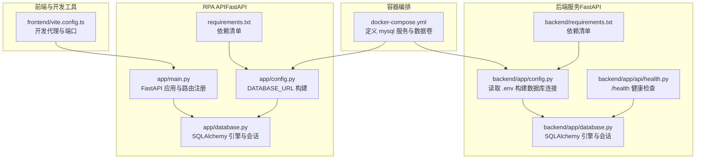
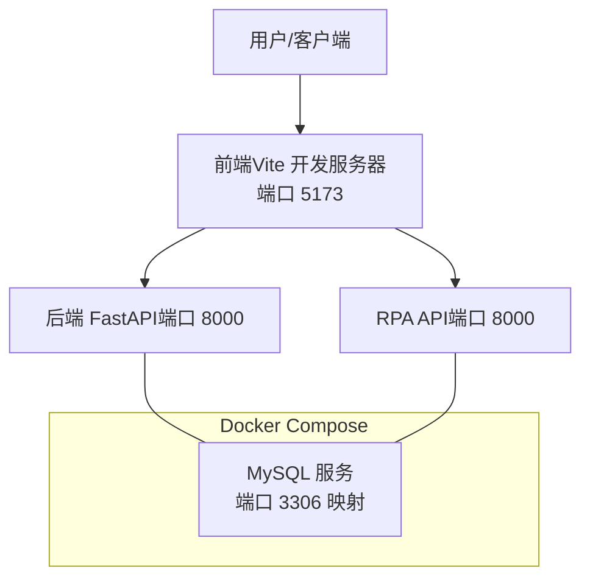
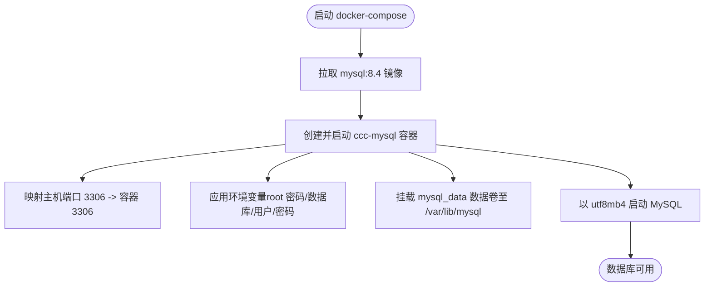
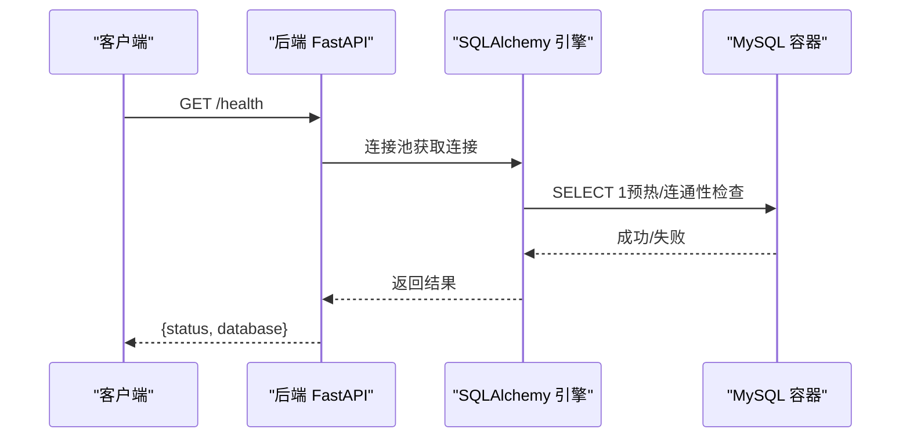
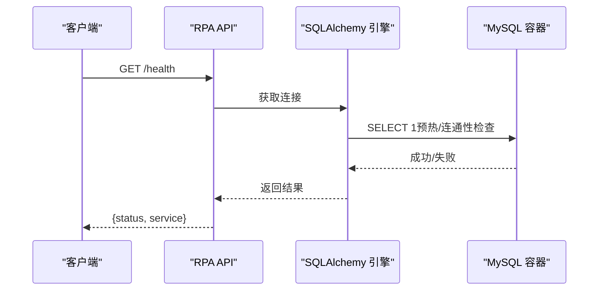
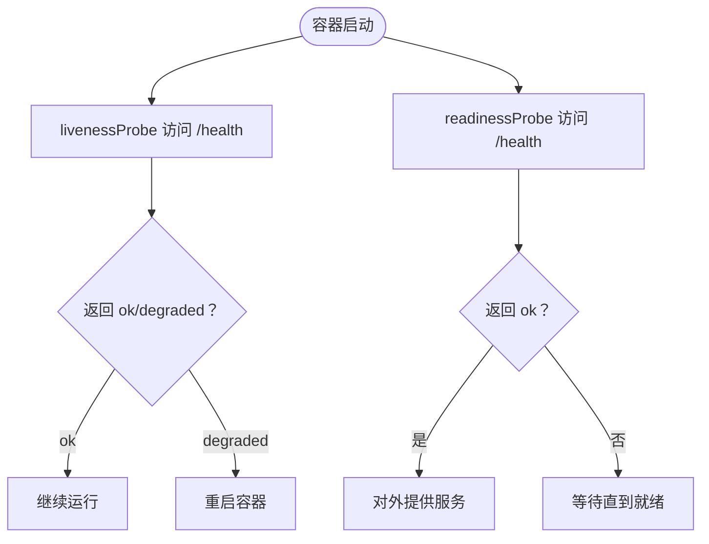
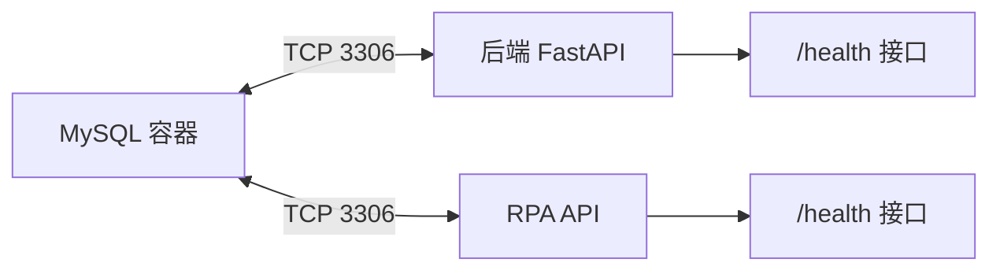

# Docker 容器化部署

<cite>
**本文引用的文件**
- [docker-compose.yml](file://CCC-BrowserV4/docker-compose.yml)
- [backend/README.md](file://CCC-BrowserV4/backend/README.md)
- [backend/app/config.py](file://CCC-BrowserV4/backend/app/config.py)
- [backend/app/database.py](file://CCC-BrowserV4/backend/app/database.py)
- [backend/app/api/health.py](file://CCC-BrowserV4/backend/app/api/health.py)
- [requirements.txt（后端）](file://CCC-BrowserV4/backend/requirements.txt)
- [requirements.txt（RPA API）](file://CCC_RPA_API/requirements.txt)
- [app/main.py（RPA API）](file://CCC_RPA_API/app/main.py)
- [app/config.py（RPA API）](file://CCC_RPA_API/app/config.py)
- [app/database.py（RPA API）](file://CCC_RPA_API/app/database.py)
- [project.md](file://project.md)
- [vite.config.ts（前端）](file://CCC-BrowserV4/frontend/vite.config.ts)
</cite>

## 目录
1. [简介](#简介)
2. [项目结构](#项目结构)
3. [核心组件](#核心组件)
4. [架构总览](#架构总览)
5. [详细组件分析](#详细组件分析)
6. [依赖关系分析](#依赖关系分析)
7. [性能考虑](#性能考虑)
8. [故障排查指南](#故障排查指南)
9. [结论](#结论)
10. [附录](#附录)

## 简介
本文件面向部署与运维工程师，提供基于 Docker 的容器化部署方案，重点覆盖以下方面：
- 使用 Docker Compose 编排 MySQL 数据库服务，含环境变量、数据卷挂载与字符集配置
- 容器镜像构建流程与最佳实践（多阶段构建、标签管理）
- 容器网络、端口映射与数据持久化策略
- 健康检查与部署命令示例
- 容器资源限制、日志管理与故障排查建议

## 项目结构
本仓库包含三个主要部分：
- 前端与桌面应用（Tauri/Vue）位于 CCC-BrowserV4/frontend 与 src-tauri
- 后端服务（FastAPI）位于 CCC-BrowserV4/backend
- RPA API（FastAPI）位于 CCC_RPA_API

下图展示与容器化部署直接相关的文件与职责：

**图表来源**
- [docker-compose.yml:1-21](file://CCC-BrowserV4/docker-compose.yml#L1-L21)
- [backend/app/config.py:1-52](file://CCC-BrowserV4/backend/app/config.py#L1-L52)
- [backend/app/database.py:1-45](file://CCC-BrowserV4/backend/app/database.py#L1-L45)
- [backend/app/api/health.py:1-18](file://CCC-BrowserV4/backend/app/api/health.py#L1-L18)
- [requirements.txt（后端）:1-13](file://CCC-BrowserV4/backend/requirements.txt#L1-L13)
- [app/main.py（RPA API）:1-127](file://CCC_RPA_API/app/main.py#L1-L127)
- [app/config.py（RPA API）:1-22](file://CCC_RPA_API/app/config.py#L1-L22)
- [app/database.py（RPA API）:1-19](file://CCC_RPA_API/app/database.py#L1-L19)
- [requirements.txt（RPA API）:1-11](file://CCC_RPA_API/requirements.txt#L1-L11)
- [vite.config.ts（前端）:1-34](file://CCC-BrowserV4/frontend/vite.config.ts#L1-L34)

**章节来源**
- [docker-compose.yml:1-21](file://CCC-BrowserV4/docker-compose.yml#L1-L21)
- [backend/README.md:1-66](file://CCC-BrowserV4/backend/README.md#L1-L66)
- [requirements.txt（后端）:1-13](file://CCC-BrowserV4/backend/requirements.txt#L1-L13)
- [requirements.txt（RPA API）:1-11](file://CCC_RPA_API/requirements.txt#L1-L11)

## 核心组件
- MySQL 数据库服务：通过 docker-compose.yml 提供，使用官方镜像、设置字符集、暴露端口并持久化数据卷
- 后端 FastAPI 应用：读取 .env 或环境变量构建数据库连接，提供健康检查接口
- RPA API 应用：同样以环境变量驱动数据库连接，提供 REST 与 WebSocket 服务
- 健康检查：后端与 RPA API 均提供健康检查端点，便于容器编排进行存活/就绪探针

**章节来源**
- [docker-compose.yml:1-21](file://CCC-BrowserV4/docker-compose.yml#L1-L21)
- [backend/app/config.py:1-52](file://CCC-BrowserV4/backend/app/config.py#L1-L52)
- [backend/app/api/health.py:1-18](file://CCC-BrowserV4/backend/app/api/health.py#L1-L18)
- [app/config.py（RPA API）:1-22](file://CCC_RPA_API/app/config.py#L1-L22)
- [app/main.py（RPA API）:1-127](file://CCC_RPA_API/app/main.py#L1-L127)

## 架构总览
下图展示容器编排、数据库与两个后端服务之间的交互关系：

**图表来源**
- [docker-compose.yml:1-21](file://CCC-BrowserV4/docker-compose.yml#L1-L21)
- [vite.config.ts（前端）:1-34](file://CCC-BrowserV4/frontend/vite.config.ts#L1-L34)
- [app/main.py（RPA API）:1-127](file://CCC_RPA_API/app/main.py#L1-L127)

## 详细组件分析

### MySQL 数据库服务（docker-compose）
- 镜像与版本：使用官方 MySQL 8.4
- 容器命名：ccc-mysql
- 重启策略：unless-stopped
- 端口映射：主机 3306:容器 3306
- 环境变量：设置 root 密码、数据库名、普通用户与密码
- 数据卷：挂载 named volume mysql_data 到 /var/lib/mysql 实现持久化
- 字符集：通过命令参数设置 utf8mb4

**图表来源**
- [docker-compose.yml:1-21](file://CCC-BrowserV4/docker-compose.yml#L1-L21)

**章节来源**
- [docker-compose.yml:1-21](file://CCC-BrowserV4/docker-compose.yml#L1-L21)
- [backend/README.md:24-49](file://CCC-BrowserV4/backend/README.md#L24-L49)

### 后端 FastAPI 应用（数据库连接与健康检查）
- 配置来源：优先读取 .env，其次读取环境变量
- 数据库类型：默认 mysql；也可切换 sqlite
- 连接串构建：基于用户名、主机、端口、数据库与字符集
- SQLAlchemy 引擎：设置连接池大小、溢出、回收与 ping 预热
- 健康检查：/health 接口检查数据库连通性

**图表来源**
- [backend/app/api/health.py:1-18](file://CCC-BrowserV4/backend/app/api/health.py#L1-L18)
- [backend/app/database.py:1-45](file://CCC-BrowserV4/backend/app/database.py#L1-L45)
- [backend/app/config.py:1-52](file://CCC-BrowserV4/backend/app/config.py#L1-L52)

**章节来源**
- [backend/app/config.py:1-52](file://CCC-BrowserV4/backend/app/config.py#L1-L52)
- [backend/app/database.py:1-45](file://CCC-BrowserV4/backend/app/database.py#L1-L45)
- [backend/app/api/health.py:1-18](file://CCC-BrowserV4/backend/app/api/health.py#L1-L18)

### RPA API 应用（数据库连接与健康检查）
- 配置来源：.env 与环境变量
- 连接串构建：基于用户名、主机、端口、数据库与字符集
- SQLAlchemy 引擎：启用预热与回收
- 健康检查：/health 返回服务状态

**图表来源**
- [app/main.py（RPA API）:114-116](file://CCC_RPA_API/app/main.py#L114-L116)
- [app/database.py（RPA API）:1-19](file://CCC_RPA_API/app/database.py#L1-L19)
- [app/config.py（RPA API）:1-22](file://CCC_RPA_API/app/config.py#L1-L22)

**章节来源**
- [app/config.py（RPA API）:1-22](file://CCC_RPA_API/app/config.py#L1-L22)
- [app/database.py（RPA API）:1-19](file://CCC_RPA_API/app/database.py#L1-L19)
- [app/main.py（RPA API）:1-127](file://CCC_RPA_API/app/main.py#L1-L127)

### 健康检查与探针配置
- 后端健康检查：/health，返回数据库连接状态
- RPA API 健康检查：/health，返回服务状态
- 建议：在生产环境中使用 livenessProbe/readinessProbe 指向上述端点

**图表来源**
- [backend/app/api/health.py:1-18](file://CCC-BrowserV4/backend/app/api/health.py#L1-L18)
- [app/main.py（RPA API）:114-116](file://CCC_RPA_API/app/main.py#L114-L116)

**章节来源**
- [backend/app/api/health.py:1-18](file://CCC-BrowserV4/backend/app/api/health.py#L1-L18)
- [app/main.py（RPA API）:114-116](file://CCC_RPA_API/app/main.py#L114-L116)

### 部署命令与流程
- 启动 MySQL：在项目根目录执行 docker compose up -d
- 查看状态与日志：docker compose ps、logs -f mysql
- 停止与清理：docker compose down、带数据卷清理 docker compose down -v

**章节来源**
- [backend/README.md:24-49](file://CCC-BrowserV4/backend/README.md#L24-L49)

## 依赖关系分析
- 后端与 RPA API 均依赖 MySQL 作为主数据库
- 两者均使用 SQLAlchemy 连接池与连接预热
- 健康检查依赖数据库连通性

**图表来源**
- [docker-compose.yml:1-21](file://CCC-BrowserV4/docker-compose.yml#L1-L21)
- [backend/app/api/health.py:1-18](file://CCC-BrowserV4/backend/app/api/health.py#L1-L18)
- [app/main.py（RPA API）:114-116](file://CCC_RPA_API/app/main.py#L114-L116)

**章节来源**
- [backend/app/database.py:1-45](file://CCC-BrowserV4/backend/app/database.py#L1-L45)
- [app/database.py（RPA API）:1-19](file://CCC_RPA_API/app/database.py#L1-L19)

## 性能考虑
- 连接池参数：后端与 RPA API 均设置了连接池大小、溢出与回收时间，有助于提升并发与稳定性
- 预热机制：pool_pre_ping 与 pool_recycle 减少断连与重建成本
- 建议：根据并发与资源情况调整 pool_size 与 max_overflow；结合监控指标持续优化

**章节来源**
- [backend/app/database.py:1-45](file://CCC-BrowserV4/backend/app/database.py#L1-L45)
- [app/database.py（RPA API）:1-19](file://CCC_RPA_API/app/database.py#L1-L19)

## 故障排查指南
- 数据库不可达
  - 检查 MySQL 容器状态与日志：docker compose ps、logs -f mysql
  - 核对环境变量与 .env 配置（主机、端口、用户名、密码、数据库）
  - 使用健康检查端点确认数据库连通性
- 端口冲突或映射问题
  - 确认宿主机 3306 端口未被占用
  - 检查 docker-compose.yml 中的 ports 配置
- 数据丢失风险
  - 确认数据卷 mysql_data 已正确挂载并持久化
  - 清理前做好备份与迁移计划

**章节来源**
- [docker-compose.yml:1-21](file://CCC-BrowserV4/docker-compose.yml#L1-L21)
- [backend/README.md:24-49](file://CCC-BrowserV4/backend/README.md#L24-L49)
- [backend/app/config.py:1-52](file://CCC-BrowserV4/backend/app/config.py#L1-L52)
- [app/config.py（RPA API）:1-22](file://CCC_RPA_API/app/config.py#L1-L22)

## 结论
本方案通过 Docker Compose 快速搭建 MySQL 数据库，并为后端与 RPA API 提供一致的数据库连接与健康检查能力。建议在生产中补充容器资源限制、健康探针、日志采集与监控告警，以满足高可用与可观测性要求。

## 附录

### 容器镜像构建与多阶段优化（建议）
- 基础镜像选择：使用官方 Python/Node.js 基础镜像，确保最小化与可复现性
- 多阶段构建：将依赖安装与运行时分离，减少最终镜像体积
- 层缓存优化：按依赖安装、源码拷贝顺序组织 Dockerfile，提升缓存命中率
- 镜像标签管理：遵循语义化版本，配合 CI/CD 自动打标签并保留最近 N 个版本

[本节为通用实践建议，不直接分析具体文件，故无“章节来源”]

### 容器网络与端口映射
- MySQL：3306（容器）映射到宿主机 3306
- 后端与 RPA API：通常监听 0.0.0.0:8000，如需外网访问可映射到宿主机端口
- 前端开发：Vite 默认 5173，用于本地开发代理后端 API 与 WebSocket

**章节来源**
- [docker-compose.yml:1-21](file://CCC-BrowserV4/docker-compose.yml#L1-L21)
- [vite.config.ts（前端）:1-34](file://CCC-BrowserV4/frontend/vite.config.ts#L1-L34)

### 数据持久化策略
- MySQL 数据卷：使用 named volume mysql_data 挂载到 /var/lib/mysql
- 建议：定期备份、容量监控与滚动升级时的数据迁移

**章节来源**
- [docker-compose.yml:1-21](file://CCC-BrowserV4/docker-compose.yml#L1-L21)

### 健康检查与探针（建议）
- livenessProbe：指向 /health，失败时重启容器
- readinessProbe：指向 /health，未就绪时不接收流量
- 建议：结合探针阈值与超时参数，避免误判

**章节来源**
- [backend/app/api/health.py:1-18](file://CCC-BrowserV4/backend/app/api/health.py#L1-L18)
- [app/main.py（RPA API）:114-116](file://CCC_RPA_API/app/main.py#L114-L116)

### 日志管理与监控（建议）
- 容器日志：使用 Docker 日志驱动收集 stdout/stderr
- 建议：集中化日志（如 ELK）与指标（Prometheus/Grafana），并设置告警规则

[本节为通用实践建议，不直接分析具体文件，故无“章节来源”]