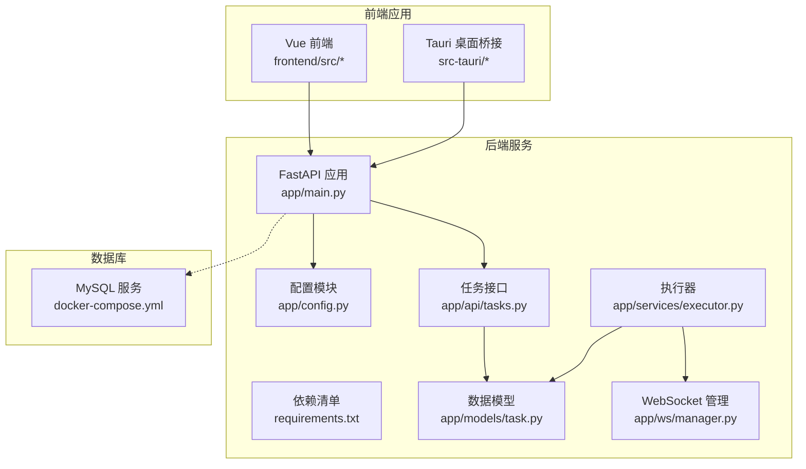
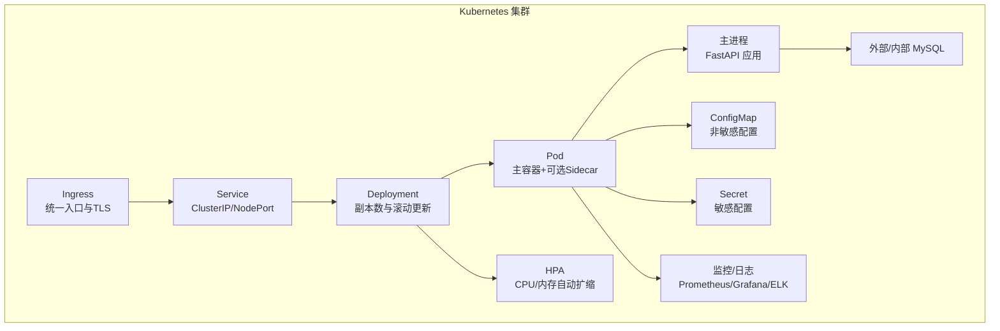
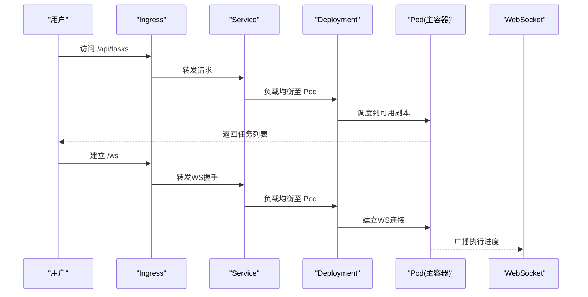
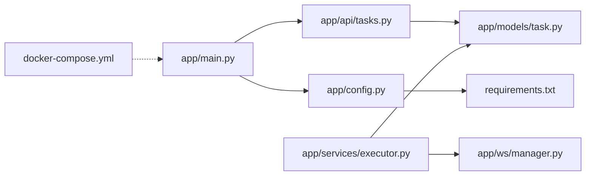

# Kubernetes 集群部署

<cite>
**本文档引用的文件**
- [app/main.py](file://CCC_RPA_API/app/main.py)
- [app/config.py](file://CCC_RPA_API/app/config.py)
- [requirements.txt](file://CCC_RPA_API/requirements.txt)
- [docker-compose.yml](file://CCC-BrowserV4/docker-compose.yml)
- [backend/app/config.py](file://CCC-BrowserV4/backend/app/config.py)
- [app/api/tasks.py](file://CCC_RPA_API/app/api/tasks.py)
- [app/models/task.py](file://CCC_RPA_API/app/models/task.py)
- [app/services/executor.py](file://CCC_RPA_API/app/services/executor.py)
- [app/ws/manager.py](file://CCC_RPA_API/app/ws/manager.py)
</cite>

## 目录
1. [简介](#简介)
2. [项目结构](#项目结构)
3. [核心组件](#核心组件)
4. [架构总览](#架构总览)
5. [详细组件分析](#详细组件分析)
6. [依赖关系分析](#依赖关系分析)
7. [性能考虑](#性能考虑)
8. [故障排查指南](#故障排查指南)
9. [结论](#结论)
10. [附录](#附录)

## 简介
本文件面向 Kubernetes 集群部署场景，基于仓库中的 Python 后端服务与前端应用，系统化梳理 Pod 模板设计原则、Deployment 与 Service 配置策略、HPA 弹性扩缩容、Ingress 网络与 TLS、以及监控、日志与故障恢复策略。文档以现有代码为依据，结合 Kubernetes 最佳实践，提供可落地的部署指导。

## 项目结构
该仓库包含两部分：
- 后端服务（FastAPI）：提供任务管理、执行调度、WebSocket 实时通信等能力
- 前端应用（Vue + Tauri）：提供用户界面与设备交互
- 数据库：MySQL（通过 docker-compose 提供）

图表来源
- [app/main.py:12-28](file://CCC_RPA_API/app/main.py#L12-L28)
- [app/config.py:6-22](file://CCC_RPA_API/app/config.py#L6-L22)
- [requirements.txt:1-11](file://CCC_RPA_API/requirements.txt#L1-L11)
- [docker-compose.yml:4-17](file://CCC-BrowserV4/docker-compose.yml#L4-L17)
- [app/api/tasks.py:10-10](file://CCC_RPA_API/app/api/tasks.py#L10-L10)
- [app/models/task.py:8-25](file://CCC_RPA_API/app/models/task.py#L8-L25)
- [app/services/executor.py:17-18](file://CCC_RPA_API/app/services/executor.py#L17-L18)
- [app/ws/manager.py:5-29](file://CCC_RPA_API/app/ws/manager.py#L5-L29)

章节来源
- [app/main.py:12-28](file://CCC_RPA_API/app/main.py#L12-L28)
- [docker-compose.yml:4-17](file://CCC-BrowserV4/docker-compose.yml#L4-L17)

## 核心组件
- FastAPI 应用：定义路由、CORS 中间件、健康检查端点、WebSocket 端点
- 配置模块：集中管理数据库连接参数与环境变量
- 任务接口：提供任务的增删改查、执行、日志查询等 API
- 数据模型：定义任务表结构及字段
- 执行器：多线程任务执行、Playwright 浏览器自动化、保活与异常恢复
- WebSocket 管理：连接管理与广播消息
- 前端与桌面桥接：与后端交互的用户界面与本地能力

章节来源
- [app/main.py:12-28](file://CCC_RPA_API/app/main.py#L12-L28)
- [app/config.py:6-22](file://CCC_RPA_API/app/config.py#L6-L22)
- [app/api/tasks.py:10-76](file://CCC_RPA_API/app/api/tasks.py#L10-L76)
- [app/models/task.py:8-25](file://CCC_RPA_API/app/models/task.py#L8-L25)
- [app/services/executor.py:17-308](file://CCC_RPA_API/app/services/executor.py#L17-L308)
- [app/ws/manager.py:5-29](file://CCC_RPA_API/app/ws/manager.py#L5-L29)

## 架构总览
下图展示后端服务在 Kubernetes 中的典型部署形态：Pod 内运行一个主进程（FastAPI），通过 ConfigMap/Secret 注入配置；Sidecar 可选用于日志采集或代理；Service 对外暴露；Ingress 统一入口并终止 TLS；HPA 根据 CPU/内存指标弹性扩缩。

（本图为概念性架构示意，无需图表来源）

## 详细组件分析

### Pod 模板设计原则
- 资源配额与限制
  - CPU/内存请求与限制应基于峰值与平均负载评估，避免抢占与 OOM
  - 建议为主进程设置合理的 requests/limits，Sidecar（如日志采集）单独控制
- 存储与持久化
  - 使用 PersistentVolume 保存浏览器会话或临时文件（若需要）
- 健康检查
  - livenessProbe：调用健康检查端点，失败时重启容器
  - readinessProbe：确保就绪后再接收流量，避免连接失败
- 环境注入
  - 使用 ConfigMap 注入非敏感配置；使用 Secret 注入数据库密码、令牌等敏感信息
- 安全
  - 以非 root 用户运行；最小权限原则；只开放必要端口

章节来源
- [app/main.py:114-116](file://CCC_RPA_API/app/main.py#L114-L116)
- [app/config.py:6-22](file://CCC_RPA_API/app/config.py#L6-L22)

### Deployment 与 Service 配置策略
- 副本数管理
  - 根据并发请求量与 CPU/内存占用设定副本数，保证高可用
- 滚动更新
  - 设置 maxUnavailable 与 maxSurge，确保更新期间服务连续性
- 负载均衡
  - Service 使用 ClusterIP/NodePort 或 LoadBalancer，结合 Ingress 实现域名与路径转发

图表来源
- [app/main.py:119-127](file://CCC_RPA_API/app/main.py#L119-L127)
- [app/ws/manager.py:17-26](file://CCC_RPA_API/app/ws/manager.py#L17-L26)

章节来源
- [app/main.py:119-127](file://CCC_RPA_API/app/main.py#L119-L127)
- [app/ws/manager.py:5-29](file://CCC_RPA_API/app/ws/manager.py#L5-L29)

### ConfigMap 与 Secret 使用方法
- ConfigMap
  - 注入非敏感配置项，如调试开关、日志级别、第三方服务地址
  - 在 Pod 中通过环境变量或挂载卷方式使用
- Secret
  - 注入数据库密码、API 密钥等敏感信息
  - 通过环境变量注入，避免硬编码在镜像或配置中

章节来源
- [app/config.py:6-22](file://CCC_RPA_API/app/config.py#L6-L22)
- [backend/app/config.py:9-52](file://CCC-BrowserV4/backend/app/config.py#L9-L52)

### HPA 弹性扩缩容
- 指标设置
  - CPU 使用率：当平均 CPU 使用超过阈值时扩容
  - 内存使用量：当内存使用超过阈值时扩容
- 触发条件
  - 基于 Requests 的利用率计算，避免过度扩容
- 注意事项
  - 避免与副本数上限/下限冲突
  - 结合业务特性设置合适的稳定窗口与冷却时间

（本节为通用实践说明，无需章节来源）

### Ingress 网络配置与 TLS 证书管理
- Ingress
  - 定义主机名与路径规则，将 /api/* 路由到 Service
  - 支持多后端与权重路由（如需灰度发布）
- TLS
  - 使用证书密钥（tls.crt/tls.key）配置 TLS 终止
  - 证书轮换与自动续期建议通过外部工具链实现

（本节为通用实践说明，无需章节来源）

### 监控、日志与故障恢复
- 监控
  - 指标：CPU、内存、请求速率、错误率、P95/P99 延迟
  - 告警：阈值告警与异常检测（如频繁重启、队列积压）
- 日志
  - 标准输出采集，结合结构化日志字段（如 traceId、level、module）
  - 建议使用集中式日志平台（如 ELK/Fluentd/EasyStack）
- 故障恢复
  - Pod 重启策略：Liveness/Readiness Probe 辅助快速自愈
  - 执行器异常恢复：浏览器会话异常时自动重建上下文
  - 数据库连接池与重试：避免瞬时故障导致任务中断

章节来源
- [app/services/executor.py:42-59](file://CCC_RPA_API/app/services/executor.py#L42-L59)
- [app/main.py:108-112](file://CCC_RPA_API/app/main.py#L108-L112)

## 依赖关系分析
- 应用依赖
  - FastAPI、SQLAlchemy、Pydantic Settings、Uvicorn、Playwright
  - MySQL 驱动与加密库
- 运行时依赖
  - MySQL 服务（可内嵌或外部部署）
  - 前端静态资源与 WebSocket 通道

图表来源
- [app/main.py:12-28](file://CCC_RPA_API/app/main.py#L12-L28)
- [app/api/tasks.py:10-10](file://CCC_RPA_API/app/api/tasks.py#L10-L10)
- [app/config.py:6-22](file://CCC_RPA_API/app/config.py#L6-L22)
- [app/models/task.py:8-25](file://CCC_RPA_API/app/models/task.py#L8-L25)
- [app/services/executor.py:17-18](file://CCC_RPA_API/app/services/executor.py#L17-L18)
- [app/ws/manager.py:5-29](file://CCC_RPA_API/app/ws/manager.py#L5-L29)
- [requirements.txt:1-11](file://CCC_RPA_API/requirements.txt#L1-L11)
- [docker-compose.yml:4-17](file://CCC-BrowserV4/docker-compose.yml#L4-L17)

章节来源
- [requirements.txt:1-11](file://CCC_RPA_API/requirements.txt#L1-L11)
- [docker-compose.yml:4-17](file://CCC-BrowserV4/docker-compose.yml#L4-L17)

## 性能考虑
- 并发与线程池
  - 执行器使用线程池执行浏览器相关操作，避免阻塞事件循环
  - 合理设置线程池大小，避免 CPU 争抢
- 数据库连接
  - 使用连接池与超时控制，避免连接泄漏
- WebSocket 广播
  - 广播前清理无效连接，降低广播成本
- 资源规划
  - 根据任务执行时长与并发度估算 CPU/内存 requests/limits
  - 为浏览器渲染与网络 IO 预留额外资源

章节来源
- [app/services/executor.py:17-18](file://CCC_RPA_API/app/services/executor.py#L17-L18)
- [app/ws/manager.py:17-26](file://CCC_RPA_API/app/ws/manager.py#L17-L26)

## 故障排查指南
- 健康检查失败
  - 检查 liveness/readiness 探针路径与超时设置
  - 查看容器日志定位启动异常
- 数据库连接问题
  - 校验 Secret 中的连接参数
  - 确认网络连通性与防火墙策略
- 任务执行异常
  - 关注执行器日志中的浏览器异常与恢复记录
  - 检查浏览器会话状态与页面保活逻辑
- WebSocket 不可用
  - 确认 Ingress/Service 的 WS 支持
  - 检查连接管理器的广播与断开逻辑

章节来源
- [app/main.py:114-116](file://CCC_RPA_API/app/main.py#L114-L116)
- [app/config.py:6-22](file://CCC_RPA_API/app/config.py#L6-L22)
- [app/services/executor.py:275-300](file://CCC_RPA_API/app/services/executor.py#L275-L300)
- [app/ws/manager.py:17-26](file://CCC_RPA_API/app/ws/manager.py#L17-L26)

## 结论
本项目后端具备清晰的模块边界与可扩展性，适合在 Kubernetes 上进行容器化部署。建议结合本文档的 Pod 模板设计、Deployment/Service 策略、HPA、Ingress/TLS 与监控日志方案，形成完整的生产级部署与运维体系。

## 附录
- 快速对照清单
  - Pod：liveness/readiness/probes、requests/limits、ConfigMap/Secret 注入
  - Deployment：副本数、滚动更新策略、HPA
  - Service/Ingress：端口映射、TLS、域名与路径规则
  - 监控：指标采集、告警策略、日志聚合
  - 故障：自愈机制、异常恢复、回滚策略