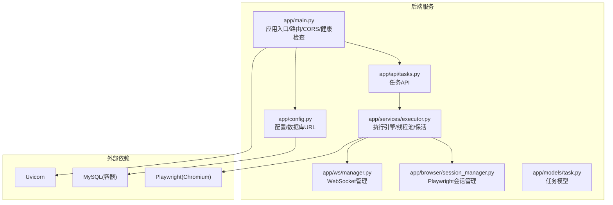
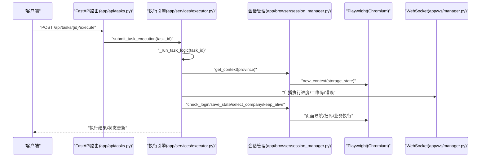
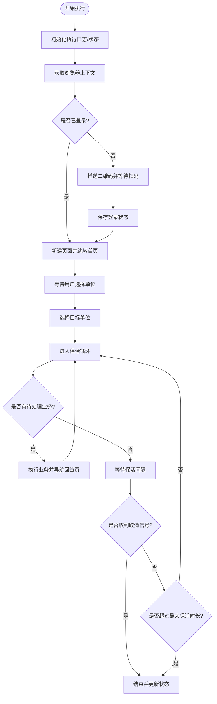
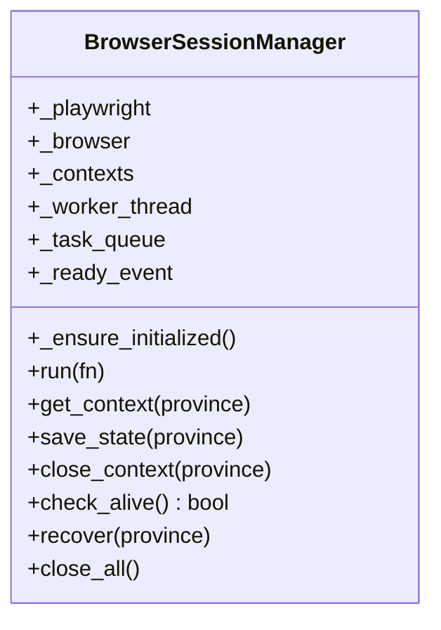
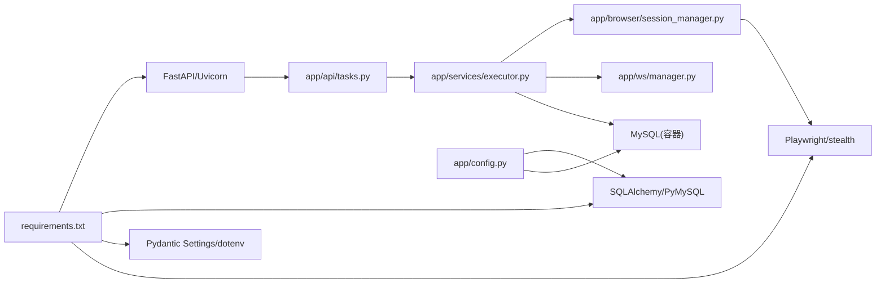

# 单机进程部署

<cite>
**本文引用的文件**
- [app/main.py](file://CCC_RPA_API/app/main.py)
- [app/config.py](file://CCC_RPA_API/app/config.py)
- [requirements.txt](file://CCC_RPA_API/requirements.txt)
- [docker-compose.yml](file://CCC-BrowserV4/docker-compose.yml)
- [app/api/tasks.py](file://CCC_RPA_API/app/api/tasks.py)
- [app/services/executor.py](file://CCC_RPA_API/app/services/executor.py)
- [app/browser/session_manager.py](file://CCC_RPA_API/app/browser/session_manager.py)
- [app/models/task.py](file://CCC_RPA_API/app/models/task.py)
- [app/ws/manager.py](file://CCC_RPA_API/app/ws/manager.py)
</cite>

## 目录
1. [简介](#简介)
2. [项目结构](#项目结构)
3. [核心组件](#核心组件)
4. [架构总览](#架构总览)
5. [详细组件分析](#详细组件分析)
6. [依赖关系分析](#依赖关系分析)
7. [性能考虑](#性能考虑)
8. [故障排查指南](#故障排查指南)
9. [结论](#结论)
10. [附录](#附录)

## 简介
本实施文档面向在 Linux 与 Windows 环境下进行单机进程部署的场景，围绕以下主题展开：Linux 下的进程隔离、资源限制与网络命名空间配置；Windows 下的 Job 对象与进程组控制；服务注册与自启动配置（systemd 与 Windows 服务）；进程监控与自动重启（健康检查与故障转移）；性能调优与资源监控；以及安全加固与访问控制。  
本项目后端基于 Python FastAPI，提供任务执行、浏览器自动化（Playwright）、数据库持久化与 WebSocket 实时通信能力。部署建议以单机进程方式运行，结合系统级隔离与服务管理工具实现稳定运行。

## 项目结构
后端采用模块化组织，核心目录与职责如下：
- 应用入口与路由：app/main.py 负责应用生命周期、CORS、路由注册与健康检查端点。
- 配置管理：app/config.py 使用 Pydantic Settings 读取环境变量并生成数据库连接串。
- API 层：app/api/* 提供任务 CRUD、执行、日志查询与交互式等待信号。
- 业务服务：app/services/executor.py 实现任务执行引擎、线程池调度、Playwright 会话管理与保活逻辑。
- 浏览器会话：app/browser/session_manager.py 维护 Playwright 工作线程与多省份上下文，负责状态持久化与恢复。
- 数据模型：app/models/* 定义任务与执行日志等实体。
- WebSocket：app/ws/manager.py 管理实时连接与广播。
- 依赖与运行：requirements.txt 指定 FastAPI、Uvicorn、SQLAlchemy、Playwright 等依赖。
- 数据库编排：docker-compose.yml 提供 MySQL 服务编排（容器内使用），便于本地开发与测试。

**图表来源**
- [app/main.py:12-127](file://CCC_RPA_API/app/main.py#L12-L127)
- [app/api/tasks.py:10-76](file://CCC_RPA_API/app/api/tasks.py#L10-L76)
- [app/services/executor.py:1-318](file://CCC_RPA_API/app/services/executor.py#L1-L318)
- [app/browser/session_manager.py:1-183](file://CCC_RPA_API/app/browser/session_manager.py#L1-L183)
- [app/ws/manager.py:1-29](file://CCC_RPA_API/app/ws/manager.py#L1-L29)
- [app/config.py:6-22](file://CCC_RPA_API/app/config.py#L6-L22)
- [docker-compose.yml:1-21](file://CCC-BrowserV4/docker-compose.yml#L1-L21)

**章节来源**
- [app/main.py:12-127](file://CCC_RPA_API/app/main.py#L12-L127)
- [app/config.py:6-22](file://CCC_RPA_API/app/config.py#L6-L22)
- [requirements.txt:1-11](file://CCC_RPA_API/requirements.txt#L1-L11)
- [docker-compose.yml:1-21](file://CCC-BrowserV4/docker-compose.yml#L1-L21)

## 核心组件
- 应用入口与生命周期
  - 启动阶段：创建数据库表结构、迁移扩展字段、注入初始任务数据；捕获主事件循环以支持工作线程广播。
  - 关闭阶段：释放所有 Playwright 上下文与浏览器实例。
  - 健康检查：提供 /health 端点返回服务状态。
- 配置与数据库
  - 通过 Settings 读取 .env 中的数据库凭据，拼接 DATABASE_URL。
- API 与任务执行
  - 提供任务列表、创建、更新、删除、执行、日志查询与交互式等待信号（扫码、单位选择、取消）。
- 执行引擎
  - 使用线程池执行任务逻辑，避免阻塞主线程；通过专用 Playwright 工作线程执行浏览器操作；实现保活循环与业务触发处理。
- 浏览器会话管理
  - 在专用线程中启动 Chromium，按省份维护 BrowserContext，并持久化 storage_state；提供存活检查、恢复与关闭。
- WebSocket 管理
  - 维护连接集合，支持广播消息，自动清理断开连接。

**章节来源**
- [app/main.py:30-127](file://CCC_RPA_API/app/main.py#L30-L127)
- [app/config.py:6-22](file://CCC_RPA_API/app/config.py#L6-L22)
- [app/api/tasks.py:10-76](file://CCC_RPA_API/app/api/tasks.py#L10-L76)
- [app/services/executor.py:17-318](file://CCC_RPA_API/app/services/executor.py#L17-L318)
- [app/browser/session_manager.py:7-183](file://CCC_RPA_API/app/browser/session_manager.py#L7-L183)
- [app/ws/manager.py:5-29](file://CCC_RPA_API/app/ws/manager.py#L5-L29)

## 架构总览
下图展示从客户端请求到浏览器自动化执行的关键流程，包括线程调度、会话管理与实时通知。

**图表来源**
- [app/api/tasks.py:47-76](file://CCC_RPA_API/app/api/tasks.py#L47-L76)
- [app/services/executor.py:78-318](file://CCC_RPA_API/app/services/executor.py#L78-L318)
- [app/browser/session_manager.py:96-133](file://CCC_RPA_API/app/browser/session_manager.py#L96-L133)
- [app/ws/manager.py:17-26](file://CCC_RPA_API/app/ws/manager.py#L17-L26)

## 详细组件分析

### 组件一：执行引擎与线程池调度
- 设计要点
  - 使用两个线程池：任务执行线程池与阻塞等待线程池，避免阻塞 Playwright 工作线程。
  - 通过专用事件循环在工作线程中安全广播 WebSocket 消息。
  - 在任务执行过程中进行浏览器存活检查与恢复，确保稳定性。
- 关键流程
  - 初始化执行日志与任务状态。
  - 获取/创建浏览器上下文，检查登录状态，必要时推送二维码并等待用户扫码。
  - 选择单位后进入保活循环，周期性检查业务并执行，支持取消信号。
  - 记录最终状态与结果，广播完成事件。

**图表来源**
- [app/services/executor.py:78-266](file://CCC_RPA_API/app/services/executor.py#L78-L266)

**章节来源**
- [app/services/executor.py:17-318](file://CCC_RPA_API/app/services/executor.py#L17-L318)

### 组件二：浏览器会话管理（Playwright 工作线程）
- 设计要点
  - 在专用守护线程中启动 Chromium，避免与主线程事件循环冲突。
  - 按省份维护 BrowserContext，并持久化 storage_state 文件，支持跨进程恢复。
  - 提供存活检查、恢复与关闭接口，保障异常后的快速重建。
- 关键流程
  - 启动工作线程并等待就绪。
  - 通过队列提交任务并在工作线程中执行，返回结果或异常。
  - 创建/复用上下文，注入去水印脚本，设置视口与 UA。

**图表来源**
- [app/browser/session_manager.py:7-183](file://CCC_RPA_API/app/browser/session_manager.py#L7-L183)

**章节来源**
- [app/browser/session_manager.py:7-183](file://CCC_RPA_API/app/browser/session_manager.py#L7-L183)

### 组件三：WebSocket 实时通信
- 设计要点
  - 维护连接集合，支持广播消息。
  - 自动清理断开连接，保证内存与资源不泄漏。
- 典型交互
  - 执行过程中的进度、二维码、错误与状态更新通过广播发送给前端。

**章节来源**
- [app/ws/manager.py:5-29](file://CCC_RPA_API/app/ws/manager.py#L5-L29)

### 组件四：任务模型与数据库
- 设计要点
  - 定义任务字段（名称、状态、租户/设备标识、省份、时间戳、备注等），并建立索引提升查询效率。
- 与执行引擎的关系
  - 执行引擎读取任务信息，更新状态与下次执行时间，记录执行日志。

**章节来源**
- [app/models/task.py:8-25](file://CCC_RPA_API/app/models/task.py#L8-L25)

## 依赖关系分析
- 运行时依赖
  - FastAPI、Uvicorn、SQLAlchemy、PyMySQL、Pydantic Settings、Python-dotenv、Playwright、playwright-stealth、setuptools。
- 外部服务
  - MySQL 通过 docker-compose 提供，容器内暴露端口并挂载卷。
- 内部模块耦合
  - API 路由依赖服务层；服务层依赖会话管理与 WebSocket 管理；会话管理依赖 Playwright；配置驱动数据库连接。

**图表来源**
- [requirements.txt:1-11](file://CCC_RPA_API/requirements.txt#L1-L11)
- [app/api/tasks.py:10-76](file://CCC_RPA_API/app/api/tasks.py#L10-L76)
- [app/services/executor.py:13-15](file://CCC_RPA_API/app/services/executor.py#L13-L15)
- [app/browser/session_manager.py:4-5](file://CCC_RPA_API/app/browser/session_manager.py#L4-L5)
- [app/config.py:6-15](file://CCC_RPA_API/app/config.py#L6-L15)
- [docker-compose.yml:4-17](file://CCC-BrowserV4/docker-compose.yml#L4-L17)

**章节来源**
- [requirements.txt:1-11](file://CCC_RPA_API/requirements.txt#L1-L11)
- [docker-compose.yml:1-21](file://CCC-BrowserV4/docker-compose.yml#L1-L21)

## 性能考虑
- 线程池与并发
  - 任务执行与等待分别使用独立线程池，避免阻塞 Playwright 工作线程，降低上下文切换开销。
- 浏览器资源
  - 复用 BrowserContext 与 storage_state，减少启动成本；在异常时快速恢复而非重启整个浏览器。
- I/O 与网络
  - 保活循环采用分段等待，便于及时响应取消信号；页面导航与业务执行尽量使用异步等待策略。
- 数据库
  - 使用连接池与索引优化查询；对频繁更新的状态字段建立索引，减少锁竞争。
- 监控指标建议
  - CPU/内存/线程数/Playwright 进程状态/数据库连接数/WebSocket 连接数/任务执行耗时分布。

[本节为通用性能建议，无需特定文件引用]

## 故障排查指南
- 健康检查
  - 通过 /health 端点确认服务可用性；若返回异常，检查依赖服务（数据库、浏览器）状态。
- 浏览器异常
  - 执行引擎内置存活检查与恢复逻辑；若持续失败，检查 Playwright 启动参数与显示环境。
- WebSocket 断连
  - 管理器会自动清理断开连接；若消息不达前端，检查广播线程与主事件循环状态。
- 数据库迁移
  - 启动时自动迁移扩展字段；若失败，检查权限与连接串配置。
- 日志定位
  - 执行引擎捕获异常并广播错误消息；同时记录详细日志，便于定位问题。

**章节来源**
- [app/main.py:114-116](file://CCC_RPA_API/app/main.py#L114-L116)
- [app/services/executor.py:285-310](file://CCC_RPA_API/app/services/executor.py#L285-L310)
- [app/browser/session_manager.py:144-167](file://CCC_RPA_API/app/browser/session_manager.py#L144-L167)
- [app/ws/manager.py:17-26](file://CCC_RPA_API/app/ws/manager.py#L17-L26)

## 结论
本项目提供了完整的单机进程部署基础：以 FastAPI 作为服务框架，结合线程池与专用 Playwright 工作线程实现稳定的浏览器自动化；通过 WebSocket 实时反馈执行状态；通过 Docker Compose 快速搭建数据库环境。针对 Linux 与 Windows 的系统级隔离与服务管理，建议参考“附录”中的实践步骤，以实现更稳健的生产部署。

[本节为总结性内容，无需特定文件引用]

## 附录

### Linux 环境下的 Namespace 与 Cgroup 隔离机制
- 进程隔离
  - 使用 systemd 用户服务单元在用户命名空间中运行，限制可见进程树与文件系统可见性。
  - 通过 PrivateTmp/PrivateDevices 等选项进一步隔离临时文件与设备节点。
- 资源限制
  - 在服务单元中设置 MemoryMax、CPUQuota、TasksMax 等参数，限制内存、CPU 时间片与并发任务数。
  - 为浏览器进程单独配置 LimitNOFILE、LimitNPROC，避免资源耗尽。
- 网络命名空间
  - 可选启用 NetworkNamespacePath 或使用 systemd-networkd 管理网络切片，隔离网络栈。
- 运行建议
  - 将后端服务与数据库容器分离，使用独立 cgroup 控制组管理资源。
  - 为浏览器进程分配专用 CPU 核心与内存域，降低干扰。

[本节为概念性指导，无需特定文件引用]

### Windows 环境下的 Job 对象与进程组控制
- Job 对象
  - 使用 Windows Job 对象统一管理主进程与其子进程（浏览器），实现统一信号与资源回收。
  - 设置 JOB_OBJECT_EXTENDED_LIMIT_INFORMATION 限制内存、处理器时间与句柄数。
- 进程组控制
  - 将 Uvicorn 与 Playwright 进程加入同一 Job，确保终止时一并清理。
  - 使用 Windows 事件或命名管道实现进程间通信与状态同步。
- 权限与沙箱
  - 以受限用户身份运行，禁用不必要的权限位；启用 Windows Defender Application Control（如适用）。

[本节为概念性指导，无需特定文件引用]

### 服务注册与自启动配置
- systemd（Linux）
  - 创建用户服务单元，设置 WorkingDirectory、EnvironmentFile、ExecStart（Uvicorn），Restart=on-failure。
  - 使用 Slice 与 Scope 控制资源边界；为浏览器进程单独配置 LimitNOFILE/LimitNPROC。
- Windows 服务
  - 使用 sc.exe 或 NSSM 安装为服务；设置 binPath、start=auto、obj=（域账户或 LocalSystem）。
  - 在服务属性中启用“允许与桌面交互”，以便浏览器显示（如需）。

[本节为概念性指导，无需特定文件引用]

### 进程监控与自动重启
- 健康检查
  - 定期调用 /health 端点，结合外部探针（Prometheus Node Exporter、Zabbix）采集指标。
- 故障转移
  - 使用 systemd 的 RestartSec/backoff 与 MaxRestarts 防止风暴重启；在高可用场景下配合外部负载均衡。
- 日志聚合
  - 将 stdout/stderr 重定向至 journald（Linux）或 Event Log（Windows），并接入集中式日志系统。

[本节为概念性指导，无需特定文件引用]

### 性能调优与资源监控
- 调优建议
  - 限制并发任务数（线程池大小与浏览器上下文数量）；启用数据库连接池与查询缓存。
  - 为浏览器设置合理的视口与 UA，减少渲染开销；在保活循环中动态调整等待间隔。
- 监控方法
  - 指标：CPU 使用率、内存占用、线程数、数据库连接数、WebSocket 连接数、任务执行时延。
  - 工具：Prometheus/Grafana、Windows 性能计数器、Docker Stats（容器内）。

[本节为通用建议，无需特定文件引用]

### 安全加固与访问控制
- 网络安全
  - 限制 CORS 为受信域名；启用 HTTPS 与 TLS 证书；仅暴露必要端口。
- 认证与授权
  - 在 API 层引入鉴权中间件；对敏感操作（任务执行）增加二次确认。
- 文件与权限
  - 将存储状态文件与日志目录设置为最小权限；定期轮换日志与清理过期状态。
- 运行时安全
  - 在 Linux 上启用 AppArmor/SELinux 策略；在 Windows 上使用 DACL 与最小权限原则。

[本节为通用建议，无需特定文件引用]