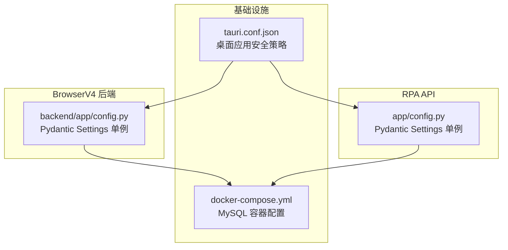
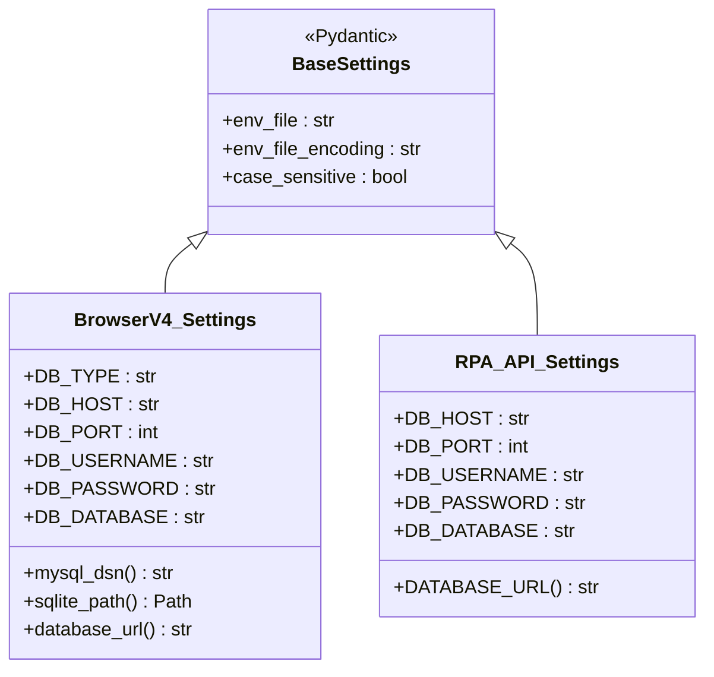
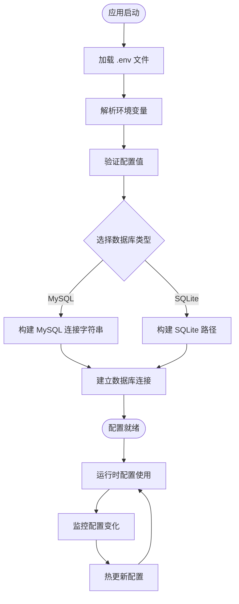
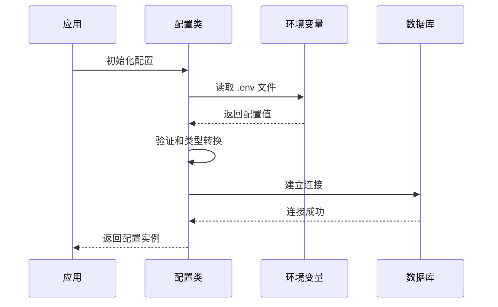
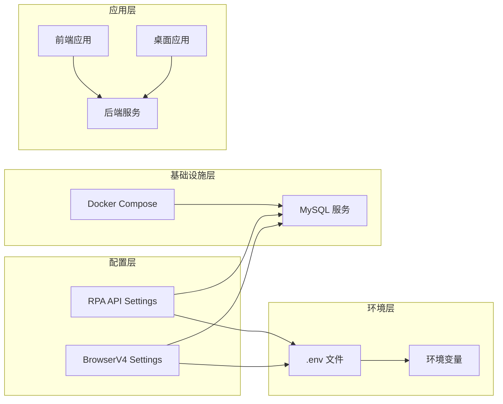
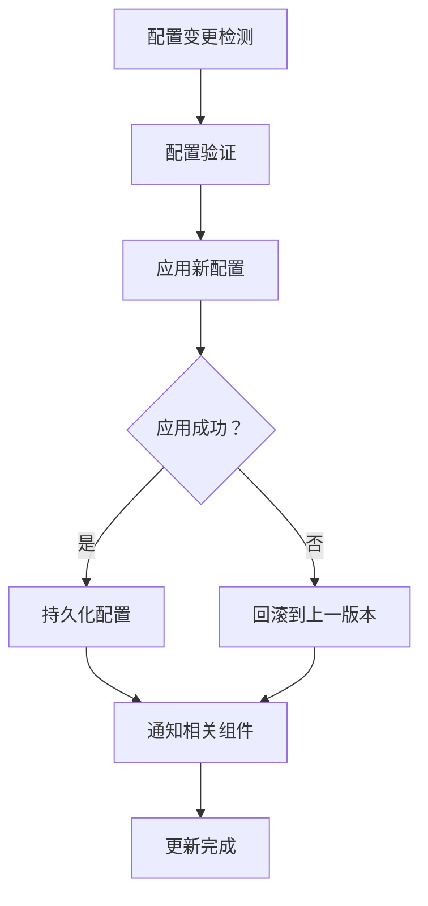

# 环境配置管理

<cite>
**本文档引用的文件**
- [CCC-BrowserV4 后端配置](file://CCC-BrowserV4/backend/app/config.py)
- [RPA API 配置](file://CCC_RPA_API/app/config.py)
- [Docker Compose 配置](file://CCC-BrowserV4/docker-compose.yml)
- [Tauri 应用配置](file://CCC-BrowserV4/src-tauri/tauri.conf.json)
</cite>

## 目录
1. [简介](#简介)
2. [项目结构](#项目结构)
3. [核心组件](#核心组件)
4. [架构概览](#架构概览)
5. [详细组件分析](#详细组件分析)
6. [依赖关系分析](#依赖关系分析)
7. [性能考虑](#性能考虑)
8. [故障排除指南](#故障排除指南)
9. [结论](#结论)
10. [附录](#附录)

## 简介
本指南专注于代码库中的环境配置管理实践，涵盖配置文件的组织结构与层次设计、环境变量使用规范、密钥安全管理策略、不同环境的配置模板与最佳实践、配置热更新机制以及配置变更审计功能。通过对现有配置实现的深入分析，提供可操作的指导原则和实施建议。

## 项目结构
项目采用多模块架构，包含前端、后端和系统集成层。配置管理在两个主要后端模块中实现：BrowserV4 后端和 RPA API。同时，Docker Compose 提供了数据库服务的容器化配置，Tauri 配置文件定义了桌面应用的安全策略和构建参数。

**图表来源**
- [CCC-BrowserV4 后端配置:1-52](file://CCC-BrowserV4/backend/app/config.py#L1-L52)
- [RPA API 配置:1-22](file://CCC_RPA_API/app/config.py#L1-L22)
- [Docker Compose 配置:1-21](file://CCC-BrowserV4/docker-compose.yml#L1-L21)
- [Tauri 应用配置:1-29](file://CCC-BrowserV4/src-tauri/tauri.conf.json#L1-L29)

**章节来源**
- [CCC-BrowserV4 后端配置:1-52](file://CCC-BrowserV4/backend/app/config.py#L1-L52)
- [RPA API 配置:1-22](file://CCC_RPA_API/app/config.py#L1-L22)
- [Docker Compose 配置:1-21](file://CCC-BrowserV4/docker-compose.yml#L1-L21)
- [Tauri 应用配置:1-29](file://CCC-BrowserV4/src-tauri/tauri.conf.json#L1-L29)

## 核心组件
本节分析配置管理的核心组件，包括配置类的设计、环境变量的加载机制以及配置的运行时行为。

### 配置类设计模式
两个后端模块均采用 Pydantic 的 BaseSettings 类作为配置基类，实现了类型安全的配置管理。BrowserV4 后端使用 SettingsConfigDict 进行更精细的配置控制，而 RPA API 使用传统的 Config 内部类方式。

**图表来源**
- [CCC-BrowserV4 后端配置:9-51](file://CCC-BrowserV4/backend/app/config.py#L9-L51)
- [RPA API 配置:6-21](file://CCC_RPA_API/app/config.py#L6-L21)

### 环境变量加载机制
配置系统通过 .env 文件和环境变量进行加载，支持大小写不敏感的变量名解析。BrowserV4 后端提供了更灵活的配置选项，包括数据库类型切换和 SQLite 支持。

**章节来源**
- [CCC-BrowserV4 后端配置:12-16](file://CCC-BrowserV4/backend/app/config.py#L12-L16)
- [RPA API 配置:17-18](file://CCC_RPA_API/app/config.py#L17-L18)

## 架构概览
配置管理架构采用分层设计，从基础的环境变量加载到高级的数据库连接管理，形成了完整的配置体系。

**图表来源**
- [CCC-BrowserV4 后端配置:28-47](file://CCC-BrowserV4/backend/app/config.py#L28-L47)
- [RPA API 配置:13-15](file://CCC_RPA_API/app/config.py#L13-L15)

## 详细组件分析

### BrowserV4 后端配置组件
BrowserV4 后端实现了最完整的配置管理方案，包括：

#### 数据库配置层次
- **默认配置**：预设的开发环境参数
- **环境特定配置**：通过环境变量覆盖默认值
- **用户自定义配置**：支持 .env 文件的本地定制

**图表来源**
- [CCC-BrowserV4 后端配置:9-51](file://CCC-BrowserV4/backend/app/config.py#L9-L51)

#### 密钥安全管理
配置类直接暴露数据库凭据信息，建议在生产环境中：
- 使用环境变量注入而非硬编码
- 实施凭据轮换机制
- 启用访问控制和最小权限原则

**章节来源**
- [CCC-BrowserV4 后端配置:18-26](file://CCC-BrowserV4/backend/app/config.py#L18-L26)

### RPA API 配置组件
RPA API 采用了简化的配置模式，专注于数据库连接配置。

#### 配置简化设计
- **单一职责**：仅管理数据库连接参数
- **静态配置**：无动态切换能力
- **直接暴露**：配置值直接用于连接构建

**章节来源**
- [RPA API 配置:6-21](file://CCC_RPA_API/app/config.py#L6-L21)

### Docker Compose 集成
Docker Compose 提供了完整的数据库服务配置，包括：

#### 数据库服务配置
- **镜像版本**：MySQL 8.4
- **网络映射**：端口 3306 暴露
- **数据持久化**：卷挂载到 mysql_data
- **初始化参数**：字符集和排序规则设置

**章节来源**
- [Docker Compose 配置:4-17](file://CCC-BrowserV4/docker-compose.yml#L4-L17)

### Tauri 应用安全配置
Tauri 配置文件定义了桌面应用的安全策略：

#### 内容安全策略 (CSP)
- **脚本执行**：仅允许自身脚本
- **样式加载**：允许内联样式以支持框架需求
- **网络连接**：限制到特定域名和本地地址

**章节来源**
- [Tauri 应用配置:24-26](file://CCC-BrowserV4/src-tauri/tauri.conf.json#L24-L26)

## 依赖关系分析
配置系统的依赖关系体现了清晰的分层架构和模块化设计。

**图表来源**
- [CCC-BrowserV4 后端配置:12-16](file://CCC-BrowserV4/backend/app/config.py#L12-L16)
- [RPA API 配置:17-18](file://CCC_RPA_API/app/config.py#L17-L18)
- [Docker Compose 配置:10-14](file://CCC-BrowserV4/docker-compose.yml#L10-L14)

**章节来源**
- [CCC-BrowserV4 后端配置:1-52](file://CCC-BrowserV4/backend/app/config.py#L1-L52)
- [RPA API 配置:1-22](file://CCC_RPA_API/app/config.py#L1-L22)
- [Docker Compose 配置:1-21](file://CCC-BrowserV4/docker-compose.yml#L1-L21)

## 性能考虑
配置管理的性能优化主要体现在以下几个方面：

### 配置加载优化
- **延迟初始化**：配置对象在首次使用时才进行完整初始化
- **缓存机制**：已解析的配置值应缓存避免重复计算
- **增量更新**：支持部分配置的动态更新而不重启服务

### 内存使用优化
- **按需加载**：仅加载当前环境所需的配置项
- **资源清理**：及时释放不再使用的配置资源
- **连接池管理**：数据库连接应使用连接池减少开销

## 故障排除指南
针对配置管理常见问题提供诊断和解决方案：

### 配置加载失败
**症状**：应用启动时报配置错误
**排查步骤**：
1. 检查 .env 文件是否存在且格式正确
2. 验证环境变量是否正确设置
3. 确认配置项的类型转换是否符合预期

### 数据库连接问题
**症状**：无法建立数据库连接
**排查步骤**：
1. 验证数据库服务状态
2. 检查网络连通性
3. 确认凭据信息正确性
4. 查看连接超时设置

### 环境变量冲突
**症状**：配置值不符合预期
**排查步骤**：
1. 检查环境变量的优先级顺序
2. 验证变量名的大小写敏感性
3. 确认 .env 文件的加载顺序

**章节来源**
- [CCC-BrowserV4 后端配置:12-16](file://CCC-BrowserV4/backend/app/config.py#L12-L16)
- [RPA API 配置:17-18](file://CCC_RPA_API/app/config.py#L17-L18)

## 结论
本项目展示了现代应用配置管理的最佳实践，通过 Pydantic 的类型安全特性、环境变量的灵活加载机制以及容器化的基础设施支持，构建了一个健壮的配置管理体系。建议在现有基础上进一步完善密钥管理、热更新和审计功能，以满足生产环境的更高要求。

## 附录

### 环境配置模板
基于现有实现，提供不同环境的配置模板建议：

#### 开发环境配置
- 数据库类型：SQLite（便于快速开发）
- 日志级别：调试模式
- 端点地址：本地回环地址
- 安全策略：宽松的 CORS 设置

#### 测试环境配置  
- 数据库类型：独立的测试数据库
- 日志级别：信息级别
- 端点地址：测试服务器地址
- 安全策略：标准的 CSP 设置

#### 生产环境配置
- 数据库类型：MySQL 主从复制
- 日志级别：警告级别
- 端点地址：公网可访问
- 安全策略：严格的 CSP 和访问控制

### 密钥管理最佳实践
- 使用专用的密钥管理系统（如 HashiCorp Vault）
- 实施定期轮换策略（建议每90天轮换一次）
- 启用访问审计和操作日志
- 实现最小权限原则和分层加密
- 建立密钥恢复和应急响应流程

### 配置热更新实现建议

[本节为概念性内容，无需源码引用]