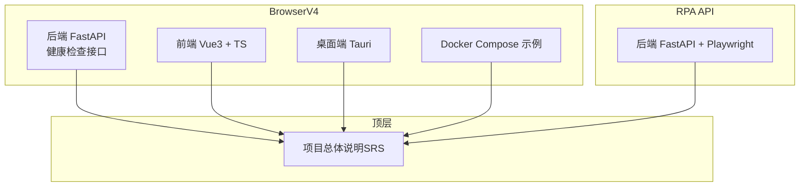
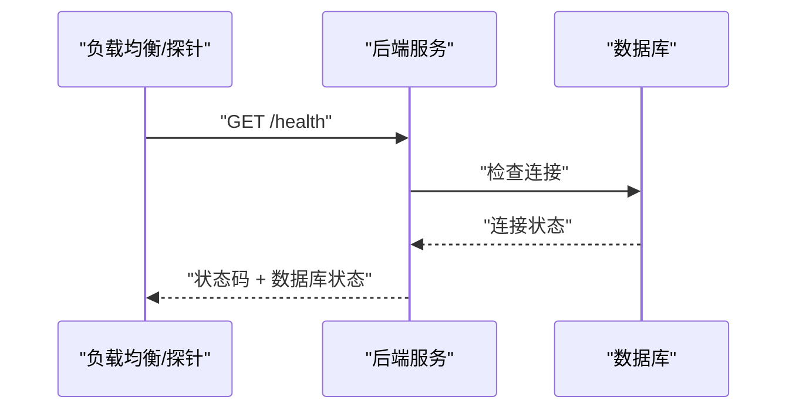
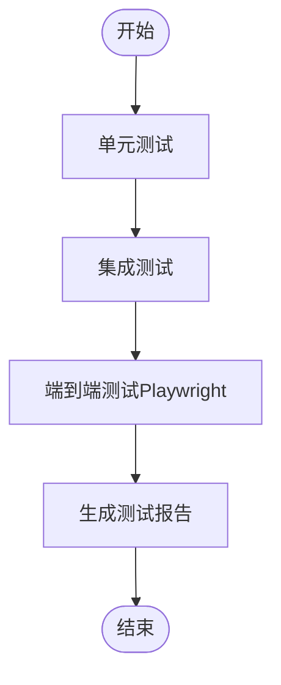
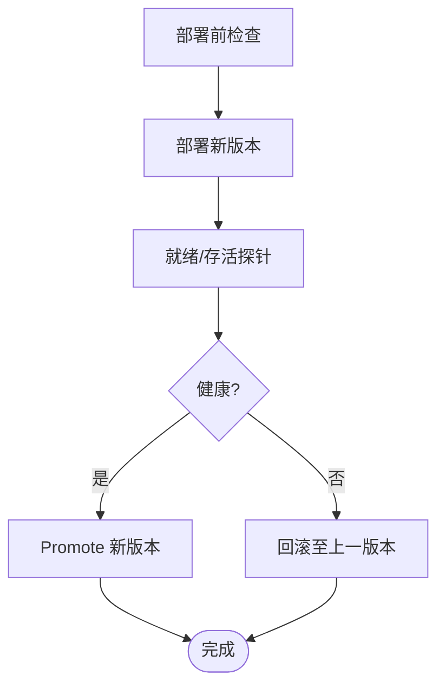
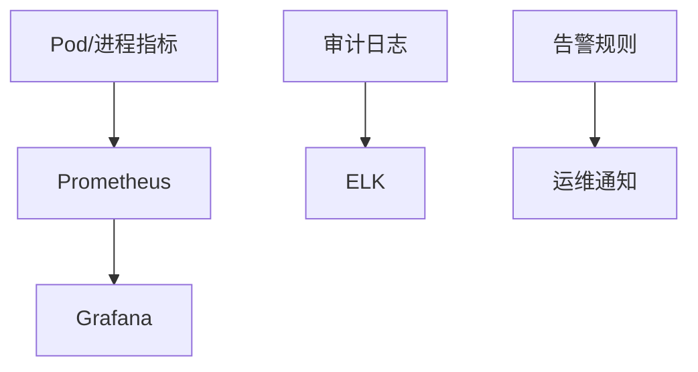
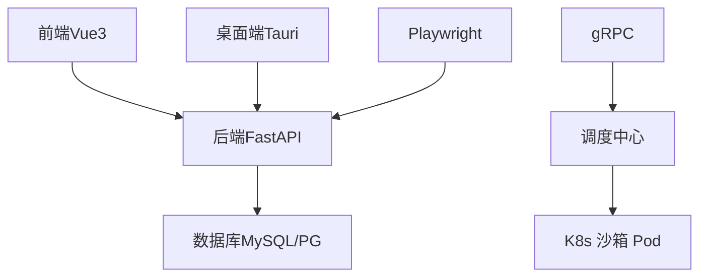

# 部署自动化

<cite>
**本文引用的文件**
- [docker-compose.yml](file://CCC-BrowserV4/docker-compose.yml)
- [requirements.txt（BrowserV4 后端）](file://CCC-BrowserV4/backend/requirements.txt)
- [requirements.txt（RPA API）](file://CCC_RPA_API/requirements.txt)
- [健康检查接口](file://CCC-BrowserV4/backend/app/api/health.py)
- [项目总体说明（SRS）](file://project.md)
</cite>

## 目录
1. [简介](#简介)
2. [项目结构](#项目结构)
3. [核心组件](#核心组件)
4. [架构总览](#架构总览)
5. [详细组件分析](#详细组件分析)
6. [依赖关系分析](#依赖关系分析)
7. [性能考量](#性能考量)
8. [故障排查指南](#故障排查指南)
9. [结论](#结论)
10. [附录](#附录)

## 简介
本指南面向商用级 AI 浏览器系统的部署自动化落地，围绕 CI/CD 流水线设计、自动化测试策略、自动化部署脚本、工件与版本管理、监控与告警以及故障诊断与恢复流程展开。项目具备两套主要后端服务与前端应用，采用 FastAPI、Playwright、MySQL 等技术栈，并在 SRS 中明确了 K8s 生产部署形态、监控与告警要求、数据与安全规范。本指南以现有仓库信息为基础，给出可操作的实施建议与最佳实践。

## 项目结构
项目包含三层后端与前端：
- BrowserV4：包含后端（FastAPI）、前端（Vue3 + TypeScript）、桌面端（Tauri）与 Docker Compose 示例
- RPA API：包含后端（FastAPI + Playwright）与依赖清单
- 顶层：统一的项目说明文档（SRS）



图表来源
- [docker-compose.yml:1-21](file://CCC-BrowserV4/docker-compose.yml#L1-L21)
- [requirements.txt（BrowserV4 后端）:1-13](file://CCC-BrowserV4/backend/requirements.txt#L1-L13)
- [requirements.txt（RPA API）:1-11](file://CCC_RPA_API/requirements.txt#L1-L11)
- [健康检查接口:1-17](file://CCC-BrowserV4/backend/app/api/health.py#L1-L17)
- [项目总体说明（SRS）:1-782](file://project.md#L1-L782)

章节来源
- [docker-compose.yml:1-21](file://CCC-BrowserV4/docker-compose.yml#L1-L21)
- [requirements.txt（BrowserV4 后端）:1-13](file://CCC-BrowserV4/backend/requirements.txt#L1-L13)
- [requirements.txt（RPA API）:1-11](file://CCC_RPA_API/requirements.txt#L1-L11)
- [健康检查接口:1-17](file://CCC-BrowserV4/backend/app/api/health.py#L1-L17)
- [项目总体说明（SRS）:1-782](file://project.md#L1-L782)

## 核心组件
- 后端服务（FastAPI）
  - BrowserV4 后端提供健康检查接口，用于部署后的可用性探测
  - RPA API 后端引入 Playwright，用于自动化脚本执行
- 数据库
  - BrowserV4 使用 MySQL（Compose 示例）
  - SRS 明确 PostgreSQL 为核心数据存储
- 前端与桌面端
  - 前端采用 Vue3 + TypeScript
  - 桌面端采用 Tauri（与后端交互）
- 部署形态
  - SRS 明确 K8s 生产形态与单机进程测试形态

章节来源
- [健康检查接口:1-17](file://CCC-BrowserV4/backend/app/api/health.py#L1-L17)
- [requirements.txt（BrowserV4 后端）:1-13](file://CCC-BrowserV4/backend/requirements.txt#L1-L13)
- [requirements.txt（RPA API）:1-11](file://CCC_RPA_API/requirements.txt#L1-L11)
- [项目总体说明（SRS）:189-236](file://project.md#L189-L236)

## 架构总览
下图展示了商用级 AI 浏览器系统的典型部署架构：API 网关层、控制层（Playwright SDK/扩展）、会话调度中心与 K8s 沙箱 Pod 集群，以及 AI 微服务层。该图映射到 SRS 的五层架构与 K8s Pod 模板。

```mermaid
graph TB
Client["租户客户端/业务系统"]
APIGW["API 网关REST/WS"]
Control["控制层Playwright SDK / 扩展"]
Scheduler["会话调度中心"]
K8s["K8s 沙箱 Pod 集群"]
AISvc["AI 微服务LLM/OCR/YOLO"]
Client --> APIGW
APIGW --> Control
Control --> Scheduler
Scheduler --> K8s
Scheduler <- --> AISvc
```

图表来源
- [项目总体说明（SRS）:704-714](file://project.md#L704-L714)
- [项目总体说明（SRS）:734-765](file://project.md#L734-L765)

章节来源
- [项目总体说明（SRS）:704-714](file://project.md#L704-L714)
- [项目总体说明（SRS）:734-765](file://project.md#L734-L765)

## 详细组件分析

### 组件A：健康检查与部署前检查
- 健康检查接口用于探测服务可用性与数据库连接状态
- 部署前检查建议包含：端口可达、数据库连接、依赖服务就绪、配置加载成功



图表来源
- [健康检查接口:10-17](file://CCC-BrowserV4/backend/app/api/health.py#L10-L17)

章节来源
- [健康检查接口:1-17](file://CCC-BrowserV4/backend/app/api/health.py#L1-L17)

### 组件B：自动化测试策略
- 单元测试：针对后端服务的路由、数据库连接、工具函数进行覆盖
- 集成测试：跨服务组合测试（API 网关 + 控制层 + AI 微服务）
- 端到端测试：通过 Playwright 执行真实页面自动化，验证登录、导航、截图等关键流程



章节来源
- [requirements.txt（RPA API）:8-11](file://CCC_RPA_API/requirements.txt#L8-L11)
- [项目总体说明（SRS）:619-626](file://project.md#L619-L626)

### 组件C：自动化部署脚本与回滚机制
- 部署前检查：镜像可用性、配置校验、资源配额、网络策略
- 部署策略：蓝绿部署或金丝雀发布（建议结合 HPA 与滚动更新）
- 回滚机制：版本标签回退、配置回滚、灰度撤销



章节来源
- [项目总体说明（SRS）:189-236](file://project.md#L189-L236)
- [项目总体说明（SRS）:425-433](file://project.md#L425-L433)

### 组件D：工件与版本管理
- Docker 镜像标签：语义化版本（vX.Y.Z）+ 构建号（可选）
- Kubernetes 清单版本：通过 GitOps 管理（如 ArgoCD/Flux），以分支/标签锁定版本
- 数据库迁移：版本化迁移脚本，配合发布计划执行


章节来源
- [项目总体说明（SRS）:552-558](file://project.md#L552-L558)

### 组件E：监控与告警
- 指标采集：Prometheus（CPU/内存/会话崩溃/代理失效/AI 推理耗时）
- 可视化：Grafana 大盘（全局/租户维度）
- 日志：ELK 收集审计日志，保留 90 天
- 告警：批量崩溃、资源耗尽、代理失效等规则



章节来源
- [项目总体说明（SRS）:425-433](file://project.md#L425-L433)

## 依赖关系分析
- 技术栈依赖
  - 后端：FastAPI、SQLAlchemy、PyMySQL、Cryptography、Pydantic Settings、python-dotenv
  - 前端：Vue3、TypeScript、Vite
  - 桌面端：Tauri
  - 数据库：MySQL（Compose 示例）、PostgreSQL（SRS）
  - 自动化：Playwright、playwright-stealth
- 组件耦合
  - API 网关与控制层通过 REST/WS 交互
  - 控制层与调度中心通过 gRPC 交互
  - 调度中心与 K8s 沙箱 Pod 集群交互



图表来源
- [requirements.txt（BrowserV4 后端）:1-13](file://CCC-BrowserV4/backend/requirements.txt#L1-L13)
- [requirements.txt（RPA API）:1-11](file://CCC_RPA_API/requirements.txt#L1-L11)
- [项目总体说明（SRS）:445-480](file://project.md#L445-L480)

章节来源
- [requirements.txt（BrowserV4 后端）:1-13](file://CCC-BrowserV4/backend/requirements.txt#L1-L13)
- [requirements.txt（RPA API）:1-11](file://CCC_RPA_API/requirements.txt#L1-L11)
- [项目总体说明（SRS）:445-480](file://project.md#L445-L480)

## 性能考量
- 会话创建耗时：K8s ≤3s，单机进程 ≤1s
- AI 推理响应：7B 本地模型 ≤1.5s
- 并发与吞吐：API 网关 QPS≥100，WS 在线≥1000
- CDP 延迟：≤200ms
- 资源限制：单会话 CPU 0.5~1 核、内存 1~2Gi

章节来源
- [项目总体说明（SRS）:506-516](file://project.md#L506-L516)

## 故障排查指南
- 健康检查失败
  - 检查数据库连接字符串与凭据
  - 核对端口与网络策略（K8s NetworkPolicy）
- 会话崩溃/超时
  - 检查资源配额与内存阈值
  - 关注代理 IP 可用性与网络超时
- API 网关过载
  - 检查限流配置与队列积压
  - 必要时增加副本与弹性扩缩容
- 日志与审计
  - 通过 ELK 检索审计日志，定位异常操作
  - 结合 Grafana 指标定位资源瓶颈

章节来源
- [健康检查接口:10-17](file://CCC-BrowserV4/backend/app/api/health.py#L10-L17)
- [项目总体说明（SRS）:425-433](file://project.md#L425-L433)
- [项目总体说明（SRS）:532-540](file://project.md#L532-L540)

## 结论
本指南基于现有仓库与 SRS 要求，给出了 CI/CD 流水线、测试策略、部署脚本、工件管理、监控告警与故障恢复的实施建议。建议以 GitOps 管理清单、语义化镜像标签、蓝绿/金丝雀发布与完善的健康检查为基础，确保商用级部署的稳定性与可观测性。

## 附录
- Docker Compose 示例（MySQL）
  - 服务：mysql
  - 环境变量：root 密码、数据库名、用户与密码
  - 卷：mysql_data
- K8s Pod 模板要点
  - 资源限制与请求
  - 环境变量注入（会话 ID、代理地址、租户 ID）
  - EmptyDir 挂载与生命周期钩子

章节来源
- [docker-compose.yml:1-21](file://CCC-BrowserV4/docker-compose.yml#L1-L21)
- [项目总体说明（SRS）:734-765](file://project.md#L734-L765)