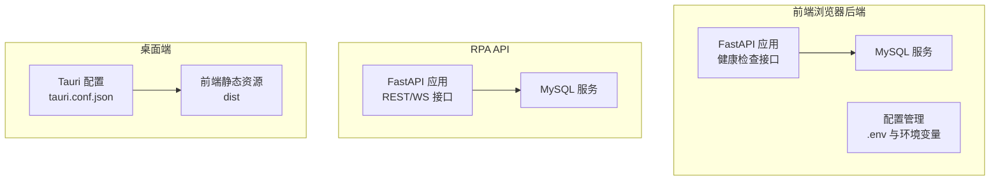
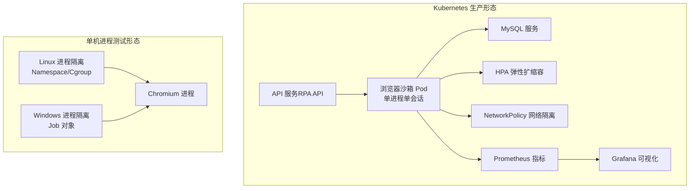
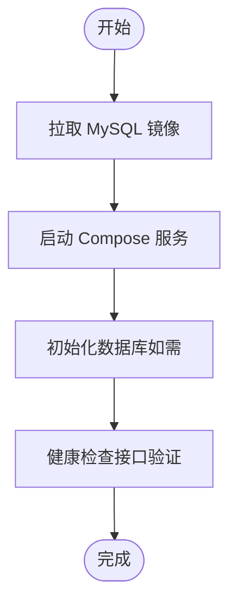
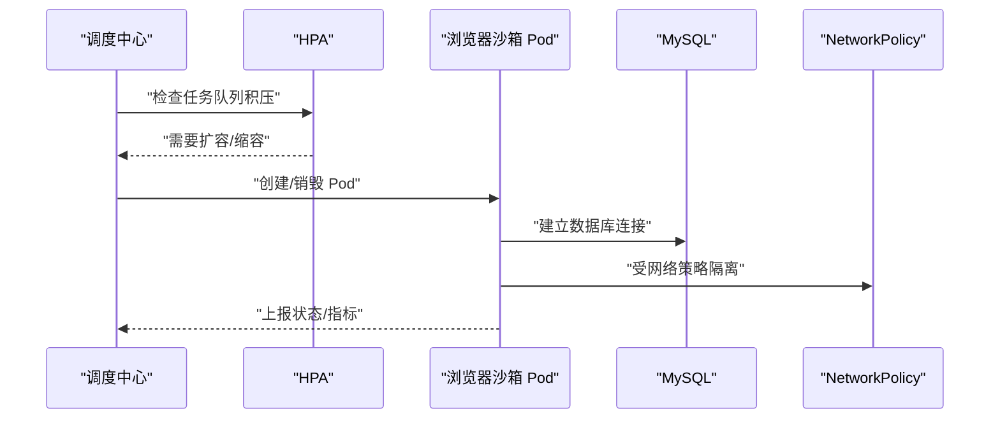
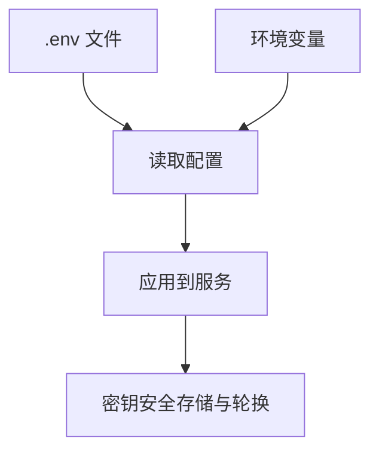
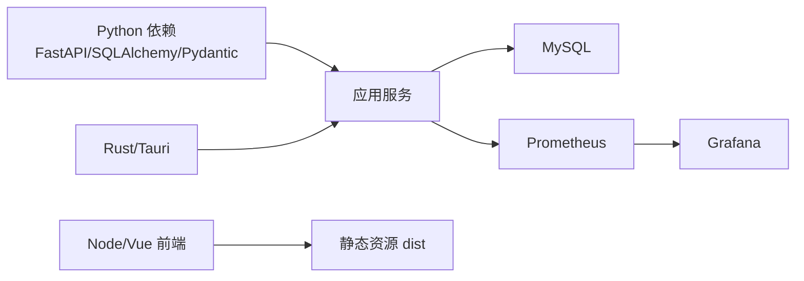

# 部署配置

<cite>
**本文引用的文件**
- [docker-compose.yml](file://CCC-BrowserV4/docker-compose.yml)
- [requirements.txt（前端浏览器）](file://CCC-BrowserV4/backend/requirements.txt)
- [requirements.txt（RPA API）](file://CCC_RPA_API/requirements.txt)
- [项目总览与部署规范（SRS）](file://project.md)
- [后端配置（前端浏览器）](file://CCC-BrowserV4/backend/app/config.py)
- [后端配置（RPA API）](file://CCC_RPA_API/app/config.py)
- [健康检查接口（前端浏览器）](file://CCC-BrowserV4/backend/app/api/health.py)
- [主程序（RPA API）](file://CCC_RPA_API/app/main.py)
- [Tauri 配置（桌面端）](file://CCC-BrowserV4/src-tauri/tauri.conf.json)
- [.gitignore（前端浏览器）](file://CCC-BrowserV4/.gitignore)
</cite>

## 目录
1. [简介](#简介)
2. [项目结构](#项目结构)
3. [核心组件](#核心组件)
4. [架构总览](#架构总览)
5. [详细组件分析](#详细组件分析)
6. [依赖关系分析](#依赖关系分析)
7. [性能考量](#性能考量)
8. [故障排查指南](#故障排查指南)
9. [结论](#结论)
10. [附录](#附录)

## 简介
本文件面向部署工程师与运维人员，系统化梳理本仓库的部署配置与最佳实践，覆盖以下主题：
- Docker 容器化部署：镜像构建要点、Compose 编排与数据库初始化
- Kubernetes 集群部署：Pod 模板、HPA 弹性扩缩容、网络策略
- 单机进程部署：Linux Namespace/Cgroup 与 Windows Job 的隔离思路
- 环境配置管理：配置文件组织、环境变量与密钥安全
- 部署形态对比：开发/测试/生产环境差异与选型建议
- 部署脚本与 CI/CD：流水线配置与自动化建议

## 项目结构
本仓库包含三层后端服务与前端/桌面端：
- 前端浏览器后端（FastAPI + MySQL）：提供健康检查与数据库连接状态
- RPA API（FastAPI + MySQL）：提供 REST/WS 接口、任务与租户管理
- 桌面端（Tauri + Vue）：本地化运行入口，前端静态资源打包

图表来源
- [docker-compose.yml:1-21](file://CCC-BrowserV4/docker-compose.yml#L1-L21)
- [健康检查接口（前端浏览器）:1-18](file://CCC-BrowserV4/backend/app/api/health.py#L1-L18)
- [主程序（RPA API）:1-127](file://CCC_RPA_API/app/main.py#L1-L127)
- [后端配置（前端浏览器）:1-51](file://CCC-BrowserV4/backend/app/config.py#L1-L51)
- [后端配置（RPA API）:1-22](file://CCC_RPA_API/app/config.py#L1-L22)
- [Tauri 配置（桌面端）:1-28](file://CCC-BrowserV4/src-tauri/tauri.conf.json#L1-L28)

章节来源
- [docker-compose.yml:1-21](file://CCC-BrowserV4/docker-compose.yml#L1-L21)
- [健康检查接口（前端浏览器）:1-18](file://CCC-BrowserV4/backend/app/api/health.py#L1-L18)
- [主程序（RPA API）:1-127](file://CCC_RPA_API/app/main.py#L1-L127)
- [后端配置（前端浏览器）:1-51](file://CCC-BrowserV4/backend/app/config.py#L1-L51)
- [后端配置（RPA API）:1-22](file://CCC_RPA_API/app/config.py#L1-L22)
- [Tauri 配置（桌面端）:1-28](file://CCC-BrowserV4/src-tauri/tauri.conf.json#L1-L28)

## 核心组件
- 数据库服务（MySQL）：通过 Compose 提供，包含初始化密码、数据库名与卷挂载
- 前端浏览器后端：FastAPI + SQLAlchemy，支持 .env 与环境变量注入，提供健康检查
- RPA API：FastAPI + SQLAlchemy，启动时自动建表与迁移，提供 REST/WS 与健康检查
- 桌面端：Tauri 配置前端静态资源路径与 CSP，便于本地调试与打包

章节来源
- [docker-compose.yml:1-21](file://CCC-BrowserV4/docker-compose.yml#L1-L21)
- [后端配置（前端浏览器）:1-51](file://CCC-BrowserV4/backend/app/config.py#L1-L51)
- [后端配置（RPA API）:1-22](file://CCC_RPA_API/app/config.py#L1-L22)
- [主程序（RPA API）:1-127](file://CCC_RPA_API/app/main.py#L1-L127)
- [Tauri 配置（桌面端）:1-28](file://CCC-BrowserV4/src-tauri/tauri.conf.json#L1-L28)

## 架构总览
下图展示两类部署形态与关键组件交互：

图表来源
- [项目总览与部署规范（SRS）:189-207](file://project.md#L189-L207)
- [项目总览与部署规范（SRS）:251-261](file://project.md#L251-L261)
- [项目总览与部署规范（SRS）:425-433](file://project.md#L425-L433)

## 详细组件分析

### Docker 容器化部署
- Compose 服务
  - MySQL 服务：映射主机端口、设置环境变量（含 root 密码、数据库名、普通用户与密码）、声明卷用于持久化
  - 前端浏览器后端与 RPA API：当前仓库未提供对应服务定义，建议在 Compose 中新增服务，并复用各自的 .env 与 requirements.txt
- 镜像构建建议
  - 使用 requirements.txt 安装依赖，注意 Python 版本与第三方库兼容性
  - 前端静态资源由 Tauri 打包，Compose 中可将 dist 目录挂载或复制到 Nginx/静态服务
- 数据库初始化
  - RPA API 在启动时自动建表与迁移，前端浏览器后端提供健康检查接口验证数据库连通性

图表来源
- [docker-compose.yml:1-21](file://CCC-BrowserV4/docker-compose.yml#L1-L21)
- [健康检查接口（前端浏览器）:1-18](file://CCC-BrowserV4/backend/app/api/health.py#L1-L18)
- [主程序（RPA API）:30-102](file://CCC_RPA_API/app/main.py#L30-L102)

章节来源
- [docker-compose.yml:1-21](file://CCC-BrowserV4/docker-compose.yml#L1-L21)
- [requirements.txt（前端浏览器）:1-13](file://CCC-BrowserV4/backend/requirements.txt#L1-L13)
- [requirements.txt（RPA API）:1-11](file://CCC_RPA_API/requirements.txt#L1-L11)
- [健康检查接口（前端浏览器）:1-18](file://CCC-BrowserV4/backend/app/api/health.py#L1-L18)
- [主程序（RPA API）:30-102](file://CCC_RPA_API/app/main.py#L30-L102)

### Kubernetes 集群部署
- Pod 模板设计
  - 单会话单 Pod，单进程单 Chromium，EmptyDir 会话存储，销毁即清空
  - 动态注入环境变量：会话 ID、代理地址、租户 ID、资源上限、最大存活时长
  - 生命周期钩子：启动前准备隔离目录、销毁前终止进程并清理临时文件
- HPA 弹性扩缩容
  - 依据任务队列积压自动扩容，闲置超时自动销毁，回收代理 IP
- 网络策略
  - NetworkPolicy 隔离 Pod 网络，避免相互访问
- 监控与可观测性
  - Pod/进程指标、CDP 连接数、AI 推理耗时、崩溃次数、代理 IP 失效率等

图表来源
- [项目总览与部署规范（SRS）:251-261](file://project.md#L251-L261)
- [项目总览与部署规范（SRS）:191-201](file://project.md#L191-L201)
- [项目总览与部署规范（SRS）:425-433](file://project.md#L425-L433)

章节来源
- [项目总览与部署规范（SRS）:189-207](file://project.md#L189-L207)
- [项目总览与部署规范（SRS）:251-261](file://project.md#L251-L261)
- [项目总览与部署规范（SRS）:425-433](file://project.md#L425-L433)

### 单机进程部署
- Linux
  - 使用 unshare 创建独立 mnt/net 命名空间，cgroup v2 限制资源
- Windows
  - 使用 Win32 Job 对象限制进程资源，NTFS ACL 隔离 UserData 目录访问权限
- 适用场景
  - 内部测试与快速验证，避免引入 K8s 集群复杂度

章节来源
- [项目总览与部署规范（SRS）:203-207](file://project.md#L203-L207)

### 环境配置管理最佳实践
- 配置文件组织
  - 使用 .env 与环境变量组合，.env 用于本地开发，环境变量用于容器/集群
  - 前端浏览器后端与 RPA API 均支持从 .env 与环境变量读取配置
- 环境变量管理
  - 数据库主机、端口、用户名、密码、数据库名
  - 通过 Compose 或 K8s Secret 注入敏感信息
- 密钥安全管理
  - 会话快照与敏感字段采用 AES-256-CBC 加密存储
  - 建议将密钥置于 K8s Secret 或 Vault 等密管系统，避免硬编码

图表来源
- [后端配置（前端浏览器）:1-51](file://CCC-BrowserV4/backend/app/config.py#L1-L51)
- [后端配置（RPA API）:1-22](file://CCC_RPA_API/app/config.py#L1-L22)
- [.gitignore（前端浏览器）:1-31](file://CCC-BrowserV4/.gitignore#L1-L31)
- [项目总览与部署规范（SRS）:582-586](file://project.md#L582-L586)

章节来源
- [后端配置（前端浏览器）:1-51](file://CCC-BrowserV4/backend/app/config.py#L1-L51)
- [后端配置（RPA API）:1-22](file://CCC_RPA_API/app/config.py#L1-L22)
- [.gitignore（前端浏览器）:1-31](file://CCC-BrowserV4/.gitignore#L1-L31)
- [项目总览与部署规范（SRS）:582-586](file://project.md#L582-L586)

### 部署形态对比与选型建议
- 开发环境
  - 推荐：Compose + 本地 MySQL，便于快速迭代
  - 关键点：.env 配置、健康检查验证、前端静态资源打包
- 测试环境
  - 推荐：单机进程（Linux/Windows），隔离更简单
  - 关键点：命名空间/Job 对象配置、UserData 目录 ACL
- 生产环境
  - 推荐：K8s 分布式集群，HPA + NetworkPolicy + 监控
  - 关键点：Pod 模板、资源限制、EmptyDir 清理、任务队列驱动扩缩容

章节来源
- [docker-compose.yml:1-21](file://CCC-BrowserV4/docker-compose.yml#L1-L21)
- [项目总览与部署规范（SRS）:189-207](file://project.md#L189-L207)
- [项目总览与部署规范（SRS）:251-261](file://project.md#L251-L261)

### 部署脚本与 CI/CD 流水线
- 部署脚本建议
  - Compose：一键启动数据库与服务，健康检查通过后再放行流量
  - K8s：以 Helm/Argo/Flux 管理资源，HPA/NetworkPolicy 作为基线
- CI/CD 流水线
  - 构建阶段：安装依赖（requirements.txt）、打包前端静态资源
  - 测试阶段：健康检查、数据库连通性测试
  - 发布阶段：推送镜像、应用 K8s/Compose 配置

章节来源
- [requirements.txt（前端浏览器）:1-13](file://CCC-BrowserV4/backend/requirements.txt#L1-L13)
- [requirements.txt（RPA API）:1-11](file://CCC_RPA_API/requirements.txt#L1-L11)
- [主程序（RPA API）:1-127](file://CCC_RPA_API/app/main.py#L1-L127)
- [Tauri 配置（桌面端）:1-28](file://CCC-BrowserV4/src-tauri/tauri.conf.json#L1-L28)

## 依赖关系分析
- 语言与框架
  - Python（FastAPI、SQLAlchemy、Pydantic Settings、PyMySQL、Cryptography）
  - Node/Vue（前端静态资源）
  - Rust/Tauri（桌面端）
- 外部服务
  - MySQL（数据库）
  - Prometheus/Grafana（监控）
  - ELK（审计日志）

图表来源
- [requirements.txt（前端浏览器）:1-13](file://CCC-BrowserV4/backend/requirements.txt#L1-L13)
- [requirements.txt（RPA API）:1-11](file://CCC_RPA_API/requirements.txt#L1-L11)
- [主程序（RPA API）:1-127](file://CCC_RPA_API/app/main.py#L1-L127)
- [Tauri 配置（桌面端）:1-28](file://CCC-BrowserV4/src-tauri/tauri.conf.json#L1-L28)
- [项目总览与部署规范（SRS）:716-732](file://project.md#L716-L732)

章节来源
- [requirements.txt（前端浏览器）:1-13](file://CCC-BrowserV4/backend/requirements.txt#L1-L13)
- [requirements.txt（RPA API）:1-11](file://CCC_RPA_API/requirements.txt#L1-L11)
- [主程序（RPA API）:1-127](file://CCC_RPA_API/app/main.py#L1-L127)
- [Tauri 配置（桌面端）:1-28](file://CCC-BrowserV4/src-tauri/tauri.conf.json#L1-L28)
- [项目总览与部署规范（SRS）:716-732](file://project.md#L716-L732)

## 性能考量
- 资源限制
  - 单会话 CPU/内存硬限制，避免资源争用
- 并发与弹性
  - 依据任务队列积压自动扩缩容，闲置销毁回收资源
- 端到端延迟
  - API 网关 QPS 与 WebSocket 在线连接数满足业务峰值
- 稳定性
  - 长期运行无持续内存泄漏，崩溃隔离与自愈重试

章节来源
- [项目总览与部署规范（SRS）:506-516](file://project.md#L506-L516)
- [项目总览与部署规范（SRS）:532-540](file://project.md#L532-L540)
- [项目总览与部署规范（SRS）:191-201](file://project.md#L191-L201)
- [项目总览与部署规范（SRS）:251-261](file://project.md#L251-L261)

## 故障排查指南
- 健康检查
  - 前端浏览器后端：/health 检查数据库连接
  - RPA API：/health 检查服务状态
- 数据库连通性
  - 确认 .env 与环境变量中的主机、端口、凭据正确
  - Compose 中确认端口映射与卷挂载
- 启动失败
  - 查看启动日志与迁移异常（RPA API 启动时自动建表与迁移）
- 密钥与加密
  - 确认 AES-256-CBC 密钥配置与存储位置

章节来源
- [健康检查接口（前端浏览器）:1-18](file://CCC-BrowserV4/backend/app/api/health.py#L1-L18)
- [主程序（RPA API）:30-102](file://CCC_RPA_API/app/main.py#L30-L102)
- [后端配置（前端浏览器）:1-51](file://CCC-BrowserV4/backend/app/config.py#L1-L51)
- [后端配置（RPA API）:1-22](file://CCC_RPA_API/app/config.py#L1-L22)
- [docker-compose.yml:1-21](file://CCC-BrowserV4/docker-compose.yml#L1-L21)

## 结论
本仓库提供了两类部署形态的完整规范与关键组件实现建议。生产环境推荐 K8s 分布式集群，配合 HPA、NetworkPolicy 与监控体系；测试与开发可采用 Compose 或单机进程形态。通过 .env 与环境变量的清晰分离、密钥的安全存储以及健康检查与自动迁移机制，可确保部署过程可控、可观测且可回滚。

## 附录
- 关键接口与资源
  - 健康检查：/health
  - REST/WS 接口：见 SRS 中的接口清单
- 监控与告警
  - Prometheus 指标、Grafana 可视化、ELK 审计日志
- 数据与密钥
  - PostgreSQL 核心表、Redis 缓存 Key 设计、AES-256-CBC 加密存储

章节来源
- [项目总览与部署规范（SRS）:447-461](file://project.md#L447-L461)
- [项目总览与部署规范（SRS）:425-433](file://project.md#L425-L433)
- [项目总览与部署规范（SRS）:560-586](file://project.md#L560-L586)