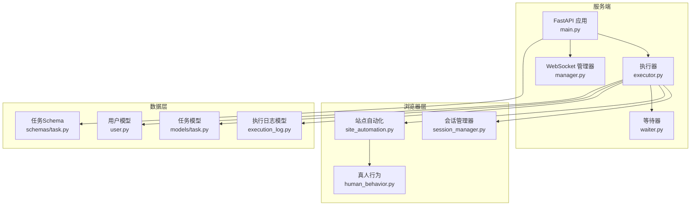
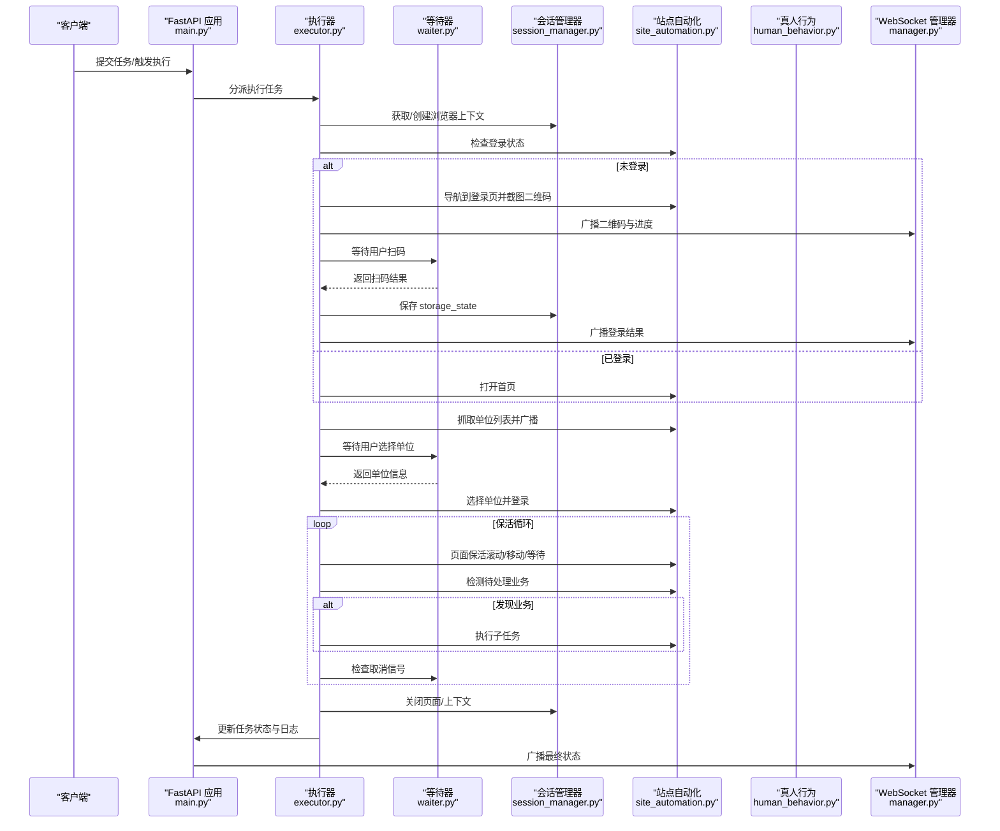
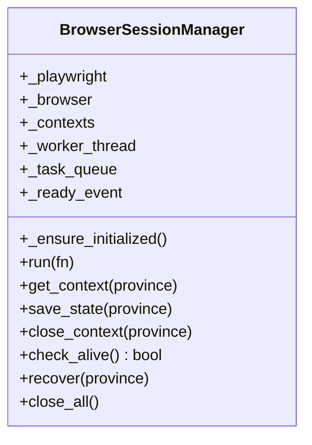
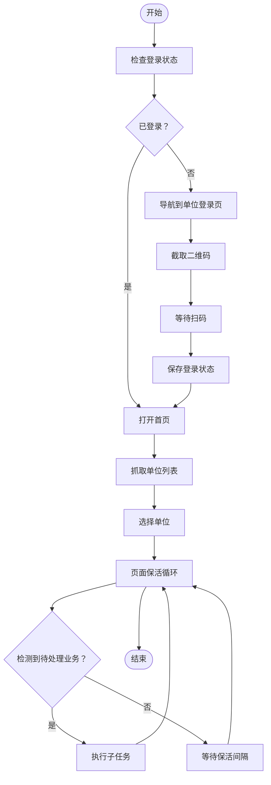
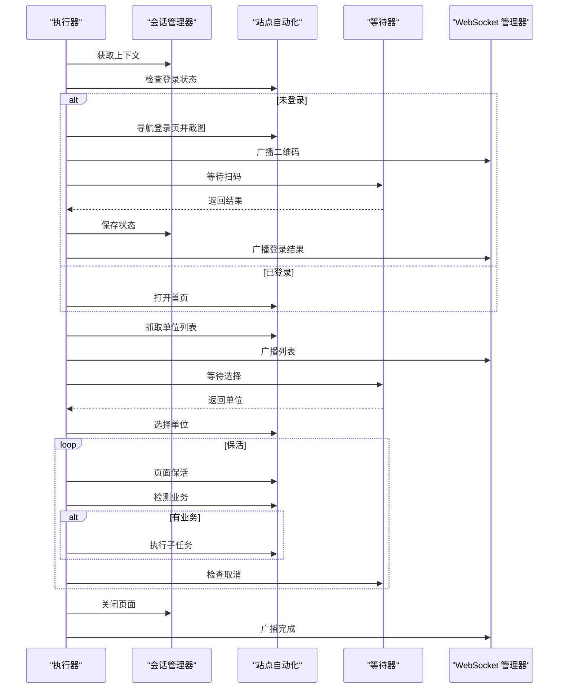
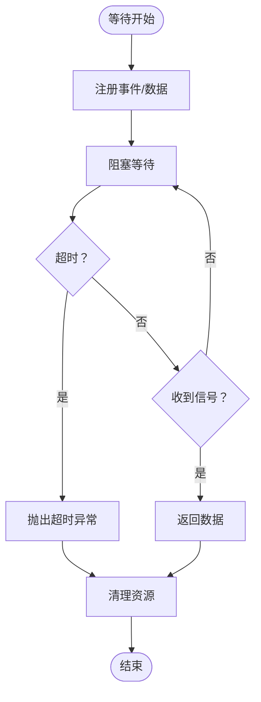
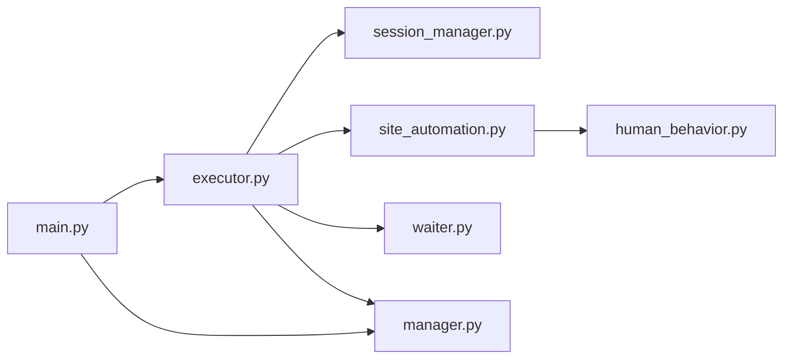

# Agent A 底层底座开发

<cite>
**本文档引用的文件**
- [main.py](file://CCC_RPA_API/app/main.py)
- [session_manager.py](file://CCC_RPA_API/app/browser/session_manager.py)
- [site_automation.py](file://CCC_RPA_API/app/browser/site_automation.py)
- [executor.py](file://CCC_RPA_API/app/services/executor.py)
- [waiter.py](file://CCC_RPA_API/app/browser/waiter.py)
- [human_behavior.py](file://CCC_RPA_API/app/browser/human_behavior.py)
- [task.py](file://CCC_RPA_API/app/schemas/task.py)
- [execution_log.py](file://CCC_RPA_API/app/models/execution_log.py)
- [user.py](file://CCC_RPA_API/app/models/user.py)
- [manager.py](file://CCC_RPA_API/app/ws/manager.py)
</cite>

## 目录
1. [简介](#简介)
2. [项目结构](#项目结构)
3. [核心组件](#核心组件)
4. [架构总览](#架构总览)
5. [详细组件分析](#详细组件分析)
6. [依赖关系分析](#依赖关系分析)
7. [性能考虑](#性能考虑)
8. [故障排查指南](#故障排查指南)
9. [结论](#结论)
10. [附录](#附录)

## 简介
本文件面向 Agent A 底层底座开发，聚焦于基础设施隔离层与 Chromium 沙箱集群层的实现与演进。文档围绕以下目标展开：
- 定制 Chromium 镜像构建与运行参数配置
- Dockerfile 编写与镜像优化建议
- Kubernetes 会话 Pod 编排与资源配额
- Playwright Core CDP 底层封装与线程安全执行
- 会话调度、资源管控与强隔离沙箱会话
- 多租户账号完全隔离与会话生命周期管理

本项目以 Python/FastAPI 为核心服务端框架，结合 Playwright 同步 API 在专用工作线程中执行浏览器操作，通过 WebSocket 实时推送执行状态，并以数据库持久化任务与执行日志。

## 项目结构
项目采用前后端分离与模块化组织：
- 后端服务：FastAPI 应用，路由注册、CORS、健康检查、WebSocket 管理
- 浏览器会话层：BrowserSessionManager 统一管理 Chromium 实例与上下文
- 自动化逻辑层：SiteAutomation 封装站点特定业务流程
- 执行编排层：Executor 负责任务执行流程、等待与保活
- 工具与等待机制：HumanBehavior 提供真人行为模拟；ExecutionWaiter 提供阻塞/取消/检查机制
- 数据模型与接口：SQLAlchemy 模型定义任务与执行日志；Pydantic Schema 定义任务请求/响应
- 通信层：WebSocket Manager 实现广播与连接管理

**图表来源**
- [main.py:1-127](file://CCC_RPA_API/app/main.py#L1-L127)
- [executor.py:1-319](file://CCC_RPA_API/app/services/executor.py#L1-L319)
- [session_manager.py:1-186](file://CCC_RPA_API/app/browser/session_manager.py#L1-L186)
- [site_automation.py:1-743](file://CCC_RPA_API/app/browser/site_automation.py#L1-L743)
- [waiter.py:1-84](file://CCC_RPA_API/app/browser/waiter.py#L1-L84)
- [human_behavior.py:1-86](file://CCC_RPA_API/app/browser/human_behavior.py#L1-L86)
- [execution_log.py:1-17](file://CCC_RPA_API/app/models/execution_log.py#L1-L17)
- [task.py:1-17](file://CCC_RPA_API/app/models/user.py#L1-L17)
- [task.py:1-58](file://CCC_RPA_API/app/schemas/task.py#L1-L58)
- [manager.py:1-29](file://CCC_RPA_API/app/ws/manager.py#L1-L29)

**章节来源**
- [main.py:1-127](file://CCC_RPA_API/app/main.py#L1-L127)

## 核心组件
- 会话管理器（BrowserSessionManager）
  - 负责 Chromium 实例与上下文的生命周期管理
  - 通过专用工作线程执行 Playwright 同步 API，避免与 asyncio 冲突
  - 支持按“省份”维度隔离上下文，持久化 storage_state
  - 提供恢复、关闭、存活检查等能力
- 站点自动化（SiteAutomation）
  - 封装登录、扫码、单位选择、页面保活、待处理业务检测等流程
  - 提供多策略降级与回退，增强鲁棒性
- 执行器（Executor）
  - 组织完整执行流程：登录检查、扫码、单位选择、保活循环、业务触发
  - 使用线程池与等待器实现阻塞等待与取消控制
  - 通过 WebSocket 广播进度与结果
- 等待机制（ExecutionWaiter）
  - 基于 threading.Event 的阻塞/唤醒/取消机制
  - 支持非阻塞检查与清理
- 真人行为（HumanBehavior）
  - 模拟点击、输入、滚动、等待等行为，降低检测风险
- WebSocket 管理（ConnectionManager）
  - 统一管理连接与广播消息

**章节来源**
- [session_manager.py:1-186](file://CCC_RPA_API/app/browser/session_manager.py#L1-L186)
- [site_automation.py:1-743](file://CCC_RPA_API/app/browser/site_automation.py#L1-L743)
- [executor.py:1-319](file://CCC_RPA_API/app/services/executor.py#L1-L319)
- [waiter.py:1-84](file://CCC_RPA_API/app/browser/waiter.py#L1-L84)
- [human_behavior.py:1-86](file://CCC_RPA_API/app/browser/human_behavior.py#L1-L86)
- [manager.py:1-29](file://CCC_RPA_API/app/ws/manager.py#L1-L29)

## 架构总览
下图展示从任务提交到浏览器执行、状态广播与日志落库的端到端流程：

**图表来源**
- [main.py:114-127](file://CCC_RPA_API/app/main.py#L114-L127)
- [executor.py:78-319](file://CCC_RPA_API/app/services/executor.py#L78-L319)
- [session_manager.py:98-186](file://CCC_RPA_API/app/browser/session_manager.py#L98-L186)
- [site_automation.py:37-743](file://CCC_RPA_API/app/browser/site_automation.py#L37-L743)
- [waiter.py:14-84](file://CCC_RPA_API/app/browser/waiter.py#L14-L84)
- [manager.py:17-29](file://CCC_RPA_API/app/ws/manager.py#L17-L29)

## 详细组件分析

### 会话管理器（BrowserSessionManager）
- 设计要点
  - 专用工作线程承载 Playwright 同步 API，避免与 FastAPI 的 asyncio 事件循环冲突
  - 按“省份”键隔离 BrowserContext，每个上下文持久化 storage_state，实现跨进程复用
  - 提供队列与事件机制，保证线程安全与超时控制
  - 支持恢复、关闭、存活检查与全局关闭
- 关键流程
  - 初始化：启动工作线程，创建 Chromium 实例与基础参数
  - 上下文获取：按需创建或复用，注入 user_agent、viewport、反检测脚本
  - 存储：将 storage_state 写入磁盘，下次启动自动恢复
  - 恢复：检测到浏览器异常时重建实例与上下文，重置页面状态
- 性能与可靠性
  - 通过队列与事件避免阻塞主线程
  - 超时与异常包装，确保调用方感知错误
  - 日志与告警辅助问题定位

**图表来源**
- [session_manager.py:10-186](file://CCC_RPA_API/app/browser/session_manager.py#L10-L186)

**章节来源**
- [session_manager.py:1-186](file://CCC_RPA_API/app/browser/session_manager.py#L1-L186)

### 站点自动化（SiteAutomation）
- 设计要点
  - 面向特定站点的自动化流程封装，包含登录、扫码、单位选择、保活与业务检测
  - 多策略降级与回退，提升在页面结构变化时的稳定性
  - 与真人行为库协作，降低被风控概率
- 关键流程
  - 登录状态检查：打开省平台首页，检测是否存在退出/用户信息元素
  - 单位登录页导航：优先直连统一登录页，失败则通过首页 JS 强制点击
  - 二维码截取：优先元素截图，失败则整页降级
  - 单位列表抓取：多选择器降级策略，必要时从文本中提取单位信息
  - 单位选择：优先文本匹配，其次 data-id/文本行匹配，最后索引回退；JS 回退兜底
  - 页面保活：随机滚动、鼠标移动、键盘 Tab、随机等待；检测异常弹窗并关闭
  - 待处理业务检测：基于徽标与关键词匹配
- 错误处理
  - 对“浏览器已关闭”的错误进行识别与上抛，触发恢复流程
  - 失败时保存截图，便于问题定位

**图表来源**
- [site_automation.py:37-743](file://CCC_RPA_API/app/browser/site_automation.py#L37-L743)
- [human_behavior.py:1-86](file://CCC_RPA_API/app/browser/human_behavior.py#L1-L86)

**章节来源**
- [site_automation.py:1-743](file://CCC_RPA_API/app/browser/site_automation.py#L1-L743)
- [human_behavior.py:1-86](file://CCC_RPA_API/app/browser/human_behavior.py#L1-L86)

### 执行器（Executor）
- 设计要点
  - 使用线程池执行耗时任务，避免阻塞主事件循环
  - 通过等待器实现阻塞等待与取消控制，支持分段等待以便快速响应取消
  - 在保活循环中周期性执行页面保活与业务检测
  - 通过 WebSocket 广播进度、二维码、错误与最终状态
- 关键流程
  - 初始化与登录检查：获取上下文、检查登录状态、扫码登录（如需）
  - 单位选择：广播单位列表，等待用户选择，执行单位切换
  - 保活循环：执行页面保活、检测业务、执行子任务、等待间隔
  - 结束与收尾：更新任务状态与日志，清理等待器资源
- 资源与并发
  - 线程池大小与任务粒度需根据硬件与站点负载平衡
  - 保活间隔与最大保活时长可配置，避免长时间占用资源

**图表来源**
- [executor.py:78-319](file://CCC_RPA_API/app/services/executor.py#L78-L319)
- [session_manager.py:98-186](file://CCC_RPA_API/app/browser/session_manager.py#L98-L186)
- [site_automation.py:37-743](file://CCC_RPA_API/app/browser/site_automation.py#L37-L743)
- [waiter.py:14-84](file://CCC_RPA_API/app/browser/waiter.py#L14-L84)
- [manager.py:17-29](file://CCC_RPA_API/app/ws/manager.py#L17-L29)

**章节来源**
- [executor.py:1-319](file://CCC_RPA_API/app/services/executor.py#L1-L319)

### 等待机制（ExecutionWaiter）
- 设计要点
  - 基于 threading.Event 的阻塞/唤醒/取消语义
  - 支持非阻塞检查与注册，便于保活循环等场景快速轮询
  - 线程安全的数据存储，避免竞态条件
- 使用场景
  - 用户扫码等待
  - 单位选择等待
  - 保活循环中的取消信号检查

**图表来源**
- [waiter.py:14-84](file://CCC_RPA_API/app/browser/waiter.py#L14-L84)

**章节来源**
- [waiter.py:1-84](file://CCC_RPA_API/app/browser/waiter.py#L1-L84)

### 真人行为（HumanBehavior）
- 设计要点
  - 模拟点击、输入、滚动、等待等行为，降低被风控概率
  - 所有 Page 操作在后台线程执行，避免与 asyncio 冲突
- 使用场景
  - SiteAutomation 中的交互步骤，配合随机化参数提升自然度

**章节来源**
- [human_behavior.py:1-86](file://CCC_RPA_API/app/browser/human_behavior.py#L1-L86)

### WebSocket 管理（ConnectionManager）
- 设计要点
  - 统一管理连接集合，支持广播消息
  - 自动清理断开连接，保证广播效率
- 使用场景
  - 执行器在各阶段广播进度、二维码、错误与最终状态

**章节来源**
- [manager.py:1-29](file://CCC_RPA_API/app/ws/manager.py#L1-L29)

## 依赖关系分析
- 组件耦合
  - Executor 依赖 SessionManager、SiteAutomation、ExecutionWaiter 与 WebSocket 管理器
  - SiteAutomation 依赖 HumanBehavior 与 Playwright Page
  - SessionManager 依赖 Playwright 同步 API 与存储目录
- 外部依赖
  - FastAPI、SQLAlchemy、WebSocket、Playwright
- 潜在环路
  - 无直接循环依赖；通过模块导入顺序与职责划分避免环路

**图表来源**
- [executor.py:1-319](file://CCC_RPA_API/app/services/executor.py#L1-L319)
- [session_manager.py:1-186](file://CCC_RPA_API/app/browser/session_manager.py#L1-L186)
- [site_automation.py:1-743](file://CCC_RPA_API/app/browser/site_automation.py#L1-L743)
- [waiter.py:1-84](file://CCC_RPA_API/app/browser/waiter.py#L1-L84)
- [human_behavior.py:1-86](file://CCC_RPA_API/app/browser/human_behavior.py#L1-L86)
- [manager.py:1-29](file://CCC_RPA_API/app/ws/manager.py#L1-L29)
- [main.py:1-127](file://CCC_RPA_API/app/main.py#L1-L127)

**章节来源**
- [executor.py:1-319](file://CCC_RPA_API/app/services/executor.py#L1-L319)
- [session_manager.py:1-186](file://CCC_RPA_API/app/browser/session_manager.py#L1-L186)
- [site_automation.py:1-743](file://CCC_RPA_API/app/browser/site_automation.py#L1-L743)
- [waiter.py:1-84](file://CCC_RPA_API/app/browser/waiter.py#L1-L84)
- [human_behavior.py:1-86](file://CCC_RPA_API/app/browser/human_behavior.py#L1-L86)
- [manager.py:1-29](file://CCC_RPA_API/app/ws/manager.py#L1-L29)
- [main.py:1-127](file://CCC_RPA_API/app/main.py#L1-L127)

## 性能考虑
- 线程模型
  - 专用工作线程承载 Playwright 同步 API，避免与 asyncio 事件循环竞争
  - 线程池大小应与 CPU 核数与站点并发需求匹配，避免过度竞争
- 超时与重试
  - 任务队列与线程等待设置合理超时，防止长时间阻塞
  - 页面操作设置网络与元素等待超时，结合降级策略
- 资源占用
  - 保活间隔与最大保活时长可配置，避免长时间占用浏览器实例
  - storage_state 持久化减少重复登录成本
- I/O 与存储
  - 截图与临时文件路径需在容器内具备可写权限，避免 I/O 失败
- 网络与风控
  - 通过真人行为与随机化参数降低被风控概率
  - 合理设置 user_agent、viewport 与反检测脚本

## 故障排查指南
- 浏览器异常
  - 现象：页面操作报错提示浏览器已关闭
  - 处理：执行器会捕获并触发恢复流程，重建上下文与页面
  - 建议：检查 Chromium 启动参数与系统资源，确认无内存/句柄泄漏
- 扫码超时
  - 现象：等待扫码超时
  - 处理：检查 WebSocket 连接与前端交互，确认二维码已正确推送
  - 建议：适当延长等待时间，优化前端轮询与网络稳定性
- 单位选择失败
  - 现象：选择单位失败或页面结构变化导致定位失败
  - 处理：启用 JS 回退与多选择器降级策略，必要时人工干预
  - 建议：增加调试截图与日志，持续维护选择器策略
- 保活无效
  - 现象：页面长时间无响应或被强制登出
  - 处理：检查保活策略与异常弹窗关闭逻辑
  - 建议：优化滚动与鼠标移动参数，增强随机性
- 资源不足
  - 现象：任务执行缓慢或失败
  - 处理：检查线程池大小、容器资源配额与磁盘空间
  - 建议：按并发与站点负载调整线程池与容器资源

**章节来源**
- [executor.py:42-76](file://CCC_RPA_API/app/services/executor.py#L42-L76)
- [site_automation.py:10-14](file://CCC_RPA_API/app/browser/site_automation.py#L10-L14)
- [waiter.py:14-33](file://CCC_RPA_API/app/browser/waiter.py#L14-L33)

## 结论
本方案通过专用工作线程承载 Playwright 同步 API、按省份隔离的上下文管理、多策略降级的站点自动化与完善的等待/广播机制，实现了稳定可靠的会话执行与状态反馈。结合真人行为模拟与合理的资源控制，能够在满足性能要求的同时有效降低风控风险。后续可在 Chromium 镜像优化、K8s 编排与多租户隔离方面进一步深化。

## 附录

### 开发任务清单（Agent A 底层底座）
- 基础设施隔离层
  - 设计并实现按“省份/租户/设备”维度的上下文隔离策略
  - 实现会话恢复与异常自愈机制
  - 建立会话生命周期管理（创建、复用、关闭、销毁）
- Chromium 沙箱集群层
  - 定制 Chromium 镜像，包含必要依赖与启动参数
  - 编写 Dockerfile，最小化镜像体积与攻击面
  - 设计 K8s Pod 编排，含资源配额、亲和性与健康检查
- Playwright Core CDP 封装
  - 统一封装页面操作与等待策略
  - 实现真人行为模拟与反检测脚本注入
- 会话调度与资源管控
  - 设计任务队列与并发控制
  - 实现等待/取消/检查机制，支持保活循环
  - 建立 WebSocket 广播通道，实时反馈执行状态
- 多租户与强隔离
  - 通过上下文隔离与存储隔离实现多租户完全隔离
  - 建立会话审计与日志追踪
- 性能与可靠性
  - 优化线程模型与超时策略
  - 增加降级与回退机制，提升鲁棒性
  - 建立监控与告警体系

### 技术实现要点
- 线程安全：专用工作线程 + 队列 + 事件，避免与 asyncio 冲突
- 隔离策略：按“省份/租户/设备”键隔离上下文，持久化 storage_state
- 鲁棒性：多选择器降级、JS 回退、异常截图与日志
- 通信：WebSocket 广播进度、二维码与错误
- 资源：线程池大小、保活间隔、最大保活时长可配置

### 性能要求
- 响应时间：任务执行关键路径在合理时间内完成，避免长时间阻塞
- 并发能力：线程池与容器资源匹配站点并发需求
- 稳定性：异常自愈与恢复机制保障长期运行

### 验收标准
- 功能正确性：登录、扫码、单位选择、保活与业务执行流程完整
- 隔离有效性：多租户上下文完全隔离，无交叉污染
- 可靠性：异常场景可恢复，日志与截图可追溯
- 性能达标：在目标负载下满足响应与吞吐要求