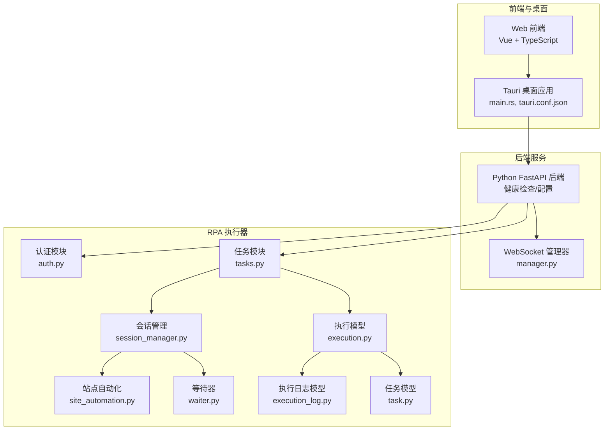
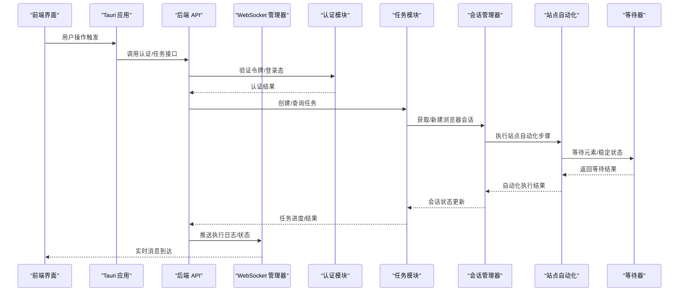
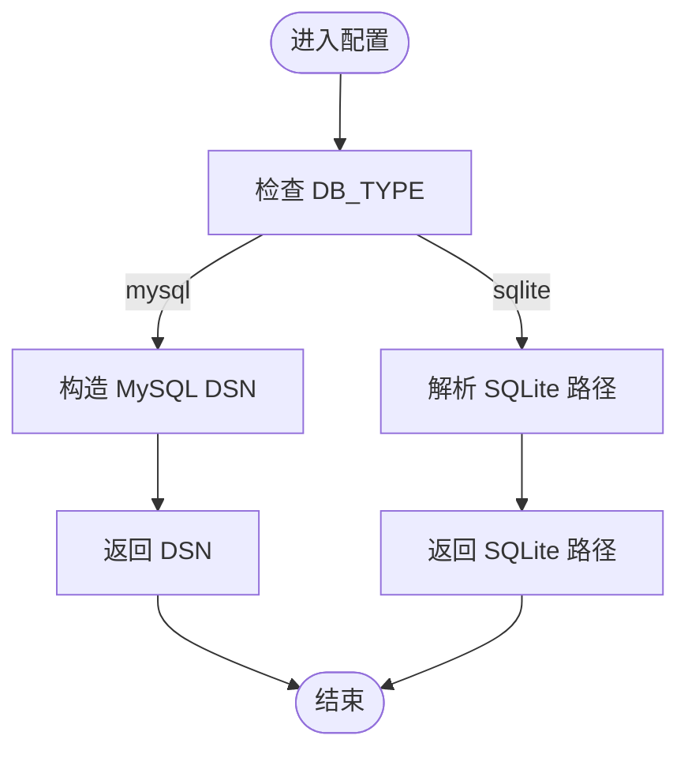
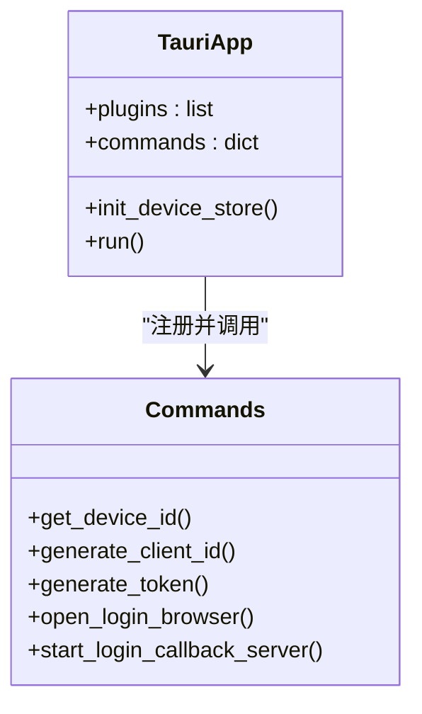
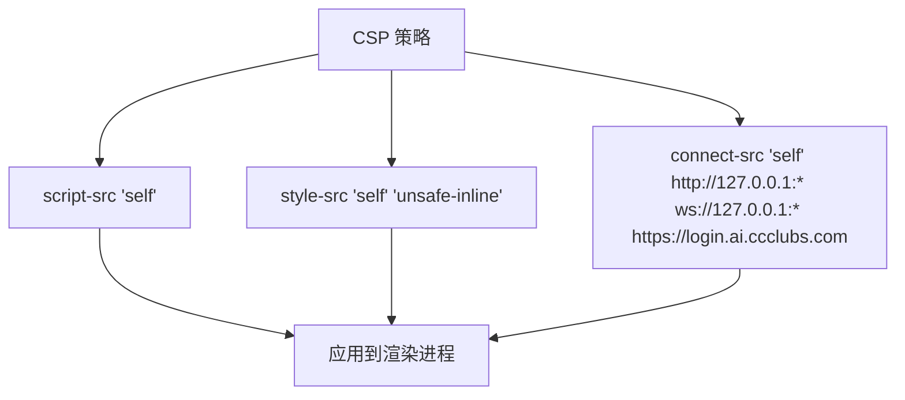
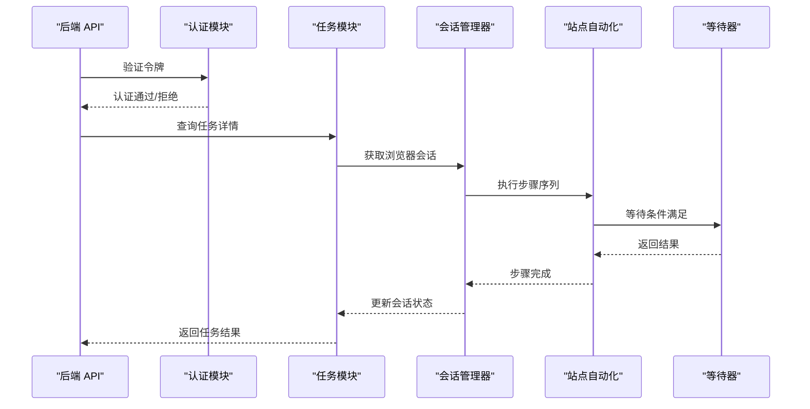
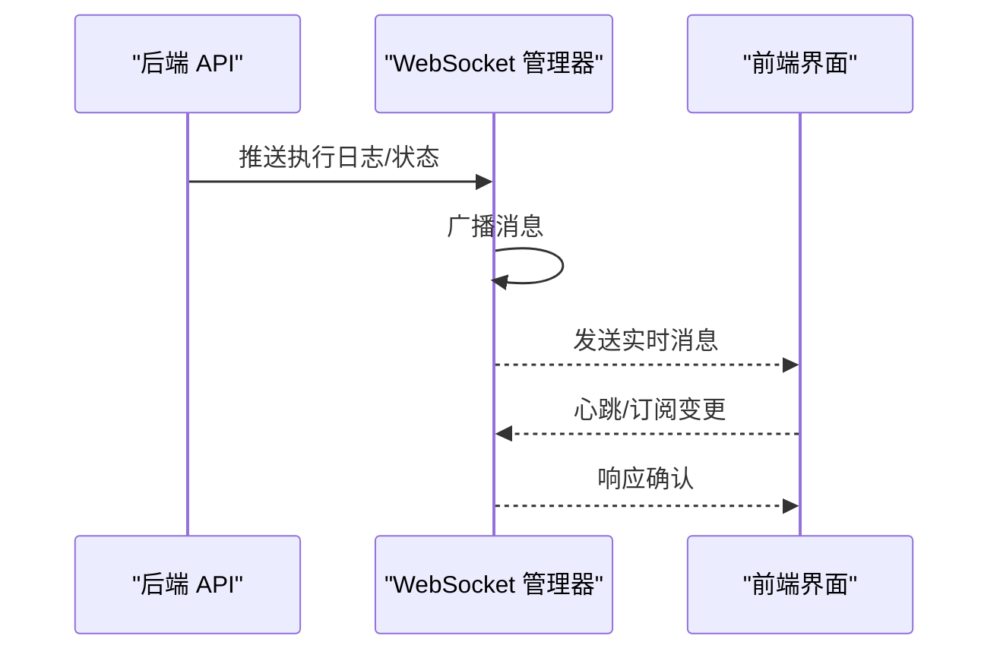
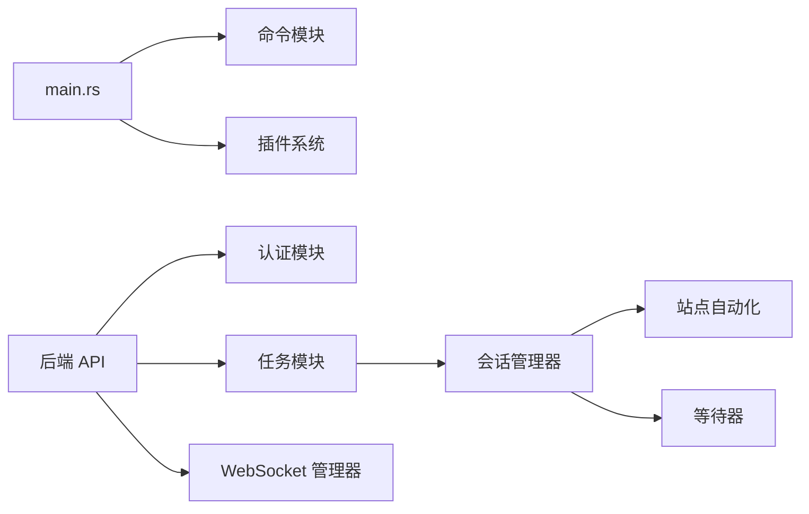

# Chromium 镜像构建

<cite>
**本文引用的文件**
- [docker-compose.yml](file://CCC-BrowserV4/docker-compose.yml)
- [config.py](file://CCC-BrowserV4/backend/app/config.py)
- [main.rs](file://CCC-BrowserV4/src-tauri/src/main.rs)
- [tauri.conf.json](file://CCC-BrowserV4/src-tauri/tauri.conf.json)
- [auth.py](file://CCC_RPA_API/app/api/auth.py)
- [tasks.py](file://CCC_RPA_API/app/api/tasks.py)
- [session_manager.py](file://CCC_RPA_API/app/browser/session_manager.py)
- [site_automation.py](file://CCC_RPA_API/app/browser/site_automation.py)
- [waiter.py](file://CCC_RPA_API/app/browser/waiter.py)
- [execution.py](file://CCC_RPA_API/app/schemas/execution.py)
- [execution_log.py](file://CCC_RPA_API/app/models/execution_log.py)
- [task.py](file://CCC_RPA_API/app/models/task.py)
- [manager.py](file://CCC_RPA_API/app/ws/manager.py)
- [requirements.txt](file://CCC-RPA_API/requirements.txt)
</cite>

## 目录
1. [引言](#引言)
2. [项目结构](#项目结构)
3. [核心组件](#核心组件)
4. [架构总览](#架构总览)
5. [详细组件分析](#详细组件分析)
6. [依赖关系分析](#依赖关系分析)
7. [性能考虑](#性能考虑)
8. [故障排除指南](#故障排除指南)
9. [结论](#结论)
10. [附录](#附录)

## 引言
本技术文档面向“Chromium 镜像构建”的目标，结合仓库现有代码与架构，系统阐述如何在容器环境中裁剪定制 Chromium 二进制、移除 Google 上报组件与冗余媒体文件、编写 Dockerfile、配置镜像启动参数（无头/有界面模式）、预装组件（扩展加载目录、指纹伪装库、CDP 通信依赖）以及监控上报逻辑实现。同时提供构建最佳实践、性能优化与安全考虑建议。

说明：当前仓库未包含直接的 Dockerfile 或 Chromium 构建脚本，因此本文以现有后端服务、RPA 执行器与前端集成为基础，给出可落地的实施策略与流程图示，帮助读者在自有 Docker 环境中完成 Chromium 镜像的定制化构建。

## 项目结构
该仓库由三个主要部分组成：
- 前端与桌面应用：基于 Tauri 的桌面客户端与 Web 前端，负责用户交互与任务编排。
- 后端服务：提供健康检查、认证、任务执行与 WebSocket 管理等能力。
- RPA 执行器：封装浏览器会话管理、站点自动化与等待器逻辑，支撑任务执行。

**章节来源**
- [docker-compose.yml:1-21](file://CCC-BrowserV4/docker-compose.yml#L1-L21)
- [config.py:1-52](file://CCC-BrowserV4/backend/app/config.py#L1-L52)
- [main.rs:1-29](file://CCC-BrowserV4/src-tauri/src/main.rs#L1-L29)
- [tauri.conf.json:1-29](file://CCC-BrowserV4/src-tauri/tauri.conf.json#L1-L29)

## 核心组件
- 数据库配置与连接：通过配置类集中管理数据库类型、主机、端口、凭据与 DSN 构造，支持 MySQL 与 SQLite 切换。
- Tauri 应用入口：注册命令处理器与插件，初始化设备存储，统一运行入口。
- 安全策略：前端 CSP 限制连接源，仅允许本地回环与指定域名访问。
- 认证与任务：后端提供认证接口与任务管理，配合 RPA 执行器进行站点自动化。
- 会话与等待：会话管理器负责浏览器实例生命周期，等待器用于页面元素等待与稳定性控制。
- WebSocket：统一的连接管理器，支持实时状态推送与事件通知。

**章节来源**
- [config.py:18-47](file://CCC-BrowserV4/backend/app/config.py#L18-L47)
- [main.rs:7-27](file://CCC-BrowserV4/src-tauri/src/main.rs#L7-L27)
- [tauri.conf.json:24-26](file://CCC-BrowserV4/src-tauri/tauri.conf.json#L24-L26)
- [auth.py](file://CCC_RPA_API/app/api/auth.py)
- [tasks.py](file://CCC_RPA_API/app/api/tasks.py)
- [session_manager.py](file://CCC_RPA_API/app/browser/session_manager.py)
- [site_automation.py](file://CCC_RPA_API/app/browser/site_automation.py)
- [waiter.py](file://CCC_RPA_API/app/browser/waiter.py)
- [manager.py](file://CCC_RPA_API/app/ws/manager.py)

## 架构总览
下图展示从前端到后端、再到 RPA 执行器的整体调用链路，以及数据库与 WebSocket 的交互位置。

**图表来源**
- [main.rs:12-18](file://CCC-BrowserV4/src-tauri/src/main.rs#L12-L18)
- [auth.py](file://CCC_RPA_API/app/api/auth.py)
- [tasks.py](file://CCC_RPA_API/app/api/tasks.py)
- [session_manager.py](file://CCC_RPA_API/app/browser/session_manager.py)
- [site_automation.py](file://CCC_RPA_API/app/browser/site_automation.py)
- [waiter.py](file://CCC_RPA_API/app/browser/waiter.py)
- [manager.py](file://CCC_RPA_API/app/ws/manager.py)

**章节来源**
- [main.rs:12-18](file://CCC-BrowserV4/src-tauri/src/main.rs#L12-L18)
- [auth.py](file://CCC_RPA_API/app/api/auth.py)
- [tasks.py](file://CCC_RPA_API/app/api/tasks.py)
- [session_manager.py](file://CCC_RPA_API/app/browser/session_manager.py)
- [site_automation.py](file://CCC_RPA_API/app/browser/site_automation.py)
- [waiter.py](file://CCC_RPA_API/app/browser/waiter.py)
- [manager.py](file://CCC_RPA_API/app/ws/manager.py)

## 详细组件分析

### 组件一：数据库配置与连接
- 功能职责：集中管理数据库类型、主机、端口、用户名、密码与 DSN 构造；支持 MySQL 与 SQLite 切换；提供 SQLite 文件路径。
- 关键点：
  - 通过环境变量与 .env 文件注入配置。
  - 提供 DSN 与 SQLite 路径属性，便于后端 ORM 使用。
- 复杂度：O(1)，常量时间访问属性。
- 优化建议：
  - 在生产环境使用只读连接池与连接复用。
  - 对敏感信息进行加密存储或外部密钥管理。

**图表来源**
- [config.py:28-47](file://CCC-BrowserV4/backend/app/config.py#L28-L47)

**章节来源**
- [config.py:18-47](file://CCC-BrowserV4/backend/app/config.py#L18-L47)

### 组件二：Tauri 应用入口与命令处理
- 功能职责：注册 shell/store/opener 插件；定义命令处理器（设备 ID、客户端 ID、令牌生成、打开登录浏览器、启动回调服务器）；初始化设备存储；统一运行入口。
- 关键点：
  - 命令集合覆盖设备识别与登录流程的关键步骤。
  - 插件体系增强系统能力（文件操作、存储、系统打开）。
- 复杂度：O(1)，命令注册与初始化为常量开销。
- 优化建议：
  - 将敏感命令限制在受信上下文内。
  - 对命令参数进行严格校验与白名单过滤。

**图表来源**
- [main.rs:8-18](file://CCC-BrowserV4/src-tauri/src/main.rs#L8-L18)

**章节来源**
- [main.rs:7-27](file://CCC-BrowserV4/src-tauri/src/main.rs#L7-L27)

### 组件三：安全策略与 CSP
- 功能职责：通过 tauri.conf.json 设置 CSP，限制脚本、样式与连接源，仅允许本地回环与指定域名访问。
- 关键点：
  - connect-src 限定到本地与登录域名，降低跨域风险。
  - script-src 与 style-src 采用最小授权原则。
- 复杂度：策略定义 O(1)，运行期影响取决于浏览器解析。
- 优化建议：
  - 动态注入 CSP 时避免硬编码，支持配置热更新。
  - 结合内容安全策略审计工具定期评估。

**图表来源**
- [tauri.conf.json:24-26](file://CCC-BrowserV4/src-tauri/tauri.conf.json#L24-L26)

**章节来源**
- [tauri.conf.json:24-26](file://CCC-BrowserV4/src-tauri/tauri.conf.json#L24-L26)

### 组件四：认证与任务管理
- 功能职责：后端提供认证接口与任务管理，RPA 执行器负责站点自动化与等待器逻辑。
- 关键点：
  - 认证模块与任务模块解耦，通过 API 协作。
  - 会话管理器协调浏览器生命周期，站点自动化按步骤执行。
- 复杂度：任务调度与会话管理为 O(n)（n 为步骤数），等待器按轮询策略执行。
- 优化建议：
  - 引入超时与重试机制，避免阻塞。
  - 将等待条件抽象为策略，支持灵活扩展。

**图表来源**
- [auth.py](file://CCC_RPA_API/app/api/auth.py)
- [tasks.py](file://CCC_RPA_API/app/api/tasks.py)
- [session_manager.py](file://CCC_RPA_API/app/browser/session_manager.py)
- [site_automation.py](file://CCC_RPA_API/app/browser/site_automation.py)
- [waiter.py](file://CCC_RPA_API/app/browser/waiter.py)

**章节来源**
- [auth.py](file://CCC_RPA_API/app/api/auth.py)
- [tasks.py](file://CCC_RPA_API/app/api/tasks.py)
- [session_manager.py](file://CCC_RPA_API/app/browser/session_manager.py)
- [site_automation.py](file://CCC_RPA_API/app/browser/site_automation.py)
- [waiter.py](file://CCC_RPA_API/app/browser/waiter.py)

### 组件五：WebSocket 实时通信
- 功能职责：统一管理客户端连接，向前端推送执行日志与任务状态。
- 关键点：
  - 连接建立、心跳检测、消息广播与断线重连。
  - 与任务执行链路联动，确保状态实时可见。
- 复杂度：连接管理为 O(k)（k 为并发连接数），消息分发与序列化为 O(m)（m 为消息大小）。
- 优化建议：
  - 引入消息队列与背压控制，避免内存膨胀。
  - 对敏感日志进行脱敏与分级输出。

**图表来源**
- [manager.py](file://CCC_RPA_API/app/ws/manager.py)

**章节来源**
- [manager.py](file://CCC_RPA_API/app/ws/manager.py)

## 依赖关系分析
- 组件耦合：
  - Tauri 应用依赖命令模块与插件生态。
  - 后端 API 依赖认证、任务与 WebSocket 管理器。
  - RPA 执行器内部通过会话管理器串联站点自动化与等待器。
- 外部依赖：
  - 数据库驱动与 ORM（由配置类提供的 DSN 决定）。
  - WebSocket 服务端框架与消息中间件（如需引入）。
- 循环依赖：
  - 当前结构清晰，未见循环依赖迹象。

**图表来源**
- [main.rs:8-18](file://CCC-BrowserV4/src-tauri/src/main.rs#L8-L18)
- [auth.py](file://CCC_RPA_API/app/api/auth.py)
- [tasks.py](file://CCC_RPA_API/app/api/tasks.py)
- [session_manager.py](file://CCC_RPA_API/app/browser/session_manager.py)
- [site_automation.py](file://CCC_RPA_API/app/browser/site_automation.py)
- [waiter.py](file://CCC_RPA_API/app/browser/waiter.py)
- [manager.py](file://CCC_RPA_API/app/ws/manager.py)

**章节来源**
- [main.rs:8-18](file://CCC-BrowserV4/src-tauri/src/main.rs#L8-L18)
- [auth.py](file://CCC_RPA_API/app/api/auth.py)
- [tasks.py](file://CCC_RPA_API/app/api/tasks.py)
- [session_manager.py](file://CCC_RPA_API/app/browser/session_manager.py)
- [site_automation.py](file://CCC_RPA_API/app/browser/site_automation.py)
- [waiter.py](file://CCC_RPA_API/app/browser/waiter.py)
- [manager.py](file://CCC_RPA_API/app/ws/manager.py)

## 性能考虑
- 连接与资源：
  - 后端数据库连接池与超时设置，避免长事务占用。
  - WebSocket 连接数上限与消息批量化，减少网络抖动。
- 执行效率：
  - RPA 步骤合并与等待策略优化，减少无效轮询。
  - 会话复用与标签页隔离，提升多任务并发能力。
- 存储与日志：
  - 分级日志与异步落盘，避免阻塞主线程。
  - 执行日志压缩与归档策略，控制磁盘占用。

## 故障排除指南
- 认证失败：
  - 检查令牌生成与验证流程，确认签名算法与过期时间。
  - 核对后端配置中的连接串与凭据。
- 任务执行异常：
  - 查看会话管理器状态与站点自动化步骤日志。
  - 使用等待器的超时与重试策略定位卡顿环节。
- WebSocket 断连：
  - 检查心跳间隔与网络质量，必要时启用自动重连。
  - 审计消息大小与频率，避免触发限流。

**章节来源**
- [auth.py](file://CCC_RPA_API/app/api/auth.py)
- [session_manager.py](file://CCC_RPA_API/app/browser/session_manager.py)
- [site_automation.py](file://CCC_RPA_API/app/browser/site_automation.py)
- [waiter.py](file://CCC_RPA_API/app/browser/waiter.py)
- [manager.py](file://CCC_RPA_API/app/ws/manager.py)

## 结论
本项目提供了完整的前端-桌面-后端-RPA 执行器协同架构，为 Chromium 镜像构建提供了清晰的集成边界与运行时依赖。通过裁剪 Chromium 组件、移除 Google 上报与冗余媒体、合理配置 Dockerfile 与启动参数，并结合预装扩展目录、指纹伪装库与 CDP 通信依赖，可在保证功能完整性的同时显著降低镜像体积与攻击面。建议在生产环境进一步完善监控上报、性能优化与安全加固措施。

## 附录

### A. Dockerfile 编写要点（Chromium 镜像）
- 基础镜像选择：建议使用官方 Debian/Alpine 作为基础，确保包管理器可用。
- 包安装策略：
  - 仅安装必要的系统库与字体，避免安装开发工具链。
  - 移除或替换默认 Chromium 包，使用自编译版本。
- 二进制裁剪：
  - 移除 Google 上报组件（如 metrics、crash reporter）。
  - 清理非必要媒体文件（音视频编解码器、语言包）。
  - 使用链接器剔除未使用的符号与段。
- 启动参数：
  - 无头模式：--no-sandbox、--disable-gpu、--disable-dev-shm-usage。
  - 有界面模式：--enable-features=VizDisplayCompositor。
- 用户与权限：
  - 使用非 root 用户运行，限制文件系统写权限。
- 安全加固：
  - 只读根文件系统、禁用 shell、最小化网络暴露。
  - 通过 seccomp/bpf 限制系统调用。

### B. 预装组件清单
- 扩展加载目录：放置用户扩展与策略配置，确保启动时自动加载。
- 指纹伪装库：注入浏览器指纹模拟库，适配目标站点的反爬策略。
- CDP 通信依赖：安装 Chrome DevTools Protocol 支持库，便于远程调试与控制。

### C. 监控与上报逻辑
- 日志采集：统一输出结构化日志，支持 JSON 格式与字段规范化。
- 指标上报：埋点关键指标（启动耗时、任务成功率、错误分布）。
- 健康检查：提供轻量级健康端点，便于容器编排系统探测。
- 安全审计：记录敏感操作与异常行为，支持告警联动。