# K8s Pod 编排

<cite>
**本文引用的文件**
- [project.md](file://project.md)
- [docker-compose.yml](file://CCC-BrowserV4/docker-compose.yml)
- [session_manager.py](file://CCC_RPA_API/app/browser/session_manager.py)
- [site_automation.py](file://CCC_RPA_API/app/browser/site_automation.py)
- [executor.py](file://CCC_RPA_API/app/services/executor.py)
- [device.rs](file://CCC-BrowserV4/src-tauri/src/device.rs)
- [auth.ts](file://CCC-BrowserV4/frontend/src/stores/auth.ts)
</cite>

## 目录
1. [简介](#简介)
2. [项目结构](#项目结构)
3. [核心组件](#核心组件)
4. [架构总览](#架构总览)
5. [详细组件分析](#详细组件分析)
6. [依赖关系分析](#依赖关系分析)
7. [性能考量](#性能考量)
8. [故障排查指南](#故障排查指南)
9. [结论](#结论)
10. [附录](#附录)

## 简介
本文件面向商用级 AI 浏览器系统的 K8s Pod 编排设计，围绕“单会话 Pod 级别强隔离、资源硬限制、EmptyDir 存储、HPA 弹性扩缩容、Pod 生命周期钩子”等关键目标，结合项目文档中的统一规范与现有后端实现，给出可落地的模板与最佳实践。重点覆盖：
- 会话 Pod 模板设计与动态环境变量注入（sessionId、proxyUrl、tenantId）
- EmptyDir 存储配置与自动清理机制
- HPA 弹性扩缩容逻辑与触发条件
- Pod 生命周期钩子（启动前初始化、销毁前清理）
- 单会话 Pod 级别的强隔离与资源硬限制

## 项目结构
本仓库包含三层与五层架构要点：
- 三层：基础设施隔离层（K8s + Linux Namespace/Cgroup）、Chromium 沙箱集群层（单会话 Pod）、控制层（API/SDK/队列）
- 五层：网关与业务层、AI 驱动层、双通路控制层、Chromium 沙箱集群层、基础设施隔离层

K8s 生产形态要求：
- 最小单元：1 Pod = 1 独立浏览器沙箱会话，Pod 内仅运行单个 Chromium 进程
- 资源硬限制：CPU 0.5~1 核，内存 1~2Gi
- 存储：EmptyDir 挂载独立会话存储目录，Pod 销毁自动清空
- HPA：根据任务队列积压自动扩容/缩容
- 网络：NetworkPolicy 隔离，Pod 间不可互相访问

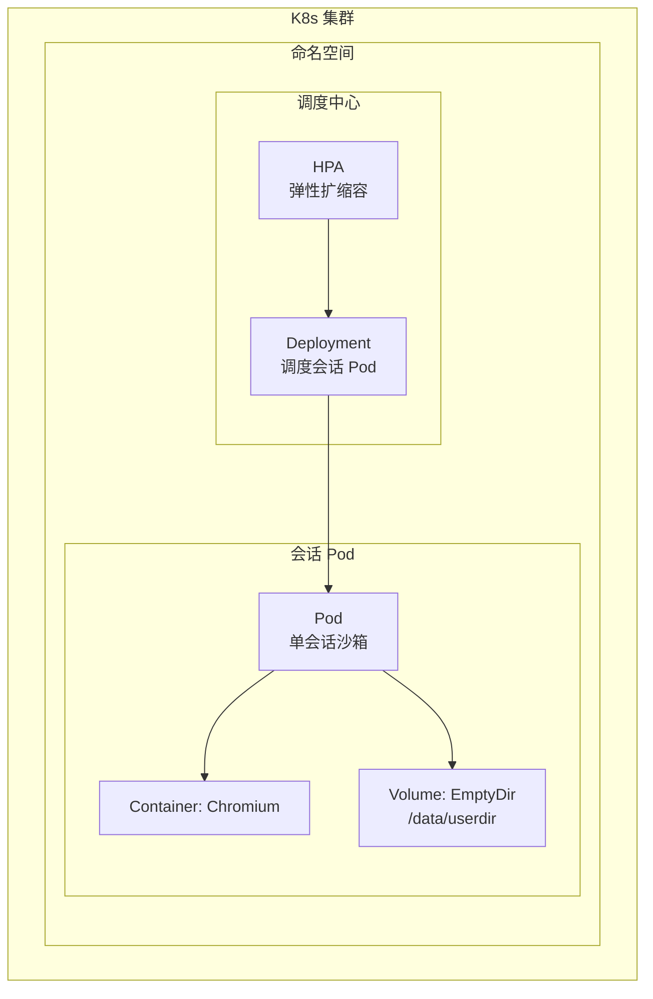

**图表来源**
- [project.md:905-918](file://project.md#L905-L918)
- [project.md:1450-1481](file://project.md#L1450-L1481)

**章节来源**
- [project.md:905-918](file://project.md#L905-L918)
- [project.md:1450-1481](file://project.md#L1450-L1481)

## 核心组件
- 会话 Pod 模板：定义资源限制、动态环境变量注入、EmptyDir 挂载路径
- HPA 控制器：基于任务队列长度（或 Pending 任务数）进行弹性扩缩容
- 生命周期钩子：启动前初始化隔离目录，销毁前终止 Chromium 进程并清理临时文件
- 强隔离策略：文件层、网络层、进程层、浏览器存储层、指纹层、插件层完全隔离
- 自动清理：Pod 删除即清空 EmptyDir，销毁后回收代理 IP、释放 CDP 端口、删除 UserData

**章节来源**
- [project.md:937-952](file://project.md#L937-L952)
- [project.md:967-979](file://project.md#L967-L979)
- [project.md:993-1007](file://project.md#L993-L1007)
- [project.md:1450-1481](file://project.md#L1450-L1481)

## 架构总览
K8s 生产形态下的会话 Pod 编排遵循“单会话 Pod 级强隔离 + 资源硬限制 + EmptyDir + HPA + 生命周期钩子”的整体设计。

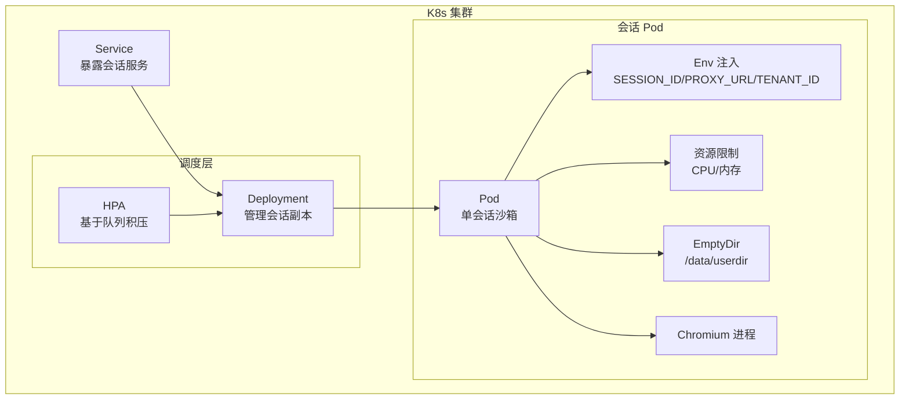

**图表来源**
- [project.md:905-918](file://project.md#L905-L918)
- [project.md:1450-1481](file://project.md#L1450-L1481)

## 详细组件分析

### 会话 Pod 模板设计
- Pod 名称：browser-sandbox-{sessionId}
- 镜像：custom-chromium:v1.0
- 资源限制：CPU 0.5~1 核，内存 1~2Gi
- 动态环境变量：
  - SESSION_ID：会话唯一标识
  - PROXY_URL：代理地址（独立出站 IP 绑定）
  - TENANT_ID：租户标识
- 存储：EmptyDir 挂载到 /data/userdir，用于 UserData、缓存、下载、扩展本地存储
- 网络：NetworkPolicy 隔离，Pod 间不可互相访问

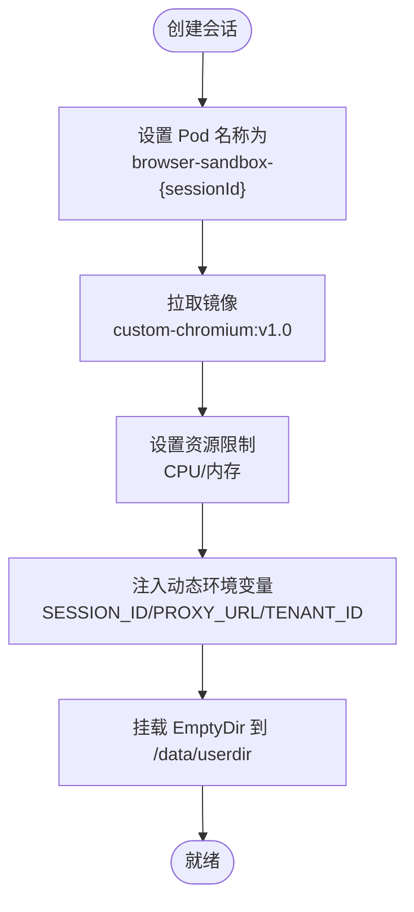

**图表来源**
- [project.md:1450-1481](file://project.md#L1450-L1481)

**章节来源**
- [project.md:1450-1481](file://project.md#L1450-L1481)

### 动态环境变量注入
- SESSION_ID：由调度中心分配，确保唯一性
- PROXY_URL：由代理池服务分配，保证独立出站 IP
- TENANT_ID：租户标识，用于数据强隔离与配额控制

注入方式建议：
- Deployment/StatefulSet 的 envFrom 或 valueFrom 从 ConfigMap/Secret/Downward API 注入
- 通过 Job/Argo/CI 管道在创建 Pod 时动态替换占位符

**章节来源**
- [project.md:967-971](file://project.md#L967-L971)

### EmptyDir 存储配置与自动清理
- 挂载路径：/data/userdir（与 Chromium UserData 目录对应）
- 生命周期：Pod 删除即清空，确保会话数据不残留
- 清理范围：UserData、缓存、下载目录、扩展本地存储

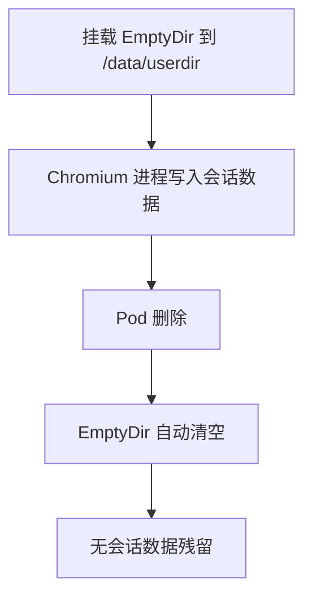

**图表来源**
- [project.md:913-913](file://project.md#L913-L913)
- [project.md:1475-1480](file://project.md#L1475-L1480)

**章节来源**
- [project.md:913-913](file://project.md#L913-L913)
- [project.md:1475-1480](file://project.md#L1475-L1480)

### HPA 弹性扩缩容逻辑
- 触发指标：任务队列积压（Pending 任务数）或等待执行的任务数
- 扩容策略：队列长度增长时自动增加 Pod 副本
- 缩容策略：队列长度降低且空闲 Pod 达到阈值时减少副本
- 资源上限：受集群资源与节点容量限制，避免过度扩容

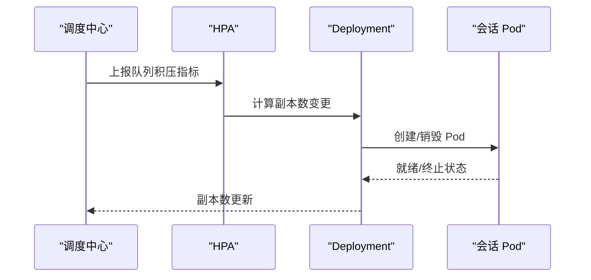

**图表来源**
- [project.md:915-915](file://project.md#L915-L915)

**章节来源**
- [project.md:915-915](file://project.md#L915-L915)

### Pod 生命周期钩子实现
- 启动前钩子（PreStart）：初始化隔离目录、准备会话运行所需文件
- 销毁前钩子（PreStop）：强制终止 Chromium 进程、清理临时文件、回收代理 IP、释放 CDP 端口

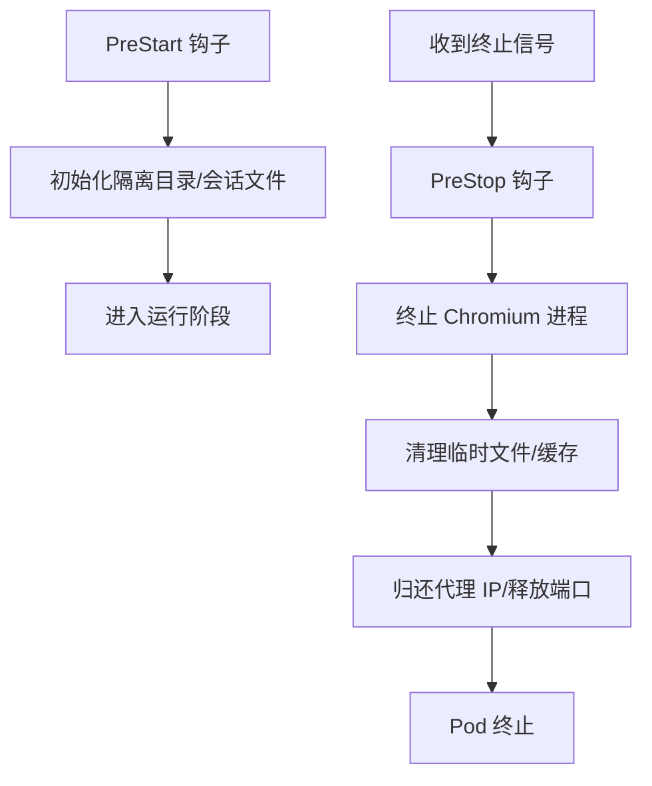

**图表来源**
- [project.md:977-977](file://project.md#L977-L977)

**章节来源**
- [project.md:977-977](file://project.md#L977-L977)

### 单会话 Pod 级别的强隔离
- 文件层：独立 UserData、磁盘缓存、下载目录、扩展本地存储
- 网络层：独立代理 IP、独立网络命名空间、独立 DNS 缓存
- 进程层：独立 Chromium 进程/Pod，崩溃不影响其他会话
- 浏览器存储：Cookie、LocalStorage、IndexedDB、SessionStorage 完全隔离
- 指纹层：随机独立 UA、WebGL、Canvas、Audio、时区、分辨率、字体列表
- 插件层：每个会话加载独立 V3 扩展实例，存储互不互通

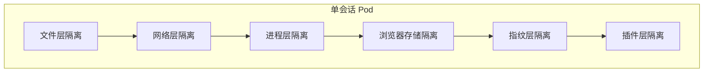

**图表来源**
- [project.md:993-1007](file://project.md#L993-L1007)

**章节来源**
- [project.md:993-1007](file://project.md#L993-L1007)

### 资源硬限制与自动清理机制
- 资源硬限制：CPU 0.5~1 核，内存 1~2Gi，避免资源抢占
- 自动清理：Pod 删除即清空 EmptyDir，销毁后回收代理 IP、释放 CDP 端口、删除 UserData 目录
- 超时与崩溃：达到最大存活时长或连续崩溃自动销毁，保障集群稳定性

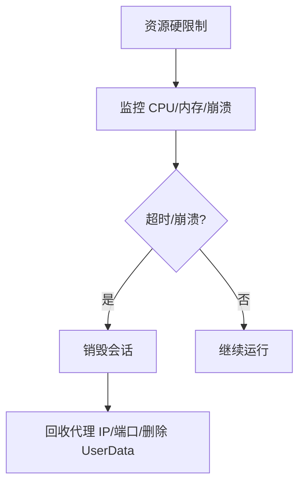

**图表来源**
- [project.md:987-989](file://project.md#L987-L989)

**章节来源**
- [project.md:987-989](file://project.md#L987-L989)

## 依赖关系分析
- 调度中心（Deployment/HPA）依赖任务队列指标
- 会话 Pod 依赖代理池服务提供独立出站 IP
- Chromium 进程依赖 EmptyDir 存储 UserData 与缓存
- 生命周期钩子依赖系统命令终止进程与清理文件

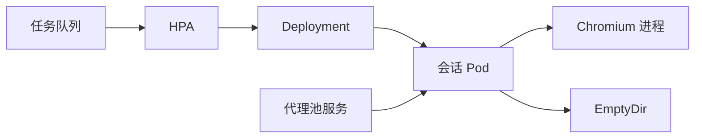

**图表来源**
- [project.md:915-915](file://project.md#L915-L915)
- [project.md:1450-1481](file://project.md#L1450-L1481)

**章节来源**
- [project.md:915-915](file://project.md#L915-L915)
- [project.md:1450-1481](file://project.md#L1450-L1481)

## 性能考量
- 会话创建耗时：集群 K8s 环境 ≤3s，单机进程模式 ≤1s
- 单集群稳定并发会话：最低支持 200 个，长期运行无持续内存泄漏
- API 网关单接口 QPS ≥100，WebSocket 长连接同时在线 ≥1000 路
- CDP 页面操作指令延迟 ≤200ms

**章节来源**
- [project.md:1222-1232](file://project.md#L1222-L1232)

## 故障排查指南
- 浏览器崩溃恢复：后端实现检查浏览器存活并在异常时恢复会话，确保任务继续执行
- 会话销毁触发：达到最大存活时长、内存超限、页面连续崩溃 3 次
- 自愈重试：CDP 断开、代理网络超时自动重试 2 次，失败后销毁并上报异常
- 前端登录与设备标识：Tauri 设备标识持久化，前端登录状态持久化，辅助定位会话问题

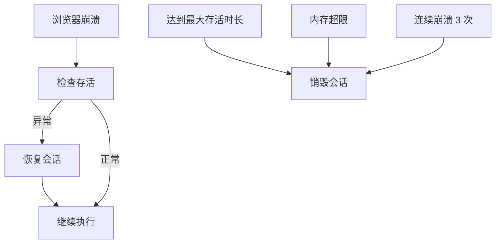

**图表来源**
- [executor.py:42-69](file://CCC_RPA_API/app/services/executor.py#L42-L69)
- [session_manager.py:147-170](file://CCC_RPA_API/app/browser/session_manager.py#L147-L170)
- [project.md:987-991](file://project.md#L987-L991)

**章节来源**
- [executor.py:42-69](file://CCC_RPA_API/app/services/executor.py#L42-L69)
- [session_manager.py:147-170](file://CCC_RPA_API/app/browser/session_manager.py#L147-L170)
- [project.md:987-991](file://project.md#L987-L991)
- [device.rs:1-31](file://CCC-BrowserV4/src-tauri/src/device.rs#L1-L31)
- [auth.ts:1-78](file://CCC-BrowserV4/frontend/src/stores/auth.ts#L1-L78)

## 结论
本设计以“单会话 Pod 级强隔离”为核心，结合资源硬限制、EmptyDir 存储、HPA 弹性扩缩容与生命周期钩子，形成可落地的 K8s 编排方案。通过统一的环境变量注入、严格的销毁与清理机制以及完善的自愈策略，可在商用生产环境中稳定运行大规模会话并发，满足隔离、性能与可靠性要求。

## 附录

### A. Pod 模板（YAML 示例）
- 名称：browser-sandbox-{sessionId}
- 镜像：custom-chromium:v1.0
- 资源：limits.cpu=1, limits.memory=2Gi, requests.cpu=0.5, requests.memory=1Gi
- 环境变量：SESSION_ID、PROXY_URL、TENANT_ID
- 存储：EmptyDir 挂载到 /data/userdir

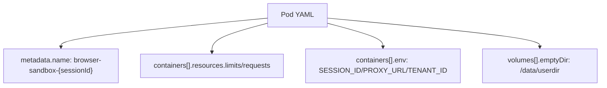

**图表来源**
- [project.md:1450-1481](file://project.md#L1450-L1481)

**章节来源**
- [project.md:1450-1481](file://project.md#L1450-L1481)

### B. HPA 配置建议
- 指标：任务队列积压（Pending 任务数）或等待执行任务数
- 目标：副本数随队列长度线性/阶梯式增长
- 下限/上限：结合集群容量与节点资源设定

**章节来源**
- [project.md:915-915](file://project.md#L915-L915)

### C. 生命周期钩子实现要点
- PreStart：准备隔离目录、会话文件
- PreStop：终止 Chromium 进程、清理临时文件、回收代理 IP、释放 CDP 端口

**章节来源**
- [project.md:977-977](file://project.md#L977-L977)

### D. 强隔离与安全基线
- 隔离维度：文件、网络、进程、浏览器存储、指纹、插件
- 传输安全：TLS 加密（HTTPS/GRPC wss）
- 存储安全：会话快照与登录数据 AES-256-CBC 加密
- 审计安全：全链路日志留存，不可删除篡改

**章节来源**
- [project.md:1234-1246](file://project.md#L1234-L1246)
- [project.md:993-1007](file://project.md#L993-L1007)