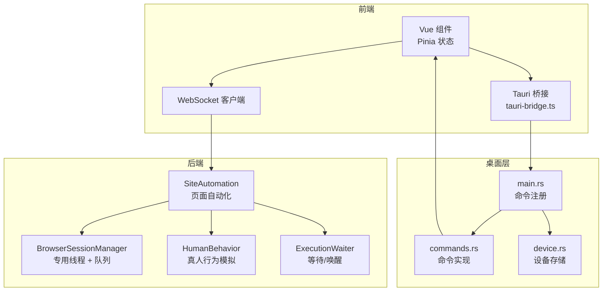
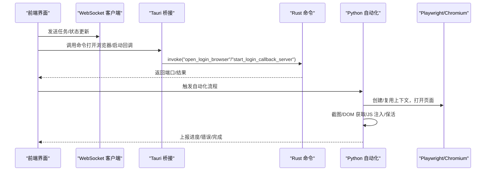
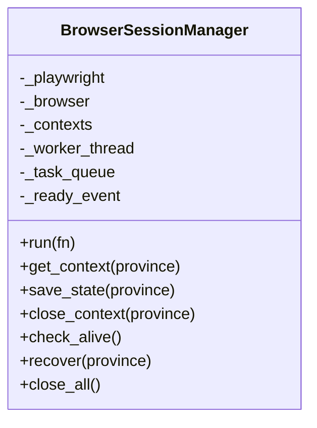
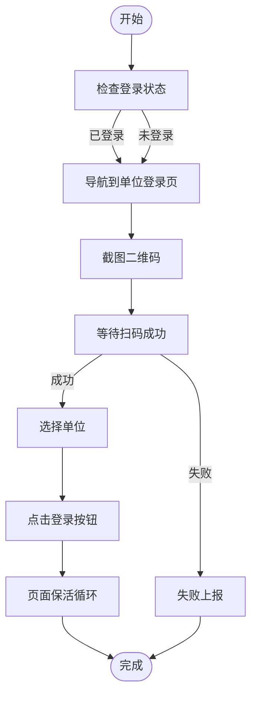
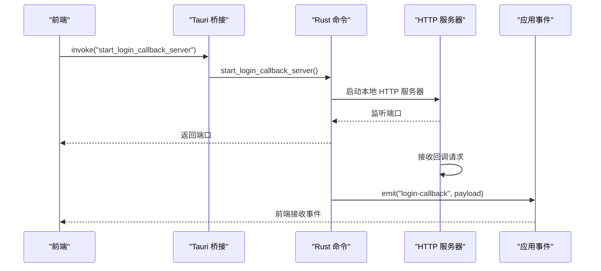
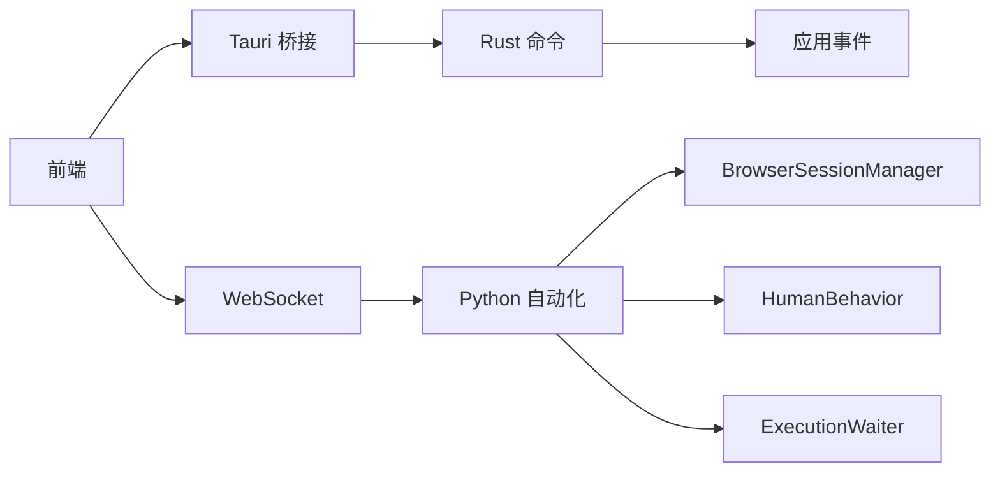

# Playwright Core CDP 封装

<cite>
**本文档引用的文件**
- [session_manager.py](file://CCC_RPA_API/app/browser/session_manager.py)
- [site_automation.py](file://CCC_RPA_API/app/browser/site_automation.py)
- [human_behavior.py](file://CCC_RPA_API/app/browser/human_behavior.py)
- [waiter.py](file://CCC_RPA_API/app/browser/waiter.py)
- [commands.rs](file://CCC-BrowserV4/src-tauri/src/commands.rs)
- [device.rs](file://CCC-BrowserV4/src-tauri/src/device.rs)
- [main.rs](file://CCC-BrowserV4/src-tauri/src/main.rs)
- [tauri-bridge.ts](file://CCC-BrowserV4/frontend/src/utils/tauri-bridge.ts)
- [execution.ts](file://CCC-BrowserV4/frontend/src/stores/execution.ts)
</cite>

## 目录
1. [简介](#简介)
2. [项目结构](#项目结构)
3. [核心组件](#核心组件)
4. [架构总览](#架构总览)
5. [详细组件分析](#详细组件分析)
6. [依赖关系分析](#依赖关系分析)
7. [性能考虑](#性能考虑)
8. [故障排查指南](#故障排查指南)
9. [结论](#结论)

## 简介
本文件面向 Playwright Core CDP 封装的技术实现，聚焦以下目标：
- 轻量化 Playwright Core 设计理念：以最小依赖、线程安全、可恢复为核心。
- CDP 长连接通信封装：通过专用工作线程承载 Chromium 实例，统一调度页面生命周期与指令执行。
- 基础 CDP 指令实现：页面打开/关闭、截图、DOM 获取、请求拦截、自定义 JS 注入。
- 动态配置能力：会话指纹（UA/视口）、代理、存储隔离参数的注入与持久化。
- 异常捕获与回调上报：进程崩溃、CDP 断连、浏览器关闭等异常的识别与上报。

## 项目结构
系统采用前后端分离与嵌入式桌面桥接相结合的方式：
- 后端 Python（FastAPI/同步 Playwright）：负责浏览器会话管理、页面自动化、异常处理与状态持久化。
- 前端 Vue + Pinia + Tauri：负责用户交互、状态管理、与桌面层的命令桥接。
- 桌面层 Rust（Tauri）：提供设备标识、外部浏览器打开、登录回调 HTTP 服务器等原生能力。

**图表来源**
- [main.rs:7-28](file://CCC-BrowserV4/src-tauri/src/main.rs#L7-L28)
- [commands.rs:10-91](file://CCC-BrowserV4/src-tauri/src/commands.rs#L10-L91)
- [device.rs:5-31](file://CCC-BrowserV4/src-tauri/src/device.rs#L5-L31)
- [tauri-bridge.ts:6-32](file://CCC-BrowserV4/frontend/src/utils/tauri-bridge.ts#L6-L32)
- [session_manager.py:30-96](file://CCC_RPA_API/app/browser/session_manager.py#L30-L96)
- [site_automation.py:16-743](file://CCC_RPA_API/app/browser/site_automation.py#L16-L743)
- [human_behavior.py:12-86](file://CCC_RPA_API/app/browser/human_behavior.py#L12-L86)
- [waiter.py:7-84](file://CCC_RPA_API/app/browser/waiter.py#L7-L84)

**章节来源**
- [main.rs:7-28](file://CCC-BrowserV4/src-tauri/src/main.rs#L7-L28)
- [commands.rs:10-91](file://CCC-BrowserV4/src-tauri/src/commands.rs#L10-L91)
- [device.rs:5-31](file://CCC-BrowserV4/src-tauri/src/device.rs#L5-L31)
- [tauri-bridge.ts:6-32](file://CCC-BrowserV4/frontend/src/utils/tauri-bridge.ts#L6-L32)
- [session_manager.py:30-96](file://CCC_RPA_API/app/browser/session_manager.py#L30-L96)
- [site_automation.py:16-743](file://CCC_RPA_API/app/browser/site_automation.py#L16-L743)
- [human_behavior.py:12-86](file://CCC_RPA_API/app/browser/human_behavior.py#L12-L86)
- [waiter.py:7-84](file://CCC_RPA_API/app/browser/waiter.py#L7-L84)

## 核心组件
- BrowserSessionManager：轻量化核心，确保单实例 Chromium 在专用线程中运行，提供上下文池化、状态持久化、断连恢复与统一调度。
- SiteAutomation：基于 Playwright 的页面自动化编排，包含登录、单位选择、截图、DOM 提取、保活等流程。
- HumanBehavior：真人行为模拟，降低被风控概率。
- ExecutionWaiter：基于 Event 的执行暂停/恢复机制，支持取消与超时。
- Tauri 命令层：设备标识、外部浏览器打开、登录回调 HTTP 服务器，与前端桥接。

**章节来源**
- [session_manager.py:10-186](file://CCC_RPA_API/app/browser/session_manager.py#L10-L186)
- [site_automation.py:16-743](file://CCC_RPA_API/app/browser/site_automation.py#L16-L743)
- [human_behavior.py:12-86](file://CCC_RPA_API/app/browser/human_behavior.py#L12-L86)
- [waiter.py:7-84](file://CCC_RPA_API/app/browser/waiter.py#L7-L84)
- [commands.rs:10-91](file://CCC-BrowserV4/src-tauri/src/commands.rs#L10-L91)

## 架构总览
下图展示从前端到桌面层再到后端的调用链路与数据流：

**图表来源**
- [tauri-bridge.ts:6-32](file://CCC-BrowserV4/frontend/src/utils/tauri-bridge.ts#L6-L32)
- [commands.rs:32-91](file://CCC-BrowserV4/src-tauri/src/commands.rs#L32-L91)
- [site_automation.py:38-58](file://CCC_RPA_API/app/browser/site_automation.py#L38-L58)
- [session_manager.py:98-126](file://CCC_RPA_API/app/browser/session_manager.py#L98-L126)

## 详细组件分析

### BrowserSessionManager：轻量化 Playwright 核心
- 设计理念
  - 专用工作线程：避免主线程与 Playwright 的异步事件循环冲突，统一串行执行所有浏览器操作。
  - 上下文池化：按“省份”维度维护 BrowserContext，自动恢复与失效检测。
  - 存储隔离：通过 storage_state 文件实现会话持久化，支持跨进程重启恢复。
- 关键能力
  - run(fn)：将任意可调用对象投递到工作线程执行，阻塞等待结果或超时。
  - get_context(province)：按需创建或复用上下文，注入去检测脚本与 UA/视口。
  - save_state/close_context/recover/close_all：生命周期管理与恢复。
  - check_alive：健康检查，快速判断浏览器是否存活。
- CDP 长连接封装
  - Chromium 实例在工作线程启动，所有页面与 CDP 通道在该进程中管理，避免跨进程通信复杂度。
  - 通过 add_init_script 注入 navigator.webdriver 隐藏，减少被检测风险。

**图表来源**
- [session_manager.py:10-186](file://CCC_RPA_API/app/browser/session_manager.py#L10-L186)

**章节来源**
- [session_manager.py:10-186](file://CCC_RPA_API/app/browser/session_manager.py#L10-L186)

### SiteAutomation：页面自动化编排
- 登录流程
  - 检查登录状态 → 导航到单位登录页（直连/首页 JS 强制点击）→ 截图二维码 → 等待扫码 → 成功后进入业务页。
- 单位选择
  - 多选择器降级策略 + JS 回退，支持按名称、data-id、索引等多种匹配方式；点击后尝试定位“登录”按钮并触发跳转。
- 数据采集
  - 抓取单位列表：多选择器遍历 + 文本正则提取 + 降级策略；严格模式下失败抛错，不使用模拟数据。
- 页面保活
  - 随机滚动/点击刷新/随机移动/等待，避免超时被回收；可在当前页执行轻量保活，不触发导航。
- 异常识别
  - _is_browser_closed_error：识别浏览器/页面已关闭的错误，及时中断并上抛。

**图表来源**
- [site_automation.py:38-192](file://CCC_RPA_API/app/browser/site_automation.py#L38-L192)
- [site_automation.py:294-541](file://CCC_RPA_API/app/browser/site_automation.py#L294-L541)
- [site_automation.py:557-681](file://CCC_RPA_API/app/browser/site_automation.py#L557-L681)

**章节来源**
- [site_automation.py:16-743](file://CCC_RPA_API/app/browser/site_automation.py#L16-L743)

### HumanBehavior：真人行为模拟
- 随机延迟、鼠标移动、键盘输入、滚动等，降低被风控概率。
- 所有操作均在后台线程执行，避免与事件循环冲突。

**章节来源**
- [human_behavior.py:12-86](file://CCC_RPA_API/app/browser/human_behavior.py#L12-L86)

### ExecutionWaiter：执行控制与信号
- 提供阻塞等待、唤醒、取消、非阻塞检查与资源清理。
- 支持保活循环等长周期任务的中断与恢复。

**章节来源**
- [waiter.py:7-84](file://CCC_RPA_API/app/browser/waiter.py#L7-L84)

### Tauri 命令层：桌面桥接
- 设备标识：首次运行生成 UUID 并持久化，后续读取。
- 外部浏览器打开：通过系统默认浏览器打开登录 URL。
- 登录回调服务器：启动本地 HTTP 服务器监听随机端口，解析回调参数并通过事件通知前端。

**图表来源**
- [commands.rs:41-91](file://CCC-BrowserV4/src-tauri/src/commands.rs#L41-L91)
- [device.rs:5-31](file://CCC-BrowserV4/src-tauri/src/device.rs#L5-L31)
- [tauri-bridge.ts:6-32](file://CCC-BrowserV4/frontend/src/utils/tauri-bridge.ts#L6-L32)

**章节来源**
- [commands.rs:10-91](file://CCC-BrowserV4/src-tauri/src/commands.rs#L10-L91)
- [device.rs:5-31](file://CCC-BrowserV4/src-tauri/src/device.rs#L5-L31)
- [tauri-bridge.ts:6-32](file://CCC-BrowserV4/frontend/src/utils/tauri-bridge.ts#L6-L32)

## 依赖关系分析
- 组件耦合
  - SiteAutomation 依赖 BrowserSessionManager（上下文/页面）、HumanBehavior（行为模拟）、ExecutionWaiter（等待控制）。
  - 前端通过 Tauri 桥接调用 Rust 命令，Rust 命令与前端通过事件通信。
- 外部依赖
  - Playwright（Chromium）、Tauri 插件（shell/store/opener）、tiny_http（回调服务器）。
- 循环依赖
  - 无直接循环依赖，职责清晰：前端桥接 → 桌面命令 → 后端自动化。

**图表来源**
- [tauri-bridge.ts:6-32](file://CCC-BrowserV4/frontend/src/utils/tauri-bridge.ts#L6-L32)
- [commands.rs:10-91](file://CCC-BrowserV4/src-tauri/src/commands.rs#L10-L91)
- [site_automation.py:16-743](file://CCC_RPA_API/app/browser/site_automation.py#L16-L743)
- [session_manager.py:10-186](file://CCC_RPA_API/app/browser/session_manager.py#L10-L186)
- [human_behavior.py:12-86](file://CCC_RPA_API/app/browser/human_behavior.py#L12-L86)
- [waiter.py:7-84](file://CCC_RPA_API/app/browser/waiter.py#L7-L84)

**章节来源**
- [tauri-bridge.ts:6-32](file://CCC-BrowserV4/frontend/src/utils/tauri-bridge.ts#L6-L32)
- [commands.rs:10-91](file://CCC-BrowserV4/src-tauri/src/commands.rs#L10-L91)
- [site_automation.py:16-743](file://CCC_RPA_API/app/browser/site_automation.py#L16-L743)
- [session_manager.py:10-186](file://CCC_RPA_API/app/browser/session_manager.py#L10-L186)
- [human_behavior.py:12-86](file://CCC_RPA_API/app/browser/human_behavior.py#L12-L86)
- [waiter.py:7-84](file://CCC_RPA_API/app/browser/waiter.py#L7-L84)

## 性能考虑
- 专用线程 + 队列：避免多线程竞争与事件循环冲突，提升稳定性与吞吐。
- 上下文池化：按省份隔离，减少重复启动成本；失效自动重建。
- 截图与 DOM 获取：采用降级策略与局部元素截图，减少 IO 与渲染压力。
- 保活策略：随机性与时序控制，平衡页面活性与资源消耗。
- 异常早发现：通过错误字符串匹配快速识别浏览器/页面关闭，避免无效重试。

## 故障排查指南
- 浏览器/页面已关闭
  - 现象：操作抛出包含特定关键词的异常。
  - 处理：识别后立即中断，触发恢复流程或上报。
  - 参考路径：[_is_browser_closed_error:10-13](file://CCC_RPA_API/app/browser/site_automation.py#L10-L13)
- Playwright 初始化失败
  - 现象：工作线程未就绪或超时。
  - 处理：检查 headless 参数、沙箱参数与依赖环境；必要时重启服务。
  - 参考路径：[run:80-96](file://CCC_RPA_API/app/browser/session_manager.py#L80-L96)
- 会话状态丢失
  - 现象：重启后未恢复登录。
  - 处理：确认 storage_state 文件存在与可读；检查保存/加载逻辑。
  - 参考路径：[save_state/get_context:129-135](file://CCC_RPA_API/app/browser/session_manager.py#L129-L135)
- 登录回调未到达前端
  - 现象：扫码成功但前端未收到事件。
  - 处理：确认回调服务器端口、事件名与前端监听；检查 tiny_http 响应。
  - 参考路径：[start_login_callback_server:41-91](file://CCC-BrowserV4/src-tauri/src/commands.rs#L41-L91)
- 设备标识缺失
  - 现象：首次运行未生成 device_id。
  - 处理：检查 store 初始化与保存流程。
  - 参考路径：[init_device_store/get_device_id:5-31](file://CCC-BrowserV4/src-tauri/src/device.rs#L5-L31)

**章节来源**
- [site_automation.py:10-13](file://CCC_RPA_API/app/browser/site_automation.py#L10-L13)
- [session_manager.py:80-96](file://CCC_RPA_API/app/browser/session_manager.py#L80-L96)
- [session_manager.py:129-135](file://CCC_RPA_API/app/browser/session_manager.py#L129-L135)
- [commands.rs:41-91](file://CCC-BrowserV4/src-tauri/src/commands.rs#L41-L91)
- [device.rs:5-31](file://CCC-BrowserV4/src-tauri/src/device.rs#L5-L31)

## 结论
本实现以 BrowserSessionManager 为核心，结合 SiteAutomation 的页面编排与 HumanBehavior 的真人行为模拟，构建了稳定、可恢复、可扩展的轻量化 Playwright CDP 封装。通过专用线程与上下文池化，有效降低了多线程与事件循环冲突带来的风险；通过存储隔离与断连恢复，提升了会话连续性与鲁棒性。配合 Tauri 的桌面桥接能力，实现了从扫码登录到业务执行的完整闭环，并提供了完善的异常捕获与回调上报机制。