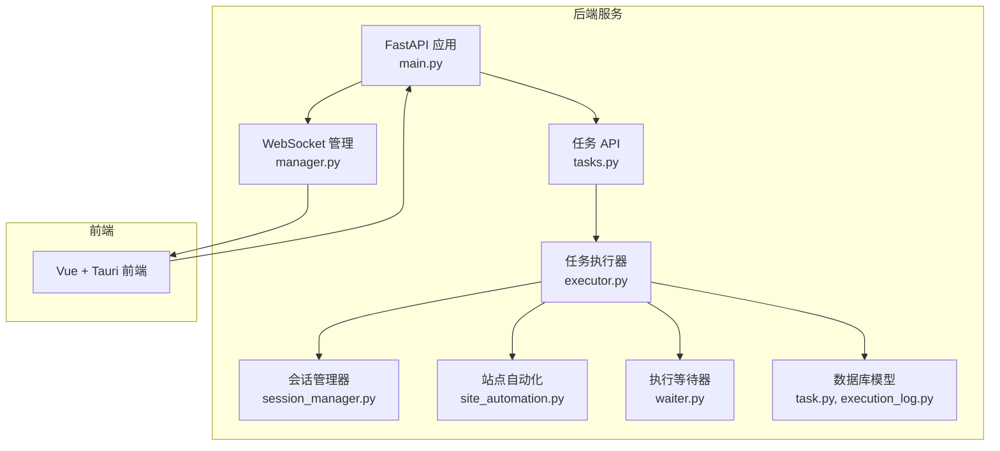
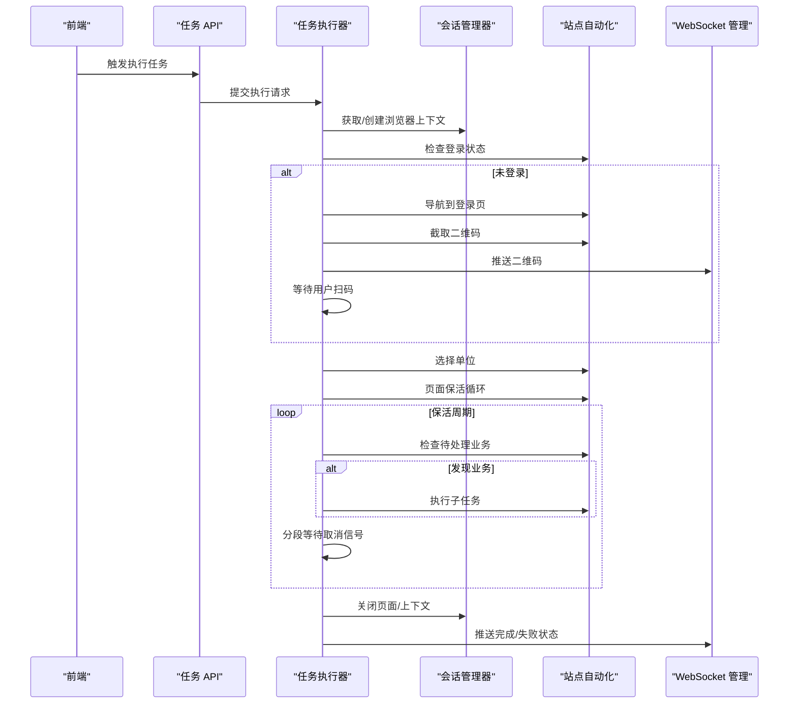
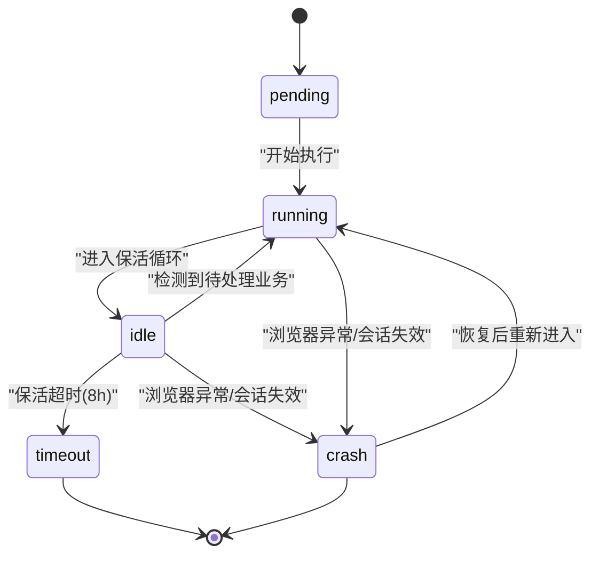
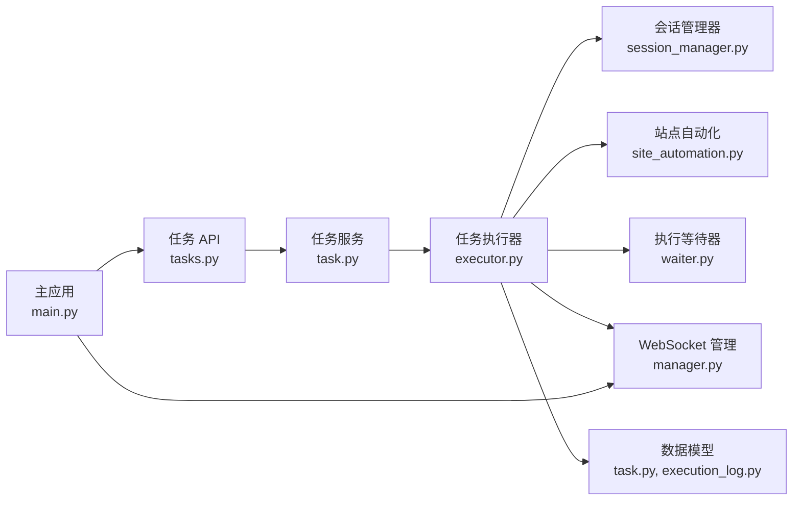

# 会话生命周期管理

<cite>
**本文档引用的文件**
- [session_manager.py](file://CCC_RPA_API/app/browser/session_manager.py)
- [executor.py](file://CCC_RPA_API/app/services/executor.py)
- [site_automation.py](file://CCC_RPA_API/app/browser/site_automation.py)
- [waiter.py](file://CCC_RPA_API/app/browser/waiter.py)
- [manager.py](file://CCC_RPA_API/app/ws/manager.py)
- [task.py](file://CCC_RPA_API/app/models/task.py)
- [execution_log.py](file://CCC_RPA_API/app/models/execution_log.py)
- [tasks.py](file://CCC_RPA_API/app/api/tasks.py)
- [main.py](file://CCC_RPA_API/app/main.py)
- [human_behavior.py](file://CCC_RPA_API/app/browser/human_behavior.py)
</cite>

## 目录
1. [简介](#简介)
2. [项目结构](#项目结构)
3. [核心组件](#核心组件)
4. [架构总览](#架构总览)
5. [详细组件分析](#详细组件分析)
6. [依赖关系分析](#依赖关系分析)
7. [性能考虑](#性能考虑)
8. [故障排除指南](#故障排除指南)
9. [结论](#结论)

## 简介
本文件针对会话生命周期管理进行深入的技术文档说明，涵盖会话状态机设计（pending→running→idle→timeout→crash）、创建前置校验逻辑、销毁触发条件与执行流程，并解释会话调度中心、资源分配、状态同步与异常处理机制。文档同时提供状态转换图、错误处理策略与性能监控指标建议，帮助开发者与运维人员快速理解并维护该系统。

## 项目结构
本项目采用前后端分离架构，后端基于 FastAPI 提供 API 服务，前端基于 Vue + Tauri 构建桌面应用。会话生命周期管理主要集中在后端的浏览器会话管理器、任务执行器与站点自动化模块中。

图表来源
- [main.py:30-127](file://CCC_RPA_API/app/main.py#L30-L127)
- [tasks.py:1-76](file://CCC_RPA_API/app/api/tasks.py#L1-L76)
- [executor.py:1-319](file://CCC_RPA_API/app/services/executor.py#L1-L319)
- [session_manager.py:1-186](file://CCC_RPA_API/app/browser/session_manager.py#L1-L186)
- [site_automation.py:1-743](file://CCC_RPA_API/app/browser/site_automation.py#L1-L743)
- [waiter.py:1-84](file://CCC_RPA_API/app/browser/waiter.py#L1-L84)
- [task.py:1-25](file://CCC_RPA_API/app/models/task.py#L1-L25)
- [execution_log.py:1-17](file://CCC_RPA_API/app/models/execution_log.py#L1-L17)
- [manager.py:1-29](file://CCC_RPA_API/app/ws/manager.py#L1-L29)

章节来源
- [main.py:30-127](file://CCC_RPA_API/app/main.py#L30-L127)
- [tasks.py:1-76](file://CCC_RPA_API/app/api/tasks.py#L1-L76)

## 核心组件
- 会话管理器：负责 Playwright 浏览器实例与上下文的生命周期管理，确保线程安全与状态持久化。
- 任务执行器：协调浏览器操作、用户交互等待、业务执行与状态同步。
- 站点自动化：封装具体网站的自动化操作，包括登录、单位选择、业务保活等。
- 执行等待器：提供任务执行过程中的阻塞/唤醒机制，支持取消与超时控制。
- WebSocket 管理：向前端推送执行进度、二维码、错误信息与任务状态更新。
- 数据模型：定义任务与执行日志的数据结构，支撑状态持久化与查询。

章节来源
- [session_manager.py:10-186](file://CCC_RPA_API/app/browser/session_manager.py#L10-L186)
- [executor.py:1-319](file://CCC_RPA_API/app/services/executor.py#L1-L319)
- [site_automation.py:16-743](file://CCC_RPA_API/app/browser/site_automation.py#L16-L743)
- [waiter.py:7-84](file://CCC_RPA_API/app/browser/waiter.py#L7-L84)
- [manager.py:5-29](file://CCC_RPA_API/app/ws/manager.py#L5-L29)
- [task.py:8-25](file://CCC_RPA_API/app/models/task.py#L8-L25)
- [execution_log.py:7-17](file://CCC_RPA_API/app/models/execution_log.py#L7-L17)

## 架构总览
会话生命周期管理围绕“任务驱动 + 会话隔离 + 状态同步”的核心思想构建。任务执行器在专用线程池中调度浏览器操作，通过会话管理器保证浏览器实例与上下文的稳定运行；站点自动化模块封装具体业务流程；执行等待器提供用户交互与取消控制；WebSocket 管理器负责实时状态同步；数据库模型持久化任务与执行日志。

图表来源
- [tasks.py:47-52](file://CCC_RPA_API/app/api/tasks.py#L47-L52)
- [executor.py:78-315](file://CCC_RPA_API/app/services/executor.py#L78-L315)
- [session_manager.py:98-144](file://CCC_RPA_API/app/browser/session_manager.py#L98-L144)
- [site_automation.py:38-743](file://CCC_RPA_API/app/browser/site_automation.py#L38-L743)
- [manager.py:17-27](file://CCC_RPA_API/app/ws/manager.py#L17-L27)

## 详细组件分析

### 会话状态机设计
会话状态机覆盖以下状态流转：
- pending：任务创建后初始状态，等待执行。
- running：任务开始执行，浏览器上下文已准备，进入登录与业务流程。
- idle：任务处于保活状态，等待业务触发或用户取消。
- timeout：保活超时（默认8小时），自动结束任务。
- crash：浏览器异常或会话失效，触发恢复流程。

图表来源
- [executor.py:208-267](file://CCC_RPA_API/app/services/executor.py#L208-L267)
- [session_manager.py:147-170](file://CCC_RPA_API/app/browser/session_manager.py#L147-L170)

章节来源
- [executor.py:208-267](file://CCC_RPA_API/app/services/executor.py#L208-L267)
- [session_manager.py:147-170](file://CCC_RPA_API/app/browser/session_manager.py#L147-L170)

### 创建前置校验逻辑
- 浏览器实例检查：执行器在每次浏览器操作前检查浏览器连接状态，若断开则抛出异常并触发恢复流程。
- 上下文有效性验证：获取上下文时验证其存活状态，若失效则删除并重建。
- 登录状态检查：在执行业务前检查登录状态，未登录则引导扫码登录并保存状态。
- 存储状态持久化：登录成功后保存 storage_state，以便后续复用。

章节来源
- [executor.py:35-69](file://CCC_RPA_API/app/services/executor.py#L35-L69)
- [session_manager.py:98-126](file://CCC_RPA_API/app/browser/session_manager.py#L98-L126)
- [site_automation.py:38-58](file://CCC_RPA_API/app/browser/site_automation.py#L38-L58)

### 销毁触发条件与执行流程
- 显式销毁：任务完成后关闭页面与上下文，释放资源。
- 异常销毁：浏览器异常或会话失效时，触发恢复流程并重建上下文。
- 超时销毁：保活超过最大时长（默认8小时）自动结束任务。
- 清理资源：执行器在 finally 中清理等待器与数据库连接，确保资源回收。

章节来源
- [executor.py:268-315](file://CCC_RPA_API/app/services/executor.py#L268-L315)
- [session_manager.py:137-186](file://CCC_RPA_API/app/browser/session_manager.py#L137-L186)
- [waiter.py:79-84](file://CCC_RPA_API/app/browser/waiter.py#L79-L84)

### 会话调度中心
- 专用工作线程：会话管理器启动专用线程承载 Playwright 操作，避免与 FastAPI 事件循环冲突。
- 任务队列：通过队列接收任务，线程内循环执行，保证顺序与一致性。
- 幂等初始化：确保浏览器实例只初始化一次，避免重复启动。
- 超时与异常处理：任务执行设置超时时间，异常被捕获并向上抛出，便于上层处理。

章节来源
- [session_manager.py:30-96](file://CCC_RPA_API/app/browser/session_manager.py#L30-L96)

### 资源分配
- 浏览器实例：全局共享，按省份隔离上下文，减少资源消耗。
- 上下文隔离：每个省份维护独立上下文，避免跨会话状态污染。
- 线程池：任务执行器与等待器分别使用独立线程池，避免阻塞。
- 存储状态：通过 storage_state 文件持久化登录状态，提升复用效率。

章节来源
- [session_manager.py:15-23](file://CCC_RPA_API/app/browser/session_manager.py#L15-L23)
- [executor.py:18-19](file://CCC_RPA_API/app/services/executor.py#L18-L19)

### 状态同步与异常处理机制
- WebSocket 广播：执行器在关键节点推送执行进度、二维码、错误信息与任务状态更新。
- 用户交互：通过执行等待器实现扫码与单位选择的阻塞等待，支持取消与超时。
- 异常恢复：检测浏览器异常时，广播恢复提示并重建上下文，尽量减少人工干预。
- 日志记录：数据库记录任务执行日志，包含开始/结束时间、状态与结果消息。

章节来源
- [executor.py:22-33](file://CCC_RPA_API/app/services/executor.py#L22-L33)
- [executor.py:42-69](file://CCC_RPA_API/app/services/executor.py#L42-L69)
- [tasks.py:60-75](file://CCC_RPA_API/app/api/tasks.py#L60-L75)
- [execution_log.py:7-17](file://CCC_RPA_API/app/models/execution_log.py#L7-L17)

## 依赖关系分析

图表来源
- [tasks.py:1-76](file://CCC_RPA_API/app/api/tasks.py#L1-L76)
- [task.py:1-25](file://CCC_RPA_API/app/models/task.py#L1-L25)
- [execution_log.py:1-17](file://CCC_RPA_API/app/models/execution_log.py#L1-L17)
- [executor.py:1-319](file://CCC_RPA_API/app/services/executor.py#L1-L319)
- [session_manager.py:1-186](file://CCC_RPA_API/app/browser/session_manager.py#L1-L186)
- [site_automation.py:1-743](file://CCC_RPA_API/app/browser/site_automation.py#L1-L743)
- [waiter.py:1-84](file://CCC_RPA_API/app/browser/waiter.py#L1-L84)
- [manager.py:1-29](file://CCC_RPA_API/app/ws/manager.py#L1-L29)
- [main.py:1-127](file://CCC_RPA_API/app/main.py#L1-L127)

章节来源
- [tasks.py:1-76](file://CCC_RPA_API/app/api/tasks.py#L1-L76)
- [executor.py:1-319](file://CCC_RPA_API/app/services/executor.py#L1-L319)

## 性能考虑
- 线程隔离：浏览器操作在专用线程中执行，避免阻塞主线程与事件循环。
- 保活策略：采用随机滚动、鼠标移动、键盘 Tab 等轻量操作，降低页面跳转与网络开销。
- 选择器降级：站点自动化提供多级选择器策略，提高稳定性与成功率。
- 超时与重试：合理设置超时时间与重试策略，平衡可靠性与性能。
- 资源复用：通过 storage_state 持久化登录状态，减少重复登录成本。

## 故障排除指南
- 浏览器初始化失败：检查专用线程是否正常启动，确认 Chromium 参数与权限配置。
- 会话失效：启用恢复流程，广播恢复提示并重建上下文与页面。
- 扫码超时：检查前端 WebSocket 连接与后端广播通道，确认用户交互流程。
- 业务执行异常：查看站点自动化日志与页面截图，定位选择器与页面结构变化。
- 资源泄漏：确保任务结束后正确关闭页面与上下文，清理等待器与数据库连接。

章节来源
- [session_manager.py:30-77](file://CCC_RPA_API/app/browser/session_manager.py#L30-L77)
- [executor.py:286-315](file://CCC_RPA_API/app/services/executor.py#L286-L315)
- [site_automation.py:10-14](file://CCC_RPA_API/app/browser/site_automation.py#L10-L14)

## 结论
会话生命周期管理通过“专用线程 + 上下文隔离 + 状态同步 + 异常恢复”的设计，实现了稳定可靠的自动化执行流程。系统在保证用户体验的同时，提供了完善的监控与恢复能力，适合长期运行的 RPA 场景。建议持续优化选择器策略与保活算法，以应对目标站点的频繁更新。