# Agent B 控制层&业务网关开发

<cite>
**本文档引用的文件**
- [main.py](file://CCC_RPA_API/app/main.py)
- [config.py](file://CCC_RPA_API/app/config.py)
- [tasks.py](file://CCC_RPA_API/app/api/tasks.py)
- [tenants.py](file://CCC_RPA_API/app/api/tenants.py)
- [devices.py](file://CCC_RPA_API/app/api/devices.py)
- [manager.py](file://CCC_RPA_API/app/ws/manager.py)
- [task.py](file://CCC_RPA_API/app/models/task.py)
- [execution_log.py](file://CCC_RPA_API/app/models/execution_log.py)
- [task.py](file://CCC_RPA_API/app/schemas/task.py)
- [execution_log.py](file://CCC_RPA_API/app/schemas/execution_log.py)
- [session_manager.py](file://CCC_RPA_API/app/browser/session_manager.py)
- [site_automation.py](file://CCC_RPA_API/app/browser/site_automation.py)
- [waiter.py](file://CCC_RPA_API/app/browser/waiter.py)
- [executor.py](file://CCC_RPA_API/app/services/executor.py)
</cite>

## 目录
1. [简介](#简介)
2. [项目结构](#项目结构)
3. [核心组件](#核心组件)
4. [架构概览](#架构概览)
5. [详细组件分析](#详细组件分析)
6. [依赖关系分析](#依赖关系分析)
7. [性能考虑](#性能考虑)
8. [故障排除指南](#故障排除指南)
9. [结论](#结论)

## 简介

Agent B 控制层和业务网关开发是基于 Python FastAPI 构建的企业级 RPA 自动化平台的核心模块。该系统实现了双通路控制层架构，集成了多租户网关业务管理功能，提供完整的 Chrome V3 扩展支持和统一的 REST/WS API 规范。

系统主要特性包括：
- **双通路控制层**：同时支持同步和异步任务执行模式
- **多租户管理**：支持多租户隔离和权限控制
- **Playwright SDK**：Node/Python 双语言 Playwright 自动化框架
- **WebSocket 实时通信**：实时任务状态推送和用户交互
- **浏览器会话管理**：持久化的浏览器上下文和状态管理
- **任务队列系统**：基于线程池的任务执行和调度

## 项目结构

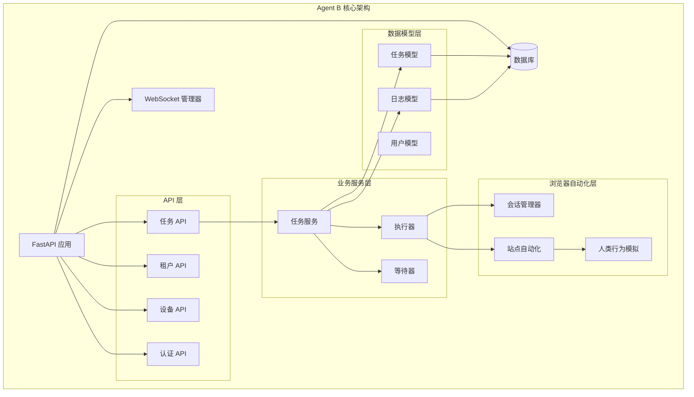

**图表来源**
- [main.py:12-27](file://CCC_RPA_API/app/main.py#L12-L27)
- [tasks.py:10](file://CCC_RPA_API/app/api/tasks.py#L10)
- [tenants.py:5](file://CCC_RPA_API/app/api/tenants.py#L5)
- [devices.py:5](file://CCC_RPA_API/app/api/devices.py#L5)

**章节来源**
- [main.py:12-27](file://CCC_RPA_API/app/main.py#L12-L27)
- [config.py:6-22](file://CCC_RPA_API/app/config.py#L6-L22)

## 核心组件

### API 网关设计

系统采用 FastAPI 构建统一的 API 网关，支持 RESTful 和 WebSocket 双向通信：

```mermaid
classDiagram
class FastAPI {
+CORS 中间件
+路由注册
+WebSocket 端点
+健康检查
}
class ConnectionManager {
+连接管理
+广播消息
+断开连接
}
class TaskRouter {
+GET /api/tasks
+POST /api/tasks
+GET /api/tasks/{id}
+PUT /api/tasks/{id}
+DELETE /api/tasks/{id}
+POST /api/tasks/{id}/execute
+GET /api/tasks/{id}/logs
}
class TenantRouter {
+GET /api/tenants
}
class DeviceRouter {
+GET /api/devices
}
FastAPI --> ConnectionManager : 使用
FastAPI --> TaskRouter : 注册
FastAPI --> TenantRouter : 注册
FastAPI --> DeviceRouter : 注册
```

**图表来源**
- [main.py:12-27](file://CCC_RPA_API/app/main.py#L12-L27)
- [manager.py:5-29](file://CCC_RPA_API/app/ws/manager.py#L5-L29)
- [tasks.py:10](file://CCC_RPA_API/app/api/tasks.py#L10)
- [tenants.py:5](file://CCC_RPA_API/app/api/tenants.py#L5)
- [devices.py:5](file://CCC_RPA_API/app/api/devices.py#L5)

### 任务管理系统

任务管理系统是整个 RPA 平台的核心，支持完整的生命周期管理：

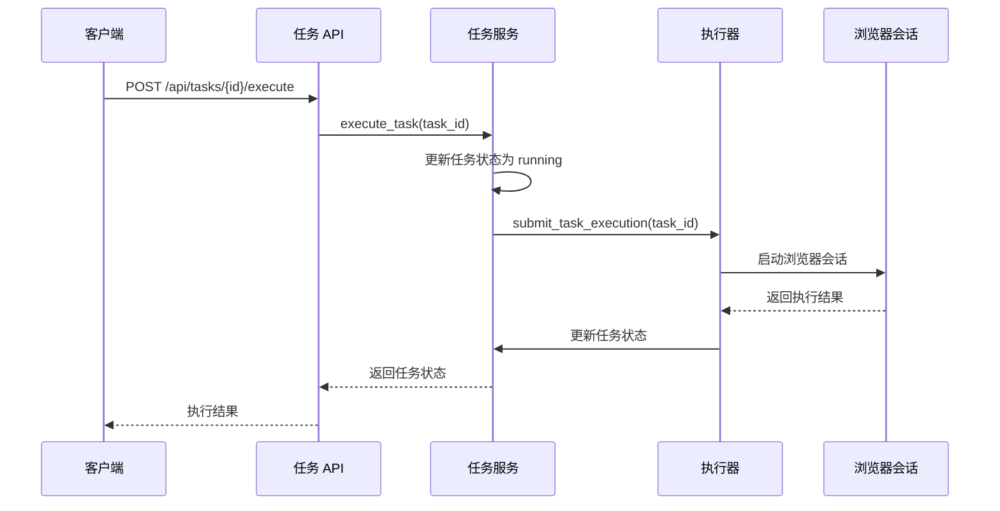

**图表来源**
- [tasks.py:47-53](file://CCC_RPA_API/app/api/tasks.py#L47-L53)
- [executor.py:317-319](file://CCC_RPA_API/app/services/executor.py#L317-L319)
- [session_manager.py:79-96](file://CCC_RPA_API/app/browser/session_manager.py#L79-L96)

**章节来源**
- [tasks.py:13-76](file://CCC_RPA_API/app/api/tasks.py#L13-L76)
- [executor.py:78-315](file://CCC_RPA_API/app/services/executor.py#L78-L315)

## 架构概览

### 双通路控制层架构

系统实现了双通路控制层，支持同步和异步两种执行模式：

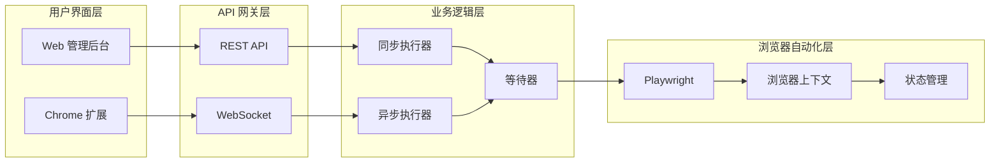

**图表来源**
- [executor.py:18-19](file://CCC_RPA_API/app/services/executor.py#L18-L19)
- [waiter.py:7-84](file://CCC_RPA_API/app/browser/waiter.py#L7-L84)
- [session_manager.py:10-186](file://CCC_RPA_API/app/browser/session_manager.py#L10-L186)

### 多租户网关业务管理

系统支持多租户架构，每个租户拥有独立的数据隔离和资源配置：

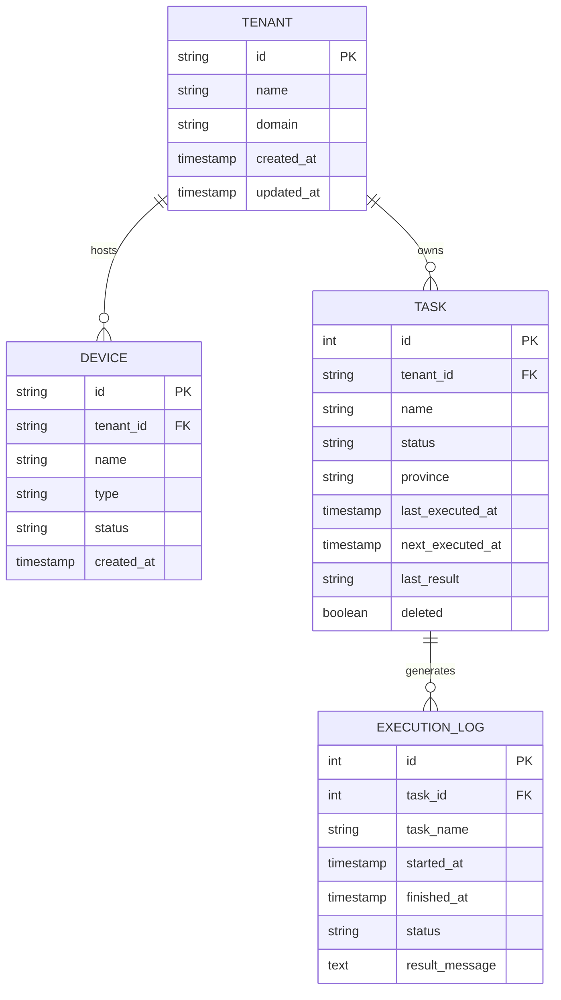

**图表来源**
- [task.py:8-25](file://CCC_RPA_API/app/models/task.py#L8-L25)
- [execution_log.py:7-17](file://CCC_RPA_API/app/models/execution_log.py#L7-L17)

**章节来源**
- [tenants.py:8-25](file://CCC_RPA_API/app/api/tenants.py#L8-L25)
- [devices.py:8-24](file://CCC_RPA_API/app/api/devices.py#L8-L24)
- [task.py:14-15](file://CCC_RPA_API/app/models/task.py#L14-L15)

## 详细组件分析

### Playwright 浏览器会话管理器

BrowserSessionManager 是系统的核心组件，负责管理 Playwright 浏览器实例和会话状态：

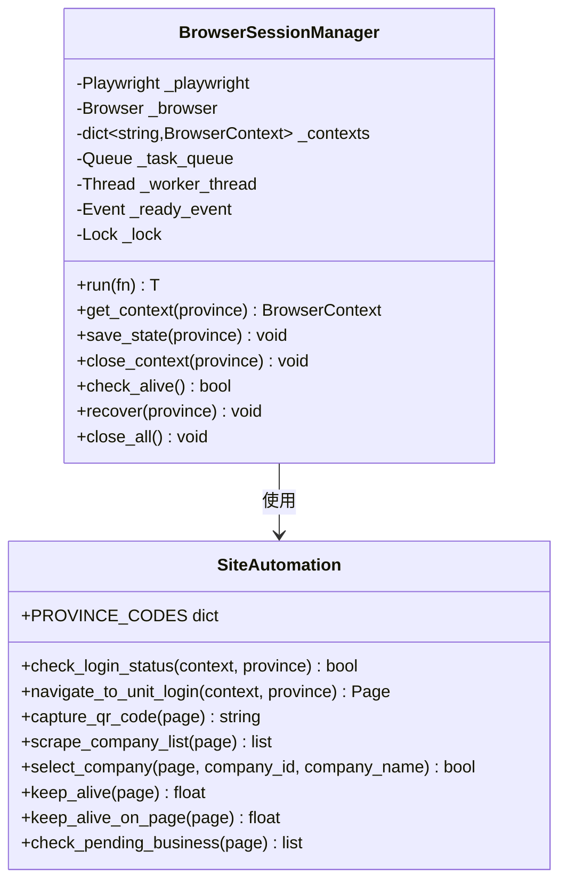

**图表来源**
- [session_manager.py:10-186](file://CCC_RPA_API/app/browser/session_manager.py#L10-L186)
- [site_automation.py:16-743](file://CCC_RPA_API/app/browser/site_automation.py#L16-L743)

#### 会话管理流程

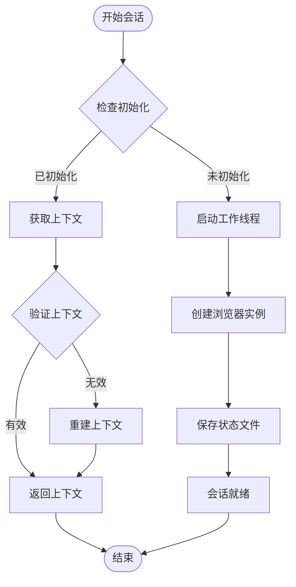

**图表来源**
- [session_manager.py:30-78](file://CCC_RPA_API/app/browser/session_manager.py#L30-L78)
- [session_manager.py:98-126](file://CCC_RPA_API/app/browser/session_manager.py#L98-L126)

**章节来源**
- [session_manager.py:10-186](file://CCC_RPA_API/app/browser/session_manager.py#L10-L186)

### 任务执行器

Executor 负责协调整个任务执行流程，包括浏览器自动化、用户交互和状态管理：

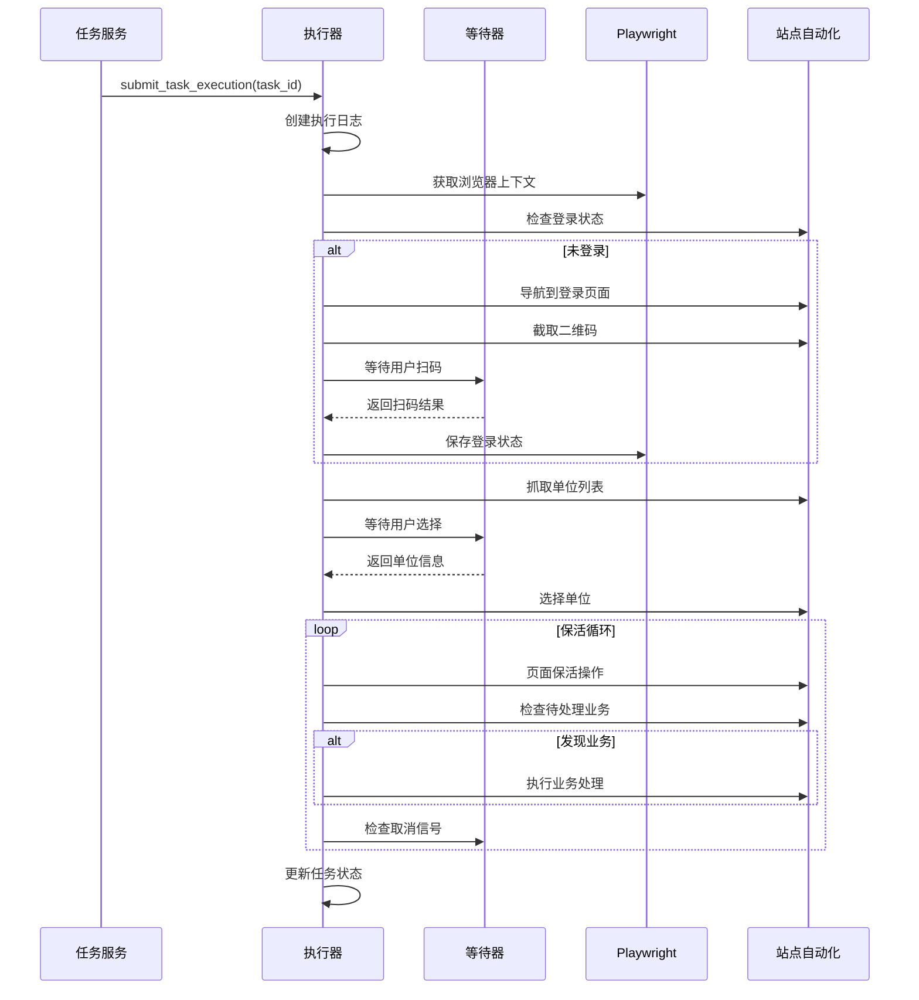

**图表来源**
- [executor.py:78-315](file://CCC_RPA_API/app/services/executor.py#L78-L315)
- [waiter.py:14-32](file://CCC_RPA_API/app/browser/waiter.py#L14-L32)
- [site_automation.py:38-541](file://CCC_RPA_API/app/browser/site_automation.py#L38-L541)

#### 双通路消息桥接机制

系统实现了智能的消息桥接机制，确保不同执行模式下的数据一致性：

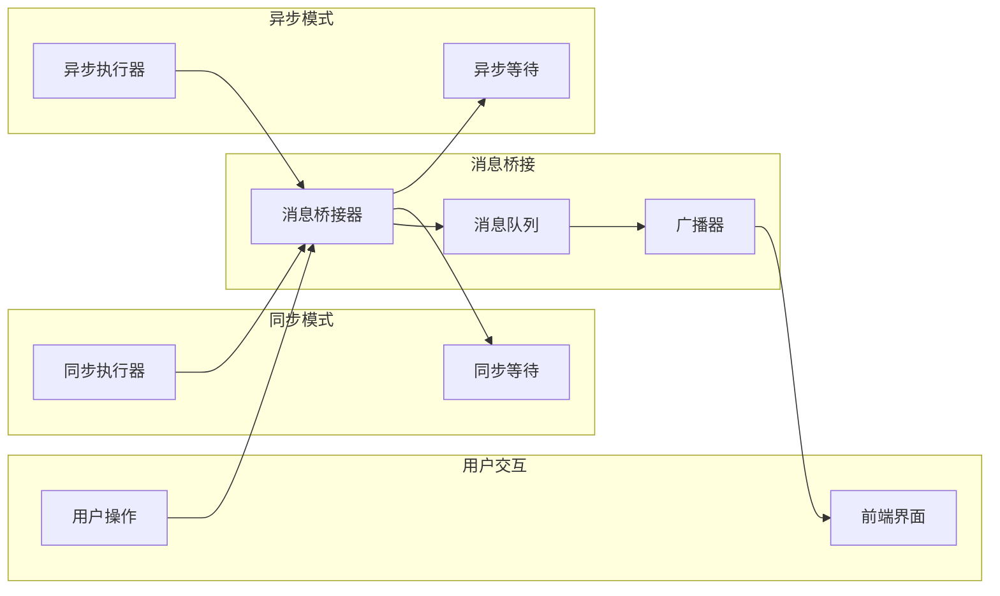

**图表来源**
- [executor.py:22-33](file://CCC_RPA_API/app/services/executor.py#L22-L33)
- [manager.py:17-26](file://CCC_RPA_API/app/ws/manager.py#L17-L26)

**章节来源**
- [executor.py:1-319](file://CCC_RPA_API/app/services/executor.py#L1-L319)

### 数据模型设计

系统采用 SQLAlchemy ORM 设计，支持复杂的数据关系和查询操作：

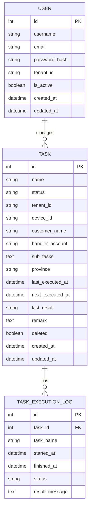

**图表来源**
- [task.py:8-25](file://CCC_RPA_API/app/models/task.py#L8-L25)
- [execution_log.py:7-17](file://CCC_RPA_API/app/models/execution_log.py#L7-L17)

**章节来源**
- [task.py:1-25](file://CCC_RPA_API/app/models/task.py#L1-L25)
- [execution_log.py:1-17](file://CCC_RPA_API/app/models/execution_log.py#L1-L17)

## 依赖关系分析

### 组件依赖图

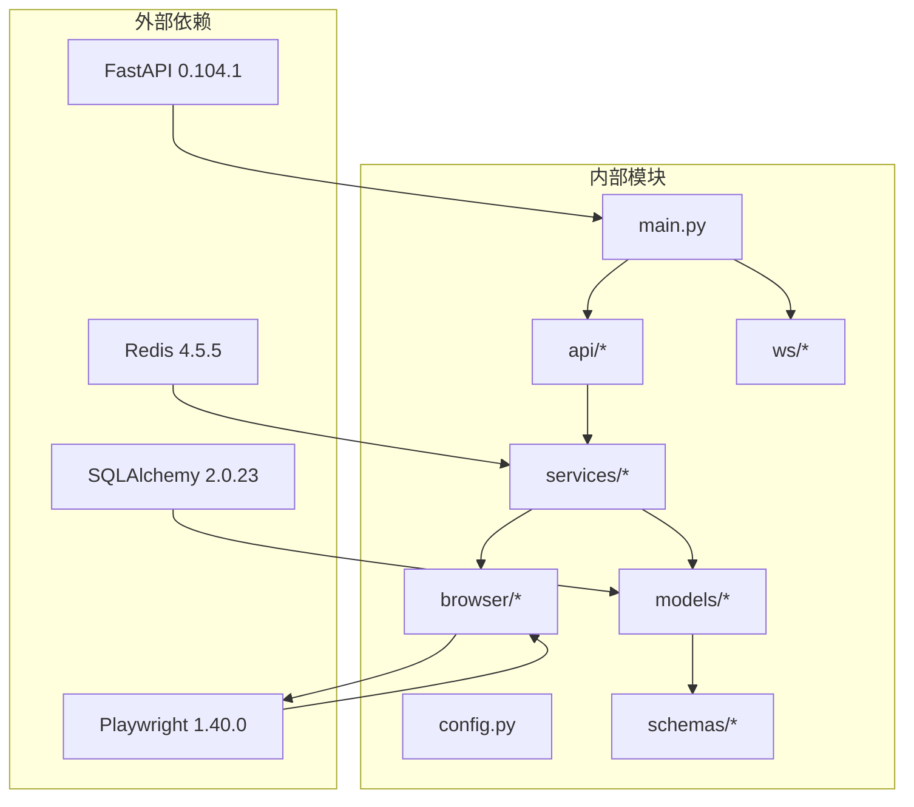

**图表来源**
- [main.py:1-127](file://CCC_RPA_API/app/main.py#L1-L127)
- [config.py:1-22](file://CCC_RPA_API/app/config.py#L1-L22)

### 数据流依赖

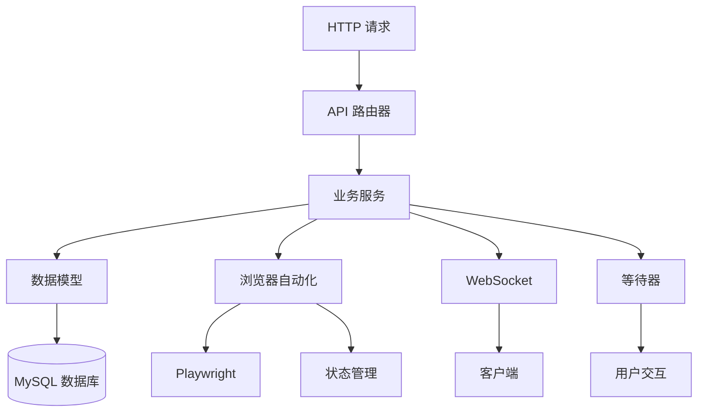

**图表来源**
- [tasks.py:1-76](file://CCC_RPA_API/app/api/tasks.py#L1-L76)
- [executor.py:1-319](file://CCC_RPA_API/app/services/executor.py#L1-L319)

**章节来源**
- [main.py:1-127](file://CCC_RPA_API/app/main.py#L1-L127)
- [config.py:1-22](file://CCC_RPA_API/app/config.py#L1-L22)

## 性能考虑

### 线程池优化

系统采用多线程架构，通过线程池管理不同的执行任务：

- **执行线程池** (`ThreadPoolExecutor`): 最大 3 个工作线程，专门处理任务执行逻辑
- **等待线程池** (`ThreadPoolExecutor`): 最大 3 个工作线程，处理用户交互等待
- **浏览器工作线程**: 单独的专用线程，避免与主线程事件循环冲突

### 内存管理

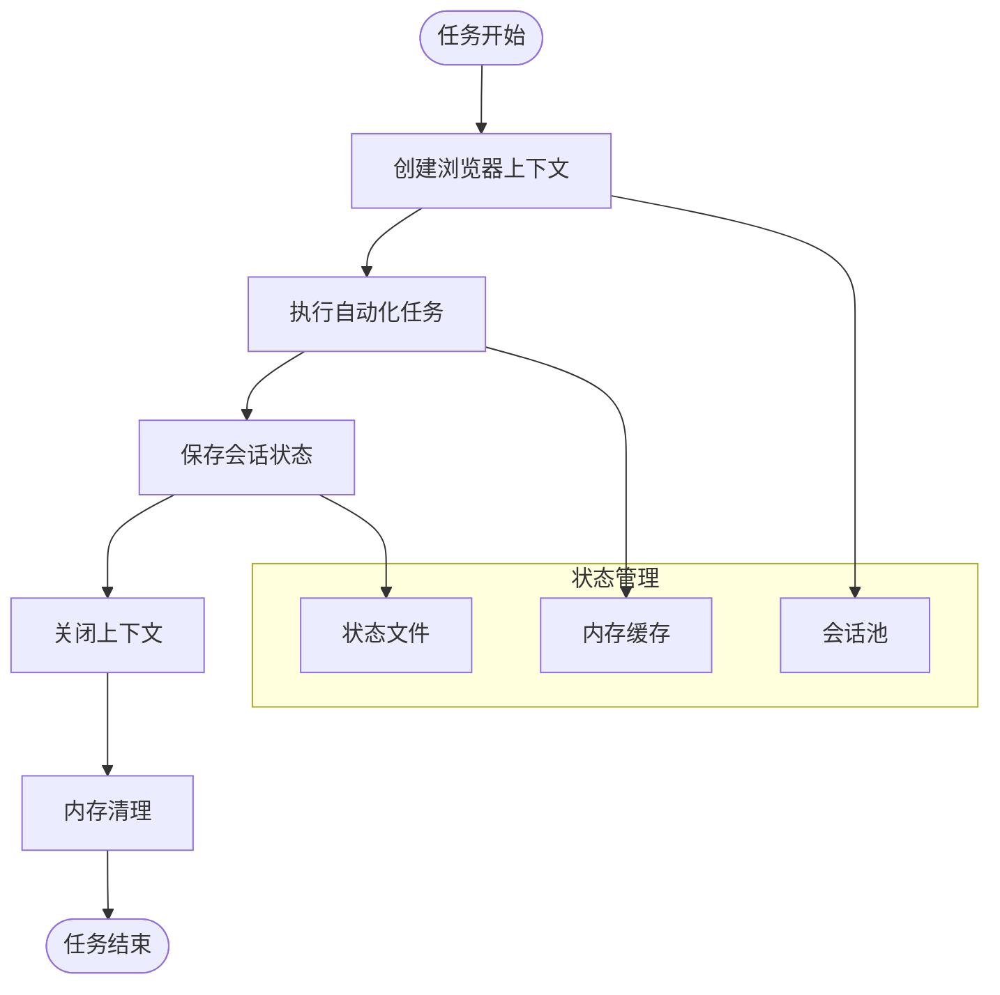

**图表来源**
- [session_manager.py:129-144](file://CCC_RPA_API/app/browser/session_manager.py#L129-L144)
- [session_manager.py:173-185](file://CCC_RPA_API/app/browser/session_manager.py#L173-L185)

### 缓存策略

系统实现了多层次的缓存机制：

1. **浏览器状态缓存**: 通过 `storage_state` 文件持久化登录状态
2. **会话池管理**: 复用浏览器上下文减少创建开销
3. **数据库查询缓存**: 对常用查询结果进行缓存
4. **WebSocket 连接复用**: 避免重复建立连接

## 故障排除指南

### 常见问题诊断

#### 浏览器会话异常

**症状**: 任务执行过程中浏览器意外关闭或无响应

**诊断步骤**:
1. 检查浏览器工作线程状态
2. 验证会话管理器的 `check_alive()` 方法
3. 查看状态文件是否存在和完整性
4. 检查 Playwright 版本兼容性

**解决方案**:
```python
# 恢复会话示例
BrowserSessionManager.recover(province)
context = BrowserSessionManager.get_context(province)
```

#### WebSocket 连接问题

**症状**: 前端无法接收实时更新消息

**诊断方法**:
1. 检查主事件循环是否可用
2. 验证连接管理器的状态
3. 查看广播消息的序列化过程

**修复措施**:
```python
# 安全广播消息
def safe_broadcast(message):
    if _main_loop and _main_loop.is_running():
        asyncio.run_coroutine_threadsafe(
            ws_manager.broadcast(message), 
            _main_loop
        )
```

#### 数据库连接异常

**症状**: 任务状态更新失败或查询超时

**排查要点**:
1. 检查数据库连接配置
2. 验证表结构和索引
3. 监控数据库连接池状态
4. 查看慢查询日志

**章节来源**
- [session_manager.py:147-170](file://CCC_RPA_API/app/browser/session_manager.py#L147-L170)
- [executor.py:22-33](file://CCC_RPA_API/app/services/executor.py#L22-L33)
- [main.py:30-87](file://CCC_RPA_API/app/main.py#L30-L87)

## 结论

Agent B 控制层和业务网关开发构建了一个功能完整、架构清晰的企业级 RPA 自动化平台。系统的主要优势包括：

### 核心优势

1. **双通路架构**: 同时支持同步和异步执行模式，满足不同业务场景需求
2. **多租户隔离**: 完善的租户管理和数据隔离机制
3. **实时通信**: 基于 WebSocket 的实时状态推送和用户交互
4. **浏览器自动化**: 基于 Playwright 的稳定自动化框架
5. **任务编排**: 智能的任务执行和状态管理

### 技术特色

- **模块化设计**: 清晰的分层架构和职责分离
- **异步处理**: 高效的并发处理能力和资源利用率
- **容错机制**: 完善的错误处理和恢复策略
- **扩展性**: 易于扩展的新功能集成能力

### 未来发展方向

1. **性能优化**: 进一步优化浏览器会话管理和内存使用
2. **监控增强**: 添加更详细的性能指标和监控告警
3. **安全加固**: 加强身份认证和授权机制
4. **功能扩展**: 支持更多类型的自动化任务和业务场景

该系统为企业提供了可靠的 RPA 自动化解决方案，能够有效提升业务效率和自动化水平。