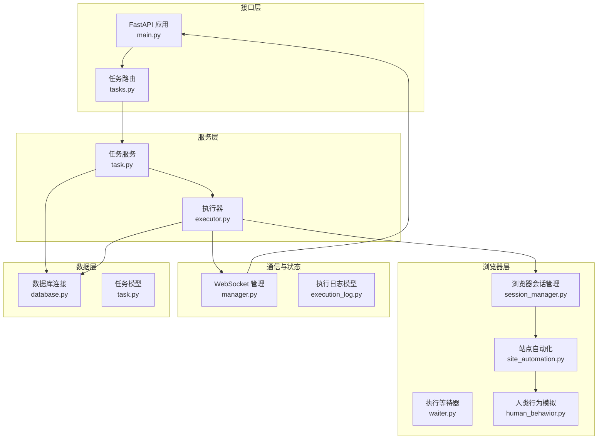
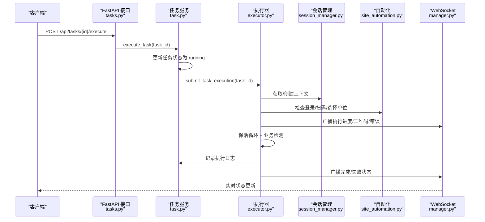
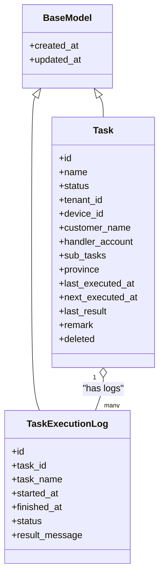
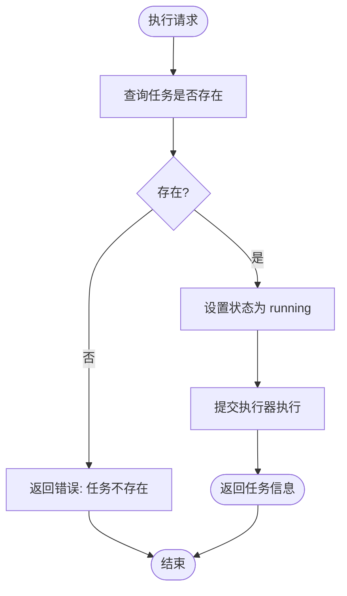
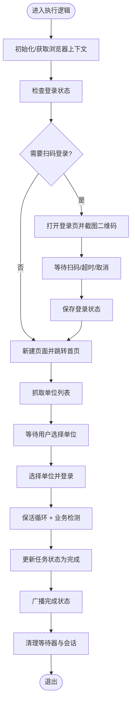
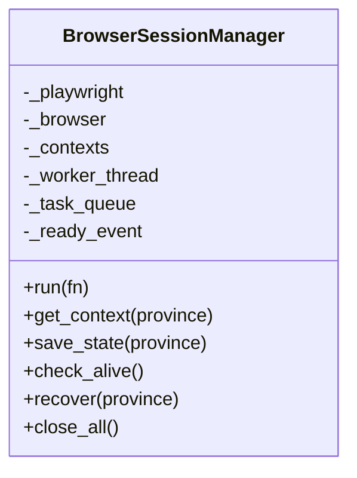
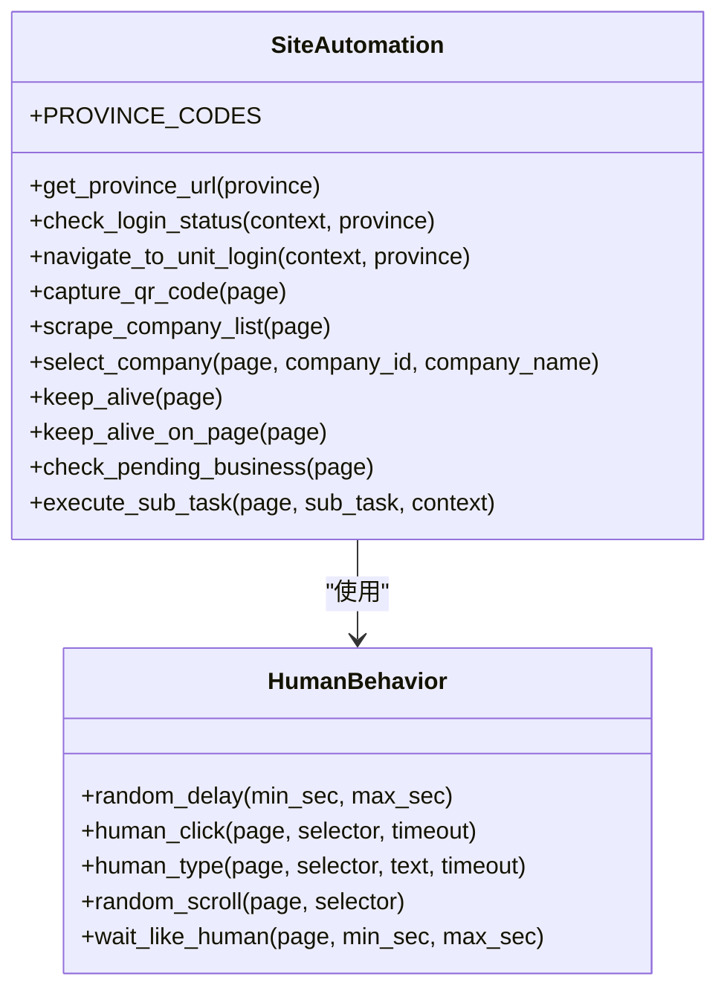
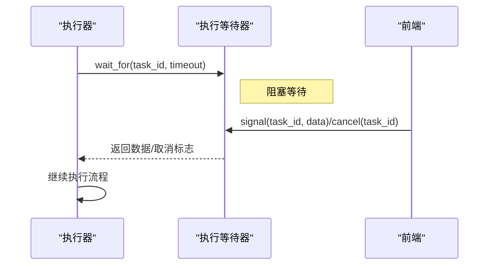
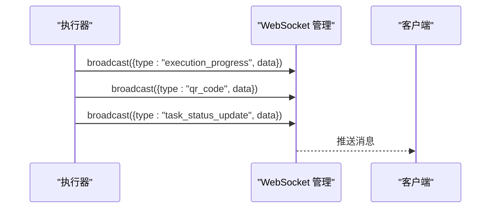
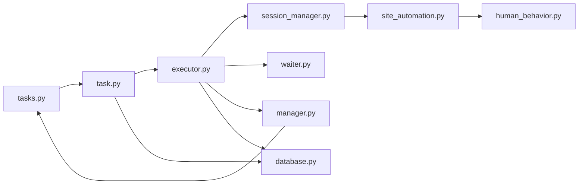

# BullMQ 任务引擎

<cite>
**本文档引用的文件**
- [main.py](file://CCC_RPA_API/app/main.py)
- [tasks.py](file://CCC_RPA_API/app/api/tasks.py)
- [executor.py](file://CCC_RPA_API/app/services/executor.py)
- [task.py](file://CCC_RPA_API/app/services/task.py)
- [session_manager.py](file://CCC_RPA_API/app/browser/session_manager.py)
- [site_automation.py](file://CCC_RPA_API/app/browser/site_automation.py)
- [waiter.py](file://CCC_RPA_API/app/browser/waiter.py)
- [manager.py](file://CCC_RPA_API/app/ws/manager.py)
- [task.py](file://CCC_RPA_API/app/models/task.py)
- [execution_log.py](file://CCC_RPA_API/app/models/execution_log.py)
- [base.py](file://CCC_RPA_API/app/models/base.py)
- [task.py](file://CCC_RPA_API/app/schemas/task.py)
- [execution.py](file://CCC_RPA_API/app/schemas/execution.py)
- [human_behavior.py](file://CCC_RPA_API/app/browser/human_behavior.py)
- [database.py](file://CCC_RPA_API/app/database.py)
- [requirements.txt](file://CCC_RPA_API/requirements.txt)
</cite>

## 目录
1. [简介](#简介)
2. [项目结构](#项目结构)
3. [核心组件](#核心组件)
4. [架构总览](#架构总览)
5. [详细组件分析](#详细组件分析)
6. [依赖关系分析](#依赖关系分析)
7. [性能考虑](#性能考虑)
8. [故障排除指南](#故障排除指南)
9. [结论](#结论)

## 简介
本项目基于 Python/FastAPI 构建了一个面向 RPA 场景的任务执行引擎，实现了任务队列、作业调度、优先级管理、重试与失败处理、异步执行、状态跟踪与性能监控等能力。系统通过专用线程池隔离浏览器操作，结合 WebSocket 实时推送执行进度，并以数据库持久化任务与执行日志。

## 项目结构
- 后端服务采用 FastAPI 提供 REST 接口与 WebSocket 通信
- 任务生命周期：API -> 服务层 -> 执行器 -> 浏览器会话管理器 -> 自动化脚本
- 数据模型与日志通过 SQLAlchemy 持久化
- 前端通过 WebSocket 接收实时状态更新

**图表来源**
- [main.py:1-127](file://CCC_RPA_API/app/main.py#L1-L127)
- [tasks.py:1-76](file://CCC_RPA_API/app/api/tasks.py#L1-L76)
- [task.py:1-157](file://CCC_RPA_API/app/services/task.py#L1-L157)
- [executor.py:1-319](file://CCC_RPA_API/app/services/executor.py#L1-L319)
- [session_manager.py:1-186](file://CCC_RPA_API/app/browser/session_manager.py#L1-L186)
- [site_automation.py:1-743](file://CCC_RPA_API/app/browser/site_automation.py#L1-L743)
- [waiter.py:1-84](file://CCC_RPA_API/app/browser/waiter.py#L1-L84)
- [manager.py:1-29](file://CCC_RPA_API/app/ws/manager.py#L1-L29)
- [task.py:1-25](file://CCC_RPA_API/app/models/task.py#L1-L25)
- [execution_log.py:1-17](file://CCC_RPA_API/app/models/execution_log.py#L1-L17)
- [database.py:1-19](file://CCC_RPA_API/app/database.py#L1-L19)

**章节来源**
- [main.py:1-127](file://CCC_RPA_API/app/main.py#L1-L127)
- [requirements.txt:1-11](file://CCC_RPA_API/requirements.txt#L1-L11)

## 核心组件
- 任务模型与日志：定义任务字段与执行日志结构，支持状态跟踪与历史审计
- 任务服务：提供任务 CRUD、执行触发与日志查询
- 执行器：线程池驱动的任务执行逻辑，包含浏览器会话管理、用户交互等待、保活循环与错误恢复
- 浏览器会话管理：专用线程承载 Playwright，统一上下文与状态持久化
- 站点自动化：针对特定站点的登录、扫码、单位选择、业务检测与保活
- 执行等待器：基于线程事件的用户交互与取消信号机制
- WebSocket 管理：向客户端推送执行进度、二维码与错误信息
- 数据库连接：SQLAlchemy 会话管理与模型基类

**章节来源**
- [task.py:1-25](file://CCC_RPA_API/app/models/task.py#L1-L25)
- [execution_log.py:1-17](file://CCC_RPA_API/app/models/execution_log.py#L1-L17)
- [task.py:1-157](file://CCC_RPA_API/app/services/task.py#L1-L157)
- [executor.py:1-319](file://CCC_RPA_API/app/services/executor.py#L1-L319)
- [session_manager.py:1-186](file://CCC_RPA_API/app/browser/session_manager.py#L1-L186)
- [site_automation.py:1-743](file://CCC_RPA_API/app/browser/site_automation.py#L1-L743)
- [waiter.py:1-84](file://CCC_RPA_API/app/browser/waiter.py#L1-L84)
- [manager.py:1-29](file://CCC_RPA_API/app/ws/manager.py#L1-L29)
- [database.py:1-19](file://CCC_RPA_API/app/database.py#L1-L19)

## 架构总览
系统采用“接口层-服务层-执行层-浏览器层-通信层-数据层”的分层架构。任务通过 API 触发，服务层更新任务状态并提交到执行器；执行器在专用线程池中协调浏览器操作与用户交互，期间通过 WebSocket 实时反馈状态；执行结果与异常被持久化到数据库。

**图表来源**
- [tasks.py:47-52](file://CCC_RPA_API/app/api/tasks.py#L47-L52)
- [task.py:120-133](file://CCC_RPA_API/app/services/task.py#L120-L133)
- [executor.py:317-319](file://CCC_RPA_API/app/services/executor.py#L317-L319)
- [session_manager.py:99-126](file://CCC_RPA_API/app/browser/session_manager.py#L99-L126)
- [site_automation.py:38-58](file://CCC_RPA_API/app/browser/site_automation.py#L38-L58)
- [manager.py:17-26](file://CCC_RPA_API/app/ws/manager.py#L17-L26)

## 详细组件分析

### 任务模型与日志
- 任务模型包含名称、状态、租户/设备/客户信息、省/市区县、子任务列表、下次执行时间、备注等字段，并继承通用创建/更新时间戳
- 执行日志模型记录每次执行的开始/结束时间、状态与结果描述，支持按任务 ID 查询

**图表来源**
- [base.py:7-11](file://CCC_RPA_API/app/models/base.py#L7-L11)
- [task.py:1-25](file://CCC_RPA_API/app/models/task.py#L1-L25)
- [execution_log.py:1-17](file://CCC_RPA_API/app/models/execution_log.py#L1-L17)

**章节来源**
- [task.py:1-25](file://CCC_RPA_API/app/models/task.py#L1-L25)
- [execution_log.py:1-17](file://CCC_RPA_API/app/models/execution_log.py#L1-L17)
- [base.py:1-11](file://CCC_RPA_API/app/models/base.py#L1-L11)

### 任务服务与 API
- 任务服务提供分页查询、详情、创建、更新、删除、执行与日志查询
- API 路由暴露任务管理与执行接口，执行接口调用服务层并返回错误信息
- 执行接口会将任务状态置为运行中并提交到执行器

**图表来源**
- [tasks.py:13-15](file://CCC_RPA_API/app/api/tasks.py#L13-L15)
- [tasks.py:47-52](file://CCC_RPA_API/app/api/tasks.py#L47-L52)
- [task.py:120-133](file://CCC_RPA_API/app/services/task.py#L120-L133)

**章节来源**
- [tasks.py:1-76](file://CCC_RPA_API/app/api/tasks.py#L1-L76)
- [task.py:1-157](file://CCC_RPA_API/app/services/task.py#L1-L157)

### 执行器与线程池
- 执行器使用两个线程池：普通任务线程池与等待线程池，避免阻塞浏览器工作线程
- 在工作线程中安全广播 WebSocket 消息，确保与主事件循环协作
- 任务执行流程包含：初始化浏览器、检查登录、扫码登录、获取单位列表、等待用户选择、选择单位、保活循环、业务检测与执行、完成与清理

**图表来源**
- [executor.py:78-314](file://CCC_RPA_API/app/services/executor.py#L78-L314)
- [session_manager.py:99-126](file://CCC_RPA_API/app/browser/session_manager.py#L99-L126)
- [site_automation.py:194-291](file://CCC_RPA_API/app/browser/site_automation.py#L194-L291)
- [waiter.py:14-32](file://CCC_RPA_API/app/browser/waiter.py#L14-L32)

**章节来源**
- [executor.py:1-319](file://CCC_RPA_API/app/services/executor.py#L1-L319)

### 浏览器会话管理
- 通过专用线程承载 Playwright，队列化执行浏览器操作，避免与 asyncio 冲突
- 按省维护浏览器上下文，支持状态持久化与恢复
- 提供检查存活、恢复会话、关闭上下文与全局关闭等能力

**图表来源**
- [session_manager.py:10-186](file://CCC_RPA_API/app/browser/session_manager.py#L10-L186)

**章节来源**
- [session_manager.py:1-186](file://CCC_RPA_API/app/browser/session_manager.py#L1-L186)

### 站点自动化与人类行为模拟
- 自动化模块封装登录检查、扫码登录、单位列表抓取、单位选择、保活与业务检测
- 人类行为模拟类提供随机滚动、点击、输入与等待，降低被反爬检测风险
- 支持多种降级策略与错误恢复，保证稳定性

**图表来源**
- [site_automation.py:16-743](file://CCC_RPA_API/app/browser/site_automation.py#L16-L743)
- [human_behavior.py:12-86](file://CCC_RPA_API/app/browser/human_behavior.py#L12-L86)

**章节来源**
- [site_automation.py:1-743](file://CCC_RPA_API/app/browser/site_automation.py#L1-L743)
- [human_behavior.py:1-86](file://CCC_RPA_API/app/browser/human_behavior.py#L1-L86)

### 执行等待器与用户交互
- 基于线程事件实现阻塞等待与唤醒，支持超时与取消
- 保活循环中非阻塞检查取消信号，确保及时响应用户操作

**图表来源**
- [waiter.py:14-32](file://CCC_RPA_API/app/browser/waiter.py#L14-L32)
- [executor.py:132-139](file://CCC_RPA_API/app/services/executor.py#L132-L139)

**章节来源**
- [waiter.py:1-84](file://CCC_RPA_API/app/browser/waiter.py#L1-L84)
- [executor.py:72-75](file://CCC_RPA_API/app/services/executor.py#L72-L75)

### WebSocket 状态推送
- WebSocket 管理器负责连接管理与广播
- 执行器在关键节点广播执行进度、二维码、登录结果、错误与任务状态更新

**图表来源**
- [executor.py:100-144](file://CCC_RPA_API/app/services/executor.py#L100-L144)
- [manager.py:17-26](file://CCC_RPA_API/app/ws/manager.py#L17-L26)

**章节来源**
- [manager.py:1-29](file://CCC_RPA_API/app/ws/manager.py#L1-L29)
- [executor.py:22-33](file://CCC_RPA_API/app/services/executor.py#L22-L33)

### 数据库与配置
- 使用 SQLAlchemy 连接 MySQL，启用连接池预检查与回收
- 任务与日志模型继承通用基类，自动维护创建/更新时间戳

**章节来源**
- [database.py:1-19](file://CCC_RPA_API/app/database.py#L1-L19)
- [base.py:1-11](file://CCC_RPA_API/app/models/base.py#L1-L11)

## 依赖关系分析
- 接口层依赖服务层；服务层依赖执行器与数据库；执行器依赖会话管理与自动化模块；会话管理依赖 Playwright；WebSocket 管理依赖 FastAPI；模型与日志依赖 SQLAlchemy。

**图表来源**
- [tasks.py:1-76](file://CCC_RPA_API/app/api/tasks.py#L1-L76)
- [task.py:1-157](file://CCC_RPA_API/app/services/task.py#L1-L157)
- [executor.py:1-319](file://CCC_RPA_API/app/services/executor.py#L1-L319)
- [session_manager.py:1-186](file://CCC_RPA_API/app/browser/session_manager.py#L1-L186)
- [site_automation.py:1-743](file://CCC_RPA_API/app/browser/site_automation.py#L1-L743)
- [waiter.py:1-84](file://CCC_RPA_API/app/browser/waiter.py#L1-L84)
- [manager.py:1-29](file://CCC_RPA_API/app/ws/manager.py#L1-L29)
- [database.py:1-19](file://CCC_RPA_API/app/database.py#L1-L19)

**章节来源**
- [requirements.txt:1-11](file://CCC_RPA_API/requirements.txt#L1-L11)

## 性能考虑
- 线程池隔离：浏览器操作在专用线程执行，避免阻塞主事件循环与 Web 等待线程
- 保活策略：在业务页面执行轻量保活，减少页面跳转与网络开销
- 降级与恢复：浏览器异常时自动恢复上下文，降低整体失败率
- 日志与监控：通过 WebSocket 实时推送状态，便于前端监控与用户感知

## 故障排除指南
- 浏览器异常：检查会话管理器的存活状态与恢复流程，确认上下文重建与页面跳转
- 扫码超时：检查二维码生成与前端展示，确认等待器超时配置
- 选择单位失败：核对单位列表抓取与选择器匹配策略，必要时启用 JS 回退
- WebSocket 广播失败：确认主事件循环可用性与连接状态，检查广播异常处理
- 数据库连接问题：检查连接池参数与 DSN 配置，确保连接预检查生效

**章节来源**
- [session_manager.py:147-170](file://CCC_RPA_API/app/browser/session_manager.py#L147-L170)
- [executor.py:132-139](file://CCC_RPA_API/app/services/executor.py#L132-L139)
- [site_automation.py:294-540](file://CCC_RPA_API/app/browser/site_automation.py#L294-L540)
- [manager.py:17-26](file://CCC_RPA_API/app/ws/manager.py#L17-L26)
- [database.py:5](file://CCC_RPA_API/app/database.py#L5)

## 结论
本任务引擎通过清晰的分层设计与线程池隔离，实现了稳定可靠的 RPA 自动化执行。配合 WebSocket 实时状态推送与完善的日志体系，能够满足生产环境下的任务编排、状态跟踪与故障恢复需求。建议在生产部署中进一步完善重试策略、限流与告警机制，并持续优化选择器与保活策略以提升稳定性与性能。