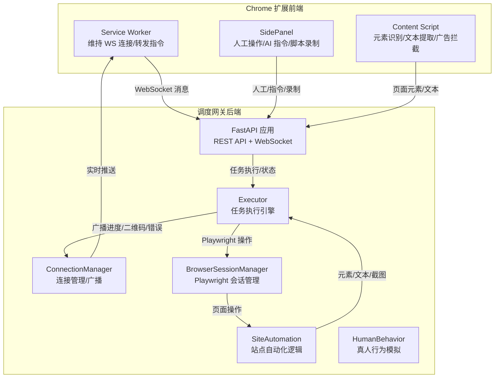
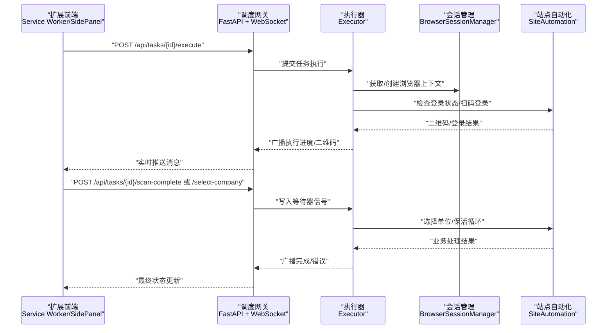
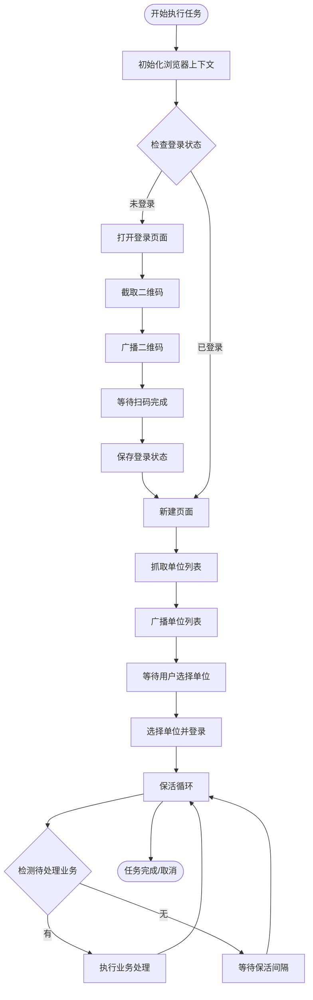
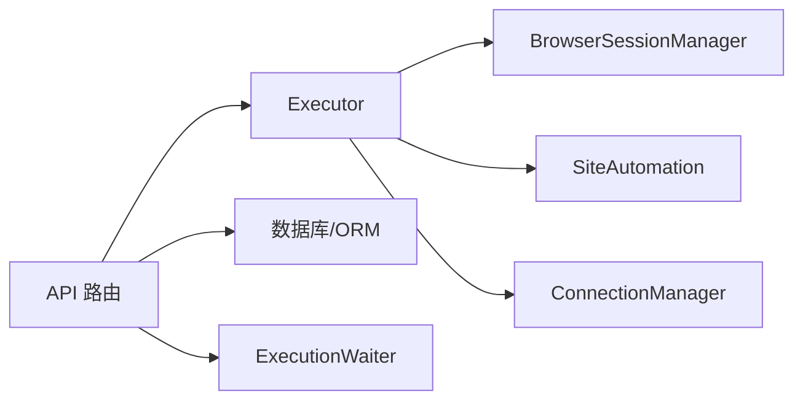

# Chrome 扩展开发

<cite>
**本文档引用的文件**
- [main.py](file://CCC_RPA_API/app/main.py)
- [manager.py](file://CCC_RPA_API/app/ws/manager.py)
- [session_manager.py](file://CCC_RPA_API/app/browser/session_manager.py)
- [site_automation.py](file://CCC_RPA_API/app/browser/site_automation.py)
- [human_behavior.py](file://CCC_RPA_API/app/browser/human_behavior.py)
- [executor.py](file://CCC_RPA_API/app/services/executor.py)
- [task.py](file://CCC_RPA_API/app/models/task.py)
- [tasks.py](file://CCC_RPA_API/app/api/tasks.py)
</cite>

## 目录
1. [简介](#简介)
2. [项目结构](#项目结构)
3. [核心组件](#核心组件)
4. [架构总览](#架构总览)
5. [详细组件分析](#详细组件分析)
6. [依赖分析](#依赖分析)
7. [性能考虑](#性能考虑)
8. [故障排查指南](#故障排查指南)
9. [结论](#结论)
10. [附录](#附录)

## 简介
本项目围绕 Chrome V3 扩展的三大模块进行系统化设计与实现：Service Worker 后台服务（维持 WS 长连接、接收指令、转发操作）、Content Script 页面注入（元素识别、文本提取、广告拦截）以及 SidePanel 侧边面板（人工操作、AI 指令输入、脚本录制）。同时，扩展通过调度网关与后端服务进行消息协议交互与实时通信，形成“前端扩展 + 后端调度网关”的协同架构。

## 项目结构
- 后端服务（调度网关）基于 FastAPI 提供 REST API 与 WebSocket 通道，负责任务编排、浏览器会话管理、实时状态推送与用户交互信号传递。
- 前端扩展（Chrome V3）包含：
  - Service Worker：维护与后端的 WebSocket 连接，转发指令与状态。
  - Content Script：在目标页面执行元素识别、文本提取与广告拦截。
  - SidePanel：提供人工操作界面、AI 指令输入与脚本录制功能。
- 数据与流程：
  - 任务模型与数据库交互由后端 ORM 管理。
  - 浏览器自动化由 Playwright 在专用工作线程中执行，避免与 asyncio 冲突。
  - WebSocket 广播用于向扩展前端推送执行进度、二维码、错误与状态更新。

图表来源
- [main.py:119-127](file://CCC_RPA_API/app/main.py#L119-L127)
- [manager.py:1-29](file://CCC_RPA_API/app/ws/manager.py#L1-L29)
- [executor.py:100-170](file://CCC_RPA_API/app/services/executor.py#L100-L170)
- [session_manager.py:99-126](file://CCC_RPA_API/app/browser/session_manager.py#L99-L126)
- [site_automation.py:16-36](file://CCC_RPA_API/app/browser/site_automation.py#L16-L36)

章节来源
- [main.py:12-28](file://CCC_RPA_API/app/main.py#L12-L28)
- [main.py:119-127](file://CCC_RPA_API/app/main.py#L119-L127)
- [manager.py:1-29](file://CCC_RPA_API/app/ws/manager.py#L1-L29)

## 核心组件
- Service Worker 后台服务
  - 维持与后端的 WebSocket 连接，接收实时状态与指令，转发至扩展各模块。
  - 作为消息枢纽，确保扩展 UI 与自动化流程的解耦与异步通信。
- Content Script 页面注入
  - 在目标页面执行元素识别与文本提取，支持广告拦截策略。
  - 与扩展的 SidePanel 协同，提供人工校验与二次确认能力。
- SidePanel 侧边面板
  - 提供人工操作界面，支持 AI 指令输入与脚本录制。
  - 通过后端 API 与 WebSocket 实现与调度网关的双向通信。
- 调度网关（后端）
  - FastAPI 应用提供 REST API 与 WebSocket 端点。
  - ConnectionManager 管理连接与广播，Executor 负责任务执行引擎，BrowserSessionManager 管理 Playwright 会话，SiteAutomation 实现站点自动化逻辑，HumanBehavior 提供真人行为模拟。

章节来源
- [main.py:119-127](file://CCC_RPA_API/app/main.py#L119-L127)
- [manager.py:1-29](file://CCC_RPA_API/app/ws/manager.py#L1-L29)
- [executor.py:78-315](file://CCC_RPA_API/app/services/executor.py#L78-L315)
- [session_manager.py:10-186](file://CCC_RPA_API/app/browser/session_manager.py#L10-L186)
- [site_automation.py:16-743](file://CCC_RPA_API/app/browser/site_automation.py#L16-L743)
- [human_behavior.py:12-86](file://CCC_RPA_API/app/browser/human_behavior.py#L12-L86)

## 架构总览
扩展与调度网关通过 WebSocket 实现实时通信，消息类型覆盖任务状态、二维码、错误与进度。后端以线程池与专用工作线程隔离 Playwright 操作，避免与 asyncio 事件循环冲突；同时通过 ConnectionManager 对连接进行集中管理与广播。

图表来源
- [tasks.py:47-75](file://CCC_RPA_API/app/api/tasks.py#L47-L75)
- [executor.py:100-278](file://CCC_RPA_API/app/services/executor.py#L100-L278)
- [session_manager.py:99-126](file://CCC_RPA_API/app/browser/session_manager.py#L99-L126)
- [site_automation.py:38-192](file://CCC_RPA_API/app/browser/site_automation.py#L38-L192)

## 详细组件分析

### Service Worker 后台服务
- 职责
  - 维持与后端的 WebSocket 连接，接收实时消息并分发给扩展各模块。
  - 转发用户在 SidePanel 的操作指令（如扫码完成、选择单位、取消执行）到后端。
- 关键点
  - 与扩展的 Content Script 解耦，仅通过消息通道交互。
  - 保证消息顺序与去重，避免重复触发自动化流程。

章节来源
- [main.py:119-127](file://CCC_RPA_API/app/main.py#L119-L127)
- [tasks.py:60-75](file://CCC_RPA_API/app/api/tasks.py#L60-L75)

### Content Script 页面注入
- 职责
  - 在目标页面执行元素识别与文本提取，辅助自动化流程。
  - 支持广告拦截策略，减少干扰元素对自动化的影响。
- 关键点
  - 与扩展的 SidePanel 协同，提供人工校验与二次确认。
  - 通过扩展消息通道与后端交互，上报页面状态与用户操作。

章节来源
- [site_automation.py:194-291](file://CCC_RPA_API/app/browser/site_automation.py#L194-L291)

### SidePanel 侧边面板
- 职责
  - 提供人工操作界面，支持 AI 指令输入与脚本录制。
  - 通过后端 API 与 WebSocket 实时获取任务状态与二维码。
- 关键点
  - 与 Service Worker 协同，确保指令与状态的一致性。
  - 支持取消执行与等待用户输入的场景。

章节来源
- [tasks.py:60-75](file://CCC_RPA_API/app/api/tasks.py#L60-L75)
- [executor.py:100-170](file://CCC_RPA_API/app/services/executor.py#L100-L170)

### 调度网关（后端）

#### WebSocket 管理与广播
- ConnectionManager 负责：
  - 接受新连接并维护连接集合。
  - 对所有连接广播消息，自动清理无效连接。
- 主事件循环集成
  - 在应用启动时捕获主事件循环，确保工作线程中安全广播。

章节来源
- [manager.py:1-29](file://CCC_RPA_API/app/ws/manager.py#L1-L29)
- [main.py:30-35](file://CCC_RPA_API/app/main.py#L30-L35)

#### 任务执行引擎（Executor）
- 职责
  - 读取任务配置，初始化浏览器上下文，执行扫码登录、选择单位、保活循环与业务处理。
  - 通过 WebSocket 广播执行进度、二维码、错误与最终状态。
- 关键流程
  - 初始化浏览器上下文与登录状态检查。
  - 扫码登录阶段推送二维码并等待用户完成。
  - 选择单位后进入保活循环，检测待处理业务并执行。
  - 记录执行日志与任务状态，清理等待器资源。

图表来源
- [executor.py:78-315](file://CCC_RPA_API/app/services/executor.py#L78-L315)
- [site_automation.py:38-192](file://CCC_RPA_API/app/browser/site_automation.py#L38-L192)

章节来源
- [executor.py:78-315](file://CCC_RPA_API/app/services/executor.py#L78-L315)

#### 浏览器会话管理（BrowserSessionManager）
- 职责
  - 按省份管理 Playwright 浏览器上下文，持久化 storage_state。
  - 在专用工作线程中执行 Playwright 操作，避免线程冲突。
- 关键点
  - 幂等初始化专用线程与浏览器实例。
  - 提供上下文获取、状态保存、上下文关闭与全量关闭能力。
  - 支持会话恢复与存活检查，保障长时间运行稳定性。

章节来源
- [session_manager.py:10-186](file://CCC_RPA_API/app/browser/session_manager.py#L10-L186)

#### 站点自动化（SiteAutomation）
- 职责
  - 实现特定站点的自动化流程：登录、单位选择、业务处理与保活。
- 关键点
  - 多策略降级与回退（CSS 选择器、JS 回退、文本匹配）提升鲁棒性。
  - 提供真人行为模拟（滚动、点击、等待）降低检测风险。
  - 二维码截取与页面保活策略保障长时间稳定运行。

章节来源
- [site_automation.py:16-743](file://CCC_RPA_API/app/browser/site_automation.py#L16-L743)
- [human_behavior.py:12-86](file://CCC_RPA_API/app/browser/human_behavior.py#L12-L86)

#### 任务模型与 API
- 任务模型
  - 定义任务字段（名称、状态、省份、备注、子任务等），支持软删除与时间戳。
- API 接口
  - 提供任务 CRUD、执行、日志查询、扫码完成、选择单位与取消执行等接口。
  - 通过 ExecutionWaiter 与前端交互，实现阻塞等待与信号传递。

章节来源
- [task.py:8-25](file://CCC_RPA_API/app/models/task.py#L8-L25)
- [tasks.py:13-75](file://CCC_RPA_API/app/api/tasks.py#L13-L75)

## 依赖分析
- 组件耦合
  - Executor 依赖 BrowserSessionManager 与 SiteAutomation，负责任务执行与状态广播。
  - API 层通过 TaskService 与数据库交互，并协调 ExecutionWaiter 实现用户信号传递。
  - WebSocket 广播通过 ConnectionManager 统一管理，避免连接泄漏。
- 外部依赖
  - Playwright 用于浏览器自动化，专用线程隔离避免与 asyncio 冲突。
  - FastAPI 提供高性能异步 Web 框架，支持 WebSocket 与 REST API。

图表来源
- [executor.py:10-16](file://CCC_RPA_API/app/services/executor.py#L10-L16)
- [tasks.py:10-10](file://CCC_RPA_API/app/api/tasks.py#L10-L10)
- [manager.py:1-29](file://CCC_RPA_API/app/ws/manager.py#L1-L29)

章节来源
- [executor.py:10-16](file://CCC_RPA_API/app/services/executor.py#L10-L16)
- [tasks.py:10-10](file://CCC_RPA_API/app/api/tasks.py#L10-L10)
- [manager.py:1-29](file://CCC_RPA_API/app/ws/manager.py#L1-L29)

## 性能考虑
- 线程隔离与并发
  - Playwright 操作在专用工作线程中执行，避免阻塞主事件循环与 API 请求。
  - 任务执行与等待分别使用独立线程池，提升吞吐与响应性。
- 连接管理
  - ConnectionManager 自动清理无效连接，降低内存占用与广播开销。
- 会话持久化
  - 通过 storage_state 持久化登录状态，减少重复扫码与登录成本。
- 保活策略
  - 随机滚动、鼠标移动与键盘交互降低检测风险，延长会话寿命。

## 故障排查指南
- 浏览器会话异常
  - 现象：页面操作报错或浏览器已关闭。
  - 处理：检查 BrowserSessionManager 的存活检查与恢复流程，必要时重建上下文并重新登录。
- 扫码登录超时
  - 现象：前端长时间未收到二维码或扫码超时。
  - 处理：确认 WebSocket 连接正常，检查后端广播与前端监听逻辑。
- 选择单位失败
  - 现象：单位列表正确但点击失败。
  - 处理：启用 JS 回退策略与多选择器降级，检查页面结构变化与元素可见性。
- 业务处理中断
  - 现象：保活循环中未检测到待处理业务。
  - 处理：调整保活间隔与检测策略，确保页面状态稳定。

章节来源
- [session_manager.py:147-170](file://CCC_RPA_API/app/browser/session_manager.py#L147-L170)
- [executor.py:133-140](file://CCC_RPA_API/app/services/executor.py#L133-L140)
- [site_automation.py:294-540](file://CCC_RPA_API/app/browser/site_automation.py#L294-L540)

## 结论
本架构通过 Service Worker、Content Script 与 SidePanel 的协同，结合调度网关的 WebSocket 实时通信与任务执行引擎，实现了稳定的 Chrome V3 扩展自动化方案。后端以线程隔离与会话管理保障长期运行的可靠性，前端以消息通道与 API 接口实现与用户的高效交互。建议在生产环境中进一步完善日志追踪、错误重试与限流策略，以提升整体稳定性与可观测性。

## 附录
- 消息协议与实时通信机制
  - WebSocket 端点：/ws，用于广播执行进度、二维码、错误与任务状态更新。
  - API 端点：/api/tasks/{id}/execute 触发执行，/scan-complete 与 /select-company 用于用户输入信号，/cancel-execution 用于取消执行。
- 数据模型要点
  - 任务模型包含状态、省份、子任务、备注与时间戳字段，支持软删除与定时执行。

章节来源
- [main.py:119-127](file://CCC_RPA_API/app/main.py#L119-L127)
- [tasks.py:47-75](file://CCC_RPA_API/app/api/tasks.py#L47-L75)
- [task.py:8-25](file://CCC_RPA_API/app/models/task.py#L8-L25)