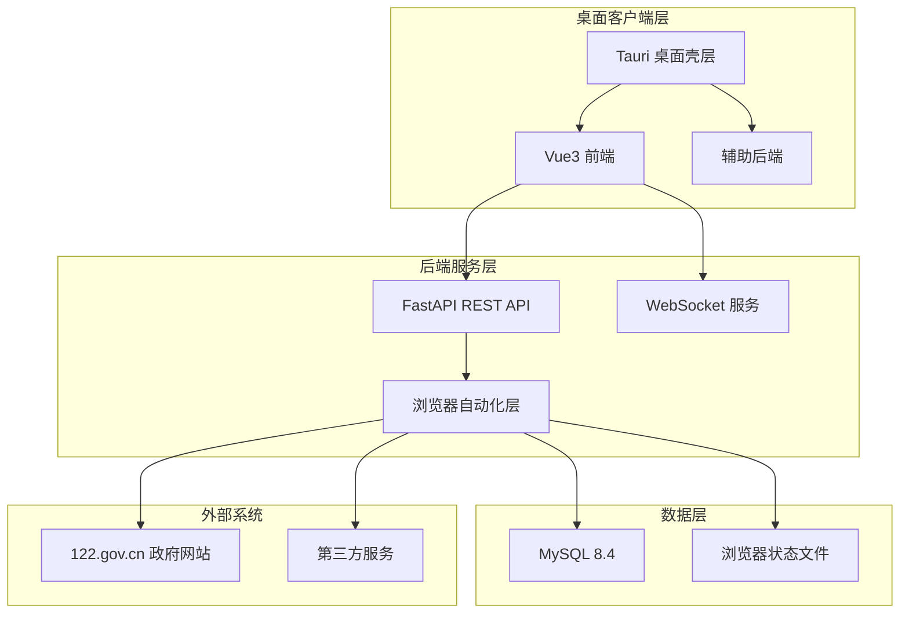
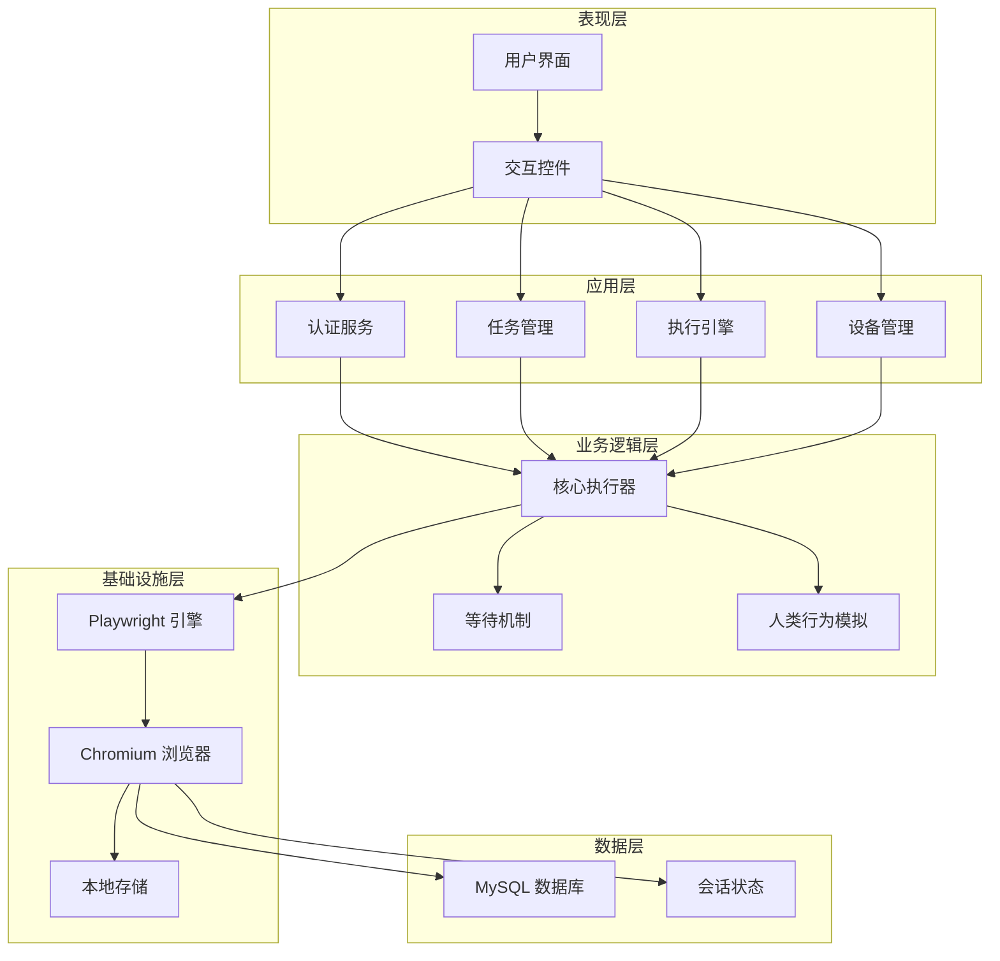
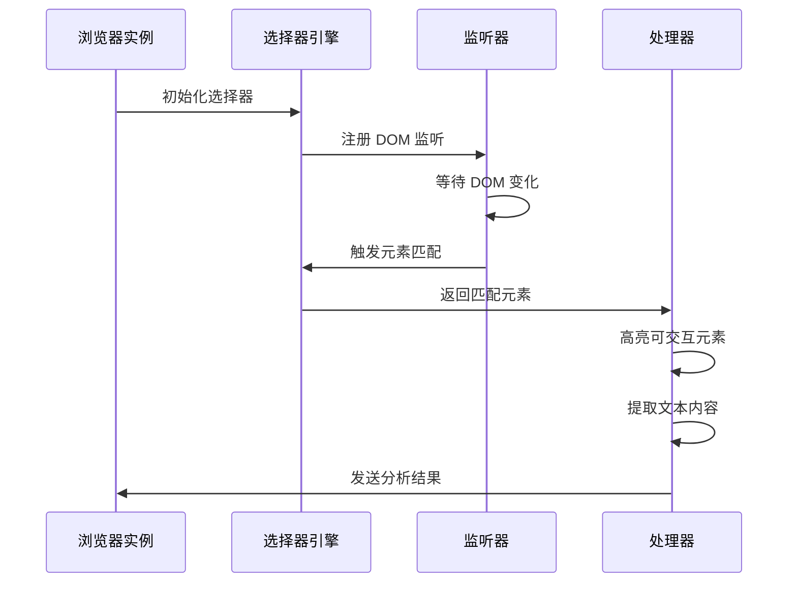
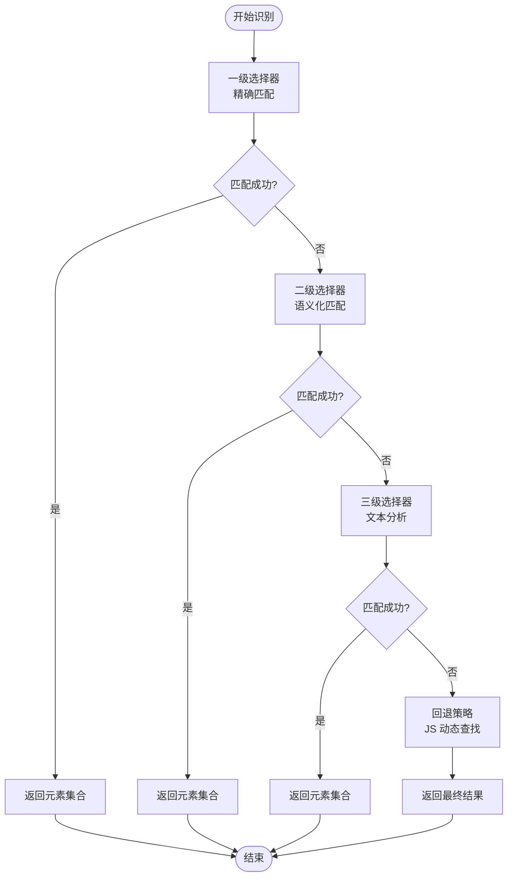
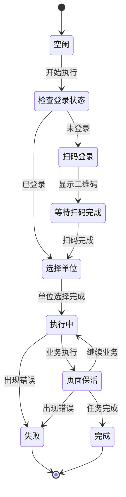
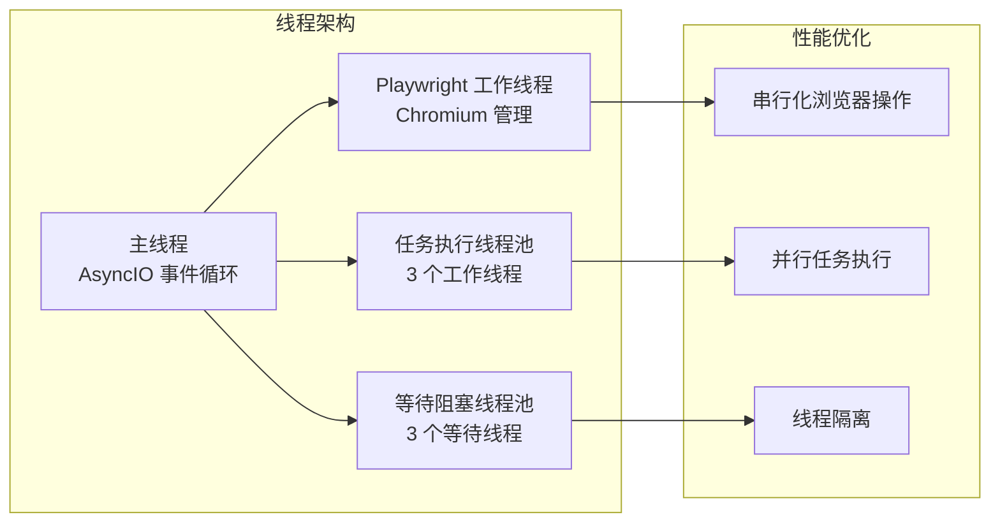

# Content Script 页面注入模块

<cite>
**本文引用的文件**
- [project.md](file://project.md)
- [tauri.conf.json](file://CCC-BrowserV4/src-tauri/tauri.conf.json)
- [default.json](file://CCC-BrowserV4/src-tauri/capabilities/default.json)
- [package.json](file://CCC-BrowserV4/frontend/package.json)
- [main.ts](file://CCC-BrowserV4/frontend/src/main.ts)
- [App.vue](file://CCC-BrowserV4/frontend/src/App.vue)
- [ExecutionPanel.vue](file://CCC-BrowserV4/frontend/src/components/ExecutionPanel.vue)
- [HomePage.vue](file://CCC-BrowserV4/frontend/src/pages/HomePage.vue)
</cite>

## 目录
1. [简介](#简介)
2. [项目结构](#项目结构)
3. [核心组件](#核心组件)
4. [架构概览](#架构概览)
5. [详细组件分析](#详细组件分析)
6. [依赖关系分析](#依赖关系分析)
7. [性能考虑](#性能考虑)
8. [故障排除指南](#故障排除指南)
9. [结论](#结论)

## 简介

根据项目文档分析，当前代码库主要实现了基于 Playwright 的浏览器自动化系统，而非传统的 Chrome 扩展内容脚本。该项目采用桌面应用架构，通过 Tauri 桌面壳层承载 Vue3 前端界面，后端使用 Python FastAPI 提供 REST API 和 WebSocket 服务。

**章节来源**
- [project.md:1-800](file://project.md#L1-L800)

## 项目结构

项目采用五层架构设计，包含桌面客户端、后端 API、数据库等组件：



**图表来源**
- [project.md:34-66](file://project.md#L34-L66)
- [tauri.conf.json:1-29](file://CCC-BrowserV4/src-tauri/tauri.conf.json#L1-L29)

**章节来源**
- [project.md:159-260](file://project.md#L159-L260)
- [tauri.conf.json:1-29](file://CCC-BrowserV4/src-tauri/tauri.conf.json#L1-L29)

## 核心组件

### 浏览器自动化核心

项目的核心是基于 Playwright 的浏览器自动化系统，包含以下关键组件：

#### 1. 会话管理器
- **职责**：按省份隔离管理浏览器会话
- **特性**：支持 storage_state 持久化、会话恢复、崩溃自动恢复
- **实现**：通过专用工作线程执行所有 Playwright 操作

#### 2. 站点自动化引擎
- **职责**：实现 122.gov.cn 全站自动化
- **功能**：登录状态检测、二维码截取、单位列表抓取、页面保活
- **算法**：多级选择器降级策略，智能业务检测

#### 3. 人类行为模拟
- **职责**：模拟真人操作行为
- **策略**：随机延迟、随机点击位置、随机打字速度、随机滚动
- **目标**：规避反自动化检测

**章节来源**
- [project.md:265-306](file://project.md#L265-L306)
- [project.md:474-546](file://project.md#L474-L546)

### 前端交互层

#### Vue3 前端架构
- **技术栈**：Vue3 + Pinia + Element Plus + TypeScript
- **状态管理**：四个核心 Store（认证、任务、执行、设备）
- **组件化**：模块化的页面和组件设计

#### 执行面板组件
- **功能**：实时展示执行状态、二维码显示、单位选择
- **状态机**：完整的执行状态管理（idle → checking_login → qr_scanning → waiting_company → executing → keeping_alive → completed）

**章节来源**
- [project.md:307-346](file://project.md#L307-L346)
- [ExecutionPanel.vue:1-322](file://CCC-BrowserV4/frontend/src/components/ExecutionPanel.vue#L1-L322)

## 架构概览

系统采用分层架构，各层职责清晰分离：



**图表来源**
- [project.md:68-100](file://project.md#L68-L100)
- [project.md:265-306](file://project.md#L265-L306)

**章节来源**
- [project.md:68-100](file://project.md#L68-L100)
- [project.md:104-150](file://project.md#L104-L150)

## 详细组件分析

### 内容脚本替代方案

由于项目采用桌面应用架构而非传统浏览器扩展，因此没有直接的内容脚本实现。但系统提供了类似的功能：

#### DOM 监听机制
虽然不是传统内容脚本，但系统通过以下方式实现 DOM 监听：



**图表来源**
- [project.md:474-546](file://project.md#L474-L546)

#### 元素识别算法
系统采用多级选择器降级策略：



**图表来源**
- [project.md:513-525](file://project.md#L513-L525)

#### 数据提取策略
系统实现多层次的数据提取：

1. **结构化数据提取**：优先提取 HTML 语义化标签中的结构化信息
2. **文本内容提取**：提取可见文本，过滤广告和无关内容
3. **属性信息提取**：提取元素的属性值用于后续处理
4. **坐标信息提取**：提取元素位置信息用于模拟交互

**章节来源**
- [project.md:513-539](file://project.md#L513-L539)

### 执行状态机

系统实现了完整的执行状态机管理：



**图表来源**
- [ExecutionPanel.vue:548-556](file://CCC-BrowserV4/frontend/src/components/ExecutionPanel.vue#L548-L556)

**章节来源**
- [ExecutionPanel.vue:1-322](file://CCC-BrowserV4/frontend/src/components/ExecutionPanel.vue#L1-L322)

## 依赖关系分析

### 技术栈依赖

```mermaid
graph TB
subgraph "前端技术栈"
Vue[Vue3]
Pinia[Pinia]
TS[TypeScript]
EP[Element Plus]
Axios[Axios]
end
subgraph "桌面应用"
Tauri[Tauri 2]
Rust[Rust]
CLI[@tauri-apps/cli]
end
subgraph "后端技术栈"
FastAPI[FastAPI]
PW[Playwright]
SQL[SQLAlchemy]
Uvicorn[Uvicorn]
end
subgraph "数据库"
MySQL[MySQL 8.4]
Docker[Docker]
end
Vue --> Pinia
Vue --> EP
Vue --> Axios
Tauri --> Rust
Tauri --> CLI
FastAPI --> PW
FastAPI --> SQL
FastAPI --> Uvicorn
PW --> MySQL
FastAPI --> Docker
```

**图表来源**
- [project.md:104-150](file://project.md#L104-L150)
- [package.json:1-29](file://CCC-BrowserV4/frontend/package.json#L1-L29)

**章节来源**
- [project.md:104-150](file://project.md#L104-L150)
- [package.json:1-29](file://CCC-BrowserV4/frontend/package.json#L1-L29)

### 权限配置

Tauri 应用具有严格的权限控制：

| 权限类别 | 权限名称 | 描述 |
|---------|---------|------|
| 核心权限 | core:default | 基础应用权限 |
| Shell 权限 | shell:allow-open | 打开外部链接 |
| 存储权限 | store:default | 本地键值存储 |
| 打开器权限 | opener:default | 外部应用打开 |

**章节来源**
- [default.json:6-11](file://CCC-BrowserV4/src-tauri/capabilities/default.json#L6-L11)

## 性能考虑

### 线程模型优化

系统采用多线程架构确保性能：



**图表来源**
- [project.md:661-680](file://project.md#L661-L680)

### 反检测策略

系统实施多层次反检测措施：

1. **浏览器特征隐藏**：禁用 AutomationControlled 特征
2. **人类行为模拟**：随机延迟、随机操作
3. **请求头伪装**：模拟真实浏览器请求
4. **网络行为优化**：避免异常网络模式

**章节来源**
- [project.md:647-654](file://project.md#L647-L654)
- [project.md:682-684](file://project.md#L682-L684)

## 故障排除指南

### 常见问题诊断

#### 登录流程问题
- **症状**：二维码无法显示或扫码无效
- **排查步骤**：
  1. 检查网络连接和代理设置
  2. 验证浏览器状态文件完整性
  3. 确认会话管理器正常运行

#### 执行中断问题
- **症状**：任务执行过程中断
- **排查步骤**：
  1. 检查线程池状态
  2. 验证 Playwright 实例健康
  3. 查看执行日志和错误信息

#### 性能问题
- **症状**：执行速度慢或内存占用高
- **排查步骤**：
  1. 监控线程池使用情况
  2. 检查浏览器实例数量
  3. 分析内存泄漏情况

**章节来源**
- [project.md:688-713](file://project.md#L688-L713)

## 结论

该项目虽然没有实现传统的 Chrome 扩展内容脚本，但通过桌面应用架构提供了更强大和可控的浏览器自动化解决方案。系统的核心优势包括：

1. **架构清晰**：五层架构设计，职责分离明确
2. **性能优异**：多线程并发执行，资源利用率高
3. **稳定性强**：完善的错误处理和恢复机制
4. **可扩展性好**：模块化设计便于功能扩展

对于需要实现内容脚本功能的场景，建议考虑以下替代方案：
- 使用现有的浏览器扩展框架
- 采用 WebView 技术集成到桌面应用
- 实现基于 CSP 的安全内容注入

**章节来源**
- [project.md:1-800](file://project.md#L1-L800)