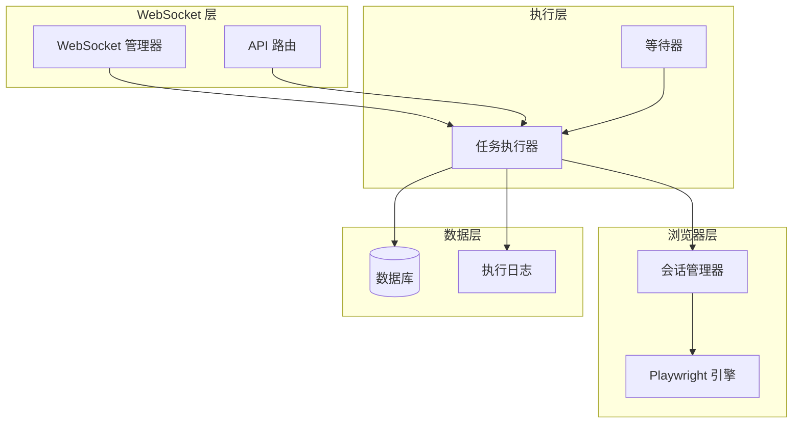
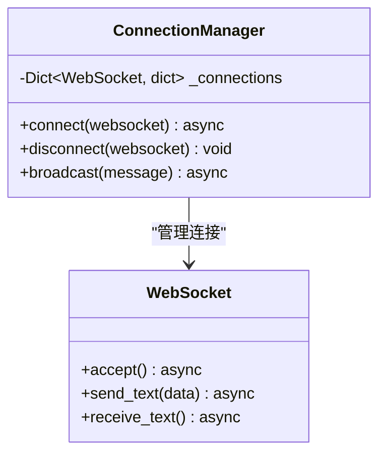
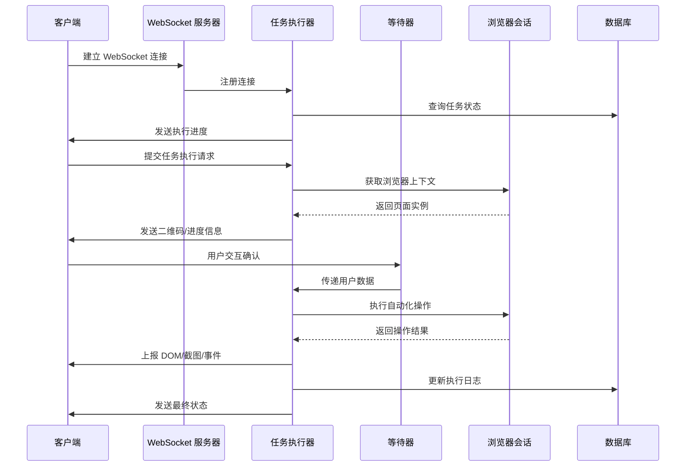
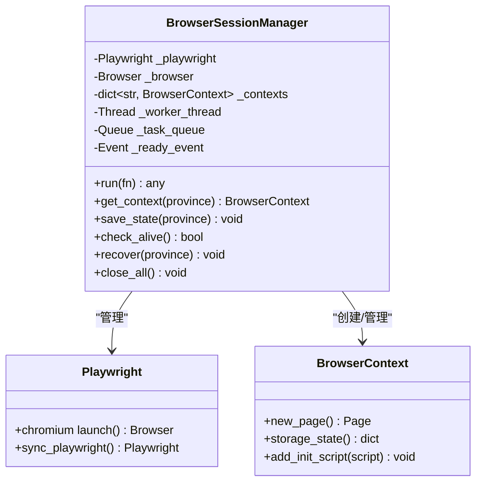
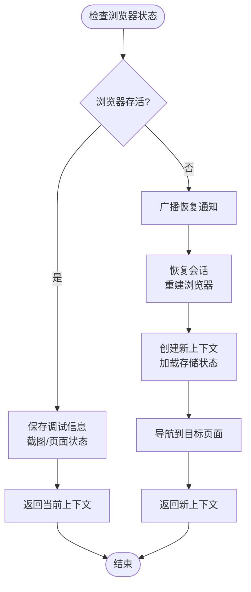
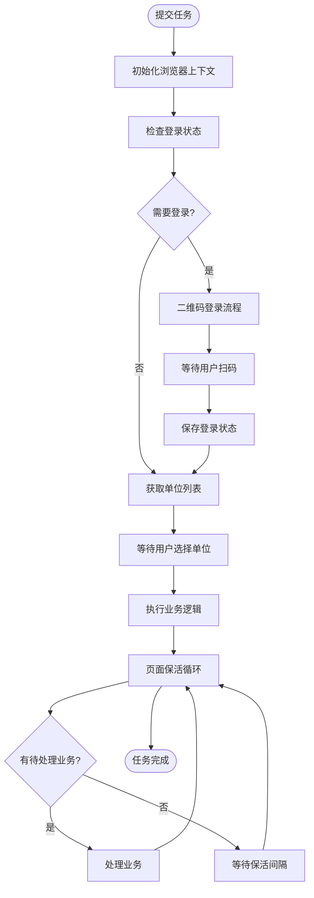
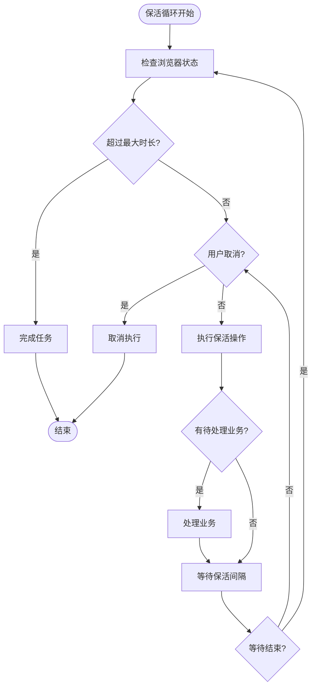
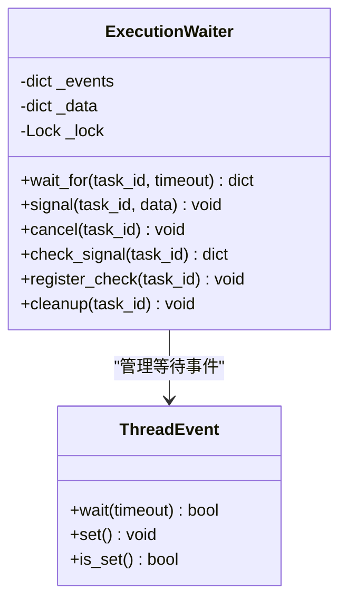
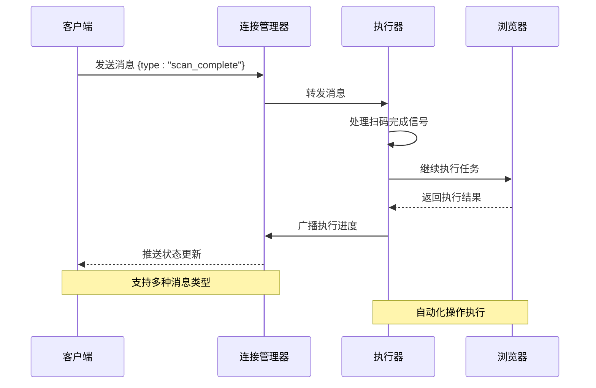
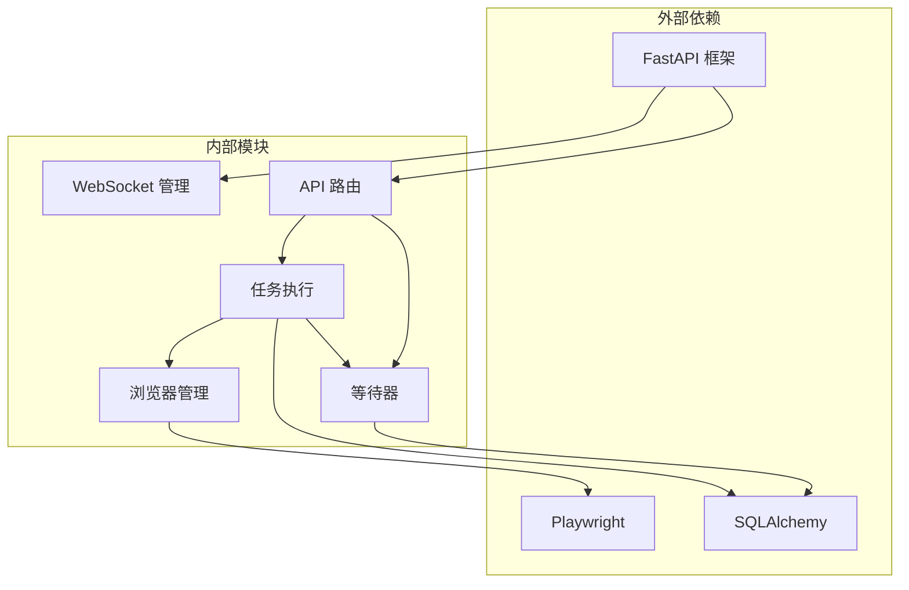

# Service Worker 后台模块

<cite>
**本文档引用的文件**
- [manager.py](file://CCC_RPA_API/app/ws/manager.py)
- [main.py](file://CCC_RPA_API/app/main.py)
- [session_manager.py](file://CCC_RPA_API/app/browser/session_manager.py)
- [executor.py](file://CCC_RPA_API/app/services/executor.py)
- [site_automation.py](file://CCC_RPA_API/app/browser/site_automation.py)
- [waiter.py](file://CCC_RPA_API/app/browser/waiter.py)
- [tasks.py](file://CCC_RPA_API/app/api/tasks.py)
- [execution.py](file://CCC_RPA_API/app/schemas/execution.py)
- [task.py](file://CCC_RPA_API/app/models/task.py)
- [execution_log.py](file://CCC_RPA_API/app/models/execution_log.py)
</cite>

## 目录
1. [简介](#简介)
2. [项目结构](#项目结构)
3. [核心组件](#核心组件)
4. [架构概览](#架构概览)
5. [详细组件分析](#详细组件分析)
6. [依赖关系分析](#依赖关系分析)
7. [性能考虑](#性能考虑)
8. [故障排除指南](#故障排除指南)
9. [结论](#结论)

## 简介

Service Worker 后台模块是 CCC RPA 系统的核心执行引擎，负责维护 WebSocket 长连接、接收 AI/自动化指令、转发 CDP 操作和上报页面 DOM、截图、交互事件。该模块采用异步架构设计，通过专用的 Playwright 工作线程管理浏览器会话，确保自动化任务的稳定执行。

系统主要功能包括：
- WebSocket 长连接管理与消息路由
- Playwright 浏览器会话生命周期管理
- 自动化任务执行与状态监控
- 用户交互等待与信号传递
- 错误处理与连接重试策略

## 项目结构

**图表来源**
- [main.py:119-127](file://CCC_RPA_API/app/main.py#L119-L127)
- [manager.py:5-29](file://CCC_RPA_API/app/ws/manager.py#L5-L29)
- [executor.py:12-33](file://CCC_RPA_API/app/services/executor.py#L12-L33)

**章节来源**
- [main.py:1-127](file://CCC_RPA_API/app/main.py#L1-L127)
- [manager.py:1-29](file://CCC_RPA_API/app/ws/manager.py#L1-L29)

## 核心组件

### WebSocket 连接管理器

ConnectionManager 类负责维护所有 WebSocket 连接，提供连接接受、断开和广播消息功能：

**图表来源**
- [manager.py:5-29](file://CCC_RPA_API/app/ws/manager.py#L5-L29)

### 任务执行器

任务执行器是系统的核心协调者，负责：
- 在工作线程中安全地广播 WebSocket 消息
- 管理 Playwright 工作线程的生命周期
- 协调浏览器会话状态检查与恢复
- 处理用户交互等待与信号传递

**章节来源**
- [executor.py:1-319](file://CCC_RPA_API/app/services/executor.py#L1-L319)

## 架构概览

**图表来源**
- [main.py:119-127](file://CCC_RPA_API/app/main.py#L119-L127)
- [executor.py:78-315](file://CCC_RPA_API/app/services/executor.py#L78-L315)
- [waiter.py:14-84](file://CCC_RPA_API/app/browser/waiter.py#L14-L84)

## 详细组件分析

### 浏览器会话管理器

BrowserSessionManager 是系统的关键组件，采用专用工作线程模式管理 Playwright 会话：

**图表来源**
- [session_manager.py:10-186](file://CCC_RPA_API/app/browser/session_manager.py#L10-L186)

#### 会话恢复机制

系统实现了智能的会话恢复策略：

**图表来源**
- [executor.py:42-69](file://CCC_RPA_API/app/services/executor.py#L42-L69)
- [session_manager.py:157-170](file://CCC_RPA_API/app/browser/session_manager.py#L157-L170)

**章节来源**
- [session_manager.py:1-186](file://CCC_RPA_API/app/browser/session_manager.py#L1-L186)
- [executor.py:42-69](file://CCC_RPA_API/app/services/executor.py#L42-L69)

### 任务执行流程

任务执行器实现了完整的自动化执行流程：

**图表来源**
- [executor.py:78-267](file://CCC_RPA_API/app/services/executor.py#L78-L267)

#### 保活机制

系统实现了智能的页面保活策略：

**图表来源**
- [executor.py:208-266](file://CCC_RPA_API/app/services/executor.py#L208-L266)

**章节来源**
- [executor.py:78-315](file://CCC_RPA_API/app/services/executor.py#L78-L315)

### 用户交互等待器

ExecutionWaiter 提供了线程安全的用户交互等待机制：

**图表来源**
- [waiter.py:7-84](file://CCC_RPA_API/app/browser/waiter.py#L7-L84)

**章节来源**
- [waiter.py:1-84](file://CCC_RPA_API/app/browser/waiter.py#L1-L84)

### WebSocket 消息路由

系统实现了基于消息类型的路由机制：

**图表来源**
- [manager.py:17-26](file://CCC_RPA_API/app/ws/manager.py#L17-L26)
- [tasks.py:60-75](file://CCC_RPA_API/app/api/tasks.py#L60-L75)

**章节来源**
- [manager.py:1-29](file://CCC_RPA_API/app/ws/manager.py#L1-L29)
- [tasks.py:1-76](file://CCC_RPA_API/app/api/tasks.py#L1-L76)

## 依赖关系分析

**图表来源**
- [main.py:1-127](file://CCC_RPA_API/app/main.py#L1-L127)
- [executor.py:1-319](file://CCC_RPA_API/app/services/executor.py#L1-L319)

**章节来源**
- [main.py:1-127](file://CCC_RPA_API/app/main.py#L1-L127)
- [executor.py:1-319](file://CCC_RPA_API/app/services/executor.py#L1-L319)

## 性能考虑

### 线程池配置
- 任务执行线程池：3个工作线程
- 等待阻塞线程池：3个工作线程
- 避免阻塞 Playwright 工作线程

### 内存管理
- 自动清理浏览器上下文
- 定期保存登录状态
- 监控内存使用情况

### 网络优化
- 使用连接池管理数据库连接
- 异步消息处理
- 批量操作优化

## 故障排除指南

### 常见问题及解决方案

#### 浏览器会话异常
**症状**：任务执行过程中浏览器崩溃
**解决方法**：
1. 检查浏览器日志输出
2. 触发自动恢复机制
3. 重新建立浏览器会话

#### WebSocket 连接中断
**症状**：客户端无法接收状态更新
**解决方法**：
1. 检查网络连接稳定性
2. 验证服务器端口开放
3. 重启 WebSocket 服务

#### 任务执行超时
**症状**：用户交互等待超时
**解决方法**：
1. 增加等待超时时间
2. 检查用户操作流程
3. 优化页面加载速度

### 调试技巧

#### 日志分析
- 启用详细日志级别
- 监控关键操作时间戳
- 分析错误堆栈信息

#### 性能监控
- 监控内存使用情况
- 分析任务执行时间
- 检查数据库连接池状态

#### 浏览器调试
- 使用开发者工具检查页面状态
- 监控网络请求
- 分析 JavaScript 执行情况

**章节来源**
- [executor.py:22-33](file://CCC_RPA_API/app/services/executor.py#L22-L33)
- [session_manager.py:147-154](file://CCC_RPA_API/app/browser/session_manager.py#L147-L154)

## 结论

Service Worker 后台模块通过精心设计的架构实现了可靠的自动化任务执行。其核心优势包括：

1. **高可靠性**：智能的会话恢复机制确保任务连续性
2. **高性能**：专用工作线程分离 I/O 密集型和 CPU 密集型操作
3. **可观测性**：完整的执行日志和状态上报机制
4. **可扩展性**：模块化的组件设计支持功能扩展

该模块为 RPA 系统提供了稳定的基础，能够处理复杂的自动化任务场景，并具备良好的错误处理和恢复能力。