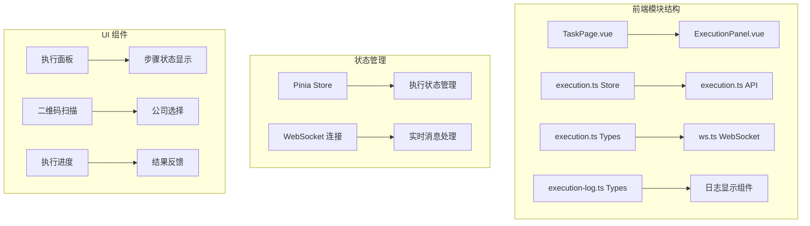
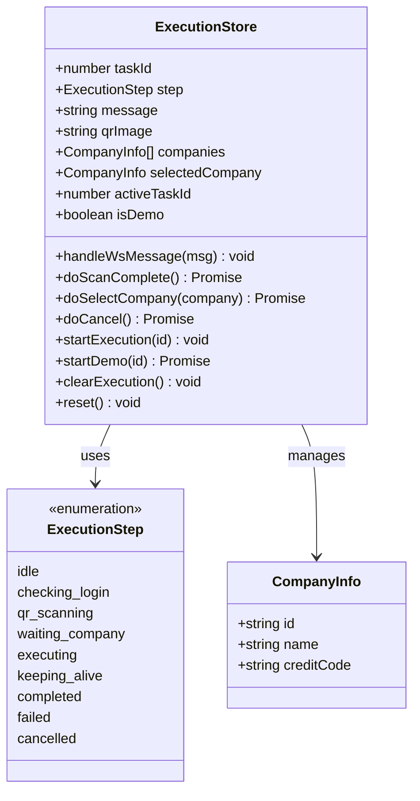
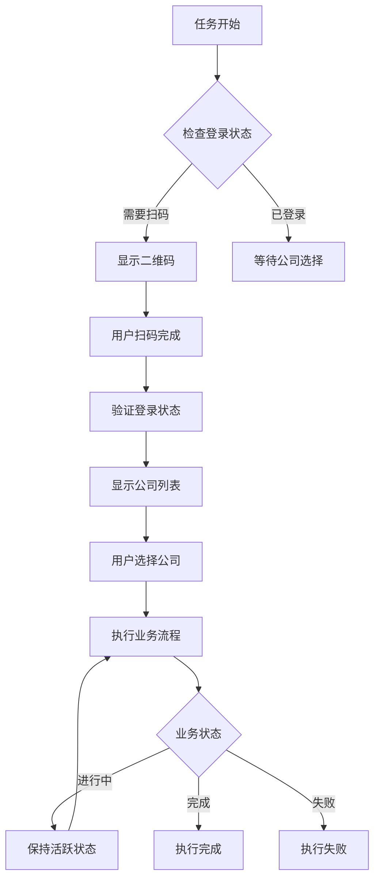
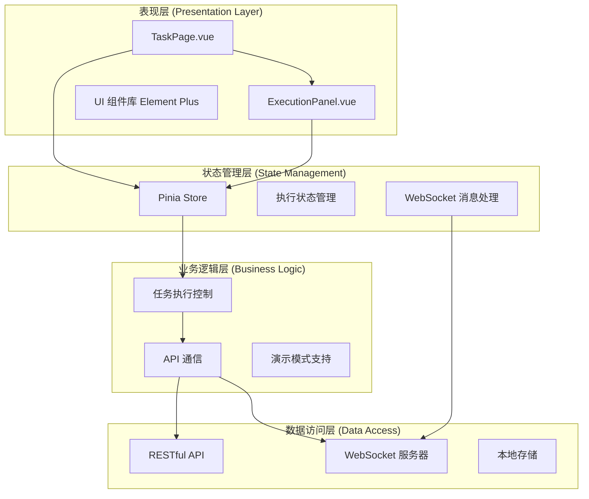
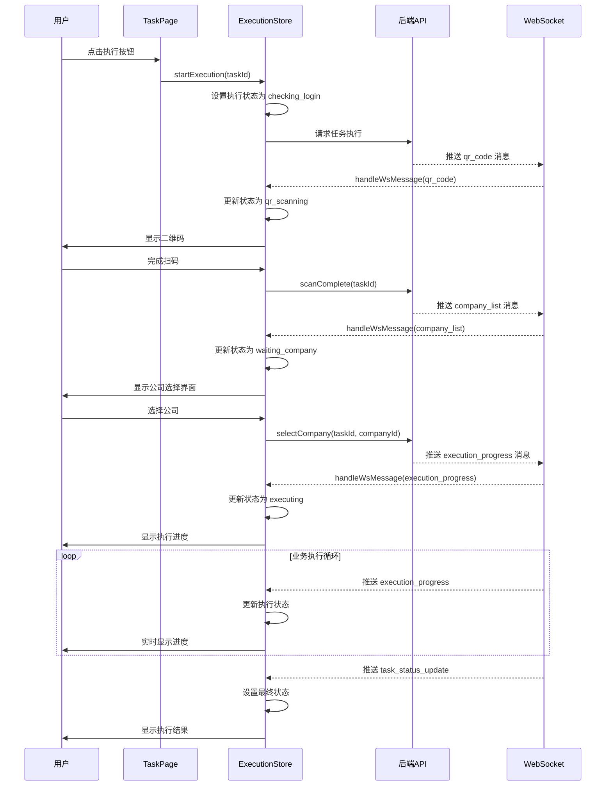
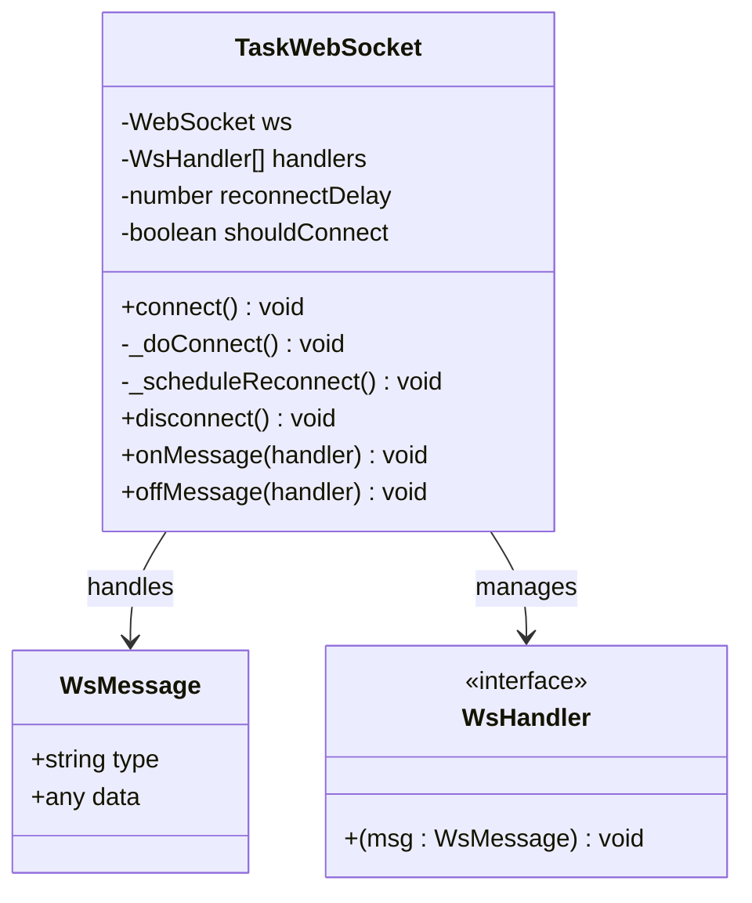
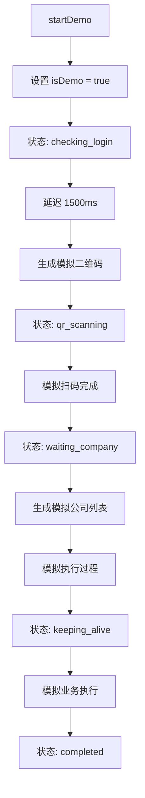
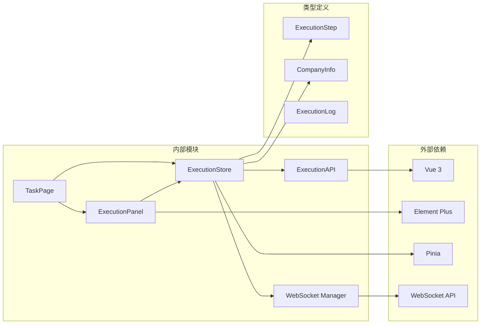

# SidePanel 侧边面板模块

<cite>
**本文档引用的文件**
- [ExecutionPanel.vue](file://CCC-BrowserV4/frontend/src/components/ExecutionPanel.vue)
- [execution.ts](file://CCC-BrowserV4/frontend/src/stores/execution.ts)
- [execution.ts](file://CCC-BrowserV4/frontend/src/types/execution.ts)
- [execution.ts](file://CCC-BrowserV4/frontend/src/api/execution.ts)
- [TaskPage.vue](file://CCC-BrowserV4/frontend/src/pages/TaskPage.vue)
- [ws.ts](file://CCC-BrowserV4/frontend/src/api/ws.ts)
- [execution-log.ts](file://CCC-BrowserV4/frontend/src/types/execution-log.ts)
</cite>

## 目录
1. [简介](#简介)
2. [项目结构](#项目结构)
3. [核心组件](#核心组件)
4. [架构概览](#架构概览)
5. [详细组件分析](#详细组件分析)
6. [依赖关系分析](#依赖关系分析)
7. [性能考虑](#性能考虑)
8. [故障排除指南](#故障排除指南)
9. [结论](#结论)

## 简介

SidePanel 侧边面板模块是 CCC-BrowserV4 项目中的核心执行控制组件，负责管理人工操作页面、自然语言 AI 指令输入、实时查看会话日志与截图、一键录制人工操作生成 Playwright 脚本、加密导出会话登录快照等高级功能。该模块采用 Vue 3 Composition API 和 Pinia 状态管理，结合 WebSocket 实现实时通信，为用户提供完整的 RPA 执行监控和控制体验。

## 项目结构

SidePanel 模块在项目中的组织结构如下：

**图表来源**
- [TaskPage.vue:1-428](file://CCC-BrowserV4/frontend/src/pages/TaskPage.vue#L1-L428)
- [ExecutionPanel.vue:1-322](file://CCC-BrowserV4/frontend/src/components/ExecutionPanel.vue#L1-L322)
- [execution.ts:1-229](file://CCC-BrowserV4/frontend/src/stores/execution.ts#L1-L229)

**章节来源**
- [TaskPage.vue:1-428](file://CCC-BrowserV4/frontend/src/pages/TaskPage.vue#L1-L428)
- [ExecutionPanel.vue:1-322](file://CCC-BrowserV4/frontend/src/components/ExecutionPanel.vue#L1-L322)
- [execution.ts:1-229](file://CCC-BrowserV4/frontend/src/stores/execution.ts#L1-L229)

## 核心组件

### 执行状态管理器

执行状态管理器是整个 SidePanel 模块的核心，负责管理任务执行的完整生命周期：

**图表来源**
- [execution.ts:6-229](file://CCC-BrowserV4/frontend/src/stores/execution.ts#L6-L229)
- [execution.ts:1-17](file://CCC-BrowserV4/frontend/src/types/execution.ts#L1-L17)

### 执行面板组件

执行面板组件提供可视化的执行状态展示和用户交互：

**图表来源**
- [ExecutionPanel.vue:110-128](file://CCC-BrowserV4/frontend/src/components/ExecutionPanel.vue#L110-L128)
- [execution.ts:22-67](file://CCC-BrowserV4/frontend/src/stores/execution.ts#L22-L67)

**章节来源**
- [execution.ts:1-229](file://CCC-BrowserV4/frontend/src/stores/execution.ts#L1-L229)
- [ExecutionPanel.vue:1-322](file://CCC-BrowserV4/frontend/src/components/ExecutionPanel.vue#L1-L322)

## 架构概览

SidePanel 模块采用分层架构设计，实现了清晰的关注点分离：

**图表来源**
- [TaskPage.vue:138-166](file://CCC-BrowserV4/frontend/src/pages/TaskPage.vue#L138-L166)
- [execution.ts:1-229](file://CCC-BrowserV4/frontend/src/stores/execution.ts#L1-L229)
- [ws.ts:8-88](file://CCC-BrowserV4/frontend/src/api/ws.ts#L8-L88)

## 详细组件分析

### 任务执行流程控制

任务执行流程是 SidePanel 模块的核心功能，实现了完整的自动化执行控制：

**图表来源**
- [TaskPage.vue:255-267](file://CCC-BrowserV4/frontend/src/pages/TaskPage.vue#L255-L267)
- [execution.ts:122-132](file://CCC-BrowserV4/frontend/src/stores/execution.ts#L122-L132)
- [execution.ts:69-108](file://CCC-BrowserV4/frontend/src/stores/execution.ts#L69-L108)
- [execution.ts:22-67](file://CCC-BrowserV4/frontend/src/stores/execution.ts#L22-L67)

### WebSocket 实时通信机制

WebSocket 通信机制确保了执行状态的实时更新和用户交互的即时响应：

**图表来源**
- [ws.ts:8-88](file://CCC-BrowserV4/frontend/src/api/ws.ts#L8-L88)

### 演示模式实现

演示模式提供了在后端服务不可用时的完整功能演示能力：

**图表来源**
- [execution.ts:135-180](file://CCC-BrowserV4/frontend/src/stores/execution.ts#L135-L180)

**章节来源**
- [TaskPage.vue:255-271](file://CCC-BrowserV4/frontend/src/pages/TaskPage.vue#L255-L271)
- [execution.ts:69-120](file://CCC-BrowserV4/frontend/src/stores/execution.ts#L69-L120)
- [ws.ts:20-56](file://CCC-BrowserV4/frontend/src/api/ws.ts#L20-L56)

## 依赖关系分析

SidePanel 模块的依赖关系展现了清晰的模块化设计：

**图表来源**
- [TaskPage.vue:144-150](file://CCC-BrowserV4/frontend/src/pages/TaskPage.vue#L144-L150)
- [ExecutionPanel.vue:113-118](file://CCC-BrowserV4/frontend/src/components/ExecutionPanel.vue#L113-L118)
- [execution.ts:1-6](file://CCC-BrowserV4/frontend/src/stores/execution.ts#L1-L6)

**章节来源**
- [execution.ts:1-229](file://CCC-BrowserV4/frontend/src/stores/execution.ts#L1-L229)
- [execution.ts:1-17](file://CCC-BrowserV4/frontend/src/types/execution.ts#L1-L17)

## 性能考虑

SidePanel 模块在设计时充分考虑了性能优化：

### 状态管理优化
- 使用 Pinia 的响应式状态管理，避免不必要的组件重新渲染
- 通过计算属性 `isExecuting` 提供高效的执行状态判断
- 演示模式下的本地状态模拟，减少网络请求开销

### WebSocket 连接管理
- 自动重连机制，确保连接稳定性
- 消息过滤机制，只处理相关任务的消息
- 连接池管理，避免重复连接

### UI 性能优化
- 条件渲染策略，根据执行状态动态显示相应内容
- 防抖机制用于搜索和筛选操作
- 虚拟滚动支持大量任务列表的高效渲染

## 故障排除指南

### 常见问题及解决方案

**执行状态异常**
- 症状：执行状态卡在某个步骤
- 解决方案：检查 WebSocket 连接状态，重启执行流程

**二维码显示问题**
- 症状：二维码无法正常显示或刷新
- 解决方案：验证后端二维码生成服务，检查网络连接

**公司选择功能失效**
- 症状：无法选择公司或选择后无响应
- 解决方案：确认任务状态为 `waiting_company`，检查 API 响应

**WebSocket 连接中断**
- 症状：执行状态不更新或消息延迟
- 解决方案：检查网络连接，等待自动重连或手动刷新页面

**章节来源**
- [execution.ts:22-67](file://CCC-BrowserV4/frontend/src/stores/execution.ts#L22-L67)
- [ws.ts:58-64](file://CCC-BrowserV4/frontend/src/api/ws.ts#L58-L64)

## 结论

SidePanel 侧边面板模块通过精心设计的架构和实现，为用户提供了完整的 RPA 执行控制体验。模块采用了现代化的前端技术栈，结合 WebSocket 实现实时通信，实现了从任务执行到状态监控的全流程管理。

该模块的主要优势包括：

1. **完整的执行生命周期管理**：从登录验证到业务执行的每个环节都有明确的状态控制
2. **实时通信机制**：通过 WebSocket 确保执行状态的即时更新
3. **灵活的演示模式**：在后端服务不可用时仍能提供完整的功能演示
4. **用户友好的界面设计**：直观的状态指示和操作反馈
5. **健壮的错误处理**：完善的异常处理和恢复机制

未来可以考虑的功能扩展包括：
- 增强的日志记录和分析功能
- 更丰富的会话管理和导出选项
- 支持更多类型的 AI 指令输入
- 集成更多的自动化录制和回放功能