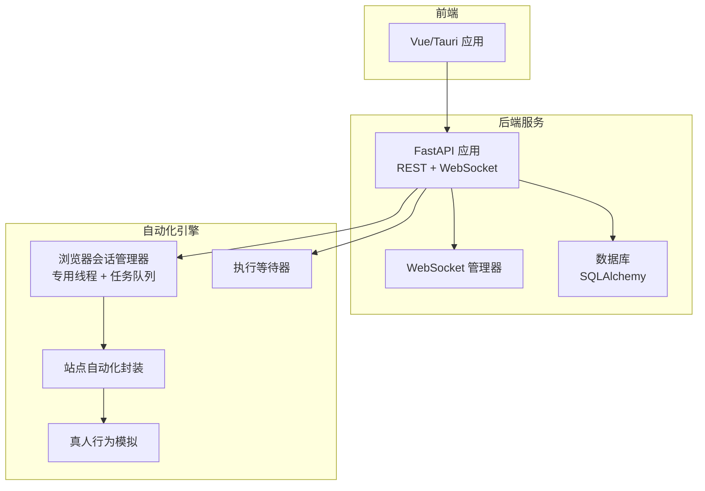
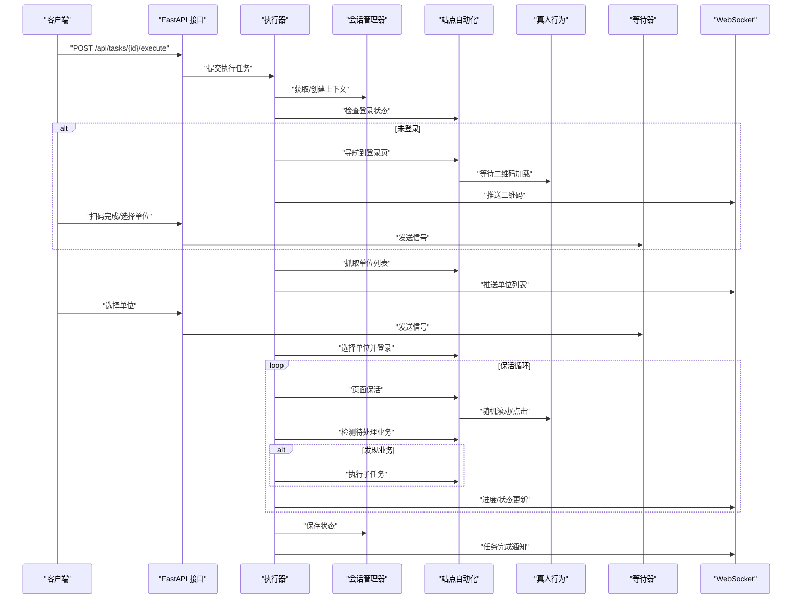
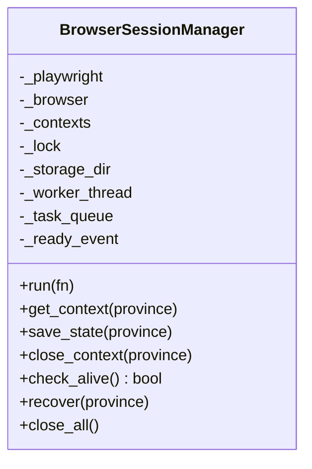
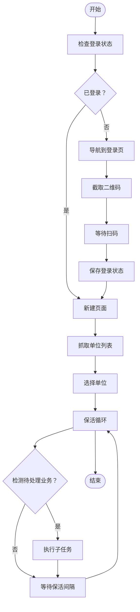
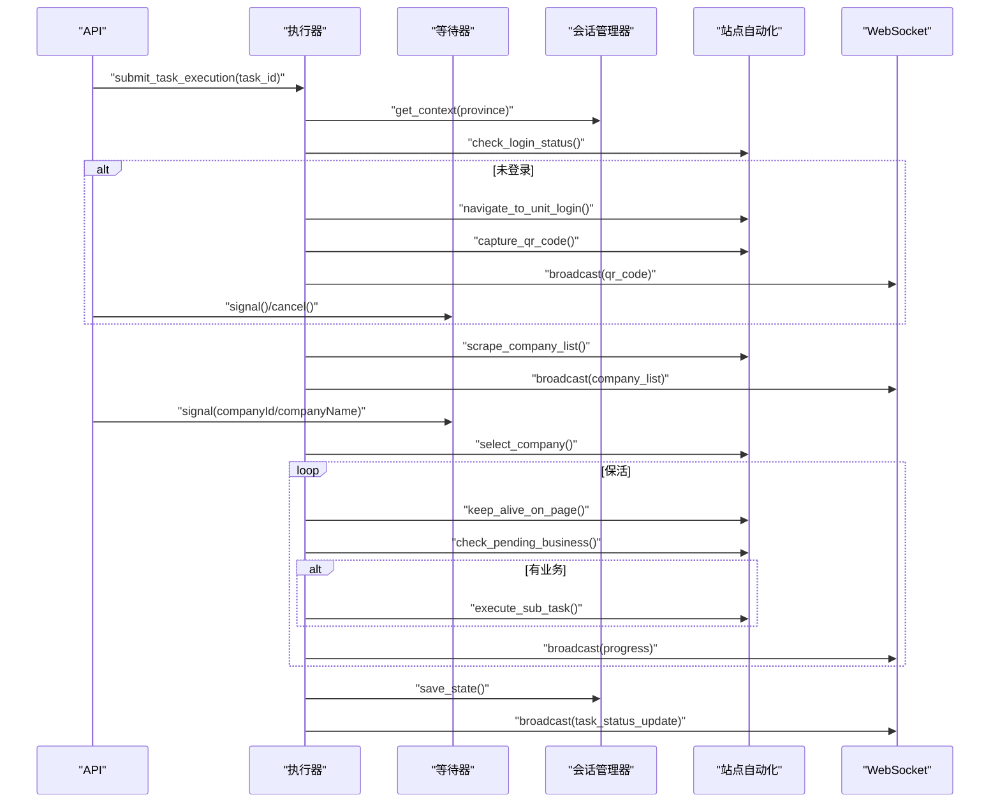
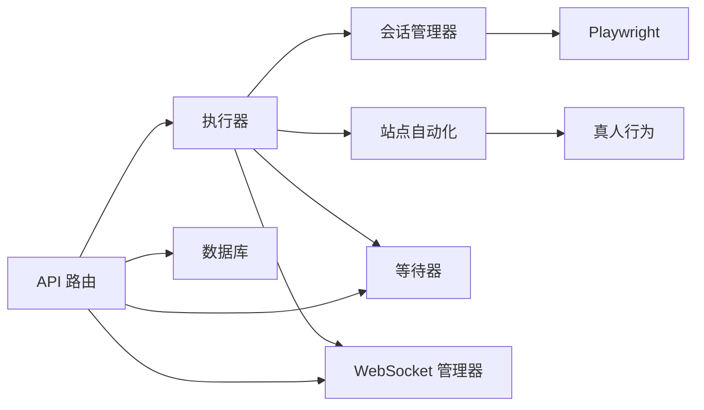

# Playwright SDK 开发

<cite>
**本文档引用的文件**
- [main.py](file://CCC_RPA_API/app/main.py)
- [session_manager.py](file://CCC_RPA_API/app/browser/session_manager.py)
- [site_automation.py](file://CCC_RPA_API/app/browser/site_automation.py)
- [executor.py](file://CCC_RPA_API/app/services/executor.py)
- [human_behavior.py](file://CCC_RPA_API/app/browser/human_behavior.py)
- [waiter.py](file://CCC_RPA_API/app/browser/waiter.py)
- [tasks.py](file://CCC_RPA_API/app/api/tasks.py)
- [manager.py](file://CCC_RPA_API/app/ws/manager.py)
- [task.py](file://CCC_RPA_API/app/models/task.py)
- [execution_log.py](file://CCC_RPA_API/app/models/execution_log.py)
</cite>

## 目录
1. [简介](#简介)
2. [项目结构](#项目结构)
3. [核心组件](#核心组件)
4. [架构总览](#架构总览)
5. [详细组件分析](#详细组件分析)
6. [依赖关系分析](#依赖关系分析)
7. [性能考量](#性能考量)
8. [故障排查指南](#故障排查指南)
9. [结论](#结论)
10. [附录](#附录)

## 简介
本项目围绕“122.gov.cn”站点的自动化执行，构建了一套基于 Playwright 的 RPA SDK。其目标是屏蔽底层 Pod/进程、端口、CDP 等复杂细节，向上提供简洁易用的 API 接口，涵盖页面操作封装、任务队列集成、远程接口设计与错误处理机制。系统通过专用工作线程隔离 Playwright 同步 API，结合线程池与 WebSocket 实时通信，实现稳定可靠的自动化执行。

## 项目结构
项目采用前后端分离与服务端自动化相结合的架构：
- 后端服务：FastAPI 提供 REST 接口与 WebSocket 广播
- 自动化引擎：Playwright 在专用线程中运行，通过任务队列调度
- 数据层：SQLAlchemy ORM 管理任务与执行日志
- 前端：Vue + Tauri 应用负责用户交互与实时状态展示

**图表来源**
- [main.py:12-127](file://CCC_RPA_API/app/main.py#L12-L127)
- [manager.py:1-29](file://CCC_RPA_API/app/ws/manager.py#L1-L29)
- [session_manager.py:10-186](file://CCC_RPA_API/app/browser/session_manager.py#L10-L186)
- [site_automation.py:16-743](file://CCC_RPA_API/app/browser/site_automation.py#L16-L743)
- [human_behavior.py:12-86](file://CCC_RPA_API/app/browser/human_behavior.py#L12-L86)
- [waiter.py:7-84](file://CCC_RPA_API/app/browser/waiter.py#L7-L84)

**章节来源**
- [main.py:12-127](file://CCC_RPA_API/app/main.py#L12-L127)
- [session_manager.py:10-186](file://CCC_RPA_API/app/browser/session_manager.py#L10-L186)
- [site_automation.py:16-743](file://CCC_RPA_API/app/browser/site_automation.py#L16-L743)
- [executor.py:1-319](file://CCC_RPA_API/app/services/executor.py#L1-L319)
- [human_behavior.py:12-86](file://CCC_RPA_API/app/browser/human_behavior.py#L12-L86)
- [waiter.py:7-84](file://CCC_RPA_API/app/browser/waiter.py#L7-L84)
- [tasks.py:1-76](file://CCC_RPA_API/app/api/tasks.py#L1-L76)
- [manager.py:1-29](file://CCC_RPA_API/app/ws/manager.py#L1-L29)
- [task.py:8-25](file://CCC_RPA_API/app/models/task.py#L8-L25)
- [execution_log.py:7-17](file://CCC_RPA_API/app/models/execution_log.py#L7-L17)

## 核心组件
- 浏览器会话管理器：负责 Playwright 初始化、上下文生命周期管理、storage_state 持久化与恢复
- 站点自动化封装：针对 122.gov.cn 的登录、扫码、单位选择、业务检测与保活逻辑
- 执行器：编排任务执行流程，集成 WebSocket 广播、等待器与错误处理
- 真人行为模拟：模拟鼠标移动、点击、滚动与等待，降低风控识别概率
- 执行等待器：基于 threading.Event 的异步等待与取消机制
- API 与 WebSocket：提供 REST 接口与实时状态推送

**章节来源**
- [session_manager.py:10-186](file://CCC_RPA_API/app/browser/session_manager.py#L10-L186)
- [site_automation.py:16-743](file://CCC_RPA_API/app/browser/site_automation.py#L16-L743)
- [executor.py:1-319](file://CCC_RPA_API/app/services/executor.py#L1-L319)
- [human_behavior.py:12-86](file://CCC_RPA_API/app/browser/human_behavior.py#L12-L86)
- [waiter.py:7-84](file://CCC_RPA_API/app/browser/waiter.py#L7-L84)
- [tasks.py:1-76](file://CCC_RPA_API/app/api/tasks.py#L1-L76)
- [manager.py:1-29](file://CCC_RPA_API/app/ws/manager.py#L1-L29)

## 架构总览
系统通过“专用工作线程 + 任务队列”的方式隔离 Playwright 同步 API，避免与 FastAPI 的 asyncio 事件循环冲突；同时利用线程池与 WebSocket 实现实时状态反馈与用户交互。

**图表来源**
- [executor.py:78-315](file://CCC_RPA_API/app/services/executor.py#L78-L315)
- [session_manager.py:98-135](file://CCC_RPA_API/app/browser/session_manager.py#L98-L135)
- [site_automation.py:38-54](file://CCC_RPA_API/app/browser/site_automation.py#L38-L54)
- [site_automation.py:61-145](file://CCC_RPA_API/app/browser/site_automation.py#L61-L145)
- [site_automation.py:148-192](file://CCC_RPA_API/app/browser/site_automation.py#L148-L192)
- [site_automation.py:194-291](file://CCC_RPA_API/app/browser/site_automation.py#L194-L291)
- [site_automation.py:294-540](file://CCC_RPA_API/app/browser/site_automation.py#L294-L540)
- [site_automation.py:557-680](file://CCC_RPA_API/app/browser/site_automation.py#L557-L680)
- [waiter.py:14-32](file://CCC_RPA_API/app/browser/waiter.py#L14-L32)
- [tasks.py:60-75](file://CCC_RPA_API/app/api/tasks.py#L60-L75)
- [manager.py:17-26](file://CCC_RPA_API/app/ws/manager.py#L17-L26)

## 详细组件分析

### 浏览器会话管理器（BrowserSessionManager）
- 设计要点
  - 专用工作线程承载 Playwright，避免与 asyncio 冲突
  - 任务队列封装同步调用，统一返回结果或异常
  - 按省份维护 BrowserContext，并持久化 storage_state
  - 提供恢复与关闭能力，确保异常后的可恢复性
- 关键流程
  - 初始化：启动专用线程，创建 Chromium 实例
  - 上下文管理：按需创建/复用，自动恢复失效上下文
  - 存储：保存/读取 storage_state，维持登录态
  - 恢复：检测浏览器存活，必要时重建并回到首页

**图表来源**
- [session_manager.py:10-186](file://CCC_RPA_API/app/browser/session_manager.py#L10-L186)

**章节来源**
- [session_manager.py:10-186](file://CCC_RPA_API/app/browser/session_manager.py#L10-L186)

### 站点自动化封装（SiteAutomation）
- 功能范围
  - 登录状态检查、单位登录页导航、二维码截取与等待
  - 单位列表抓取与选择，登录后首页跳转
  - 页面保活：随机滚动、点击刷新、鼠标移动、键盘 Tab 等
  - 待处理业务检测与子任务执行占位
- 错误处理
  - 识别浏览器关闭类错误，及时抛出以便恢复
  - 多策略降级与截图调试，提升鲁棒性

**图表来源**
- [site_automation.py:38-54](file://CCC_RPA_API/app/browser/site_automation.py#L38-L54)
- [site_automation.py:61-145](file://CCC_RPA_API/app/browser/site_automation.py#L61-L145)
- [site_automation.py:148-192](file://CCC_RPA_API/app/browser/site_automation.py#L148-L192)
- [site_automation.py:194-291](file://CCC_RPA_API/app/browser/site_automation.py#L194-L291)
- [site_automation.py:294-540](file://CCC_RPA_API/app/browser/site_automation.py#L294-L540)
- [site_automation.py:557-680](file://CCC_RPA_API/app/browser/site_automation.py#L557-L680)

**章节来源**
- [site_automation.py:16-743](file://CCC_RPA_API/app/browser/site_automation.py#L16-L743)

### 执行器（Executor）
- 编排逻辑
  - 初始化与登录检查 → 扫码登录（若未登录）→ 保存状态
  - 抓取单位列表 → 推送列表 → 等待用户选择
  - 选择单位 → 保活循环（检测业务、执行子任务）→ 完成与清理
- 通信与并发
  - 使用线程池执行阻塞等待，避免阻塞 Playwright 工作线程
  - 通过 WebSocket 广播进度、二维码、错误与状态更新
  - 恢复检查：在关键步骤检测浏览器存活，异常时自动恢复

**图表来源**
- [executor.py:78-315](file://CCC_RPA_API/app/services/executor.py#L78-L315)
- [waiter.py:14-32](file://CCC_RPA_API/app/browser/waiter.py#L14-L32)
- [session_manager.py:98-135](file://CCC_RPA_API/app/browser/session_manager.py#L98-L135)
- [site_automation.py:38-54](file://CCC_RPA_API/app/browser/site_automation.py#L38-L54)
- [site_automation.py:148-192](file://CCC_RPA_API/app/browser/site_automation.py#L148-L192)
- [site_automation.py:194-291](file://CCC_RPA_API/app/browser/site_automation.py#L194-L291)
- [site_automation.py:294-540](file://CCC_RPA_API/app/browser/site_automation.py#L294-L540)
- [site_automation.py:557-680](file://CCC_RPA_API/app/browser/site_automation.py#L557-L680)
- [manager.py:17-26](file://CCC_RPA_API/app/ws/manager.py#L17-L26)

**章节来源**
- [executor.py:1-319](file://CCC_RPA_API/app/services/executor.py#L1-L319)

### 真人行为模拟（HumanBehavior）
- 目标：降低 WZWS 行为分析风险
- 方法：随机延迟、鼠标移动到元素中心附近、逐字符输入、随机滚动与等待
- 注意：所有 Page 操作必须在后台线程中调用

**章节来源**
- [human_behavior.py:12-86](file://CCC_RPA_API/app/browser/human_behavior.py#L12-L86)

### 执行等待器（ExecutionWaiter）
- 机制：以 threading.Event 实现阻塞等待与取消
- 场景：扫码完成、单位选择、业务触发等用户交互
- 特性：非阻塞检查、注册检查、清理资源

**章节来源**
- [waiter.py:7-84](file://CCC_RPA_API/app/browser/waiter.py#L7-L84)

### API 与 WebSocket（REST + WS）
- REST 接口：任务 CRUD、执行、日志查询、扫码完成、选择单位、取消执行
- WebSocket：实时推送二维码、进度、错误与状态更新
- 管理器：连接管理、广播、断开清理

**章节来源**
- [tasks.py:1-76](file://CCC_RPA_API/app/api/tasks.py#L1-L76)
- [manager.py:1-29](file://CCC_RPA_API/app/ws/manager.py#L1-L29)

### 数据模型
- 任务模型：包含任务元数据、省/设备/租户标识、计划执行时间与状态
- 执行日志模型：记录每次执行的起止时间、状态与结果消息

**章节来源**
- [task.py:8-25](file://CCC_RPA_API/app/models/task.py#L8-L25)
- [execution_log.py:7-17](file://CCC_RPA_API/app/models/execution_log.py#L7-L17)

## 依赖关系分析
- 组件耦合
  - 执行器依赖会话管理器、站点自动化与等待器
  - API 层依赖执行器与等待器，负责用户交互信号
  - WebSocket 管理器被执行器与主应用共享
- 外部依赖
  - Playwright（同步 API 在专用线程执行）
  - SQLAlchemy（数据库 ORM）
  - FastAPI（Web 框架）

**图表来源**
- [executor.py:13-15](file://CCC_RPA_API/app/services/executor.py#L13-L15)
- [session_manager.py:5](file://CCC_RPA_API/app/browser/session_manager.py#L5)
- [site_automation.py:5](file://CCC_RPA_API/app/browser/site_automation.py#L5)
- [human_behavior.py:12-86](file://CCC_RPA_API/app/browser/human_behavior.py#L12-L86)
- [tasks.py:8](file://CCC_RPA_API/app/api/tasks.py#L8)
- [manager.py:1-29](file://CCC_RPA_API/app/ws/manager.py#L1-L29)

**章节来源**
- [executor.py:1-319](file://CCC_RPA_API/app/services/executor.py#L1-L319)
- [tasks.py:1-76](file://CCC_RPA_API/app/api/tasks.py#L1-L76)
- [manager.py:1-29](file://CCC_RPA_API/app/ws/manager.py#L1-L29)

## 性能考量
- 线程隔离与并发
  - 专用工作线程承载 Playwright，避免与 asyncio 事件循环竞争
  - 独立等待线程池避免阻塞 Playwright 工作线程
- 任务队列与超时控制
  - 任务队列统一调度，设置合理超时，防止阻塞
- I/O 与网络
  - 页面等待采用“networkidle”等策略，减少无效等待
  - 二维码与截图仅在必要时生成，降低磁盘 I/O
- 保活策略
  - 随机间隔与轻量操作，避免触发风控或页面跳转
- 数据库与日志
  - 事务性写入与最小化日志频率，降低数据库压力

[本节为通用性能建议，无需特定文件引用]

## 故障排查指南
- 浏览器异常
  - 现象：页面报错包含“已关闭”、“目标页面”等关键词
  - 处理：执行器在关键步骤检测存活，自动恢复会话并重定向首页
- 扫码/选择超时
  - 现象：等待用户操作超时
  - 处理：检查 WebSocket 连接与前端交互；确认等待器信号是否正确发送
- 登录状态丢失
  - 现象：执行中断后需重新扫码
  - 处理：确认 storage_state 保存与读取流程；检查存储目录权限
- 页面元素匹配失败
  - 现象：选择单位或业务检测失败
  - 处理：启用降级策略与截图调试；核对选择器与页面结构变化

**章节来源**
- [site_automation.py:10-14](file://CCC_RPA_API/app/browser/site_automation.py#L10-L14)
- [executor.py:42-69](file://CCC_RPA_API/app/services/executor.py#L42-L69)
- [waiter.py:14-32](file://CCC_RPA_API/app/browser/waiter.py#L14-L32)
- [session_manager.py:129-135](file://CCC_RPA_API/app/browser/session_manager.py#L129-L135)

## 结论
本 SDK 通过专用线程隔离 Playwright、任务队列统一调度、线程池处理阻塞等待与 WebSocket 实时通信，有效屏蔽底层复杂性，提供简洁稳定的自动化执行能力。站点自动化封装覆盖登录、扫码、单位选择与保活等关键流程，并具备完善的错误检测与恢复机制。建议在生产环境中进一步完善日志采样、指标监控与资源回收策略，持续提升稳定性与可观测性。

[本节为总结性内容，无需特定文件引用]

## 附录

### SDK 使用示例（概念性说明）
- 初始化与登录
  - 获取任务上下文 → 检查登录状态 → 未登录则导航到登录页并等待扫码 → 保存登录状态
- 单位选择
  - 抓取单位列表 → 推送至前端 → 等待用户选择 → 选择单位并登录
- 保活与业务执行
  - 页面保活循环 → 检测待处理业务 → 执行子任务 → 继续保活直至超时或取消
- 错误处理
  - 检测浏览器关闭类错误 → 触发恢复流程 → 重定向首页 → 继续执行

[本节为概念性说明，无需特定文件引用]