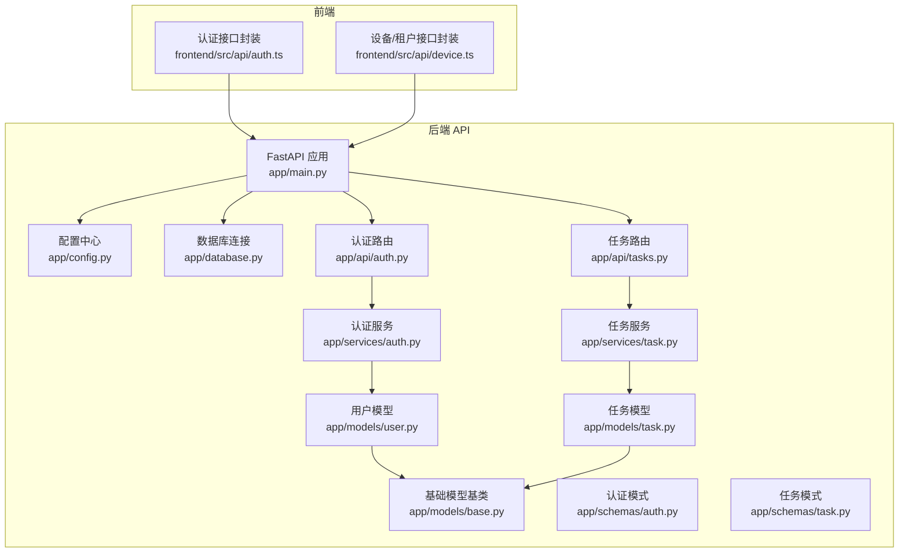
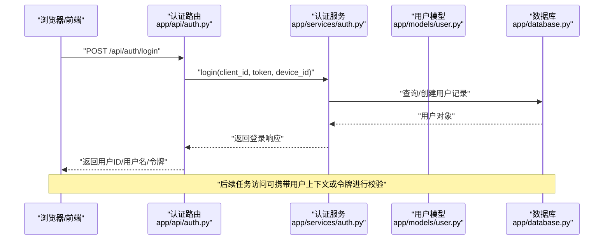
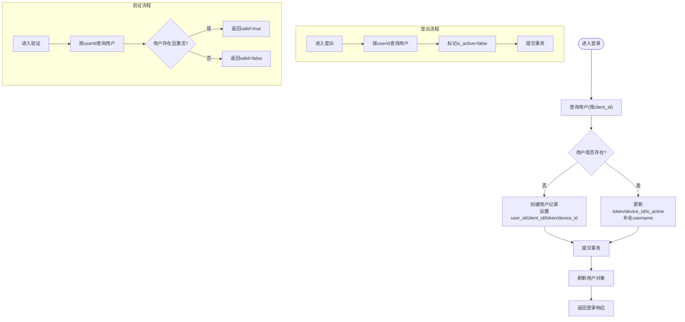
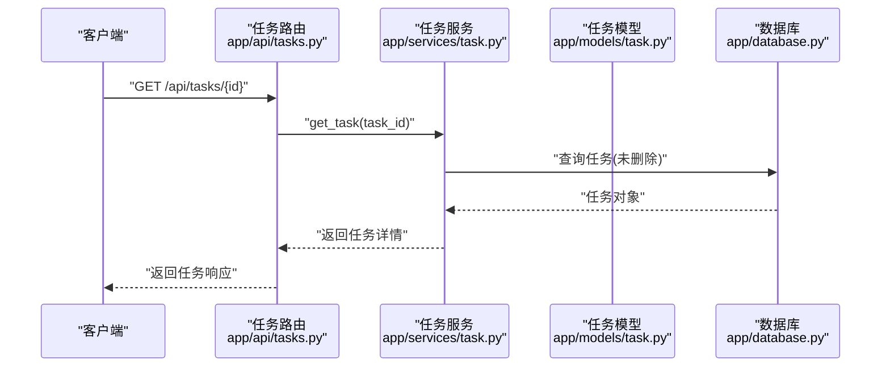
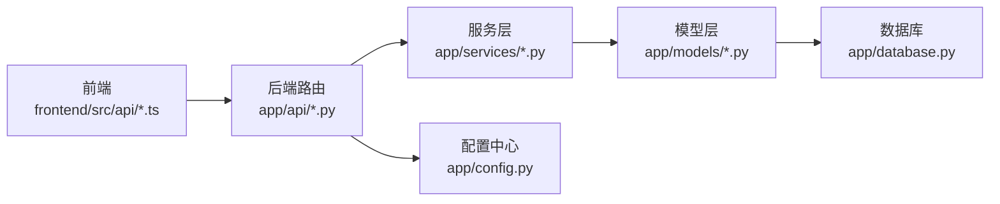

# RBAC 权限控制系统

<cite>
**本文档引用的文件**
- [app/main.py](file://CCC_RPA_API/app/main.py)
- [app/config.py](file://CCC_RPA_API/app/config.py)
- [app/database.py](file://CCC_RPA_API/app/database.py)
- [app/models/base.py](file://CCC_RPA_API/app/models/base.py)
- [app/models/user.py](file://CCC_RPA_API/app/models/user.py)
- [app/models/task.py](file://CCC_RPA_API/app/models/task.py)
- [app/schemas/auth.py](file://CCC_RPA_API/app/schemas/auth.py)
- [app/schemas/task.py](file://CCC_RPA_API/app/schemas/task.py)
- [app/api/auth.py](file://CCC_RPA_API/app/api/auth.py)
- [app/api/tasks.py](file://CCC_RPA_API/app/api/tasks.py)
- [app/services/auth.py](file://CCC_RPA_API/app/services/auth.py)
- [app/services/task.py](file://CCC_RPA_API/app/services/task.py)
- [frontend/src/api/auth.ts](file://CCC-BrowserV4/frontend/src/api/auth.ts)
- [frontend/src/api/device.ts](file://CCC-BrowserV4/frontend/src/api/device.ts)
</cite>

## 目录
1. [引言](#引言)
2. [项目结构](#项目结构)
3. [核心组件](#核心组件)
4. [架构总览](#架构总览)
5. [详细组件分析](#详细组件分析)
6. [依赖关系分析](#依赖关系分析)
7. [性能考虑](#性能考虑)
8. [故障排除指南](#故障排除指南)
9. [结论](#结论)
10. [附录](#附录)

## 引言
本文件面向 RBAC 权限控制系统的技术实现，基于当前仓库中的后端 API 与前端交互模块进行系统化梳理。当前代码库尚未实现完整的四级角色（超级管理员、租户管理员、操作员、只读用户）与细粒度权限矩阵，但已具备用户认证、会话状态管理与基础资源访问能力。本文档在现有基础上，提出 RBAC 模型设计建议、角色权限映射方案、权限验证中间件与安全审计机制的落地路径，并给出与现有代码的集成方式与演进方向。

## 项目结构
后端采用 FastAPI + SQLAlchemy 架构，按功能分层组织：路由层（API）、服务层（Service）、模型层（ORM Model）、模式层（Pydantic Schema）。前端通过 Tauri Bridge 与后端交互，提供登录、登出与认证校验等能力。

**图表来源**
- [app/main.py:1-127](file://CCC_RPA_API/app/main.py#L1-L127)
- [app/config.py:1-22](file://CCC_RPA_API/app/config.py#L1-L22)
- [app/database.py:1-19](file://CCC_RPA_API/app/database.py#L1-L19)
- [app/api/auth.py:1-24](file://CCC_RPA_API/app/api/auth.py#L1-L24)
- [app/api/tasks.py:1-76](file://CCC_RPA_API/app/api/tasks.py#L1-L76)
- [app/services/auth.py:1-58](file://CCC_RPA_API/app/services/auth.py#L1-L58)
- [app/services/task.py:1-157](file://CCC_RPA_API/app/services/task.py#L1-L157)
- [app/models/user.py:1-17](file://CCC_RPA_API/app/models/user.py#L1-L17)
- [app/models/task.py:1-25](file://CCC_RPA_API/app/models/task.py#L1-L25)
- [app/models/base.py:1-11](file://CCC_RPA_API/app/models/base.py#L1-L11)
- [app/schemas/auth.py:1-26](file://CCC_RPA_API/app/schemas/auth.py#L1-L26)
- [app/schemas/task.py:1-58](file://CCC_RPA_API/app/schemas/task.py#L1-L58)
- [frontend/src/api/auth.ts:1-41](file://CCC-BrowserV4/frontend/src/api/auth.ts#L1-L41)
- [frontend/src/api/device.ts:1-21](file://CCC-BrowserV4/frontend/src/api/device.ts#L1-L21)

**章节来源**
- [app/main.py:1-127](file://CCC_RPA_API/app/main.py#L1-L127)
- [app/api/auth.py:1-24](file://CCC_RPA_API/app/api/auth.py#L1-L24)
- [app/api/tasks.py:1-76](file://CCC_RPA_API/app/api/tasks.py#L1-L76)
- [frontend/src/api/auth.ts:1-41](file://CCC-BrowserV4/frontend/src/api/auth.ts#L1-L41)
- [frontend/src/api/device.ts:1-21](file://CCC-BrowserV4/frontend/src/api/device.ts#L1-L21)

## 核心组件
- 认证与会话
  - 用户模型包含用户标识、客户端标识、令牌、设备标识与激活状态等字段，支撑会话生命周期管理。
  - 认证服务提供登录、登出、验证接口，支持首次登录创建用户记录与更新设备信息。
  - 前端通过 Tauri Bridge 生成 client_id 与 token，并发起登录、登出与验证请求。
- 资源访问
  - 任务模型包含租户标识、设备标识、处理人账号等字段，便于后续实现基于租户与设备的访问控制。
  - 任务服务负责任务的增删改查、执行与日志查询，当前未实现基于角色的权限过滤。
- 数据持久化
  - 基于 SQLAlchemy 的基础模型统一记录创建与更新时间；数据库连接通过配置中心集中管理。

**章节来源**
- [app/models/user.py:1-17](file://CCC_RPA_API/app/models/user.py#L1-L17)
- [app/services/auth.py:1-58](file://CCC_RPA_API/app/services/auth.py#L1-L58)
- [app/schemas/auth.py:1-26](file://CCC_RPA_API/app/schemas/auth.py#L1-L26)
- [app/models/task.py:1-25](file://CCC_RPA_API/app/models/task.py#L1-L25)
- [app/services/task.py:1-157](file://CCC_RPA_API/app/services/task.py#L1-L157)
- [app/models/base.py:1-11](file://CCC_RPA_API/app/models/base.py#L1-L11)
- [app/config.py:1-22](file://CCC_RPA_API/app/config.py#L1-L22)
- [app/database.py:1-19](file://CCC_RPA_API/app/database.py#L1-L19)
- [frontend/src/api/auth.ts:1-41](file://CCC-BrowserV4/frontend/src/api/auth.ts#L1-L41)

## 架构总览
下图展示从浏览器到后端 API 的典型认证与任务访问流程，以及当前实现与 RBAC 演进路径的关系。

**图表来源**
- [app/api/auth.py:1-24](file://CCC_RPA_API/app/api/auth.py#L1-L24)
- [app/services/auth.py:1-58](file://CCC_RPA_API/app/services/auth.py#L1-L58)
- [app/models/user.py:1-17](file://CCC_RPA_API/app/models/user.py#L1-L17)
- [app/database.py:1-19](file://CCC_RPA_API/app/database.py#L1-L19)

## 详细组件分析

### 组件一：认证与会话管理
- 功能职责
  - 登录：根据客户端标识查询或创建用户记录，更新令牌与设备信息，返回用户标识与令牌。
  - 登出：将用户标记为非激活状态，阻断后续有效会话。
  - 验证：校验用户是否存在且处于激活状态，返回验证结果与用户信息。
- 关键流程
  - 登录流程包含首次注册与信息补全逻辑，确保用户在首次接入时即建立稳定的身份标识。
  - 验证流程用于中间件或业务接口前置校验，保证访问主体有效性。
- 安全要点
  - 令牌与设备绑定有助于防重放与跨设备滥用。
  - 登出后立即失效，避免会话残留风险。

**图表来源**
- [app/services/auth.py:1-58](file://CCC_RPA_API/app/services/auth.py#L1-L58)
- [app/models/user.py:1-17](file://CCC_RPA_API/app/models/user.py#L1-L17)

**章节来源**
- [app/api/auth.py:1-24](file://CCC_RPA_API/app/api/auth.py#L1-L24)
- [app/services/auth.py:1-58](file://CCC_RPA_API/app/services/auth.py#L1-L58)
- [app/schemas/auth.py:1-26](file://CCC_RPA_API/app/schemas/auth.py#L1-L26)
- [app/models/user.py:1-17](file://CCC_RPA_API/app/models/user.py#L1-L17)
- [frontend/src/api/auth.ts:1-41](file://CCC-BrowserV4/frontend/src/api/auth.ts#L1-L41)

### 组件二：任务资源访问
- 功能职责
  - 提供任务的查询、创建、更新、删除、执行与日志查询等接口。
  - 任务模型包含租户标识、设备标识、处理人账号等字段，为后续权限控制提供数据基础。
- 当前实现
  - 业务逻辑集中在服务层，路由层仅做参数解析与异常处理。
  - 未实现基于角色的访问控制与越权拦截。
- 演进建议
  - 在服务层增加“上下文用户”参数，结合任务的租户/设备/处理人字段进行权限判断。
  - 对高风险操作（如删除、修改关键字段）实施更严格的校验。

**图表来源**
- [app/api/tasks.py:1-76](file://CCC_RPA_API/app/api/tasks.py#L1-L76)
- [app/services/task.py:1-157](file://CCC_RPA_API/app/services/task.py#L1-L157)
- [app/models/task.py:1-25](file://CCC_RPA_API/app/models/task.py#L1-L25)
- [app/database.py:1-19](file://CCC_RPA_API/app/database.py#L1-L19)

**章节来源**
- [app/api/tasks.py:1-76](file://CCC_RPA_API/app/api/tasks.py#L1-L76)
- [app/services/task.py:1-157](file://CCC_RPA_API/app/services/task.py#L1-L157)
- [app/schemas/task.py:1-58](file://CCC_RPA_API/app/schemas/task.py#L1-L58)
- [app/models/task.py:1-25](file://CCC_RPA_API/app/models/task.py#L1-L25)

### 组件三：前端认证与会话传递
- 功能职责
  - 前端通过 Tauri Bridge 生成 client_id 与 token，并向后端发起登录、登出与验证请求。
  - 登录成功后，前端应保存用户标识与令牌，用于后续请求头或参数传递。
- 建议
  - 将用户标识与令牌持久化至安全存储，避免页面刷新丢失。
  - 在请求拦截器中自动附加用户上下文，减少重复传参。

**章节来源**
- [frontend/src/api/auth.ts:1-41](file://CCC-BrowserV4/frontend/src/api/auth.ts#L1-L41)
- [frontend/src/api/device.ts:1-21](file://CCC-BrowserV4/frontend/src/api/device.ts#L1-L21)

## 依赖关系分析
- 层次耦合
  - 路由层仅依赖服务层，保持薄路由、厚业务的分层原则。
  - 服务层依赖模型层与数据库会话，遵循 ORM 映射规范。
  - 前端通过统一的 API 封装与后端交互，降低跨框架耦合。
- 外部依赖
  - FastAPI 提供路由与中间件能力；SQLAlchemy 提供 ORM 与会话管理。
  - Tauri Bridge 提供设备 ID 生成与本地回调服务，支撑认证流程。

**图表来源**
- [app/main.py:1-127](file://CCC_RPA_API/app/main.py#L1-L127)
- [app/api/auth.py:1-24](file://CCC_RPA_API/app/api/auth.py#L1-L24)
- [app/api/tasks.py:1-76](file://CCC_RPA_API/app/api/tasks.py#L1-L76)
- [app/services/auth.py:1-58](file://CCC_RPA_API/app/services/auth.py#L1-L58)
- [app/services/task.py:1-157](file://CCC_RPA_API/app/services/task.py#L1-L157)
- [app/models/user.py:1-17](file://CCC_RPA_API/app/models/user.py#L1-L17)
- [app/models/task.py:1-25](file://CCC_RPA_API/app/models/task.py#L1-L25)
- [app/database.py:1-19](file://CCC_RPA_API/app/database.py#L1-L19)
- [app/config.py:1-22](file://CCC_RPA_API/app/config.py#L1-L22)

**章节来源**
- [app/main.py:1-127](file://CCC_RPA_API/app/main.py#L1-L127)
- [app/database.py:1-19](file://CCC_RPA_API/app/database.py#L1-L19)
- [app/config.py:1-22](file://CCC_RPA_API/app/config.py#L1-L22)

## 性能考虑
- 连接池与会话
  - 使用预热连接与回收策略，避免长连接空闲导致的资源占用。
- 查询优化
  - 对常用过滤字段（如租户、设备、状态）建立索引，减少全表扫描。
- 缓存策略
  - 对频繁访问的静态配置与用户基本信息进行缓存，降低数据库压力。
- 并发与异步
  - 任务执行采用异步提交与后台线程处理，避免阻塞主事件循环。

[本节为通用指导，不直接分析具体文件]

## 故障排除指南
- 认证失败
  - 检查前端是否正确生成 client_id 与 token，并在登录请求中携带。
  - 确认后端数据库中是否存在对应 client_id 的用户记录。
- 会话无效
  - 登出后用户状态变为非激活，需重新登录获取新的令牌。
  - 核对令牌与设备绑定是否一致，避免跨设备使用。
- 资源访问异常
  - 确认任务未被标记为删除，且请求参数合法。
  - 检查任务模型中的租户/设备/处理人字段是否符合预期。

**章节来源**
- [app/services/auth.py:1-58](file://CCC_RPA_API/app/services/auth.py#L1-L58)
- [app/services/task.py:1-157](file://CCC_RPA_API/app/services/task.py#L1-L157)
- [app/models/user.py:1-17](file://CCC_RPA_API/app/models/user.py#L1-L17)
- [app/models/task.py:1-25](file://CCC_RPA_API/app/models/task.py#L1-L25)

## 结论
当前代码库已具备完善的认证与基础资源访问能力，为 RBAC 权限体系的落地提供了良好的基础设施。下一步建议围绕“角色-权限-资源”的映射关系进行建模，将用户身份与任务资源的租户/设备/处理人维度关联，通过中间件与服务层的权限校验实现精细化权限管控与越权拦截，并配套安全审计与日志追踪，最终形成可扩展、可维护的权限治理闭环。

[本节为总结性内容，不直接分析具体文件]

## 附录

### RBAC 模型设计与演进建议
- 角色层级
  - 超级管理员：全局资源的完全控制权。
  - 租户管理员：仅能管理本租户范围内的资源与用户。
  - 操作员：可在授权范围内执行任务与查看相关日志。
  - 只读用户：仅能查看任务状态与历史日志。
- 权限矩阵
  - 基于资源（任务、日志、设备、租户）定义操作（读取、创建、更新、删除、执行）。
  - 将角色与权限进行多对多映射，支持继承与叠加。
- 中间件与校验
  - 在路由层引入权限中间件，解析用户上下文并进行角色与资源匹配。
  - 对高风险操作实施二次确认或审批流。
- 安全审计
  - 记录关键操作（登录、登出、任务执行、权限变更）的时间、用户、IP、资源与结果。
  - 支持审计日志的检索与导出，满足合规要求。

[本节为概念性内容，不直接分析具体文件]