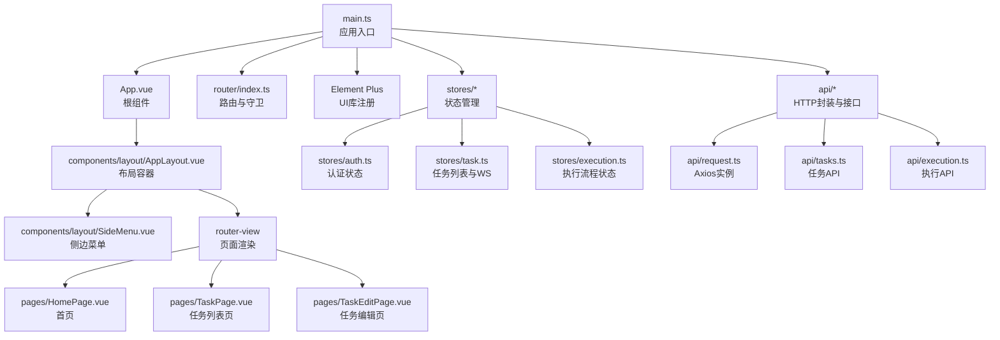
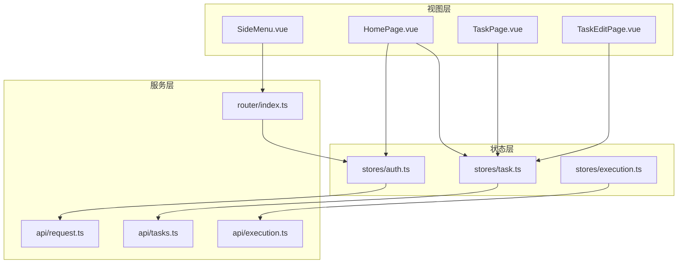
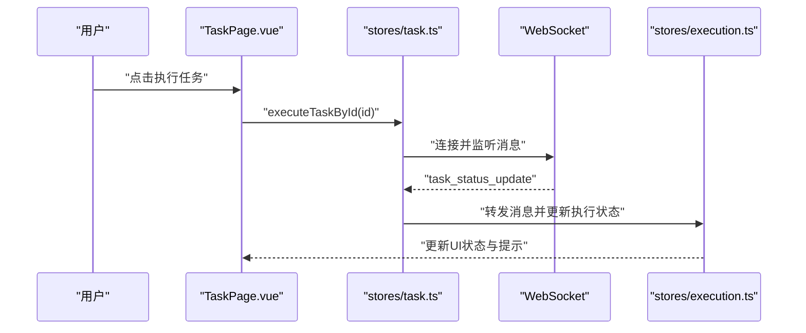
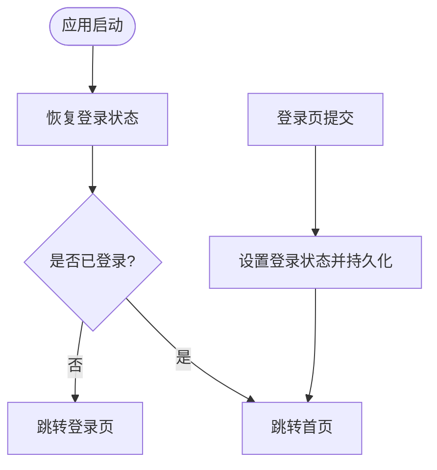
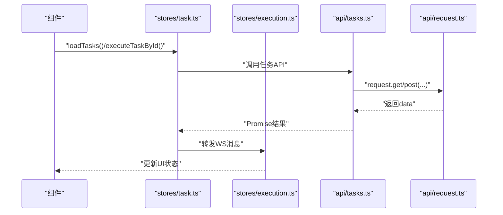
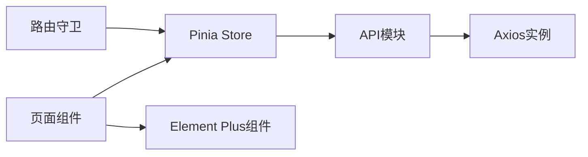

# Web 管理后台界面

<cite>
**本文引用的文件**
- [App.vue](file://CCC-BrowserV4/frontend/src/App.vue)
- [main.ts](file://CCC-BrowserV4/frontend/src/main.ts)
- [index.ts](file://CCC-BrowserV4/frontend/src/router/index.ts)
- [auth.ts](file://CCC-BrowserV4/frontend/src/stores/auth.ts)
- [task.ts](file://CCC-BrowserV4/frontend/src/stores/task.ts)
- [execution.ts](file://CCC-BrowserV4/frontend/src/stores/execution.ts)
- [HomePage.vue](file://CCC-BrowserV4/frontend/src/pages/HomePage.vue)
- [AppLayout.vue](file://CCC-BrowserV4/frontend/src/components/layout/AppLayout.vue)
- [SideMenu.vue](file://CCC-BrowserV4/frontend/src/components/layout/SideMenu.vue)
- [tasks.ts](file://CCC-BrowserV4/frontend/src/api/tasks.ts)
- [execution.ts](file://CCC-BrowserV4/frontend/src/api/execution.ts)
- [request.ts](file://CCC-BrowserV4/frontend/src/api/request.ts)
- [index.ts](file://CCC-BrowserV4/frontend/src/types/index.ts)
- [execution.ts](file://CCC-BrowserV4/frontend/src/types/execution.ts)
- [execution-log.ts](file://CCC-BrowserV4/frontend/src/types/execution-log.ts)
</cite>

## 目录
1. [简介](#简介)
2. [项目结构](#项目结构)
3. [核心组件](#核心组件)
4. [架构总览](#架构总览)
5. [详细组件分析](#详细组件分析)
6. [依赖关系分析](#依赖关系分析)
7. [性能考量](#性能考量)
8. [故障排查指南](#故障排查指南)
9. [结论](#结论)
10. [附录](#附录)

## 简介
本文件面向 Web 管理后台界面，围绕监控大盘、租户管理、会话列表、任务执行记录、审计日志检索与告警配置等模块，系统阐述前端实现（Vue3 + Element Plus）、数据流设计、组件实现与用户体验优化策略。当前仓库前端以路由守卫控制权限、以 Pinia 管理状态、以 Axios 封装请求，并通过 WebSocket 接收后端推送的任务状态更新；后端提供任务与执行相关的 API，支持任务分页、增删改查、执行与日志查询。

## 项目结构
前端采用单页应用（SPA）架构，基于 Vue Router 进行页面路由与权限控制，Element Plus 提供 UI 组件库，Pinia 管理全局状态，Axios 封装 HTTP 请求。页面主要包含登录页、首页、任务管理页及任务编辑页；布局由侧边菜单、主内容区与底部状态栏组成。

图表来源
- [main.ts:1-23](file://CCC-BrowserV4/frontend/src/main.ts#L1-L23)
- [App.vue:1-21](file://CCC-BrowserV4/frontend/src/App.vue#L1-L21)
- [index.ts:1-63](file://CCC-BrowserV4/frontend/src/router/index.ts#L1-L63)
- [AppLayout.vue:1-47](file://CCC-BrowserV4/frontend/src/components/layout/AppLayout.vue#L1-L47)
- [SideMenu.vue:1-70](file://CCC-BrowserV4/frontend/src/components/layout/SideMenu.vue#L1-L70)
- [HomePage.vue:1-62](file://CCC-BrowserV4/frontend/src/pages/HomePage.vue#L1-L62)
- [auth.ts:1-79](file://CCC-BrowserV4/frontend/src/stores/auth.ts#L1-L79)
- [task.ts:1-84](file://CCC-BrowserV4/frontend/src/stores/task.ts#L1-L84)
- [execution.ts:1-229](file://CCC-BrowserV4/frontend/src/stores/execution.ts#L1-L229)
- [request.ts:1-18](file://CCC-BrowserV4/frontend/src/api/request.ts#L1-L18)
- [tasks.ts:1-41](file://CCC-BrowserV4/frontend/src/api/tasks.ts#L1-L41)
- [execution.ts:1-20](file://CCC-BrowserV4/frontend/src/api/execution.ts#L1-L20)

章节来源
- [main.ts:1-23](file://CCC-BrowserV4/frontend/src/main.ts#L1-L23)
- [index.ts:1-63](file://CCC-BrowserV4/frontend/src/router/index.ts#L1-L63)
- [AppLayout.vue:1-47](file://CCC-BrowserV4/frontend/src/components/layout/AppLayout.vue#L1-L47)
- [SideMenu.vue:1-70](file://CCC-BrowserV4/frontend/src/components/layout/SideMenu.vue#L1-L70)
- [HomePage.vue:1-62](file://CCC-BrowserV4/frontend/src/pages/HomePage.vue#L1-L62)

## 核心组件
- 应用入口与插件注册：在入口文件中注册路由、状态管理、UI 库与图标组件，统一挂载应用。
- 路由与权限：通过路由守卫判断是否需要登录，未登录跳转登录页，已登录访问登录页则跳转首页。
- 认证状态：使用 Pinia 存储登录态、用户信息与 Token，并持久化到本地存储。
- 任务状态：任务列表、分页、增删改查、执行与 WebSocket 推送的任务状态更新。
- 执行流程：扫码登录、选择单位、执行中与保活、完成/失败/取消等步骤的状态机。
- 页面与布局：首页展示当前用户与设备信息；侧边菜单提供导航；主内容区承载各页面。

章节来源
- [main.ts:1-23](file://CCC-BrowserV4/frontend/src/main.ts#L1-L23)
- [index.ts:47-60](file://CCC-BrowserV4/frontend/src/router/index.ts#L47-L60)
- [auth.ts:15-58](file://CCC-BrowserV4/frontend/src/stores/auth.ts#L15-L58)
- [task.ts:13-80](file://CCC-BrowserV4/frontend/src/stores/task.ts#L13-L80)
- [execution.ts:22-67](file://CCC-BrowserV4/frontend/src/stores/execution.ts#L22-L67)
- [HomePage.vue:14-23](file://CCC-BrowserV4/frontend/src/pages/HomePage.vue#L14-L23)

## 架构总览
前端采用“视图层 + 状态层 + 服务层”的分层架构：
- 视图层：Vue 组件负责渲染与交互。
- 状态层：Pinia Store 管理认证、任务、执行流程等状态。
- 服务层：Axios 封装请求，统一拦截错误；API 模块封装具体接口；路由守卫保障安全。

图表来源
- [HomePage.vue:1-62](file://CCC-BrowserV4/frontend/src/pages/HomePage.vue#L1-L62)
- [SideMenu.vue:1-70](file://CCC-BrowserV4/frontend/src/components/layout/SideMenu.vue#L1-L70)
- [auth.ts:1-79](file://CCC-BrowserV4/frontend/src/stores/auth.ts#L1-L79)
- [task.ts:1-84](file://CCC-BrowserV4/frontend/src/stores/task.ts#L1-L84)
- [execution.ts:1-229](file://CCC-BrowserV4/frontend/src/stores/execution.ts#L1-L229)
- [request.ts:1-18](file://CCC-BrowserV4/frontend/src/api/request.ts#L1-L18)
- [tasks.ts:1-41](file://CCC-BrowserV4/frontend/src/api/tasks.ts#L1-L41)
- [execution.ts:1-20](file://CCC-BrowserV4/frontend/src/api/execution.ts#L1-L20)
- [index.ts:1-63](file://CCC-BrowserV4/frontend/src/router/index.ts#L1-L63)

## 详细组件分析

### 监控大盘设计
- 在首页提供概览卡片，展示当前用户信息与设备 ID，作为监控入口。
- 任务状态卡片可扩展为“在线会话总数”“资源占用”“代理 IP 状态”“AI 推理负载”等指标占位，结合后端指标接口与图表组件进行可视化展示。
- 建议使用 Element Plus 的统计卡片与进度条组件，按需引入 ECharts 或类似图表库进行趋势展示。

章节来源
- [HomePage.vue:10-23](file://CCC-BrowserV4/frontend/src/pages/HomePage.vue#L10-L23)

### 租户管理页面
- 当前路由中暂未提供“租户管理”页面，可在路由表中新增对应路径与组件，并在侧边菜单添加入口。
- 页面可包含租户列表（分页、搜索、状态筛选）、新增/编辑表单、删除确认与操作日志联动。
- 建议与任务模块联动：任务创建时支持选择租户，便于后续审计与资源隔离。

章节来源
- [index.ts:4-39](file://CCC-BrowserV4/frontend/src/router/index.ts#L4-L39)
- [SideMenu.vue:35-41](file://CCC-BrowserV4/frontend/src/components/layout/SideMenu.vue#L35-L41)

### 会话列表
- 会话列表可复用任务列表的数据模型与分页逻辑，通过后端接口返回的会话数据渲染表格。
- 建议字段包含：会话 ID、租户、设备、状态、开始时间、结束时间、持续时长、代理 IP、AI 推理负载等。
- 支持实时刷新与筛选条件（状态、时间范围、租户），结合 WebSocket 实时更新会话状态。

章节来源
- [task.ts:13-24](file://CCC-BrowserV4/frontend/src/stores/task.ts#L13-L24)
- [tasks.ts:5-7](file://CCC-BrowserV4/frontend/src/api/tasks.ts#L5-L7)

### 任务执行记录
- 任务执行记录与任务列表共享执行状态与日志能力。执行状态通过 WebSocket 推送，Store 中统一处理并更新任务项。
- 日志接口支持分页查询，页面可展示“运行中/已完成/失败”等状态与结果描述。

图表来源
- [task.ts:53-80](file://CCC-BrowserV4/frontend/src/stores/task.ts#L53-L80)
- [execution.ts:22-67](file://CCC-BrowserV4/frontend/src/stores/execution.ts#L22-L67)

章节来源
- [task.ts:53-80](file://CCC-BrowserV4/frontend/src/stores/task.ts#L53-L80)
- [execution.ts:22-67](file://CCC-BrowserV4/frontend/src/stores/execution.ts#L22-L67)
- [tasks.ts:32-34](file://CCC-BrowserV4/frontend/src/api/tasks.ts#L32-L34)

### 审计日志检索
- 日志类型定义包含任务执行日志的基本字段，页面可提供时间范围、任务 ID、状态等筛选条件。
- 分页加载与导出功能建议结合后端分页接口实现，前端保持交互流畅。

章节来源
- [execution-log.ts:1-10](file://CCC-BrowserV4/frontend/src/types/execution-log.ts#L1-L10)
- [tasks.ts:36-40](file://CCC-BrowserV4/frontend/src/api/tasks.ts#L36-L40)

### 告警配置页面
- 告警配置页面用于设置阈值与通知方式，建议与任务状态联动：当任务失败率或执行时长超过阈值时触发告警。
- 页面可包含告警规则列表、新增/编辑表单、启用/停用开关与测试发送按钮。
- 与执行状态 Store 协作，将告警事件写入审计日志以便追溯。

章节来源
- [execution.ts:22-67](file://CCC-BrowserV4/frontend/src/stores/execution.ts#L22-L67)

### 认证与路由守卫
- 登录成功后持久化状态，应用挂载时自动恢复；未登录访问受保护路由跳转登录页。
- 开发模式提供虚拟登录入口，便于本地调试。

图表来源
- [App.vue:13-19](file://CCC-BrowserV4/frontend/src/App.vue#L13-L19)
- [auth.ts:44-58](file://CCC-BrowserV4/frontend/src/stores/auth.ts#L44-L58)
- [index.ts:48-60](file://CCC-BrowserV4/frontend/src/router/index.ts#L48-L60)

章节来源
- [App.vue:13-19](file://CCC-BrowserV4/frontend/src/App.vue#L13-L19)
- [auth.ts:44-78](file://CCC-BrowserV4/frontend/src/stores/auth.ts#L44-L78)
- [index.ts:48-60](file://CCC-BrowserV4/frontend/src/router/index.ts#L48-L60)

### 数据流设计
- 请求封装：统一的 Axios 实例设置基础 URL 与超时，响应拦截器统一提取 data 并输出错误日志。
- 任务与执行：任务 Store 负责列表与分页，执行 Store 管理执行步骤与消息，二者通过 WebSocket 消息互通。
- 类型定义：认证、设备、任务、执行步骤与日志等类型集中管理，保证前后端契约一致。

图表来源
- [task.ts:13-55](file://CCC-BrowserV4/frontend/src/stores/task.ts#L13-L55)
- [execution.ts:22-67](file://CCC-BrowserV4/frontend/src/stores/execution.ts#L22-L67)
- [tasks.ts:5-34](file://CCC-BrowserV4/frontend/src/api/tasks.ts#L5-L34)
- [request.ts:3-15](file://CCC-BrowserV4/frontend/src/api/request.ts#L3-L15)

章节来源
- [request.ts:3-15](file://CCC-BrowserV4/frontend/src/api/request.ts#L3-L15)
- [task.ts:13-55](file://CCC-BrowserV4/frontend/src/stores/task.ts#L13-L55)
- [execution.ts:22-67](file://CCC-BrowserV4/frontend/src/stores/execution.ts#L22-L67)
- [index.ts:1-63](file://CCC-BrowserV4/frontend/src/router/index.ts#L1-L63)

### 用户界面设计与交互体验
- 布局：左侧固定菜单、右侧主内容区滚动，底部状态栏简洁展示系统信息。
- 导航：菜单项与路由路径一一对应，点击即跳转；支持当前激活项高亮。
- 表单与表格：使用 Element Plus 的表单与表格组件，配合分页与筛选提升可读性。
- 执行面板：执行状态机清晰展示当前步骤与提示信息，扫码与选择单位流程直观易懂。

章节来源
- [AppLayout.vue:1-47](file://CCC-BrowserV4/frontend/src/components/layout/AppLayout.vue#L1-L47)
- [SideMenu.vue:35-49](file://CCC-BrowserV4/frontend/src/components/layout/SideMenu.vue#L35-L49)
- [execution.ts:122-132](file://CCC-BrowserV4/frontend/src/stores/execution.ts#L122-L132)

## 依赖关系分析
- 组件耦合：页面组件依赖状态 Store，Store 依赖 API 层，API 层依赖请求封装；路由守卫独立于业务 Store。
- 外部依赖：Element Plus 提供 UI 组件；Axios 提供网络请求；Vue Router 提供路由与导航；Pinia 提供状态管理。
- 可能的循环依赖：当前结构清晰，Store 之间通过消息转发而非直接互相引用，避免循环依赖风险。

图表来源
- [main.ts:1-23](file://CCC-BrowserV4/frontend/src/main.ts#L1-L23)
- [index.ts:1-63](file://CCC-BrowserV4/frontend/src/router/index.ts#L1-L63)
- [auth.ts:1-79](file://CCC-BrowserV4/frontend/src/stores/auth.ts#L1-L79)
- [task.ts:1-84](file://CCC-BrowserV4/frontend/src/stores/task.ts#L1-L84)
- [execution.ts:1-229](file://CCC-BrowserV4/frontend/src/stores/execution.ts#L1-L229)
- [request.ts:1-18](file://CCC-BrowserV4/frontend/src/api/request.ts#L1-L18)

章节来源
- [main.ts:1-23](file://CCC-BrowserV4/frontend/src/main.ts#L1-L23)
- [index.ts:1-63](file://CCC-BrowserV4/frontend/src/router/index.ts#L1-L63)

## 性能考量
- 路由懒加载：页面组件采用动态导入，减少首屏体积与加载时间。
- 状态缓存：Pinia Store 内部缓存任务列表与执行状态，避免重复请求。
- 请求节流：对高频操作（如分页、筛选）建议增加防抖，降低后端压力。
- 图表优化：监控大盘中的图表建议按需渲染与懒加载，避免一次性渲染过多节点。

## 故障排查指南
- 登录状态异常：检查本地存储中的认证状态是否正确持久化与恢复。
- 路由跳转问题：确认路由守卫逻辑与 meta.requiresAuth 配置是否匹配。
- 请求失败：查看响应拦截器输出的错误日志，定位具体接口与参数。
- WebSocket 不生效：确认任务 Store 中是否正确初始化与销毁连接，以及消息转发逻辑。

章节来源
- [auth.ts:44-58](file://CCC-BrowserV4/frontend/src/stores/auth.ts#L44-L58)
- [index.ts:48-60](file://CCC-BrowserV4/frontend/src/router/index.ts#L48-L60)
- [request.ts:9-15](file://CCC-BrowserV4/frontend/src/api/request.ts#L9-L15)
- [task.ts:57-80](file://CCC-BrowserV4/frontend/src/stores/task.ts#L57-L80)

## 结论
该前端工程以 Vue3 + Element Plus 为基础，构建了清晰的路由、状态与服务分层，具备良好的扩展性与可维护性。监控大盘、租户管理、会话列表、任务执行记录、审计日志与告警配置等功能均可在此基础上快速迭代。建议后续完善租户管理与会话列表页面，并补充监控大盘的指标可视化与告警配置页面，以满足管理后台的核心需求。

## 附录
- 类型定义参考：
  - 认证状态与设备信息：[index.ts:2-14](file://CCC-BrowserV4/frontend/src/types/index.ts#L2-L14)
  - 任务信息：[index.ts:24-41](file://CCC-BrowserV4/frontend/src/types/index.ts#L24-L41)
  - 执行步骤与公司信息：[execution.ts:1-17](file://CCC-BrowserV4/frontend/src/types/execution.ts#L1-L17)
  - 执行日志：[execution-log.ts:1-10](file://CCC-BrowserV4/frontend/src/types/execution-log.ts#L1-L10)