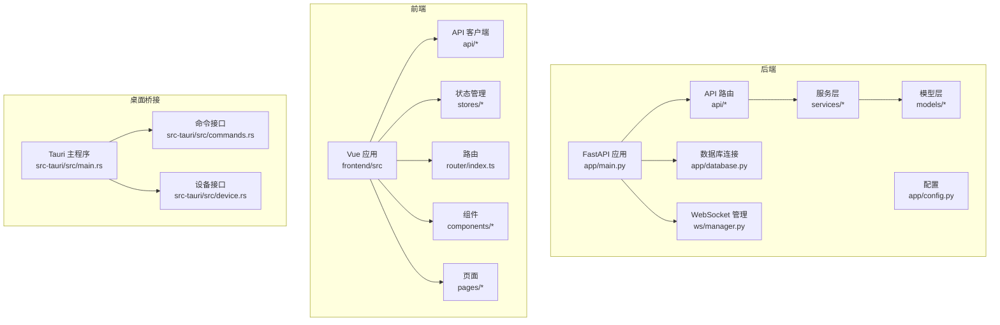
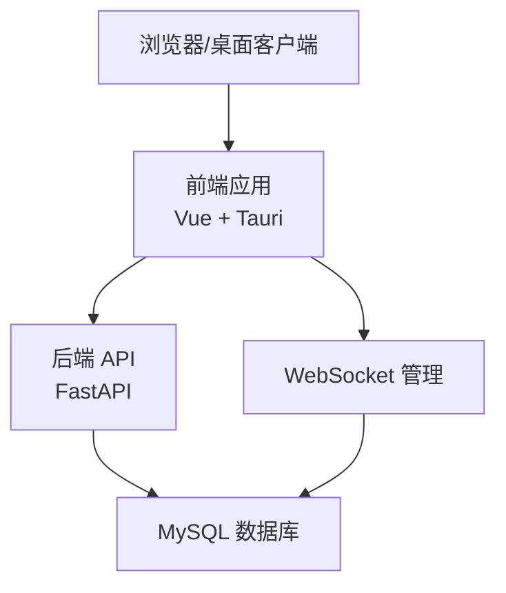
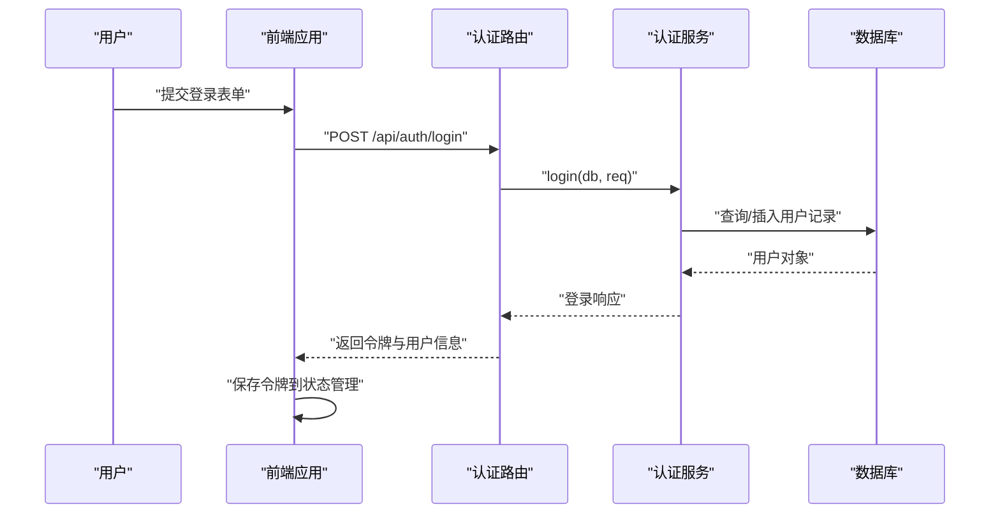
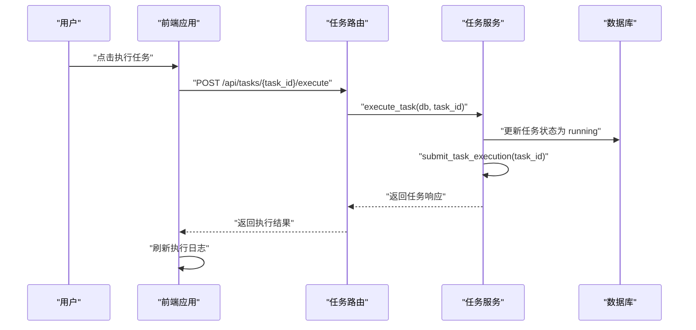
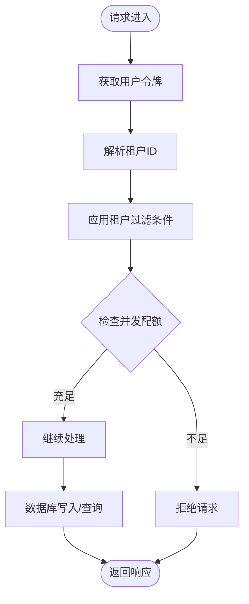
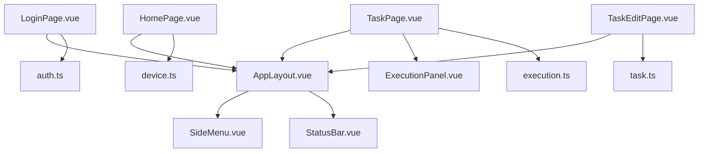
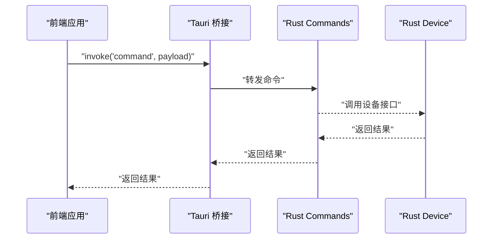
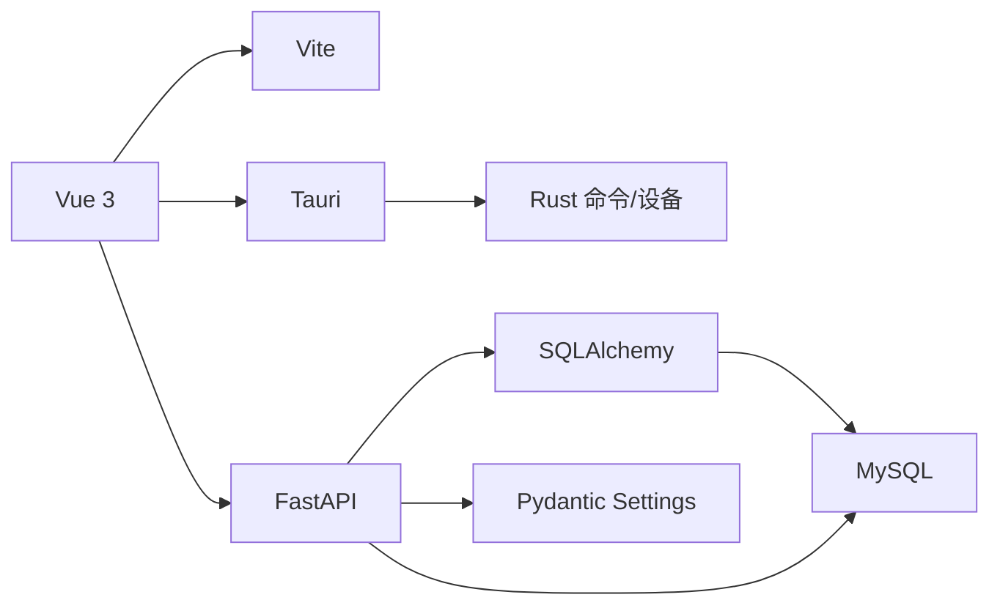
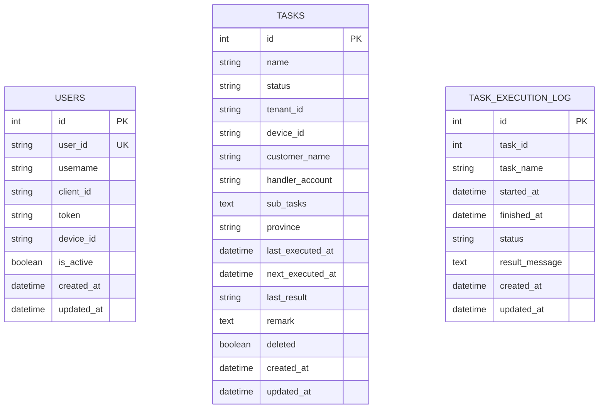

# 多租户网关开发

<cite>
**本文档引用的文件**
- [main.py](file://CCC_RPA_API/app/main.py)
- [config.py](file://CCC_RPA_API/app/config.py)
- [database.py](file://CCC_RPA_API/app/database.py)
- [base.py](file://CCC_RPA_API/app/models/base.py)
- [user.py](file://CCC_RPA_API/app/models/user.py)
- [task.py](file://CCC_RPA_API/app/models/task.py)
- [execution_log.py](file://CCC_RPA_API/app/models/execution_log.py)
- [auth.py](file://CCC_RPA_API/app/api/auth.py)
- [tasks.py](file://CCC_RPA_API/app/api/tasks.py)
- [auth_service.py](file://CCC_RPA_API/app/services/auth.py)
- [task_service.py](file://CCC_RPA_API/app/services/task.py)
- [auth_schema.py](file://CCC_RPA_API/app/schemas/auth.py)
- [task_schema.py](file://CCC_RPA_API/app/schemas/task.py)
- [execution_log_schema.py](file://CCC_RPA_API/app/schemas/execution_log.py)
- [execution_schema.py](file://CCC_RPA_API/app/schemas/execution.py)
- [auth_store.js](file://CCC-BrowserV4/frontend/src/stores/auth.ts)
- [device_store.js](file://CCC-BrowserV4/frontend/src/stores/device.ts)
- [execution_store.js](file://CCC-BrowserV4/frontend/src/stores/execution.ts)
- [task_store.js](file://CCC-BrowserV4/frontend/src/stores/task.ts)
- [auth_api.js](file://CCC-BrowserV4/frontend/src/api/auth.ts)
- [execution_api.js](file://CCC-BrowserV4/frontend/src/api/execution.ts)
- [tasks_api.js](file://CCC-BrowserV4/frontend/src/api/tasks.ts)
- [request_api.js](file://CCC-BrowserV4/frontend/src/api/request.ts)
- [ws_api.js](file://CCC-BrowserV4/frontend/src/api/ws.ts)
- [login_page.vue](file://CCC-BrowserV4/frontend/src/pages/LoginPage.vue)
- [task_edit_page.vue](file://CCC-BrowserV4/frontend/src/pages/TaskEditPage.vue)
- [task_page.vue](file://CCC-BrowserV4/frontend/src/pages/TaskPage.vue)
- [home_page.vue](file://CCC-BrowserV4/frontend/src/pages/HomePage.vue)
- [app_layout.vue](file://CCC-BrowserV4/frontend/src/components/layout/AppLayout.vue)
- [side_menu.vue](file://CCC-BrowserV4/frontend/src/components/layout/SideMenu.vue)
- [status_bar.vue](file://CCC-BrowserV4/frontend/src/components/layout/StatusBar.vue)
- [execution_panel.vue](file://CCC-BrowserV4/frontend/src/components/ExecutionPanel.vue)
- [router_index.js](file://CCC-BrowserV4/frontend/src/router/index.ts)
- [main_ts.js](file://CCC-BrowserV4/frontend/src/main.ts)
- [tauri_bridge.js](file://CCC-BrowserV4/frontend/src/utils/tauri-bridge.ts)
- [commands_rs.rs](file://CCC_BrowserV4/src-tauri/src/commands.rs)
- [device_rs.rs](file://CCC_BrowserV4/src-tauri/src/device.rs)
- [main_rs.rs](file://CCC_BrowserV4/src-tauri/src/main.rs)
</cite>

## 目录
1. [简介](#简介)
2. [项目结构](#项目结构)
3. [核心组件](#核心组件)
4. [架构总览](#架构总览)
5. [详细组件分析](#详细组件分析)
6. [依赖分析](#依赖分析)
7. [性能考虑](#性能考虑)
8. [故障排除指南](#故障排除指南)
9. [结论](#结论)
10. [附录](#附录)

## 简介
本项目是一个基于 FastAPI 的多租户网关系统，提供租户管理、任务调度、实时执行日志、设备会话管理以及前端可视化控制台。系统通过在任务模型中引入租户标识字段，实现租户数据的逻辑隔离；通过统一认证服务完成用户登录、登出与令牌验证；通过 WebSocket 实现实时状态推送；通过 Tauri 将浏览器自动化能力封装为桌面应用。

## 项目结构
后端采用分层架构：API 路由层负责请求处理与参数校验，Service 层封装业务逻辑，Model 层定义数据库实体，Schema 层定义请求/响应数据结构，Config/Database 提供配置与连接管理。前端采用 Vue 3 + TypeScript + Vite 构建，配合 Tauri 提供原生桌面体验。

**图表来源**
- [main.py:1-127](file://CCC_RPA_API/app/main.py#L1-L127)
- [config.py:1-22](file://CCC_RPA_API/app/config.py#L1-L22)
- [database.py:1-19](file://CCC_RPA_API/app/database.py#L1-L19)
- [auth.py:1-24](file://CCC_RPA_API/app/api/auth.py#L1-L24)
- [tasks.py:1-76](file://CCC_RPA_API/app/api/tasks.py#L1-L76)
- [auth_service.py:1-58](file://CCC_RPA_API/app/services/auth.py#L1-L58)
- [task_service.py:1-157](file://CCC_RPA_API/app/services/task.py#L1-L157)
- [main_ts.js](file://CCC-BrowserV4/frontend/src/main.ts)
- [router_index.js](file://CCC-BrowserV4/frontend/src/router/index.ts)
- [main_rs.rs](file://CCC_BrowserV4/src-tauri/src/main.rs)

**章节来源**
- [main.py:1-127](file://CCC_RPA_API/app/main.py#L1-L127)
- [config.py:1-22](file://CCC_RPA_API/app/config.py#L1-L22)
- [database.py:1-19](file://CCC_RPA_API/app/database.py#L1-L19)

## 核心组件
- 认证与授权
  - 登录/登出/验证接口位于认证路由，服务层负责用户记录创建与更新、令牌维护与状态校验。
  - 前端通过认证状态管理与 API 客户端实现登录态持久化与拦截器注入。
- 任务管理
  - 任务 CRUD 与执行控制通过任务路由与服务层实现，支持分页查询、条件过滤、JSON 子任务字段存储。
  - 执行日志模型记录每次任务执行的生命周期状态。
- 租户数据隔离
  - 在任务模型中增加租户标识字段，所有读写操作均以该字段作为过滤条件，实现逻辑隔离。
- 实时通信
  - WebSocket 端点用于连接管理与消息广播，结合前端 WebSocket 客户端实现实时状态展示。
- 桌面桥接
  - Tauri 将 Rust 命令暴露给前端，实现设备会话、浏览器自动化等底层能力调用。

**章节来源**
- [auth.py:1-24](file://CCC_RPA_API/app/api/auth.py#L1-L24)
- [auth_service.py:1-58](file://CCC_RPA_API/app/services/auth.py#L1-L58)
- [tasks.py:1-76](file://CCC_RPA_API/app/api/tasks.py#L1-L76)
- [task_service.py:1-157](file://CCC_RPA_API/app/services/task.py#L1-L157)
- [task.py:1-25](file://CCC_RPA_API/app/models/task.py#L1-L25)
- [execution_log.py:1-17](file://CCC_RPA_API/app/models/execution_log.py#L1-L17)
- [main.py:119-127](file://CCC_RPA_API/app/main.py#L119-L127)

## 架构总览
系统采用前后端分离与桌面应用集成的混合架构。后端提供 RESTful API 与 WebSocket，前端通过 API 客户端与状态管理进行交互；Tauri 将 Rust 原生能力桥接到前端，形成统一的用户体验。

**图表来源**
- [main.py:1-127](file://CCC_RPA_API/app/main.py#L1-L127)
- [config.py:1-22](file://CCC_RPA_API/app/config.py#L1-L22)
- [database.py:1-19](file://CCC_RPA_API/app/database.py#L1-L19)

## 详细组件分析

### 认证与授权模块
- 功能概述
  - 登录：根据客户端 ID 查询或创建用户记录，更新令牌与设备信息。
  - 登出：标记用户为非活跃状态。
  - 验证：返回用户有效性与基本信息。
- 数据模型
  - 用户模型包含用户 ID、用户名、客户端 ID、令牌、设备 ID、激活状态等字段。
- 前端集成
  - 认证状态管理持久化登录态，API 请求前自动附加令牌。
  - 登录页面提供表单校验与错误提示。

**图表来源**
- [auth.py:10-12](file://CCC_RPA_API/app/api/auth.py#L10-L12)
- [auth_service.py:9-38](file://CCC_RPA_API/app/services/auth.py#L9-L38)
- [user.py:7-16](file://CCC_RPA_API/app/models/user.py#L7-L16)

**章节来源**
- [auth.py:1-24](file://CCC_RPA_API/app/api/auth.py#L1-L24)
- [auth_service.py:1-58](file://CCC_RPA_API/app/services/auth.py#L1-L58)
- [user.py:1-17](file://CCC_RPA_API/app/models/user.py#L1-L17)
- [auth_store.js](file://CCC-BrowserV4/frontend/src/stores/auth.ts)

### 任务管理模块
- 功能概述
  - 支持任务列表查询（关键词、状态过滤）、分页、创建、更新、删除、执行、查看执行日志。
  - 执行流程：设置任务状态为运行中，提交执行任务到执行器，返回当前任务状态。
- 数据模型
  - 任务模型包含名称、状态、租户 ID、设备 ID、客户名称、经办账号、子任务 JSON、省市区、下次执行时间、备注、软删除标志等。
  - 执行日志模型记录任务执行的开始/结束时间、状态、结果消息。
- 前端集成
  - 任务页面展示列表与分页，编辑页面支持表单校验与提交。
  - 执行面板实时显示执行状态与日志。

**图表来源**
- [tasks.py:47-52](file://CCC_RPA_API/app/api/tasks.py#L47-L52)
- [task_service.py:120-133](file://CCC_RPA_API/app/services/task.py#L120-L133)
- [task.py:8-24](file://CCC_RPA_API/app/models/task.py#L8-L24)
- [execution_log.py:7-16](file://CCC_RPA_API/app/models/execution_log.py#L7-L16)

**章节来源**
- [tasks.py:1-76](file://CCC_RPA_API/app/api/tasks.py#L1-L76)
- [task_service.py:1-157](file://CCC_RPA_API/app/services/task.py#L1-L157)
- [task.py:1-25](file://CCC_RPA_API/app/models/task.py#L1-L25)
- [execution_log.py:1-17](file://CCC_RPA_API/app/models/execution_log.py#L1-L17)
- [task_page.vue](file://CCC-BrowserV4/frontend/src/pages/TaskPage.vue)
- [task_edit_page.vue](file://CCC-BrowserV4/frontend/src/pages/TaskEditPage.vue)
- [execution_panel.vue](file://CCC-BrowserV4/frontend/src/components/ExecutionPanel.vue)

### 租户数据隔离与并发配额
- 隔离策略
  - 在任务模型中引入租户 ID 字段，并在所有查询与写入操作中强制加入租户过滤条件，确保跨租户数据互不可见。
- 并发配额
  - 当前代码未实现并发配额控制。建议在任务服务层增加配额检查与队列控制逻辑，结合数据库事务保证一致性。
- 统一鉴权
  - 前端在发起请求前从认证状态管理获取令牌并注入到请求头；后端通过依赖注入获取数据库会话，确保每个请求的上下文隔离。

**图表来源**
- [task_service.py:47-64](file://CCC_RPA_API/app/services/task.py#L47-L64)
- [task.py:14-14](file://CCC_RPA_API/app/models/task.py#L14-L14)

**章节来源**
- [task_service.py:44-157](file://CCC_RPA_API/app/services/task.py#L44-L157)
- [task.py:1-25](file://CCC_RPA_API/app/models/task.py#L1-L25)

### 计费统计模块
- 当前状态
  - 代码库中未发现计费统计相关实现。
- 建议方案
  - 新增计费模型与统计服务，按任务执行次数、耗时、设备使用时长等维度进行统计与计费。
  - 在任务执行完成后触发计费计算，生成账单并记录到计费表。

[本节为概念性内容，不直接分析具体文件]

### 租户 Web 管理后台
- 页面与组件
  - 登录页、任务管理页、任务编辑页、首页、布局组件（侧边栏、状态栏）。
  - 执行面板用于展示任务执行状态与日志。
- 状态管理
  - 认证状态、设备状态、执行状态、任务状态等集中管理。
- 路由与导航
  - 基于路由的页面切换与面包屑导航。

**图表来源**
- [login_page.vue](file://CCC-BrowserV4/frontend/src/pages/LoginPage.vue)
- [home_page.vue](file://CCC-BrowserV4/frontend/src/pages/HomePage.vue)
- [task_page.vue](file://CCC-BrowserV4/frontend/src/pages/TaskPage.vue)
- [task_edit_page.vue](file://CCC-BrowserV4/frontend/src/pages/TaskEditPage.vue)
- [app_layout.vue](file://CCC-BrowserV4/frontend/src/components/layout/AppLayout.vue)
- [side_menu.vue](file://CCC-BrowserV4/frontend/src/components/layout/SideMenu.vue)
- [status_bar.vue](file://CCC-BrowserV4/frontend/src/components/layout/StatusBar.vue)
- [execution_panel.vue](file://CCC-BrowserV4/frontend/src/components/ExecutionPanel.vue)
- [auth_store.js](file://CCC-BrowserV4/frontend/src/stores/auth.ts)
- [device_store.js](file://CCC-BrowserV4/frontend/src/stores/device.ts)
- [execution_store.js](file://CCC-BrowserV4/frontend/src/stores/execution.ts)
- [task_store.js](file://CCC-BrowserV4/frontend/src/stores/task.ts)

**章节来源**
- [login_page.vue](file://CCC-BrowserV4/frontend/src/pages/LoginPage.vue)
- [task_page.vue](file://CCC-BrowserV4/frontend/src/pages/TaskPage.vue)
- [task_edit_page.vue](file://CCC-BrowserV4/frontend/src/pages/TaskEditPage.vue)
- [app_layout.vue](file://CCC-BrowserV4/frontend/src/components/layout/AppLayout.vue)
- [auth_store.js](file://CCC-BrowserV4/frontend/src/stores/auth.ts)
- [execution_store.js](file://CCC-BrowserV4/frontend/src/stores/execution.ts)

### 桌面桥接与浏览器自动化
- Tauri 桥接
  - Rust 命令与设备接口暴露给前端，实现底层能力调用。
- 前端桥接工具
  - 通过 Tauri 桥接工具在前端调用原生命令，实现与桌面环境的深度集成。

**图表来源**
- [tauri_bridge.js](file://CCC-BrowserV4/frontend/src/utils/tauri-bridge.ts)
- [commands_rs.rs](file://CCC_BrowserV4/src-tauri/src/commands.rs)
- [device_rs.rs](file://CCC_BrowserV4/src-tauri/src/device.rs)
- [main_rs.rs](file://CCC_BrowserV4/src-tauri/src/main.rs)

**章节来源**
- [tauri_bridge.js](file://CCC-BrowserV4/frontend/src/utils/tauri-bridge.ts)
- [commands_rs.rs](file://CCC_BrowserV4/src-tauri/src/commands.rs)
- [device_rs.rs](file://CCC_BrowserV4/src-tauri/src/device.rs)
- [main_rs.rs](file://CCC_BrowserV4/src-tauri/src/main.rs)

## 依赖分析
- 后端依赖
  - FastAPI：提供路由与异步支持。
  - SQLAlchemy：ORM 映射与数据库连接管理。
  - Pydantic Settings：配置加载与类型安全。
- 前端依赖
  - Vue 3 + TypeScript：组件化开发与类型约束。
  - Vite：构建与热重载。
  - Tauri：桌面桥接与原生能力调用。
- 外部集成
  - MySQL：持久化存储。
  - WebSocket：实时通信。

**图表来源**
- [main.py:1-127](file://CCC_RPA_API/app/main.py#L1-L127)
- [config.py:1-22](file://CCC_RPA_API/app/config.py#L1-L22)
- [database.py:1-19](file://CCC_RPA_API/app/database.py#L1-L19)
- [main_ts.js](file://CCC-BrowserV4/frontend/src/main.ts)

**章节来源**
- [main.py:1-127](file://CCC_RPA_API/app/main.py#L1-L127)
- [config.py:1-22](file://CCC_RPA_API/app/config.py#L1-L22)
- [database.py:1-19](file://CCC_RPA_API/app/database.py#L1-L19)

## 性能考虑
- 连接池与预热
  - 使用连接池预热与回收策略，避免连接泄漏与频繁重建。
- 查询优化
  - 对常用查询字段建立索引（如任务名称、状态、租户 ID），减少全表扫描。
- 缓存策略
  - 对热点数据（如用户令牌、设备状态）引入缓存层，降低数据库压力。
- 异步执行
  - 任务执行采用异步提交与回调通知，避免阻塞主线程。
- WebSocket 广播
  - 使用事件循环引用进行线程安全的广播，避免竞态条件。

[本节提供一般性指导，不直接分析具体文件]

## 故障排除指南
- 认证失败
  - 检查客户端 ID 是否正确，令牌是否过期或被登出。
  - 查看认证服务的日志输出，确认用户记录是否存在。
- 任务执行异常
  - 检查任务状态是否为运行中，确认执行器是否正常启动。
  - 查看执行日志表，定位具体错误信息。
- 数据库连接问题
  - 检查数据库配置与连接字符串，确认网络连通性。
  - 查看连接池状态与超时设置。
- WebSocket 断开
  - 检查事件循环引用是否正确传递，确认连接管理器状态。

**章节来源**
- [auth_service.py:48-57](file://CCC_RPA_API/app/services/auth.py#L48-L57)
- [task_service.py:120-133](file://CCC_RPA_API/app/services/task.py#L120-L133)
- [database.py:1-19](file://CCC_RPA_API/app/database.py#L1-L19)
- [main.py:119-127](file://CCC_RPA_API/app/main.py#L119-L127)

## 结论
本项目提供了多租户网关的基础能力：统一认证、任务管理、实时日志与桌面桥接。通过在任务模型中引入租户 ID，实现了租户数据的逻辑隔离；通过 WebSocket 与前端状态管理，提供了良好的用户体验。后续可在并发配额控制、计费统计与 RBAC 权限体系方面进一步完善，以满足生产级多租户场景的需求。

## 附录

### 数据库设计要点
- 通用基类
  - 所有模型继承自抽象基类，统一包含创建与更新时间戳字段。
- 用户表
  - 包含用户唯一标识、客户端 ID、令牌、设备 ID、激活状态等。
- 任务表
  - 包含任务元数据、租户 ID、设备 ID、省市区、子任务 JSON、软删除标志等。
- 执行日志表
  - 记录任务执行的生命周期状态与结果消息。

**图表来源**
- [base.py:7-10](file://CCC_RPA_API/app/models/base.py#L7-L10)
- [user.py:7-16](file://CCC_RPA_API/app/models/user.py#L7-L16)
- [task.py:8-24](file://CCC_RPA_API/app/models/task.py#L8-L24)
- [execution_log.py:7-16](file://CCC_RPA_API/app/models/execution_log.py#L7-L16)

**章节来源**
- [base.py:1-11](file://CCC_RPA_API/app/models/base.py#L1-L11)
- [user.py:1-17](file://CCC_RPA_API/app/models/user.py#L1-L17)
- [task.py:1-25](file://CCC_RPA_API/app/models/task.py#L1-L25)
- [execution_log.py:1-17](file://CCC_RPA_API/app/models/execution_log.py#L1-L17)

### API 接口概览
- 认证接口
  - POST /api/auth/login：登录并返回令牌与用户信息。
  - POST /api/auth/logout：登出并标记用户为非活跃。
  - GET /api/auth/verify：验证用户有效性。
- 任务接口
  - GET /api/tasks：分页查询任务列表（支持关键词与状态过滤）。
  - POST /api/tasks：创建任务。
  - GET /api/tasks/{task_id}：获取指定任务详情。
  - PUT /api/tasks/{task_id}：更新任务。
  - DELETE /api/tasks/{task_id}：删除任务（软删除）。
  - POST /api/tasks/{task_id}/execute：执行任务。
  - GET /api/tasks/{task_id}/logs：获取任务执行日志。
  - POST /api/tasks/{task_id}/scan-complete：通知扫描完成。
  - POST /api/tasks/{task_id}/select-company：选择公司。
  - POST /api/tasks/{task_id}/cancel-execution：取消执行。

**章节来源**
- [auth.py:1-24](file://CCC_RPA_API/app/api/auth.py#L1-L24)
- [tasks.py:1-76](file://CCC_RPA_API/app/api/tasks.py#L1-L76)

### 前端界面实现要点
- 状态管理
  - 认证状态、设备状态、执行状态、任务状态分别由独立 store 管理，便于组件间共享。
- API 客户端
  - 统一封装请求与响应处理，支持拦截器注入令牌与错误处理。
- 组件化
  - 布局组件与页面组件解耦，便于复用与扩展。
- 路由
  - 基于路由的页面导航，支持面包屑与权限控制。

**章节来源**
- [auth_store.js](file://CCC-BrowserV4/frontend/src/stores/auth.ts)
- [device_store.js](file://CCC-BrowserV4/frontend/src/stores/device.ts)
- [execution_store.js](file://CCC-BrowserV4/frontend/src/stores/execution.ts)
- [task_store.js](file://CCC-BrowserV4/frontend/src/stores/task.ts)
- [auth_api.js](file://CCC-BrowserV4/frontend/src/api/auth.ts)
- [execution_api.js](file://CCC-BrowserV4/frontend/src/api/execution.ts)
- [tasks_api.js](file://CCC-BrowserV4/frontend/src/api/tasks.ts)
- [request_api.js](file://CCC-BrowserV4/frontend/src/api/request.ts)
- [ws_api.js](file://CCC-BrowserV4/frontend/src/api/ws.ts)
- [router_index.js](file://CCC-BrowserV4/frontend/src/router/index.ts)
- [main_ts.js](file://CCC-BrowserV4/frontend/src/main.ts)