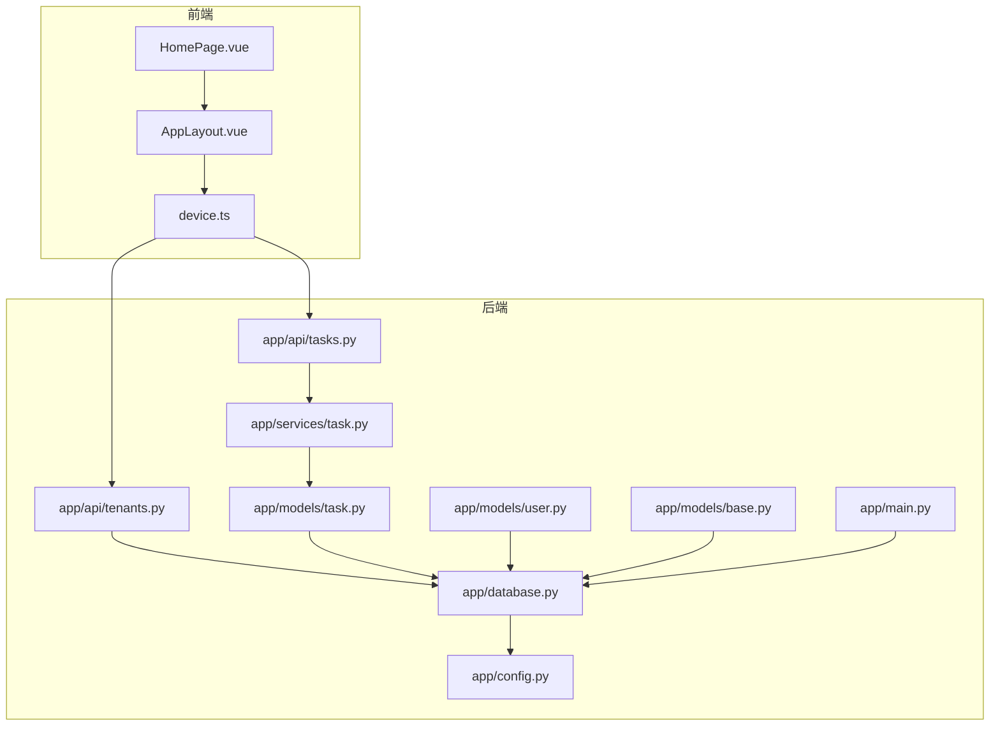
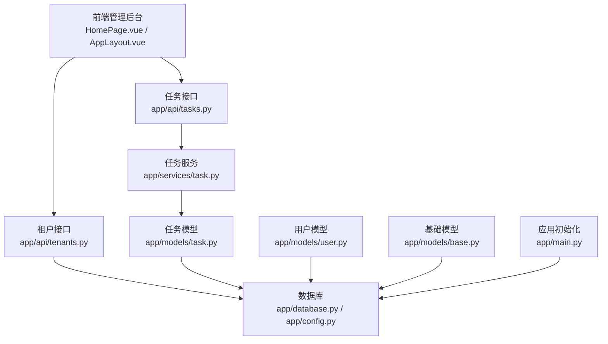
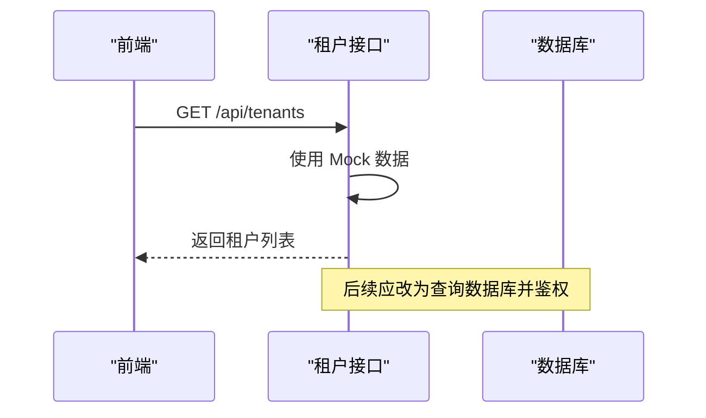
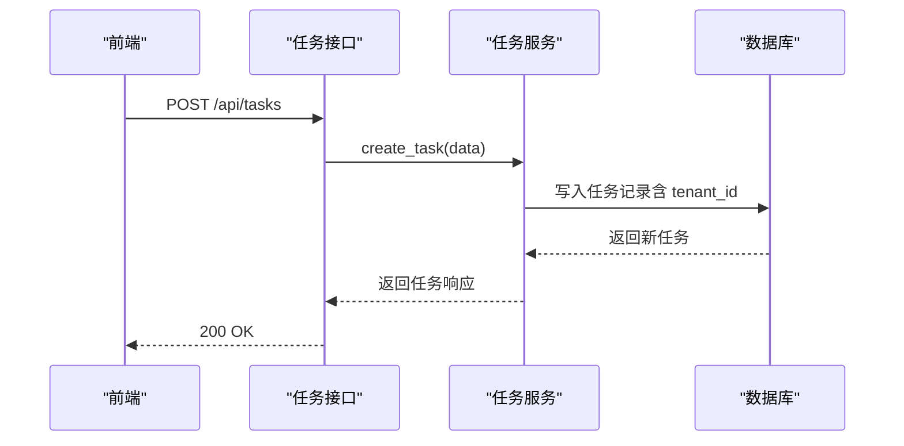
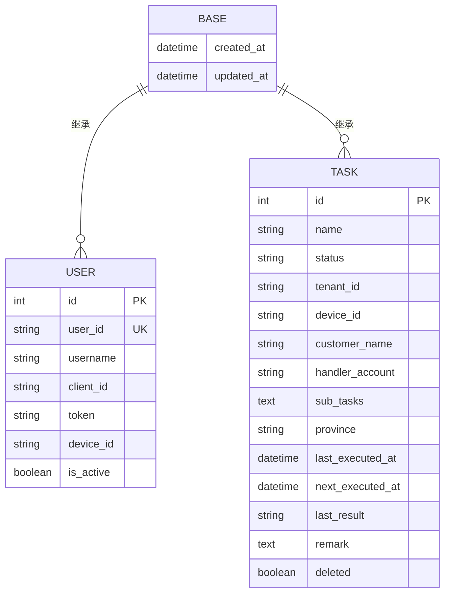
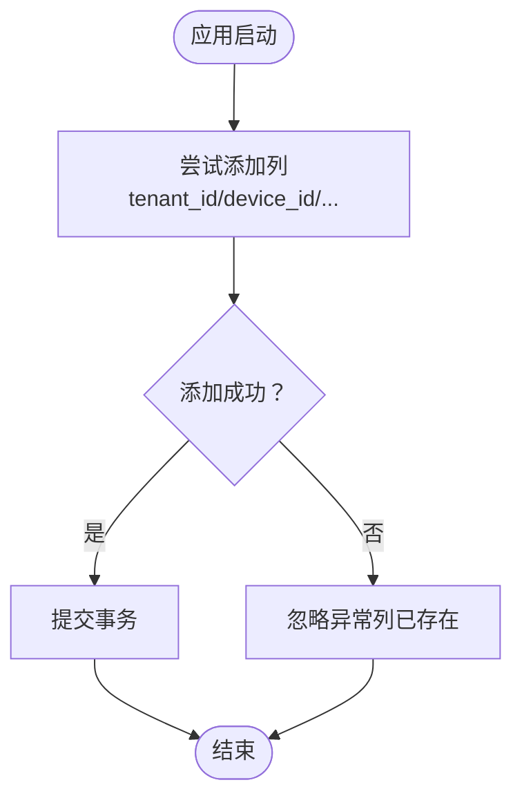
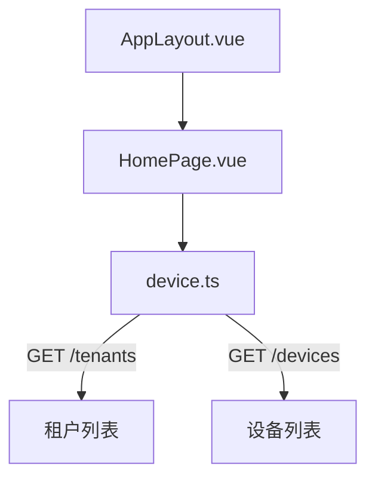
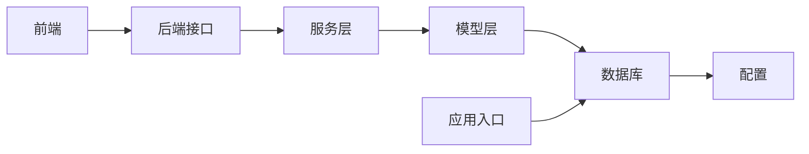

# 租户管理模块

<cite>
**本文引用的文件**
- [project.md](file://project.md)
- [app/api/tenants.py](file://CCC_RPA_API/app/api/tenants.py)
- [app/api/tasks.py](file://CCC_RPA_API/app/api/tasks.py)
- [app/services/task.py](file://CCC_RPA_API/app/services/task.py)
- [app/models/task.py](file://CCC_RPA_API/app/models/task.py)
- [app/models/user.py](file://CCC_RPA_API/app/models/user.py)
- [app/models/base.py](file://CCC_RPA_API/app/models/base.py)
- [app/database.py](file://CCC_RPA_API/app/database.py)
- [app/config.py](file://CCC_RPA_API/app/config.py)
- [app/main.py](file://CCC_RPA_API/app/main.py)
- [frontend/src/api/device.ts](file://CCC-BrowserV4/frontend/src/api/device.ts)
- [frontend/src/pages/HomePage.vue](file://CCC-BrowserV4/frontend/src/pages/HomePage.vue)
- [frontend/src/components/layout/AppLayout.vue](file://CCC-BrowserV4/frontend/src/components/layout/AppLayout.vue)
</cite>

## 目录
1. [引言](#引言)
2. [项目结构](#项目结构)
3. [核心组件](#核心组件)
4. [架构总览](#架构总览)
5. [详细组件分析](#详细组件分析)
6. [依赖分析](#依赖分析)
7. [性能考虑](#性能考虑)
8. [故障排查指南](#故障排查指南)
9. [结论](#结论)
10. [附录](#附录)

## 引言
本文件面向“租户管理模块”的功能实现，围绕以下目标展开：  
- 租户 CRUD 操作（创建、启用/禁用、配置并发配额）  
- 租户数据物理隔离机制  
- 独立 AES 加密密钥管理与密钥轮换策略  
- 访问控制与审计日志  
- 数据库设计（tenant 表结构）  
- API 接口规范  
- 前端管理界面  

根据需求规格，系统采用“多租户网关 + 业务管理层”的分层设计，租户间在数据层面完全隔离，并通过独立 AES 密钥保护会话快照等敏感数据。

## 项目结构
本项目包含三层：  
- 后端 API（FastAPI）：提供租户与任务等接口  
- 前端管理后台（Vue3 + Element Plus）：提供租户与设备列表等页面  
- 数据层：MySQL（通过 SQLAlchemy ORM）  

图表来源
- [app/api/tenants.py:1-25](file://CCC_RPA_API/app/api/tenants.py#L1-L25)
- [app/api/tasks.py:1-76](file://CCC_RPA_API/app/api/tasks.py#L1-L76)
- [app/services/task.py:1-157](file://CCC_RPA_API/app/services/task.py#L1-L157)
- [app/models/task.py:1-25](file://CCC_RPA_API/app/models/task.py#L1-L25)
- [app/models/user.py:1-17](file://CCC_RPA_API/app/models/user.py#L1-L17)
- [app/models/base.py:1-11](file://CCC_RPA_API/app/models/base.py#L1-L11)
- [app/database.py:1-19](file://CCC_RPA_API/app/database.py#L1-L19)
- [app/config.py:1-22](file://CCC_RPA_API/app/config.py#L1-L22)
- [app/main.py:41-86](file://CCC_RPA_API/app/main.py#L41-L86)
- [frontend/src/pages/HomePage.vue:1-62](file://CCC-BrowserV4/frontend/src/pages/HomePage.vue#L1-L62)
- [frontend/src/components/layout/AppLayout.vue:1-47](file://CCC-BrowserV4/frontend/src/components/layout/AppLayout.vue#L1-L47)
- [frontend/src/api/device.ts:1-21](file://CCC-BrowserV4/frontend/src/api/device.ts#L1-L21)

章节来源
- [app/api/tenants.py:1-25](file://CCC_RPA_API/app/api/tenants.py#L1-L25)
- [app/api/tasks.py:1-76](file://CCC_RPA_API/app/api/tasks.py#L1-L76)
- [app/services/task.py:1-157](file://CCC_RPA_API/app/services/task.py#L1-L157)
- [app/models/task.py:1-25](file://CCC_RPA_API/app/models/task.py#L1-L25)
- [app/models/user.py:1-17](file://CCC_RPA_API/app/models/user.py#L1-L17)
- [app/models/base.py:1-11](file://CCC_RPA_API/app/models/base.py#L1-L11)
- [app/database.py:1-19](file://CCC_RPA_API/app/database.py#L1-L19)
- [app/config.py:1-22](file://CCC_RPA_API/app/config.py#L1-L22)
- [app/main.py:41-86](file://CCC_RPA_API/app/main.py#L41-L86)
- [frontend/src/pages/HomePage.vue:1-62](file://CCC-BrowserV4/frontend/src/pages/HomePage.vue#L1-L62)
- [frontend/src/components/layout/AppLayout.vue:1-47](file://CCC-BrowserV4/frontend/src/components/layout/AppLayout.vue#L1-L47)
- [frontend/src/api/device.ts:1-21](file://CCC-BrowserV4/frontend/src/api/device.ts#L1-L21)

## 核心组件
- 租户接口层：提供租户列表查询（当前为 Mock 实现，后续接入数据库）  
- 任务接口层：提供任务 CRUD、执行、日志查询等能力  
- 任务服务层：封装任务业务逻辑，负责数据转换与持久化  
- 数据模型层：抽象基类、用户、任务等模型  
- 数据库与配置：SQLAlchemy 引擎、会话工厂、数据库连接配置  
- 前端管理：布局、首页、租户/设备 API 请求封装  

章节来源
- [app/api/tenants.py:1-25](file://CCC_RPA_API/app/api/tenants.py#L1-L25)
- [app/api/tasks.py:1-76](file://CCC_RPA_API/app/api/tasks.py#L1-L76)
- [app/services/task.py:1-157](file://CCC_RPA_API/app/services/task.py#L1-L157)
- [app/models/base.py:1-11](file://CCC_RPA_API/app/models/base.py#L1-L11)
- [app/models/user.py:1-17](file://CCC_RPA_API/app/models/user.py#L1-L17)
- [app/models/task.py:1-25](file://CCC_RPA_API/app/models/task.py#L1-L25)
- [app/database.py:1-19](file://CCC_RPA_API/app/database.py#L1-L19)
- [app/config.py:1-22](file://CCC_RPA_API/app/config.py#L1-L22)
- [frontend/src/api/device.ts:1-21](file://CCC-BrowserV4/frontend/src/api/device.ts#L1-L21)

## 架构总览
租户管理模块遵循“接口层 → 服务层 → 模型层 → 数据库”的分层架构，前端通过 API 获取租户与设备列表，后端通过 SQLAlchemy 访问 MySQL。系统强调租户间物理隔离与数据加密。

图表来源
- [app/api/tenants.py:1-25](file://CCC_RPA_API/app/api/tenants.py#L1-L25)
- [app/api/tasks.py:1-76](file://CCC_RPA_API/app/api/tasks.py#L1-L76)
- [app/services/task.py:1-157](file://CCC_RPA_API/app/services/task.py#L1-L157)
- [app/models/task.py:1-25](file://CCC_RPA_API/app/models/task.py#L1-L25)
- [app/models/user.py:1-17](file://CCC_RPA_API/app/models/user.py#L1-L17)
- [app/models/base.py:1-11](file://CCC_RPA_API/app/models/base.py#L1-L11)
- [app/database.py:1-19](file://CCC_RPA_API/app/database.py#L1-L19)
- [app/config.py:1-22](file://CCC_RPA_API/app/config.py#L1-L22)
- [app/main.py:41-86](file://CCC_RPA_API/app/main.py#L41-L86)
- [frontend/src/pages/HomePage.vue:1-62](file://CCC-BrowserV4/frontend/src/pages/HomePage.vue#L1-L62)
- [frontend/src/components/layout/AppLayout.vue:1-47](file://CCC-BrowserV4/frontend/src/components/layout/AppLayout.vue#L1-L47)

## 详细组件分析

### 租户接口层（Mock 实现）
- 当前租户接口仅提供列表查询，响应结构包含 id 与 name  
- 后续需替换为真实数据库查询，并增加创建、启用/禁用、并发配额配置等接口

图表来源
- [app/api/tenants.py:1-25](file://CCC_RPA_API/app/api/tenants.py#L1-L25)
- [frontend/src/api/device.ts:13-21](file://CCC-BrowserV4/frontend/src/api/device.ts#L13-L21)

章节来源
- [app/api/tenants.py:1-25](file://CCC_RPA_API/app/api/tenants.py#L1-L25)
- [frontend/src/api/device.ts:13-21](file://CCC-BrowserV4/frontend/src/api/device.ts#L13-L21)

### 任务接口与服务层
- 任务接口提供列表、创建、查询、更新、删除、执行、日志查询等  
- 服务层负责参数校验、JSON 字段序列化、软删除、状态流转等  
- 任务模型包含 tenant_id 字段，用于租户数据隔离

图表来源
- [app/api/tasks.py:18-20](file://CCC_RPA_API/app/api/tasks.py#L18-L20)
- [app/services/task.py:74-88](file://CCC_RPA_API/app/services/task.py#L74-L88)
- [app/models/task.py:14](file://CCC_RPA_API/app/models/task.py#L14)

章节来源
- [app/api/tasks.py:1-76](file://CCC_RPA_API/app/api/tasks.py#L1-L76)
- [app/services/task.py:1-157](file://CCC_RPA_API/app/services/task.py#L1-L157)
- [app/models/task.py:1-25](file://CCC_RPA_API/app/models/task.py#L1-L25)

### 数据模型与数据库设计
- 抽象基类提供 created_at/updated_at 字段  
- 用户模型包含用户标识、设备绑定、活跃状态等  
- 任务模型包含 tenant_id、device_id、状态、备注等字段  
- 数据库连接通过配置类拼接 URL，使用 SQLAlchemy 引擎与会话工厂

图表来源
- [app/models/base.py:7-11](file://CCC_RPA_API/app/models/base.py#L7-L11)
- [app/models/user.py:7-17](file://CCC_RPA_API/app/models/user.py#L7-L17)
- [app/models/task.py:8-25](file://CCC_RPA_API/app/models/task.py#L8-L25)

章节来源
- [app/models/base.py:1-11](file://CCC_RPA_API/app/models/base.py#L1-L11)
- [app/models/user.py:1-17](file://CCC_RPA_API/app/models/user.py#L1-L17)
- [app/models/task.py:1-25](file://CCC_RPA_API/app/models/task.py#L1-L25)
- [app/database.py:1-19](file://CCC_RPA_API/app/database.py#L1-L19)
- [app/config.py:1-22](file://CCC_RPA_API/app/config.py#L1-L22)

### 数据库初始化与迁移
- 应用启动时对 tasks 表进行列迁移（添加 tenant_id、device_id、customer_name、handler_account、province、sub_tasks 等列）  
- 该过程以“尝试添加列”方式兼容已有表结构

图表来源
- [app/main.py:41-86](file://CCC_RPA_API/app/main.py#L41-L86)

章节来源
- [app/main.py:41-86](file://CCC_RPA_API/app/main.py#L41-L86)

### 前端管理界面
- 布局组件提供侧边栏与主内容区  
- 首页卡片展示“功能开发中”，并在描述下方显示当前用户与设备信息  
- 设备与租户 API 封装了请求方法，供页面使用

图表来源
- [frontend/src/components/layout/AppLayout.vue:1-47](file://CCC-BrowserV4/frontend/src/components/layout/AppLayout.vue#L1-L47)
- [frontend/src/pages/HomePage.vue:1-62](file://CCC-BrowserV4/frontend/src/pages/HomePage.vue#L1-L62)
- [frontend/src/api/device.ts:13-21](file://CCC-BrowserV4/frontend/src/api/device.ts#L13-L21)

章节来源
- [frontend/src/components/layout/AppLayout.vue:1-47](file://CCC-BrowserV4/frontend/src/components/layout/AppLayout.vue#L1-L47)
- [frontend/src/pages/HomePage.vue:1-62](file://CCC-BrowserV4/frontend/src/pages/HomePage.vue#L1-L62)
- [frontend/src/api/device.ts:1-21](file://CCC-BrowserV4/frontend/src/api/device.ts#L1-L21)

## 依赖分析
- 接口层依赖服务层；服务层依赖模型层；模型层依赖数据库层  
- 前端通过封装的 API 方法调用后端接口  
- 数据库连接通过配置类集中管理，避免硬编码

图表来源
- [app/api/tenants.py:1-25](file://CCC_RPA_API/app/api/tenants.py#L1-L25)
- [app/api/tasks.py:1-76](file://CCC_RPA_API/app/api/tasks.py#L1-L76)
- [app/services/task.py:1-157](file://CCC_RPA_API/app/services/task.py#L1-L157)
- [app/models/task.py:1-25](file://CCC_RPA_API/app/models/task.py#L1-L25)
- [app/database.py:1-19](file://CCC_RPA_API/app/database.py#L1-L19)
- [app/config.py:1-22](file://CCC_RPA_API/app/config.py#L1-L22)
- [app/main.py:41-86](file://CCC_RPA_API/app/main.py#L41-L86)

章节来源
- [app/api/tenants.py:1-25](file://CCC_RPA_API/app/api/tenants.py#L1-L25)
- [app/api/tasks.py:1-76](file://CCC_RPA_API/app/api/tasks.py#L1-L76)
- [app/services/task.py:1-157](file://CCC_RPA_API/app/services/task.py#L1-L157)
- [app/models/task.py:1-25](file://CCC_RPA_API/app/models/task.py#L1-L25)
- [app/database.py:1-19](file://CCC_RPA_API/app/database.py#L1-L19)
- [app/config.py:1-22](file://CCC_RPA_API/app/config.py#L1-L22)
- [app/main.py:41-86](file://CCC_RPA_API/app/main.py#L41-L86)

## 性能考虑
- 会话并发与限流：通过 Redis Key 统一设计实现租户独立限流计数  
- 任务队列削峰：使用 BullMQ 队列承载任务调度  
- 数据库连接池：开启 pre_ping 与回收策略，降低连接失效带来的开销  
- 前端渲染：Element Plus 组件按需加载，减少首屏负担

章节来源
- [project.md:1290-1296](file://project.md#L1290-L1296)
- [app/database.py:5](file://CCC_RPA_API/app/database.py#L5)
- [app/config.py:13-18](file://CCC_RPA_API/app/config.py#L13-L18)

## 故障排查指南
- 租户接口返回空或异常  
  - 检查租户接口是否仍为 Mock 实现，确认数据库连接与路由注册  
  - 参考路径：[app/api/tenants.py:21-24](file://CCC_RPA_API/app/api/tenants.py#L21-L24)  
- 任务创建失败或字段缺失  
  - 确认 tasks 表迁移是否完成，tenant_id、device_id 等列是否存在  
  - 参考路径：[app/main.py:73-77](file://CCC_RPA_API/app/main.py#L73-L77)  
- 数据库连接异常  
  - 检查配置类 DATABASE_URL 与 .env 文件，确认主机、端口、账号、密码正确  
  - 参考路径：[app/config.py:13-18](file://CCC_RPA_API/app/config.py#L13-L18)  
- 前端无法获取租户/设备列表  
  - 检查 device.ts 的请求路径与后端路由一致  
  - 参考路径：[frontend/src/api/device.ts:13-21](file://CCC-BrowserV4/frontend/src/api/device.ts#L13-L21)

章节来源
- [app/api/tenants.py:21-24](file://CCC_RPA_API/app/api/tenants.py#L21-L24)
- [app/main.py:73-77](file://CCC_RPA_API/app/main.py#L73-L77)
- [app/config.py:13-18](file://CCC_RPA_API/app/config.py#L13-L18)
- [frontend/src/api/device.ts:13-21](file://CCC-BrowserV4/frontend/src/api/device.ts#L13-L21)

## 结论
当前租户管理模块已完成接口与前端基础框架搭建，租户列表接口仍为 Mock 实现，任务接口具备完整 CRUD 能力并支持 tenant_id 字段隔离。后续工作重点包括：  
- 完成租户接口的真实数据库实现与权限控制  
- 在任务服务层加入租户上下文过滤与并发配额控制  
- 实施独立 AES 密钥管理与密钥轮换流程  
- 完善 RBAC 权限体系与审计日志

## 附录

### 数据库设计（tenant 表结构）
- 依据需求规格，每个租户分配独立 AES 加密密钥，密钥存储于 tenant 表独立字段  
- 会话快照文件采用 AES-256-CBC 加密，密钥与快照分离存储  
- 敏感字段（如租户密钥、代理地址）入库前加密，不存储明文

章节来源
- [project.md:1298-1303](file://project.md#L1298-L1303)

### API 接口规范（租户与设备）
- 租户列表：GET /api/tenants → 返回 [{id, name}]  
- 设备列表：GET /api/devices → 返回 [{id, name}]  

章节来源
- [project.md:391-397](file://project.md#L391-L397)

### 安全实现与访问控制
- 多租户隔离：通过 tenant_id 字段在接口与服务层进行过滤  
- 数据加密：会话快照与敏感字段采用 AES-256-CBC 加密  
- 密钥轮换：建议引入密钥管理服务（KMS），定期轮换并支持透明解密  
- 审计日志：全链路操作审计，支持按租户、时间、操作类型检索

章节来源
- [project.md:1069-1078](file://project.md#L1069-L1078)
- [project.md:1402-1408](file://project.md#L1402-L1408)