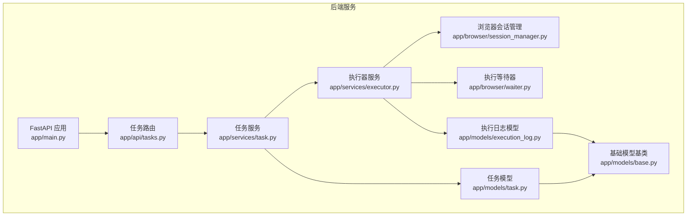
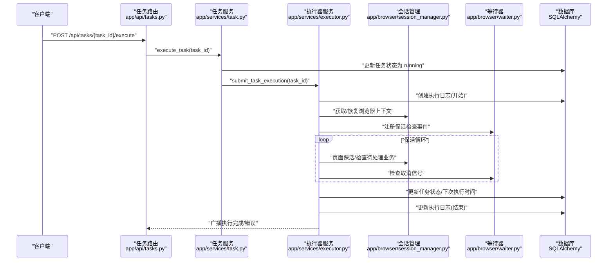
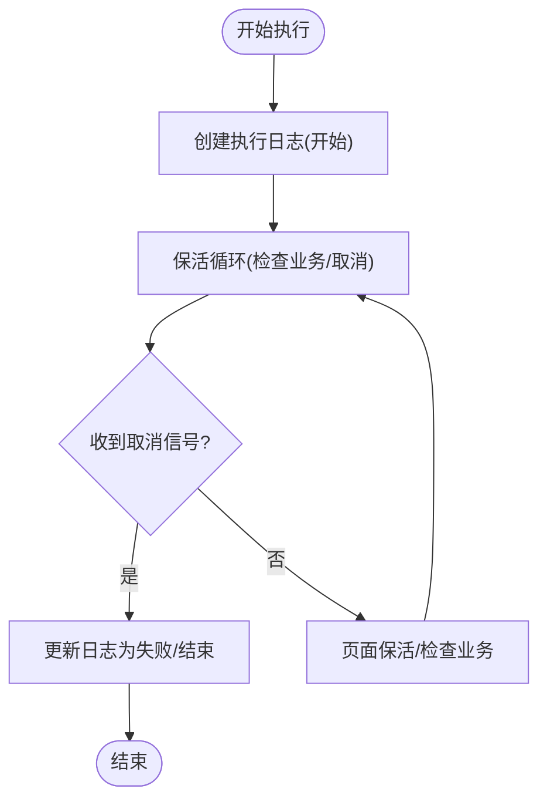
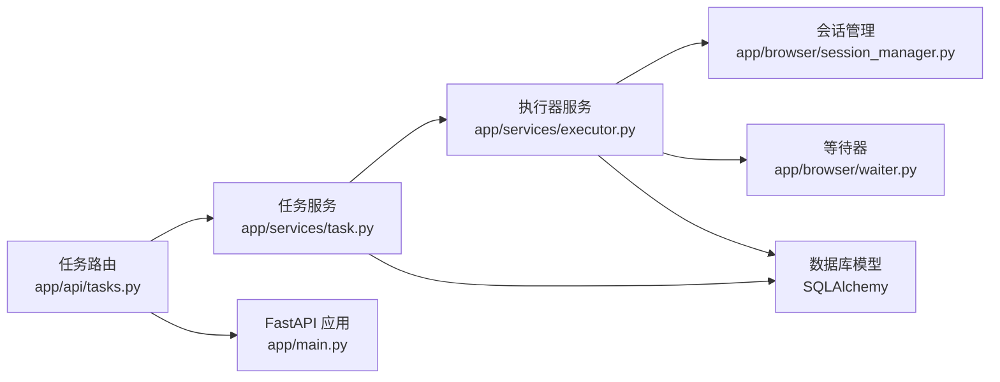

# 计费统计模块

<cite>
**本文档引用的文件**
- [app/main.py](file://CCC_RPA_API/app/main.py)
- [app/models/task.py](file://CCC_RPA_API/app/models/task.py)
- [app/models/execution_log.py](file://CCC_RPA_API/app/models/execution_log.py)
- [app/models/base.py](file://CCC_RPA_API/app/models/base.py)
- [app/services/executor.py](file://CCC_RPA_API/app/services/executor.py)
- [app/services/task.py](file://CCC_RPA_API/app/services/task.py)
- [app/api/tasks.py](file://CCC_RPA_API/app/api/tasks.py)
- [app/browser/session_manager.py](file://CCC_RPA_API/app/browser/session_manager.py)
- [app/browser/waiter.py](file://CCC_RPA_API/app/browser/waiter.py)
</cite>

## 目录
1. [引言](#引言)
2. [项目结构](#项目结构)
3. [核心组件](#核心组件)
4. [架构总览](#架构总览)
5. [详细组件分析](#详细组件分析)
6. [依赖分析](#依赖分析)
7. [性能考虑](#性能考虑)
8. [故障排查指南](#故障排查指南)
9. [结论](#结论)
10. [附录](#附录)

## 引言
本文件面向“计费统计模块”的功能实现，聚焦于统一统计指标的采集与计算，包括：
- 会话运行时长
- AI 调用次数
- 自动化脚本执行次数
- 租户并发峰值

文档将阐述指标定义、数据采集策略、存储设计、报表生成思路以及标准化对外数据接口的预留方案，并通过图示展示关键流程与组件交互。

## 项目结构
本项目采用前后端分离架构，计费统计模块主要涉及后端服务层与数据库模型层。核心目录与文件如下：
- 后端应用入口与路由注册：app/main.py
- 数据库模型：app/models/task.py、app/models/execution_log.py、app/models/base.py
- 业务服务：app/services/executor.py、app/services/task.py
- API 路由：app/api/tasks.py
- 浏览器会话与等待机制：app/browser/session_manager.py、app/browser/waiter.py

图表来源
- [app/main.py:30-87](file://CCC_RPA_API/app/main.py#L30-L87)
- [app/models/task.py:8-25](file://CCC_RPA_API/app/models/task.py#L8-L25)
- [app/models/execution_log.py:7-17](file://CCC_RPA_API/app/models/execution_log.py#L7-L17)
- [app/models/base.py:7-11](file://CCC_RPA_API/app/models/base.py#L7-L11)
- [app/services/task.py:44-157](file://CCC_RPA_API/app/services/task.py#L44-L157)
- [app/services/executor.py:1-319](file://CCC_RPA_API/app/services/executor.py#L1-L319)
- [app/api/tasks.py:10-76](file://CCC_RPA_API/app/api/tasks.py#L10-L76)
- [app/browser/session_manager.py:10-186](file://CCC_RPA_API/app/browser/session_manager.py#L10-L186)
- [app/browser/waiter.py:7-84](file://CCC_RPA_API/app/browser/waiter.py#L7-L84)

章节来源
- [app/main.py:30-87](file://CCC_RPA_API/app/main.py#L30-L87)
- [app/models/task.py:8-25](file://CCC_RPA_API/app/models/task.py#L8-L25)
- [app/models/execution_log.py:7-17](file://CCC_RPA_API/app/models/execution_log.py#L7-L17)
- [app/models/base.py:7-11](file://CCC_RPA_API/app/models/base.py#L7-L11)
- [app/services/task.py:44-157](file://CCC_RPA_API/app/services/task.py#L44-L157)
- [app/services/executor.py:1-319](file://CCC_RPA_API/app/services/executor.py#L1-L319)
- [app/api/tasks.py:10-76](file://CCC_RPA_API/app/api/tasks.py#L10-L76)
- [app/browser/session_manager.py:10-186](file://CCC_RPA_API/app/browser/session_manager.py#L10-L186)
- [app/browser/waiter.py:7-84](file://CCC_RPA_API/app/browser/waiter.py#L7-L84)

## 核心组件
- 任务模型与租户字段：任务实体包含租户标识字段，用于后续按租户维度进行统计与报表归集。
- 执行日志模型：记录每次任务执行的开始时间、结束时间、状态与结果消息，作为会话运行时长与执行次数的基础数据源。
- 任务服务：封装任务查询、创建、更新、删除与执行提交等逻辑；执行提交后异步调度执行器。
- 执行器服务：负责任务执行全流程，包括浏览器会话管理、扫码登录、业务执行、保活循环、异常处理与最终状态落库。
- API 路由：提供任务列表、创建、查询、执行、日志查询、扫码完成、选择单位、取消执行等接口。
- 浏览器会话管理：按省份维护 Playwright 上下文，持久化登录状态，保障执行稳定性。
- 执行等待器：基于线程事件实现用户交互阻塞与取消控制，确保保活循环可中断。

章节来源
- [app/models/task.py:8-25](file://CCC_RPA_API/app/models/task.py#L8-L25)
- [app/models/execution_log.py:7-17](file://CCC_RPA_API/app/models/execution_log.py#L7-L17)
- [app/services/task.py:44-157](file://CCC_RPA_API/app/services/task.py#L44-L157)
- [app/services/executor.py:1-319](file://CCC_RPA_API/app/services/executor.py#L1-L319)
- [app/api/tasks.py:10-76](file://CCC_RPA_API/app/api/tasks.py#L10-L76)
- [app/browser/session_manager.py:10-186](file://CCC_RPA_API/app/browser/session_manager.py#L10-L186)
- [app/browser/waiter.py:7-84](file://CCC_RPA_API/app/browser/waiter.py#L7-L84)

## 架构总览
下图展示了从 API 请求到任务执行、日志落库与状态更新的整体流程，体现计费统计所需的关键数据节点与流转路径。

图表来源
- [app/api/tasks.py:47-52](file://CCC_RPA_API/app/api/tasks.py#L47-L52)
- [app/services/task.py:119-133](file://CCC_RPA_API/app/services/task.py#L119-L133)
- [app/services/executor.py:78-314](file://CCC_RPA_API/app/services/executor.py#L78-L314)
- [app/browser/session_manager.py:98-126](file://CCC_RPA_API/app/browser/session_manager.py#L98-L126)
- [app/browser/waiter.py:71-83](file://CCC_RPA_API/app/browser/waiter.py#L71-L83)

## 详细组件分析

### 统一统计指标定义与采集策略
- 会话运行时长
  - 定义：单次任务执行的持续时间，即“结束时间 - 开始时间”。
  - 采集：执行器在任务开始时创建执行日志记录开始时间；在任务完成或失败时更新结束时间与状态。
  - 存储：执行日志模型包含开始与结束时间字段，支持按任务维度统计。
- AI 调用次数
  - 定义：在业务执行过程中调用外部 AI 接口的次数。
  - 采集：在执行器中对 AI 调用点进行计数，按任务维度累加；若需按租户统计，可在任务模型读取租户标识后聚合。
  - 存储：建议新增“AI 调用统计表”，字段包含任务 ID、租户 ID、调用次数、统计周期等。
- 自动化脚本执行次数
  - 定义：每个任务生命周期内完成的自动化执行次数（以任务完成为一次完整执行）。
  - 采集：执行器在任务完成后更新任务状态与下次执行时间，执行日志记录完成状态，二者均可作为计数依据。
  - 存储：沿用执行日志模型即可满足统计需求。
- 租户并发峰值
  - 定义：在任意时刻处于“运行中”的任务数量（按租户维度）。
  - 采集：在任务状态更新为“running”时增加计数，在完成或失败时减少计数；按租户与时间窗口聚合。
  - 存储：建议新增“租户并发统计表”，字段包含租户 ID、统计时间戳、并发数、统计周期等。

章节来源
- [app/models/execution_log.py:7-17](file://CCC_RPA_API/app/models/execution_log.py#L7-L17)
- [app/services/executor.py:78-314](file://CCC_RPA_API/app/services/executor.py#L78-L314)
- [app/models/task.py:8-25](file://CCC_RPA_API/app/models/task.py#L8-L25)

### 数据采集与计算流程
- 任务执行生命周期
  - 提交执行：API 路由调用任务服务，设置任务状态为“running”，并提交至执行器。
  - 执行器创建日志：记录开始时间与状态。
  - 保活循环：执行器在浏览器上下文中执行保活与业务检查，期间可响应取消信号。
  - 结束与落库：根据执行结果更新任务状态、下次执行时间与执行日志的结束时间与状态。
- 并发峰值计算
  - 在任务状态变为“running”时，按租户维度计数+1；完成或失败时计数-1。
  - 可按分钟/小时粒度汇总，形成时间序列并发数据。

图表来源
- [app/services/executor.py:78-314](file://CCC_RPA_API/app/services/executor.py#L78-L314)
- [app/browser/waiter.py:56-69](file://CCC_RPA_API/app/browser/waiter.py#L56-L69)

章节来源
- [app/services/executor.py:78-314](file://CCC_RPA_API/app/services/executor.py#L78-L314)
- [app/browser/waiter.py:56-69](file://CCC_RPA_API/app/browser/waiter.py#L56-L69)

### 按租户维度持久化统计数据
- 任务与租户关联
  - 任务模型包含租户标识字段，可用于按租户聚合统计。
- 执行日志持久化
  - 执行日志模型记录任务执行的起止时间与状态，支持按任务与时间范围统计。
- 建议新增统计表
  - AI 调用统计表：任务 ID、租户 ID、调用次数、统计周期。
  - 租户并发统计表：租户 ID、统计时间戳、并发数、统计周期。
  - 自动化执行统计表：任务 ID、租户 ID、执行次数、统计周期。

章节来源
- [app/models/task.py:8-25](file://CCC_RPA_API/app/models/task.py#L8-L25)
- [app/models/execution_log.py:7-17](file://CCC_RPA_API/app/models/execution_log.py#L7-L17)

### 可视化统计报表与标准化对外接口
- 报表生成思路
  - 会话运行时长：按任务/租户/时间窗口统计平均时长与总量。
  - AI 调用次数：按租户/时间窗口统计调用总量与趋势。
  - 自动化脚本执行次数：按任务/租户/时间窗口统计完成次数。
  - 租户并发峰值：按租户/时间窗口统计并发峰值与平均值。
- 对外接口预留
  - 新增统计报表接口：GET /api/statistics/tenants/{tenant_id}/daily、GET /api/statistics/tenants/{tenant_id}/monthly 等。
  - 返回格式：JSON，包含指标名称、数值、时间范围与单位。
  - 权限控制：结合鉴权中间件与租户隔离策略。

章节来源
- [app/api/tasks.py:10-76](file://CCC_RPA_API/app/api/tasks.py#L10-L76)
- [app/main.py:24-27](file://CCC_RPA_API/app/main.py#L24-L27)

## 依赖分析
- 组件耦合
  - API 路由依赖任务服务；任务服务依赖数据库模型与执行器服务。
  - 执行器服务依赖浏览器会话管理与等待器，同时写入数据库。
  - 数据库模型通过基础基类统一创建与更新时间戳。
- 外部依赖
  - SQLAlchemy：ORM 映射与事务管理。
  - FastAPI：路由与 Websocket 广播。
  - Playwright：浏览器自动化与会话持久化。

图表来源
- [app/api/tasks.py:10-76](file://CCC_RPA_API/app/api/tasks.py#L10-L76)
- [app/services/task.py:44-157](file://CCC_RPA_API/app/services/task.py#L44-L157)
- [app/services/executor.py:1-319](file://CCC_RPA_API/app/services/executor.py#L1-L319)
- [app/browser/session_manager.py:10-186](file://CCC_RPA_API/app/browser/session_manager.py#L10-L186)
- [app/browser/waiter.py:7-84](file://CCC_RPA_API/app/browser/waiter.py#L7-L84)
- [app/main.py:24-27](file://CCC_RPA_API/app/main.py#L24-L27)

章节来源
- [app/api/tasks.py:10-76](file://CCC_RPA_API/app/api/tasks.py#L10-L76)
- [app/services/task.py:44-157](file://CCC_RPA_API/app/services/task.py#L44-L157)
- [app/services/executor.py:1-319](file://CCC_RPA_API/app/services/executor.py#L1-L319)
- [app/browser/session_manager.py:10-186](file://CCC_RPA_API/app/browser/session_manager.py#L10-L186)
- [app/browser/waiter.py:7-84](file://CCC_RPA_API/app/browser/waiter.py#L7-L84)
- [app/main.py:24-27](file://CCC_RPA_API/app/main.py#L24-L27)

## 性能考虑
- 线程与事件循环
  - 执行器使用线程池与独立工作线程执行浏览器操作，避免阻塞主事件循环。
  - WebSocket 广播通过主事件循环安全派发，降低跨线程通信风险。
- 保活循环优化
  - 分段等待与取消检查，提升对取消信号的响应速度。
- 数据库事务
  - 日志与任务状态更新在同一事务中提交，保证一致性。
- 并发峰值统计
  - 使用原子计数与时间窗口聚合，避免高并发下的竞争条件。

章节来源
- [app/services/executor.py:17-33](file://CCC_RPA_API/app/services/executor.py#L17-L33)
- [app/services/executor.py:253-266](file://CCC_RPA_API/app/services/executor.py#L253-L266)
- [app/browser/session_manager.py:42-77](file://CCC_RPA_API/app/browser/session_manager.py#L42-L77)
- [app/main.py:9-34](file://CCC_RPA_API/app/main.py#L9-L34)

## 故障排查指南
- 浏览器异常与恢复
  - 现象：执行过程中浏览器断开或页面异常。
  - 处理：执行器在保活循环中检查浏览器存活，必要时恢复会话并重新打开页面。
- 扫码登录与用户交互
  - 现象：扫码超时或用户取消。
  - 处理：等待器支持超时与取消信号，执行器据此终止流程并记录日志。
- 日志与状态一致性
  - 现象：任务状态与日志状态不一致。
  - 处理：执行器在异常分支中同样更新日志结束时间与状态，确保最终一致性。

章节来源
- [app/services/executor.py:42-69](file://CCC_RPA_API/app/services/executor.py#L42-L69)
- [app/browser/waiter.py:14-32](file://CCC_RPA_API/app/browser/waiter.py#L14-L32)
- [app/services/executor.py:286-314](file://CCC_RPA_API/app/services/executor.py#L286-L314)

## 结论
本计费统计模块以任务与执行日志为核心数据源，结合租户维度与保活循环，能够稳定采集会话运行时长、自动化脚本执行次数等关键指标。建议尽快引入 AI 调用计数与并发峰值统计的专用表，并在 API 层面提供标准化报表接口，以支撑可视化与计费结算。

## 附录
- 关键流程回顾
  - 任务执行提交 → 任务状态更新 → 执行器创建日志 → 保活循环与业务执行 → 更新任务与日志 → 广播完成/错误
- 建议扩展清单
  - 新增统计表：AI 调用统计、租户并发统计、自动化执行统计
  - 新增接口：按租户与时间窗口的统计报表接口
  - 新增指标：AI 调用耗时、平均并发时长、失败率等