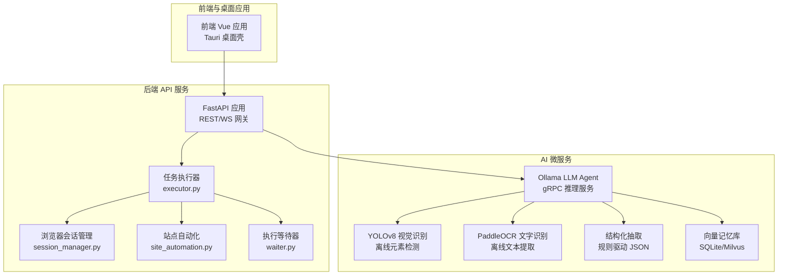
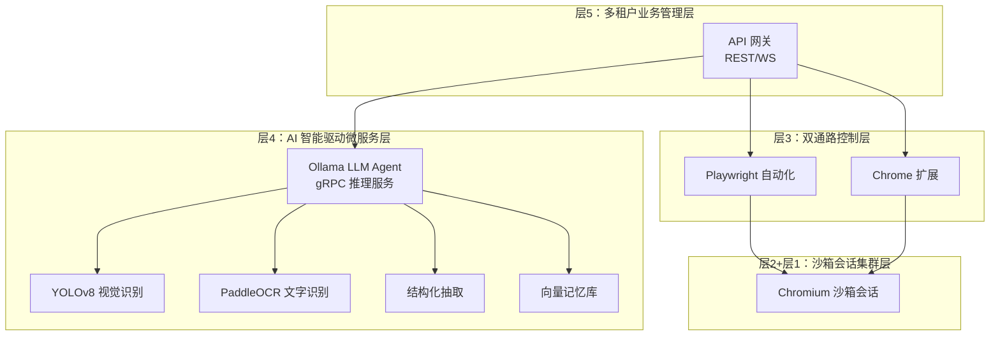
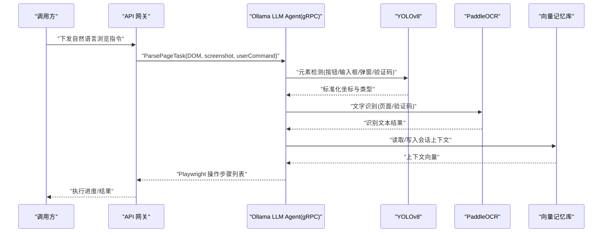
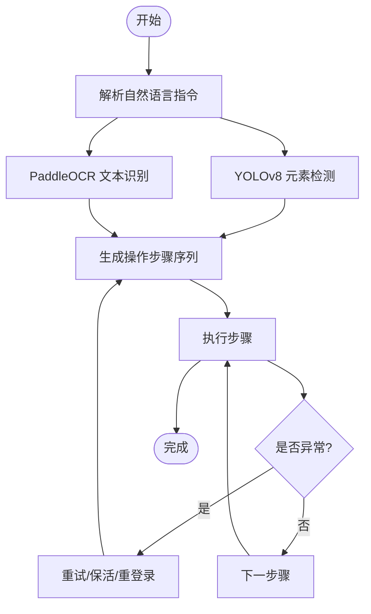
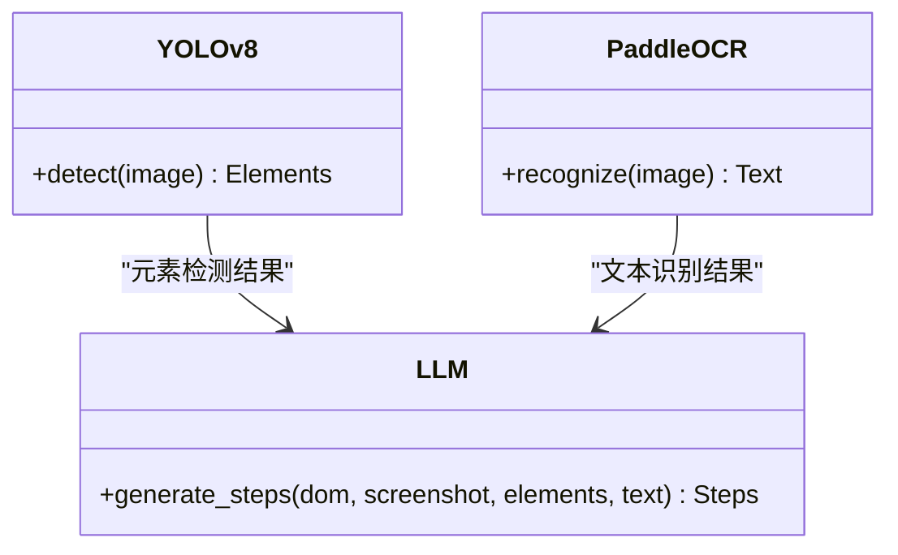
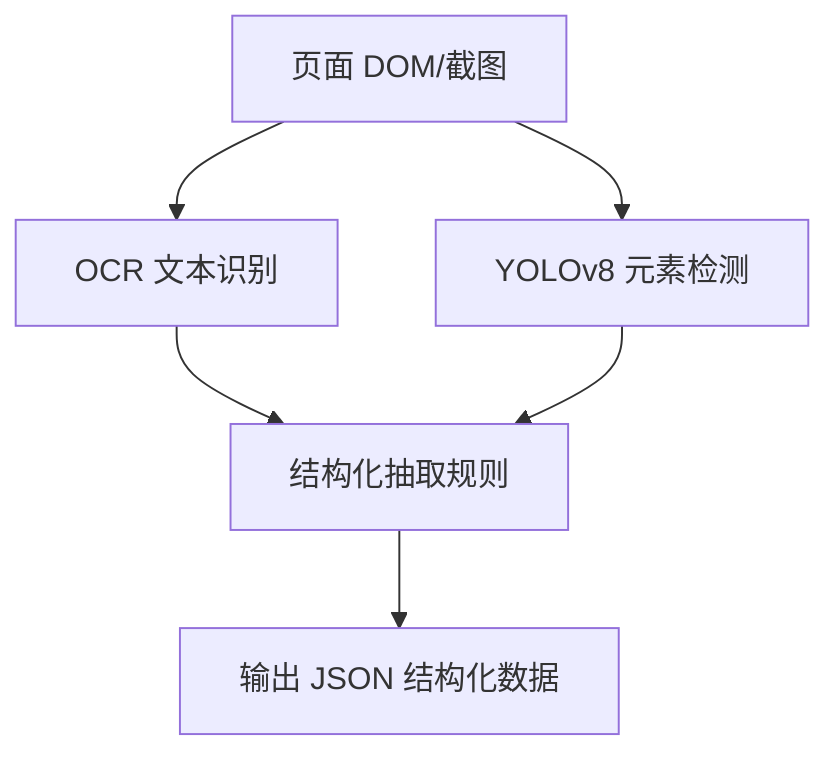
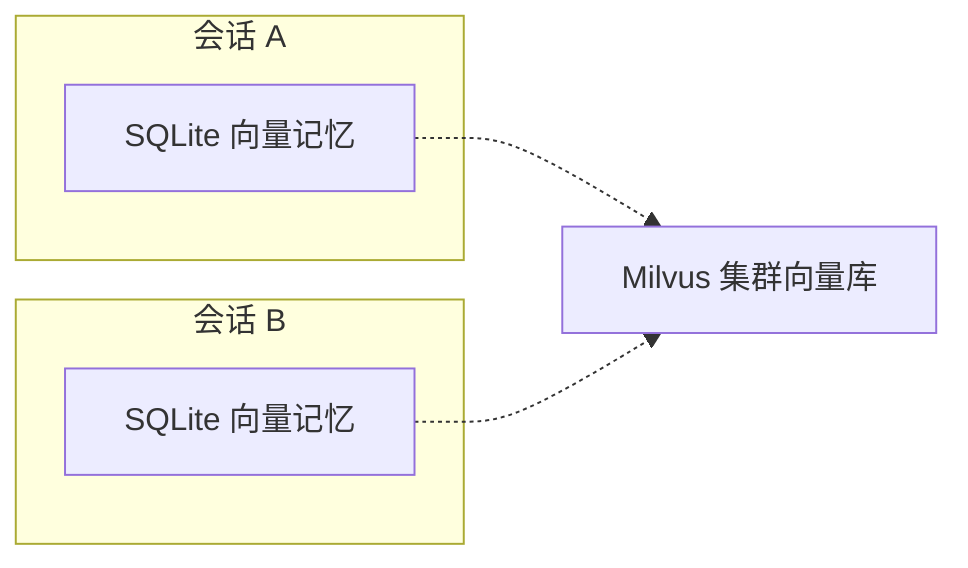
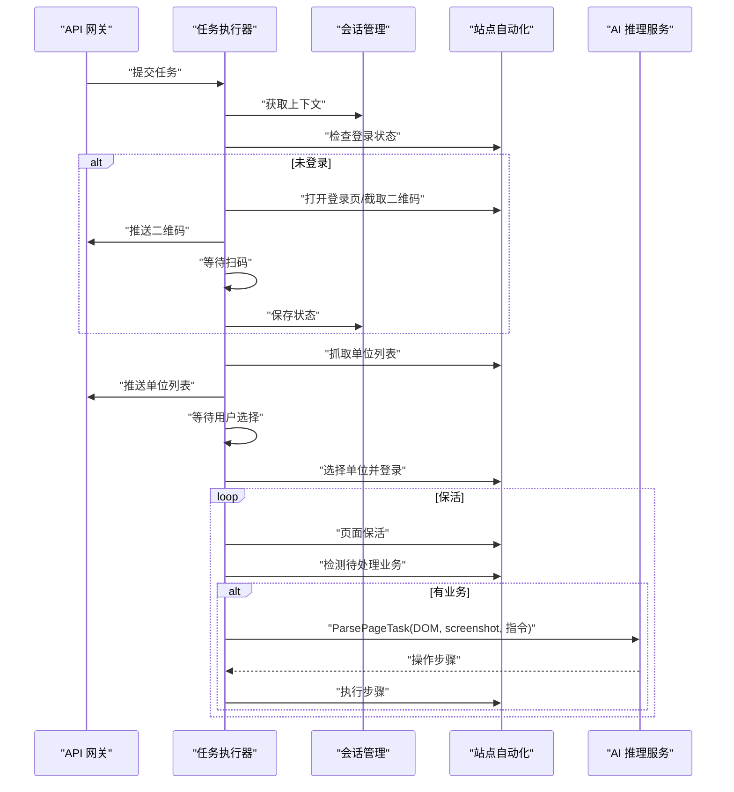
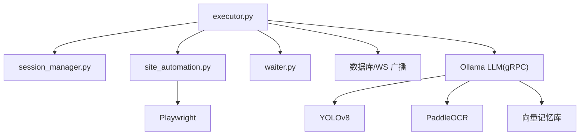

# AI 推理服务

<cite>
**本文引用的文件**
- [main.py](file://CCC_RPA_API/app/main.py)
- [config.py](file://CCC_RPA_API/app/config.py)
- [executor.py](file://CCC_RPA_API/app/services/executor.py)
- [session_manager.py](file://CCC_RPA_API/app/browser/session_manager.py)
- [site_automation.py](file://CCC_RPA_API/app/browser/site_automation.py)
- [waiter.py](file://CCC_RPA_API/app/browser/waiter.py)
- [task.py](file://CCC_RPA_API/app/models/task.py)
- [execution_log.py](file://CCC_RPA_API/app/models/execution_log.py)
- [project.md](file://project.md)
</cite>

## 目录
1. [简介](#简介)
2. [项目结构](#项目结构)
3. [核心组件](#核心组件)
4. [架构总览](#架构总览)
5. [详细组件分析](#详细组件分析)
6. [依赖分析](#依赖分析)
7. [性能考虑](#性能考虑)
8. [故障排查指南](#故障排查指南)
9. [结论](#结论)
10. [附录](#附录)

## 简介
本文件面向“AI 推理服务”的技术实现，聚焦于以下能力：
- Ollama LLM Agent 的 gRPC 推理服务封装
- 自然语言指令解析与页面操作序列生成
- 页面视觉识别（YOLOv8）与 OCR 文字识别（PaddleOCR）
- 结构化数据抽取
- 会话独立向量记忆库
- 多步骤操作序列生成与自适应流程决策机制
- 模型部署、推理优化与性能监控

根据项目需求文档，AI 推理服务属于“层 4：AI 智能驱动微服务层”，提供 Ollama LLM Agent、YOLOv8 视觉识别、PaddleOCR、结构化抽取与向量记忆库等能力，并通过 gRPC 与调度中心、浏览器会话层协同。

## 项目结构
本仓库包含三层：
- 前端与桌面应用：基于 Tauri/Vue 的浏览器控制面板与演示界面
- 后端 API 服务：基于 FastAPI 的 REST/WS 网关与任务执行引擎
- AI 微服务：面向 Ollama LLM Agent、YOLOv8、PaddleOCR、结构化抽取与向量记忆库的推理服务（以 gRPC 形式提供）

图表来源
- [main.py:1-127](file://CCC_RPA_API/app/main.py#L1-L127)
- [executor.py:1-319](file://CCC_RPA_API/app/services/executor.py#L1-L319)
- [session_manager.py:1-186](file://CCC_RPA_API/app/browser/session_manager.py#L1-L186)
- [site_automation.py:1-743](file://CCC_RPA_API/app/browser/site_automation.py#L1-L743)
- [waiter.py:1-84](file://CCC_RPA_API/app/browser/waiter.py#L1-L84)
- [project.md:383-411](file://project.md#L383-L411)

章节来源
- [main.py:1-127](file://CCC_RPA_API/app/main.py#L1-L127)
- [config.py:1-22](file://CCC_RPA_API/app/config.py#L1-L22)

## 核心组件
- FastAPI 网关与 WebSocket 通道：提供 REST/WS 接口、健康检查、事件循环捕获与广播
- 任务执行器：线程池驱动的执行流程编排，包含扫码登录、单位选择、保活循环与业务触发
- 浏览器会话管理：Playwright 工作线程隔离、上下文持久化、恢复与关闭
- 站点自动化：登录状态检查、二维码捕获、单位列表抓取、单位选择、保活与业务检测
- 执行等待器：基于 Event 的阻塞/非阻塞等待与取消信号
- 数据模型：任务与执行日志的 ORM 映射
- AI 微服务（需求定义）：Ollama LLM Agent、YOLOv8、PaddleOCR、结构化抽取、向量记忆库

章节来源
- [executor.py:1-319](file://CCC_RPA_API/app/services/executor.py#L1-L319)
- [session_manager.py:1-186](file://CCC_RPA_API/app/browser/session_manager.py#L1-L186)
- [site_automation.py:1-743](file://CCC_RPA_API/app/browser/site_automation.py#L1-L743)
- [waiter.py:1-84](file://CCC_RPA_API/app/browser/waiter.py#L1-L84)
- [task.py:1-25](file://CCC_RPA_API/app/models/task.py#L1-L25)
- [execution_log.py:1-17](file://CCC_RPA_API/app/models/execution_log.py#L1-L17)

## 架构总览
AI 推理服务在整体架构中的定位如下：

图表来源
- [project.md:173-187](file://project.md#L173-L187)
- [project.md:383-411](file://project.md#L383-L411)
- [project.md:463-479](file://project.md#L463-L479)

## 详细组件分析

### Ollama LLM Agent gRPC 推理服务封装
- 能力边界
  - 接收自然语言浏览指令，结合页面 DOM 与截图，拆解为标准化 Playwright 操作序列
  - 自适应流程决策：识别弹窗、验证码、页面跳转，动态调整后续步骤，支持单步失败重试
  - 每个会话绑定独立 AI 记忆上下文，租户之间记忆完全隔离
- 与浏览器会话层的协作
  - 通过 gRPC 从调度中心获取会话资源与上下文
  - 在执行过程中，向 AI 服务推送页面 DOM 与截图，接收操作步骤列表
- 与视觉与 OCR 的协作
  - 将 YOLOv8 的元素检测结果与 PaddleOCR 的文本识别结果标准化后输入 LLM
- 与向量记忆库的协作
  - 会话独立上下文与历史交互写入向量记忆库，用于后续决策与上下文增强

图表来源
- [project.md:385-393](file://project.md#L385-L393)
- [project.md:467-473](file://project.md#L467-L473)

章节来源
- [project.md:385-393](file://project.md#L385-L393)
- [project.md:467-473](file://project.md#L467-L473)

### 自然语言指令解析与多步骤操作序列生成
- 解析流程
  - 输入：自然语言指令、当前页面 DOM、截图
  - 输出：标准化 Playwright 操作步骤列表（导航、点击、输入、等待、滚动等）
- 多步骤生成
  - 将复杂指令拆分为原子步骤，结合视觉与 OCR 结果定位元素
  - 通过自适应决策机制处理弹窗、验证码、页面跳转等异常分支
- 失败重试
  - 单步失败时回滚并重试，必要时触发页面保活或重新登录

图表来源
- [project.md:389-391](file://project.md#L389-L391)

章节来源
- [project.md:389-391](file://project.md#L389-L391)

### 页面视觉识别（YOLOv8）与 OCR 文字识别（PaddleOCR）
- 视觉识别
  - 离线元素检测：按钮、输入框、提交控件、弹窗、验证码区域
  - 输出标准化坐标与元素类型，供 LLM 生成操作指令
- OCR 识别
  - 离线文字识别：页面全文与验证码字符提取
  - 识别结果标准化，供 LLM 与结构化抽取模块使用

图表来源
- [project.md:395-401](file://project.md#L395-L401)

章节来源
- [project.md:395-401](file://project.md#L395-L401)

### 结构化数据抽取
- 输入：页面 DOM、截图、自定义抽取规则
- 输出：标准 JSON 结构化数据（表格、商品、表单、订单信息）
- 与 LLM 协同：先通过视觉与 OCR 获取元素与文本，再由 LLM 生成抽取规则或直接解析

图表来源
- [project.md:403-405](file://project.md#L403-L405)

章节来源
- [project.md:403-405](file://project.md#L403-L405)

### 会话独立向量记忆库
- 单机部署：SQLite 存储单租户会话记忆
- 集群部署：Milvus 向量库
- 生命周期：会话销毁自动清理临时记忆；持久化记忆加密并绑定租户 ID
- 与 LLM 协同：为每个会话维护独立上下文，提升指令理解与操作一致性

图表来源
- [project.md:407-411](file://project.md#L407-L411)

章节来源
- [project.md:407-411](file://project.md#L407-L411)

### 任务执行与保活循环（与 AI 推理服务的衔接）
- 扫码登录：拉起登录页、截取二维码、等待用户扫码、保存状态
- 单位选择：抓取单位列表、等待用户选择、切换单位账户
- 保活循环：页面保活、检测待处理业务、触发子任务执行
- 与 AI 的衔接：在业务触发点，将页面 DOM/截图送入 AI 推理服务，生成下一步操作

图表来源
- [executor.py:78-278](file://CCC_RPA_API/app/services/executor.py#L78-L278)
- [site_automation.py:38-540](file://CCC_RPA_API/app/browser/site_automation.py#L38-L540)
- [session_manager.py:98-126](file://CCC_RPA_API/app/browser/session_manager.py#L98-L126)

章节来源
- [executor.py:78-278](file://CCC_RPA_API/app/services/executor.py#L78-L278)
- [site_automation.py:38-540](file://CCC_RPA_API/app/browser/site_automation.py#L38-L540)
- [session_manager.py:98-126](file://CCC_RPA_API/app/browser/session_manager.py#L98-L126)

## 依赖分析
- 组件耦合
  - 任务执行器与浏览器会话管理高度耦合，通过专用工作线程隔离 Playwright 操作
  - 执行器与站点自动化紧密协作，负责业务流程编排
  - 执行器与等待器配合，实现阻塞等待与取消信号
- 外部依赖
  - Ollama、YOLOv8、PaddleOCR 作为 gRPC 服务依赖
  - 数据库（MySQL）与 WebSocket 广播
- 潜在风险
  - 线程安全与事件循环广播需谨慎处理
  - 浏览器崩溃恢复与状态持久化

图表来源
- [executor.py:1-319](file://CCC_RPA_API/app/services/executor.py#L1-L319)
- [session_manager.py:1-186](file://CCC_RPA_API/app/browser/session_manager.py#L1-L186)
- [site_automation.py:1-743](file://CCC_RPA_API/app/browser/site_automation.py#L1-L743)
- [waiter.py:1-84](file://CCC_RPA_API/app/browser/waiter.py#L1-L84)
- [project.md:385-411](file://project.md#L385-L411)

章节来源
- [executor.py:1-319](file://CCC_RPA_API/app/services/executor.py#L1-L319)
- [session_manager.py:1-186](file://CCC_RPA_API/app/browser/session_manager.py#L1-L186)
- [site_automation.py:1-743](file://CCC_RPA_API/app/browser/site_automation.py#L1-L743)
- [waiter.py:1-84](file://CCC_RPA_API/app/browser/waiter.py#L1-L84)
- [project.md:385-411](file://project.md#L385-L411)

## 性能考虑
- 会话创建与 AI 推理性能
  - 会话创建耗时：K8s ≤3s，单机 ≤1s
  - AI 单条自然语言指令推理响应：7B 本地模型 ≤1.5s
- 并发与吞吐
  - API 网关单接口 QPS≥100，WebSocket 在线≥1000 路
  - CDP 页面操作延迟≤200ms
- 优化建议
  - 使用 GPU 加速（NVIDIA CUDA）与纯 CPU 双模式
  - 预热模型、缓存常用操作模板
  - 任务队列削峰限流，避免服务雪崩
  - 监控与告警：Prometheus + Grafana，ELK 审计日志

章节来源
- [project.md:506-516](file://project.md#L506-L516)
- [project.md:528-530](file://project.md#L528-L530)

## 故障排查指南
- 浏览器会话异常
  - 现象：浏览器断开、页面崩溃
  - 处理：检查连接状态，触发恢复流程，重建上下文
- 扫码登录失败
  - 现象：二维码无法加载、扫码超时
  - 处理：确认页面加载、截图降级策略、等待器超时设置
- 单位选择失败
  - 现象：CSS 选择器匹配不到元素
  - 处理：回退到 JS 匹配，记录失败截图，检查页面结构变化
- AI 推理超时
  - 现象：LLM 解析耗时过长
  - 处理：检查模型加载、GPU/CPU 资源、任务队列积压

章节来源
- [session_manager.py:147-170](file://CCC_RPA_API/app/browser/session_manager.py#L147-L170)
- [site_automation.py:148-172](file://CCC_RPA_API/app/browser/site_automation.py#L148-L172)
- [site_automation.py:294-540](file://CCC_RPA_API/app/browser/site_automation.py#L294-L540)
- [project.md:555-558](file://project.md#L555-L558)

## 结论
本项目在“层 4：AI 智能驱动微服务层”明确了 Ollama LLM Agent、YOLOv8、PaddleOCR、结构化抽取与向量记忆库的能力边界与协作方式。通过 gRPC 与调度中心、浏览器会话层的解耦设计，实现了自然语言到页面操作的自动化闭环。结合任务执行器的保活与业务触发机制，能够稳定支撑多步骤、自适应的复杂业务流程。

## 附录
- 部署形态
  - 单机进程沙箱：Linux Namespace/Cgroup 隔离，单机测试兼容
  - K8s 容器分布式：Pod 级别隔离，HPA 弹性扩缩容
- 监控与运维
  - Prometheus 指标采集、Grafana 可视化、ELK 审计日志、异常告警
- 安全与合规
  - 全链路 TLS 加密、会话快照 AES-256-CBC 加密、RBAC 权限、防检测指纹伪装

章节来源
- [project.md:189-208](file://project.md#L189-L208)
- [project.md:425-433](file://project.md#L425-L433)
- [project.md:518-530](file://project.md#L518-L530)