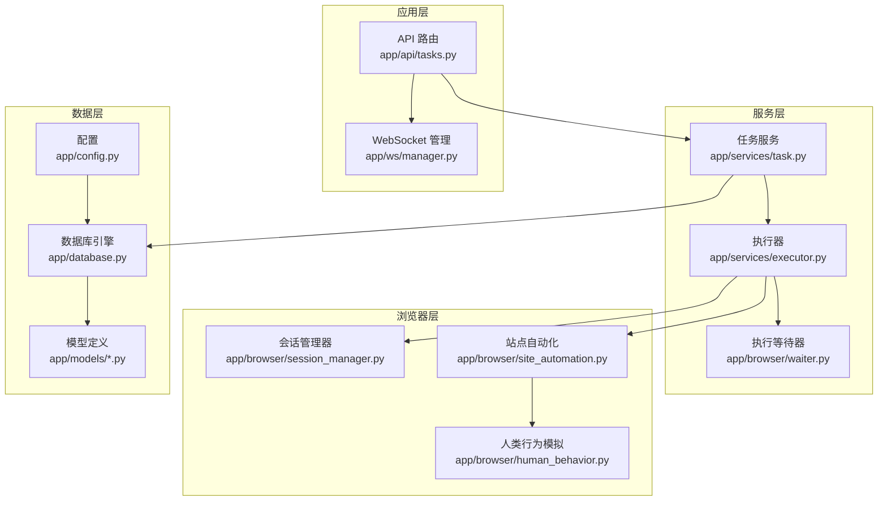
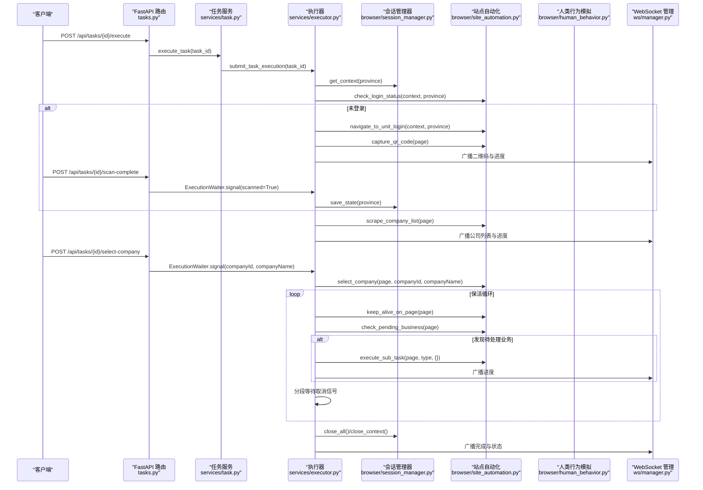
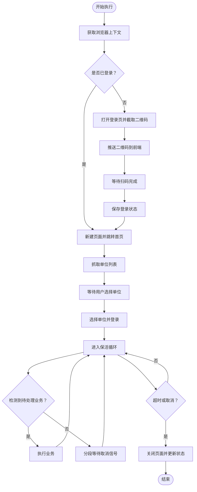
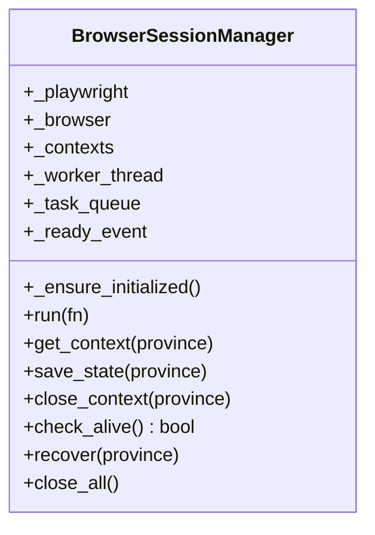
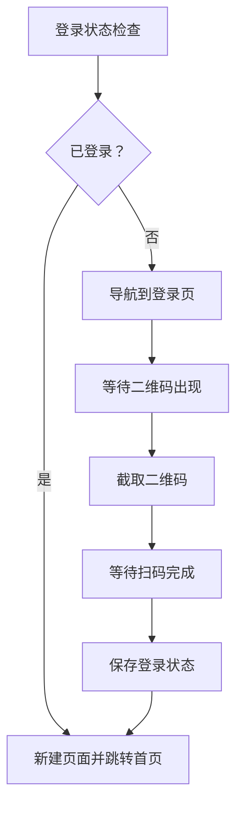
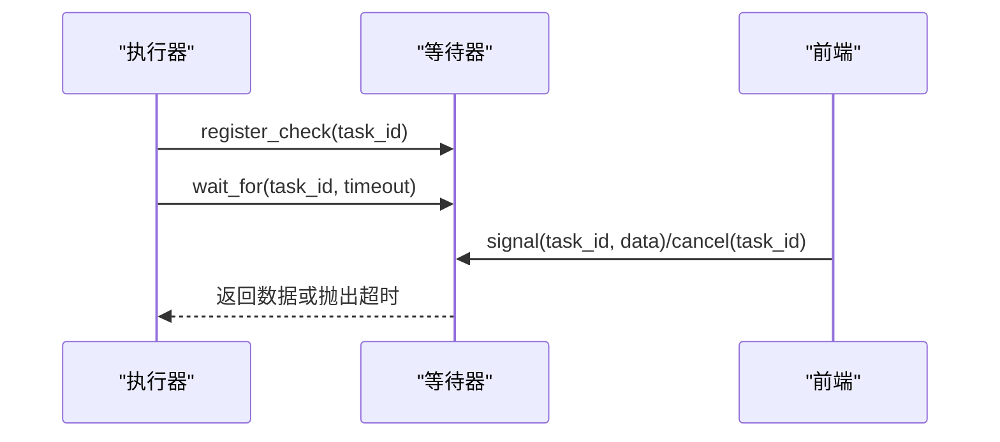
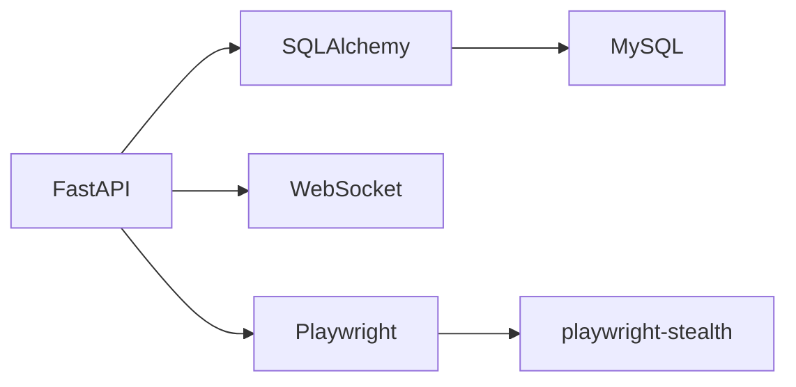

# LLM Agent 服务

<cite>
**本文档引用的文件**
- [main.py](file://CCC_RPA_API/app/main.py)
- [config.py](file://CCC_RPA_API/app/config.py)
- [database.py](file://CCC_RPA_API/app/database.py)
- [executor.py](file://CCC_RPA_API/app/services/executor.py)
- [session_manager.py](file://CCC_RPA_API/app/browser/session_manager.py)
- [site_automation.py](file://CCC_RPA_API/app/browser/site_automation.py)
- [human_behavior.py](file://CCC_RPA_API/app/browser/human_behavior.py)
- [waiter.py](file://CCC_RPA_API/app/browser/waiter.py)
- [manager.py](file://CCC_RPA_API/app/ws/manager.py)
- [tasks.py](file://CCC_RPA_API/app/api/tasks.py)
- [task.py](file://CCC_RPA_API/app/models/task.py)
- [execution_log.py](file://CCC_RPA_API/app/models/execution_log.py)
- [task.py](file://CCC_RPA_API/app/schemas/task.py)
- [requirements.txt](file://CCC_RPA_API/requirements.txt)
</cite>

## 目录
1. [简介](#简介)
2. [项目结构](#项目结构)
3. [核心组件](#核心组件)
4. [架构总览](#架构总览)
5. [详细组件分析](#详细组件分析)
6. [依赖分析](#依赖分析)
7. [性能考虑](#性能考虑)
8. [故障排查指南](#故障排查指南)
9. [结论](#结论)
10. [附录](#附录)

## 简介
本项目为面向“122.gov.cn”省级服务平台的 RPA Agent 服务，围绕以下能力构建：
- 基于 Playwright 的稳定浏览器会话与操作流水线
- 会话独立的 AI 记忆上下文（通过浏览器 storage_state 持久化）
- 自适应流程决策与保活循环（根据页面状态动态执行业务）
- 失败自动重试与恢复（浏览器崩溃自动重建）
- 前后端实时通信（WebSocket 广播执行进度）
- 数据持久化（MySQL + SQLAlchemy）

需要特别说明的是：当前仓库未包含基于 Ollama 的 gRPC 推理接口封装、自然语言浏览指令解析、多步骤标准化 Playwright 操作序列生成与自适应流程决策机制的具体实现。本文档聚焦于现有代码结构与实现细节，并在相应章节提供扩展建议以对接 LLM 推理与自然语言指令解析。

## 项目结构
后端采用 FastAPI + SQLAlchemy 架构，浏览器自动化逻辑集中在 app/browser 子目录，业务执行调度位于 app/services，API 路由位于 app/api，WebSocket 管理位于 app/ws。

**图表来源**
- [tasks.py:1-76](file://CCC_RPA_API/app/api/tasks.py#L1-L76)
- [executor.py:1-319](file://CCC_RPA_API/app/services/executor.py#L1-L319)
- [session_manager.py:1-186](file://CCC_RPA_API/app/browser/session_manager.py#L1-L186)
- [site_automation.py:1-743](file://CCC_RPA_API/app/browser/site_automation.py#L1-L743)
- [human_behavior.py:1-86](file://CCC_RPA_API/app/browser/human_behavior.py#L1-L86)
- [waiter.py:1-84](file://CCC_RPA_API/app/browser/waiter.py#L1-L84)
- [manager.py:1-29](file://CCC_RPA_API/app/ws/manager.py#L1-L29)
- [database.py:1-19](file://CCC_RPA_API/app/database.py#L1-L19)
- [config.py:1-22](file://CCC_RPA_API/app/config.py#L1-L22)

**章节来源**
- [main.py:1-127](file://CCC_RPA_API/app/main.py#L1-L127)
- [requirements.txt:1-11](file://CCC_RPA_API/requirements.txt#L1-L11)

## 核心组件
- 执行器（executor）：负责任务生命周期管理、浏览器会话恢复、扫码登录、单位选择、保活循环与业务执行、日志记录与状态更新。
- 会话管理器（session_manager）：在专用线程中启动 Chromium，按省份维护 BrowserContext，持久化 storage_state，提供线程安全的异步执行接口。
- 站点自动化（site_automation）：封装登录、扫码、单位列表抓取、单位选择、保活、业务检测与执行等页面操作。
- 等待器（waiter）：基于 threading.Event 的非阻塞/阻塞等待机制，支持取消与检查信号，用于用户交互与保活循环。
- 人类行为模拟（human_behavior）：提供随机滚动、点击、输入、等待等行为，降低被 WZWS 检测风险。
- WebSocket 管理（manager）：向客户端广播执行进度、二维码、错误与状态更新。
- API 路由（tasks.py）：提供任务 CRUD、执行、日志查询以及用户交互信号（扫码完成、选择单位、取消执行）。
- 数据模型与服务（models/schemas/services）：任务、执行日志的 ORM 映射与服务方法。

**章节来源**
- [executor.py:1-319](file://CCC_RPA_API/app/services/executor.py#L1-L319)
- [session_manager.py:1-186](file://CCC_RPA_API/app/browser/session_manager.py#L1-L186)
- [site_automation.py:1-743](file://CCC_RPA_API/app/browser/site_automation.py#L1-L743)
- [waiter.py:1-84](file://CCC_RPA_API/app/browser/waiter.py#L1-L84)
- [human_behavior.py:1-86](file://CCC_RPA_API/app/browser/human_behavior.py#L1-L86)
- [manager.py:1-29](file://CCC_RPA_API/app/ws/manager.py#L1-L29)
- [tasks.py:1-76](file://CCC_RPA_API/app/api/tasks.py#L1-L76)

## 架构总览
下图展示从 API 触发到浏览器自动化执行的端到端流程，包括会话恢复、扫码登录、单位选择、保活与业务执行。

**图表来源**
- [tasks.py:47-76](file://CCC_RPA_API/app/api/tasks.py#L47-L76)
- [executor.py:78-315](file://CCC_RPA_API/app/services/executor.py#L78-L315)
- [session_manager.py:99-186](file://CCC_RPA_API/app/browser/session_manager.py#L99-L186)
- [site_automation.py:38-743](file://CCC_RPA_API/app/browser/site_automation.py#L38-L743)
- [human_behavior.py:12-86](file://CCC_RPA_API/app/browser/human_behavior.py#L12-L86)
- [manager.py:1-29](file://CCC_RPA_API/app/ws/manager.py#L1-L29)

## 详细组件分析

### 执行器（任务执行流水线）
- 任务状态管理：创建执行日志、设置任务状态为运行中，完成后更新状态与下次执行时间。
- 浏览器会话：通过会话管理器获取/创建上下文，必要时进行崩溃恢复与页面重建。
- 登录流程：若未登录，打开登录页、截取二维码、推送前端、等待扫码完成并保存状态。
- 单位选择：抓取单位列表、等待用户选择、执行选择逻辑并登录到目标单位。
- 保活循环：在当前业务页面执行轻量保活操作，检测待处理业务并执行，支持取消与超时控制。
- 错误处理：捕获异常、更新任务与日志状态、广播错误消息、清理等待器。

**图表来源**
- [executor.py:78-315](file://CCC_RPA_API/app/services/executor.py#L78-L315)

**章节来源**
- [executor.py:1-319](file://CCC_RPA_API/app/services/executor.py#L1-L319)

### 会话管理器（Playwright 专用线程）
- 专用线程：启动 sync_playwright，创建 Chromium 实例，维护任务队列与事件同步。
- 上下文管理：按省份创建/复用 BrowserContext，读取 storage_state 持久化登录态。
- 线程安全：通过队列与 Event 实现跨线程调用，避免与 asyncio 冲突。
- 恢复机制：检测浏览器断开后重建，清空旧上下文并重新初始化。

**图表来源**
- [session_manager.py:10-186](file://CCC_RPA_API/app/browser/session_manager.py#L10-L186)

**章节来源**
- [session_manager.py:1-186](file://CCC_RPA_API/app/browser/session_manager.py#L1-L186)

### 站点自动化（页面操作编排）
- 登录状态检查：访问省平台首页，检测“退出”或用户信息元素。
- 登录页导航：优先直连统一登录页，失败则通过首页 JS 强制点击“单位用户登录”。
- 二维码截取：优先元素截图，失败降级整页截图。
- 单位列表抓取：多选择器降级策略，支持从文本中提取单位信息。
- 单位选择：优先文本匹配，其次 data-id/文本行匹配，最后索引回退；JS 回退兜底。
- 保活与业务检测：在当前页面执行轻量保活，检测徽章/关键词识别待处理业务类型。

**图表来源**
- [site_automation.py:38-192](file://CCC_RPA_API/app/browser/site_automation.py#L38-L192)

**章节来源**
- [site_automation.py:1-743](file://CCC_RPA_API/app/browser/site_automation.py#L1-L743)

### 等待器（用户交互与保活）
- 阻塞等待：为任务注册 Event，等待前端信号或超时。
- 非阻塞检查：保活循环中周期性检查取消信号，便于快速响应。
- 取消与清理：支持取消等待与资源清理，避免内存泄漏。

**图表来源**
- [waiter.py:7-84](file://CCC_RPA_API/app/browser/waiter.py#L7-L84)
- [executor.py:72-76](file://CCC_RPA_API/app/services/executor.py#L72-L76)

**章节来源**
- [waiter.py:1-84](file://CCC_RPA_API/app/browser/waiter.py#L1-L84)
- [executor.py:1-319](file://CCC_RPA_API/app/services/executor.py#L1-L319)

### 人类行为模拟（反检测）
- 随机延迟、滚动、点击、输入与等待，模拟真实用户行为。
- 点击前移动鼠标至元素中心附近，减少被检测概率。
- 支持滚动到元素可视与随机滚轮动作。

**章节来源**
- [human_behavior.py:1-86](file://CCC_RPA_API/app/browser/human_behavior.py#L1-L86)

### WebSocket 管理（实时通信）
- 维护连接集合，广播执行进度、二维码、错误与状态更新。
- 在工作线程中通过主事件循环安全广播消息，避免并发问题。

**章节来源**
- [manager.py:1-29](file://CCC_RPA_API/app/ws/manager.py#L1-L29)
- [executor.py:22-33](file://CCC_RPA_API/app/services/executor.py#L22-L33)

### API 路由与任务服务
- 提供任务 CRUD、执行、日志查询接口。
- 执行任务时更新状态并提交到执行器线程池。
- 用户交互：扫码完成、选择单位、取消执行，通过等待器传递信号。

**章节来源**
- [tasks.py:1-76](file://CCC_RPA_API/app/api/tasks.py#L1-L76)
- [task.py:120-134](file://CCC_RPA_API/app/services/task.py#L120-L134)

### 数据模型与持久化
- 任务与执行日志 ORM 映射，支持分页查询与字段扩展。
- 数据库连接池配置，启用 pre_ping 与 recycle。

**章节来源**
- [task.py:1-25](file://CCC_RPA_API/app/models/task.py#L1-L25)
- [execution_log.py:1-17](file://CCC_RPA_API/app/models/execution_log.py#L1-L17)
- [database.py:1-19](file://CCC_RPA_API/app/database.py#L1-L19)

## 依赖分析
- Web 框架与异步：FastAPI + Uvicorn，支持 WebSocket 与 CORS。
- 数据库：SQLAlchemy + MySQL，连接池参数优化。
- 浏览器自动化：Playwright（Chromium），playwright-stealth 降低检测。
- 配置：pydantic-settings + python-dotenv。

**图表来源**
- [requirements.txt:1-11](file://CCC_RPA_API/requirements.txt#L1-L11)

**章节来源**
- [requirements.txt:1-11](file://CCC_RPA_API/requirements.txt#L1-L11)

## 性能考虑
- 线程隔离：浏览器操作在专用线程执行，避免与 asyncio 事件循环冲突。
- 连接池：数据库连接池启用 pre_ping 与 recycle，提升稳定性。
- 保活策略：在当前页面执行轻量保活，避免页面跳转带来的额外开销。
- 选择器降级：站点自动化采用多选择器降级策略，提高鲁棒性。
- 日志与截图：调试截图仅在异常或关键节点触发，避免频繁 IO。

[本节为一般性指导，无需列出具体文件来源]

## 故障排查指南
- 浏览器崩溃：执行器在关键步骤调用恢复逻辑，重建会话并重新打开页面。
- 登录失败：检查二维码截图与页面跳转逻辑，确认网络与页面结构变化。
- 单位选择失败：核对选择器匹配策略与 JS 回退逻辑，查看失败截图。
- 保活无效：检查保活间隔与取消信号响应，确保等待器正确注册与清理。
- WebSocket 广播失败：检查主事件循环状态与连接集合，避免并发发送导致异常。

**章节来源**
- [executor.py:42-70](file://CCC_RPA_API/app/services/executor.py#L42-L70)
- [site_automation.py:294-541](file://CCC_RPA_API/app/browser/site_automation.py#L294-L541)
- [waiter.py:71-84](file://CCC_RPA_API/app/browser/waiter.py#L71-L84)
- [executor.py:22-33](file://CCC_RPA_API/app/services/executor.py#L22-L33)

## 结论
本项目提供了稳定、可扩展的 RPA 执行框架，具备完善的会话管理、用户交互与保活机制。当前实现聚焦于浏览器自动化与实时通信，未包含基于 Ollama 的 gRPC 推理接口封装、自然语言浏览指令解析与自适应流程决策机制。建议在现有架构基础上引入 LLM 推理服务与自然语言解析模块，将用户指令转化为标准化的 Playwright 操作序列，并结合会话独立的记忆上下文实现智能决策与容错恢复。

[本节为总结性内容，无需列出具体文件来源]

## 附录
- 会话独立 AI 记忆上下文：通过 BrowserContext 的 storage_state 持久化登录态，可在后续扩展中注入 AI 对话历史与页面理解记忆。
- 失败自动重试策略：在关键步骤（登录、单位选择、业务执行）前后进行浏览器存活检查与恢复，结合等待器的取消与超时控制，形成闭环。
- 推理优化与双模式支持：建议引入本地推理（CPU/GPU 可选）与云端推理的混合模式，依据任务复杂度与资源可用性动态切换。
- 性能调优：合理设置线程池大小、数据库连接池参数与保活间隔，结合日志与监控持续优化。

[本节为概念性内容，无需列出具体文件来源]