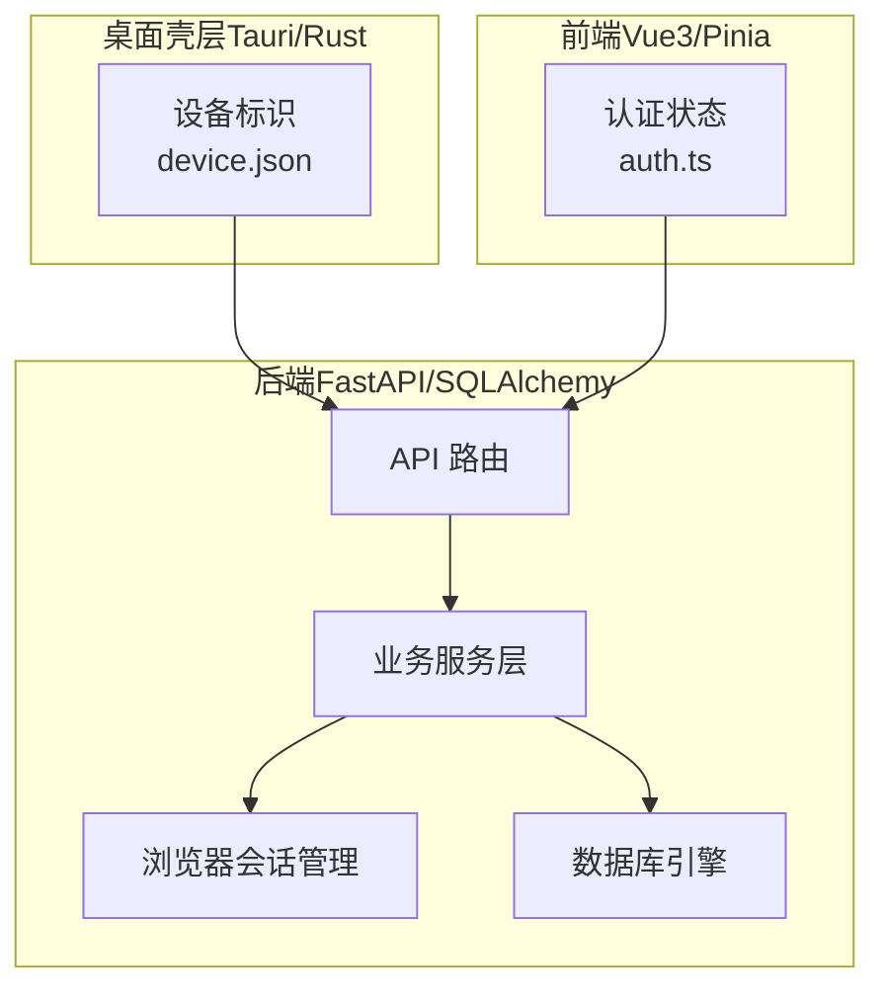
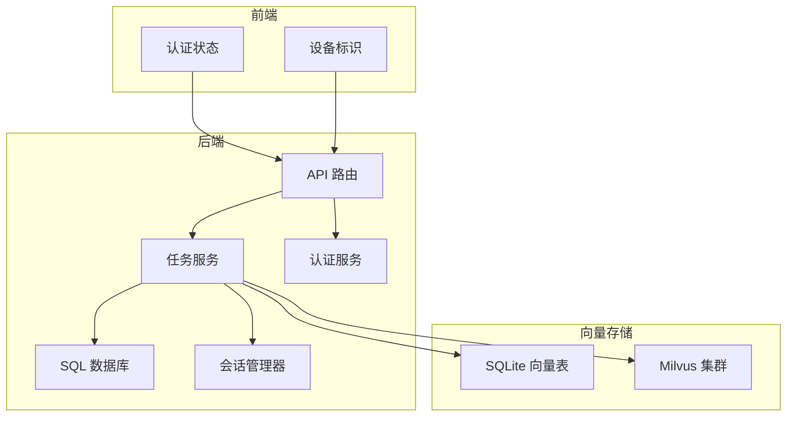
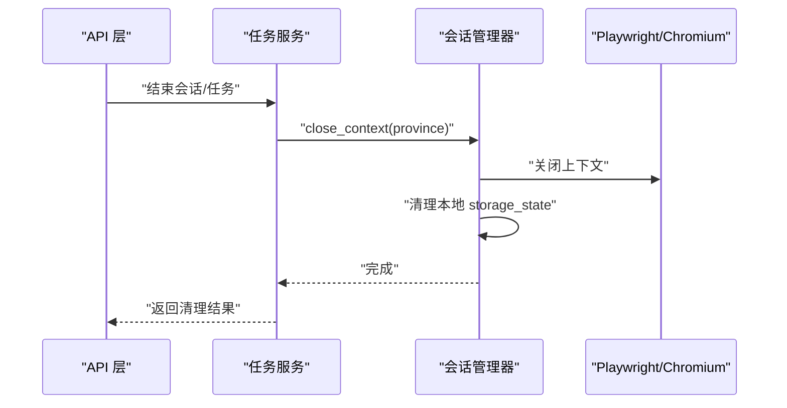
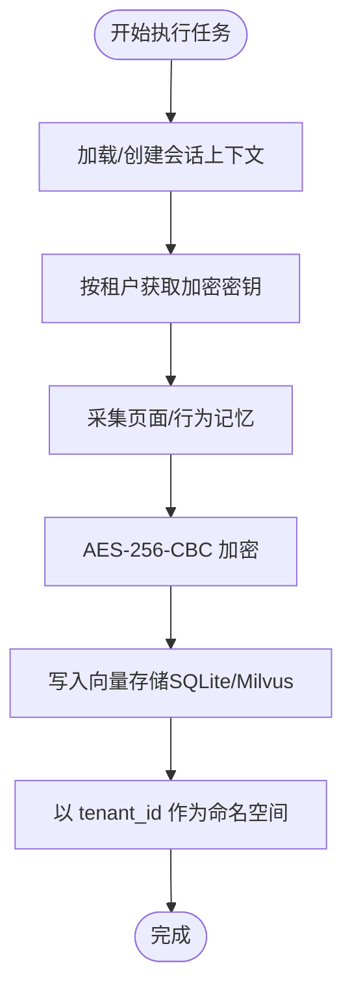
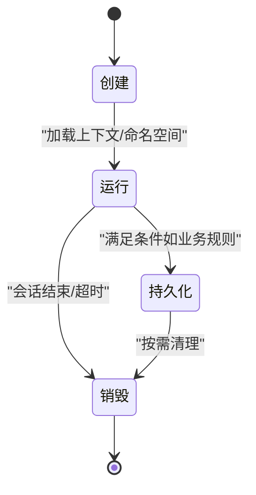
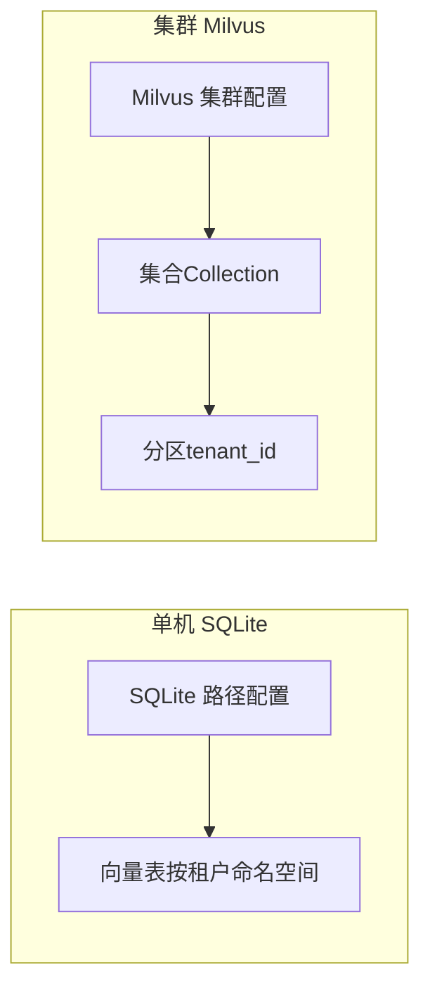
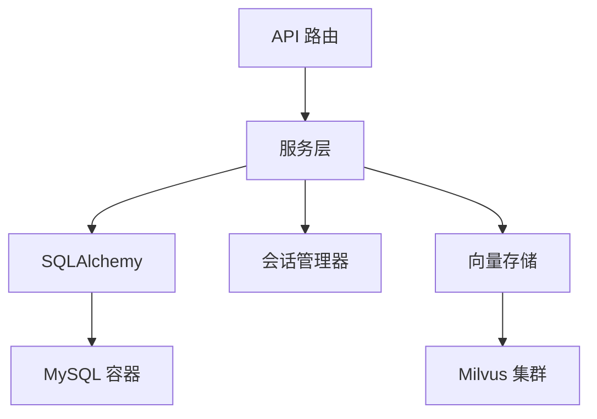

# 向量记忆存储

<cite>
**本文档引用的文件**
- [main.py](file://CCC_RPA_API/app/main.py)
- [session_manager.py](file://CCC_RPA_API/app/browser/session_manager.py)
- [config.py](file://CCC_RPA_API/app/config.py)
- [database.py](file://CCC_RPA_API/app/database.py)
- [base.py](file://CCC_RPA_API/app/models/base.py)
- [task.py](file://CCC_RPA_API/app/models/task.py)
- [execution_log.py](file://CCC_RPA_API/app/models/execution_log.py)
- [auth.py](file://CCC_RPA_API/app/services/auth.py)
- [task_service.py](file://CCC_RPA_API/app/services/task.py)
- [tenants.py](file://CCC_RPA_API/app/api/tenants.py)
- [project.md](file://project.md)
- [backend_config.py](file://CCC-BrowserV4/backend/app/config.py)
- [backend_database.py](file://CCC-BrowserV4/backend/app/database.py)
- [backend_readme.md](file://CCC-BrowserV4/backend/README.md)
- [docker_compose.yml](file://CCC-BrowserV4/docker-compose.yml)
- [device_store.rs](file://CCC-BrowserV4/src-tauri/src/device.rs)
- [auth_store.ts](file://CCC-BrowserV4/frontend/src/stores/auth.ts)
</cite>

## 目录
1. [简介](#简介)
2. [项目结构](#项目结构)
3. [核心组件](#核心组件)
4. [架构总览](#架构总览)
5. [详细组件分析](#详细组件分析)
6. [依赖分析](#依赖分析)
7. [性能考虑](#性能考虑)
8. [故障排查指南](#故障排查指南)
9. [结论](#结论)
10. [附录](#附录)

## 简介
本文件面向“向量记忆存储”的技术实现，结合现有代码库与项目文档，系统阐述：
- 单机 SQLite 与集群 Milvus 向量库的部署配置思路与适配要点
- 会话销毁自动清理机制与持久化记忆加密绑定租户 ID 的实现策略
- 租户间记忆完全隔离、临时记忆与持久化记忆的生命周期管理
- 存储优化、查询性能与数据安全最佳实践

说明：当前仓库未直接实现 Milvus 向量库接入与向量检索逻辑；本文在不虚构代码的前提下，基于现有会话管理、租户隔离与加密存储能力，给出可落地的向量记忆存储方案与实施建议。

## 项目结构
本项目由三层构成：
- 桌面壳层（Tauri/Rust）负责设备标识与本地存储
- 前端（Vue3/Pinia）负责用户态状态与交互
- 后端（FastAPI/SQLAlchemy）负责业务逻辑、数据库与浏览器会话管理

**图表来源**
- [main.py:1-127](file://CCC_RPA_API/app/main.py#L1-L127)
- [device_store.rs:1-31](file://CCC-BrowserV4/src-tauri/src/device.rs#L1-L31)
- [auth_store.ts:1-78](file://CCC-BrowserV4/frontend/src/stores/auth.ts#L1-L78)

**章节来源**
- [main.py:1-127](file://CCC_RPA_API/app/main.py#L1-L127)
- [project.md:1-200](file://project.md#L1-L200)

## 核心组件
- 会话管理与自动清理
  - 按省份隔离的 Playwright 上下文，支持 storage_state 持久化与恢复
  - 会话销毁时关闭上下文、回收资源，并在项目文档中强调“销毁后递归清空 UserData、缓存、下载目录、扩展本地存储”
- 租户隔离与身份绑定
  - 任务模型包含 tenant_id 字段，服务层在查询/写入时以租户维度过滤
  - 项目文档明确“会话登录快照统一采用 AES-256-CBC 加密存储，每个租户分配独立加密密钥”
- 数据库与配置
  - FastAPI 使用 SQLAlchemy 连接 MySQL；提供 SQLite 路径配置（用于单机场景）
  - 支持通过环境变量切换数据库类型与连接参数

**章节来源**
- [session_manager.py:1-186](file://CCC_RPA_API/app/browser/session_manager.py#L1-L186)
- [task.py:1-25](file://CCC_RPA_API/app/models/task.py#L1-L25)
- [task_service.py:1-157](file://CCC_RPA_API/app/services/task.py#L1-L157)
- [project.md:943-947](file://project.md#L943-L947)
- [backend_config.py:1-51](file://CCC-BrowserV4/backend/app/config.py#L1-L51)
- [backend_database.py:1-44](file://CCC-BrowserV4/backend/app/database.py#L1-L44)

## 架构总览
下图展示向量记忆存储在整体系统中的位置与交互：

**图表来源**
- [main.py:1-127](file://CCC_RPA_API/app/main.py#L1-L127)
- [session_manager.py:1-186](file://CCC_RPA_API/app/browser/session_manager.py#L1-L186)
- [backend_config.py:1-51](file://CCC-BrowserV4/backend/app/config.py#L1-L51)

## 详细组件分析

### 会话销毁自动清理机制
- 专用工作线程执行 Playwright 操作，避免与异步事件循环冲突
- 提供 close_all/close_context/save_state/recover/check_alive 等方法，确保资源可控
- 项目文档要求“销毁触发后必须递归清空 UserData、缓存、下载目录、扩展本地存储”，该机制为实现“无残留”提供基础

**图表来源**
- [session_manager.py:137-144](file://CCC_RPA_API/app/browser/session_manager.py#L137-L144)
- [session_manager.py:172-185](file://CCC_RPA_API/app/browser/session_manager.py#L172-L185)

**章节来源**
- [session_manager.py:1-186](file://CCC_RPA_API/app/browser/session_manager.py#L1-L186)
- [project.md:947-947](file://project.md#L947-L947)

### 持久化记忆加密与租户绑定
- 会话快照采用 AES-256-CBC 加密，密钥按租户维度独立存储
- 在任务执行过程中，可将“临时记忆”转化为“持久化记忆”，并以 tenant_id 作为命名空间与索引键
- 前端与桌面壳层提供设备标识与认证状态，便于在会话生命周期内进行身份与上下文绑定

**图表来源**
- [project.md:943-943](file://project.md#L943-L943)
- [auth_store.ts:1-78](file://CCC-BrowserV4/frontend/src/stores/auth.ts#L1-L78)
- [device_store.rs:1-31](file://CCC-BrowserV4/src-tauri/src/device.rs#L1-L31)

**章节来源**
- [project.md:943-943](file://project.md#L943-L943)
- [auth_store.ts:1-78](file://CCC-BrowserV4/frontend/src/stores/auth.ts#L1-L78)
- [device_store.rs:1-31](file://CCC-BrowserV4/src-tauri/src/device.rs#L1-L31)

### 租户间记忆完全隔离与生命周期管理
- 租户隔离
  - 任务模型包含 tenant_id 字段，服务层在查询/写入时以租户维度过滤
  - 向量存储的命名空间与索引均以 tenant_id 为前缀，确保跨租户不可见
- 临时记忆与持久化记忆
  - 临时记忆：会话上下文内的短期缓存，随会话销毁而清理
  - 持久化记忆：经加密后写入向量存储，支持跨会话复用与检索
- 生命周期
  - 创建：按租户初始化上下文与向量命名空间
  - 运行：采集临时记忆，必要时持久化
  - 销毁：清理上下文与本地存储，必要时清理向量索引

**图表来源**
- [task.py:1-25](file://CCC_RPA_API/app/models/task.py#L1-L25)
- [task_service.py:1-157](file://CCC_RPA_API/app/services/task.py#L1-L157)
- [session_manager.py:1-186](file://CCC_RPA_API/app/browser/session_manager.py#L1-L186)

**章节来源**
- [task.py:1-25](file://CCC_RPA_API/app/models/task.py#L1-L25)
- [task_service.py:1-157](file://CCC_RPA_API/app/services/task.py#L1-L157)

### 单机 SQLite 与集群 Milvus 部署配置
- 单机 SQLite（用于开发/测试）
  - 后端提供 SQLite 路径配置，可直接启用
  - 适合小规模、低并发场景，便于快速迭代
- 集群 Milvus（用于生产）
  - 建议在独立命名空间下为每个租户建立集合（Collection），并设置分区键为 tenant_id
  - 向量维度、索引类型与副本数需结合业务规模与查询延迟目标评估
  - 通过加密通道访问 Milvus，确保网络传输安全

**图表来源**
- [backend_config.py:37-47](file://CCC-BrowserV4/backend/app/config.py#L37-L47)
- [backend_readme.md:1-66](file://CCC-BrowserV4/backend/README.md#L1-L66)

**章节来源**
- [backend_config.py:1-51](file://CCC-BrowserV4/backend/app/config.py#L1-L51)
- [backend_readme.md:1-66](file://CCC-BrowserV4/backend/README.md#L1-L66)
- [docker_compose.yml:1-20](file://CCC-BrowserV4/docker-compose.yml#L1-L20)

### 查询性能与存储优化
- 索引与分区
  - 为 tenant_id、时间戳、任务 ID 等高频过滤字段建立索引
  - Milvus 使用分区键 tenant_id，避免跨租户扫描
- 向量化策略
  - 对页面截图、DOM 结构、OCR 文本等进行向量化，统一维度与归一化
  - 使用合适的相似度度量（如余弦距离）与阈值
- 缓存与批处理
  - 对热点查询结果进行缓存，减少重复计算
  - 批量插入/更新向量，降低网络往返开销

**章节来源**
- [project.md:1222-1232](file://project.md#L1222-L1232)

### 数据安全
- 传输安全：TLS 加密（HTTPS/WS）贯穿前后端与后端服务
- 存储安全：会话快照与敏感字段采用 AES-256-CBC 加密，密钥按租户独立管理
- 访问控制：基于 RBAC 的权限体系，确保租户无法越权访问他人会话与记忆

**章节来源**
- [project.md:941-941](file://project.md#L941-L941)
- [project.md:1240-1246](file://project.md#L1240-L1246)

## 依赖分析
- 组件耦合
  - API 层依赖服务层；服务层依赖数据库与会话管理器
  - 向量存储与数据库解耦，通过 tenant_id 实现逻辑隔离
- 外部依赖
  - MySQL（Docker 容器化部署）
  - Milvus（推荐集群部署，独立命名空间与密钥管理）

**图表来源**
- [main.py:1-127](file://CCC_RPA_API/app/main.py#L1-L127)
- [backend_database.py:1-44](file://CCC-BrowserV4/backend/app/database.py#L1-L44)
- [docker_compose.yml:1-20](file://CCC-BrowserV4/docker-compose.yml#L1-L20)

**章节来源**
- [main.py:1-127](file://CCC_RPA_API/app/main.py#L1-L127)
- [backend_database.py:1-44](file://CCC-BrowserV4/backend/app/database.py#L1-L44)
- [docker_compose.yml:1-20](file://CCC-BrowserV4/docker-compose.yml#L1-L20)

## 性能考虑
- 会话创建与销毁
  - 使用专用工作线程与延迟初始化，降低主线程阻塞
  - 严格遵循销毁流程，避免资源泄漏导致性能退化
- 数据库连接
  - 连接池参数（pool_size、max_overflow、pool_recycle、pool_pre_ping）需结合并发与延迟目标调优
- 向量检索
  - 合理设置索引类型与查询超时，避免长尾延迟
  - 对高并发场景采用分片与副本提升吞吐

**章节来源**
- [backend_database.py:8-22](file://CCC-BrowserV4/backend/app/database.py#L8-L22)
- [session_manager.py:30-77](file://CCC_RPA_API/app/browser/session_manager.py#L30-L77)

## 故障排查指南
- 会话初始化失败
  - 检查 Playwright 启动参数与 Chromium 可用性
  - 关注工作线程 Ready 事件与超时错误
- 数据库连接异常
  - 校验 DATABASE_URL 与凭据
  - 使用连接检查函数验证可达性
- 向量存储不可用
  - 确认 Milvus 集群健康状态与网络连通
  - 校验租户命名空间与分区键一致性
- 加密问题
  - 核对租户密钥是否存在且未过期
  - 检查加密/解密流程与向量维度匹配

**章节来源**
- [session_manager.py:42-77](file://CCC_RPA_API/app/browser/session_manager.py#L42-L77)
- [backend_database.py:37-44](file://CCC-BrowserV4/backend/app/database.py#L37-L44)
- [project.md:943-943](file://project.md#L943-L943)

## 结论
本项目已具备实现“向量记忆存储”的关键能力：按租户隔离、会话销毁自动清理、加密存储与设备/认证状态绑定。结合 SQLite 与 Milvus 的部署配置，可在不同规模场景下实现高性能、可扩展的记忆检索。建议在现有基础上补充向量入库/检索接口与租户命名空间管理，以形成完整的向量记忆闭环。

## 附录
- 快速对照
  - 租户隔离：tenant_id 字段 + 服务层过滤
  - 会话销毁：close_all/close_context/save_state
  - 加密存储：AES-256-CBC（按租户密钥）
  - 单机/集群：SQLite（开发）与 Milvus（生产）