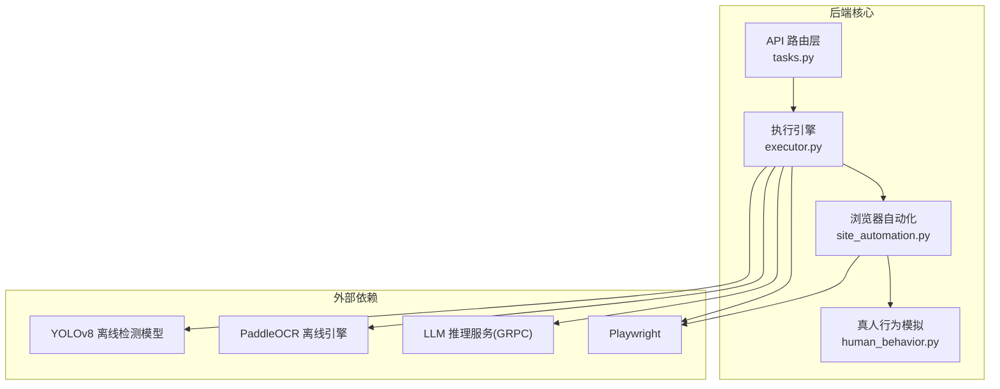
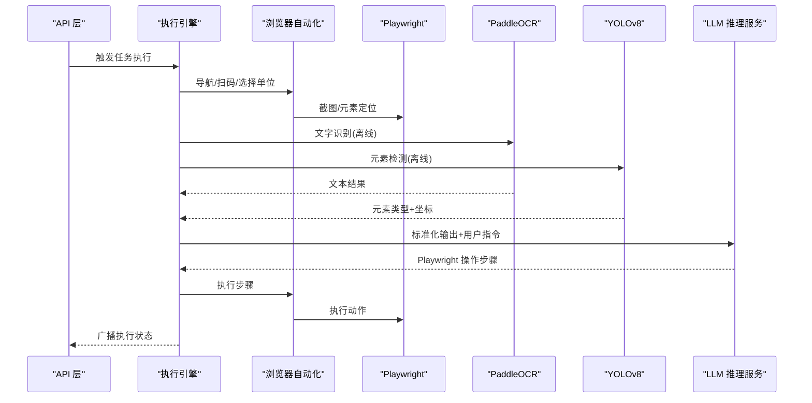
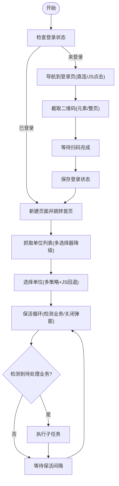
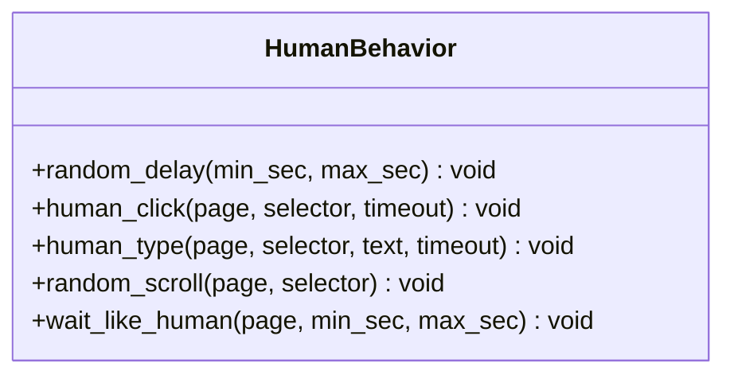
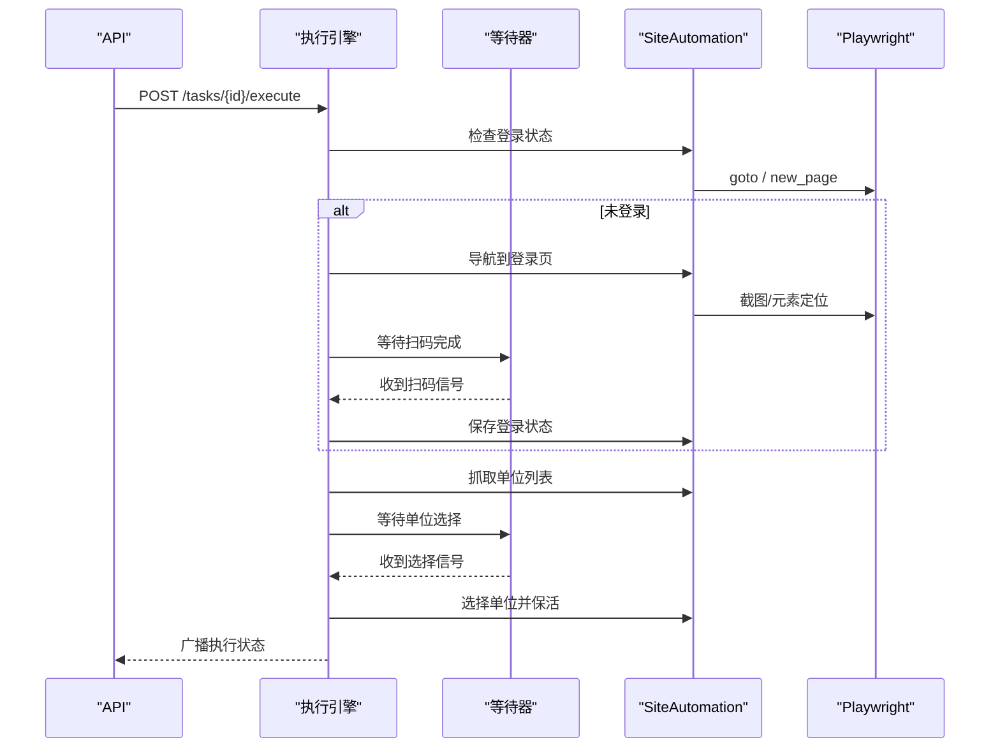
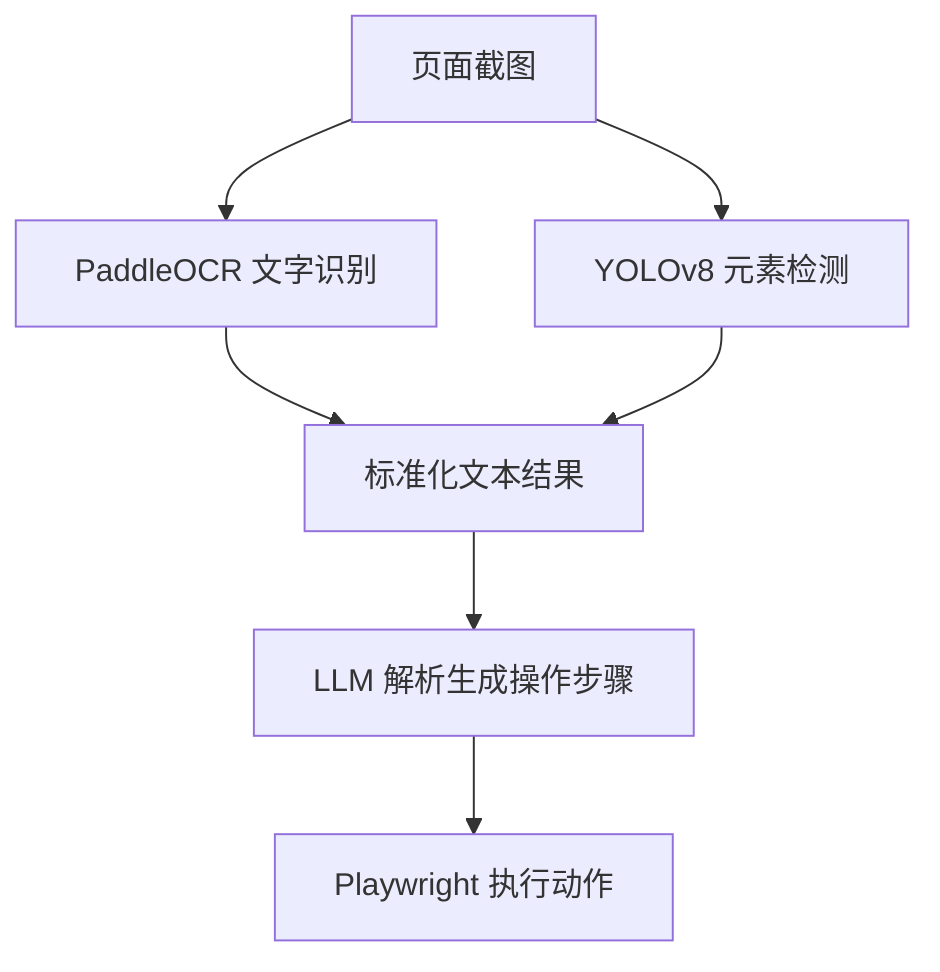
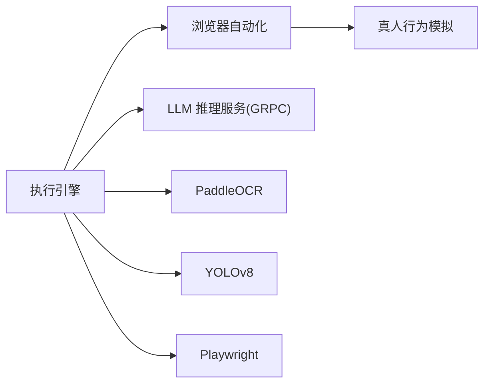

# 视觉识别模块

<cite>
**本文档引用的文件**
- [site_automation.py](file://CCC_RPA_API/app/browser/site_automation.py)
- [human_behavior.py](file://CCC_RPA_API/app/browser/human_behavior.py)
- [executor.py](file://CCC_RPA_API/app/services/executor.py)
- [tasks.py](file://CCC_RPA_API/app/api/tasks.py)
- [execution.py](file://CCC_RPA_API/app/schemas/execution.py)
- [requirements.txt](file://CCC_RPA_API/requirements.txt)
- [project.md](file://project.md)
</cite>

## 目录
1. [简介](#简介)
2. [项目结构](#项目结构)
3. [核心组件](#核心组件)
4. [架构总览](#架构总览)
5. [详细组件分析](#详细组件分析)
6. [依赖关系分析](#依赖关系分析)
7. [性能考虑](#性能考虑)
8. [故障排查指南](#故障排查指南)
9. [结论](#结论)
10. [附录](#附录)

## 简介
本技术文档聚焦于视觉识别模块的设计与实现，围绕以下目标展开：
- YOLOv8 离线元素检测：识别按钮、输入框、提交控件、弹窗、验证码区域，输出标准化坐标与元素类型
- PaddleOCR 离线文字识别：提取页面全文与验证码字符，全程无需联网
- 识别结果标准化输出，供给 LLM 生成操作指令
- 全程离线无网络依赖的处理机制
- 模型优化、准确率提升与性能监控

根据项目文档，视觉识别模块属于第四层“AI 智能驱动微服务层”的组成部分，与 LLM 推理服务、结构化数据抽取模块共同构成完整的 AI 浏览器系统。

## 项目结构
视觉识别模块位于后端 Python 项目中，主要涉及浏览器自动化层与执行引擎层：
- 浏览器自动化层：负责页面交互、截图、元素定位与业务流程编排
- 执行引擎层：负责任务调度、状态广播、用户交互等待与保活循环

图表来源
- [tasks.py:47-75](file://CCC_RPA_API/app/api/tasks.py#L47-L75)
- [executor.py:14-15](file://CCC_RPA_API/app/services/executor.py#L14-L15)
- [site_automation.py:16-17](file://CCC_RPA_API/app/browser/site_automation.py#L16-L17)
- [human_behavior.py:12-13](file://CCC_RPA_API/app/browser/human_behavior.py#L12-L13)

章节来源
- [project.md:1099-1118](file://project.md#L1099-L1118)
- [requirements.txt:8](file://CCC_RPA_API/requirements.txt#L8)

## 核心组件
- 浏览器自动化编排器：封装页面导航、扫码登录、单位选择、保活与业务检测等流程
- 真人行为模拟器：模拟鼠标移动、点击、输入与滚动，降低被反爬检测风险
- 执行引擎：协调浏览器上下文、等待用户交互、广播执行状态、恢复异常会话
- 识别服务适配层：预留 YOLOv8 元素检测与 PaddleOCR 文字识别的集成点，面向 LLM 输出标准化结果

章节来源
- [site_automation.py:16-743](file://CCC_RPA_API/app/browser/site_automation.py#L16-L743)
- [human_behavior.py:12-86](file://CCC_RPA_API/app/browser/human_behavior.py#L12-L86)
- [executor.py:78-315](file://CCC_RPA_API/app/services/executor.py#L78-L315)

## 架构总览
视觉识别模块在整体系统中的职责是：以截图与 DOM 信息为输入，通过 OCR 与目标检测模型提取结构化语义，再将标准化结果传递给 LLM，由 LLM 生成 Playwright 操作序列，从而实现端到端的离线自动化。

图表来源
- [project.md:1183-1189](file://project.md#L1183-L1189)
- [executor.py:100-270](file://CCC_RPA_API/app/services/executor.py#L100-L270)
- [site_automation.py:147-191](file://CCC_RPA_API/app/browser/site_automation.py#L147-L191)

## 详细组件分析

### 组件A：浏览器自动化编排器（SiteAutomation）
职责与能力：
- 登录状态检查与扫码登录流程编排
- 单位列表抓取与单位选择（含多种选择器策略与 JS 回退）
- 页面保活与待处理业务检测
- 截图与调试信息输出

关键流程与算法：
- 登录页导航采用“直连 + 首页 JS 点击”双策略，失败时降级
- 单位选择采用“文本匹配 > data-id > 文本行匹配 > 索引匹配”的多级策略，最后以 JS 全文匹配回退
- 保活循环在当前业务页面执行，避免页面跳转；同时检测弹窗并尝试关闭
- 待处理业务检测基于徽章计数与关键词匹配

图表来源
- [site_automation.py:37-145](file://CCC_RPA_API/app/browser/site_automation.py#L37-L145)
- [site_automation.py:194-291](file://CCC_RPA_API/app/browser/site_automation.py#L194-L291)
- [site_automation.py:294-540](file://CCC_RPA_API/app/browser/site_automation.py#L294-L540)
- [site_automation.py:557-680](file://CCC_RPA_API/app/browser/site_automation.py#L557-L680)
- [site_automation.py:682-735](file://CCC_RPA_API/app/browser/site_automation.py#L682-L735)

章节来源
- [site_automation.py:16-743](file://CCC_RPA_API/app/browser/site_automation.py#L16-L743)

### 组件B：真人行为模拟器（HumanBehavior）
职责与能力：
- 模拟真实点击：鼠标移动到元素中心附近，带随机偏移与步数
- 模拟真实输入：逐字符输入，字符间随机延迟
- 随机滚动与等待：模拟人类阅读与浏览行为

图表来源
- [human_behavior.py:12-86](file://CCC_RPA_API/app/browser/human_behavior.py#L12-L86)

章节来源
- [human_behavior.py:12-86](file://CCC_RPA_API/app/browser/human_behavior.py#L12-L86)

### 组件C：执行引擎（Task Execution Engine）
职责与能力：
- 任务生命周期管理：初始化浏览器、检查登录、扫码登录、选择单位、保活循环、完成收尾
- 用户交互等待：通过等待器等待扫码完成与单位选择
- 会话恢复：检测浏览器异常并恢复上下文
- 状态广播：通过 WebSocket 推送执行进度、二维码、错误信息与任务状态

图表来源
- [executor.py:78-315](file://CCC_RPA_API/app/services/executor.py#L78-L315)
- [tasks.py:47-75](file://CCC_RPA_API/app/api/tasks.py#L47-L75)

章节来源
- [executor.py:78-315](file://CCC_RPA_API/app/services/executor.py#L78-L315)
- [tasks.py:47-75](file://CCC_RPA_API/app/api/tasks.py#L47-L75)

### 组件D：识别服务适配层（YOLOv8 + PaddleOCR）
职责与能力（面向 LLM 的标准化输出）：
- YOLOv8 离线元素检测：识别按钮、输入框、提交控件、弹窗、验证码区域，输出标准化坐标与元素类型
- PaddleOCR 离线文字识别：提取页面全文与验证码字符，支持多语言与复杂背景
- 识别结果标准化：统一坐标系、元素类别、文本置信度与结构化格式
- 与 LLM 接口契约：ParsePageTask(DOM、screenshot、userCommand) → Playwright 操作步骤列表

图表来源
- [project.md:1111-1117](file://project.md#L1111-L1117)
- [project.md:1183-1189](file://project.md#L1183-L1189)

章节来源
- [project.md:1111-1117](file://project.md#L1111-L1117)
- [project.md:1183-1189](file://project.md#L1183-L1189)

## 依赖关系分析
- 外部依赖
  - Playwright：页面控制与截图
  - LLM 推理服务（GRPC）：解析识别结果并生成操作步骤
  - PaddleOCR：离线文字识别
  - YOLOv8：离线元素检测
- 内部依赖
  - 执行引擎依赖浏览器自动化编排器与等待器
  - 浏览器自动化编排器依赖真人行为模拟器

图表来源
- [executor.py:13-15](file://CCC_RPA_API/app/services/executor.py#L13-L15)
- [site_automation.py:5](file://CCC_RPA_API/app/browser/site_automation.py#L5)
- [requirements.txt:8](file://CCC_RPA_API/requirements.txt#L8)

章节来源
- [requirements.txt:1-11](file://CCC_RPA_API/requirements.txt#L1-L11)
- [executor.py:13-15](file://CCC_RPA_API/app/services/executor.py#L13-L15)
- [site_automation.py:5](file://CCC_RPA_API/app/browser/site_automation.py#L5)

## 性能考虑
- 截图与识别
  - 仅在必要节点截图（二维码、调试阶段），减少 I/O 压力
  - OCR 与检测采用离线模型，建议使用量化模型与合适的硬件加速
- 保活与等待
  - 保活间隔随机化，避免固定节奏被检测
  - 等待采用分段轮询，及时响应取消信号
- 线程与异步
  - 使用线程池执行阻塞操作，避免阻塞 Playwright 工作线程
  - 会话恢复与状态广播通过事件循环安全推送

## 故障排查指南
常见问题与处理：
- 浏览器异常关闭
  - 现象：后续操作报错或页面不可用
  - 处理：执行引擎会检测并恢复会话，重新打开页面
- 二维码未加载
  - 现象：扫码登录阶段无法获取二维码
  - 处理：降级为整页截图；检查网络与页面加载状态
- 单位选择失败
  - 现象：CSS 选择器与 data-id 匹配失败
  - 处理：启用 JS 全文匹配回退；确认页面结构是否变更
- 保活循环无效
  - 现象：页面长时间无响应
  - 处理：检查弹窗遮挡；确保滚动与点击不触发业务跳转

章节来源
- [executor.py:42-69](file://CCC_RPA_API/app/services/executor.py#L42-L69)
- [site_automation.py:147-172](file://CCC_RPA_API/app/browser/site_automation.py#L147-L172)
- [site_automation.py:426-461](file://CCC_RPA_API/app/browser/site_automation.py#L426-L461)
- [site_automation.py:654-671](file://CCC_RPA_API/app/browser/site_automation.py#L654-L671)

## 结论
视觉识别模块通过“离线 OCR + 目标检测 + 标准化输出 + LLM 解析”的闭环设计，实现了端到端的无网络依赖自动化。结合真人行为模拟与健壮的会话恢复机制，能够在复杂页面环境中稳定运行。后续可在模型量化、特征工程与监控体系方面进一步优化，以满足更高性能与准确率要求。

## 附录
- 术语与缩写
  - SRS：软件需求规格说明书
  - CDP：Chrome DevTools Protocol
  - GRPC：内部微服务高速通信协议
  - Ollama：本地私有化大模型推理底座
- 接口契约（节选）
  - ParsePageTask(DOM、screenshot、userCommand) → Playwright 操作步骤列表
  - OCRImage(imageBuffer) → 识别文本结果
  - ExtractStructData(DOM、ruleJson) → 结构化 JSON 数据

章节来源
- [project.md:1161-1210](file://project.md#L1161-L1210)