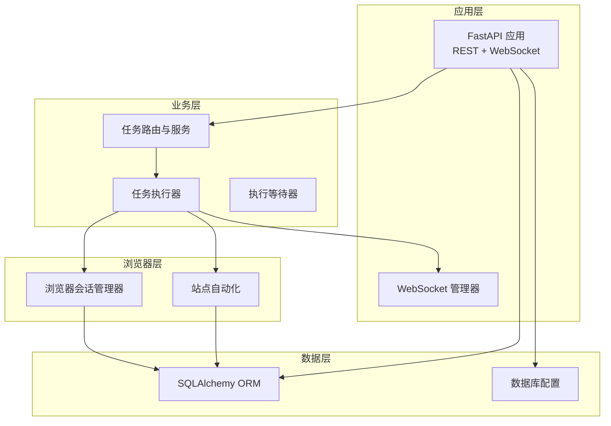
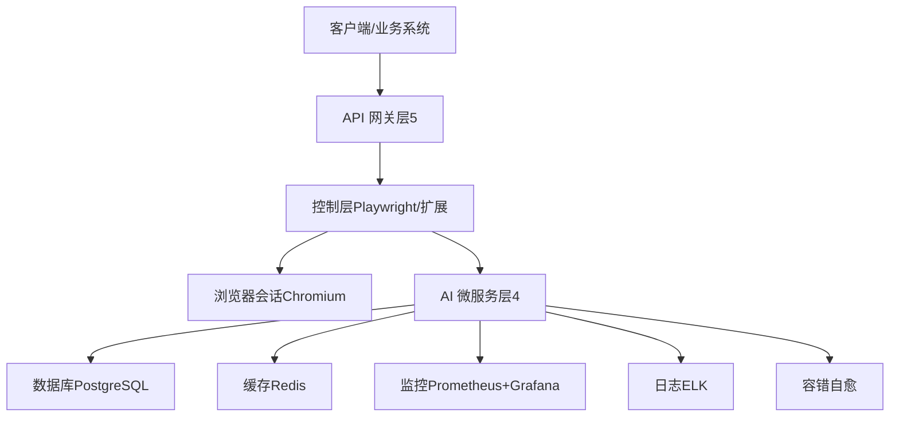
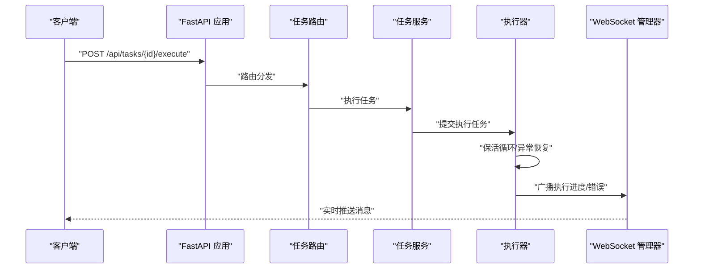
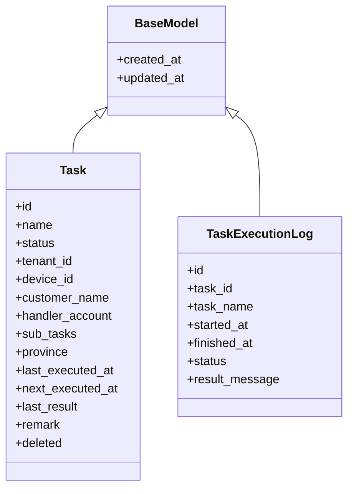
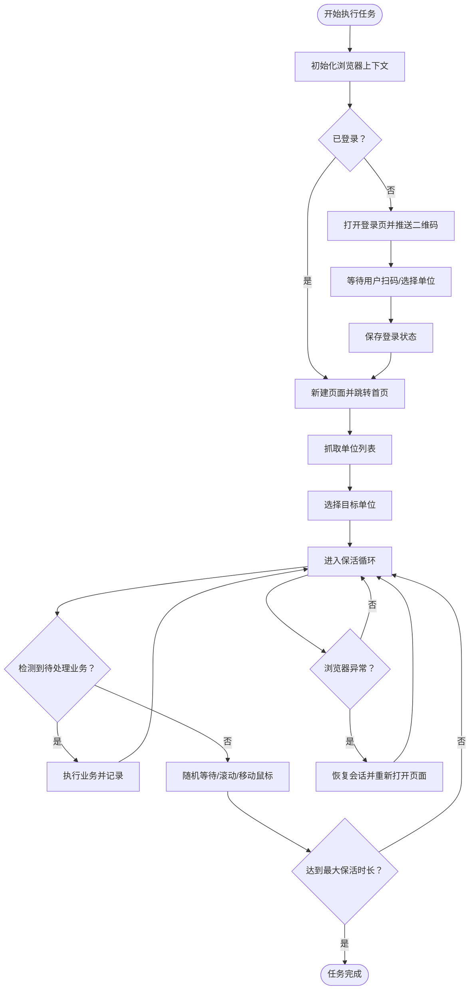
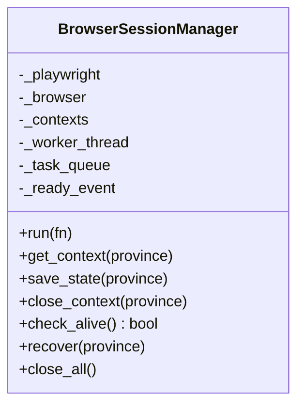
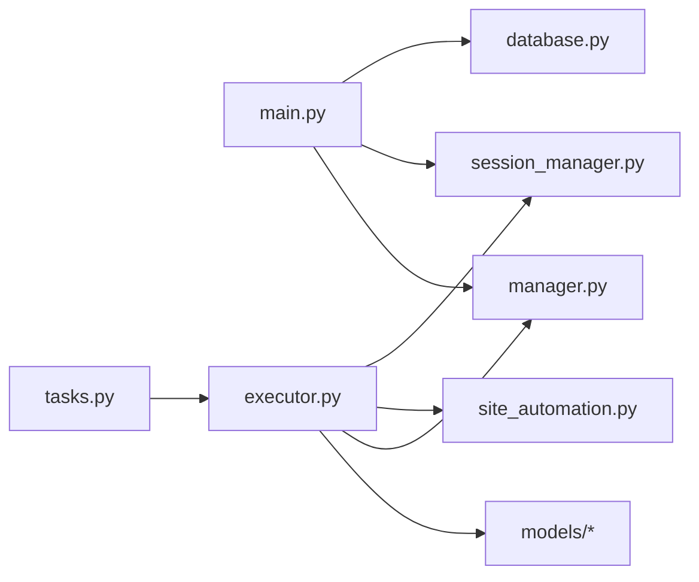

# Agent C AI&数据运维开发

<cite>
**本文档引用的文件**
- [project.md](file://project.md)
- [main.py](file://CCC_RPA_API/app/main.py)
- [config.py](file://CCC_RPA_API/app/config.py)
- [database.py](file://CCC_RPA_API/app/database.py)
- [base.py](file://CCC_RPA_API/app/models/base.py)
- [task.py](file://CCC_RPA_API/app/models/task.py)
- [execution_log.py](file://CCC_RPA_API/app/models/execution_log.py)
- [tasks.py](file://CCC_RPA_API/app/api/tasks.py)
- [executor.py](file://CCC_RPA_API/app/services/executor.py)
- [session_manager.py](file://CCC_RPA_API/app/browser/session_manager.py)
- [site_automation.py](file://CCC_RPA_API/app/browser/site_automation.py)
- [waiter.py](file://CCC_RPA_API/app/browser/waiter.py)
- [manager.py](file://CCC_RPA_API/app/ws/manager.py)
- [execution.py](file://CCC_RPA_API/app/schemas/execution.py)
</cite>

## 目录
1. [简介](#简介)
2. [项目结构](#项目结构)
3. [核心组件](#核心组件)
4. [架构总览](#架构总览)
5. [详细组件分析](#详细组件分析)
6. [依赖分析](#依赖分析)
7. [性能考虑](#性能考虑)
8. [故障排查指南](#故障排查指南)
9. [结论](#结论)
10. [附录](#附录)

## 简介
本文件面向 Agent C 子团队，聚焦“AI 智能驱动微服务层”和“数据持久化、监控运维、容错模块”的技术实现与开发指导。根据统一需求文档，Agent C 负责：
- AI 推理服务（Ollama LLM Agent）、视觉识别（YOLO+PaddleOCR）、结构化数据抽取
- PostgreSQL 数据库、Redis 缓存、AES 加密存储
- Prometheus+Grafana 监控、ELK 审计日志、异常容错自愈
- 整体以“五层架构”中的“层4：AI 智能驱动微服务层”和“层5：多租户网关&业务管理层”的数据与运维支撑为核心

本仓库现有代码主要体现“层5 网关与业务管理”与“层3 控制层”的部分实现（如任务执行、浏览器会话管理、WebSocket 推送等），Agent C 的 AI 微服务与监控运维组件在本仓库中尚未直接呈现，但其接口契约、数据规范与部署形态已在统一需求文档中明确，开发时需严格遵循。

## 项目结构
整体项目采用“三层架构 + 多语言混合”的组织方式：
- 后端服务：Python FastAPI 应用，提供 REST API、WebSocket 推送、数据库 ORM
- 前端与扩展：Vue3 管理后台、Chrome 扩展（本仓库未包含）
- 浏览器自动化：Playwright 会话管理与站点自动化逻辑
- 数据与缓存：SQLAlchemy ORM + MySQL（本仓库配置为 MySQL，统一需求文档要求 PostgreSQL）



图表来源
- [main.py:1-127](file://CCC_RPA_API/app/main.py#L1-L127)
- [tasks.py:1-76](file://CCC_RPA_API/app/api/tasks.py#L1-L76)
- [executor.py:1-319](file://CCC_RPA_API/app/services/executor.py#L1-L319)
- [session_manager.py:1-186](file://CCC_RPA_API/app/browser/session_manager.py#L1-L186)
- [site_automation.py:1-743](file://CCC_RPA_API/app/browser/site_automation.py#L1-L743)
- [manager.py:1-29](file://CCC_RPA_API/app/ws/manager.py#L1-L29)
- [config.py:1-22](file://CCC_RPA_API/app/config.py#L1-L22)
- [database.py:1-19](file://CCC_RPA_API/app/database.py#L1-L19)

章节来源
- [main.py:1-127](file://CCC_RPA_API/app/main.py#L1-L127)
- [config.py:1-22](file://CCC_RPA_API/app/config.py#L1-L22)
- [database.py:1-19](file://CCC_RPA_API/app/database.py#L1-L19)
- [base.py:1-11](file://CCC_RPA_API/app/models/base.py#L1-L11)
- [task.py:1-25](file://CCC_RPA_API/app/models/task.py#L1-L25)
- [execution_log.py:1-17](file://CCC_RPA_API/app/models/execution_log.py#L1-L17)
- [tasks.py:1-76](file://CCC_RPA_API/app/api/tasks.py#L1-L76)
- [executor.py:1-319](file://CCC_RPA_API/app/services/executor.py#L1-L319)
- [session_manager.py:1-186](file://CCC_RPA_API/app/browser/session_manager.py#L1-L186)
- [site_automation.py:1-743](file://CCC_RPA_API/app/browser/site_automation.py#L1-L743)
- [waiter.py:1-84](file://CCC_RPA_API/app/browser/waiter.py#L1-L84)
- [manager.py:1-29](file://CCC_RPA_API/app/ws/manager.py#L1-L29)
- [execution.py:1-7](file://CCC_RPA_API/app/schemas/execution.py#L1-L7)

## 核心组件
- 应用入口与路由
  - FastAPI 应用、CORS、健康检查、WebSocket 管理器
- 数据层
  - SQLAlchemy 基类、MySQL 连接、会话工厂、基础模型与任务模型
- 业务层
  - 任务路由、任务服务、执行器（线程池、保活循环、异常恢复）
- 浏览器层
  - Playwright 专用线程、上下文管理、状态持久化、恢复机制
- 通讯层
  - WebSocket 广播、执行进度与错误推送

章节来源
- [main.py:1-127](file://CCC_RPA_API/app/main.py#L1-L127)
- [config.py:1-22](file://CCC_RPA_API/app/config.py#L1-L22)
- [database.py:1-19](file://CCC_RPA_API/app/database.py#L1-L19)
- [base.py:1-11](file://CCC_RPA_API/app/models/base.py#L1-L11)
- [task.py:1-25](file://CCC_RPA_API/app/models/task.py#L1-L25)
- [execution_log.py:1-17](file://CCC_RPA_API/app/models/execution_log.py#L1-L17)
- [tasks.py:1-76](file://CCC_RPA_API/app/api/tasks.py#L1-L76)
- [executor.py:1-319](file://CCC_RPA_API/app/services/executor.py#L1-L319)
- [session_manager.py:1-186](file://CCC_RPA_API/app/browser/session_manager.py#L1-L186)
- [site_automation.py:1-743](file://CCC_RPA_API/app/browser/site_automation.py#L1-L743)
- [waiter.py:1-84](file://CCC_RPA_API/app/browser/waiter.py#L1-L84)
- [manager.py:1-29](file://CCC_RPA_API/app/ws/manager.py#L1-L29)

## 架构总览
Agent C 在统一架构中的定位是“层4 AI 智能驱动微服务层”和“层5 多租户网关&业务管理层”的数据与运维支撑。当前仓库体现的是“层5 网关与业务管理”的部分能力（任务执行、浏览器会话、WebSocket 推送），以及“层3 双通路控制层”的浏览器自动化能力。



说明
- 本图为概念性架构示意，用于帮助理解 Agent C 的职责边界与集成关系
- 数据库与缓存、监控与日志、容错自愈等组件在本仓库未直接呈现，但已在统一需求文档中明确规范

## 详细组件分析

### 应用入口与路由（FastAPI）
- 职责
  - 初始化数据库、动态迁移表结构、插入示例数据
  - 注册认证、任务、租户、设备路由
  - 启动/关闭事件：捕获主事件循环、关闭所有浏览器会话
  - 健康检查、WebSocket 端点
- 关键点
  - 使用全局事件循环用于工作线程安全广播
  - 启动时动态添加任务表列，确保向前兼容
  - WebSocket 管理器集中维护连接并广播消息



图表来源
- [main.py:119-127](file://CCC_RPA_API/app/main.py#L119-L127)
- [tasks.py:47-52](file://CCC_RPA_API/app/api/tasks.py#L47-L52)
- [executor.py:317-319](file://CCC_RPA_API/app/services/executor.py#L317-L319)
- [manager.py:17-28](file://CCC_RPA_API/app/ws/manager.py#L17-L28)

章节来源
- [main.py:1-127](file://CCC_RPA_API/app/main.py#L1-L127)
- [tasks.py:1-76](file://CCC_RPA_API/app/api/tasks.py#L1-L76)
- [manager.py:1-29](file://CCC_RPA_API/app/ws/manager.py#L1-L29)

### 数据层（SQLAlchemy + MySQL）
- 职责
  - 定义基础模型、任务模型、执行日志模型
  - 提供数据库连接与会话工厂
  - 启动时动态迁移任务表字段，保证版本演进
- 关键点
  - 基类统一 created_at/updated_at 字段
  - 任务模型包含状态、租户、设备、子任务等字段
  - 执行日志模型记录任务执行开始/结束、状态与结果



图表来源
- [base.py:7-11](file://CCC_RPA_API/app/models/base.py#L7-L11)
- [task.py:8-25](file://CCC_RPA_API/app/models/task.py#L8-L25)
- [execution_log.py:7-17](file://CCC_RPA_API/app/models/execution_log.py#L7-L17)

章节来源
- [base.py:1-11](file://CCC_RPA_API/app/models/base.py#L1-L11)
- [task.py:1-25](file://CCC_RPA_API/app/models/task.py#L1-L25)
- [execution_log.py:1-17](file://CCC_RPA_API/app/models/execution_log.py#L1-L17)
- [database.py:1-19](file://CCC_RPA_API/app/database.py#L1-L19)
- [config.py:1-22](file://CCC_RPA_API/app/config.py#L1-L22)

### 业务层（任务执行器与等待器）
- 职责
  - 任务执行器：线程池执行、保活循环、异常恢复、日志记录、WebSocket 广播
  - 等待器：阻塞等待用户操作（扫码、选择单位）、取消与检查信号
- 关键点
  - 使用专用线程执行 Playwright 操作，避免事件循环冲突
  - 保活循环在当前业务页面执行轻量操作，不触发导航或表单提交
  - 异常恢复：检测浏览器关闭，自动恢复并重新打开页面



图表来源
- [executor.py:78-315](file://CCC_RPA_API/app/services/executor.py#L78-L315)
- [site_automation.py:542-680](file://CCC_RPA_API/app/browser/site_automation.py#L542-L680)
- [session_manager.py:147-170](file://CCC_RPA_API/app/browser/session_manager.py#L147-L170)

章节来源
- [executor.py:1-319](file://CCC_RPA_API/app/services/executor.py#L1-L319)
- [waiter.py:1-84](file://CCC_RPA_API/app/browser/waiter.py#L1-L84)
- [site_automation.py:1-743](file://CCC_RPA_API/app/browser/site_automation.py#L1-L743)
- [session_manager.py:1-186](file://CCC_RPA_API/app/browser/session_manager.py#L1-L186)

### 浏览器层（Playwright 会话管理）
- 职责
  - 专用线程启动 Playwright/Chromium，避免与 asyncio 事件循环冲突
  - 按省份管理 BrowserContext，持久化 storage_state
  - 提供运行函数、上下文获取、状态保存、恢复与关闭
- 关键点
  - 通过队列与 Event 实现线程间安全调用
  - 检测浏览器存活，异常时自动恢复
  - 隐藏 webdriver 标识，设置 UA 与视口



图表来源
- [session_manager.py:10-186](file://CCC_RPA_API/app/browser/session_manager.py#L10-L186)

章节来源
- [session_manager.py:1-186](file://CCC_RPA_API/app/browser/session_manager.py#L1-L186)

### 通讯层（WebSocket 广播）
- 职责
  - 维护 WebSocket 连接集合，支持广播消息
  - 在工作线程中安全广播，使用主事件循环
- 关键点
  - 广播失败自动清理断连连接
  - 与执行器配合推送执行进度、错误与业务数据

```mermaid
sequenceDiagram
participant Exec as "执行器"
participant Loop as "主事件循环"
participant WS as "WebSocket 管理器"
participant Client as "客户端"
Exec->>Loop : "提交广播任务"
Loop->>WS : "广播消息"
WS->>Client : "发送文本消息"
Client-->>WS : "断连"
WS->>WS : "清理断连连接"
```

图表来源
- [executor.py:22-33](file://CCC_RPA_API/app/services/executor.py#L22-L33)
- [manager.py:17-28](file://CCC_RPA_API/app/ws/manager.py#L17-L28)
- [main.py:30-35](file://CCC_RPA_API/app/main.py#L30-L35)

章节来源
- [executor.py:1-319](file://CCC_RPA_API/app/services/executor.py#L1-L319)
- [manager.py:1-29](file://CCC_RPA_API/app/ws/manager.py#L1-L29)
- [main.py:1-127](file://CCC_RPA_API/app/main.py#L1-L127)

## 依赖分析
- 组件耦合
  - 执行器依赖会话管理器与站点自动化，间接依赖数据库与 WebSocket
  - 任务路由依赖任务服务与等待器
  - 应用入口依赖数据库初始化与会话管理器关闭
- 外部依赖
  - 数据库：SQLAlchemy + MySQL（统一需求文档要求 PostgreSQL）
  - 浏览器：Playwright/Chromium
  - 通讯：FastAPI WebSocket
- 潜在风险
  - 事件循环与同步 API 的混用风险（通过专用线程规避）
  - 数据库迁移与字段演进（动态迁移已缓解）



图表来源
- [main.py:1-127](file://CCC_RPA_API/app/main.py#L1-L127)
- [database.py:1-19](file://CCC_RPA_API/app/database.py#L1-L19)
- [session_manager.py:1-186](file://CCC_RPA_API/app/browser/session_manager.py#L1-L186)
- [site_automation.py:1-743](file://CCC_RPA_API/app/browser/site_automation.py#L1-L743)
- [executor.py:1-319](file://CCC_RPA_API/app/services/executor.py#L1-L319)
- [tasks.py:1-76](file://CCC_RPA_API/app/api/tasks.py#L1-L76)
- [manager.py:1-29](file://CCC_RPA_API/app/ws/manager.py#L1-L29)

章节来源
- [main.py:1-127](file://CCC_RPA_API/app/main.py#L1-L127)
- [tasks.py:1-76](file://CCC_RPA_API/app/api/tasks.py#L1-L76)
- [executor.py:1-319](file://CCC_RPA_API/app/services/executor.py#L1-L319)
- [session_manager.py:1-186](file://CCC_RPA_API/app/browser/session_manager.py#L1-L186)
- [site_automation.py:1-743](file://CCC_RPA_API/app/browser/site_automation.py#L1-L743)
- [manager.py:1-29](file://CCC_RPA_API/app/ws/manager.py#L1-L29)
- [database.py:1-19](file://CCC_RPA_API/app/database.py#L1-L19)

## 性能考虑
- 事件循环与同步 API
  - 通过专用线程执行 Playwright 操作，避免阻塞主事件循环
- 线程池与阻塞等待
  - 任务执行器与等待器分别使用线程池，避免阻塞 Playwright 工作线程
- 保活策略
  - 在当前页面执行轻量保活，降低页面跳转带来的额外开销
- 数据库连接
  - 使用连接池参数提升连接复用效率

章节来源
- [executor.py:17-33](file://CCC_RPA_API/app/services/executor.py#L17-L33)
- [executor.py:18-19](file://CCC_RPA_API/app/services/executor.py#L18-L19)
- [site_automation.py:614-680](file://CCC_RPA_API/app/browser/site_automation.py#L614-L680)
- [database.py:5-6](file://CCC_RPA_API/app/database.py#L5-L6)

## 故障排查指南
- 浏览器异常恢复
  - 现象：页面崩溃或浏览器关闭
  - 处理：执行器检测并恢复会话，重新打开页面
- 扫码/选择单位超时
  - 现象：等待用户操作超时
  - 处理：等待器抛出超时异常，执行器记录失败并广播错误
- 登录状态异常
  - 现象：登录状态检查失败
  - 处理：重新打开登录页并推送二维码，必要时保存状态
- WebSocket 断连
  - 现象：客户端断连
  - 处理：管理器自动清理断连连接，避免广播失败

章节来源
- [executor.py:42-70](file://CCC_RPA_API/app/services/executor.py#L42-L70)
- [executor.py:133-140](file://CCC_RPA_API/app/services/executor.py#L133-L140)
- [executor.py:286-311](file://CCC_RPA_API/app/services/executor.py#L286-L311)
- [manager.py:17-28](file://CCC_RPA_API/app/ws/manager.py#L17-L28)
- [session_manager.py:157-170](file://CCC_RPA_API/app/browser/session_manager.py#L157-L170)

## 结论
本仓库体现了 Agent C 在“层5 网关与业务管理”和“层3 双通路控制层”的关键能力：任务执行、浏览器会话管理、WebSocket 推送与异常恢复。对于 Agent C 的核心职责“AI 智能驱动微服务层”和“数据持久化、监控运维、容错模块”，统一需求文档已给出明确规范与接口契约。后续开发应在现有架构基础上，新增 AI 推理服务、监控与日志、容错自愈等模块，并严格遵循统一的数据与接口规范。

## 附录
- 统一接口契约（节选）
  - RESTful API：会话创建、关闭、脚本执行、AI 指令、截图、WebSocket
  - GRPC 服务：ParsePageTask、ExtractStructData、OCRImage、AllocateSessionResource、DestroySession
- 统一数据层设计
  - PostgreSQL 核心表：tenant、browser_session、task_record、audit_log、script_template
  - Redis Key 设计：会话状态、任务队列、限流计数
  - 数据加密：会话快照、敏感字段 AES-256-CBC
- 非功能性需求
  - 性能：会话创建耗时、AI 推理响应、QPS、CDP 延迟
  - 安全：传输加密、存储加密、访问控制、审计日志
  - 可靠性：崩溃隔离、集群容灾、数据备份、MTBF/恢复时间
  - 兼容性：容器镜像、SDK 版本、扩展内核、AI 推理硬件
  - 运维交付：一键部署、监控大盘、告警模板、运维手册

章节来源
- [project.md:447-502](file://project.md#L447-L502)
- [project.md:560-587](file://project.md#L560-L587)
- [project.md:504-559](file://project.md#L504-L559)