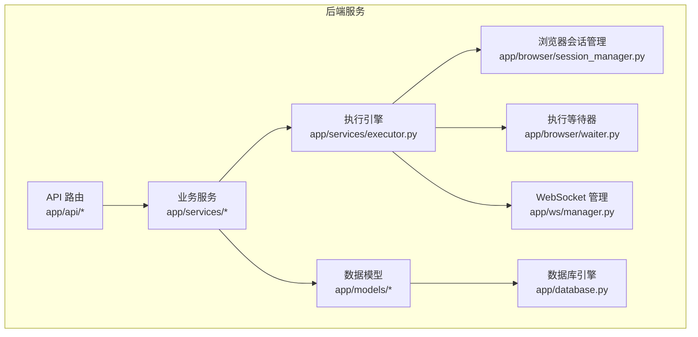
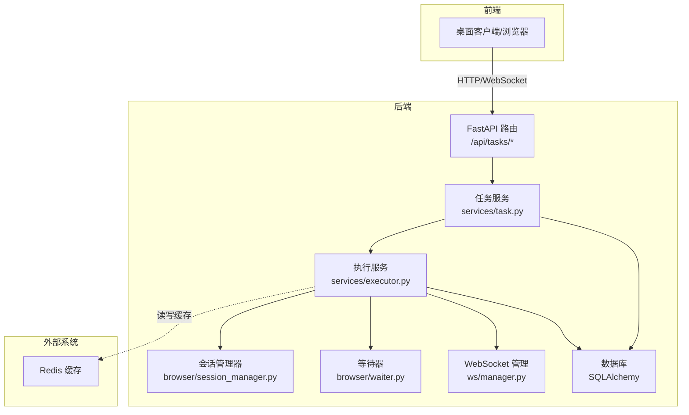
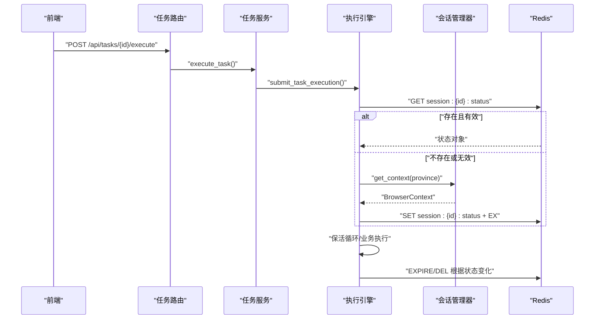
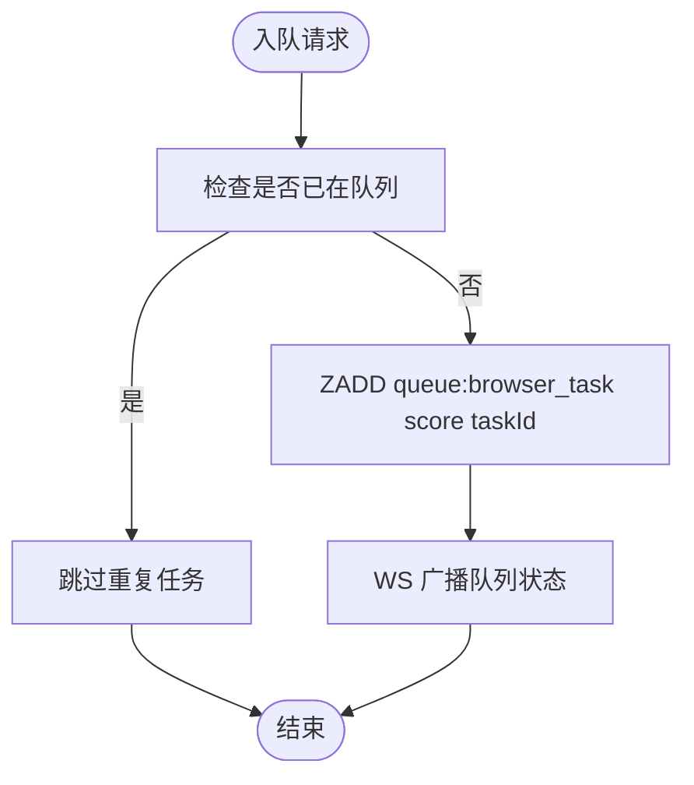
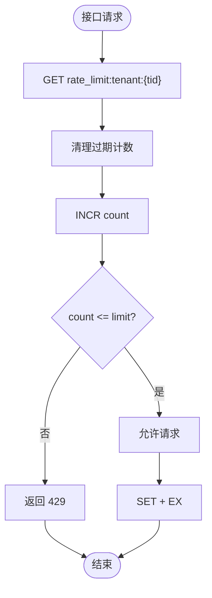
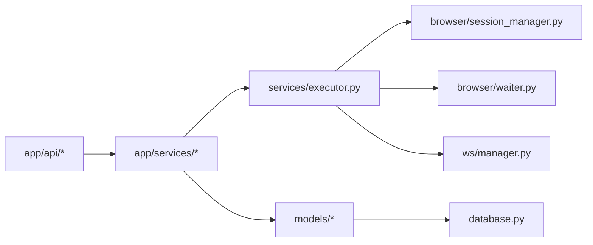

# Redis 缓存设计

<cite>
**本文引用的文件**
- [main.py](file://CCC_RPA_API/app/main.py)
- [config.py](file://CCC_RPA_API/app/config.py)
- [database.py](file://CCC_RPA_API/app/database.py)
- [models/task.py](file://CCC_RPA_API/app/models/task.py)
- [models/execution_log.py](file://CCC_RPA_API/app/models/execution_log.py)
- [services/executor.py](file://CCC_RPA_API/app/services/executor.py)
- [services/task.py](file://CCC_RPA_API/app/services/task.py)
- [browser/session_manager.py](file://CCC_RPA_API/app/browser/session_manager.py)
- [browser/waiter.py](file://CCC_RPA_API/app/browser/waiter.py)
- [ws/manager.py](file://CCC_RPA_API/app/ws/manager.py)
- [api/tasks.py](file://CCC_RPA_API/app/api/tasks.py)
- [api/auth.py](file://CCC_RPA_API/app/api/auth.py)
- [requirements.txt](file://CCC_RPA_API/requirements.txt)
- [project.md](file://project.md)
</cite>

## 目录
1. [引言](#引言)
2. [项目结构](#项目结构)
3. [核心组件](#核心组件)
4. [架构总览](#架构总览)
5. [详细组件分析](#详细组件分析)
6. [依赖分析](#依赖分析)
7. [性能考虑](#性能考虑)
8. [故障排查指南](#故障排查指南)
9. [结论](#结论)
10. [附录](#附录)

## 引言
本文件面向 Redis 缓存设计，结合现有代码库中的任务执行、会话管理与信号等待机制，提出一套统一的 Key 设计规范与缓存策略。目标包括：
- 明确会话状态缓存、任务队列缓存、接口限流缓存的 Key 命名与数据结构
- 规定过期时间、内存优化与缓存一致性保障方法
- 提供缓存失效策略与操作示例路径，确保与现有执行流程无缝衔接

注意：当前仓库未发现直接使用 Redis 的实现，本文为“面向未来的缓存设计”方案，旨在指导后续集成。

## 项目结构
后端采用 FastAPI + SQLAlchemy 架构，核心模块围绕任务执行、浏览器会话管理与 WebSocket 广播展开。任务执行流程通过线程池与专用工作线程协调 Playwright 操作，并通过 WebSocket 向前端推送执行状态。

图示来源
- [main.py:12-39](file://CCC_RPA_API/app/main.py#L12-L39)
- [services/executor.py:1-319](file://CCC_RPA_API/app/services/executor.py#L1-L319)
- [browser/session_manager.py:1-186](file://CCC_RPA_API/app/browser/session_manager.py#L1-L186)
- [browser/waiter.py:1-84](file://CCC_RPA_API/app/browser/waiter.py#L1-L84)
- [ws/manager.py:1-29](file://CCC_RPA_API/app/ws/manager.py#L1-L29)
- [models/task.py:1-25](file://CCC_RPA_API/app/models/task.py#L1-L25)
- [models/execution_log.py:1-17](file://CCC_RPA_API/app/models/execution_log.py#L1-L17)
- [database.py:1-19](file://CCC_RPA_API/app/database.py#L1-L19)

章节来源
- [main.py:12-39](file://CCC_RPA_API/app/main.py#L12-L39)
- [requirements.txt:1-11](file://CCC_RPA_API/requirements.txt#L1-L11)

## 核心组件
- 任务执行引擎：负责任务状态推进、浏览器上下文生命周期管理、保活循环与业务触发。
- 会话管理器：按省份隔离的 Playwright 上下文管理，支持状态持久化与恢复。
- 执行等待器：基于线程事件的信号等待/取消机制，用于用户交互与取消控制。
- WebSocket 管理：向前端广播执行进度与状态，支撑缓存命中后的实时反馈。
- 数据模型与服务：任务、执行日志与服务层负责状态落库与查询。

章节来源
- [services/executor.py:78-315](file://CCC_RPA_API/app/services/executor.py#L78-L315)
- [browser/session_manager.py:99-144](file://CCC_RPA_API/app/browser/session_manager.py#L99-L144)
- [browser/waiter.py:14-84](file://CCC_RPA_API/app/browser/waiter.py#L14-L84)
- [ws/manager.py:5-29](file://CCC_RPA_API/app/ws/manager.py#L5-L29)
- [models/task.py:8-25](file://CCC_RPA_API/app/models/task.py#L8-L25)
- [models/execution_log.py:7-17](file://CCC_RPA_API/app/models/execution_log.py#L7-L17)

## 架构总览
下图展示缓存在整体执行流程中的位置与交互：

图示来源
- [api/tasks.py:1-76](file://CCC_RPA_API/app/api/tasks.py#L1-L76)
- [services/task.py:119-133](file://CCC_RPA_API/app/services/task.py#L119-L133)
- [services/executor.py:78-315](file://CCC_RPA_API/app/services/executor.py#L78-L315)
- [browser/session_manager.py:99-144](file://CCC_RPA_API/app/browser/session_manager.py#L99-L144)
- [browser/waiter.py:14-84](file://CCC_RPA_API/app/browser/waiter.py#L14-L84)
- [ws/manager.py:5-29](file://CCC_RPA_API/app/ws/manager.py#L5-L29)
- [database.py:1-19](file://CCC_RPA_API/app/database.py#L1-L19)

## 详细组件分析

### 会话状态缓存（Key: session:{sessionId}:status）
- 目标：缓存浏览器会话状态，支持快速恢复与一致性校验。
- Key 设计：session:{sessionId}:status
  - sessionId：可采用任务 ID 或设备 ID，确保唯一性与可追踪性。
- 数据结构：JSON 对象
  - 字段示例：status（connected/disconnected/recovering）、contextId、lastActive、province、loginState
- 过期时间：根据会话保活周期设定（例如 10-60 分钟），结合业务空闲检测动态刷新。
- 写入时机：
  - 创建上下文后写入初始状态
  - 登录成功后更新 loginState
  - 会话恢复完成后刷新状态
- 读取与校验：
  - 执行前读取并校验状态，若异常则触发恢复流程
- 失效策略：
  - 会话断开或恢复失败时主动删除
  - 超时未活跃自动删除
- 一致性：
  - 使用原子操作更新状态字段
  - 广播状态变更至前端

图示来源
- [services/task.py:119-133](file://CCC_RPA_API/app/services/task.py#L119-L133)
- [services/executor.py:99-144](file://CCC_RPA_API/app/services/executor.py#L99-L144)
- [browser/session_manager.py:99-144](file://CCC_RPA_API/app/browser/session_manager.py#L99-L144)

章节来源
- [services/executor.py:99-144](file://CCC_RPA_API/app/services/executor.py#L99-L144)
- [browser/session_manager.py:99-144](file://CCC_RPA_API/app/browser/session_manager.py#L99-L144)

### 任务队列缓存（Key: queue:browser_task）
- 目标：集中管理待执行的任务队列，支持优先级与去重。
- Key 设计：queue:browser_task
- 数据结构：有序集合 ZSET（score 为优先级/入队时间）
  - 成员：任务 ID
  - score：优先级数值或入队时间戳
- 过期时间：队列项不设置过期，通过业务逻辑淘汰已完成/取消的任务。
- 操作：
  - 入队：ZADD queue:browser_task score member
  - 出队：ZRANGE queue:browser_task 0 num-1 WITHSCORES
  - 删除：ZREM queue:browser_task member
- 失效策略：任务状态变为 completed/failed/cancelled 时移除
- 一致性：使用事务保证入队/出队原子性

图示来源
- [services/executor.py:317-319](file://CCC_RPA_API/app/services/executor.py#L317-L319)
- [api/tasks.py:47-52](file://CCC_RPA_API/app/api/tasks.py#L47-L52)

章节来源
- [services/executor.py:317-319](file://CCC_RPA_API/app/services/executor.py#L317-L319)
- [api/tasks.py:47-52](file://CCC_RPA_API/app/api/tasks.py#L47-L52)

### 接口限流缓存（Key: rate_limit:tenant:{tenantId}）
- 目标：按租户维度限制接口调用频率，防止滥用。
- Key 设计：rate_limit:tenant:{tenantId}
- 数据结构：计数器 + 时间窗口（滑动窗口）
  - 字段示例：count、windowStart、limit、windowSize
- 过期时间：与时间窗口一致（例如 60 秒），到期自动清理
- 算法：滑动窗口计数
  - 每次请求先清理过期计数，再递增计数
  - 若超过阈值返回限流错误
- 失效策略：窗口结束自动过期，或显式清理
- 一致性：使用 Lua 脚本保证原子性

图示来源
- [api/tasks.py:47-52](file://CCC_RPA_API/app/api/tasks.py#L47-L52)
- [api/auth.py:10-23](file://CCC_RPA_API/app/api/auth.py#L10-L23)

章节来源
- [api/tasks.py:47-52](file://CCC_RPA_API/app/api/tasks.py#L47-L52)
- [api/auth.py:10-23](file://CCC_RPA_API/app/api/auth.py#L10-L23)

### 缓存数据结构与复杂度
- 会话状态：哈希对象，读写 O(1)，适合频繁读取与小规模更新
- 任务队列：有序集合，插入/删除/范围查询 O(log N)，适合高并发出队
- 限流计数：字符串计数器 + 过期，原子操作 O(1)，适合高频计数

章节来源
- [services/executor.py:99-144](file://CCC_RPA_API/app/services/executor.py#L99-L144)
- [services/executor.py:317-319](file://CCC_RPA_API/app/services/executor.py#L317-L319)

### 缓存一致性与失效策略
- 一致性：
  - 使用原子命令（GET+SET/INCR/事务）保证状态一致性
  - 通过 WebSocket 广播关键状态变更，确保前端与后端一致
- 失效：
  - 会话状态：断开/恢复失败/超时删除
  - 任务队列：任务完成后移除
  - 限流：窗口到期或显式清理
- 内存优化：
  - 合理设置过期时间，避免长期驻留
  - 使用压缩/共享字典减少键名开销
  - 定期清理僵尸键与空集合

章节来源
- [services/executor.py:22-33](file://CCC_RPA_API/app/services/executor.py#L22-L33)
- [ws/manager.py:17-26](file://CCC_RPA_API/app/ws/manager.py#L17-L26)

## 依赖分析
- 外部依赖：FastAPI、SQLAlchemy、Playwright、WebSocket 支持
- 内部依赖：API 路由 -> 服务层 -> 执行引擎 -> 会话管理器/等待器 -> 数据库
- 缓存集成点：执行引擎与服务层在关键节点读写缓存，确保与数据库状态同步

图示来源
- [requirements.txt:1-11](file://CCC_RPA_API/requirements.txt#L1-L11)
- [main.py:24-27](file://CCC_RPA_API/app/main.py#L24-L27)
- [services/executor.py:1-319](file://CCC_RPA_API/app/services/executor.py#L1-L319)
- [browser/session_manager.py:1-186](file://CCC_RPA_API/app/browser/session_manager.py#L1-L186)
- [browser/waiter.py:1-84](file://CCC_RPA_API/app/browser/waiter.py#L1-L84)
- [ws/manager.py:1-29](file://CCC_RPA_API/app/ws/manager.py#L1-L29)
- [models/task.py:1-25](file://CCC_RPA_API/app/models/task.py#L1-L25)
- [models/execution_log.py:1-17](file://CCC_RPA_API/app/models/execution_log.py#L1-L17)
- [database.py:1-19](file://CCC_RPA_API/app/database.py#L1-L19)

章节来源
- [requirements.txt:1-11](file://CCC_RPA_API/requirements.txt#L1-L11)
- [main.py:24-27](file://CCC_RPA_API/app/main.py#L24-L27)

## 性能考虑
- Key 命名：短而语义清晰，避免过深嵌套层级
- 过期策略：热点键短 TTL，冷数据长 TTL 或无 TTL
- 并发控制：使用 Lua 脚本与事务减少竞争
- 内存回收：定期清理过期键，监控内存使用
- 读写分离：热数据放缓存，冷数据落库

## 故障排查指南
- 会话状态异常
  - 现象：浏览器断开或恢复失败
  - 排查：检查 session:{id}:status 是否存在与有效；确认保活循环是否正常
  - 处理：删除过期/异常键，重建上下文并重新写入
- 任务队列堆积
  - 现象：出队失败或长时间无进展
  - 排查：检查 queue:browser_task 成员与分数；确认执行器是否正确消费
  - 处理：清理无效成员，调整优先级或限速
- 接口限流误伤
  - 现象：正常请求被 429
  - 排查：检查 rate_limit:tenant:{tid} 窗口大小与阈值
  - 处理：增大窗口或阈值，或按租户差异化配置

章节来源
- [services/executor.py:42-69](file://CCC_RPA_API/app/services/executor.py#L42-L69)
- [services/executor.py:196-266](file://CCC_RPA_API/app/services/executor.py#L196-L266)
- [browser/session_manager.py:157-170](file://CCC_RPA_API/app/browser/session_manager.py#L157-L170)

## 结论
本文提出了面向会话状态、任务队列与接口限流的 Redis 缓存设计方案，明确了 Key 命名、数据结构、过期策略与一致性保障方法。建议在现有执行引擎与服务层中逐步集成缓存读写逻辑，并通过 WebSocket 实时同步状态，以提升系统吞吐与用户体验。

## 附录

### 缓存 Key 命名规范
- 会话状态：session:{sessionId}:status
- 任务队列：queue:browser_task
- 接口限流：rate_limit:tenant:{tenantId}

章节来源
- [services/executor.py:99-144](file://CCC_RPA_API/app/services/executor.py#L99-L144)
- [services/executor.py:317-319](file://CCC_RPA_API/app/services/executor.py#L317-L319)
- [api/tasks.py:47-52](file://CCC_RPA_API/app/api/tasks.py#L47-L52)

### 数据格式定义
- 会话状态（JSON）：包含 status、contextId、lastActive、province、loginState 等字段
- 任务队列（ZSET）：member 为 taskId，score 为优先级/时间戳
- 限流计数（JSON）：包含 count、windowStart、limit、windowSize 等字段

章节来源
- [services/executor.py:99-144](file://CCC_RPA_API/app/services/executor.py#L99-L144)
- [services/executor.py:317-319](file://CCC_RPA_API/app/services/executor.py#L317-L319)

### 操作示例（路径）
- 会话状态读取与写入：[services/executor.py:99-144](file://CCC_RPA_API/app/services/executor.py#L99-L144)
- 任务入队与出队：[services/executor.py:317-319](file://CCC_RPA_API/app/services/executor.py#L317-L319)、[api/tasks.py:47-52](file://CCC_RPA_API/app/api/tasks.py#L47-L52)
- 限流判断与更新：[api/tasks.py:47-52](file://CCC_RPA_API/app/api/tasks.py#L47-L52)、[api/auth.py:10-23](file://CCC_RPA_API/app/api/auth.py#L10-L23)