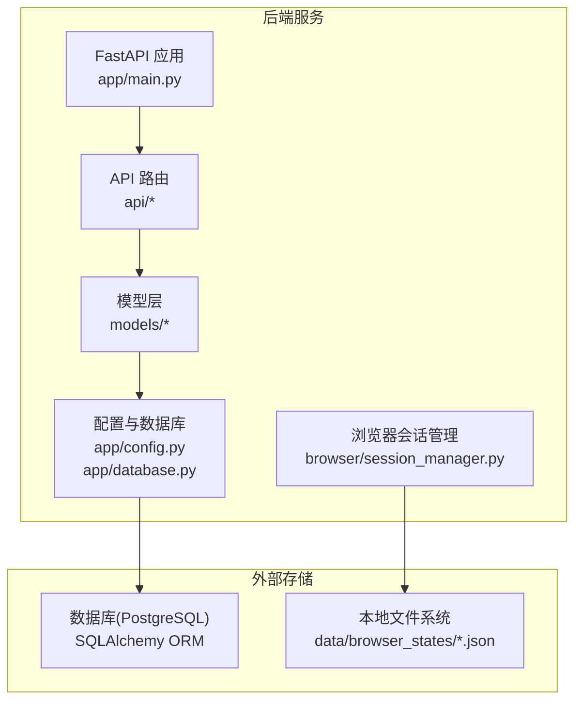
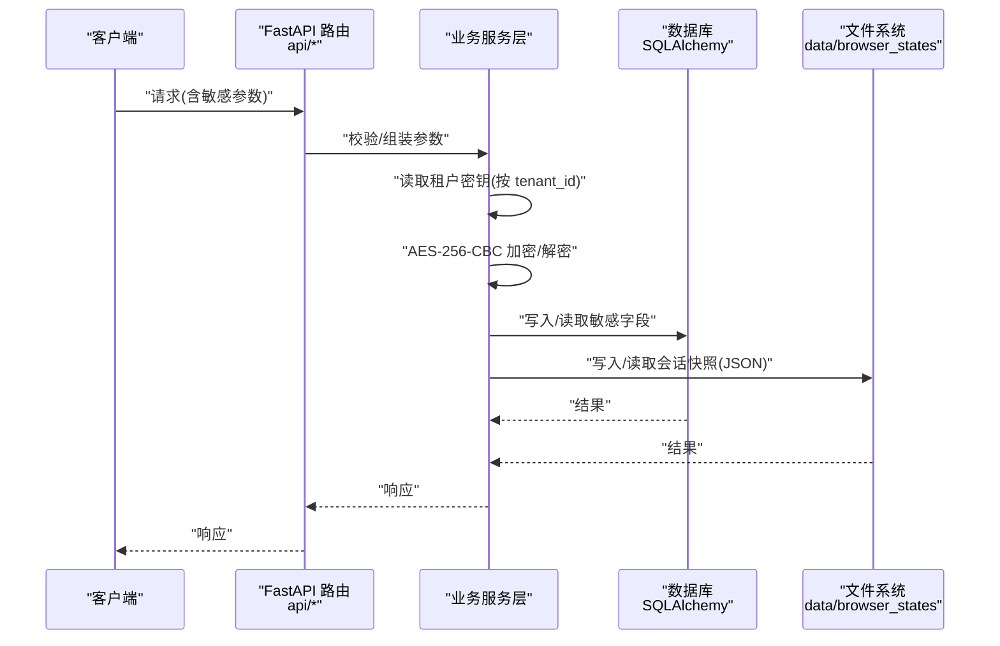
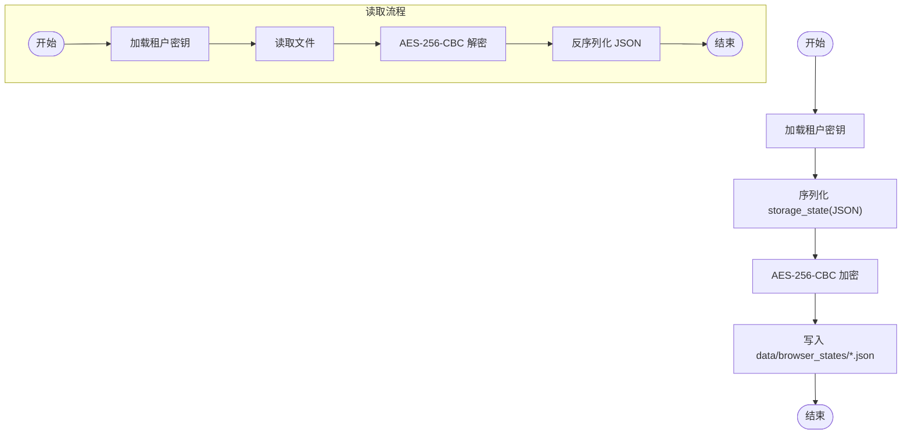
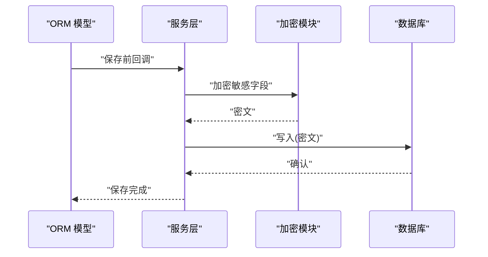
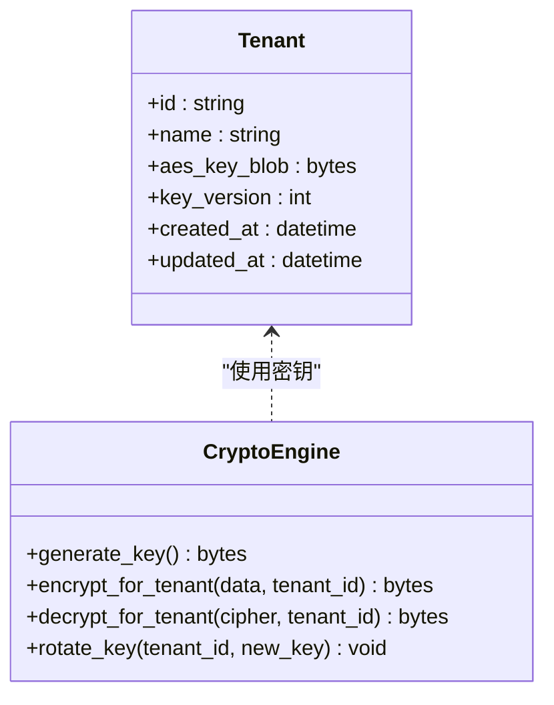
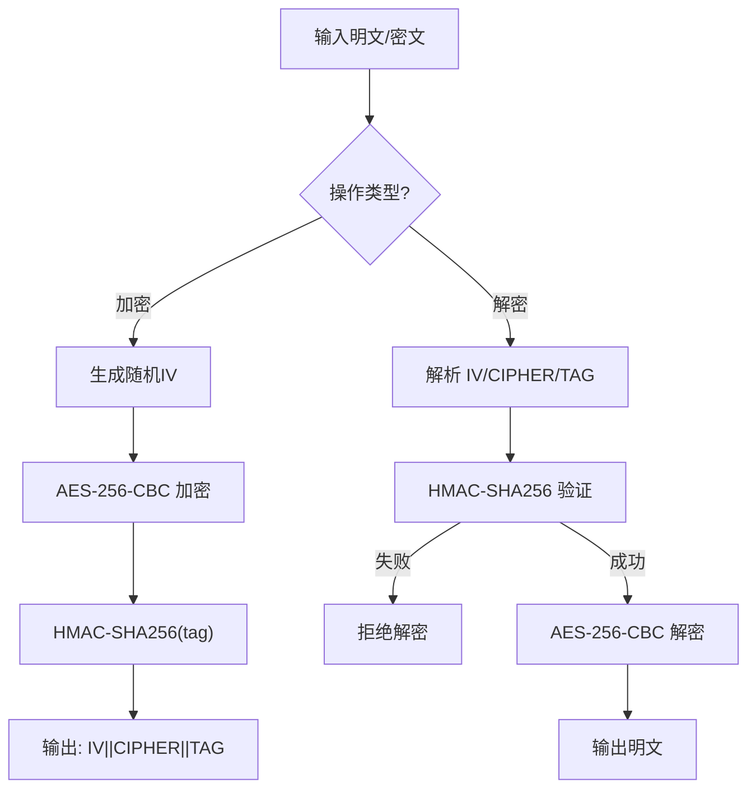
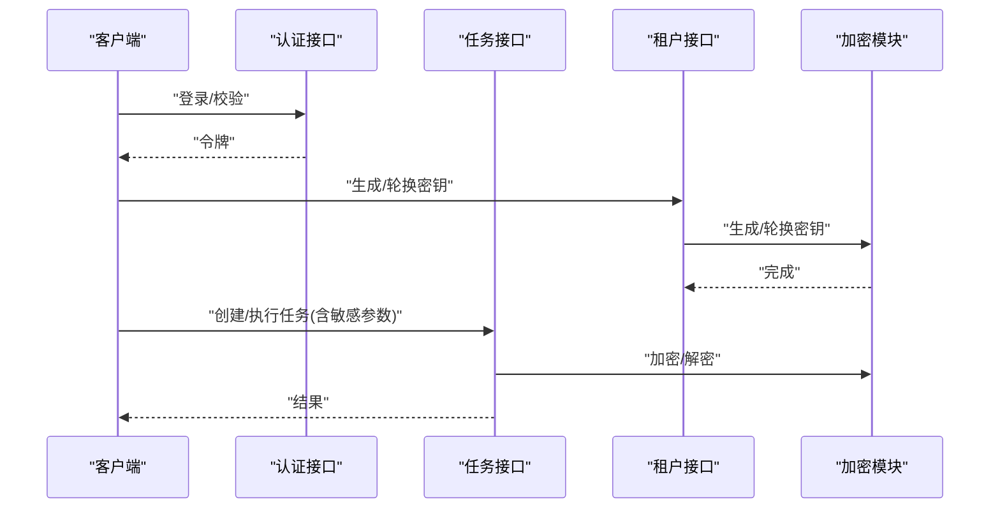
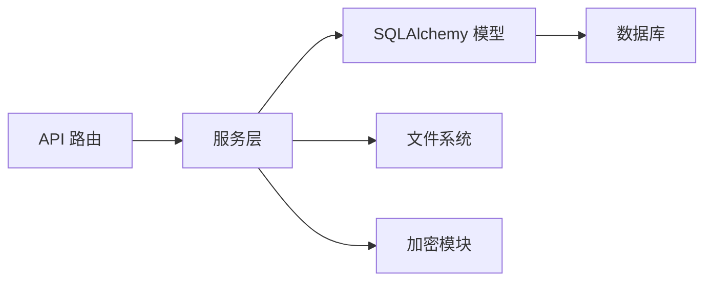

# 数据加密存储

<cite>
**本文引用的文件**
- [project.md](file://project.md)
- [main.py](file://CCC_RPA_API/app/main.py)
- [config.py](file://CCC_RPA_API/app/config.py)
- [database.py](file://CCC_RPA_API/app/database.py)
- [base.py](file://CCC_RPA_API/app/models/base.py)
- [task.py](file://CCC_RPA_API/app/models/task.py)
- [execution_log.py](file://CCC_RPA_API/app/models/execution_log.py)
- [user.py](file://CCC_RPA_API/app/models/user.py)
- [session_manager.py](file://CCC_RPA_API/app/browser/session_manager.py)
- [auth.py](file://CCC_RPA_API/app/api/auth.py)
- [tasks.py](file://CCC_RPA_API/app/api/tasks.py)
- [tenants.py](file://CCC_RPA_API/app/api/tenants.py)
</cite>

## 目录
1. [引言](#引言)
2. [项目结构](#项目结构)
3. [核心组件](#核心组件)
4. [架构总览](#架构总览)
5. [详细组件分析](#详细组件分析)
6. [依赖分析](#依赖分析)
7. [性能考虑](#性能考虑)
8. [故障排查指南](#故障排查指南)
9. [结论](#结论)
10. [附录](#附录)

## 引言
本文件面向“数据加密存储”的技术实现，围绕以下目标展开：
- 在会话快照文件与数据库敏感字段中应用 AES-256-CBC 加密
- 实施租户独立密钥管理机制，覆盖密钥生成、存储与轮换策略
- 明确加密/解密流程、密钥安全存储、数据完整性验证与性能优化
- 提供可落地的实现示例路径、密钥管理最佳实践与安全审计要求

根据项目文档，系统已明确将“会话快照文件”与“数据库敏感字段（租户密钥、代理地址）”纳入 AES-256-CBC 加密存储范围，并要求密钥存储于租户表的独立字段。

## 项目结构
后端采用 FastAPI + SQLAlchemy 架构，数据库连接与模型定义集中在 CCC_RPA_API 子项目；浏览器会话状态以 JSON 文件形式持久化到本地 data/browser_states 目录，作为“会话快照文件”的载体。

图表来源
- [main.py:30-87](file://CCC_RPA_API/app/main.py#L30-L87)
- [config.py:6-22](file://CCC_RPA_API/app/config.py#L6-L22)
- [database.py:1-19](file://CCC_RPA_API/app/database.py#L1-L19)
- [session_manager.py:19-23](file://CCC_RPA_API/app/browser/session_manager.py#L19-L23)

章节来源
- [main.py:30-87](file://CCC_RPA_API/app/main.py#L30-L87)
- [config.py:6-22](file://CCC_RPA_API/app/config.py#L6-L22)
- [database.py:1-19](file://CCC_RPA_API/app/database.py#L1-L19)
- [session_manager.py:19-23](file://CCC_RPA_API/app/browser/session_manager.py#L19-L23)

## 核心组件
- 数据库层：基于 SQLAlchemy 的模型与连接管理，负责敏感字段的加密/解密与持久化。
- 会话快照：通过 Playwright 的 storage_state 持久化为 JSON 文件，需在写入与读取时进行 AES-256-CBC 加密。
- 租户密钥：每个租户拥有独立密钥，存储于租户表的独立字段，用于会话快照与敏感字段的加解密。
- API 层：对外暴露认证、任务、租户等接口，内部调用服务层完成业务逻辑与数据处理。

章节来源
- [base.py:7-11](file://CCC_RPA_API/app/models/base.py#L7-L11)
- [task.py:8-25](file://CCC_RPA_API/app/models/task.py#L8-L25)
- [execution_log.py:7-17](file://CCC_RPA_API/app/models/execution_log.py#L7-L17)
- [user.py:7-17](file://CCC_RPA_API/app/models/user.py#L7-L17)
- [session_manager.py:10-170](file://CCC_RPA_API/app/browser/session_manager.py#L10-L170)

## 架构总览
下图展示了从 API 请求到数据库与文件系统的整体流程，以及加密/解密的关键节点。

图表来源
- [auth.py:10-23](file://CCC_RPA_API/app/api/auth.py#L10-L23)
- [tasks.py:13-76](file://CCC_RPA_API/app/api/tasks.py#L13-L76)
- [tenants.py:21-24](file://CCC_RPA_API/app/api/tenants.py#L21-L24)
- [session_manager.py:129-135](file://CCC_RPA_API/app/browser/session_manager.py#L129-L135)

## 详细组件分析

### 会话快照文件加密（AES-256-CBC）
- 存储位置：data/browser_states/<province>_state.json
- 加密策略：AES-256-CBC，密钥来自租户表独立字段
- 关键流程：
  - 写入：序列化 storage_state -> 使用租户密钥加密 -> 写入文件
  - 读取：读取文件 -> 使用租户密钥解密 -> 反序列化为 storage_state
- 数据完整性：建议附加 HMAC-SHA256 或 AEAD 模式，确保密文未被篡改
- 性能优化：大文件分块加密、异步 IO、缓存最近使用的密钥与上下文

图表来源
- [session_manager.py:129-135](file://CCC_RPA_API/app/browser/session_manager.py#L129-L135)

章节来源
- [session_manager.py:10-170](file://CCC_RPA_API/app/browser/session_manager.py#L10-L170)

### 数据库敏感字段加密（AES-256-CBC）
- 目标字段：租户密钥、代理地址等敏感信息
- 存储方式：加密后入库，不保留明文
- 关键流程：
  - 写入：敏感字段 -> 使用租户密钥加密 -> 持久化
  - 读取：从数据库读取密文 -> 使用租户密钥解密 -> 返回业务对象
- 数据完整性：建议采用 AEAD 模式或 HMAC-SHA256，防止篡改
- 性能优化：批量加解密、密钥缓存、索引字段避免加密存储

图表来源
- [task.py:14-18](file://CCC_RPA_API/app/models/task.py#L14-L18)
- [user.py:13-14](file://CCC_RPA_API/app/models/user.py#L13-L14)

章节来源
- [task.py:8-25](file://CCC_RPA_API/app/models/task.py#L8-L25)
- [user.py:7-17](file://CCC_RPA_API/app/models/user.py#L7-L17)

### 租户独立密钥管理机制
- 密钥生成：为每个租户生成独立的 AES-256 密钥，建议使用系统 CSPRNG
- 密钥存储：在租户表新增独立字段存储密钥（建议仅存储密钥派生材料或密文密钥）
- 密钥轮换：支持密钥版本号与渐进迁移，保证历史快照与新密钥并存过渡期
- 访问控制：仅授权服务可读取密钥，密钥变更需审计与审批

图表来源
- [project.md:1280](file://project.md#L1280)

章节来源
- [project.md:1298-1302](file://project.md#L1298-L1302)

### 加密/解密流程与完整性验证
- 加密流程：随机 IV + AES-256-CBC + HMAC-SHA256(tag)，输出格式为 IV||CIPHER||TAG
- 解密流程：解析 IV/CIPHER/TAG -> 验证 HMAC -> 解密得到明文
- 完整性验证：解密前先校验 HMAC，失败则拒绝解密
- 性能优化：使用硬件加速 AES-NI、批处理、内存池复用

图表来源
- [project.md:1298-1302](file://project.md#L1298-L1302)

章节来源
- [project.md:1298-1302](file://project.md#L1298-L1302)

### 密钥安全存储与轮换策略
- 密钥材料：建议使用 KMS 或 HSM 保护根密钥，应用侧仅持有派生密钥
- 轮换策略：引入 key_version，新旧密钥并行，逐步迁移历史数据
- 访问审计：记录密钥生成、轮换、解密尝试的日志，支持回溯与合规检查

章节来源
- [project.md:1280](file://project.md#L1280)

### API 与业务集成点
- 认证与任务接口：在鉴权与任务执行前后，对涉及敏感信息的字段进行加解密
- 租户管理：提供租户密钥生成、轮换与查询接口

图表来源
- [auth.py:10-23](file://CCC_RPA_API/app/api/auth.py#L10-L23)
- [tasks.py:18-52](file://CCC_RPA_API/app/api/tasks.py#L18-L52)
- [tenants.py:21-24](file://CCC_RPA_API/app/api/tenants.py#L21-L24)

章节来源
- [auth.py:1-24](file://CCC_RPA_API/app/api/auth.py#L1-L24)
- [tasks.py:1-76](file://CCC_RPA_API/app/api/tasks.py#L1-L76)
- [tenants.py:1-24](file://CCC_RPA_API/app/api/tenants.py#L1-L24)

## 依赖分析
- 组件耦合：API 路由依赖服务层；服务层依赖模型与数据库；模型依赖 SQLAlchemy；会话管理依赖 Playwright 与文件系统。
- 外部依赖：SQLAlchemy、PyMySQL、FastAPI、Playwright
- 潜在风险：线程安全（会话管理）、密钥泄露（租户密钥存储）、性能瓶颈（IO 与加解密）

图表来源
- [main.py:24-27](file://CCC_RPA_API/app/main.py#L24-L27)
- [database.py:1-19](file://CCC_RPA_API/app/database.py#L1-L19)
- [session_manager.py:10-170](file://CCC_RPA_API/app/browser/session_manager.py#L10-L170)

章节来源
- [main.py:24-27](file://CCC_RPA_API/app/main.py#L24-L27)
- [database.py:1-19](file://CCC_RPA_API/app/database.py#L1-L19)

## 性能考虑
- 加密性能：优先使用硬件 AES-NI；对大批量数据采用分块加密与并行处理
- IO 性能：会话快照文件采用异步写入与缓存；数据库批量插入/更新
- 内存管理：避免重复解密相同数据；及时释放上下文与连接
- 并发控制：会话管理器使用锁与专用线程，避免竞态条件

## 故障排查指南
- 会话快照无法读取：检查密钥是否匹配、文件是否被篡改、HMAC 校验是否通过
- 数据库解密失败：确认租户密钥版本、密钥轮换过渡期配置、日志审计
- 性能异常：监控 CPU、内存、IO；定位加密/解密热点与慢查询

章节来源
- [session_manager.py:147-154](file://CCC_RPA_API/app/browser/session_manager.py#L147-L154)

## 结论
本方案以 AES-256-CBC 为核心，结合租户独立密钥管理与文件系统/数据库双场景加密，满足会话快照与敏感字段的安全存储需求。通过 HMAC 完整性校验、密钥轮换与审计日志，进一步提升安全性与可维护性。建议尽快在服务层接入加密模块，并完善密钥生命周期管理与性能优化策略。

## 附录
- 实现示例路径（不展示具体代码，仅提供定位）：
  - 会话快照写入：[session_manager.py:129-135](file://CCC_RPA_API/app/browser/session_manager.py#L129-L135)
  - 数据库敏感字段模型：[task.py:14-18](file://CCC_RPA_API/app/models/task.py#L14-L18)、[user.py:13-14](file://CCC_RPA_API/app/models/user.py#L13-L14)
  - API 集成点：[auth.py:10-23](file://CCC_RPA_API/app/api/auth.py#L10-L23)、[tasks.py:18-52](file://CCC_RPA_API/app/api/tasks.py#L18-L52)、[tenants.py:21-24](file://CCC_RPA_API/app/api/tenants.py#L21-L24)
- 安全审计要求：
  - 记录密钥生成/轮换/解密尝试
  - 定期审查密钥访问权限与使用频率
  - 对异常解密失败与密文篡改进行告警