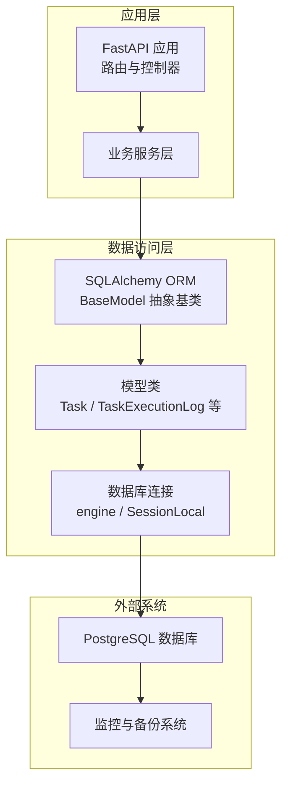
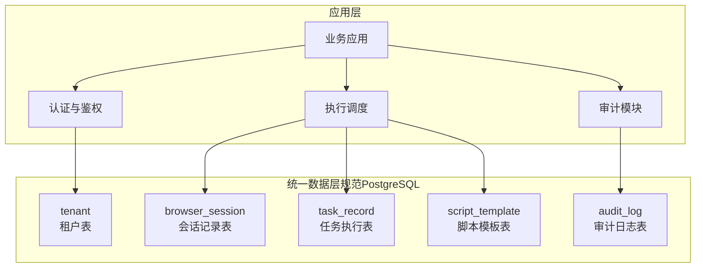
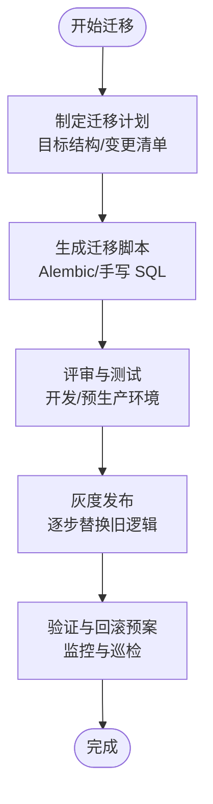
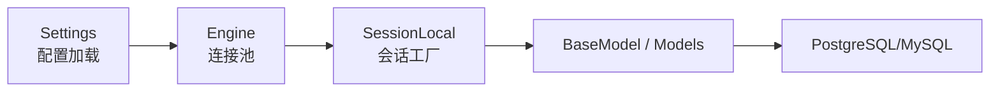

# 数据库设计

<cite>
**本文引用的文件**
- [project.md](file://project.md)
- [config.py](file://CCC_RPA_API/app/config.py)
- [database.py](file://CCC_RPA_API/app/database.py)
- [base.py](file://CCC_RPA_API/app/models/base.py)
- [task.py](file://CCC_RPA_API/app/models/task.py)
- [execution_log.py](file://CCC_RPA_API/app/models/execution_log.py)
- [main.py](file://CCC_RPA_API/app/main.py)
- [config.py](file://CCC-BrowserV4/backend/app/config.py)
- [database.py](file://CCC-BrowserV4/backend/app/database.py)
- [docker-compose.yml](file://CCC-BrowserV4/docker-compose.yml)
</cite>

## 目录
1. [简介](#简介)
2. [项目结构](#项目结构)
3. [核心组件](#核心组件)
4. [架构总览](#架构总览)
5. [详细组件分析](#详细组件分析)
6. [依赖分析](#依赖分析)
7. [性能考虑](#性能考虑)
8. [故障排查指南](#故障排查指南)
9. [结论](#结论)
10. [附录](#附录)

## 简介
本文件面向“统一数据层设计规范”中提出的 PostgreSQL 核心数据表集合，结合仓库现有代码与需求规格，系统化梳理以下五张核心表的设计目标、字段定义、索引策略与约束规则，并给出基于现有代码的落地实现建议与扩展方案。同时，围绕租户数据物理隔离、数据一致性与查询性能优化进行深入说明；并补充数据库迁移、备份策略与性能监控的实施要点。

- 规范要求的核心表包括：tenant、browser_session、task_record、audit_log、script_template。
- 当前仓库后端以 MySQL 为主，但统一数据层规范明确为 PostgreSQL。本文在不改变现有实现的前提下，提供面向 PostgreSQL 的规范化设计与迁移建议。

章节来源
- [project.md:1276-1288](file://project.md#L1276-L1288)

## 项目结构
- 数据访问层采用 SQLAlchemy ORM，统一基类提供通用时间戳字段。
- 业务模型集中在 CCC_RPA_API 的 models 目录下，数据库连接与会话由 database.py 提供。
- 配置通过 Settings 类加载环境变量，支持 MySQL 连接串生成。
- 健康检查接口用于验证数据库连通性。

图表来源
- [database.py:1-19](file://CCC_RPA_API/app/database.py#L1-L19)
- [base.py:1-11](file://CCC_RPA_API/app/models/base.py#L1-L11)
- [task.py:1-25](file://CCC_RPA_API/app/models/task.py#L1-L25)
- [execution_log.py:1-16](file://CCC_RPA_API/app/models/execution_log.py#L1-L16)

章节来源
- [database.py:1-19](file://CCC_RPA_API/app/database.py#L1-L19)
- [base.py:1-11](file://CCC_RPA_API/app/models/base.py#L1-L11)
- [task.py:1-25](file://CCC_RPA_API/app/models/task.py#L1-L25)
- [execution_log.py:1-16](file://CCC_RPA_API/app/models/execution_log.py#L1-L16)

## 核心组件
- 统一时间戳基类：为所有业务表提供 created_at 与 updated_at 字段，简化审计与排序。
- 任务模型：包含任务元信息、状态、租户与设备关联、软删除标记等。
- 任务执行日志模型：记录每次任务执行的开始/结束时间、状态与结果消息。
- 数据库连接：通过 Settings 生成连接串，使用 SessionLocal 管理会话生命周期。
- 健康检查：提供数据库连通性检测接口。

章节来源
- [base.py:1-11](file://CCC_RPA_API/app/models/base.py#L1-L11)
- [task.py:1-25](file://CCC_RPA_API/app/models/task.py#L1-L25)
- [execution_log.py:1-16](file://CCC_RPA_API/app/models/execution_log.py#L1-L16)
- [database.py:1-19](file://CCC_RPA_API/app/database.py#L1-L19)
- [config.py:1-22](file://CCC_RPA_API/app/config.py#L1-L22)

## 架构总览
下图展示应用与数据库之间的交互关系，以及统一数据层规范对表结构的要求映射。

图表来源
- [project.md:1276-1288](file://project.md#L1276-L1288)

## 详细组件分析

### 统一数据层规范与字段映射
依据统一数据层设计规范，核心表字段与职责如下：

- tenant（租户表）
  - 字段：tenantId、租户名称、并发配额、AES 密钥、创建时间、启用状态
  - 用途：承载租户维度的配置与安全参数
  - 建议主键：tenantId（UUID 或长整型），唯一且自增可选
  - 索引：tenantId 唯一索引；启用状态常用作过滤条件，可建立二级索引
  - 约束：tenantId 唯一；密钥字段加密存储；启用状态布尔值

- browser_session（会话记录表）
  - 字段：sessionId、tenantId、proxyId、启动时间、销毁时间、内存上限、会话状态
  - 用途：跟踪浏览器会话生命周期与资源占用
  - 建议主键：sessionId（UUID）
  - 索引：tenantId、会话状态、启动时间；必要时对 proxyId 建立二级索引
  - 约束：状态枚举；销毁时间需晚于启动时间；内存上限非负

- task_record（任务执行表）
  - 字段：taskId、sessionId、任务类型（脚本 / AI）、执行状态、耗时、结果存储路径
  - 用途：记录任务执行轨迹与结果
  - 建议主键：taskId（业务主键）或自增主键；若使用业务主键，应确保全局唯一
  - 索引：sessionId、任务类型、执行状态、创建时间；结果存储路径用于归档检索
  - 约束：类型与状态枚举；耗时非负；结果路径存在性校验

- audit_log（审计日志表）
  - 字段：操作人 ID、tenantId、sessionId、操作类型、操作时间、操作详情
  - 用途：合规与审计追踪
  - 建议主键：自增主键或复合主键（时间+类型+标识）
  - 索引：tenantId、sessionId、操作时间；操作类型用于快速筛选
  - 约束：详情字段长度限制；时间字段默认当前时间

- script_template（脚本模板表）
  - 字段：tenantId、脚本名称、DSL 脚本内容、创建时间
  - 用途：模板化脚本管理与复用
  - 建议主键：自增主键；tenantId+脚本名组合唯一
  - 索引：tenantId、脚本名；创建时间用于版本对比
  - 约束：内容字段长度限制；名称唯一性

章节来源
- [project.md:1276-1288](file://project.md#L1276-L1288)

### 租户数据物理隔离
- 方案一：数据库级隔离（推荐）
  - 为每个租户分配独立数据库或独立 Schema（视 PostgreSQL 版本与权限策略而定），通过连接串中的 database/schema 参数区分。
  - 应用层在初始化阶段根据租户标识选择对应连接，避免跨租户数据泄露。
- 方案二：逻辑隔离
  - 在每张表增加 tenant_id 字段（如 tasks.tenant_id），并在所有查询中强制带上 tenant_id 条件。
  - 通过中间件或拦截器统一注入 tenant_id，防止遗漏。
- 与现状的衔接
  - 现有任务模型已包含 tenant_id 字段，可在查询层强制加入该条件，实现逻辑隔离。
  - 若未来切换到 PostgreSQL，建议优先采用数据库级隔离以获得更强的一致性与安全性保障。

章节来源
- [task.py:14](file://CCC_RPA_API/app/models/task.py#L14)

### 数据一致性保证
- 事务边界
  - 使用 SQLAlchemy 会话（SessionLocal）包裹写入流程，确保多步写入在一个事务内提交。
- 并发控制
  - 对关键字段（如任务状态、会话状态）使用行级锁或乐观锁（版本号）避免竞态。
- 时间一致性
  - 统一使用数据库默认时间戳（created_at/updated_at）保证跨服务时间一致。
- 审计一致性
  - 审计日志与业务数据在同一事务中写入，或至少在同一批次内落盘，避免时间差导致的审计缺失。

章节来源
- [base.py:9-10](file://CCC_RPA_API/app/models/base.py#L9-L10)
- [database.py:13-19](file://CCC_RPA_API/app/database.py#L13-L19)

### 查询性能优化
- 索引策略
  - tenant 表：tenantId 唯一索引；启用状态二级索引
  - browser_session：tenantId、状态、启动时间索引；必要时对 proxyId 建索引
  - task_record：sessionId、类型、状态、创建时间索引；结果路径用于归档检索
  - audit_log：tenantId、sessionId、操作时间索引；操作类型二级索引
  - script_template：tenantId、脚本名唯一索引；创建时间索引
- 查询优化
  - 强制带 tenant_id 过滤；避免全表扫描
  - 使用覆盖索引减少回表；对高频过滤字段建立复合索引
  - 分页查询使用基于索引的游标分页（id 或时间戳）

章节来源
- [task.py:12-24](file://CCC_RPA_API/app/models/task.py#L12-L24)
- [execution_log.py:11](file://CCC_RPA_API/app/models/execution_log.py#L11)

### 数据库迁移
- 现状迁移
  - 代码中存在对 tasks 表动态添加列的逻辑，体现迁移能力（MySQL）。迁移过程需：
    - 识别目标表结构（PostgreSQL）
    - 生成迁移脚本（新增列、索引、约束）
    - 在灰度环境中验证后再上线
- 迁移工具建议
  - 使用 Alembic（SQLAlchemy 官方迁移工具）管理版本化迁移
  - 对生产环境采用只增不改策略，新增列/索引后逐步替换旧逻辑
- 与现有代码的衔接
  - 保持 tasks 模型字段与迁移脚本一致，避免运行时异常

章节来源
- [main.py:41-86](file://CCC_RPA_API/app/main.py#L41-L86)

### 备份策略
- 备份周期
  - 租户配置与任务日志每日全量快照备份
- 备份方式
  - 使用 pg_dump/pg_restore 进行逻辑备份；或使用物理备份（如基础备份+WAL 归档）以缩短 RTO
- 恢复演练
  - 定期进行恢复演练，验证备份完整性与恢复时间目标（RPO/RTO）
- 归档与保留
  - 设置备份保留周期（如 30/90 天），定期清理过期备份

章节来源
- [project.md:1248-1256](file://project.md#L1248-L1256)

### 性能监控
- 指标体系
  - QPS/TPS、P95/P99 延迟、连接池利用率、慢查询数、索引命中率
- 监控工具
  - Prometheus + Grafana 面板；结合 pg_stat_statements、pg_stat_user_tables 等内置视图
- 告警阈值
  - 连接池空闲耗尽、慢查询超过阈值、索引未命中率上升、备份失败
- 优化闭环
  - 基于监控发现问题 → 生成索引/查询优化 → 回归测试 → 发布

章节来源
- [project.md:1272-1274](file://project.md#L1272-L1274)

## 依赖分析
- 应用依赖 SQLAlchemy ORM 与数据库连接池
- 配置通过 Settings 注入，支持不同数据库类型（MySQL/SQLite）
- 健康检查依赖数据库连接检测

图表来源
- [config.py:1-22](file://CCC_RPA_API/app/config.py#L1-L22)
- [database.py:1-19](file://CCC_RPA_API/app/database.py#L1-L19)

章节来源
- [config.py:1-22](file://CCC_RPA_API/app/config.py#L1-L22)
- [database.py:1-19](file://CCC_RPA_API/app/database.py#L1-L19)

## 性能考虑
- 连接池参数
  - pool_size、max_overflow、pool_recycle、pool_pre_ping 用于稳定连接与回收
- 查询优化
  - 强制带 tenant_id 过滤；避免 N+1 查询；合理使用分页与索引
- 存储层优化
  - 使用合适的分区策略（按时间或租户）降低扫描范围
  - 对大字段（如脚本内容、结果路径）采用压缩或外部存储

章节来源
- [database.py:5-6](file://CCC_RPA_API/app/database.py#L5-L6)

## 故障排查指南
- 连接问题
  - 使用健康检查接口确认数据库连通性
  - 检查连接串、凭据与网络策略
- 迁移失败
  - 核对迁移脚本与目标表结构；关注列类型与默认值差异
  - 生产环境回滚预案与数据一致性校验
- 性能问题
  - 通过慢查询日志与监控面板定位热点；补充索引或重构查询
- 备份与恢复
  - 验证备份文件完整性；定期演练恢复流程

章节来源
- [database.py:37-44](file://CCC_RPA_API/app/database.py#L37-L44)
- [main.py:41-86](file://CCC_RPA_API/app/main.py#L41-L86)

## 结论
- 当前代码以 MySQL 为主，统一数据层规范明确为 PostgreSQL。建议在不破坏现有功能的前提下，逐步引入 Alembic 进行迁移，并在应用层通过中间件强制注入 tenant_id 实现逻辑隔离。
- 通过合理的索引策略、事务边界与监控告警，可有效提升查询性能与系统稳定性。
- 备份与恢复策略应满足规范要求的 RPO/RTO 目标，并定期演练。

## 附录

### 建表语句与数据字典（面向 PostgreSQL 的规范化设计）
以下为面向 PostgreSQL 的建表语句与数据字典，便于对照与迁移。为避免直接粘贴 SQL，仅提供字段清单与约束说明，具体 SQL 请按需生成。

- tenant（租户表）
  - 字段
    - id：主键（UUID 或自增）
    - tenant_id：唯一标识（VARCHAR/UUID，UNIQUE）
    - name：租户名称（VARCHAR）
    - concurrency_quota：并发配额（INTEGER）
    - aes_key：AES 密钥（TEXT，加密存储）
    - is_enabled：启用状态（BOOLEAN）
    - created_at：创建时间（TIMESTAMP，默认 now()）
    - updated_at：更新时间（TIMESTAMP，默认 now()，ON UPDATE now()）
  - 索引
    - 唯一索引：tenant_id
    - 二级索引：is_enabled
  - 约束
    - tenant_id 唯一
    - concurrency_quota 非负
    - is_enabled 布尔

- browser_session（会话记录表）
  - 字段
    - id：主键（UUID）
    - session_id：会话标识（VARCHAR/UUID，UNIQUE）
    - tenant_id：租户标识（VARCHAR/UUID，FK）
    - proxy_id：代理标识（VARCHAR/UUID）
    - started_at：启动时间（TIMESTAMP）
    - destroyed_at：销毁时间（TIMESTAMP，可为空）
    - memory_limit_mb：内存上限（INTEGER，非负）
    - status：会话状态（ENUM）
    - created_at：创建时间（TIMESTAMP）
    - updated_at：更新时间（TIMESTAMP）
  - 索引
    - 唯一索引：session_id
    - 二级索引：tenant_id、status、started_at
  - 约束
    - destroyed_at >= started_at
    - memory_limit_mb 非负

- task_record（任务执行表）
  - 字段
    - id：主键（UUID 或自增）
    - task_id：任务标识（VARCHAR/UUID，UNIQUE）
    - session_id：会话标识（VARCHAR/UUID，FK）
    - type：任务类型（ENUM：脚本/AI）
    - status：执行状态（ENUM：running/completed/failed）
    - duration_ms：耗时（INTEGER，非负）
    - result_path：结果存储路径（TEXT）
    - created_at：创建时间（TIMESTAMP）
    - updated_at：更新时间（TIMESTAMP）
  - 索引
    - 唯一索引：task_id
    - 二级索引：session_id、type、status、created_at
  - 约束
    - duration_ms 非负
    - result_path 存在性校验（可选）

- audit_log（审计日志表）
  - 字段
    - id：主键（自增）
    - operator_id：操作人 ID（VARCHAR/UUID）
    - tenant_id：租户标识（VARCHAR/UUID，FK）
    - session_id：会话标识（VARCHAR/UUID）
    - operation_type：操作类型（ENUM）
    - operation_time：操作时间（TIMESTAMP）
    - operation_details：操作详情（TEXT）
    - created_at：创建时间（TIMESTAMP）
  - 索引
    - 二级索引：tenant_id、session_id、operation_time、operation_type
  - 约束
    - operation_details 长度限制

- script_template（脚本模板表）
  - 字段
    - id：主键（自增）
    - tenant_id：租户标识（VARCHAR/UUID，FK）
    - name：脚本名称（VARCHAR，UNIQUE）
    - dsl_content：DSL 脚本内容（TEXT）
    - created_at：创建时间（TIMESTAMP）
  - 索引
    - 唯一索引：tenant_id + name
    - 二级索引：created_at
  - 约束
    - name 唯一
    - dsl_content 长度限制

章节来源
- [project.md:1276-1288](file://project.md#L1276-L1288)