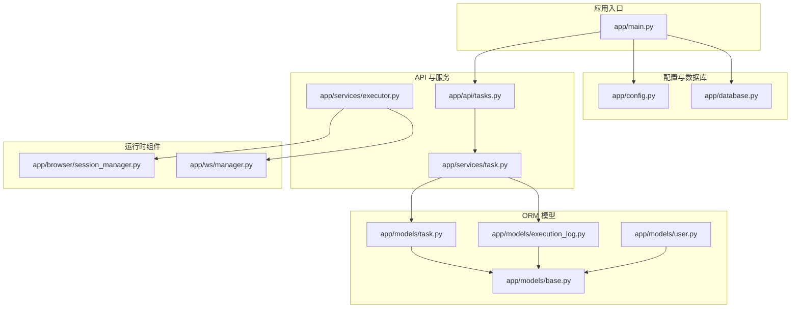
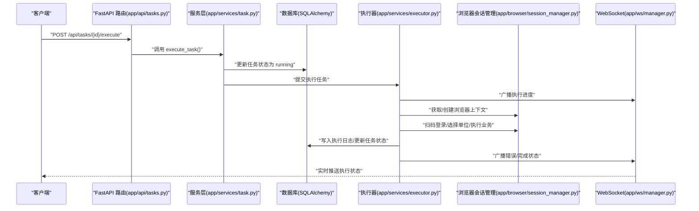
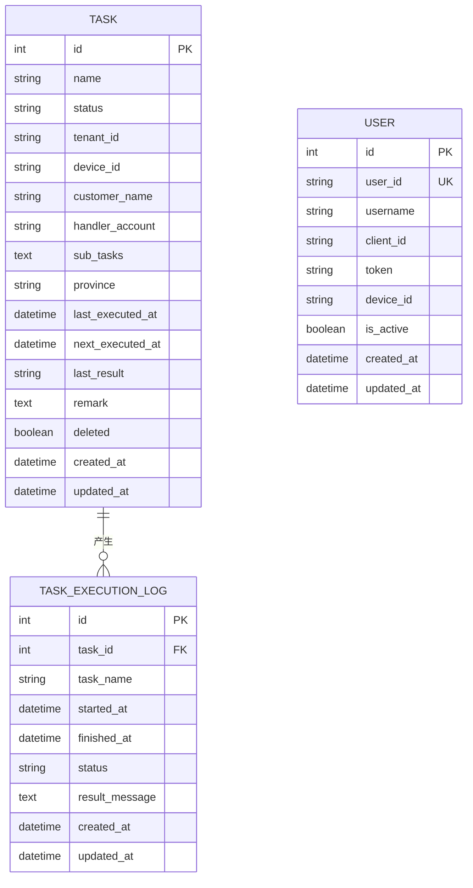
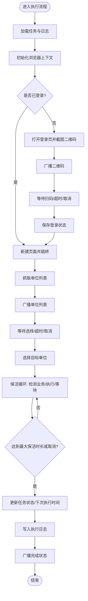
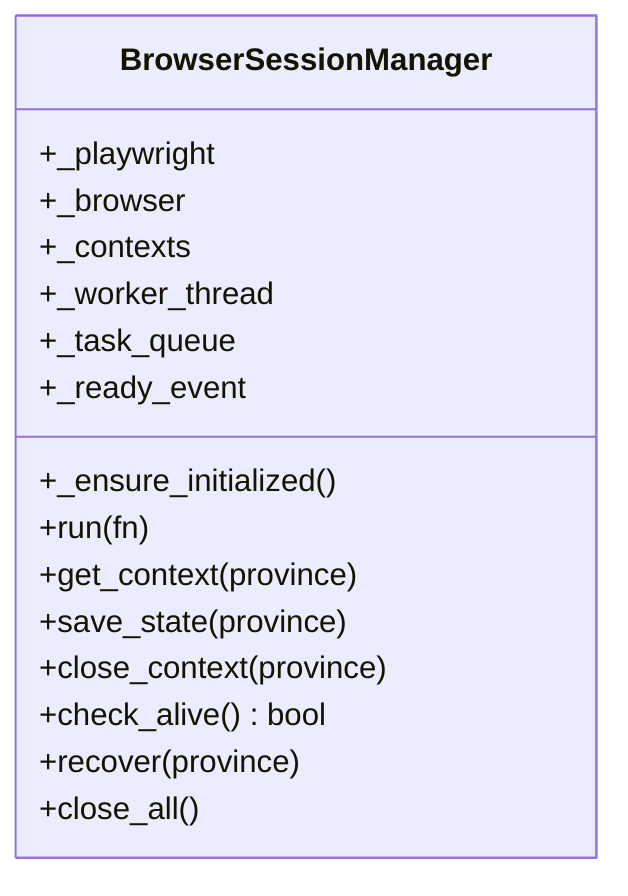
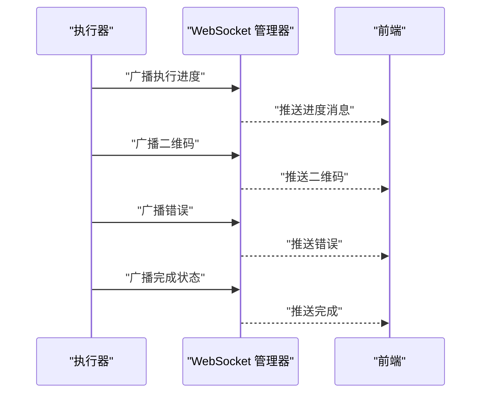
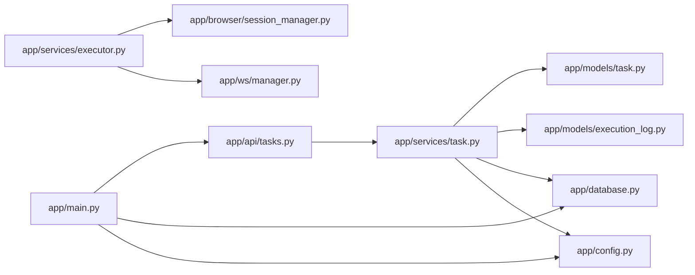

# 数据持久化与监控

<cite>
**本文档引用的文件**
- [app/main.py](file://CCC_RPA_API/app/main.py)
- [app/config.py](file://CCC_RPA_API/app/config.py)
- [app/database.py](file://CCC_RPA_API/app/database.py)
- [app/models/base.py](file://CCC_RPA_API/app/models/base.py)
- [app/models/task.py](file://CCC_RPA_API/app/models/task.py)
- [app/models/execution_log.py](file://CCC_RPA_API/app/models/execution_log.py)
- [app/models/user.py](file://CCC_RPA_API/app/models/user.py)
- [app/api/tasks.py](file://CCC_RPA_API/app/api/tasks.py)
- [app/services/task.py](file://CCC_RPA_API/app/services/task.py)
- [app/services/executor.py](file://CCC_RPA_API/app/services/executor.py)
- [app/browser/session_manager.py](file://CCC_RPA_API/app/browser/session_manager.py)
- [app/ws/manager.py](file://CCC_RPA_API/app/ws/manager.py)
</cite>

## 目录
1. [引言](#引言)
2. [项目结构](#项目结构)
3. [核心组件](#核心组件)
4. [架构总览](#架构总览)
5. [详细组件分析](#详细组件分析)
6. [依赖分析](#依赖分析)
7. [性能考虑](#性能考虑)
8. [故障排查指南](#故障排查指南)
9. [结论](#结论)
10. [附录](#附录)

## 引言
本文件面向“数据持久化与监控”主题，系统梳理本项目的数据库表设计、统一数据存储规范、监控指标采集、告警推送与异常容错机制，并给出缓存策略与运维自动化的建议。当前仓库以 MySQL 作为持久化存储，未发现 Redis 缓存与 AES 加密存储的实现；同时，WebSocket 广播用于前端实时反馈，但未见专门的全链路监控与告警系统。本文将基于现有代码进行深入分析，并提供可落地的改进建议。

## 项目结构
后端采用 FastAPI + SQLAlchemy 架构，数据库通过 PyMySQL 驱动连接 MySQL。核心模块包括：
- 配置与数据库引擎：设置数据库连接参数与连接池行为
- ORM 基类与模型：定义通用字段与业务表结构
- API 路由与服务层：封装任务 CRUD、执行调度与日志查询
- 执行器与浏览器会话管理：异步线程池执行任务，Playwright 控制浏览器
- WebSocket 管理器：向客户端推送执行进度与错误

图表来源
- [app/main.py:1-127](file://CCC_RPA_API/app/main.py#L1-L127)
- [app/config.py:1-22](file://CCC_RPA_API/app/config.py#L1-L22)
- [app/database.py:1-19](file://CCC_RPA_API/app/database.py#L1-L19)
- [app/models/base.py:1-11](file://CCC_RPA_API/app/models/base.py#L1-L11)
- [app/models/task.py:1-25](file://CCC_RPA_API/app/models/task.py#L1-L25)
- [app/models/execution_log.py:1-17](file://CCC_RPA_API/app/models/execution_log.py#L1-L17)
- [app/models/user.py:1-17](file://CCC_RPA_API/app/models/user.py#L1-L17)
- [app/api/tasks.py:1-76](file://CCC_RPA_API/app/api/tasks.py#L1-L76)
- [app/services/task.py:1-157](file://CCC_RPA_API/app/services/task.py#L1-L157)
- [app/services/executor.py:1-319](file://CCC_RPA_API/app/services/executor.py#L1-L319)
- [app/browser/session_manager.py:1-186](file://CCC_RPA_API/app/browser/session_manager.py#L1-L186)
- [app/ws/manager.py:1-29](file://CCC_RPA_API/app/ws/manager.py#L1-L29)

章节来源
- [app/main.py:1-127](file://CCC_RPA_API/app/main.py#L1-L127)
- [app/config.py:1-22](file://CCC_RPA_API/app/config.py#L1-L22)
- [app/database.py:1-19](file://CCC_RPA_API/app/database.py#L1-L19)

## 核心组件
- 数据库与连接池
  - 使用 SQLAlchemy 创建引擎，启用 pre_ping 与 recycle，确保连接健康与复用
  - 提供 get_db 依赖注入，保证每个请求拥有独立会话并正确关闭
- ORM 基类与通用字段
  - BaseModel 统一提供 created_at/updated_at 字段，简化审计与排序
- 业务模型
  - Task：任务元数据、状态、租户/设备标识、省/市、计划执行时间、子任务 JSON 存储、删除标记
  - TaskExecutionLog：任务执行日志，记录开始/结束时间、状态与结果消息
  - User：用户凭证与设备绑定
- API 与服务
  - API 路由提供任务列表、创建、更新、删除、执行、日志查询与交互式控制
  - 服务层负责数据转换、JSON 字段处理、执行状态更新与日志记录
- 执行器与浏览器
  - 线程池执行任务逻辑，Playwright 在专用线程中运行，避免与 asyncio 冲突
  - 通过 WebSocket 向前端推送进度、二维码、错误与状态更新
- WebSocket 管理
  - 统一维护连接集合，支持广播消息并清理无效连接

章节来源
- [app/database.py:1-19](file://CCC_RPA_API/app/database.py#L1-L19)
- [app/models/base.py:1-11](file://CCC_RPA_API/app/models/base.py#L1-L11)
- [app/models/task.py:1-25](file://CCC_RPA_API/app/models/task.py#L1-L25)
- [app/models/execution_log.py:1-17](file://CCC_RPA_API/app/models/execution_log.py#L1-L17)
- [app/models/user.py:1-17](file://CCC_RPA_API/app/models/user.py#L1-L17)
- [app/api/tasks.py:1-76](file://CCC_RPA_API/app/api/tasks.py#L1-L76)
- [app/services/task.py:1-157](file://CCC_RPA_API/app/services/task.py#L1-L157)
- [app/services/executor.py:1-319](file://CCC_RPA_API/app/services/executor.py#L1-L319)
- [app/ws/manager.py:1-29](file://CCC_RPA_API/app/ws/manager.py#L1-L29)

## 架构总览
下图展示从 API 请求到数据库与浏览器执行的完整流程，以及 WebSocket 实时反馈路径。

图表来源
- [app/api/tasks.py:47-52](file://CCC_RPA_API/app/api/tasks.py#L47-L52)
- [app/services/task.py:120-133](file://CCC_RPA_API/app/services/task.py#L120-L133)
- [app/services/executor.py:78-314](file://CCC_RPA_API/app/services/executor.py#L78-L314)
- [app/browser/session_manager.py:99-126](file://CCC_RPA_API/app/browser/session_manager.py#L99-L126)
- [app/ws/manager.py:17-26](file://CCC_RPA_API/app/ws/manager.py#L17-L26)

## 详细组件分析

### 数据库与模型设计
- 统一基类与时间戳
  - BaseModel 提供 created_at/updated_at，便于审计与排序
- 任务表（tasks）
  - 主键自增，名称与状态建立索引，tenant_id/device_id/province/customer_name/handler_account 支持多维过滤
  - deleted 标记软删除，避免物理删除造成关联数据丢失
  - sub_tasks 以 JSON 文本存储，便于灵活扩展子任务结构
  - last_executed_at/next_executed_at 记录执行计划与时序
- 任务执行日志（task_execution_log）
  - 关联任务 ID，记录开始/结束时间、状态与结果消息
- 用户表（users）
  - user_id 唯一索引，便于外部系统识别用户
  - token/device_id/client_id 支持鉴权与设备绑定

图表来源
- [app/models/task.py:8-25](file://CCC_RPA_API/app/models/task.py#L8-L25)
- [app/models/execution_log.py:7-17](file://CCC_RPA_API/app/models/execution_log.py#L7-L17)
- [app/models/user.py:7-17](file://CCC_RPA_API/app/models/user.py#L7-L17)
- [app/models/base.py:7-11](file://CCC_RPA_API/app/models/base.py#L7-L11)

章节来源
- [app/models/base.py:1-11](file://CCC_RPA_API/app/models/base.py#L1-L11)
- [app/models/task.py:1-25](file://CCC_RPA_API/app/models/task.py#L1-L25)
- [app/models/execution_log.py:1-17](file://CCC_RPA_API/app/models/execution_log.py#L1-L17)
- [app/models/user.py:1-17](file://CCC_RPA_API/app/models/user.py#L1-L17)

### API 与服务层
- 任务 API
  - 列表、详情、创建、更新、删除、执行、日志查询、交互式扫描完成/公司选择/取消执行
- 任务服务
  - JSON 字段序列化/反序列化，分页与条件过滤，执行状态更新与日志记录
- 执行服务
  - 线程池提交任务，专用线程执行 Playwright 操作，避免与 asyncio 事件循环冲突
  - 通过 WebSocket 广播执行进度、二维码、错误与最终状态

图表来源
- [app/services/executor.py:78-314](file://CCC_RPA_API/app/services/executor.py#L78-L314)
- [app/services/task.py:120-133](file://CCC_RPA_API/app/services/task.py#L120-L133)

章节来源
- [app/api/tasks.py:1-76](file://CCC_RPA_API/app/api/tasks.py#L1-L76)
- [app/services/task.py:1-157](file://CCC_RPA_API/app/services/task.py#L1-L157)
- [app/services/executor.py:1-319](file://CCC_RPA_API/app/services/executor.py#L1-L319)

### 浏览器会话管理与容错
- 专用线程与队列
  - 启动专用工作线程，使用队列承载任务，避免主线程阻塞
  - 通过 Event 同步结果，支持超时与异常包装
- 上下文生命周期
  - 按省维度管理 BrowserContext，持久化 storage_state，提升登录态复用
  - 自动验证上下文存活，异常时重建
- 容错与恢复
  - 执行过程中检查浏览器存活，异常时恢复并重新打开目标页面
  - 保活循环中分段等待，及时响应取消信号

图表来源
- [app/browser/session_manager.py:10-186](file://CCC_RPA_API/app/browser/session_manager.py#L10-L186)

章节来源
- [app/browser/session_manager.py:1-186](file://CCC_RPA_API/app/browser/session_manager.py#L1-L186)

### WebSocket 实时监控与告警
- 连接管理
  - 统一维护连接集合，接受新连接并广播消息
  - 对异常连接进行清理，避免广播失败影响整体
- 执行广播
  - 执行器在关键节点广播执行进度、二维码、错误与最终状态
  - 前端通过 WebSocket 实时接收状态变化，实现可视化监控

图表来源
- [app/services/executor.py:22-33](file://CCC_RPA_API/app/services/executor.py#L22-L33)
- [app/ws/manager.py:17-26](file://CCC_RPA_API/app/ws/manager.py#L17-L26)

章节来源
- [app/ws/manager.py:1-29](file://CCC_RPA_API/app/ws/manager.py#L1-L29)
- [app/services/executor.py:1-319](file://CCC_RPA_API/app/services/executor.py#L1-L319)

## 依赖分析
- 组件耦合
  - API 层仅依赖服务层，服务层依赖模型与数据库，执行器依赖浏览器会话管理与 WebSocket 管理器
  - 低耦合高内聚，便于测试与演进
- 外部依赖
  - SQLAlchemy/PyMySQL：关系型数据持久化
  - Playwright：浏览器自动化
  - FastAPI/WebSocket：实时通信
- 潜在风险
  - 执行器与浏览器会话管理器之间存在隐式依赖（通过全局事件循环），需确保初始化顺序与生命周期管理

图表来源
- [app/api/tasks.py:1-76](file://CCC_RPA_API/app/api/tasks.py#L1-L76)
- [app/services/task.py:1-157](file://CCC_RPA_API/app/services/task.py#L1-L157)
- [app/services/executor.py:1-319](file://CCC_RPA_API/app/services/executor.py#L1-L319)
- [app/browser/session_manager.py:1-186](file://CCC_RPA_API/app/browser/session_manager.py#L1-L186)
- [app/ws/manager.py:1-29](file://CCC_RPA_API/app/ws/manager.py#L1-L29)
- [app/main.py:1-127](file://CCC_RPA_API/app/main.py#L1-L127)
- [app/config.py:1-22](file://CCC_RPA_API/app/config.py#L1-L22)
- [app/database.py:1-19](file://CCC_RPA_API/app/database.py#L1-L19)

章节来源
- [app/main.py:1-127](file://CCC_RPA_API/app/main.py#L1-L127)
- [app/api/tasks.py:1-76](file://CCC_RPA_API/app/api/tasks.py#L1-L76)
- [app/services/task.py:1-157](file://CCC_RPA_API/app/services/task.py#L1-L157)
- [app/services/executor.py:1-319](file://CCC_RPA_API/app/services/executor.py#L1-L319)
- [app/browser/session_manager.py:1-186](file://CCC_RPA_API/app/browser/session_manager.py#L1-L186)
- [app/ws/manager.py:1-29](file://CCC_RPA_API/app/ws/manager.py#L1-L29)
- [app/config.py:1-22](file://CCC_RPA_API/app/config.py#L1-L22)
- [app/database.py:1-19](file://CCC_RPA_API/app/database.py#L1-L19)

## 性能考虑
- 数据库
  - 为高频查询字段（名称、状态、租户/设备/省、删除标记）建立索引，减少扫描成本
  - 使用连接池预检与回收策略，降低连接抖动
  - 分页查询与条件过滤，避免一次性加载大量数据
- 执行器
  - 线程池大小适配 CPU 与 I/O 特性，避免过多并发导致资源争用
  - 保活循环分段等待，提高对取消信号的响应速度
- 浏览器
  - 按省维度复用上下文，减少重复登录开销
  - 存储登录状态文件，缩短后续启动时间
- WebSocket
  - 广播前清理无效连接，避免广播风暴
  - 消息体尽量精简，减少网络传输与序列化开销

## 故障排查指南
- 数据库连接问题
  - 检查 DATABASE_URL 配置与网络连通性
  - 观察连接池回收与预检日志，确认连接健康
- 任务执行失败
  - 查看任务执行日志表，定位失败阶段与错误消息
  - 检查浏览器上下文是否存活，必要时触发恢复流程
- WebSocket 不可用
  - 确认主事件循环已捕获，且连接管理器未清理该连接
  - 检查广播异常堆栈，修复序列化问题
- 浏览器异常
  - 观察恢复日志，确认是否因浏览器断开触发恢复
  - 检查截图与页面 URL 记录，辅助定位问题页面

章节来源
- [app/services/executor.py:286-314](file://CCC_RPA_API/app/services/executor.py#L286-L314)
- [app/browser/session_manager.py:147-170](file://CCC_RPA_API/app/browser/session_manager.py#L147-L170)
- [app/ws/manager.py:17-26](file://CCC_RPA_API/app/ws/manager.py#L17-L26)

## 结论
本项目已具备完善的数据库表设计与执行流程，结合 WebSocket 实现了可观测的执行反馈。针对统一数据存储规范、监控指标采集、告警推送与异常容错，建议：
- 统一数据存储规范
  - 明确 JSON 字段命名与版本控制策略，避免未来迁移成本
  - 对敏感字段引入加密存储（见附录 AES 建议）
- 监控与告警
  - 增加 Prometheus 指标导出与告警规则，覆盖任务成功率、执行耗时、浏览器存活率
  - 将关键事件写入统一日志平台，支持检索与聚合
- 缓存策略
  - 对热点查询结果与静态配置引入本地缓存，降低数据库压力
  - 对浏览器登录态文件进行版本化管理，提升恢复效率
- 运维自动化
  - 将数据库迁移脚本纳入 CI/CD，确保模式演进一致性
  - 编排容器化部署，配合健康检查与自动重启策略

## 附录

### PostgreSQL 表设计建议（迁移参考）
- 任务表（tasks）
  - 建议使用 UUID 作为主键，增强跨系统一致性
  - JSONB 替代 JSON，提升查询与索引效率
  - 为常用过滤字段建立复合索引
- 任务执行日志（task_execution_log）
  - 增加执行耗时字段，便于性能分析
  - 建立按任务 ID 与时间范围的分区表，提升归档与查询效率
- 用户表（users）
  - 对 user_id 建立唯一索引，确保外部系统稳定引用

### Redis 缓存统一 Key 设计建议
- Key 命名规范
  - 命名空间:version:entity:key
  - 示例: rpa:v1:task:12345 → 任务详情
- 缓存策略
  - LRU 淘汰，TTL 与热点数据双策略
  - 读多写少场景使用多级缓存（本地+远端）

### AES 加密存储标准建议
- 密钥管理
  - 使用 KMS 或环境变量管理密钥，定期轮换
- 加密策略
  - 对敏感字段（如 token、设备 ID）进行透明加密
  - 采用随机盐值与认证加密，防止篡改

### 全链路监控与告警系统建议
- 指标采集
  - 任务成功率、平均/95 分位执行耗时、浏览器存活率、WebSocket 连接数
- 告警推送
  - 基于阈值与趋势的告警规则，集成邮件/IM 通知
- 异常容错
  - 执行器增加重试与熔断机制，浏览器异常自动恢复