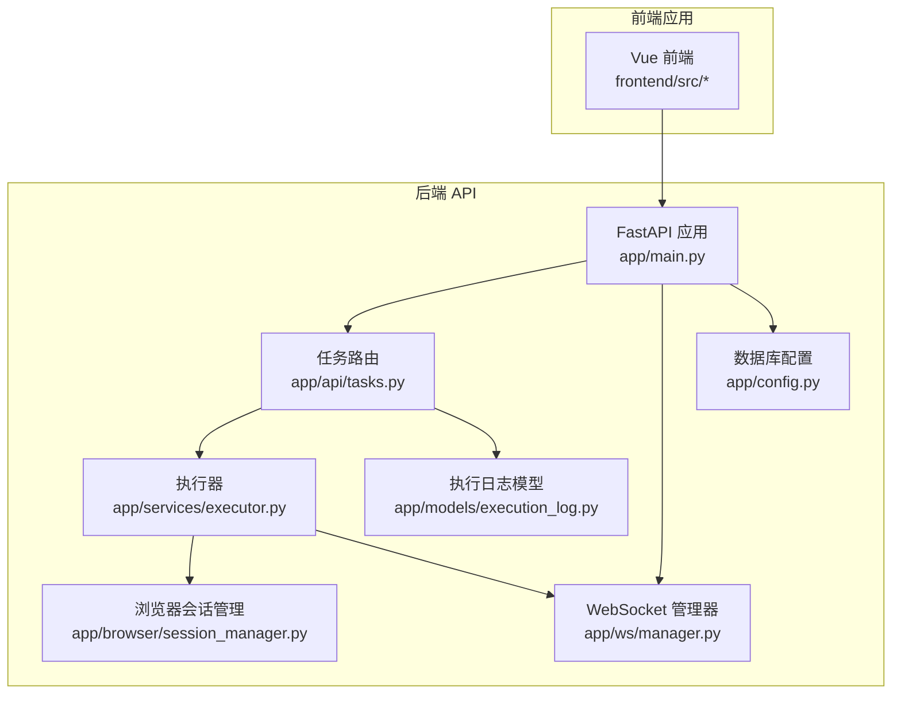
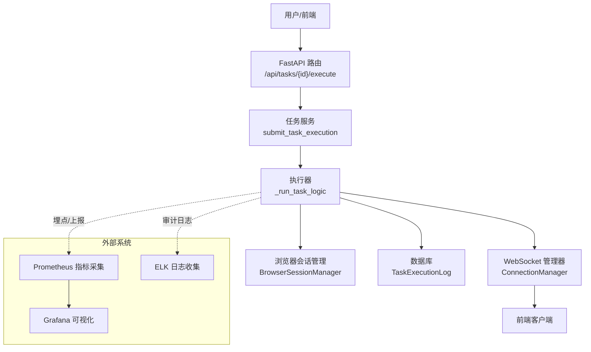
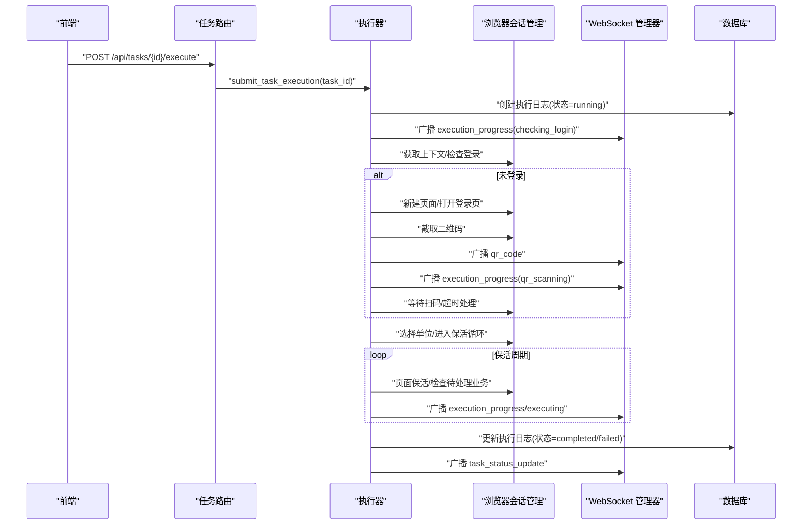
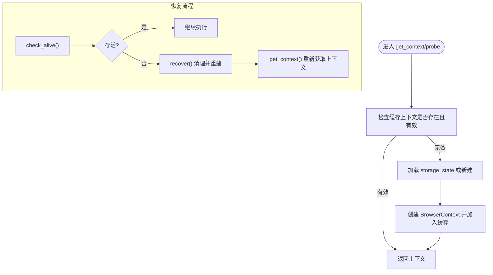
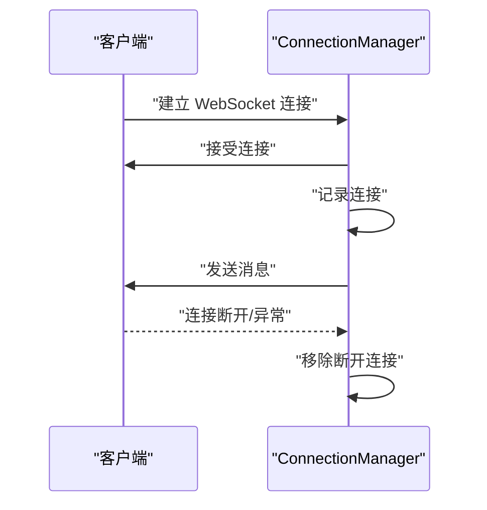
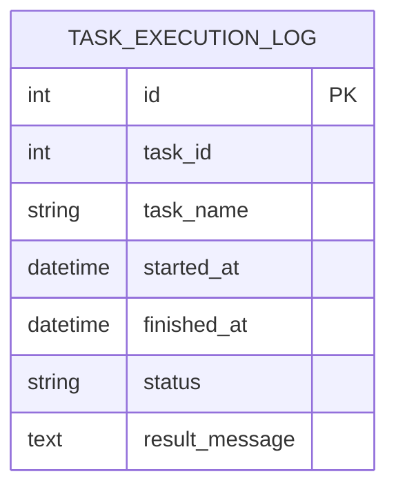
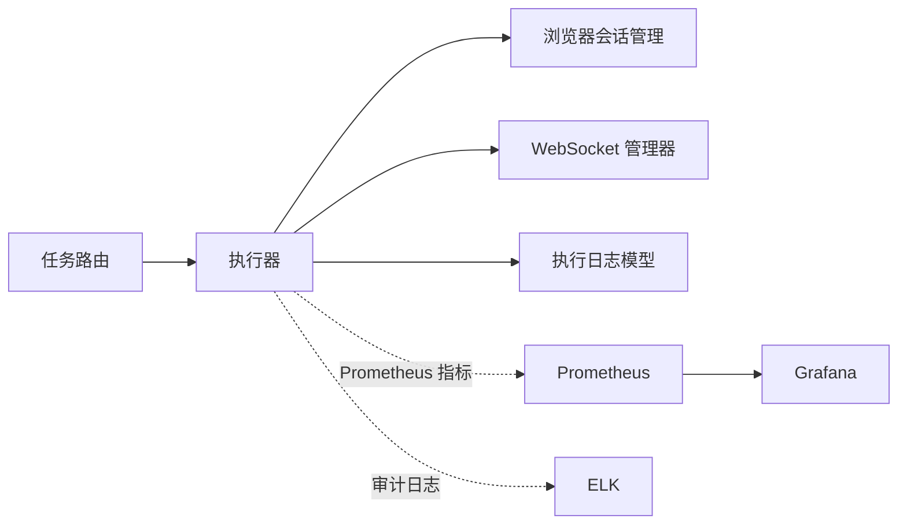

# 监控告警系统

<cite>
**本文引用的文件**
- [main.py](file://CCC_RPA_API/app/main.py)
- [config.py](file://CCC_RPA_API/app/config.py)
- [tasks.py](file://CCC_RPA_API/app/api/tasks.py)
- [executor.py](file://CCC_RPA_API/app/services/executor.py)
- [session_manager.py](file://CCC_RPA_API/app/browser/session_manager.py)
- [manager.py](file://CCC_RPA_API/app/ws/manager.py)
- [execution_log.py](file://CCC_RPA_API/app/models/execution_log.py)
- [project.md](file://project.md)
</cite>

## 目录
1. [简介](#简介)
2. [项目结构](#项目结构)
3. [核心组件](#核心组件)
4. [架构总览](#架构总览)
5. [详细组件分析](#详细组件分析)
6. [依赖分析](#依赖分析)
7. [性能考虑](#性能考虑)
8. [故障排查指南](#故障排查指南)
9. [结论](#结论)
10. [附录](#附录)

## 简介
本技术文档面向“监控告警系统”的落地实现，结合现有代码库与需求目标，系统化阐述如何基于 Prometheus 指标采集、Grafana 可视化、ELK 全链路审计与异常告警推送，构建覆盖 Pod/进程 CPU、内存、CDP 长连接数量、AI 推理耗时、会话崩溃次数、代理 IP 失效数量等多维度指标的监控体系。文档同时给出指标定义、告警阈值建议、通知策略与运维自动化思路，并通过序列图与流程图展示关键处理流程。

## 项目结构
本仓库包含后端 API 服务与前端应用两大主体，其中后端以 FastAPI 提供任务编排与执行能力，浏览器自动化由 Playwright 在专用线程中运行，WebSocket 负责实时状态广播；前端负责用户交互与可视化展示。整体结构如下：

图表来源
- [main.py:1-127](file://CCC_RPA_API/app/main.py#L1-L127)
- [tasks.py:1-76](file://CCC_RPA_API/app/api/tasks.py#L1-L76)
- [executor.py:1-319](file://CCC_RPA_API/app/services/executor.py#L1-L319)
- [session_manager.py:1-186](file://CCC_RPA_API/app/browser/session_manager.py#L1-L186)
- [manager.py:1-29](file://CCC_RPA_API/app/ws/manager.py#L1-L29)
- [config.py:1-22](file://CCC_RPA_API/app/config.py#L1-L22)
- [execution_log.py:1-17](file://CCC_RPA_API/app/models/execution_log.py#L1-L17)

章节来源
- [main.py:1-127](file://CCC_RPA_API/app/main.py#L1-L127)
- [tasks.py:1-76](file://CCC_RPA_API/app/api/tasks.py#L1-L76)
- [executor.py:1-319](file://CCC_RPA_API/app/services/executor.py#L1-L319)
- [session_manager.py:1-186](file://CCC_RPA_API/app/browser/session_manager.py#L1-L186)
- [manager.py:1-29](file://CCC_RPA_API/app/ws/manager.py#L1-L29)
- [config.py:1-22](file://CCC_RPA_API/app/config.py#L1-L22)
- [execution_log.py:1-17](file://CCC_RPA_API/app/models/execution_log.py#L1-L17)

## 核心组件
- 应用入口与健康检查：提供服务启动、数据库初始化、CORS 配置与健康探针。
- 任务编排与执行：通过执行器在专用线程池中调度 Playwright 任务，实现扫码登录、单位选择、业务执行与保活循环。
- 浏览器会话管理：集中管理各省份上下文，持久化 storage_state，提供存活检查与恢复能力。
- 实时状态广播：通过 WebSocket 向前端推送执行进度、二维码、错误与状态更新。
- 数据持久化：执行日志模型记录任务生命周期关键节点与结果。

章节来源
- [main.py:1-127](file://CCC_RPA_API/app/main.py#L1-L127)
- [executor.py:1-319](file://CCC_RPA_API/app/services/executor.py#L1-L319)
- [session_manager.py:1-186](file://CCC_RPA_API/app/browser/session_manager.py#L1-L186)
- [manager.py:1-29](file://CCC_RPA_API/app/ws/manager.py#L1-L29)
- [execution_log.py:1-17](file://CCC_RPA_API/app/models/execution_log.py#L1-L17)

## 架构总览
下图展示了从任务提交到浏览器自动化执行、状态广播与日志落库的整体流程，以及与外部系统（Prometheus/Grafana/ELK）的集成位置。

图表来源
- [tasks.py:47-52](file://CCC_RPA_API/app/api/tasks.py#L47-L52)
- [executor.py:317-319](file://CCC_RPA_API/app/services/executor.py#L317-L319)
- [session_manager.py:147-170](file://CCC_RPA_API/app/browser/session_manager.py#L147-L170)
- [manager.py:17-26](file://CCC_RPA_API/app/ws/manager.py#L17-L26)
- [execution_log.py:7-17](file://CCC_RPA_API/app/models/execution_log.py#L7-L17)

## 详细组件分析

### 组件一：任务执行与状态广播
- 关键职责
  - 提交任务执行，进入执行器逻辑。
  - 在专用线程中执行 Playwright 操作，避免与主事件循环冲突。
  - 通过 WebSocket 广播执行进度、二维码、错误与最终状态。
  - 记录执行日志，包含开始时间、结束时间、状态与结果描述。
- 关键流程
  - 初始化执行日志并入库。
  - 登录态检查与扫码登录流程。
  - 单位选择与业务执行。
  - 保活循环与业务触发处理。
  - 异常捕获与状态回滚，广播错误消息。
  - 清理等待器与数据库连接。

图表来源
- [tasks.py:47-52](file://CCC_RPA_API/app/api/tasks.py#L47-L52)
- [executor.py:78-314](file://CCC_RPA_API/app/services/executor.py#L78-L314)
- [session_manager.py:99-126](file://CCC_RPA_API/app/browser/session_manager.py#L99-L126)
- [manager.py:17-26](file://CCC_RPA_API/app/ws/manager.py#L17-L26)
- [execution_log.py:8-17](file://CCC_RPA_API/app/models/execution_log.py#L8-L17)

章节来源
- [tasks.py:47-52](file://CCC_RPA_API/app/api/tasks.py#L47-L52)
- [executor.py:78-314](file://CCC_RPA_API/app/services/executor.py#L78-L314)
- [execution_log.py:7-17](file://CCC_RPA_API/app/models/execution_log.py#L7-L17)

### 组件二：浏览器会话管理与恢复
- 关键职责
  - 在专用线程中启动 Playwright 与 Chromium，避免与 asyncio 冲突。
  - 按省份维护 BrowserContext，支持持久化 storage_state。
  - 提供存活检查与恢复能力，异常时重建会话。
  - 提供关闭全部上下文与浏览器的能力。
- 关键流程
  - 初始化专用工作线程与浏览器实例。
  - 获取或创建指定省份的上下文，必要时加载 storage_state。
  - 存活检查失败时，清空上下文并重建。
  - 关闭所有上下文与浏览器，释放资源。

图表来源
- [session_manager.py:99-126](file://CCC_RPA_API/app/browser/session_manager.py#L99-L126)
- [session_manager.py:147-170](file://CCC_RPA_API/app/browser/session_manager.py#L147-L170)

章节来源
- [session_manager.py:1-186](file://CCC_RPA_API/app/browser/session_manager.py#L1-L186)

### 组件三：WebSocket 状态广播
- 关键职责
  - 维护活跃连接集合，支持向所有连接广播消息。
  - 自动清理断开连接，保证广播可靠性。
- 关键流程
  - 新建连接并加入集合。
  - 广播消息给所有连接，捕获异常并移除断开连接。

图表来源
- [manager.py:10-26](file://CCC_RPA_API/app/ws/manager.py#L10-L26)

章节来源
- [manager.py:1-29](file://CCC_RPA_API/app/ws/manager.py#L1-L29)

### 组件四：数据库与执行日志
- 关键职责
  - 记录任务执行的生命周期关键节点与结果。
  - 支持按任务 ID 查询执行日志列表。
- 关键字段
  - 任务 ID、任务名称、开始/结束时间、状态、结果描述。

图表来源
- [execution_log.py:7-17](file://CCC_RPA_API/app/models/execution_log.py#L7-L17)

章节来源
- [execution_log.py:1-17](file://CCC_RPA_API/app/models/execution_log.py#L1-L17)

## 依赖分析
- 组件耦合
  - 执行器依赖浏览器会话管理器与 WebSocket 管理器，用于执行 Playwright 操作与状态广播。
  - 任务路由依赖执行器提交任务，执行器再依赖数据库模型进行日志记录。
- 外部依赖
  - Prometheus：通过应用内埋点或 Exporter 上报指标。
  - Grafana：接入 Prometheus 数据源，构建监控面板。
  - ELK：采集应用日志与审计事件，保留 90 天。

图表来源
- [tasks.py:47-52](file://CCC_RPA_API/app/api/tasks.py#L47-L52)
- [executor.py:317-319](file://CCC_RPA_API/app/services/executor.py#L317-L319)
- [session_manager.py:147-170](file://CCC_RPA_API/app/browser/session_manager.py#L147-L170)
- [manager.py:17-26](file://CCC_RPA_API/app/ws/manager.py#L17-L26)
- [execution_log.py:8-17](file://CCC_RPA_API/app/models/execution_log.py#L8-L17)

章节来源
- [tasks.py:1-76](file://CCC_RPA_API/app/api/tasks.py#L1-L76)
- [executor.py:1-319](file://CCC_RPA_API/app/services/executor.py#L1-L319)
- [session_manager.py:1-186](file://CCC_RPA_API/app/browser/session_manager.py#L1-L186)
- [manager.py:1-29](file://CCC_RPA_API/app/ws/manager.py#L1-L29)
- [execution_log.py:1-17](file://CCC_RPA_API/app/models/execution_log.py#L1-L17)

## 性能考虑
- 线程隔离与事件循环
  - Playwright 操作在专用线程执行，避免与 FastAPI 事件循环冲突，降低阻塞风险。
- 广播与连接管理
  - WebSocket 管理器自动清理断连，减少无效连接对系统资源的消耗。
- 保活与等待
  - 保活循环采用分段等待，便于快速响应取消信号，提升交互体验。
- 数据库与日志
  - 执行日志仅记录关键节点，避免冗余字段造成存储压力。

## 故障排查指南
- 会话崩溃与恢复
  - 现象：浏览器断连或页面异常。
  - 处理：调用恢复流程，清理旧上下文并重建，重新打开目标页面。
  - 触发点：保活循环中存活检查失败或显式调用恢复。
- 扫码登录超时
  - 现象：超过设定超时时间未扫码。
  - 处理：抛出超时异常，广播错误消息，终止任务。
- 用户取消执行
  - 现象：用户主动取消。
  - 处理：在等待阶段检测取消信号，提前结束任务。
- 数据库异常
  - 现象：更新任务状态或执行日志失败。
  - 处理：捕获异常并记录日志，不影响其他流程。

章节来源
- [executor.py:42-70](file://CCC_RPA_API/app/services/executor.py#L42-L70)
- [executor.py:133-140](file://CCC_RPA_API/app/services/executor.py#L133-L140)
- [executor.py:286-314](file://CCC_RPA_API/app/services/executor.py#L286-L314)
- [session_manager.py:157-170](file://CCC_RPA_API/app/browser/session_manager.py#L157-L170)

## 结论
本监控告警系统以现有代码库为基础，围绕任务执行、浏览器会话与状态广播三大核心模块，提供了可扩展的指标采集、可视化与告警推送框架。通过在执行器中埋点与上报、在 ELK 中采集审计日志，结合 Prometheus 与 Grafana 的可视化能力，能够有效支撑多维度监控与异常处置。后续可在应用内增加 Prometheus 客户端埋点与告警规则配置，完善运维自动化闭环。

## 附录

### 指标定义与采集建议
- Pod/进程 CPU、内存
  - 采集方式：Prometheus Node Exporter 或容器运行时指标。
  - 适用范围：集群资源健康度监控。
- CDP 长连接数量
  - 采集方式：自定义 Exporter 或应用内埋点（例如统计当前上下文数量）。
  - 适用范围：浏览器会话规模与稳定性评估。
- AI 推理耗时
  - 采集方式：在 AI 调用前后打点，计算耗时并上报直方图。
  - 适用范围：推理性能与容量规划。
- 会话崩溃次数
  - 采集方式：在恢复流程处打点计数。
  - 适用范围：浏览器稳定性与异常趋势分析。
- 代理 IP 失效数量
  - 采集方式：在代理请求失败处打点计数。
  - 适用范围：代理可用性与轮换策略优化。

章节来源
- [project.md:1141-1149](file://project.md#L1141-L1149)

### 告警规则与阈值建议
- 会话批量崩溃
  - 规则：单位时间内崩溃次数超过阈值。
  - 建议阈值：例如每分钟超过 N 次。
- AI 推理超时
  - 规则：P95/P99 耗时超过阈值。
  - 建议阈值：根据历史基线动态调整。
- 集群资源耗尽
  - 规则：CPU/内存使用率持续高于阈值。
  - 建议阈值：例如连续 5 分钟 > 80%。
- 代理 IP 批量失效
  - 规则：单位时间内失败率超过阈值。
  - 建议阈值：例如每分钟失败数 > M。

章节来源
- [project.md:1141-1149](file://project.md#L1141-L1149)

### 通知策略与运维自动化
- 通知渠道
  - 邮件、即时通讯、短信等，按级别分级通知。
- 运维自动化
  - 自动扩缩容、重启实例、切换代理 IP、降级策略等。

章节来源
- [project.md:1141-1149](file://project.md#L1141-L1149)