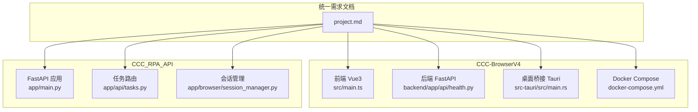
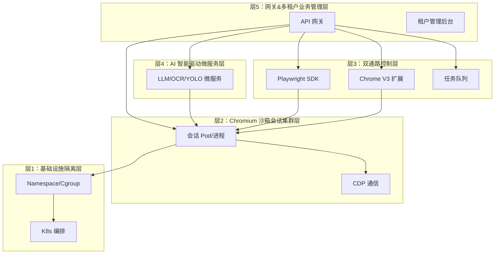
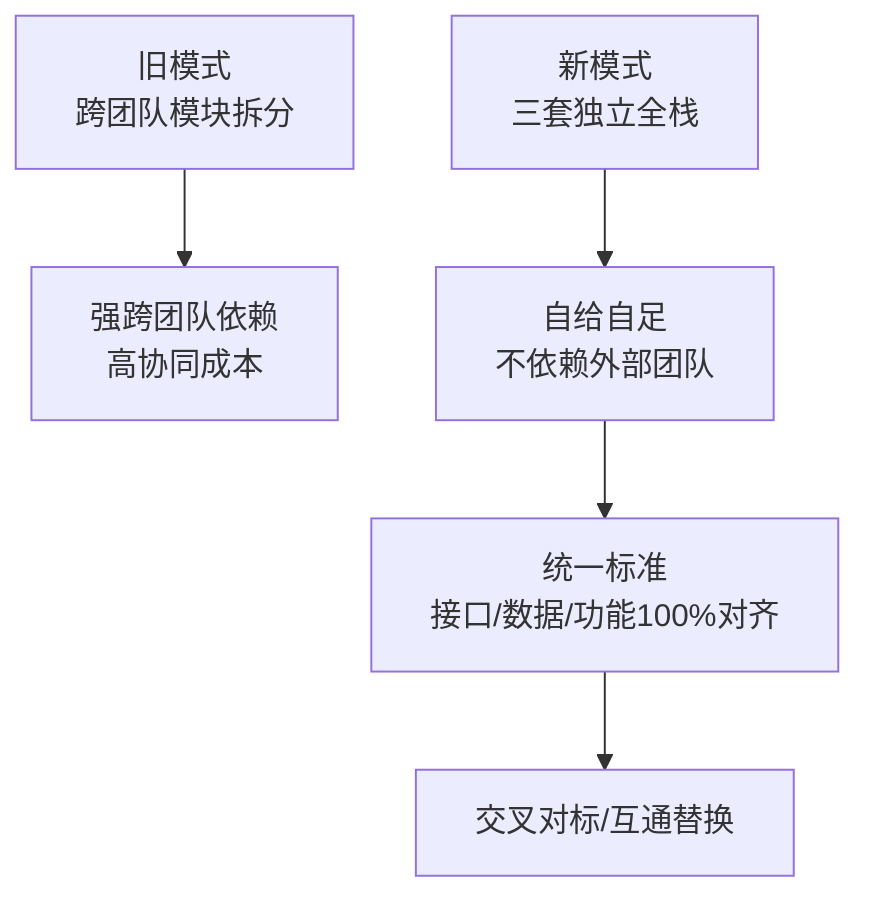
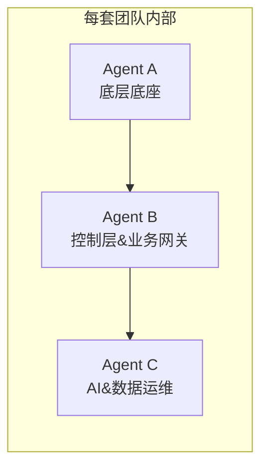
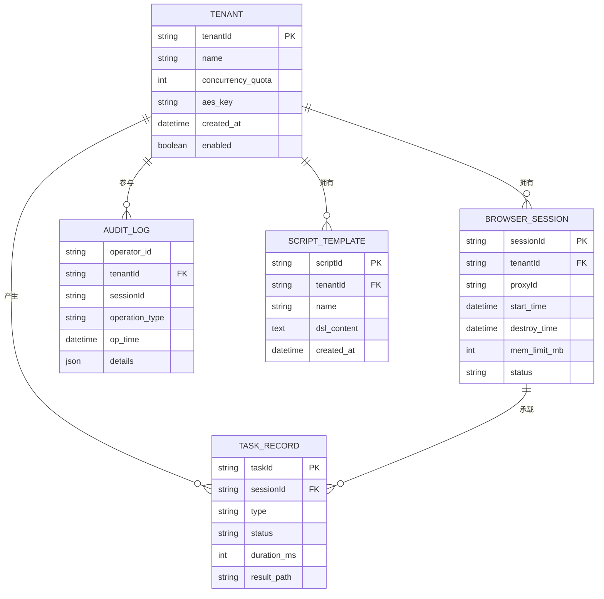
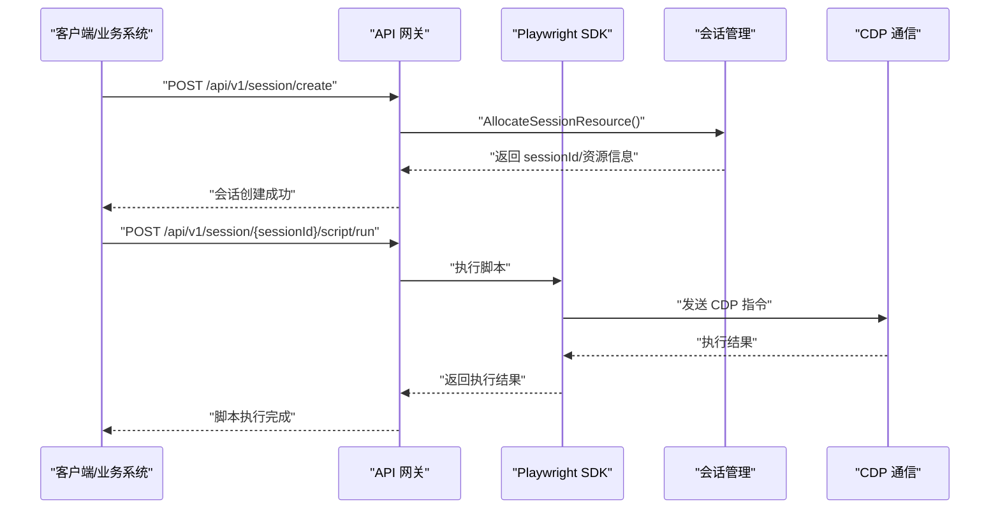
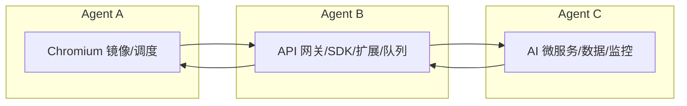

# 三套独立开发团队模式

<cite>
**本文引用的文件**   
- [project.md](file://project.md)
- [CCC-BrowserV4/backend/README.md](file://CCC-BrowserV4/backend/README.md)
- [CCC-RPA-API/app/main.py](file://CCC_RPA_API/app/main.py)
- [CCC-RPA-API/app/api/tasks.py](file://CCC_RPA_API/app/api/tasks.py)
- [CCC-RPA-API/app/browser/session_manager.py](file://CCC_RPA_API/app/browser/session_manager.py)
- [CCC-BrowserV4/backend/app/api/health.py](file://CCC-BrowserV4/backend/app/api/health.py)
- [CCC-BrowserV4/frontend/src/main.ts](file://CCC-BrowserV4/frontend/src/main.ts)
- [CCC-BrowserV4/frontend/package.json](file://CCC-BrowserV4/frontend/package.json)
- [CCC-BrowserV4/src-tauri/src/main.rs](file://CCC-BrowserV4/src-tauri/src/main.rs)
- [CCC-BrowserV4/src-tauri/src/commands.rs](file://CCC-BrowserV4/src-tauri/src/commands.rs)
- [CCC-BrowserV4/src-tauri/Cargo.toml](file://CCC-BrowserV4/src-tauri/Cargo.toml)
- [CCC-BrowserV4/docker-compose.yml](file://CCC-BrowserV4/docker-compose.yml)
</cite>

## 目录
1. [引言](#引言)
2. [项目结构](#项目结构)
3. [核心组件](#核心组件)
4. [架构总览](#架构总览)
5. [详细组件分析](#详细组件分析)
6. [依赖分析](#依赖分析)
7. [性能考虑](#性能考虑)
8. [故障排查指南](#故障排查指南)
9. [结论](#结论)
10. [附录](#附录)

## 引言
本文件面向商用级 AI 浏览器系统的开发团队模式说明，围绕“三套对等、完全独立、完整全栈开发团队”的强制新模式展开，系统对比废弃的跨团队模块拆分旧模式与现行统一标准的新模式，明确每套团队内部三个子 Agent 的职责边界与协作方式，并解释该模式如何提升开发效率、降低跨团队依赖、提升系统质量。

- 新模式要点
  - 三套团队（Trae/Workbuddy/Codebuddy）完全独立，每套自建完整五层架构，三套系统接口、数据、功能规范 100% 统一，可交叉对标、互通替换。
  - 每套团队内部拆分三个子 Agent：Agent A（底层底座）、Agent B（控制层&业务网关）、Agent C（AI&数据运维），仅在团队内部生效。
  - 废弃旧模式：跨团队拆分模块、分工开发底层/控制层/AI 层，导致强跨团队依赖与高协同成本。

**章节来源**
- [project.md:113-130](file://project.md#L113-L130)

## 项目结构
仓库包含两套主要工程与一份统一需求文档：
- CCC-BrowserV4：包含后端 FastAPI、前端 Vue3、Tauri 桌面桥接与 Docker Compose。
- CCC_RPA_API：包含 FastAPI 后端、Playwright 会话管理、任务执行与 WebSocket 管理。
- project.md：统一的开发团队模式、接口契约、数据层设计、验收标准等。

**图表来源**
- [project.md:1-20](file://project.md#L1-L20)
- [CCC-BrowserV4/frontend/src/main.ts:1-23](file://CCC-BrowserV4/frontend/src/main.ts#L1-L23)
- [CCC-BrowserV4/backend/app/api/health.py:1-18](file://CCC-BrowserV4/backend/app/api/health.py#L1-L18)
- [CCC-BrowserV4/src-tauri/src/main.rs:1-29](file://CCC-BrowserV4/src-tauri/src/main.rs#L1-L29)
- [CCC-BrowserV4/docker-compose.yml:1-21](file://CCC-BrowserV4/docker-compose.yml#L1-L21)
- [CCC_RPA_API/app/main.py:1-127](file://CCC_RPA_API/app/main.py#L1-L127)
- [CCC_RPA_API/app/api/tasks.py:1-76](file://CCC_RPA_API/app/api/tasks.py#L1-L76)
- [CCC_RPA_API/app/browser/session_manager.py:1-183](file://CCC_RPA_API/app/browser/session_manager.py#L1-L183)

**章节来源**
- [project.md:1-20](file://project.md#L1-L20)
- [CCC-BrowserV4/frontend/src/main.ts:1-23](file://CCC-BrowserV4/frontend/src/main.ts#L1-L23)
- [CCC-BrowserV4/backend/app/api/health.py:1-18](file://CCC-BrowserV4/backend/app/api/health.py#L1-L18)
- [CCC-BrowserV4/src-tauri/src/main.rs:1-29](file://CCC-BrowserV4/src-tauri/src/main.rs#L1-L29)
- [CCC-BrowserV4/docker-compose.yml:1-21](file://CCC-BrowserV4/docker-compose.yml#L1-L21)
- [CCC_RPA_API/app/main.py:1-127](file://CCC_RPA_API/app/main.py#L1-L127)
- [CCC_RPA_API/app/api/tasks.py:1-76](file://CCC_RPA_API/app/api/tasks.py#L1-L76)
- [CCC_RPA_API/app/browser/session_manager.py:1-183](file://CCC_RPA_API/app/browser/session_manager.py#L1-L183)

## 核心组件
- 统一开发团队模式
  - 三套团队完全独立，每套自建完整五层架构，三套系统接口、数据、功能规范 100% 统一，可交叉对标、互通替换。
  - 每套团队内部拆分三个子 Agent：Agent A（底层底座）、Agent B（控制层&业务网关）、Agent C（AI&数据运维），仅在团队内部生效。
- 统一接口契约
  - 对外 RESTful/WS API 网关规范、内部 GRPC 微服务通信规范、Chrome 扩展↔调度网关 WS 消息协议、底层 CDP 与第三方对接标准。
- 统一数据层设计
  - PostgreSQL 核心数据表、Redis 缓存 Key 统一设计、数据加密存储标准。
- 统一非功能需求
  - 性能、安全、可靠性、兼容性、可运维交付标准。
- 统一验收标准
  - 沙箱隔离、自动化&扩展、AI 能力、多租户、集群性能等验收标准。

**章节来源**
- [project.md:7-130](file://project.md#L7-L130)
- [project.md:445-560](file://project.md#L445-L560)

## 架构总览
三套团队的五层标准分层架构完全一致，自上而下为：
- 层 5：网关&多租户业务管理层（API 网关、租户管理、RBAC、计费统计、Web 管理后台、监控告警面板）
- 层 4：AI 智能驱动微服务层（LLM 决策引擎、YOLO 视觉识别、PaddleOCR、结构化抽取、会话独立向量记忆库）
- 层 3：双通路控制层（Playwright 自动化脚本通路、Chrome V3 扩展可视化通路、双向消息桥接、任务调度队列）
- 层 2：Chromium 沙箱会话集群层（单会话 Pod/进程实例、独立 UserData、CDP 通信、指纹伪装、代理绑定、会话调度中心）
- 层 1：基础设施隔离层（K8s 容器编排、Linux Namespace/Cgroup、CPU/内存资源硬限制、独立临时存储隔离）

**图表来源**
- [project.md:173-188](file://project.md#L173-L188)

**章节来源**
- [project.md:173-188](file://project.md#L173-L188)

## 详细组件分析

### 开发团队模式对比：旧模式 vs 新模式
- 废弃旧模式
  - 三团队拆分模块、分工开发底层/控制层/AI 层，存在强跨团队依赖，协同成本高。
- 现行强制新模式
  - 三套对等、完全独立、完整全栈开发团队；
  - 每套团队内部自行拆分 3 个子 Agent 完成全部五层架构，全程自给自足；
  - 每套最终产出一套完整可独立部署、商用交付的 AI 浏览器系统；
  - 三套仅共享统一标准，开发完成后进行横向功能、性能、安全对标测试；
  - 内部分工仅在单团队内部生效，三套之间无模块协作。

**图表来源**
- [project.md:115-130](file://project.md#L115-L130)

**章节来源**
- [project.md:115-130](file://project.md#L115-L130)

### 每套团队内部三个子 Agent 的分工建议
- Agent A（底层底座）
  - 职责：Chromium 镜像、Dockerfile、K8s 编排、会话调度、进程/容器沙箱隔离、Playwright Core CDP 底层封装、资源管控。
  - 交付：可运行单机/集群沙箱 Demo，支持创建完全隔离浏览器会话。
- Agent B（控制层&业务网关）
  - 职责：API 网关、Node/Python 双语言 Playwright SDK、BullMQ 任务队列、Chrome V3 扩展、租户管理后台、RBAC 权限、脚本引擎。
  - 交付：可远程脚本操控、浏览器可视化人工操作完整 Demo。
- Agent C（AI&数据运维）
  - 职责：Ollama LLM Agent、YOLO 视觉检测、PaddleOCR、PostgreSQL 数据表、Redis 缓存、AES 加密存储、Prometheus/Grafana 监控、ELK 审计日志、异常容错自愈。
  - 交付：支持自然语言驱动浏览器、页面结构化数据抽取完整 AI 能力。

**图表来源**
- [project.md:131-137](file://project.md#L131-L137)

**章节来源**
- [project.md:131-137](file://project.md#L131-L137)

### 统一接口契约与数据层设计
- 对外 RESTful/WS API 网关规范
  - 基础根路径：/api/v1，全部接口强制 HTTPS；统一鉴权请求头：Authorization: Bearer {租户Token}。
  - 核心接口清单：会话创建、会话关闭、脚本执行、AI 指令、截图获取、会话实时通道。
- 内部 GRPC 微服务通信规范
  - AI 推理 GRPC 服务方法：ParsePageTask、ExtractStructData、OCRImage。
  - 调度中心 GRPC 服务方法：AllocateSessionResource、DestroySession。
- Chrome 扩展↔调度网关 WS 消息协议
  - 统一 JSON 消息结构，固定字段不可删减：msgType、sessionId、data、timestamp。
- 统一数据层设计
  - PostgreSQL 核心数据表：tenant、browser_session、task_record、audit_log、script_template。
  - Redis 缓存 Key 统一设计：会话状态、任务队列、接口限流计数。
  - 数据加密存储标准：会话快照文件 AES-256-CBC 加密，密钥存储在 tenant 表独立字段。

**图表来源**
- [project.md:560-587](file://project.md#L560-L587)

**章节来源**
- [project.md:445-560](file://project.md#L445-L560)

### 关键流程示例：会话创建与脚本执行
- 会话创建
  - 客户端/业务系统调用 /api/v1/session/create，网关鉴权后调用调度中心分配资源，创建 Pod/进程并返回 sessionId。
- 脚本执行
  - 客户端调用 /api/v1/session/{sessionId}/script/run，网关将请求路由到 SDK，SDK 通过 CDP 控制会话执行脚本，WS 实时推送执行日志与截图。

**图表来源**
- [project.md:447-462](file://project.md#L447-L462)
- [project.md:311-324](file://project.md#L311-L324)

**章节来源**
- [project.md:447-462](file://project.md#L447-L462)
- [project.md:311-324](file://project.md#L311-L324)

### 代表性实现文件概览
- CCC-BrowserV4
  - 健康检查接口：/api/v1/health，用于检查数据库连接状态。
  - 前端入口：Vue3 应用初始化，注册 Pinia、路由、Element Plus。
  - Tauri 桌面桥接：命令注册（设备 ID、生成 token、打开外部浏览器、登录回调服务器）。
  - Docker Compose：一键启动 MySQL 容器，便于本地开发与测试。
- CCC_RPA_API
  - FastAPI 应用：注册路由（认证、任务、租户、设备），启动时创建表结构并插入初始数据。
  - 任务路由：提供任务列表、创建、查询、更新、删除、执行、日志查询等接口。
  - 会话管理：基于 Playwright 的专用工作线程管理浏览器上下文，持久化 storage_state，支持恢复与关闭。

**章节来源**
- [CCC-BrowserV4/backend/app/api/health.py:1-18](file://CCC-BrowserV4/backend/app/api/health.py#L1-L18)
- [CCC-BrowserV4/frontend/src/main.ts:1-23](file://CCC-BrowserV4/frontend/src/main.ts#L1-L23)
- [CCC-BrowserV4/src-tauri/src/main.rs:1-29](file://CCC-BrowserV4/src-tauri/src/main.rs#L1-L29)
- [CCC-BrowserV4/src-tauri/src/commands.rs:1-92](file://CCC-BrowserV4/src-tauri/src/commands.rs#L1-L92)
- [CCC-BrowserV4/docker-compose.yml:1-21](file://CCC-BrowserV4/docker-compose.yml#L1-L21)
- [CCC_RPA_API/app/main.py:1-127](file://CCC_RPA_API/app/main.py#L1-L127)
- [CCC_RPA_API/app/api/tasks.py:1-76](file://CCC_RPA_API/app/api/tasks.py#L1-L76)
- [CCC_RPA_API/app/browser/session_manager.py:1-183](file://CCC_RPA_API/app/browser/session_manager.py#L1-L183)

## 依赖分析
- 组件耦合与内聚
  - 新模式下，每套团队内部三个子 Agent 在团队内高度内聚，跨团队无模块耦合，降低跨团队依赖与协调成本。
- 外部依赖与集成点
  - 统一接口契约与数据层设计确保三套系统可互通替换；外部依赖（代理池、GPU 推理、支付网关）仅保留标准对接接口，不纳入三套团队自研范围。
- 潜在循环依赖
  - 通过严格的分层与子 Agent 边界划分，避免循环依赖；各子系统通过统一 API/WS/GRPC 交互。

**图表来源**
- [project.md:131-137](file://project.md#L131-L137)

**章节来源**
- [project.md:131-137](file://project.md#L131-L137)

## 性能考虑
- 会话创建耗时：集群 K8s 环境≤3s，单机进程模式≤1s。
- AI 单条自然语言指令推理响应耗时：7B 本地模型≤1.5s。
- 单集群稳定并发会话最低支持 200 个，长期运行无持续内存泄漏。
- API 网关单接口 QPS≥100，WebSocket 长连接同时在线≥1000 路。
- CDP 页面操作指令执行延迟≤200ms。

**章节来源**
- [project.md:504-517](file://project.md#L504-L517)

## 故障排查指南
- 健康检查
  - 使用 /api/v1/health 接口检查数据库连接状态，定位后端服务可用性。
- Playwright 会话问题
  - 通过会话管理器的 recover/close_all/close_context 等方法进行恢复与清理，避免会话泄漏。
- 登录回调与桌面桥接
  - Tauri 命令 start_login_callback_server 启动本地回调服务器，监听登录成功回调并通过事件通知前端。
- 数据库与容器
  - 使用 docker-compose 一键启动 MySQL，检查容器状态与日志，确认数据库可用性。

**章节来源**
- [CCC-BrowserV4/backend/app/api/health.py:1-18](file://CCC-BrowserV4/backend/app/api/health.py#L1-L18)
- [CCC_RPA_API/app/browser/session_manager.py:143-183](file://CCC_RPA_API/app/browser/session_manager.py#L143-L183)
- [CCC-BrowserV4/src-tauri/src/commands.rs:41-92](file://CCC-BrowserV4/src-tauri/src/commands.rs#L41-L92)
- [CCC-BrowserV4/backend/README.md:24-49](file://CCC-BrowserV4/backend/README.md#L24-L49)

## 结论
新模式以“三套独立全栈团队 + 内部三个子 Agent”为核心，通过统一标准、分层架构与严格的边界划分，显著降低跨团队依赖与协同成本，提升开发效率与系统质量。三套系统在功能、接口、数据、部署层面完全对齐，具备交叉对标与互通替换能力，满足商用级 AI 浏览器的强隔离、高性能、高可靠要求。

## 附录
- 开发阶段与交付物
  - 阶段 1：底层沙箱底座（14 天）
  - 阶段 2：控制层与扩展（18 天）
  - 阶段 3：AI 微服务、数据、监控（15 天）
  - 阶段 4：全系统联调、压力测试、安全加固（7 天）
  - 每套团队最终交付：SRS、架构图、数据库 ER 图、OpenAPI 文档、底层底座、控制层、AI&数据运维、运维配套。

**章节来源**
- [project.md:588-640](file://project.md#L588-L640)