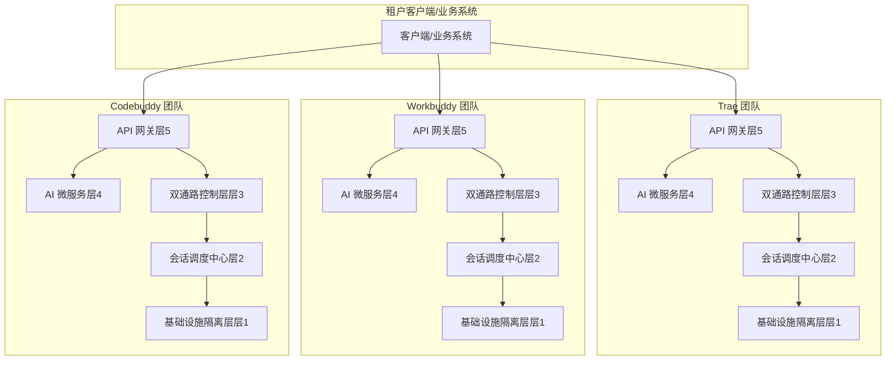
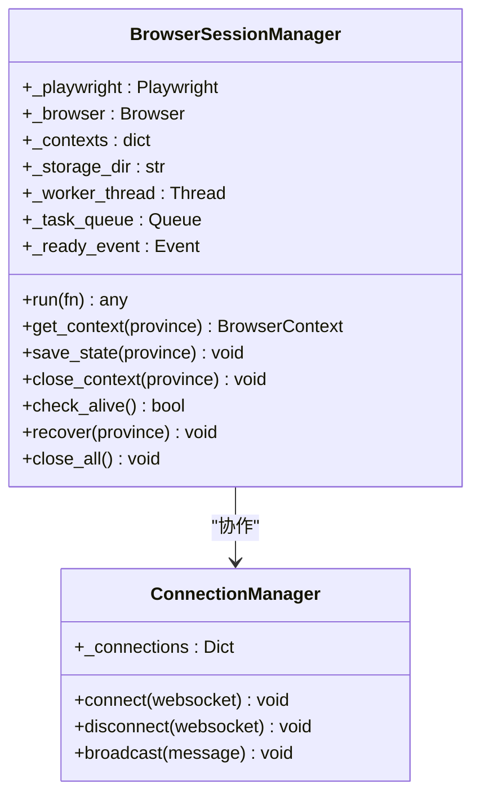
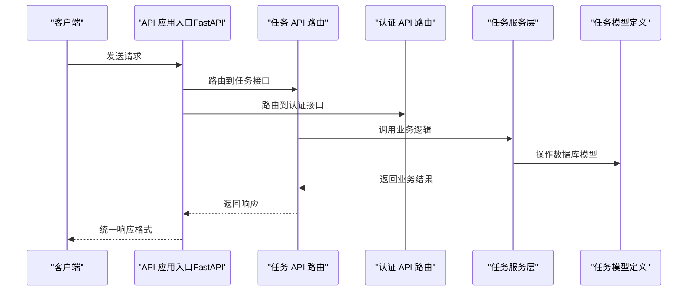
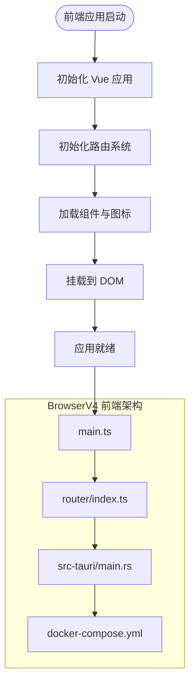
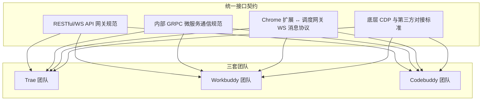
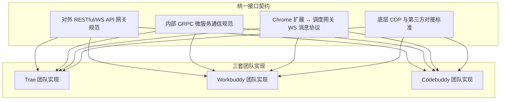

# 团队组织架构

<cite>
**本文引用的文件**
- [项目需求规格说明书（SRS V1.1）](file://project.md)
- [API 应用入口（FastAPI）](file://CCC_RPA_API/app/main.py)
- [任务 API 路由](file://CCC_RPA_API/app/api/tasks.py)
- [认证 API 路由](file://CCC_RPA_API/app/api/auth.py)
- [任务模型定义](file://CCC_RPA_API/app/models/task.py)
- [任务服务层](file://CCC_RPA_API/app/services/task.py)
- [浏览器会话管理器](file://CCC_RPA_API/app/browser/session_manager.py)
- [WebSocket 连接管理器](file://CCC_RPA_API/app/ws/manager.py)
- [健康检查接口（BrowserV4 后端）](file://CCC-BrowserV4/backend/app/api/health.py)
- [BrowserV4 后端说明](file://CCC-BrowserV4/backend/README.md)
- [BrowserV4 前端入口](file://CCC-BrowserV4/frontend/src/main.ts)
- [BrowserV4 路由配置](file://CCC-BrowserV4/frontend/src/router/index.ts)
- [BrowserV4 Tauri 入口](file://CCC-BrowserV4/src-tauri/src/main.rs)
- [BrowserV4 Docker Compose](file://CCC-BrowserV4/docker-compose.yml)
</cite>

## 目录
1. [引言](#引言)
2. [项目结构](#项目结构)
3. [核心组件](#核心组件)
4. [架构概览](#架构概览)
5. [详细组件分析](#详细组件分析)
6. [依赖分析](#依赖分析)
7. [性能考虑](#性能考虑)
8. [故障排除指南](#故障排除指南)
9. [结论](#结论)
10. [附录](#附录)

## 引言
本文件面向三套独立开发团队（Trae、Workbuddy、Codebuddy），提供组织架构与职责划分说明。根据项目需求规格说明书（SRS V1.1），三套团队为对等、完全独立的全栈开发团队，每套团队内部按三层 Agent 划分职责，对外独立交付完整产品。三套系统在接口、数据、功能规范上实现100%统一，并通过交叉对标与互通替换提升整体质量。

- 三套团队对等地位与完全独立性：每套团队独立完成整套商用 AI 浏览器全栈开发，不依赖其余两套团队任何代码、服务、模块；所有功能、接口、数据结构、隔离规则、加密标准、部署规范全局统一，三套成品可互相替换、交叉调用、横向性能/安全对标。
- 团队内部三层 Agent 职责划分（仅内部生效）：
  - Agent A（底层底座）：Chromium 镜像、Dockerfile、K8s 编排、会话调度、进程/容器沙箱隔离、Playwright Core CDP 底层封装、资源管控
  - Agent B（控制层&业务网关）：API 网关、Node/Python 双语言 Playwright SDK、BullMQ 任务队列、Chrome V3 扩展、租户管理后台、RBAC 权限、脚本引擎
  - Agent C（AI&数据运维）：Ollama LLM Agent、YOLO 视觉检测、PaddleOCR、PostgreSQL 数据表、Redis 缓存、AES 加密存储、Prometheus/Grafana 监控、ELK 审计日志、异常容错自愈

**章节来源**
- [项目需求规格说明书（SRS V1.1）: 7-20:7-20](file://project.md#L7-L20)
- [项目需求规格说明书（SRS V1.1）: 113-138:113-138](file://project.md#L113-L138)

## 项目结构
仓库包含两套主要实现与一份统一的需求规格文档：
- CCC_RPA_API：基于 FastAPI 的后端服务，包含认证、任务管理、浏览器会话管理、WebSocket 管理等模块
- CCC-BrowserV4：基于 Vue3 + Tauri 的前端应用，包含健康检查接口、路由配置、设备管理等
- project.md：统一的三套团队开发规范与接口契约

```mermaid
graph TB
subgraph "统一需求与规范"
SRS["项目需求规格说明书SRS V1.1"]
end
subgraph "Trae 团队"
T_API["API 应用入口FastAPI"]
T_TASKS["任务 API 路由"]
T_AUTH["认证 API 路由"]
T_MODEL["任务模型定义"]
T_SERVICE["任务服务层"]
T_BROWSER["浏览器会话管理器"]
T_WS["WebSocket 连接管理器"]
end
subgraph "Workbuddy 团队"
W_API["API 应用入口FastAPI"]
W_TASKS["任务 API 路由"]
W_AUTH["认证 API 路由"]
W_MODEL["任务模型定义"]
W_SERVICE["任务服务层"]
W_BROWSER["浏览器会话管理器"]
W_WS["WebSocket 连接管理器"]
end
subgraph "Codebuddy 团队"
C_API["API 应用入口FastAPI"]
C_TASKS["任务 API 路由"]
C_AUTH["认证 API 路由"]
C_MODEL["任务模型定义"]
C_SERVICE["任务服务层"]
C_BROWSER["浏览器会话管理器"]
C_WS["WebSocket 连接管理器"]
end
SRS --> T_API
SRS --> W_API
SRS --> C_API
```

**图表来源**
- [项目需求规格说明书（SRS V1.1）: 30-66:30-66](file://project.md#L30-L66)
- [API 应用入口（FastAPI）: 1-127:1-127](file://CCC_RPA_API/app/main.py#L1-L127)
- [任务 API 路由: 1-76:1-76](file://CCC_RPA_API/app/api/tasks.py#L1-L76)
- [认证 API 路由: 1-24:1-24](file://CCC_RPA_API/app/api/auth.py#L1-L24)
- [任务模型定义: 1-25:1-25](file://CCC_RPA_API/app/models/task.py#L1-L25)
- [任务服务层: 1-157:1-157](file://CCC_RPA_API/app/services/task.py#L1-L157)
- [浏览器会话管理器: 1-186:1-186](file://CCC_RPA_API/app/browser/session_manager.py#L1-L186)
- [WebSocket 连接管理器: 1-29:1-29](file://CCC_RPA_API/app/ws/manager.py#L1-L29)

**章节来源**
- [项目需求规格说明书（SRS V1.1）: 30-66:30-66](file://project.md#L30-L66)
- [API 应用入口（FastAPI）: 1-127:1-127](file://CCC_RPA_API/app/main.py#L1-L127)

## 核心组件
三套团队的核心组件遵循统一的五层架构与三层 Agent 划分：

- 层 5：网关&多租户业务管理层（Agent B）
  - 统一 API 入口、租户管理、RBAC 权限、计费统计、Web 管理后台、监控告警面板
- 层 4：AI 智能驱动微服务层（Agent C）
  - LLM 决策引擎、YOLO 视觉识别、PaddleOCR、结构化抽取、会话独立向量记忆库
- 层 3：双通路控制层（Agent B）
  - Playwright 自动化脚本通路、Chrome V3 扩展可视化通路、双向消息桥接、任务调度队列
- 层 2：Chromium 沙箱会话集群层（Agent A）
  - 单会话 Pod / 进程实例、独立 UserData、CDP 通信、指纹伪装、代理绑定、会话调度中心
- 层 1：基础设施隔离层（Agent A）
  - K8s 容器编排、Linux Namespace/Cgroup、CPU/内存资源硬限制、独立临时存储隔离

**章节来源**
- [项目需求规格说明书（SRS V1.1）: 173-188:173-188](file://project.md#L173-L188)
- [项目需求规格说明书（SRS V1.1）: 30-41:30-41](file://project.md#L30-L41)

## 架构概览
三套团队的架构遵循统一的五层分层设计，每套团队内部三层 Agent 各司其职，对外提供完全一致的接口与功能。

**图表来源**
- [项目需求规格说明书（SRS V1.1）: 173-188:173-188](file://project.md#L173-L188)
- [项目需求规格说明书（SRS V1.1）: 445-503:445-503](file://project.md#L445-L503)

## 详细组件分析

### 组件 A 分析（底层底座）
Agent A 负责 Chromium 镜像、Docker/K8s 编排、会话调度、进程/容器沙箱隔离、Playwright Core CDP 底层封装、资源管控。在现有代码中，BrowserV4 后端提供了健康检查接口与数据库连接示例，展示了统一的基础设施层能力。

**图表来源**
- [浏览器会话管理器: 10-186:10-186](file://CCC_RPA_API/app/browser/session_manager.py#L10-L186)
- [WebSocket 连接管理器: 5-29:5-29](file://CCC_RPA_API/app/ws/manager.py#L5-L29)

**章节来源**
- [浏览器会话管理器: 10-186:10-186](file://CCC_RPA_API/app/browser/session_manager.py#L10-L186)
- [WebSocket 连接管理器: 5-29:5-29](file://CCC_RPA_API/app/ws/manager.py#L5-L29)
- [健康检查接口（BrowserV4 后端）: 10-18:10-18](file://CCC-BrowserV4/backend/app/api/health.py#L10-L18)

### 组件 B 分析（控制层&业务网关）
Agent B 负责 API 网关、SDK、任务队列、扩展、租户后台、权限控制、脚本引擎。在现有代码中，FastAPI 应用展示了统一的路由组织与中间件配置，任务与认证 API 路由体现了控制层的职责边界。

**图表来源**
- [API 应用入口（FastAPI）: 12-28:12-28](file://CCC_RPA_API/app/main.py#L12-L28)
- [任务 API 路由: 10-76:10-76](file://CCC_RPA_API/app/api/tasks.py#L10-L76)
- [认证 API 路由: 7-24:7-24](file://CCC_RPA_API/app/api/auth.py#L7-L24)
- [任务服务层: 44-157:44-157](file://CCC_RPA_API/app/services/task.py#L44-L157)
- [任务模型定义: 8-25:8-25](file://CCC_RPA_API/app/models/task.py#L8-L25)

**章节来源**
- [API 应用入口（FastAPI）: 12-28:12-28](file://CCC_RPA_API/app/main.py#L12-L28)
- [任务 API 路由: 10-76:10-76](file://CCC_RPA_API/app/api/tasks.py#L10-L76)
- [认证 API 路由: 7-24:7-24](file://CCC_RPA_API/app/api/auth.py#L7-L24)
- [任务服务层: 44-157:44-157](file://CCC_RPA_API/app/services/task.py#L44-L157)
- [任务模型定义: 8-25:8-25](file://CCC_RPA_API/app/models/task.py#L8-L25)

### 组件 C 分析（AI&数据运维）
Agent C 负责 AI 推理服务、视觉 OCR、数据库、缓存、监控、日志、容错。在现有代码中，BrowserV4 前端展示了基于 Vue3 + Tauri 的桌面应用架构，体现了统一的前端与后端交互模式。

**图表来源**
- [BrowserV4 前端入口: 1-23:1-23](file://CCC-BrowserV4/frontend/src/main.ts#L1-L23)
- [BrowserV4 路由配置: 1-63:1-63](file://CCC-BrowserV4/frontend/src/router/index.ts#L1-L63)
- [BrowserV4 Tauri 入口: 7-29:7-29](file://CCC-BrowserV4/src-tauri/src/main.rs#L7-L29)
- [BrowserV4 Docker Compose: 1-21:1-21](file://CCC-BrowserV4/docker-compose.yml#L1-L21)

**章节来源**
- [BrowserV4 前端入口: 1-23:1-23](file://CCC-BrowserV4/frontend/src/main.ts#L1-L23)
- [BrowserV4 路由配置: 1-63:1-63](file://CCC-BrowserV4/frontend/src/router/index.ts#L1-L63)
- [BrowserV4 Tauri 入口: 7-29:7-29](file://CCC-BrowserV4/src-tauri/src/main.rs#L7-L29)
- [BrowserV4 Docker Compose: 1-21:1-21](file://CCC-BrowserV4/docker-compose.yml#L1-L21)

### 概念性概览
三套团队通过统一的接口契约与数据规范实现互通替换，形成横向对标与质量提升机制。

[此图为概念性示意，不直接映射具体源文件，故无图表来源]

## 依赖分析
三套团队在接口契约层面保持完全一致，确保互通替换与交叉对标的有效性。

**图表来源**
- [项目需求规格说明书（SRS V1.1）: 445-503:445-503](file://project.md#L445-L503)

**章节来源**
- [项目需求规格说明书（SRS V1.1）: 445-503:445-503](file://project.md#L445-L503)

## 性能考虑
- 会话创建耗时：集群 K8s 环境≤3s，单机进程模式≤1s
- AI 单条自然语言指令推理响应耗时：7B 本地模型≤1.5s
- 单集群稳定并发会话最低支持 200 个，长期运行无持续内存泄漏
- API 网关单接口 QPS≥100，WebSocket 长连接同时在线≥1000 路
- CDP 页面操作指令执行延迟≤200ms

**章节来源**
- [项目需求规格说明书（SRS V1.1）: 504-517:504-517](file://project.md#L504-L517)

## 故障排除指南
- 风险：会话内存持续泄漏
  - 处理方案：硬内存阈值自动销毁会话、会话强制超时回收、定时清理 Chromium 磁盘缓存、内存指标异常告警
- 风险：网站识别自动化浏览器拦截访问
  - 处理方案：全维度随机指纹、抹平 CDP 自动化特征、模拟真人鼠标轨迹、随机输入间隔
- 风险：租户会话数据跨沙箱泄露、Cookie 互通
  - 处理方案：容器完全隔离文件系统、禁用全局磁盘缓存、会话销毁递归删除全部 UserData 目录
- 风险：集群并发过高，API 网关拥堵雪崩
  - 处理方案：网关多副本负载均衡、任务队列削峰限流、租户独立并发配额限制
- 风险：AI 推理延迟过高，页面操作卡顿
  - 处理方案：AI 服务多副本集群、本地 GPU 推理加速、通用操作指令模板预缓存

**章节来源**
- [项目需求规格说明书（SRS V1.1）: 641-657:641-657](file://project.md#L641-L657)

## 结论
三套独立开发团队（Trae、Workbuddy、Codebuddy）在严格的统一规范约束下，通过三层 Agent 的明确职责划分与完全独立的开发模式，实现了100%统一的接口、数据与功能规范。每套团队均可独立交付完整的商用级 AI 浏览器系统，并通过交叉对标与互通替换机制持续提升系统质量与稳定性。

## 附录

### 团队协作建议
- 内部协作建议：每套团队内部分 3 类子 Agent 划分内部任务，仅团队内生效，对外独立交付完整成品
- 开发顺序：底层底座 → 控制层&租户后台 → AI&数据监控 → 全链路联调压力测试
- 需求变更：同步更新统一文档并推送全部三套开发团队

**章节来源**
- [项目需求规格说明书（SRS V1.1）: 11-20:11-20](file://project.md#L11-L20)
- [项目需求规格说明书（SRS V1.1）: 589-627:589-627](file://project.md#L589-L627)
- [项目需求规格说明书（SRS V1.1）: 767-780:767-780](file://project.md#L767-L780)

### 职责边界与交付标准
- Agent A（底层底座）：负责 Chromium 镜像、Docker/K8s 编排、会话调度、沙箱隔离、CDP 封装
- Agent B（控制层&业务网关）：负责 API 网关、SDK、任务队列、扩展、租户后台、权限控制
- Agent C（AI&数据运维）：负责 AI 推理、视觉 OCR、数据库、缓存、监控、日志、容错
- 交付标准：每套团队最终交付完整可独立部署、商用交付的 AI 浏览器系统

**章节来源**
- [项目需求规格说明书（SRS V1.1）: 131-138:131-138](file://project.md#L131-L138)
- [项目需求规格说明书（SRS V1.1）: 627-640:627-640](file://project.md#L627-L640)