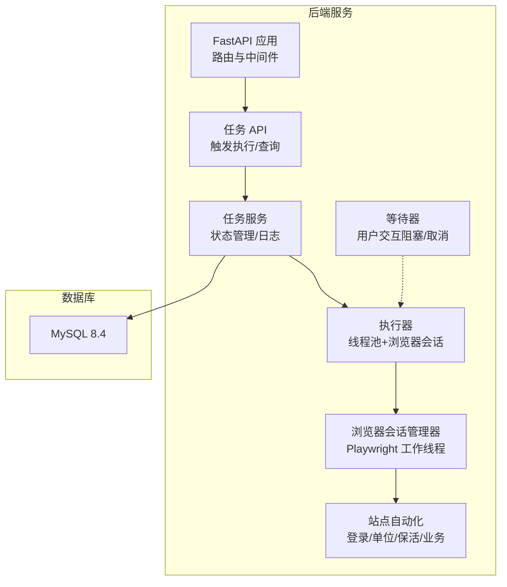
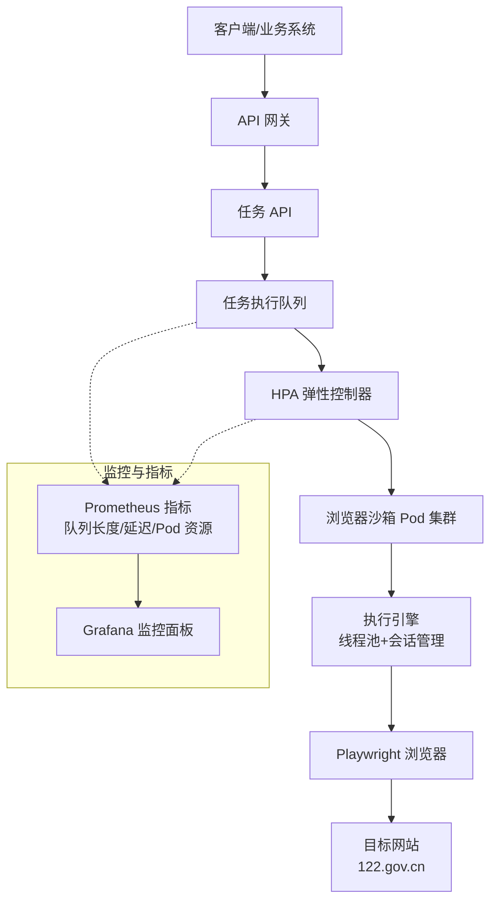
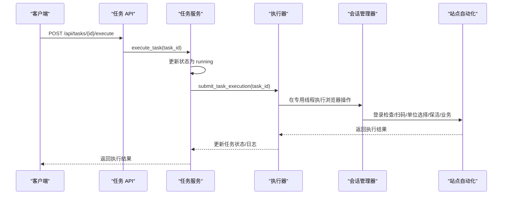
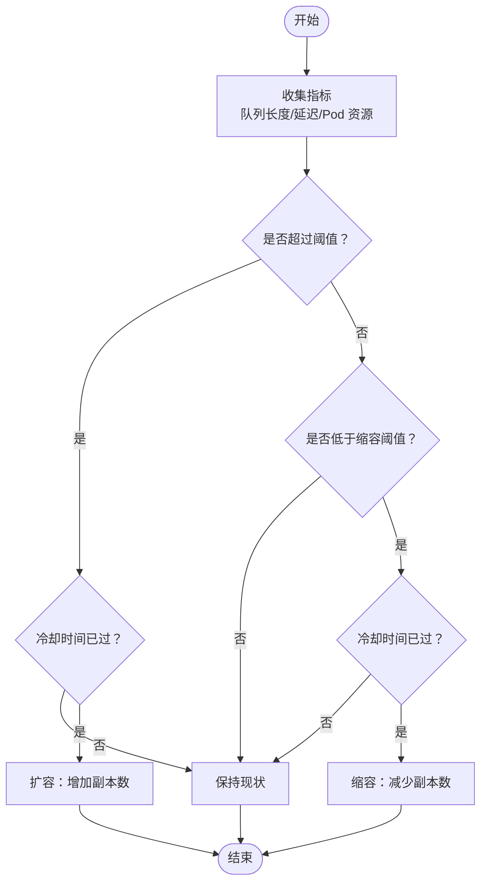
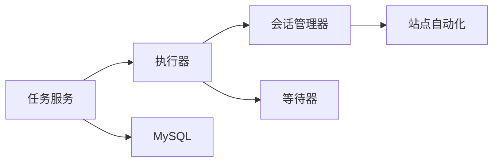

# HPA 弹性扩缩容机制

<cite>
**本文档引用的文件**
- [main.py](file://CCC_RPA_API/app/main.py)
- [executor.py](file://CCC_RPA_API/app/services/executor.py)
- [tasks.py](file://CCC_RPA_API/app/api/tasks.py)
- [task.py](file://CCC_RPA_API/app/models/task.py)
- [config.py](file://CCC_RPA_API/app/config.py)
- [session_manager.py](file://CCC_RPA_API/app/browser/session_manager.py)
- [waiter.py](file://CCC_RPA_API/app/browser/waiter.py)
- [site_automation.py](file://CCC_RPA_API/app/browser/site_automation.py)
- [task_service.py](file://CCC_RPA_API/app/services/task.py)
- [project.md](file://project.md)
</cite>

## 目录
1. [简介](#简介)
2. [项目结构](#项目结构)
3. [核心组件](#核心组件)
4. [架构概览](#架构概览)
5. [详细组件分析](#详细组件分析)
6. [依赖分析](#依赖分析)
7. [性能考虑](#性能考虑)
8. [故障排查指南](#故障排查指南)
9. [结论](#结论)
10. [附录](#附录)

## 简介
本文件面向“基于任务队列积压的 HPA 弹性扩缩容机制”，结合项目现有实现与需求文档，系统阐述以下内容：
- 基于任务队列积压的自动扩缩容算法原理与实现路径
- 扩缩容触发阈值、速率控制、冷却时间配置思路
- HPA 配置参数（最小副本数、最大副本数、目标 CPU/内存）设置要点
- 扩缩容决策流程（任务队列长度监控、决策算法、Pod 创建销毁）
- HPA YAML 配置示例（HorizontalPodAutoscaler 资源定义、指标配置、行为配置）
- 资源分配策略、Pod 重新调度机制、扩缩容对业务的影响评估

说明：当前仓库代码未包含 Kubernetes HPA 的具体实现细节，本文在不虚构代码的前提下，基于项目需求文档与现有后端执行模型，给出可落地的扩缩容方案与配置建议。

## 项目结构
后端以 FastAPI 为核心，提供 REST API 与 WebSocket，任务执行通过线程池与浏览器会话管理器协调完成。整体结构如下：

图表来源
- [main.py:12-27](file://CCC_RPA_API/app/main.py#L12-L27)
- [tasks.py:10-76](file://CCC_RPA_API/app/api/tasks.py#L10-L76)
- [task_service.py:44-157](file://CCC_RPA_API/app/services/task.py#L44-L157)
- [executor.py:17-319](file://CCC_RPA_API/app/services/executor.py#L17-L319)
- [session_manager.py:10-186](file://CCC_RPA_API/app/browser/session_manager.py#L10-L186)
- [waiter.py:7-84](file://CCC_RPA_API/app/browser/waiter.py#L7-L84)
- [site_automation.py:16-743](file://CCC_RPA_API/app/browser/site_automation.py#L16-L743)

章节来源
- [main.py:12-27](file://CCC_RPA_API/app/main.py#L12-L27)
- [project.md:34-100](file://project.md#L34-L100)

## 核心组件
- 任务执行与状态管理：任务服务负责状态更新与日志查询，执行器通过线程池提交任务逻辑。
- 浏览器会话与自动化：会话管理器在专用工作线程中串行执行 Playwright 操作，等待器用于用户交互阻塞与取消。
- WebSocket 广播：后端工作线程通过事件循环安全广播执行进度与状态。

章节来源
- [task_service.py:120-133](file://CCC_RPA_API/app/services/task.py#L120-L133)
- [executor.py:17-319](file://CCC_RPA_API/app/services/executor.py#L17-L319)
- [session_manager.py:10-186](file://CCC_RPA_API/app/browser/session_manager.py#L10-L186)
- [waiter.py:7-84](file://CCC_RPA_API/app/browser/waiter.py#L7-L84)
- [site_automation.py:16-743](file://CCC_RPA_API/app/browser/site_automation.py#L16-L743)

## 架构概览
下图展示任务执行与扩缩容的关系：任务经 API 触发，进入执行器队列；当队列积压增大时，HPA 建议增加 Pod；新增 Pod 提升吞吐，降低队列长度，从而触发 HPA 缩容。

图表来源
- [project.md:974-975](file://project.md#L974-L975)
- [project.md:1414-1416](file://project.md#L1414-L1416)

## 详细组件分析

### 任务执行与队列积压模型
- 任务通过 API 触发执行，服务层将任务状态置为运行并提交执行器。
- 执行器使用固定大小线程池（当前实现为 3 个工作线程）执行任务逻辑，涉及浏览器操作需通过会话管理器串行执行。
- 任务执行期间可能因用户交互阻塞（等待扫码、选择单位），等待器提供阻塞等待与取消能力。

图表来源
- [tasks.py:47-52](file://CCC_RPA_API/app/api/tasks.py#L47-L52)
- [task_service.py:120-133](file://CCC_RPA_API/app/services/task.py#L120-L133)
- [executor.py:317-319](file://CCC_RPA_API/app/services/executor.py#L317-L319)
- [session_manager.py:80-96](file://CCC_RPA_API/app/browser/session_manager.py#L80-L96)
- [site_automation.py:38-53](file://CCC_RPA_API/app/browser/site_automation.py#L38-L53)

章节来源
- [tasks.py:47-52](file://CCC_RPA_API/app/api/tasks.py#L47-L52)
- [task_service.py:120-133](file://CCC_RPA_API/app/services/task.py#L120-L133)
- [executor.py:317-319](file://CCC_RPA_API/app/services/executor.py#L317-L319)
- [session_manager.py:80-96](file://CCC_RPA_API/app/browser/session_manager.py#L80-L96)
- [site_automation.py:38-53](file://CCC_RPA_API/app/browser/site_automation.py#L38-L53)

### HPA 扩缩容算法与参数配置
- 触发阈值：建议以“任务队列积压长度”为关键指标，结合“平均执行时延”设定阈值。例如：队列长度超过 N 且平均延迟超过 T 秒时触发扩容。
- 扩容速率：限制每轮扩容 Pod 数量（如最多 +2），避免瞬时资源不足导致雪崩。
- 缩容速率：设置最小副本数（如 2），并启用冷却时间（如扩容/缩容后 3 分钟内不再调整）。
- 目标指标：
  - 目标 CPU 使用率：根据单 Pod 平均 CPU 占用与线程池规模估算，建议 60%-80%。
  - 目标内存使用率：结合浏览器会话内存占用与空闲内存，建议 60%-75%。
- 行为配置：设置最小副本数、最大副本数、稳定窗口（如 5 分钟）、缩放策略（比例/绝对值）。

说明：以上为通用实践建议，具体数值需结合监控数据与压测结果迭代优化。

### HPA YAML 配置示例
以下为基于任务队列积压的 HPA 配置思路（概念性示例，不含具体代码）：
- HorizontalPodAutoscaler 资源定义：选择合适的指标类型（CPU/内存/自定义指标），配置最小/最大副本数与行为。
- 指标配置：使用自定义指标（如队列长度）或对象指标（如工作负载的批处理延迟）。
- 行为配置：设置稳定窗口、缩放策略与冷却时间。

注意：本节为概念性说明，不对应具体文件。

### 扩缩容决策流程
- 任务队列长度监控：通过指标系统收集队列长度、平均延迟、执行成功率等。
- 决策算法：比较当前指标与阈值，结合历史趋势与冷却状态决定扩/缩/不动。
- Pod 创建/销毁：HPA 调整副本数，K8s 自动调度 Pod；Pod 启动后执行引擎接管任务。

图表来源
- [project.md:974-975](file://project.md#L974-L975)
- [project.md:1414-1416](file://project.md#L1414-L1416)

### 资源分配策略与 Pod 重新调度
- 资源分配：为浏览器沙箱 Pod 设置合理的 CPU/内存请求与限制，确保线程池与浏览器操作的资源需求。
- Pod 重新调度：扩缩容后，K8s 重新调度 Pod，执行引擎在新 Pod 上恢复任务状态（如会话管理器的 storage_state）。
- 业务影响评估：扩容应避免瞬时流量冲击，缩容需保证剩余 Pod 足够承载当前负载；通过监控面板观察延迟、错误率与资源利用率。

章节来源
- [project.md:1450-1481](file://project.md#L1450-L1481)

## 依赖分析
- 组件耦合：任务服务依赖数据库与执行器；执行器依赖会话管理器与站点自动化；等待器贯穿任务执行的阻塞与取消流程。
- 外部依赖：Playwright、Chromium、MySQL、Prometheus/Grafana（监控）。

图表来源
- [task_service.py:44-157](file://CCC_RPA_API/app/services/task.py#L44-L157)
- [executor.py:17-319](file://CCC_RPA_API/app/services/executor.py#L17-L319)
- [session_manager.py:10-186](file://CCC_RPA_API/app/browser/session_manager.py#L10-L186)
- [waiter.py:7-84](file://CCC_RPA_API/app/browser/waiter.py#L7-L84)
- [site_automation.py:16-743](file://CCC_RPA_API/app/browser/site_automation.py#L16-L743)

章节来源
- [task_service.py:44-157](file://CCC_RPA_API/app/services/task.py#L44-L157)
- [executor.py:17-319](file://CCC_RPA_API/app/services/executor.py#L17-L319)
- [session_manager.py:10-186](file://CCC_RPA_API/app/browser/session_manager.py#L10-L186)
- [waiter.py:7-84](file://CCC_RPA_API/app/browser/waiter.py#L7-L84)
- [site_automation.py:16-743](file://CCC_RPA_API/app/browser/site_automation.py#L16-L743)

## 性能考虑
- 线程池规模：当前执行器使用固定大小线程池（3 个工作线程）。在高并发场景下，建议结合 HPA 动态扩展 Pod，并适当调整线程池大小以平衡 CPU 与 I/O。
- 浏览器资源：每个会话占用一定内存与 CPU，需在 Pod 资源限制与线程池规模间取得平衡。
- 监控指标：建议采集队列长度、平均延迟、Pod CPU/内存利用率、错误率与会话崩溃率，形成闭环优化。

## 故障排查指南
- 任务长时间处于 pending：检查 HPA 是否正确配置指标与阈值，确认 Pod 调度是否受限。
- 执行延迟升高：检查浏览器会话是否频繁崩溃（会话管理器具备恢复机制），关注等待器阻塞情况。
- 资源不足：查看 Pod 资源限制是否过低，结合监控面板调整 HPA 目标指标与副本数。

章节来源
- [session_manager.py:147-170](file://CCC_RPA_API/app/browser/session_manager.py#L147-L170)
- [waiter.py:14-32](file://CCC_RPA_API/app/browser/waiter.py#L14-L32)
- [project.md:1141-1159](file://project.md#L1141-L1159)

## 结论
- 本项目在需求层面明确了基于任务队列积压的 HPA 扩缩容目标与监控要求。
- 当前仓库未包含 Kubernetes HPA 的具体实现，但后端执行模型（线程池、会话管理、等待器）为扩缩容提供了良好的基础。
- 建议结合监控数据与压测结果，逐步完善 HPA 配置与资源分配策略，确保在业务高峰与低谷均能稳定运行。

## 附录
- HPA 配置示例（概念性）：参见“HPA YAML 配置示例”章节。
- 监控与告警：参考需求文档中的监控与告警规范。