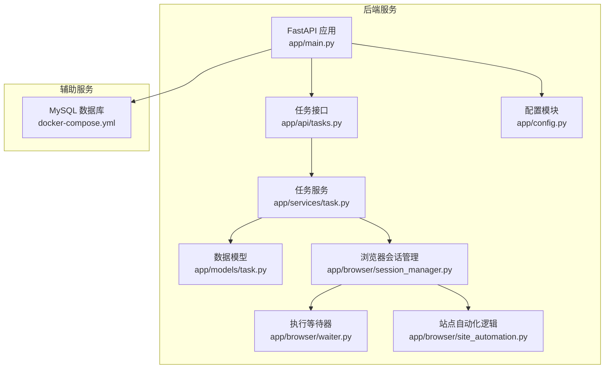
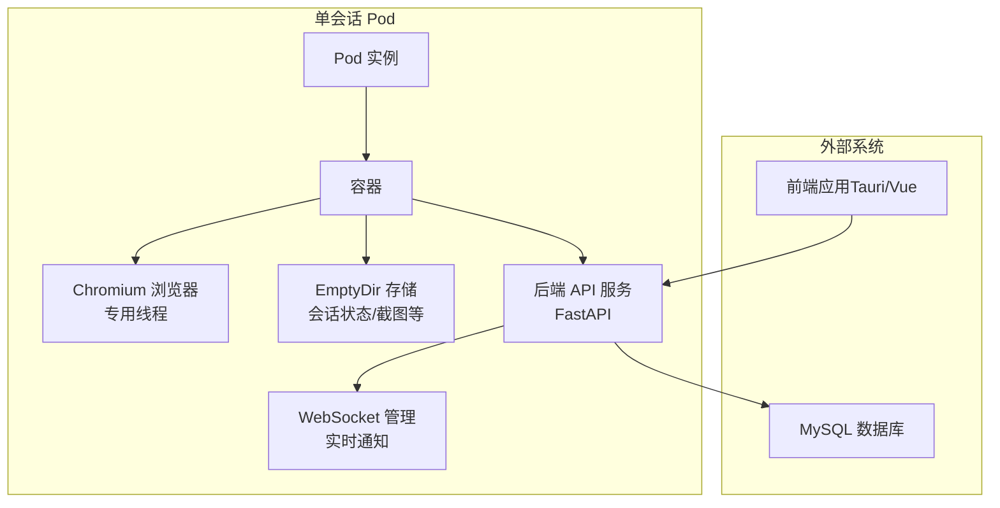
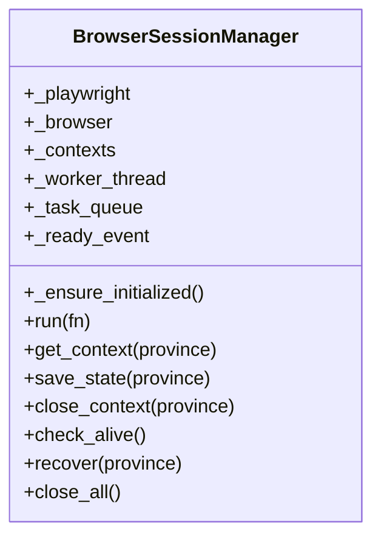
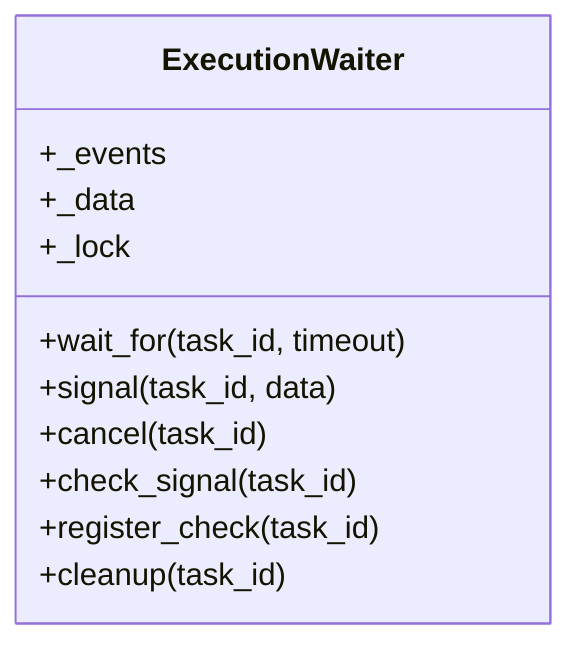
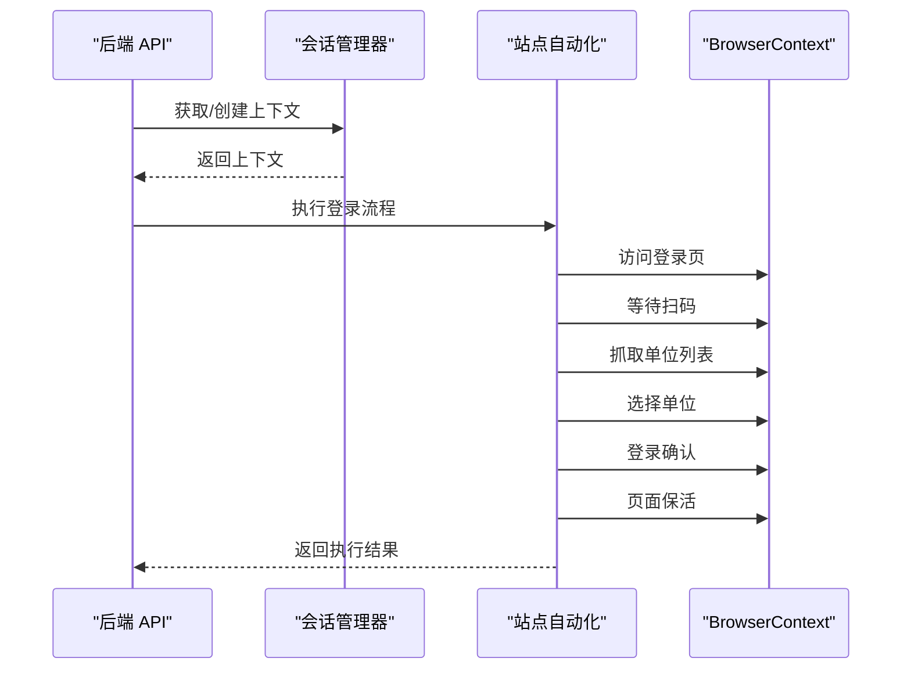
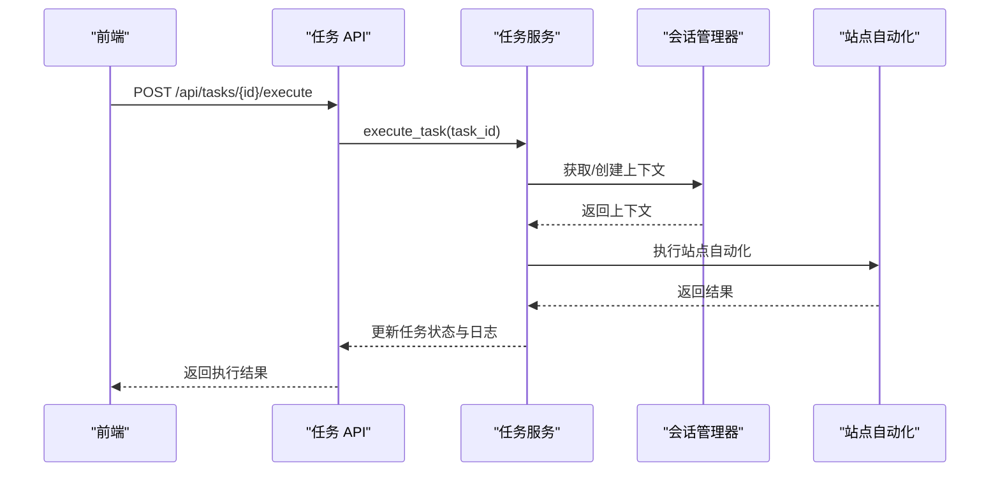
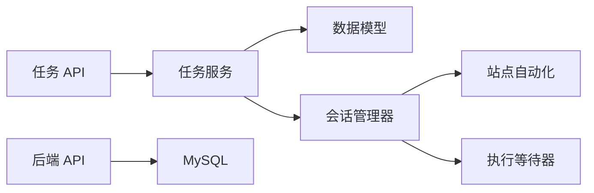
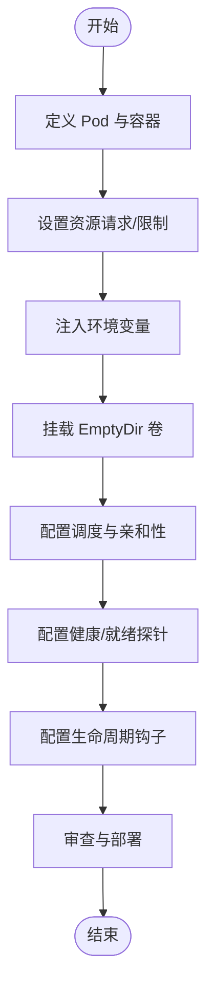
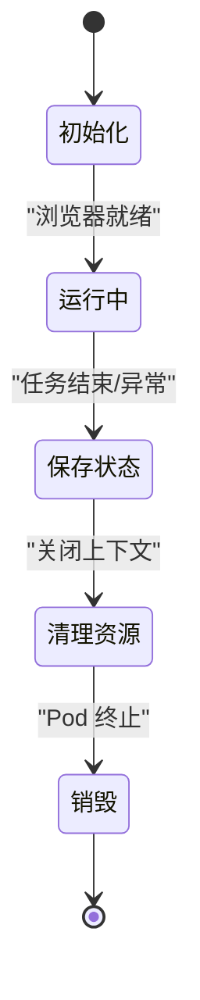

# K8s Pod 架构与编排

<cite>
**本文档引用的文件**
- [main.py](file://CCC_RPA_API/app/main.py)
- [session_manager.py](file://CCC_RPA_API/app/browser/session_manager.py)
- [site_automation.py](file://CCC_RPA_API/app/browser/site_automation.py)
- [waiter.py](file://CCC_RPA_API/app/browser/waiter.py)
- [tasks.py](file://CCC_RPA_API/app/api/tasks.py)
- [task.py](file://CCC_RPA_API/app/services/task.py)
- [task_model.py](file://CCC_RPA_API/app/models/task.py)
- [config.py](file://CCC_RPA_API/app/config.py)
- [docker-compose.yml](file://CCC-BrowserV4/docker-compose.yml)
</cite>

## 目录
1. [简介](#简介)
2. [项目结构](#项目结构)
3. [核心组件](#核心组件)
4. [架构总览](#架构总览)
5. [详细组件分析](#详细组件分析)
6. [依赖分析](#依赖分析)
7. [性能考虑](#性能考虑)
8. [故障排查指南](#故障排查指南)
9. [结论](#结论)
10. [附录](#附录)

## 简介
本文件面向 Kubernetes 环境下的 RPA 自动化系统，围绕“单会话 Pod 设计”展开，阐述以“1 Pod = 1 独立浏览器沙箱会话”的架构优势与实现要点。该设计将每个 Pod 视为一个隔离的浏览器运行环境，具备独立的进程、网络与存储空间，从而实现：
- 会话隔离：不同任务在各自 Pod 内独立运行，互不干扰
- 资源可控：通过 CPU/内存硬限制，确保资源占用稳定
- 数据持久化：利用 EmptyDir 存储会话状态，Pod 销毁时按需清理
- 生命周期清晰：启动前初始化、运行时监控、销毁前清理

本文件同时给出 Pod 资源限制配置建议（CPU 0.5-1 核、内存 1-2Gi）、EmptyDir 存储策略与清理机制、调度与亲和性配置思路，以及完整的 Pod YAML 示例与生命周期管理流程。

## 项目结构
本仓库包含两部分：
- 后端服务（FastAPI）：提供任务管理、WebSocket 推送、数据库交互与浏览器会话管理
- 前端应用（Tauri/Vue）：提供用户界面与设备控制能力
- 辅助服务（MySQL）：通过 docker-compose 提供数据库支持

**图表来源**
- [main.py:1-127](file://CCC_RPA_API/app/main.py#L1-L127)
- [tasks.py:1-76](file://CCC_RPA_API/app/api/tasks.py#L1-L76)
- [task.py:1-157](file://CCC_RPA_API/app/services/task.py#L1-L157)
- [task_model.py:1-25](file://CCC_RPA_API/app/models/task.py#L1-L25)
- [session_manager.py:1-186](file://CCC_RPA_API/app/browser/session_manager.py#L1-L186)
- [waiter.py:1-84](file://CCC_RPA_API/app/browser/waiter.py#L1-L84)
- [site_automation.py:1-743](file://CCC_RPA_API/app/browser/site_automation.py#L1-L743)
- [config.py:1-22](file://CCC_RPA_API/app/config.py#L1-L22)
- [docker-compose.yml:1-21](file://CCC-BrowserV4/docker-compose.yml#L1-L21)

**章节来源**
- [main.py:1-127](file://CCC_RPA_API/app/main.py#L1-L127)
- [docker-compose.yml:1-21](file://CCC-BrowserV4/docker-compose.yml#L1-L21)

## 核心组件
- 会话管理器（BrowserSessionManager）
  - 在专用线程中启动 Chromium，提供跨线程安全的会话操作
  - 支持按省份维护 BrowserContext，持久化 storage_state
  - 提供上下文创建、状态保存、上下文关闭与全局回收
- 执行等待器（ExecutionWaiter）
  - 使用 Event 实现任务执行过程中的暂停/恢复与取消
  - 支持非阻塞检查与资源清理
- 站点自动化（SiteAutomation）
  - 封装登录、扫码、单位选择、页面保活等流程
  - 提供健壮的选择器与回退策略，适配复杂页面结构
- 任务服务与 API
  - 提供任务的增删改查、执行触发与日志查询
  - 与会话管理器协作，驱动浏览器执行具体任务

**章节来源**
- [session_manager.py:1-186](file://CCC_RPA_API/app/browser/session_manager.py#L1-L186)
- [waiter.py:1-84](file://CCC_RPA_API/app/browser/waiter.py#L1-L84)
- [site_automation.py:1-743](file://CCC_RPA_API/app/browser/site_automation.py#L1-L743)
- [tasks.py:1-76](file://CCC_RPA_API/app/api/tasks.py#L1-L76)
- [task.py:1-157](file://CCC_RPA_API/app/services/task.py#L1-L157)

## 架构总览
下图展示单会话 Pod 的整体架构：每个 Pod 内运行一个浏览器实例，承载独立的会话状态；后端服务负责任务编排与浏览器控制，数据库提供持久化存储。

**图表来源**
- [session_manager.py:1-186](file://CCC_RPA_API/app/browser/session_manager.py#L1-L186)
- [site_automation.py:1-743](file://CCC_RPA_API/app/browser/site_automation.py#L1-L743)
- [main.py:1-127](file://CCC_RPA_API/app/main.py#L1-L127)
- [docker-compose.yml:1-21](file://CCC-BrowserV4/docker-compose.yml#L1-L21)

## 详细组件分析

### 组件一：会话管理器（BrowserSessionManager）
- 设计要点
  - 专用工作线程：避免 Playwright 同步 API 与 asyncio 事件循环冲突
  - 上下文池：按省份维护 BrowserContext，复用会话状态
  - 状态持久化：storage_state 文件保存登录态与本地数据
  - 容错与恢复：检测上下文失效、自动重建；支持全局回收
- 关键方法
  - _ensure_initialized：启动专用线程与浏览器实例
  - get_context：获取或创建指定省份的上下文
  - save_state：保存 storage_state
  - close_context/close_all：关闭指定或全部上下文
  - recover：恢复浏览器会话（重建浏览器与上下文）

**图表来源**
- [session_manager.py:1-186](file://CCC_RPA_API/app/browser/session_manager.py#L1-L186)

**章节来源**
- [session_manager.py:1-186](file://CCC_RPA_API/app/browser/session_manager.py#L1-L186)

### 组件二：执行等待器（ExecutionWaiter）
- 设计要点
  - 使用 threading.Event 实现任务暂停/恢复与取消
  - 支持超时、非阻塞检查与资源清理
- 关键方法
  - wait_for：阻塞等待用户操作
  - signal/cancel：唤醒或取消等待
  - check_signal/register_check/cleanup：状态检查与清理

**图表来源**
- [waiter.py:1-84](file://CCC_RPA_API/app/browser/waiter.py#L1-L84)

**章节来源**
- [waiter.py:1-84](file://CCC_RPA_API/app/browser/waiter.py#L1-L84)

### 组件三：站点自动化（SiteAutomation）
- 设计要点
  - 登录与扫码：统一登录页直连与首页点击两种策略
  - 单位选择：多级选择器与 JS 回退，兼顾稳定性与兼容性
  - 页面保活：随机滚动、点击刷新、鼠标移动等，避免超时登出
  - 待处理业务检测：基于徽标与关键词识别
- 关键流程
  - 导航到登录页 → 等待扫码 → 抓取单位列表 → 选择单位 → 登录确认 → 页面保活

**图表来源**
- [session_manager.py:1-186](file://CCC_RPA_API/app/browser/session_manager.py#L1-L186)
- [site_automation.py:1-743](file://CCC_RPA_API/app/browser/site_automation.py#L1-L743)

**章节来源**
- [site_automation.py:1-743](file://CCC_RPA_API/app/browser/site_automation.py#L1-L743)

### 组件四：任务服务与 API
- 设计要点
  - 任务 CRUD 与执行触发
  - 执行日志查询与 WebSocket 推送
  - 与会话管理器协作，驱动浏览器执行
- 关键流程
  - 创建任务 → 触发执行 → 会话管理器启动浏览器 → 站点自动化执行 → 更新日志与状态

**图表来源**
- [tasks.py:1-76](file://CCC_RPA_API/app/api/tasks.py#L1-L76)
- [task.py:1-157](file://CCC_RPA_API/app/services/task.py#L1-L157)
- [session_manager.py:1-186](file://CCC_RPA_API/app/browser/session_manager.py#L1-L186)
- [site_automation.py:1-743](file://CCC_RPA_API/app/browser/site_automation.py#L1-L743)

**章节来源**
- [tasks.py:1-76](file://CCC_RPA_API/app/api/tasks.py#L1-L76)
- [task.py:1-157](file://CCC_RPA_API/app/services/task.py#L1-L157)

## 依赖分析
- 组件耦合
  - 任务服务依赖数据库模型与会话管理器
  - 会话管理器依赖 Playwright 与存储目录
  - 站点自动化依赖会话管理器提供的上下文
  - API 层负责编排调用链并提供对外接口
- 外部依赖
  - MySQL：任务与日志数据存储
  - Docker Compose：本地数据库服务编排

**图表来源**
- [tasks.py:1-76](file://CCC_RPA_API/app/api/tasks.py#L1-L76)
- [task.py:1-157](file://CCC_RPA_API/app/services/task.py#L1-L157)
- [session_manager.py:1-186](file://CCC_RPA_API/app/browser/session_manager.py#L1-L186)
- [site_automation.py:1-743](file://CCC_RPA_API/app/browser/site_automation.py#L1-L743)
- [waiter.py:1-84](file://CCC_RPA_API/app/browser/waiter.py#L1-L84)
- [main.py:1-127](file://CCC_RPA_API/app/main.py#L1-L127)
- [docker-compose.yml:1-21](file://CCC-BrowserV4/docker-compose.yml#L1-L21)

**章节来源**
- [main.py:1-127](file://CCC_RPA_API/app/main.py#L1-L127)
- [config.py:1-22](file://CCC_RPA_API/app/config.py#L1-L22)
- [docker-compose.yml:1-21](file://CCC-BrowserV4/docker-compose.yml#L1-L21)

## 性能考虑
- 资源限制（建议值）
  - CPU：0.5-1 核（根据页面复杂度与并发数动态评估）
  - 内存：1-2 Gi（考虑 Chromium 进程与标签页数量）
- 优化建议
  - 合理设置容器重启策略与健康检查
  - 使用只读根文件系统与最小权限原则
  - 控制 EmptyDir 大小上限，避免磁盘压力
  - 通过水平扩展增加 Pod 数量，分摊负载

## 故障排查指南
- 浏览器初始化失败
  - 检查专用线程是否成功启动与 ready 事件是否触发
  - 关注超时与异常日志，必要时增大超时时间
- 会话丢失或上下文失效
  - 使用 recover 方法重建浏览器与上下文
  - 确认 storage_state 文件是否存在且可读
- 执行卡住或超时
  - 检查执行等待器的信号状态与超时配置
  - 确认页面元素选择器与回退策略是否生效
- 数据库连接问题
  - 校验环境变量与连接字符串
  - 确认 MySQL 服务可用与网络连通性

**章节来源**
- [session_manager.py:1-186](file://CCC_RPA_API/app/browser/session_manager.py#L1-L186)
- [waiter.py:1-84](file://CCC_RPA_API/app/browser/waiter.py#L1-L84)
- [config.py:1-22](file://CCC_RPA_API/app/config.py#L1-L22)
- [docker-compose.yml:1-21](file://CCC-BrowserV4/docker-compose.yml#L1-L21)

## 结论
单会话 Pod 架构通过“1 Pod = 1 独立浏览器沙箱会话”，实现了任务执行的强隔离与高可靠性。结合合理的资源限制、EmptyDir 存储策略与完善的生命周期管理，可在 Kubernetes 中稳定运行大规模 RPA 任务。建议在生产环境中进一步完善监控告警、日志聚合与弹性伸缩策略，持续优化资源利用率与任务吞吐量。

## 附录

### 单会话 Pod YAML 配置示例（概念性）
以下为概念性示例，展示如何在 Kubernetes 中定义单会话 Pod 的资源配置、卷挂载与调度策略。请根据实际环境调整镜像、资源与命令参数。

- Pod 名称与命名空间
- 容器镜像与启动命令
- 资源请求与限制（CPU 0.5-1 核、内存 1-2Gi）
- 环境变量注入（数据库连接、日志级别等）
- EmptyDir 卷挂载（会话状态、截图缓存）
- 调度策略（节点选择、亲和性、污点容忍）
- 健康检查与就绪探针
- 生命周期钩子（启动前初始化、销毁前清理）

[本图为概念性流程图，不对应具体源文件，故不提供图表来源]

### 生命周期管理流程（启动前/运行时/销毁前）
- 启动前初始化
  - 检查并创建会话存储目录
  - 启动专用工作线程与浏览器实例
  - 加载 storage_state（如存在）
- 运行时监控
  - 监控浏览器连接状态与上下文有效性
  - 执行页面保活与异常恢复
  - 通过 WebSocket 推送执行进度
- 销毁前清理
  - 保存 storage_state
  - 关闭上下文与浏览器
  - 清理临时文件与 EmptyDir

[本图为概念性状态图，不对应具体源文件，故不提供图表来源]