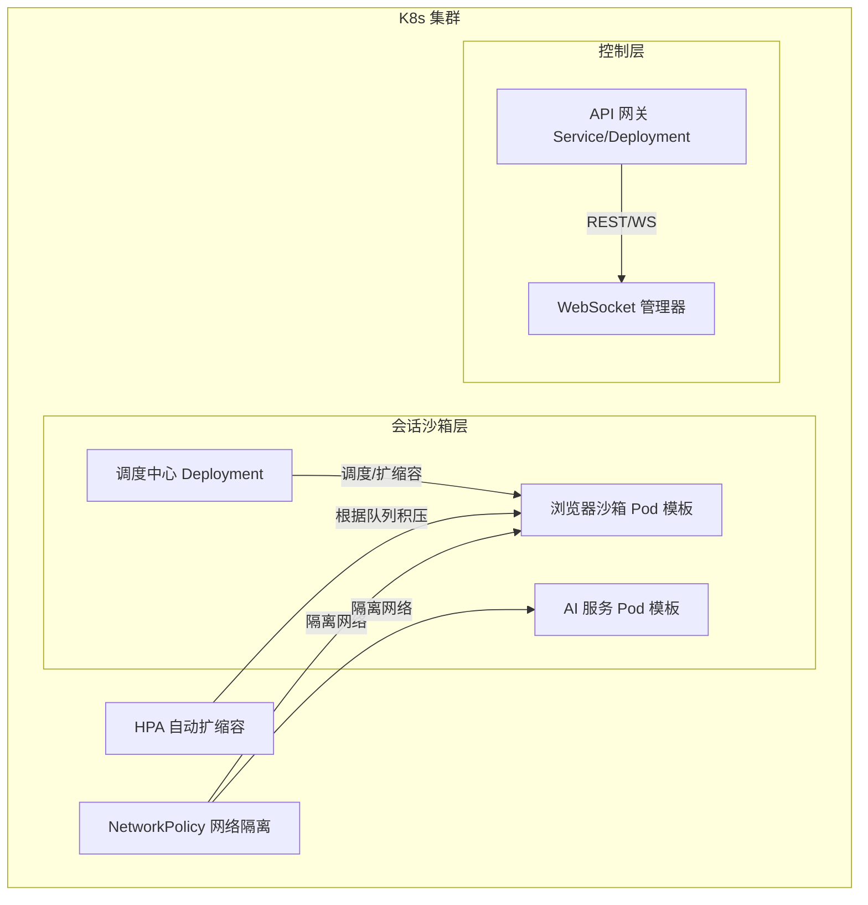
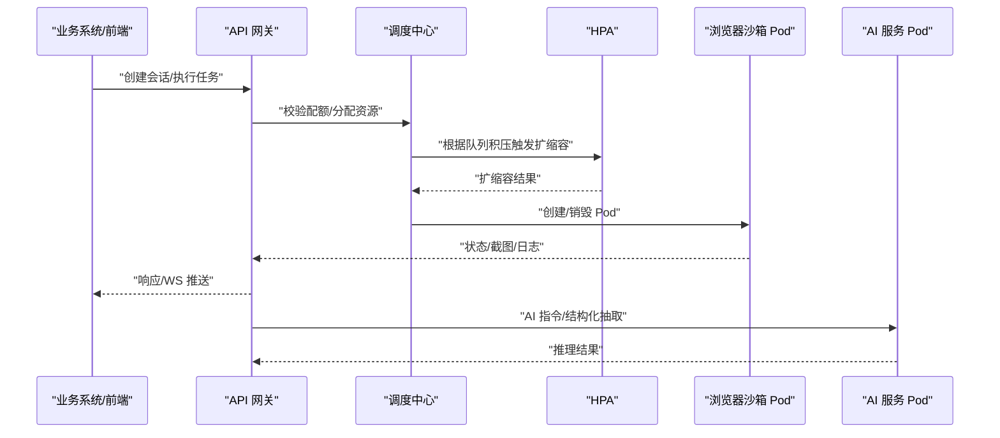
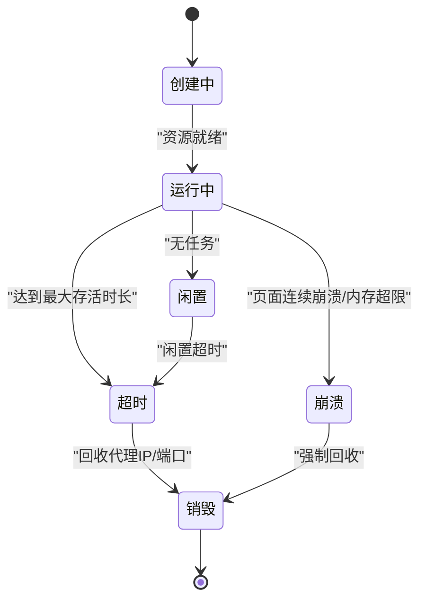
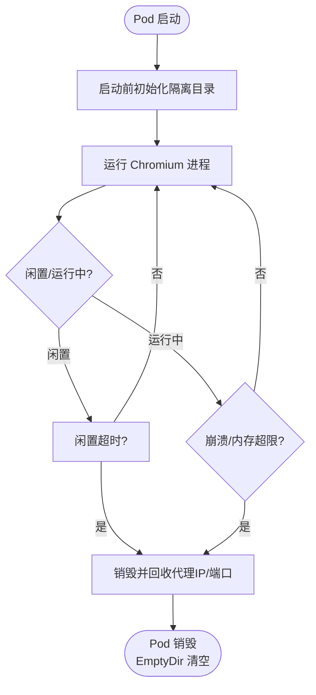
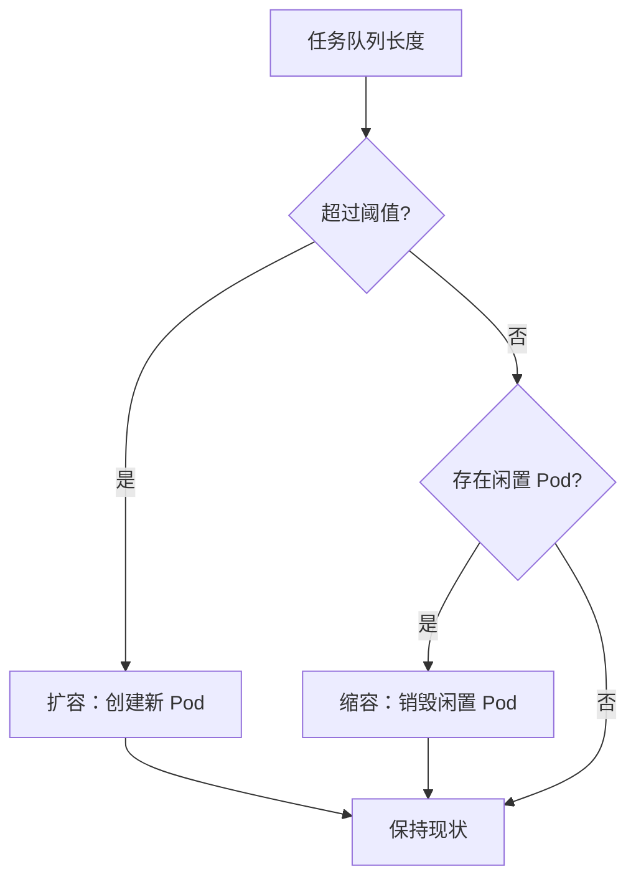
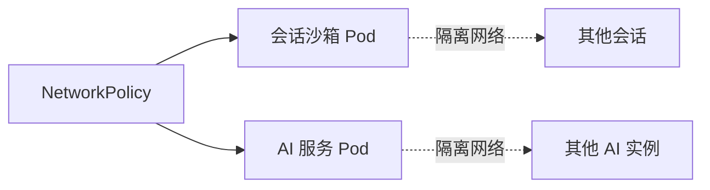
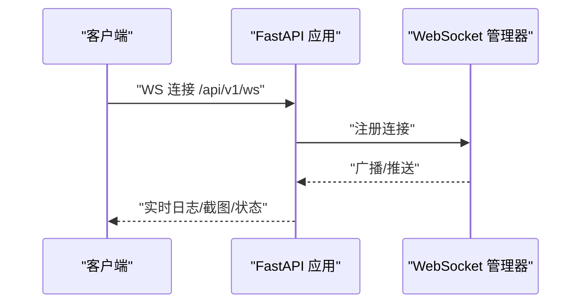
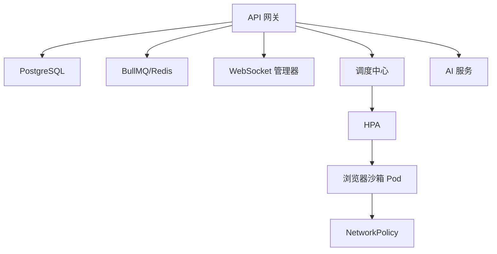

# Kubernetes 容器分布式集群部署

<cite>
**本文引用的文件**
- [project.md](file://project.md)
- [docker-compose.yml](file://CCC-BrowserV4/docker-compose.yml)
- [main.py](file://CCC_RPA_API/app/main.py)
- [tasks.py](file://CCC_RPA_API/app/api/tasks.py)
- [session_manager.py](file://CCC_RPA_API/app/browser/session_manager.py)
- [task.py](file://CCC_RPA_API/app/models/task.py)
</cite>

## 目录
1. [简介](#简介)
2. [项目结构](#项目结构)
3. [核心组件](#核心组件)
4. [架构总览](#架构总览)
5. [详细组件分析](#详细组件分析)
6. [依赖分析](#依赖分析)
7. [性能考虑](#性能考虑)
8. [故障排查指南](#故障排查指南)
9. [结论](#结论)
10. [附录](#附录)

## 简介
本文件面向商用生产环境的 Kubernetes 容器分布式集群部署，聚焦“单会话 Pod”（1 Pod = 1 独立浏览器沙箱会话）的编排与运维实践。文档基于仓库中的统一需求与规范，系统阐述：
- Pod 编排与资源限制：CPU 0.5–1 核、内存 1–2Gi 的硬限制
- 存储策略：EmptyDir 会话存储，Pod 销毁自动清空
- 弹性扩缩容：基于任务队列积压的 HPA 自动扩缩容
- 网络隔离：NetworkPolicy 隔离 Pod 网络
- 生命周期管理：启动前初始化、销毁前清理、超时回收
- 运维监控与日志：Prometheus 指标、Grafana 可视化、ELK 审计日志
- 关键资源 YAML 示例：Deployment、Service、HPA、NetworkPolicy 等

## 项目结构
本仓库包含三层与两类部署形态：
- 三层架构（以 API 服务为核心）：
  - 控制层与业务网关：FastAPI 应用（API 路由、WebSocket 管理）
  - 沙箱会话层：单会话 Pod（Chromium 进程 + 独立 UserData）
  - AI 微服务层：本地 Ollama、YOLO/PaddleOCR 等推理服务
- 两类部署形态：
  - 生产：K8s 容器分布式集群（本文件重点）
  - 内部测试：单机进程级沙箱（兼容形态）

图表来源
- [project.md: 189-201:189-201](file://project.md#L189-L201)
- [project.md: 734-765:734-765](file://project.md#L734-L765)

章节来源
- [project.md: 173-201:173-201](file://project.md#L173-L201)
- [project.md: 734-765:734-765](file://project.md#L734-L765)

## 核心组件
- 调度中心（会话调度与生命周期管理）
  - 负责分配 sessionId、CDP 端口、并发配额校验、超时与崩溃销毁
  - 生命周期状态：pending → running → idle → timeout/crash → destroyed
- 浏览器沙箱 Pod 模板
  - 单进程 Chromium，EmptyDir 独立存储，资源硬限制
  - 动态注入 SESSION_ID、PROXY_URL、TENANT_ID 等环境变量
- HPA 自动扩缩容
  - 依据任务队列积压自动扩容，闲置超时自动销毁
- NetworkPolicy
  - Pod 间网络隔离，确保会话完全隔离
- API 网关与 WebSocket
  - 提供 REST/WS 接口，实时推送日志、截图、状态

章节来源
- [project.md: 263-276:263-276](file://project.md#L263-L276)
- [project.md: 251-262:251-262](file://project.md#L251-L262)
- [project.md: 191-201:191-201](file://project.md#L191-L201)
- [main.py: 12-28:12-28](file://CCC_RPA_API/app/main.py#L12-L28)
- [main.py: 119-127:119-127](file://CCC_RPA_API/app/main.py#L119-L127)

## 架构总览
K8s 生产部署形态的关键约束与流程如下：
- 最小单元：1 Pod = 1 独立浏览器沙箱会话，仅运行单个 Chromium 进程
- 资源硬限制：CPU 0.5–1 核，内存 1–2Gi
- 存储策略：EmptyDir，Pod 销毁自动清空
- 扩缩容：HPA 基于任务队列积压，闲置超时回收
- 网络：NetworkPolicy 隔离，Pod 间不可互相访问
- 生命周期：创建、运行、闲置、超时、崩溃、销毁、资源清理

图表来源
- [project.md: 191-201:191-201](file://project.md#L191-L201)
- [project.md: 259-261:259-261](file://project.md#L259-L261)
- [main.py: 114-117:114-117](file://CCC_RPA_API/app/main.py#L114-L117)

章节来源
- [project.md: 189-201:189-201](file://project.md#L189-L201)
- [project.md: 259-261:259-261](file://project.md#L259-L261)

## 详细组件分析

### 组件 A：会话调度与生命周期管理
- 调度职责
  - 分配 sessionId、CDP 端口（起始 9222）
  - 并发配额与代理 IP 可用性校验
  - 超时、内存超限、连续崩溃等销毁触发条件
- 生命周期状态机
  - pending → running → idle → timeout/crash → destroyed
- 自愈与重试
  - CDP 断连、代理超时自动重试 2 次，失败销毁并上报

图表来源
- [project.md: 263-276:263-276](file://project.md#L263-L276)

章节来源
- [project.md: 263-276:263-276](file://project.md#L263-L276)

### 组件 B：浏览器沙箱 Pod 模板
- 资源限制
  - requests：cpu 0.5、memory 1Gi
  - limits：cpu 1、memory 2Gi
- 环境变量
  - SESSION_ID、PROXY_URL、TENANT_ID 等动态注入
- 存储
  - EmptyDir 挂载到 /data/userdir，Pod 删除自动清空
- 生命周期钩子
  - 启动前初始化隔离目录
  - 销毁前终止 Chromium 进程、清理临时文件

图表来源
- [project.md: 255-261:255-261](file://project.md#L255-L261)
- [project.md: 734-765:734-765](file://project.md#L734-L765)

章节来源
- [project.md: 255-261:255-261](file://project.md#L255-L261)
- [project.md: 734-765:734-765](file://project.md#L734-L765)

### 组件 C：HPA 自动扩缩容
- 触发条件
  - 依据任务队列积压长度自动新建/销毁浏览器 Pod
- 策略要点
  - 扩容：提升在线会话能力，降低任务等待时间
  - 缩容：闲置超时回收，释放 CPU/内存与代理 IP

图表来源
- [project.md: 199](file://project.md#L199)
- [project.md: 259](file://project.md#L259)

章节来源
- [project.md: 199](file://project.md#L199)
- [project.md: 259](file://project.md#L259)

### 组件 D：NetworkPolicy 网络隔离
- 目标
  - Pod 间无法互相访问，确保会话完全隔离
- 实施
  - 为会话沙箱与 AI 服务分别设置 NetworkPolicy，限制入站/出站

图表来源
- [project.md: 201](file://project.md#L201)

章节来源
- [project.md: 201](file://project.md#L201)

### 组件 E：API 网关与 WebSocket
- REST/WS 接口
  - 提供会话创建、关闭、脚本执行、AI 指令、截图等接口
  - WebSocket 实时推送日志、截图、状态
- 事件与广播
  - 启动时捕获主事件循环，用于工作线程 WebSocket 广播

图表来源
- [main.py: 12-28:12-28](file://CCC_RPA_API/app/main.py#L12-L28)
- [main.py: 119-127:119-127](file://CCC_RPA_API/app/main.py#L119-L127)

章节来源
- [main.py: 12-28:12-28](file://CCC_RPA_API/app/main.py#L12-L28)
- [main.py: 119-127:119-127](file://CCC_RPA_API/app/main.py#L119-L127)

## 依赖分析
- 控制层依赖
  - API 网关依赖数据库（PostgreSQL）与任务队列（BullMQ/Redis）
  - WebSocket 管理器负责广播与连接维护
- 沙箱层依赖
  - 调度中心分配资源与端口，HPA 根据队列积压扩缩容
  - NetworkPolicy 保障网络隔离
- AI 层依赖
  - Ollama、YOLO/PaddleOCR 服务通过 GRPC 或本地推理提供能力

图表来源
- [project.md: 445-480:445-480](file://project.md#L445-L480)
- [main.py: 30-40:30-40](file://CCC_RPA_API/app/main.py#L30-L40)

章节来源
- [project.md: 445-480:445-480](file://project.md#L445-L480)
- [main.py: 30-40:30-40](file://CCC_RPA_API/app/main.py#L30-L40)

## 性能考虑
- 资源上限
  - 单会话 CPU 0.5–1 核、内存 1–2Gi，避免资源争抢
- 扩缩容策略
  - HPA 基于任务队列积压，保障响应时间与吞吐
- 指标采集
  - Prometheus 采集 Pod/进程 CPU、内存、CDP 连接数、AI 推理耗时、崩溃次数
- 监控看板
  - Grafana 可视化全局/租户维度指标
- 日志与审计
  - ELK 收集全链路操作日志，保留 90 天

章节来源
- [project.md: 506-517:506-517](file://project.md#L506-L517)
- [project.md: 425-434:425-434](file://project.md#L425-L434)

## 故障排查指南
- 会话崩溃与重试
  - CDP 断连、代理网络超时自动重试 2 次，失败销毁并上报
- 超时与内存泄漏
  - 硬内存阈值自动销毁、强制超时回收、定时清理磁盘缓存
- API 网关过载
  - 多副本负载均衡、任务队列削峰限流、租户并发配额限制
- 数据库与存储
  - PostgreSQL 快照备份、Redis 缓存清理、会话快照 AES 加密

章节来源
- [project.md: 641-657:641-657](file://project.md#L641-L657)
- [session_manager.py: 147-186:147-186](file://CCC_RPA_API/app/browser/session_manager.py#L147-L186)

## 结论
本部署方案以“单会话 Pod”为核心，结合 HPA 自动扩缩容、NetworkPolicy 网络隔离、EmptyDir 存储与严格的资源硬限制，满足商用生产环境对强隔离、高可用与可观测性的要求。配合统一的 API/WS 接口、任务队列与监控告警体系，可实现稳定的分布式浏览器沙箱集群。

## 附录

### A. K8s 资源 YAML 配置示例（路径引用）
- 调度中心 Deployment（会话调度中心）
  - [project.md: 253](file://project.md#L253)
- 浏览器沙箱 Pod 模板
  - [project.md: 734-765:734-765](file://project.md#L734-L765)
- Service（API 网关服务）
  - [project.md: 253](file://project.md#L253)
- HPA（弹性扩缩容）
  - [project.md: 259](file://project.md#L259)
- NetworkPolicy（网络隔离）
  - [project.md: 201](file://project.md#L201)

章节来源
- [project.md: 253-261:253-261](file://project.md#L253-L261)
- [project.md: 734-765:734-765](file://project.md#L734-L765)

### B. API 接口与 WebSocket（路径引用）
- REST/WS 接口清单
  - [project.md: 454-462:454-462](file://project.md#L454-L462)
- WebSocket 管道
  - [main.py: 119-127:119-127](file://CCC_RPA_API/app/main.py#L119-L127)

章节来源
- [project.md: 454-462:454-462](file://project.md#L454-L462)
- [main.py: 119-127:119-127](file://CCC_RPA_API/app/main.py#L119-L127)

### C. 数据模型与任务管理（路径引用）
- 任务模型
  - [task.py: 8-25:8-25](file://CCC_RPA_API/app/models/task.py#L8-L25)
- 任务 API
  - [tasks.py: 10-76:10-76](file://CCC_RPA_API/app/api/tasks.py#L10-L76)

章节来源
- [task.py: 8-25:8-25](file://CCC_RPA_API/app/models/task.py#L8-L25)
- [tasks.py: 10-76:10-76](file://CCC_RPA_API/app/api/tasks.py#L10-L76)

### D. 内部测试形态（兼容参考）
- 单机进程沙箱（Linux/unshare + cgroup v2；Windows/Job 对象）
  - [project.md: 203-208:203-208](file://project.md#L203-L208)

章节来源
- [project.md: 203-208:203-208](file://project.md#L203-L208)

### E. MySQL Compose（兼容形态参考）
- MySQL 服务与卷
  - [docker-compose.yml: 3-21:3-21](file://CCC-BrowserV4/docker-compose.yml#L3-L21)

章节来源
- [docker-compose.yml: 3-21:3-21](file://CCC-BrowserV4/docker-compose.yml#L3-L21)