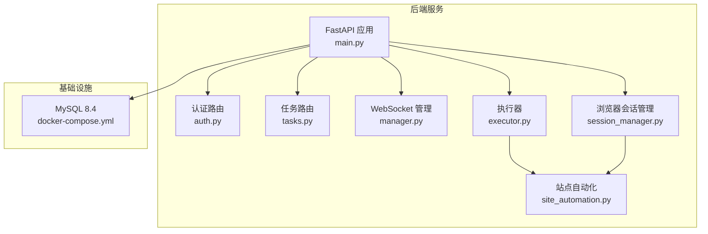
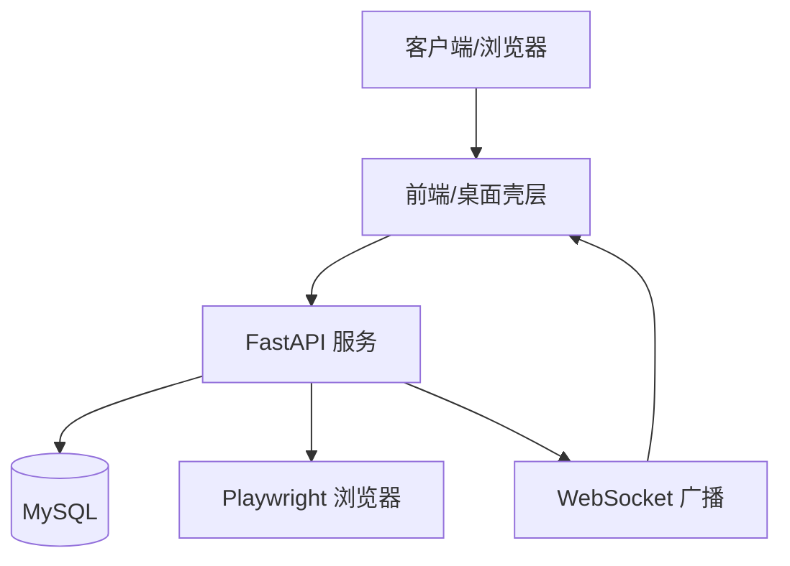
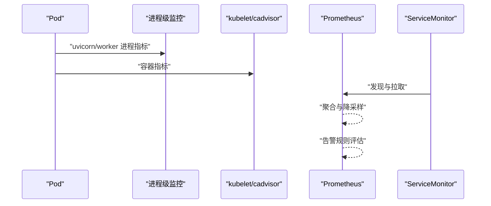
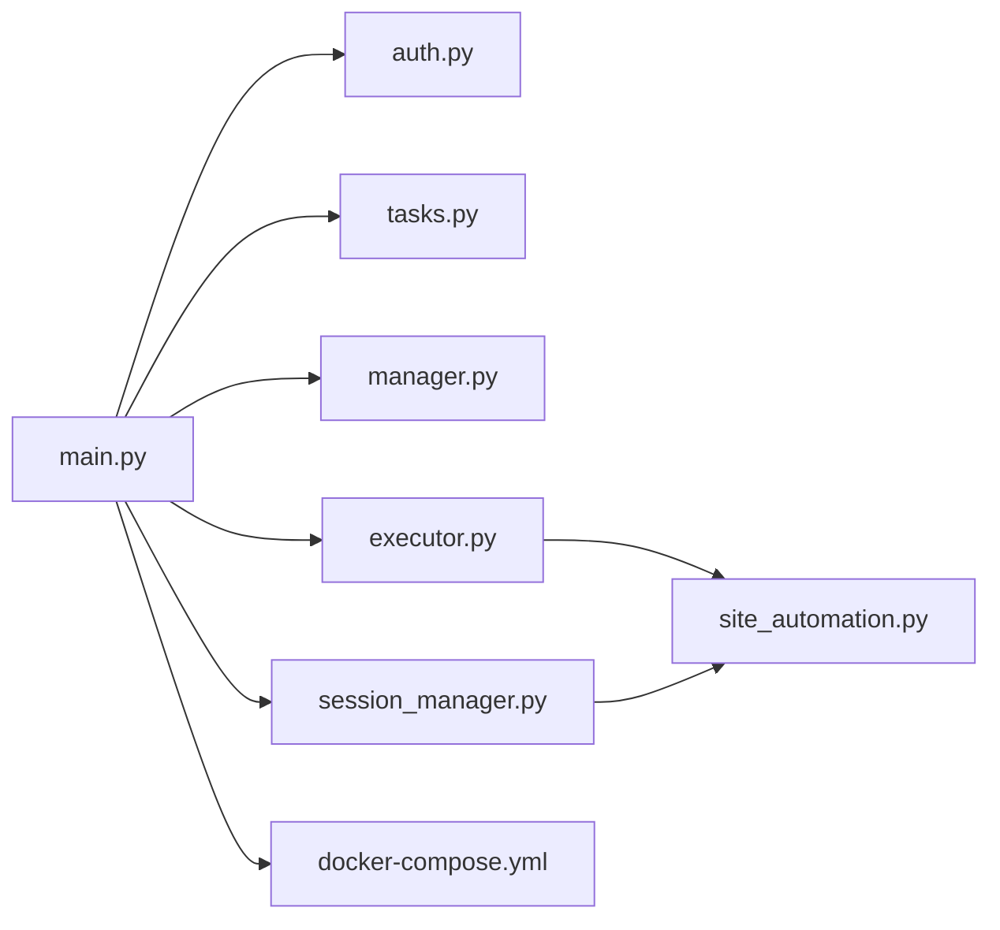
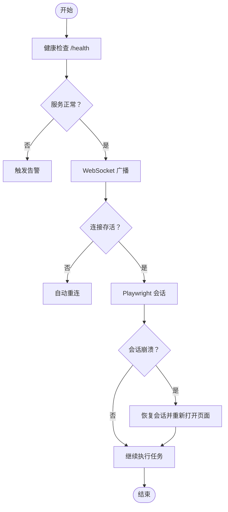

# 监控与日志收集

<cite>
**本文引用的文件**   
- [project.md](file://project.md)
- [docker-compose.yml](file://CCC-BrowserV4/docker-compose.yml)
- [main.py](file://CCC_RPA_API/app/main.py)
- [tasks.py](file://CCC_RPA_API/app/api/tasks.py)
- [auth.py](file://CCC_RPA_API/app/api/auth.py)
- [session_manager.py](file://CCC_RPA_API/app/browser/session_manager.py)
- [executor.py](file://CCC_RPA_API/app/services/executor.py)
- [site_automation.py](file://CCC_RPA_API/app/browser/site_automation.py)
- [manager.py](file://CCC_RPA_API/app/ws/manager.py)
</cite>

## 目录
1. [简介](#简介)
2. [项目结构](#项目结构)
3. [核心组件](#核心组件)
4. [架构总览](#架构总览)
5. [组件详解](#组件详解)
6. [依赖关系分析](#依赖关系分析)
7. [性能考量](#性能考量)
8. [故障排查指南](#故障排查指南)
9. [结论](#结论)
10. [附录](#附录)

## 简介
本文件面向 K8s 环境下的监控与日志收集，结合现有代码库中的系统架构与运行特征，给出 Prometheus 指标采集、Grafana 监控面板与告警规则、以及 ELK 日志收集的落地建议。文档同时提供 ServiceMonitor、PrometheusRule、Grafana Dashboard 的 YAML 定义思路与最佳实践，帮助实现对 Pod 级别、进程级别、业务级别的可观测性。

## 项目结构
- 后端服务（FastAPI）：提供 REST API、WebSocket、健康检查、数据库初始化与迁移、Playwright 浏览器会话管理。
- 前端与桌面壳层：Vue3 + Tauri，负责用户交互与设备标识持久化。
- 基础设施：MySQL 通过 docker-compose 提供持久化存储。

**图表来源**
- [main.py:12-127](file://CCC_RPA_API/app/main.py#L12-L127)
- [auth.py:1-24](file://CCC_RPA_API/app/api/auth.py#L1-L24)
- [tasks.py:1-76](file://CCC_RPA_API/app/api/tasks.py#L1-L76)
- [manager.py:1-29](file://CCC_RPA_API/app/ws/manager.py#L1-L29)
- [session_manager.py:1-186](file://CCC_RPA_API/app/browser/session_manager.py#L1-L186)
- [executor.py:1-319](file://CCC_RPA_API/app/services/executor.py#L1-L319)
- [site_automation.py:1-743](file://CCC_RPA_API/app/browser/site_automation.py#L1-L743)
- [docker-compose.yml:1-21](file://CCC-BrowserV4/docker-compose.yml#L1-L21)

**章节来源**
- [project.md:159-260](file://project.md#L159-L260)
- [docker-compose.yml:1-21](file://CCC-BrowserV4/docker-compose.yml#L1-L21)

## 核心组件
- FastAPI 应用与路由：提供认证、任务管理、健康检查与 WebSocket。
- 浏览器会话管理：Playwright 同步 API 在专用工作线程执行，按省份隔离上下文，持久化 storage_state。
- 执行器：线程池执行任务生命周期，包含扫码登录、单位选择、保活循环、业务检测与执行。
- 站点自动化：针对 122.gov.cn 的全站自动化，包含登录状态检测、二维码截取、单位列表抓取、保活与业务检测。
- WebSocket 管理：连接管理与广播，用于前端状态同步。
- 健康检查：/health 返回服务状态。

**章节来源**
- [main.py:12-127](file://CCC_RPA_API/app/main.py#L12-L127)
- [session_manager.py:10-186](file://CCC_RPA_API/app/browser/session_manager.py#L10-L186)
- [executor.py:18-319](file://CCC_RPA_API/app/services/executor.py#L18-L319)
- [site_automation.py:16-743](file://CCC_RPA_API/app/browser/site_automation.py#L16-L743)
- [manager.py:5-29](file://CCC_RPA_API/app/ws/manager.py#L5-L29)

## 架构总览

**图表来源**
- [main.py:120-127](file://CCC_RPA_API/app/main.py#L120-L127)
- [manager.py:17-26](file://CCC_RPA_API/app/ws/manager.py#L17-L26)
- [session_manager.py:42-77](file://CCC_RPA_API/app/browser/session_manager.py#L42-L77)

## 组件详解

### Prometheus 监控指标采集机制
- Pod 级别指标：通过 kube-state-metrics、node-exporter、kubelet cadvisor 暴露的标准指标，采集 CPU、内存、磁盘、网络、文件描述符、OOM 条数、重启次数、就绪/存活探针状态等。
- 进程级别指标：在容器内启用进程级监控（如 process-exporter），采集 uvicorn、playwright、chromium 进程的 CPU、内存、线程数、句柄数、阻塞状态等。
- 业务指标：在 FastAPI 中增加自定义指标（如 Prometheus metrics），采集任务执行成功率、平均耗时、排队时延、WebSocket 广播延迟、浏览器会话存活状态、保活间隔分布、业务检测命中率等。

[此图为概念流程图，无需图表来源]

### 关键监控指标定义与采集
- CPU 使用率
  - Pod 级别：container_cpu_usage_seconds_total（核数/百分比）
  - 进程级别：process_cpu_seconds_total（uvicorn、chromium 等）
- 内存使用量
  - Pod 级别：container_memory_working_set_bytes、container_memory_rss
  - 进程级别：process_resident_memory_bytes
- 会话数量
  - Prometheus 指标：up + 副本数，或自定义 counter（会话创建/销毁）
- 任务队列长度
  - Prometheus 指标：自定义 gauge（任务等待队列长度），或通过队列中间件暴露
- AI 推理耗时
  - Prometheus 指标：histogram_duration_seconds_bucket（自定义直方图）
- 代理 IP 状态
  - Prometheus 指标：gauge（可用/不可用/错误率），或自定义 counter（失效次数）

[本节为指标定义说明，不直接分析具体文件，故无章节来源]

### Grafana 监控面板配置
- 仪表板设计
  - 全局维度：集群/命名空间/Pod 名称
  - 租户维度：按租户/设备聚合
- 图表类型选择
  - CPU/内存趋势：折线图
  - 任务成功率/耗时：堆叠柱状图 + 折线图
  - 会话存活/崩溃：状态指示器 + 折线图
  - 业务命中率：热力图/阶梯图
- 告警规则设置
  - 会话批量崩溃、推理超时、资源耗尽、代理 IP 失效等

[本节为配置建议，不直接分析具体文件，故无章节来源]

### ELK 日志收集架构
- Logstash：解析与过滤（正则、grok、条件分支）
- Elasticsearch：索引与查询（模板、映射、副本/分片）
- Kibana：可视化与仪表板（Saved Objects、Lens、Timelion）
- 集成要点
  - 采集范围：后端服务日志、浏览器会话日志、WebSocket 消息、错误堆栈
  - 留存策略：90 天（审计与合规）
  - 查询语法：布尔查询、范围查询、聚合统计、异常检测

[本节为架构说明，不直接分析具体文件，故无章节来源]

### 监控配置示例（YAML 定义思路）
以下为概念性 YAML 定义思路，用于 ServiceMonitor、PrometheusRule、Grafana Dashboard 的落地参考：

- ServiceMonitor（采集后端服务指标）
  - 选择器：app.kubernetes.io/name=ccc-rpa-api
  - 端口：metrics（或 http）
  - 间隔：15s
  - 重试/超时：合理配置
- PrometheusRule（告警规则）
  - 会话批量崩溃：increase(session_crash_total[5m]) > N
  - 推理超时：histogram_quantile(0.95, sum by(le) (rate(inference_duration_bucket[5m]))) > T
  - 资源耗尽：rate(container_cpu_usage_seconds_total[5m]) / limit > 0.9
  - 代理 IP 失效：rate(proxy_ip_unavailable_total[5m]) > M
- Grafana Dashboard
  - 数据源：Prometheus
  - 变量：namespace、pod、tenant
  - 面板：趋势、分布、热力图、状态指示器

[本节为配置建议，不直接分析具体文件，故无章节来源]

## 依赖关系分析

**图表来源**
- [main.py:24-27](file://CCC_RPA_API/app/main.py#L24-L27)
- [auth.py:1-24](file://CCC_RPA_API/app/api/auth.py#L1-L24)
- [tasks.py:1-76](file://CCC_RPA_API/app/api/tasks.py#L1-L76)
- [manager.py:1-29](file://CCC_RPA_API/app/ws/manager.py#L1-L29)
- [session_manager.py:1-186](file://CCC_RPA_API/app/browser/session_manager.py#L1-L186)
- [executor.py:1-319](file://CCC_RPA_API/app/services/executor.py#L1-L319)
- [site_automation.py:1-743](file://CCC_RPA_API/app/browser/site_automation.py#L1-L743)
- [docker-compose.yml:1-21](file://CCC-BrowserV4/docker-compose.yml#L1-L21)

**章节来源**
- [main.py:12-127](file://CCC_RPA_API/app/main.py#L12-L127)
- [tasks.py:10-76](file://CCC_RPA_API/app/api/tasks.py#L10-L76)
- [session_manager.py:10-186](file://CCC_RPA_API/app/browser/session_manager.py#L10-L186)
- [executor.py:18-319](file://CCC_RPA_API/app/services/executor.py#L18-L319)

## 性能考量
- 指标采集
  - 合理设置抓取间隔与超时，避免对后端造成压力
  - 使用降采样与聚合，减少存储与查询成本
- 业务指标
  - 使用直方图与摘要，关注 P50/P95/P99
  - 控制标签基数，避免高基数指标导致内存膨胀
- 日志
  - 采用结构化日志，减少解析成本
  - 合理分区与压缩，控制存储增长

[本节为通用指导，不直接分析具体文件，故无章节来源]

## 故障排查指南
- 健康检查
  - /health 返回 ok 表示服务正常
- WebSocket 广播
  - 断线重连与清理：连接断开后自动清理
- 浏览器会话
  - 检查浏览器存活状态，异常时触发恢复流程
  - 保存检查点截图，辅助定位问题
- 任务执行
  - 执行状态广播：progress/error/status
  - 执行日志：记录开始/结束/结果消息

**图表来源**
- [main.py:114-116](file://CCC_RPA_API/app/main.py#L114-L116)
- [manager.py:17-26](file://CCC_RPA_API/app/ws/manager.py#L17-L26)
- [executor.py:42-69](file://CCC_RPA_API/app/services/executor.py#L42-L69)

**章节来源**
- [main.py:114-116](file://CCC_RPA_API/app/main.py#L114-L116)
- [manager.py:14-26](file://CCC_RPA_API/app/ws/manager.py#L14-L26)
- [executor.py:42-69](file://CCC_RPA_API/app/services/executor.py#L42-L69)

## 结论
通过在 K8s 中引入 Prometheus、Grafana 与 ELK，结合现有系统的健康检查、WebSocket 广播与浏览器会话管理能力，可以实现对 Pod、进程与业务的全链路可观测性。建议优先采集 CPU/内存、会话数量、任务队列长度、AI 推理耗时与代理 IP 状态等关键指标，并配套完善的告警与日志审计策略，确保系统稳定与可追溯。

[本节为总结，不直接分析具体文件，故无章节来源]

## 附录
- 项目文档中明确了“全链路监控与告警”“ELK Stack 收集全量操作审计日志”的需求，可据此完善监控与日志方案。
- MySQL 通过 docker-compose 提供，建议将其纳入基础设施监控范围。

**章节来源**
- [project.md:1141-1149](file://project.md#L1141-L1149)
- [docker-compose.yml:1-21](file://CCC-BrowserV4/docker-compose.yml#L1-L21)