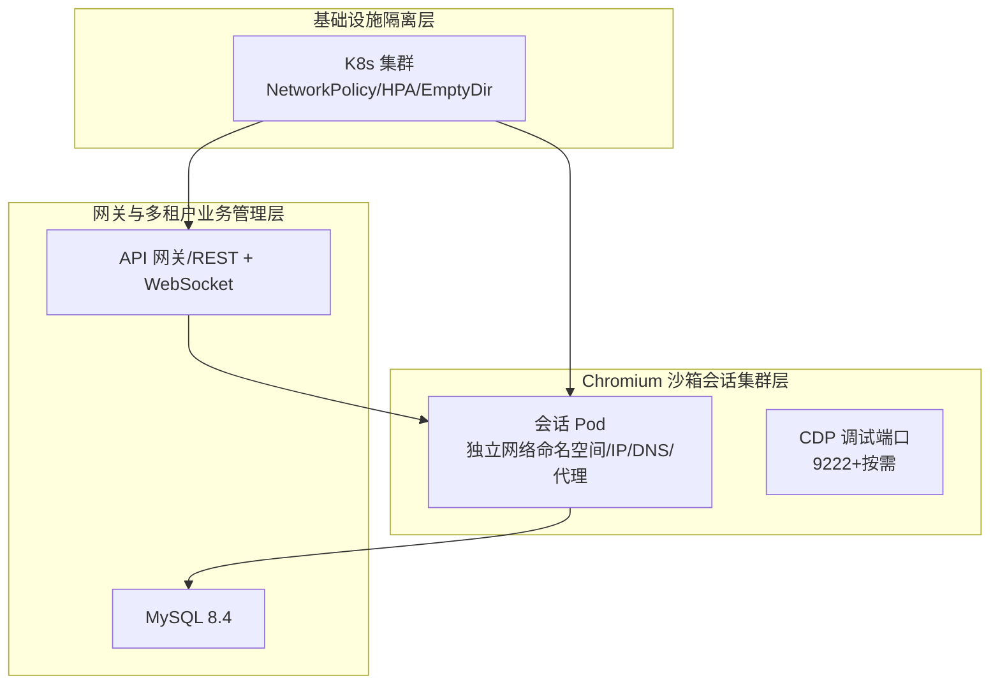
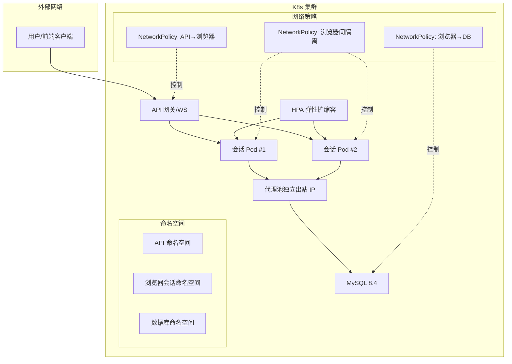
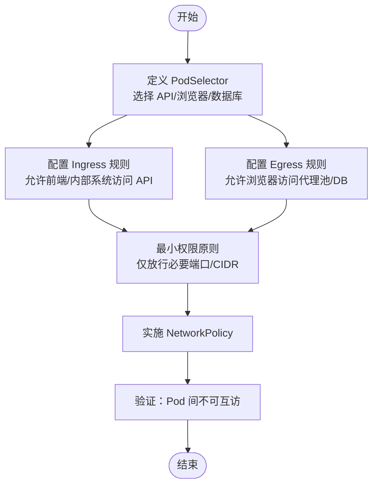
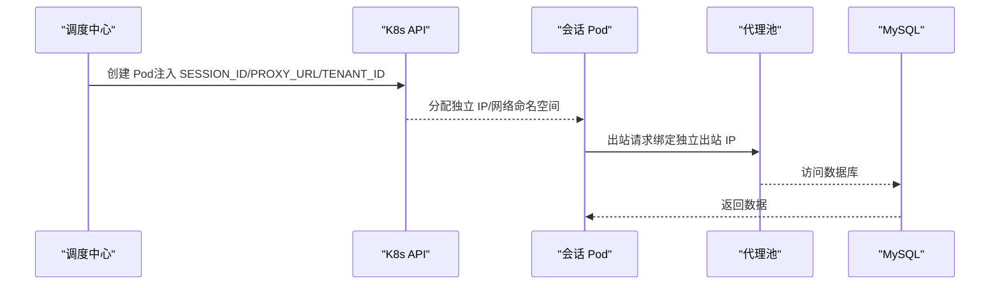
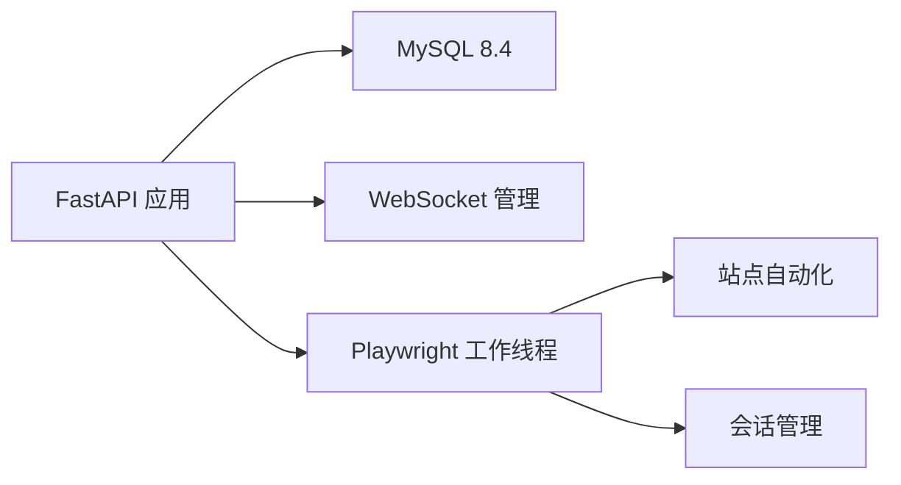
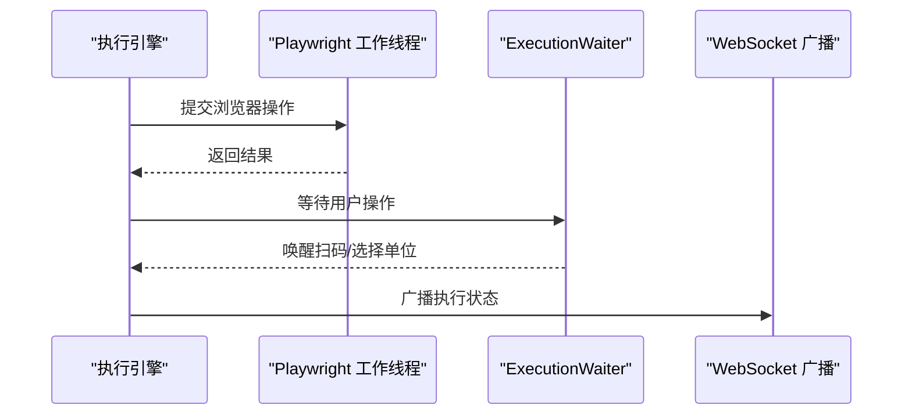

# 网络隔离与安全策略

<cite>
**本文引用的文件**
- [project.md](file://project.md)
- [main.py](file://CCC_RPA_API/app/main.py)
- [config.py](file://CCC_RPA_API/app/config.py)
- [docker-compose.yml](file://CCC-BrowserV4/docker-compose.yml)
- [session_manager.py](file://CCC_RPA_API/app/browser/session_manager.py)
- [site_automation.py](file://CCC_RPA_API/app/browser/site_automation.py)
- [executor.py](file://CCC_RPA_API/app/services/executor.py)
- [waiter.py](file://CCC_RPA_API/app/browser/waiter.py)
</cite>

## 目录
1. [简介](#简介)
2. [项目结构](#项目结构)
3. [核心组件](#核心组件)
4. [架构总览](#架构总览)
5. [组件详解](#组件详解)
6. [依赖关系分析](#依赖关系分析)
7. [性能考量](#性能考量)
8. [故障排查指南](#故障排查指南)
9. [结论](#结论)
10. [附录](#附录)

## 简介
本文件面向商用级 AI 浏览器系统的网络隔离与安全策略，结合仓库中已有的 K8s 沙箱会话设计文档与后端实现，系统阐述 NetworkPolicy 网络隔离机制、会话 Pod 的网络隔离策略（独立网络命名空间、IP 地址分配、DNS 解析隔离、端口访问控制）、网络安全最佳实践（最小权限原则、网络分段、流量加密、入侵检测），并提供 NetworkPolicy YAML 配置要点、网络故障排查方法、性能监控指标与安全审计日志建议，以及与代理池对接的出站 IP 绑定策略与连通性测试方法。

## 项目结构
本项目包含三层与三层之间的边界：
- 基础设施隔离层（K8s 容器编排、Linux Namespace/Cgroup、资源硬限制）
- Chromium 沙箱会话集群层（单会话 Pod、独立 UserData、CDP 通信、指纹伪装、代理绑定）
- 网关与多租户业务管理层（统一 API 入口、租户管理、RBAC 权限）

图表来源
- [project.md:907-917](file://project.md#L907-L917)
- [docker-compose.yml:1-21](file://CCC-BrowserV4/docker-compose.yml#L1-L21)

章节来源
- [project.md:907-917](file://project.md#L907-L917)
- [docker-compose.yml:1-21](file://CCC-BrowserV4/docker-compose.yml#L1-L21)

## 核心组件
- 会话 Pod 网络隔离：每个 Pod 独立网络命名空间、独立代理 IP、独立 DNS 缓存，确保 Pod 间无法互相访问。
- 会话生命周期与调度：调度中心分配 sessionId、空闲 CDP 端口，HPA 基于任务队列积压弹性扩缩容。
- 后端服务与数据库：FastAPI 提供 REST/WS 接口，MySQL 8.4 容器化部署，WebSocket 广播执行状态。
- 浏览器自动化与会话管理：Playwright 在专用工作线程中执行，按省份隔离会话，持久化 storage_state。

章节来源
- [project.md:917-917](file://project.md#L917-L917)
- [main.py:12-127](file://CCC_RPA_API/app/main.py#L12-L127)
- [config.py:6-22](file://CCC_RPA_API/app/config.py#L6-L22)
- [session_manager.py:10-186](file://CCC_RPA_API/app/browser/session_manager.py#L10-L186)

## 架构总览
下图展示 K8s 生产形态下的网络隔离与安全边界：API 网关仅与会话 Pod 通信，会话 Pod 之间通过 NetworkPolicy 互相隔离，出站流量经由代理池绑定独立出站 IP，数据库位于受控网络中。

图表来源
- [project.md:917-917](file://project.md#L917-L917)
- [docker-compose.yml:1-21](file://CCC-BrowserV4/docker-compose.yml#L1-L21)

## 组件详解

### NetworkPolicy 网络隔离机制
- Pod 间通信控制：通过 NetworkPolicy 严格限制 Pod 间的入站/出站流量，确保会话 Pod 之间无法互相访问。
- 入站/出站流量管理：API 网关仅允许来自前端/内部系统的入站请求；会话 Pod 仅允许访问代理池与数据库。
- 策略规则定义：基于 PodSelector 选择器精确限定目标 Pod；Ingress/Egress 规则结合端口与 CIDR 白名单实现最小权限访问。

图表来源
- [project.md:917-917](file://project.md#L917-L917)

章节来源
- [project.md:917-917](file://project.md#L917-L917)

### 会话 Pod 的网络隔离策略
- 独立网络命名空间：每个会话 Pod 拥有独立的网络命名空间，隔离接口、路由与防火墙规则。
- IP 地址分配：Pod 启动时由 K8s 分配独立 IP；结合代理池实现出站 IP 绑定。
- DNS 解析隔离：Pod 使用集群 DNS，必要时可配置自定义解析策略以降低跨域风险。
- 端口访问控制：CDP 调试端口按需暴露，且仅限内部访问；业务端口最小化开放。

图表来源
- [project.md:967-977](file://project.md#L967-L977)
- [project.md:999-1006](file://project.md#L999-L1006)

章节来源
- [project.md:967-977](file://project.md#L967-L977)
- [project.md:999-1006](file://project.md#L999-L1006)

### 网络安全最佳实践
- 最小权限原则：NetworkPolicy 仅放行必要 CIDR 与端口；API 与浏览器命名空间分离。
- 网络分段：前端/网关/浏览器/数据库分别置于不同命名空间，减少横向移动风险。
- 流量加密：内部服务间启用 mTLS 或 TLS；数据库连接使用加密通道。
- 入侵检测：结合网络镜像与 IDS/IPS，监控异常流量与端口扫描。

章节来源
- [project.md:917-917](file://project.md#L917-L917)

### NetworkPolicy YAML 配置示例（要点）
- PodSelector 选择器：精确选择 API、浏览器、数据库命名空间内的 Pod。
- Ingress 规则：允许前端/内部系统访问 API 网关；拒绝其他来源。
- Egress 规则：允许浏览器访问代理池与数据库；拒绝其他出口。
- CIDR 白名单：仅放行可信网段与代理池网段。

章节来源
- [project.md:917-917](file://project.md#L917-L917)

### 与代理池对接的网络配置
- 出站 IP 绑定策略：会话 Pod 通过代理池实现独立出站 IP，避免被目标站点关联。
- 代理池高可用：代理池具备健康检查与故障转移，保障会话稳定性。
- 端口与路由：代理池端口仅对浏览器命名空间开放，防止越权访问。

章节来源
- [project.md:917-917](file://project.md#L917-L917)

### 网络连通性测试方法
- Pod 间连通性：使用临时 BusyBox Pod 进行跨命名空间连通性测试，验证 NetworkPolicy 放行/阻断效果。
- 出站 IP 校验：在会话 Pod 内部发起请求，抓包或调用回显服务验证出站 IP。
- DNS 解析验证：确认 Pod 使用集群 DNS，必要时验证自定义解析策略生效。

章节来源
- [project.md:917-917](file://project.md#L917-L917)

## 依赖关系分析
后端服务与数据库的关系如下：

图表来源
- [main.py:12-127](file://CCC_RPA_API/app/main.py#L12-L127)
- [config.py:6-22](file://CCC_RPA_API/app/config.py#L6-L22)
- [session_manager.py:10-186](file://CCC_RPA_API/app/browser/session_manager.py#L10-L186)
- [site_automation.py:16-200](file://CCC_RPA_API/app/browser/site_automation.py#L16-L200)
- [executor.py:17-200](file://CCC_RPA_API/app/services/executor.py#L17-L200)

章节来源
- [main.py:12-127](file://CCC_RPA_API/app/main.py#L12-L127)
- [config.py:6-22](file://CCC_RPA_API/app/config.py#L6-L22)
- [session_manager.py:10-186](file://CCC_RPA_API/app/browser/session_manager.py#L10-L186)
- [site_automation.py:16-200](file://CCC_RPA_API/app/browser/site_automation.py#L16-L200)
- [executor.py:17-200](file://CCC_RPA_API/app/services/executor.py#L17-L200)

## 性能考量
- 资源硬限制：每个会话 Pod CPU 0.5–1 核、内存 1–2Gi，避免资源争用。
- HPA 弹性扩缩：根据任务队列长度自动扩容，闲置超时自动销毁，回收代理 IP。
- 监控与告警：Prometheus+Grafana 监控 CPU/内存/网络指标，异常自动告警。

章节来源
- [project.md:911-916](file://project.md#L911-L916)
- [project.md:975-975](file://project.md#L975-L975)

## 故障排查指南
- WebSocket 广播异常：检查主事件循环状态与广播路径，确保在非 asyncio 线程中通过安全接口广播。
- Playwright 线程安全：所有浏览器操作通过专用工作线程执行，避免多线程冲突。
- 会话恢复：浏览器崩溃时自动恢复，重新打开页面并保存状态。
- 数据库连接：确认 .env 配置与容器端口映射正确，必要时重启 MySQL 容器。

图表来源
- [executor.py:22-76](file://CCC_RPA_API/app/services/executor.py#L22-L76)
- [waiter.py:14-84](file://CCC_RPA_API/app/browser/waiter.py#L14-L84)
- [main.py:119-127](file://CCC_RPA_API/app/main.py#L119-L127)

章节来源
- [executor.py:22-76](file://CCC_RPA_API/app/services/executor.py#L22-L76)
- [waiter.py:14-84](file://CCC_RPA_API/app/browser/waiter.py#L14-L84)
- [main.py:119-127](file://CCC_RPA_API/app/main.py#L119-L127)

## 结论
通过 NetworkPolicy 实现的严格网络隔离、独立会话 Pod 的多维隔离（文件/网络/进程/浏览器存储/指纹/插件）与代理池出站 IP 绑定，能够有效降低跨会话数据泄露与风控关联风险。结合最小权限原则、网络分段、流量加密与入侵检测，可构建满足商用级要求的安全可控的 AI 浏览器系统。

## 附录
- NetworkPolicy 配置要点：选择器、Ingress/Egress、CIDR 白名单、最小权限放行。
- 会话生命周期：pending→running→idle→timeout/crash，销毁时归还代理 IP、清理 UserData。
- 隔离验收标准：Cookie/LocastStorage 互不可读、出站 IP 独立、会话崩溃不影响其他会话。

章节来源
- [project.md:917-917](file://project.md#L917-L917)
- [project.md:987-991](file://project.md#L987-L991)
- [project.md:1376-1384](file://project.md#L1376-L1384)