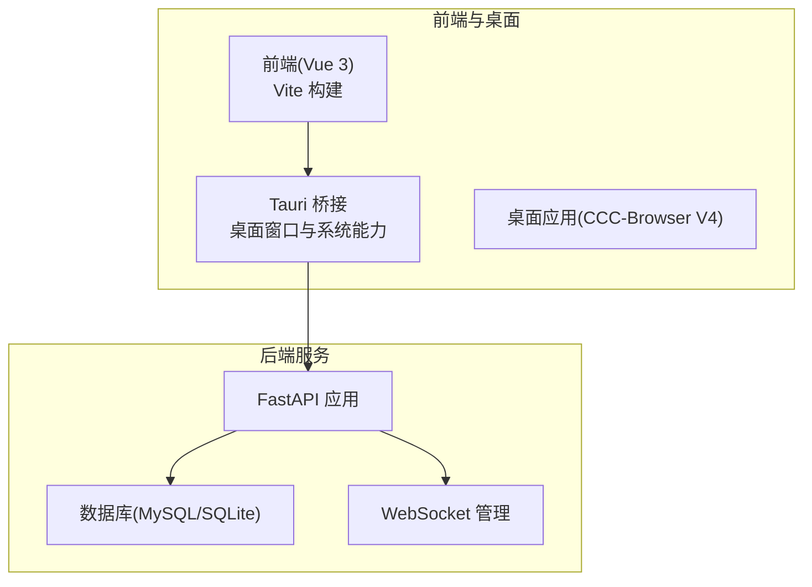
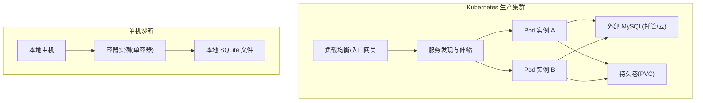
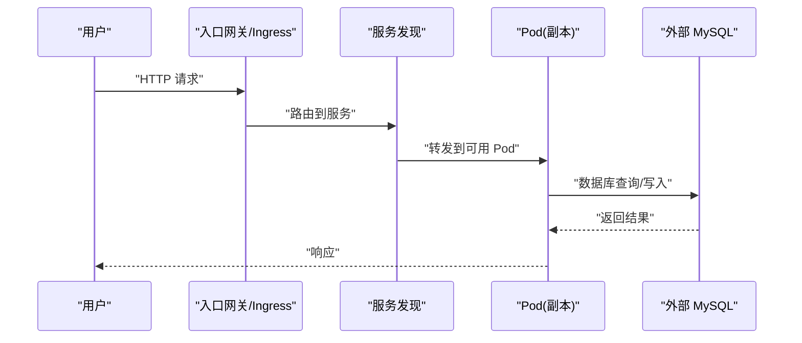
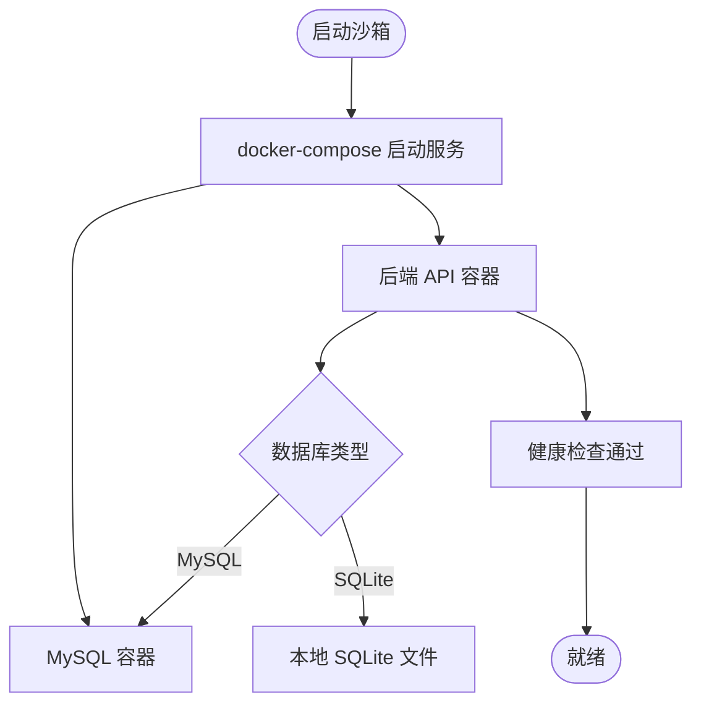
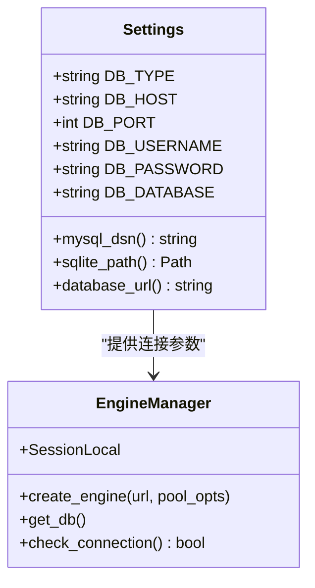
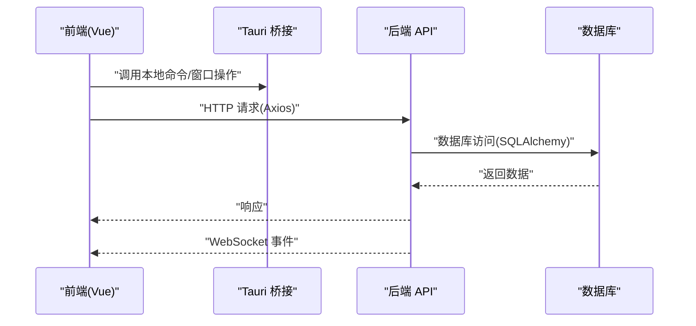
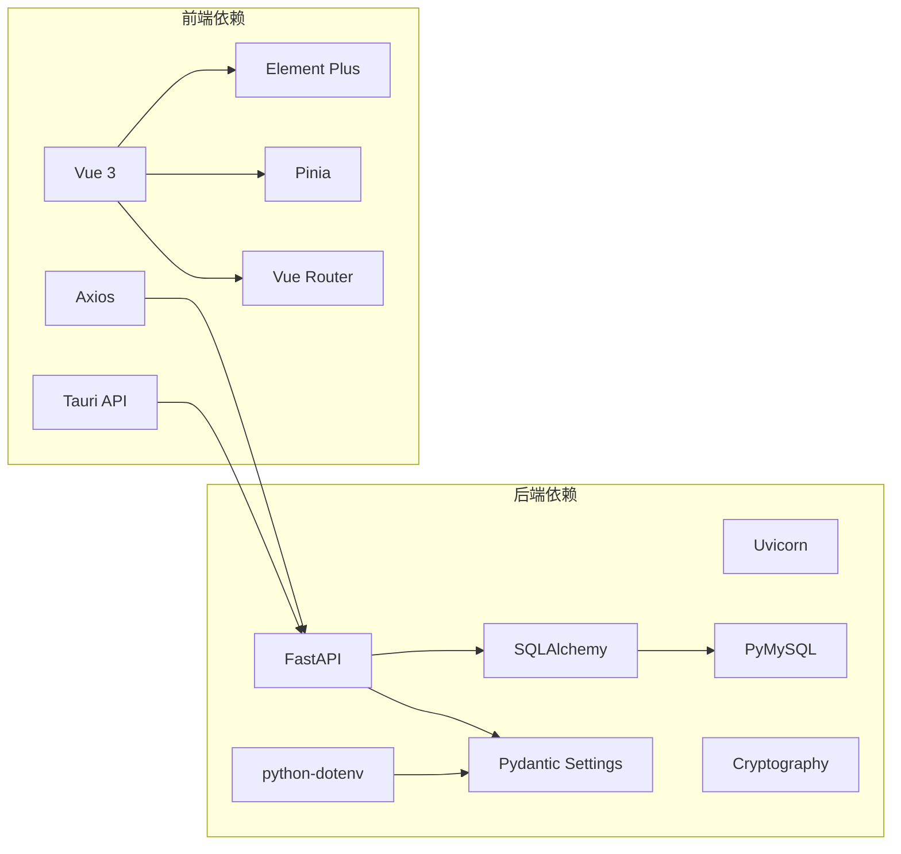

# 两种标准化部署形态

<cite>
**本文引用的文件**
- [docker-compose.yml](file://CCC-BrowserV4/docker-compose.yml)
- [requirements.txt](file://CCC-BrowserV4/backend/requirements.txt)
- [config.py](file://CCC-BrowserV4/backend/app/config.py)
- [database.py](file://CCC-BrowserV4/backend/app/database.py)
- [tauri.conf.json](file://CCC-BrowserV4/src-tauri/tauri.conf.json)
- [package.json](file://CCC-BrowserV4/frontend/package.json)
- [main.py](file://CCC_RPA_API/app/main.py)
- [requirements.txt](file://CCC_RPA_API/requirements.txt)
- [config.py](file://CCC_RPA_API/app/config.py)
- [database.py](file://CCC_RPA_API/app/database.py)
</cite>

## 目录
1. [引言](#引言)
2. [项目结构](#项目结构)
3. [核心组件](#核心组件)
4. [架构总览](#架构总览)
5. [详细组件分析](#详细组件分析)
6. [依赖分析](#依赖分析)
7. [性能考虑](#性能考虑)
8. [故障排查指南](#故障排查指南)
9. [结论](#结论)
10. [附录](#附录)

## 引言
本文件面向商用级 AI 浏览器系统的部署工程师与平台运维人员，系统性阐述两种标准化部署形态：Kubernetes 容器分布式集群（商用生产环境）与单机进程级沙箱（内部测试环境）。文档将结合仓库中的现有配置与实现，说明技术实现要点、资源配置、扩展能力与适用场景，并给出可落地的部署配置示例与最佳实践建议。

## 项目结构
本仓库包含两个主要子系统：
- 前端与桌面应用：基于 Vue 3 + Tauri 的桌面客户端，前端通过 Vite 构建，Tauri 负责桥接系统能力与打包。
- 后端服务：FastAPI 应用，提供 API、WebSocket、任务执行与浏览器自动化能力；数据库支持 MySQL 与 SQLite。

**章节来源**
- [package.json:1-29](file://CCC-BrowserV4/frontend/package.json#L1-L29)
- [tauri.conf.json:1-29](file://CCC-BrowserV4/src-tauri/tauri.conf.json#L1-L29)
- [requirements.txt:1-13](file://CCC-BrowserV4/backend/requirements.txt#L1-L13)

## 核心组件
- 配置管理：统一使用 Pydantic Settings 从 .env 与环境变量加载配置，支持 MySQL 与 SQLite 双模式切换。
- 数据库层：基于 SQLAlchemy，提供连接池参数化与连接健康检查。
- 健康检查：提供基础健康检查接口，便于编排系统探测。
- 前端与桌面：Vue 3 + Element Plus + Pinia + Vue Router，Tauri 提供本地命令与窗口配置。

**章节来源**
- [config.py:1-52](file://CCC-BrowserV4/backend/app/config.py#L1-L52)
- [database.py:1-45](file://CCC-BrowserV4/backend/app/database.py#L1-L45)
- [config.py:1-52](file://CCC_RPA_API/app/config.py#L1-L52)
- [database.py:1-45](file://CCC_RPA_API/app/database.py#L1-L45)

## 架构总览
下图展示了两种部署形态的总体架构差异与关键组件交互：

## 详细组件分析

### 形态一：Kubernetes 容器分布式集群（商用生产环境）
- 技术实现
  - 使用容器镜像运行 FastAPI 应用，配合 Nginx 或 Ingress 作为入口网关。
  - 数据库采用外部托管 MySQL，确保高可用与备份策略。
  - 使用 ConfigMap/Secret 管理配置与密钥，避免硬编码。
  - 通过 Deployment/StatefulSet 控制副本数与状态持久化，结合 HPA/LPA 实现弹性伸缩。
  - 使用 PersistentVolume/PersistentVolumeClaim 存储日志与临时数据。
- 资源配置
  - CPU/内存请求与限制：建议为 API 服务设置合理的 requests/limits，避免资源争抢。
  - 并发与连接池：依据并发峰值与数据库连接池上限进行调优。
- 扩展能力
  - 水平扩展：通过增加副本数提升吞吐；注意无状态设计与会话管理策略。
  - 垂直扩展：根据业务增长调整节点规格或资源配额。
- 适用场景
  - 多租户、高并发、SLA 要求高的商用环境。
  - 需要与企业 IAM、审计、监控体系集成。
- 关键特性映射
  - 编排与调度：Deployment/StatefulSet + Service + Ingress。
  - 资源限制：requests/limits + PodDisruptionBudget。
  - 弹性扩缩容：HPA/LPA + 自动伸缩策略。
  - 健康检查：readiness/liveness 探针对接健康检查接口。
  - 配置与密钥：ConfigMap/Secret 注入。
  - 存储：PVC + PV，按需选择块存储或对象存储。

### 形态二：单机进程级沙箱（内部测试环境）
- 技术实现
  - 使用 docker-compose 在单机启动后端服务与 MySQL，便于快速验证功能。
  - 默认使用 SQLite 以降低依赖复杂度，适合开发与测试。
  - 通过环境变量与 .env 文件控制配置，便于在不同环境间切换。
- 资源配置
  - 单机资源有限，建议限制容器资源使用，避免影响宿主机性能。
  - 数据库存储在宿主机卷中，便于持久化与备份。
- 扩展能力
  - 该形态不建议用于生产，主要用于本地开发与小规模测试。
- 适用场景
  - 开发联调、单元测试、演示与 PoC 场景。
- 关键特性映射
  - 容器编排：docker-compose 管理多服务编排。
  - 资源限制：可通过 compose 的 deploy 字段设置资源限制。
  - 弹性扩缩容：compose 不提供自动扩缩容，需手动调整副本数。
  - 健康检查：可在 compose 中定义 healthcheck。
  - 配置与密钥：通过环境变量与卷挂载注入。

**图表来源**
- [docker-compose.yml:1-21](file://CCC-BrowserV4/docker-compose.yml#L1-L21)
- [config.py:18-47](file://CCC-BrowserV4/backend/app/config.py#L18-L47)

**章节来源**
- [docker-compose.yml:1-21](file://CCC-BrowserV4/docker-compose.yml#L1-L21)
- [config.py:18-47](file://CCC-BrowserV4/backend/app/config.py#L18-L47)
- [database.py:8-22](file://CCC-BrowserV4/backend/app/database.py#L8-L22)

### 组件关系与数据流（后端）
- 配置与数据库层：配置类负责解析数据库类型与连接参数，数据库层根据配置创建引擎与会话工厂。
- 健康检查：提供连接检查函数，便于编排系统进行存活/就绪探针。
- 前端与桌面：前端通过 Axios 发起 API 请求，Tauri 提供本地命令桥接，窗口 CSP 限制了允许的连接域。

**图表来源**
- [config.py:9-51](file://CCC-BrowserV4/backend/app/config.py#L9-L51)
- [database.py:8-44](file://CCC-BrowserV4/backend/app/database.py#L8-L44)

**章节来源**
- [config.py:9-51](file://CCC-BrowserV4/backend/app/config.py#L9-L51)
- [database.py:8-44](file://CCC-BrowserV4/backend/app/database.py#L8-L44)

### 前端与桌面集成
- 前端技术栈：Vue 3 + Element Plus + Pinia + Vue Router，通过 Vite 构建与开发。
- 桌面集成：Tauri 配置包含窗口尺寸、最小尺寸、安全策略（CSP）、开发/构建脚本等。
- API 通信：前端通过 Axios 访问后端 API，WebSocket 用于实时事件推送。

**图表来源**
- [package.json:6-20](file://CCC-BrowserV4/frontend/package.json#L6-L20)
- [tauri.conf.json:6-26](file://CCC-BrowserV4/src-tauri/tauri.conf.json#L6-L26)

**章节来源**
- [package.json:6-20](file://CCC-BrowserV4/frontend/package.json#L6-L20)
- [tauri.conf.json:6-26](file://CCC-BrowserV4/src-tauri/tauri.conf.json#L6-L26)

## 依赖分析
- 后端依赖：FastAPI、Uvicorn、SQLAlchemy、PyMySQL、Cryptography、Pydantic Settings、python-dotenv。
- 前端依赖：Vue 3、Element Plus、Pinia、Vue Router、Axios、@tauri-apps/api。
- 数据库支持：MySQL 与 SQLite 双模式，通过配置切换。

**图表来源**
- [requirements.txt:2-12](file://CCC-BrowserV4/backend/requirements.txt#L2-L12)
- [package.json:12-20](file://CCC-BrowserV4/frontend/package.json#L12-L20)

**章节来源**
- [requirements.txt:2-12](file://CCC-BrowserV4/backend/requirements.txt#L2-L12)
- [package.json:12-20](file://CCC-BrowserV4/frontend/package.json#L12-L20)

## 性能考虑
- 连接池优化：根据并发量与数据库性能调优 pool_size 与 max_overflow，启用 pool_pre_ping 与 recycle。
- 健康检查：合理设置探针间隔与超时，避免误判导致频繁重启。
- 资源配额：在 Kubernetes 中为 API 服务设置 requests/limits，防止资源争抢。
- 存储策略：生产环境优先使用外部 MySQL，沙箱环境可使用 SQLite 降低复杂度。
- 前端性能：Vite 构建优化、按需加载与缓存策略，减少首屏时间。

## 故障排查指南
- 数据库连接失败
  - 检查 DB_TYPE 与连接参数是否正确，确认网络连通性与凭据。
  - 使用连接检查函数验证数据库可达性。
- 健康检查异常
  - 确认健康检查接口可用，查看探针配置与日志。
- 前端无法访问后端
  - 检查 Tauri CSP 配置与后端 CORS 设置，确保域名与端口匹配。
- 容器资源不足
  - 在 Kubernetes 中调整 requests/limits，在沙箱中限制容器资源使用。

**章节来源**
- [database.py:37-44](file://CCC-BrowserV4/backend/app/database.py#L37-L44)
- [config.py:18-47](file://CCC-BrowserV4/backend/app/config.py#L18-L47)
- [tauri.conf.json:24-26](file://CCC-BrowserV4/src-tauri/tauri.conf.json#L24-L26)

## 结论
- 生产环境推荐采用 Kubernetes 容器化部署，具备高可用、弹性扩缩容与企业级可观测性。
- 测试环境可采用 docker-compose 单机沙箱，快速搭建与验证功能。
- 配置与数据库层设计支持双模式切换，便于在不同环境灵活部署。
- 建议在生产中完善监控、日志与备份策略，确保业务连续性。

## 附录
- 部署配置示例与最佳实践
  - 生产环境
    - 使用 Helm/Kustomize 管理清单，分离开发/测试/生产命名空间。
    - 将敏感信息放入 Secret，非敏感配置放入 ConfigMap。
    - 为 API 服务设置 HPA，依据 CPU/自定义指标触发扩缩容。
    - 使用 Ingress 控制器暴露服务，开启 TLS 与 WAF。
  - 沙箱环境
    - 使用 docker-compose 启动后端与 MySQL，挂载持久卷。
    - 通过环境变量切换 DB_TYPE 与数据库地址，便于本地调试。
    - 在 compose 中添加 healthcheck，确保服务自愈。
  - 前端与桌面
    - 前端构建产物指向 Tauri 的 dist 目录，确保开发与生产一致。
    - Tauri CSP 严格限制连接域，避免安全风险。